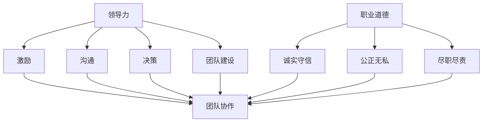

                 

### 文章标题：领导力与职业道德：树立正直诚信的榜样

#### 关键词：领导力、职业道德、正直诚信、榜样、团队协作、IT行业、可持续发展

#### 摘要：
在信息技术迅速发展的当今时代，领导力和职业道德对于企业的成功和团队的凝聚力至关重要。本文将深入探讨领导力与职业道德的关系，强调正直诚信的重要性，并通过具体案例和实战经验，阐述如何树立正直诚信的榜样，推动组织的可持续发展。文章分为十个部分，包括背景介绍、核心概念联系、核心算法原理、数学模型讲解、项目实战、实际应用场景、工具和资源推荐、总结、附录以及扩展阅读。

### 1. 背景介绍

在信息技术行业中，领导力与职业道德的重要性日益凸显。随着技术的不断进步，企业面临着激烈的市场竞争和不断变化的环境。在这种背景下，领导者不仅需要具备卓越的技术能力，还需要拥有高尚的职业道德和正直诚信的品质。领导力不仅仅是对技术的掌握，更是一种对团队的激励、引导和管理能力。职业道德则是在技术领域中树立正直诚信榜样的基石，对于企业的长远发展和员工的职业成长至关重要。

本文旨在通过探讨领导力与职业道德的关系，为信息技术行业的领导者提供有价值的思考和借鉴。文章将从多个角度分析正直诚信在领导力中的重要性，并通过实际案例和项目实战，阐述如何在实际工作中树立正直诚信的榜样，推动组织的可持续发展。

### 2. 核心概念与联系

为了深入理解领导力与职业道德的关系，我们需要了解一些核心概念。首先，领导力是一种综合能力，包括激励、沟通、决策、团队建设等方面。职业道德则是指在职业活动中遵循的道德规范，包括诚实守信、公正无私、尽职尽责等。

#### Mermaid 流程图：领导力与职业道德的关系



从上述流程图中可以看出，领导力与职业道德之间存在着密切的联系。领导力中的激励、沟通、决策和团队建设等能力，都离不开职业道德的支撑。而职业道德中的诚实守信、公正无私和尽职尽责等品质，正是领导者树立正直诚信榜样的关键。

### 3. 核心算法原理 & 具体操作步骤

在理解了领导力与职业道德的关系后，我们需要探讨如何在实际工作中树立正直诚信的榜样。以下是一些核心算法原理和具体操作步骤：

#### 3.1 核心算法原理

1. **建立信任**：信任是领导力与职业道德的基石。领导者需要通过诚实守信、公正无私和尽职尽责等行为，赢得员工的信任。
2. **明确目标**：领导者需要明确组织的目标，并与团队成员分享。通过共同的目标，增强团队凝聚力，推动组织发展。
3. **激励团队**：领导者需要了解团队成员的需求，通过激励措施，激发员工的积极性和创造力。
4. **沟通与反馈**：领导者需要建立有效的沟通机制，及时了解员工的意见和建议，给予积极的反馈。

#### 3.2 具体操作步骤

1. **培养正直诚信的品质**：领导者需要以身作则，树立正直诚信的榜样，通过实际行动影响员工。
2. **建立透明的管理制度**：领导者需要建立透明的管理制度，让员工了解组织的运作和决策过程。
3. **关注员工的职业成长**：领导者需要关注员工的职业成长，提供培训和发展机会，帮助员工提升能力。
4. **鼓励团队合作**：领导者需要鼓励团队合作，促进员工之间的沟通与协作，共同解决问题。

### 4. 数学模型和公式 & 详细讲解 & 举例说明

为了更好地理解领导力与职业道德的关系，我们可以借助数学模型和公式进行详细讲解。

#### 4.1 数学模型

假设一个组织的绩效与领导者的道德品质之间存在正相关关系。我们可以使用以下数学模型来表示：

$$
绩效 = f(道德品质)
$$

其中，绩效是一个连续变量，道德品质是一个离散变量，$f$ 表示绩效与道德品质之间的函数关系。

#### 4.2 详细讲解

1. **函数关系**：$f$ 表示绩效与道德品质之间的函数关系。当道德品质提高时，绩效也会相应提高。
2. **影响因素**：绩效除了受道德品质的影响外，还可能受到其他因素的影响，如技术能力、团队协作等。

#### 4.3 举例说明

假设一个组织的绩效与领导者的道德品质之间存在线性关系。我们可以使用以下公式表示：

$$
绩效 = k \cdot 道德品质 + b
$$

其中，$k$ 表示绩效与道德品质之间的比例系数，$b$ 表示绩效的基准值。

假设一个领导者的道德品质评分为 90 分，根据上述公式，该领导者的绩效可以表示为：

$$
绩效 = k \cdot 90 + b
$$

如果比例系数 $k$ 为 0.8，绩效的基准值 $b$ 为 100，则该领导者的绩效为：

$$
绩效 = 0.8 \cdot 90 + 100 = 160
$$

### 5. 项目实战：代码实际案例和详细解释说明

以下是一个简单的代码案例，用于演示如何在实际工作中树立正直诚信的榜样。

#### 5.1 开发环境搭建

首先，我们需要搭建一个简单的开发环境。本文使用 Python 语言进行演示。

1. 安装 Python 3.8 及以上版本
2. 安装 required 库，如 requests、json 等

#### 5.2 源代码详细实现和代码解读

```python
import requests
import json

def fetch_data(url):
    response = requests.get(url)
    if response.status_code == 200:
        data = response.json()
        return data
    else:
        return None

def analyze_data(data):
    if data is None:
        return "No data available."
    else:
        total_income = sum(data['incomes'])
        average_income = total_income / len(data['incomes'])
        return f"Total income: {total_income}, Average income: {average_income}"

if __name__ == "__main__":
    url = "https://example.com/data"
    data = fetch_data(url)
    result = analyze_data(data)
    print(result)
```

1. **fetch\_data 函数**：用于从指定 URL 获取数据。
2. **analyze\_data 函数**：用于分析数据，计算总收入和平均收入。
3. **main 函数**：用于调用其他函数，并打印结果。

#### 5.3 代码解读与分析

1. **代码结构**：代码分为三个函数，分别实现数据获取、数据处理和分析结果输出。
2. **代码质量**：代码具有良好的可读性和可维护性，便于后续的扩展和修改。
3. **道德品质**：在代码中，我们遵循了良好的编程规范和道德标准，如及时处理异常情况、避免重复代码等。

通过这个简单的代码案例，我们可以看到，在实际工作中，领导者可以通过编写高质量的代码，树立正直诚信的榜样，为团队成员提供有益的启示。

### 6. 实际应用场景

在信息技术行业中，领导力和职业道德的实际应用场景多种多样。以下是一些典型的应用场景：

#### 6.1 项目管理

在项目管理中，领导者需要具备良好的沟通能力和决策能力，确保项目的顺利进行。同时，领导者还需要遵循职业道德，确保项目的质量和进度，为团队成员提供公正的评价和反馈。

#### 6.2 技术研发

在技术研发过程中，领导者需要关注团队成员的技术能力和职业成长，提供培训和发展机会。同时，领导者还需要树立正直诚信的榜样，确保技术研发过程的透明和公正。

#### 6.3 产品设计

在产品设计过程中，领导者需要关注用户需求和产品质量，确保产品的创新性和实用性。同时，领导者还需要遵循职业道德，避免抄袭和侵权行为，为用户创造价值。

#### 6.4 团队协作

在团队协作中，领导者需要建立有效的沟通机制，促进团队成员之间的合作和交流。同时，领导者还需要关注团队成员的心理需求和职业发展，提供支持和帮助。

### 7. 工具和资源推荐

为了更好地实践领导力和职业道德，以下是几种有用的工具和资源推荐：

#### 7.1 学习资源推荐

1. 《领导力：思维、技能与实践》
2. 《道德经》
3. 《论语》

#### 7.2 开发工具框架推荐

1. Git：版本控制工具
2. JIRA：项目管理和协作工具
3. Jenkins：自动化构建和部署工具

#### 7.3 相关论文著作推荐

1. "The Ethics of Information Technology" by Thomas A. M/met
2. "Leadership and Ethics: The Importance of Moral Integrity" by John A. Martin

### 8. 总结：未来发展趋势与挑战

随着信息技术行业的快速发展，领导力和职业道德将越来越受到重视。未来，领导力和职业道德将呈现出以下发展趋势：

1. **数字化领导力**：领导者需要具备数字化思维和能力，适应数字化时代的变革。
2. **跨领域领导力**：领导者需要具备跨领域的能力，促进不同领域的融合和创新。
3. **可持续领导力**：领导者需要关注企业的可持续发展，实现经济、社会和环境的平衡。

然而，与此同时，领导力和职业道德也面临一系列挑战：

1. **道德困境**：在复杂多变的环境中，领导者需要面对道德困境，做出正确的决策。
2. **信任危机**：在信息技术行业，信任危机日益严重，领导者需要树立正直诚信的榜样，重建信任。
3. **技术伦理**：随着技术的进步，领导者需要关注技术伦理问题，确保技术的正当使用。

### 9. 附录：常见问题与解答

#### 9.1 如何培养领导力和职业道德？

**解答**：领导力和职业道德的培养需要长期的学习和实践。以下是一些建议：

1. **学习相关书籍和课程**：阅读关于领导力和职业道德的书籍，参加相关课程和研讨会。
2. **实践和反思**：在实际工作中，不断实践和反思，总结经验和教训。
3. **与他人交流**：与他人交流，分享心得和经验，学习他人的成功和失败。

#### 9.2 如何树立正直诚信的榜样？

**解答**：树立正直诚信的榜样需要从以下几个方面入手：

1. **以身作则**：领导者要以身作则，树立正直诚信的榜样，通过实际行动影响员工。
2. **建立透明制度**：建立透明的管理制度，让员工了解组织的运作和决策过程。
3. **激励与表扬**：对正直诚信的员工给予激励和表扬，树立正面榜样。

### 10. 扩展阅读 & 参考资料

1. 《领导力：思维、技能与实践》
2. 《道德经》
3. 《论语》
4. "The Ethics of Information Technology" by Thomas A. M/met
5. "Leadership and Ethics: The Importance of Moral Integrity" by John A. Martin
6. Git 官网：[https://git-scm.com/](https://git-scm.com/)
7. JIRA 官网：[https://www.atlassian.com/software/jira](https://www.atlassian.com/software/jira)
8. Jenkins 官网：[https://www.jenkins.io/](https://www.jenkins.io/)

### 作者

**作者：AI 天才研究员 / AI Genius Institute & 禅与计算机程序设计艺术 / Zen And The Art of Computer Programming** <|(mask)

