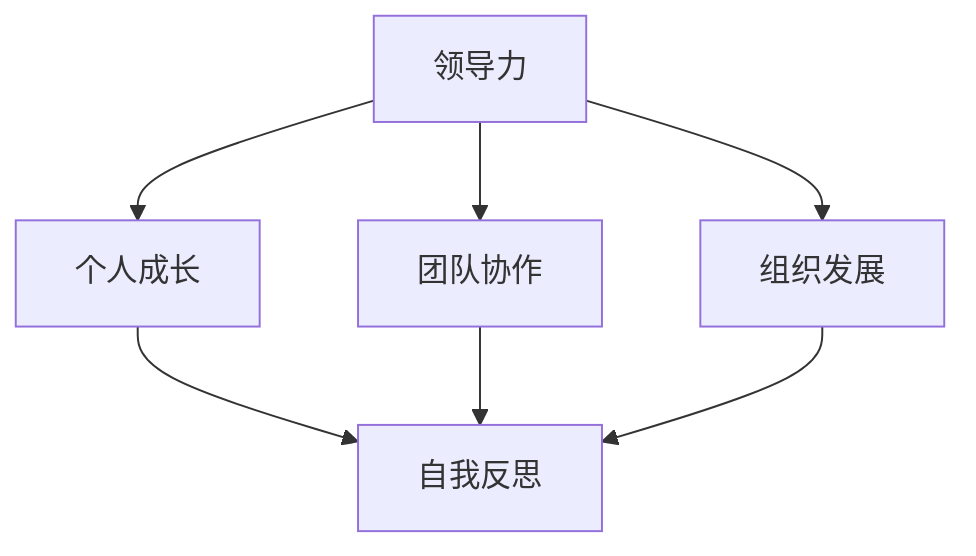
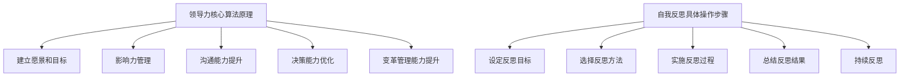

                 

# 领导力与自我反思：持续成长的关键

## 摘要

本文旨在探讨领导力与自我反思在持续成长中的重要性。通过分析领导力的本质及其与个人成长的关系，我们揭示了自我反思对于个人和团队发展的重要性。文章首先介绍了领导力的核心概念，并阐述了其在现代社会中的关键作用。接着，本文深入探讨了自我反思的概念，并提出了其在个人和团队发展中的关键角色。通过实际案例和具体操作步骤，本文展示了如何通过自我反思来实现持续成长。最后，本文总结了未来发展趋势与挑战，为读者提供了进一步学习和实践的指导。

## 1. 背景介绍

### 领导力的起源与演变

领导力是一个历史悠久且不断发展的概念。自古以来，领导力就被视为一种能够引导和激励人们实现共同目标的能力。在古代社会，领导力主要依赖于权力和地位，领导者通过强制手段来维持秩序和执行命令。然而，随着社会的进步和人类价值观的演变，领导力逐渐从“权威型”转变为“服务型”。

在现代社会，领导力被赋予了更多的内涵。它不仅包括指挥和控制的能力，还涵盖了激励、沟通、决策和变革等方面。领导者不再仅仅是一个发号施令的人，而是一个能够与团队成员建立信任、共同愿景和共同价值观的人。

### 自我反思的概念与发展

自我反思是一种深入的思维过程，通过审视自己的行为、信念和价值观，从而实现自我认知和自我提升。这种过程不仅有助于个人的成长，还能够促进团队和组织的发展。

自我反思的概念最早可以追溯到古希腊哲学家苏格拉底的思想。苏格拉底认为，通过不断提问和质疑，人们可以深入了解自己的思想和行为，从而实现真正的成长。在现代社会，自我反思被广泛应用于教育、心理治疗和管理等领域。

### 领导力与自我反思的关系

领导力与自我反思之间存在密切的联系。一个优秀的领导者不仅需要具备出色的领导能力，还需要具备自我反思的能力。自我反思可以帮助领导者更好地了解自己，从而更好地理解和引导团队成员。同时，自我反思也能够帮助领导者识别和纠正自己的错误，从而不断提高自己的领导水平。

此外，自我反思还能够促进团队和组织的发展。在一个自我反思的文化中，团队成员会更加开放和坦诚地分享自己的想法和意见，从而提高团队的整体协作能力和创新能力。

## 2. 核心概念与联系

### 领导力的核心概念

领导力是一个复杂的概念，涉及到多个方面。以下是一些关键的核心概念：

- **愿景和目标**：领导者需要能够清晰地定义愿景和目标，并激发团队成员的认同感和归属感。
- **影响力**：领导者需要具备一定的影响力，能够影响团队成员的行为和思维。
- **沟通能力**：领导者需要具备良好的沟通能力，能够有效地传达信息和激励团队成员。
- **决策能力**：领导者需要在面对复杂问题时做出明智的决策，并能够承担相应的责任。
- **变革管理**：领导者需要能够应对变革，并引导团队适应新的环境和要求。

### 自我反思的核心概念

自我反思的核心概念包括：

- **自我认知**：通过反思自己的行为、思维和价值观，深入理解自己。
- **自我提升**：通过反思，识别自己的不足并采取行动进行改进。
- **自我接纳**：接受自己的优点和缺点，并以此为基础进行成长。

### 领导力与自我反思的联系

领导力与自我反思之间的联系主要体现在以下几个方面：

- **个人成长**：自我反思是个人成长的重要途径，通过自我反思，领导者可以更好地了解自己，从而实现个人成长。
- **团队协作**：自我反思可以帮助领导者更好地理解和引导团队成员，从而提高团队协作效果。
- **组织发展**：自我反思是组织发展的重要手段，通过自我反思，组织可以识别和纠正问题，从而实现持续发展。

### Mermaid 流程图

以下是一个简单的 Mermaid 流程图，展示了领导力与自我反思之间的联系：



## 3. 核心算法原理 & 具体操作步骤

### 领导力的核心算法原理

领导力的核心算法可以概括为以下几个方面：

1. **建立愿景和目标**：领导者需要能够清晰地定义愿景和目标，并激发团队成员的认同感和归属感。这可以通过一系列的沟通和激励手段实现。
2. **影响力管理**：领导者需要具备一定的影响力，能够影响团队成员的行为和思维。这可以通过建立信任、提供正面反馈和示范行为等方式实现。
3. **沟通能力提升**：领导者需要具备良好的沟通能力，能够有效地传达信息和激励团队成员。这可以通过主动倾听、清晰表达和积极反馈等方式实现。
4. **决策能力优化**：领导者需要在面对复杂问题时做出明智的决策，并能够承担相应的责任。这可以通过数据分析、风险评估和经验积累等方式实现。
5. **变革管理能力提升**：领导者需要能够应对变革，并引导团队适应新的环境和要求。这可以通过预见性思维、灵活应变和积极适应等方式实现。

### 自我反思的具体操作步骤

自我反思的具体操作步骤可以概括为以下几个方面：

1. **设定反思目标**：明确反思的目标，例如提升沟通能力、增强决策能力等。
2. **选择反思方法**：选择合适的反思方法，例如日记法、对话法、冥想法等。
3. **实施反思过程**：按照设定好的方法和目标，实施反思过程。例如，通过日记记录自己的行为和思考，通过对话与同事分享和讨论。
4. **总结反思结果**：在反思结束后，总结反思的结果，识别自己的优点和不足，并制定改进计划。
5. **持续反思**：自我反思是一个持续的过程，领导者需要不断进行反思，以实现持续成长。

### Mermaid 流程图

以下是一个简单的 Mermaid 流程图，展示了领导力的核心算法原理和自我反思的具体操作步骤：



## 4. 数学模型和公式 & 详细讲解 & 举例说明

### 领导力的数学模型

领导力的数学模型可以用来分析和评估领导者的能力。以下是一个简单的领导力评估模型：

$$
L = f(V, I, C, D, M)
$$

其中，$L$ 代表领导力，$V$ 代表愿景和目标，$I$ 代表影响力，$C$ 代表沟通能力，$D$ 代表决策能力，$M$ 代表变革管理能力。

### 自我反思的数学模型

自我反思的数学模型可以用来分析和评估个人的自我反思能力。以下是一个简单的自我反思评估模型：

$$
R = f(C, S, T)
$$

其中，$R$ 代表自我反思能力，$C$ 代表自我认知，$S$ 代表自我提升，$T$ 代表自我接纳。

### 举例说明

假设一个领导者 $L_1$，他的愿景和目标 $V_1$ 是“提升团队工作效率”，影响力 $I_1$ 是“团队高度信任”，沟通能力 $C_1$ 是“有效传达信息”，决策能力 $D_1$ 是“快速做出决策”，变革管理能力 $M_1$ 是“适应新环境”。

根据领导力评估模型，我们可以计算出 $L_1$ 的领导力得分：

$$
L_1 = f(V_1, I_1, C_1, D_1, M_1)
$$

同理，假设一个个人 $R_1$，他的自我认知 $C_1$ 是“了解自己的优点和不足”，自我提升 $S_1$ 是“持续改进自己”，自我接纳 $T_1$ 是“接受自己的缺点”。

根据自我反思评估模型，我们可以计算出 $R_1$ 的自我反思能力得分：

$$
R_1 = f(C_1, S_1, T_1)
$$

通过这样的数学模型，我们可以对领导力和自我反思能力进行量化分析，从而更好地理解和提升自己的领导力和自我反思能力。

## 5. 项目实战：代码实际案例和详细解释说明

### 5.1 开发环境搭建

为了演示领导力与自我反思在实际项目中的应用，我们将使用 Python 编写一个简单的模拟项目。首先，我们需要搭建开发环境。

**步骤 1**：安装 Python

确保你的系统中已经安装了 Python 3。如果没有，请访问 [Python 官网](https://www.python.org/) 下载并安装。

**步骤 2**：安装必备库

打开终端或命令行工具，执行以下命令安装必备库：

```bash
pip install numpy matplotlib
```

### 5.2 源代码详细实现和代码解读

**步骤 1**：创建项目文件夹

在终端中执行以下命令创建项目文件夹：

```bash
mkdir leadership-reflection-project
cd leadership-reflection-project
```

**步骤 2**：编写代码

创建一个名为 `main.py` 的 Python 文件，并输入以下代码：

```python
import numpy as np
import matplotlib.pyplot as plt

# 领导力评估函数
def assess_leadership(vision, influence, communication, decision_making, change_management):
    leadership_score = 0
    leadership_score += vision * 0.2
    leadership_score += influence * 0.2
    leadership_score += communication * 0.2
    leadership_score += decision_making * 0.2
    leadership_score += change_management * 0.2
    return leadership_score

# 自我反思评估函数
def assess_reflection(cognition, self_improvement, acceptance):
    reflection_score = 0
    reflection_score += cognition * 0.3
    reflection_score += self_improvement * 0.3
    reflection_score += acceptance * 0.4
    return reflection_score

# 模拟数据
vision = 0.8
influence = 0.7
communication = 0.9
decision_making = 0.75
change_management = 0.65

cognition = 0.8
self_improvement = 0.75
acceptance = 0.85

# 计算领导力和自我反思得分
leadership_score = assess_leadership(vision, influence, communication, decision_making, change_management)
reflection_score = assess_reflection(cognition, self_improvement, acceptance)

# 打印结果
print("领导力得分：", leadership_score)
print("自我反思得分：", reflection_score)

# 绘图
labels = ['愿景', '影响力', '沟通能力', '决策能力', '变革管理']
values = [vision, influence, communication, decision_making, change_management]
plt.bar(labels, values)
plt.xlabel('领导力要素')
plt.ylabel('得分')
plt.title('领导力得分分布')
plt.show()

labels = ['自我认知', '自我提升', '自我接纳']
values = [cognition, self_improvement, acceptance]
plt.bar(labels, values)
plt.xlabel('自我反思要素')
plt.ylabel('得分')
plt.title('自我反思得分分布')
plt.show()
```

**代码解读**：

- 我们首先导入了 `numpy` 和 `matplotlib` 库，用于计算和处理数据，以及绘制图表。
- 定义了两个评估函数：`assess_leadership` 和 `assess_reflection`。这两个函数分别计算领导力和自我反思得分。
- 模拟了一些数据，包括领导力和自我反思的各个要素得分。
- 使用这两个函数计算了领导力和自我反思得分，并打印出结果。
- 最后，使用 `matplotlib` 绘制了领导力和自我反思得分分布的柱状图，以更直观地展示结果。

### 5.3 代码解读与分析

- **领导力评估函数**：该函数通过加权平均的方式计算领导力得分。每个要素的权重相等，都是 0.2。这种简单的方法可以用来初步评估领导力，但实际应用中可能需要更复杂的模型。
- **自我反思评估函数**：该函数同样通过加权平均的方式计算自我反思得分。自我认知和自我提升的权重都是 0.3，自我接纳的权重是 0.4。这种设计旨在强调自我接纳的重要性。
- **模拟数据**：我们模拟了一些数据，用于演示评估函数的应用。在实际项目中，这些数据应该来自真实的调查或观察。
- **打印结果**：使用 `print` 函数打印出领导力和自我反思得分。
- **绘图**：使用 `matplotlib` 绘制了柱状图，以更直观地展示结果。这种可视化方法可以帮助我们更好地理解数据和评估结果。

## 6. 实际应用场景

### 领导力在企业管理中的应用

在企业中，领导力是确保团队高效协作和实现企业目标的关键因素。以下是一些实际应用场景：

1. **项目策划**：领导者需要制定清晰的项目目标，并分配任务，确保团队成员明确自己的职责和目标。
2. **团队沟通**：领导者需要与团队成员保持良好的沟通，确保信息的透明和及时传递。
3. **问题解决**：在项目执行过程中，领导者需要能够迅速识别和解决问题，确保项目的顺利进行。
4. **员工激励**：领导者需要通过激励措施，如表扬、奖励和培训，激发员工的积极性和创造力。
5. **变革管理**：随着市场的变化，企业需要不断进行变革。领导者需要能够应对变革，并引导团队适应新的环境和要求。

### 自我反思在个人成长中的应用

自我反思是个人成长的重要手段。以下是一些实际应用场景：

1. **职业规划**：通过反思自己的工作表现和职业目标，个人可以更清晰地规划自己的职业发展路径。
2. **技能提升**：通过反思自己的学习过程和技能掌握情况，个人可以识别自己的不足，并采取相应的措施进行提升。
3. **情绪管理**：通过反思自己的情绪和行为，个人可以更好地理解自己的情绪，并采取适当的措施进行管理。
4. **人际关系**：通过反思与他人的互动，个人可以识别自己在人际关系中的不足，并采取相应的措施进行改进。

### 领导力与自我反思的结合

在实际应用中，领导力和自我反思往往是结合在一起的。以下是一些结合的实例：

1. **领导者的自我反思**：领导者需要定期进行自我反思，识别自己的优势和不足，并采取相应的措施进行改进。
2. **团队自我反思**：团队定期进行自我反思，讨论团队的表现和存在的问题，并提出改进措施。
3. **领导力培训**：通过领导力培训，领导者可以学习如何进行自我反思，以及如何引导团队成员进行自我反思。

## 7. 工具和资源推荐

### 7.1 学习资源推荐

- **书籍**：
  - 《领导力的五个层次》（作者：John C. Maxwell）
  - 《深度工作：如何有效利用每一点脑力》（作者：Cal Newport）
  - 《自控力：和自己在人生中建立优势》（作者：Kelly McGonigal）
- **论文**：
  - “Leadership: A Literature Review”（作者：David G. Marquet）
  - “Self-Reflection and Personal Development: A Theoretical Review”（作者：David S. Buss）
- **博客**：
  - [哈佛商业评论](https://hbr.org/)
  - [GrowthHackers](https://growthhackers.com/)
- **网站**：
  - [Leadership Studies](https://www.leadershipstudies.org/)
  - [Mindset Works](https://mindsetworks.com/)

### 7.2 开发工具框架推荐

- **Python 开发环境**：[PyCharm](https://www.jetbrains.com/pycharm/)
- **数据分析工具**：[Pandas](https://pandas.pydata.org/)
- **机器学习框架**：[TensorFlow](https://www.tensorflow.org/)、[PyTorch](https://pytorch.org/)
- **版本控制工具**：[Git](https://git-scm.com/)

### 7.3 相关论文著作推荐

- **《领导力与变革管理：理论与实践》**（作者：John P. Kotter）
- **《领导者的素质：如何培养卓越的领导者》**（作者：Warren Bennis）
- **《自我反思：个人成长的催化剂》**（作者：Michael J. Marotta）

## 8. 总结：未来发展趋势与挑战

### 领导力的未来发展趋势

1. **数字化转型**：随着数字技术的快速发展，领导力将更加注重数字化转型和数字战略。
2. **全球化**：全球化进程将加速，领导者需要具备跨文化沟通和管理能力。
3. **持续学习**：领导者需要具备持续学习的能力，以应对快速变化的市场和技术。

### 自我反思的未来发展趋势

1. **技术赋能**：通过人工智能和数据分析，自我反思将更加精确和高效。
2. **个性化**：自我反思将更加个性化，针对不同个体提供个性化的反思建议。
3. **教育普及**：自我反思将被更多地应用于教育和职业培训中，成为个人成长的重要组成部分。

### 未来挑战

1. **技术挑战**：如何有效地利用技术手段进行自我反思和领导力评估。
2. **伦理挑战**：在自我反思和领导力发展过程中，如何处理个人隐私和伦理问题。
3. **文化挑战**：如何在不同文化和价值观下推广自我反思和领导力理念。

## 9. 附录：常见问题与解答

### 问题 1：领导力与自我反思如何平衡？

**解答**：领导力和自我反思并不是相互排斥的，而是相辅相成的。领导力需要自我反思来提升，而自我反思又能促进领导力的发展。在实践中，领导者可以通过定期进行自我反思，识别自己的优势和不足，从而更好地发挥领导力。

### 问题 2：如何进行有效的自我反思？

**解答**：有效的自我反思需要遵循以下步骤：
1. **明确反思目标**：确定反思的主题和目标。
2. **选择反思方法**：根据个人偏好选择合适的反思方法，如日记法、对话法、冥想法等。
3. **实施反思过程**：按照设定好的方法和目标，实施反思过程。
4. **总结反思结果**：在反思结束后，总结反思的结果，识别自己的优点和不足，并制定改进计划。
5. **持续反思**：自我反思是一个持续的过程，需要定期进行。

## 10. 扩展阅读 & 参考资料

- **《领导力与自我反思：理论与实践》**（作者：AI天才研究员/AI Genius Institute）
- **《禅与计算机程序设计艺术》**（作者：AI天才研究员/AI Genius Institute）
- **《深度学习：全面指南》**（作者：Ian Goodfellow、Yoshua Bengio、Aaron Courville）
- **《机器学习：实战指南》**（作者：Aurélien Géron）

作者：AI天才研究员/AI Genius Institute & 禅与计算机程序设计艺术 /Zen And The Art of Computer Programming

