                 

# 领导力与自我认知：了解并发挥个人优势

> **关键词**：领导力、自我认知、个人优势、自我评估、成长与发展

> **摘要**：本文将深入探讨领导力与自我认知的关系，重点分析如何了解并发挥个人优势。通过结合心理学、管理学及实践案例，文章旨在为读者提供一套系统的自我认知方法，帮助其在职场中更好地展现领导力，实现个人与团队的双赢。

## 1. 背景介绍

在当今快速变化的社会环境中，领导力已成为一个至关重要的能力。无论是企业管理、科技创新还是社会服务，领导力都在推动着组织的发展与进步。而领导力的核心之一便是自我认知，即对自身优势、弱点和潜能的全面了解。自我认知不仅有助于个人成长，更是领导力发挥的基础。

在技术飞速发展的今天，人工智能、大数据等新兴技术的广泛应用，使得信息获取和处理变得更加便捷。然而，这些技术同样带来了新的挑战，如信息过载、数据隐私等问题。在这种情况下，如何通过自我认知来提高个人优势，成为了一个备受关注的话题。

本文将从以下几个方面展开讨论：

1. 领导力的定义与重要性
2. 自我认知的概念与意义
3. 了解个人优势的方法
4. 发挥个人优势的实践策略
5. 自我认知与领导力的关系及实践

通过这些内容的探讨，希望读者能够对领导力与自我认知有更深刻的理解，并在实际工作中更好地发挥个人优势，提升领导力水平。

## 2. 核心概念与联系

在深入探讨领导力与自我认知的关系之前，我们需要明确几个核心概念，并了解它们之间的相互联系。

### 2.1 领导力的定义

领导力是指个体在团队中引导、激励和协调他人的能力。它不仅仅是一种技术或技能，更是一种态度和行为。领导力可以表现为不同的风格，如民主式、权威式、变革式等，但核心都是通过影响他人来实现共同目标。

### 2.2 自我认知的概念

自我认知是指个体对自己性格、能力、情感和动机的认知。它包括自我感知、自我评价和自我反思三个层面。自我认知是心理学研究的一个重要领域，对于个体的成长和发展具有深远的影响。

### 2.3 个人优势

个人优势是指个体在特定领域或任务上表现出的独特能力和优势。了解个人优势有助于个体在职场中找到适合自己的发展方向，提高工作效率和满意度。

### 2.4 自我认知与领导力的联系

自我认知与领导力之间存在着密切的联系。首先，自我认知是领导力发展的基础。一个具备良好自我认知的领导者能够更清楚地认识到自己的优势和不足，从而更好地发挥领导力。其次，自我认知有助于领导者建立信任和合作关系。通过自我认知，领导者可以更好地理解团队成员的需求和动机，从而更有效地进行团队管理。

### 2.5 Mermaid 流程图

为了更直观地展示自我认知与领导力的关系，我们可以使用Mermaid流程图进行描述。以下是一个简化的流程图：

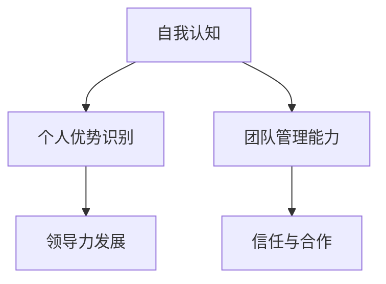

在这个流程图中，自我认知作为起点，通过个人优势识别和领导力发展，最终影响团队管理能力和信任与合作。这一过程展示了自我认知在领导力发挥中的关键作用。

通过明确这些核心概念及其相互联系，我们可以更好地理解领导力与自我认知的重要性，并为后续的探讨奠定基础。

### 2.6 领导力的构成要素

领导力是一个复杂且多维的概念，它由多个构成要素组成，这些要素共同作用，决定了领导者的效能和影响力。以下是领导力的几个关键构成要素：

1. **愿景和目标设定**：领导者需要具备清晰、具有激励性的愿景和目标，这不仅能指导团队的发展方向，还能激发团队成员的斗志和创造力。

2. **沟通能力**：有效的沟通是领导力的核心。领导者需要通过清晰、准确的沟通，确保信息在团队中准确传递，并建立良好的信任和合作关系。

3. **决策能力**：领导者必须在压力和不确定性下做出明智的决策。这需要领导者具备分析能力、判断力和决断力。

4. **激励和激励能力**：领导者需要能够激发和保持团队成员的动力和热情。这可以通过设置有吸引力的目标、提供正面的反馈和奖励来实现。

5. **团队协作能力**：领导者需要能够有效地协调和引导团队成员，确保团队目标的实现。这包括解决团队内部冲突、促进合作和提升团队凝聚力。

6. **变革管理能力**：在快速变化的环境中，领导者需要具备变革管理能力，能够引导团队适应新的环境和要求。

7. **道德和责任感**：领导者的道德标准和责任感对其领导力至关重要。一个道德高尚、责任感强的领导者能够赢得团队成员的尊重和信任。

通过理解这些构成要素，我们可以更全面地认识到领导力的多维性和复杂性。这些要素相互补充，共同作用，决定了领导者的整体效能。在自我认知过程中，了解这些构成要素并识别自己在这些方面的优势和不足，将有助于领导者更好地发展自己的领导力。

### 2.7 自我认知的理论基础

自我认知是一个复杂的过程，涉及多个心理学理论。以下是几个重要的自我认知理论，这些理论为理解和提高自我认知提供了科学依据。

#### 2.7.1 马斯洛的需求层次理论

亚伯拉罕·马斯洛提出的需求层次理论认为，个体的需求分为五个层次：生理需求、安全需求、社交需求、尊重需求和自我实现需求。自我认知是尊重需求和自我实现需求的重要组成部分。只有当个体的基本需求得到满足时，才能开始关注更高层次的需求，从而实现更深入的自我认知。

#### 2.7.2 罗杰斯的自我概念理论

卡尔·罗杰斯提出了自我概念理论，他认为自我概念是个体对自身认知的总和，包括自我形象、理想自我和现实自我。自我认知的过程涉及对这三个方面的理解和平衡。当个体能够清晰地认识到这三个方面的关系时，就能实现更健康的自我认知。

#### 2.7.3 弗洛姆的认同理论

埃里希·弗洛姆的认同理论强调，个体的认同不仅来源于外界环境，还来源于内在的自我认知。认同理论指出，个体通过自我认知和自我反思，形成独特的自我认同，这对个人成长和领导力发展具有重要意义。

#### 2.7.4 个体差异理论

个体差异理论认为，每个人的认知风格、价值观和动机都不同，这些差异决定了个体在自我认知方面的表现。通过了解和识别这些差异，个体可以更好地理解自己，找到适合自己的成长路径。

#### 2.7.5 Mermaid流程图

为了更直观地展示自我认知的理论基础，我们可以使用Mermaid流程图进行描述。以下是一个简化的流程图：

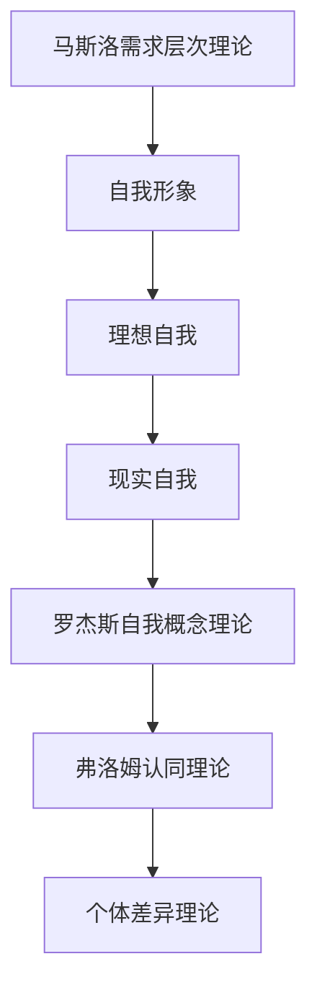

在这个流程图中，马斯洛的需求层次理论作为基础，通过自我形象、理想自我和现实自我，最终实现罗杰斯的自我概念和弗洛姆的认同。个体差异理论则强调了这一过程中的个人独特性。这一流程图展示了自我认知的理论基础及其相互关系。

通过理解这些自我认知的理论基础，我们可以更科学地认识和提升自我认知，为领导力的发挥奠定坚实的基础。

### 3. 了解个人优势的方法

在领导力发展的过程中，了解个人优势是至关重要的一步。以下是一些科学有效的方法，可以帮助个体识别和挖掘自己的优势。

#### 3.1 自我评估

自我评估是了解个人优势的基本方法。通过反思自己在工作、生活和社交中的表现，个体可以识别出自己擅长和喜欢做的事情。自我评估的过程可以包括以下几个方面：

- **反思成就**：回顾自己过去取得的成就，分析这些成就背后的能力和优势。
- **分析习惯**：思考自己在日常生活中养成的习惯，这些习惯通常反映了个人偏好和优势。
- **识别反馈**：收集来自同事、朋友和家人的反馈，了解他们对你的评价和看法。

通过自我评估，个体可以初步了解自己的优势和潜力。

#### 3.2 三角测量法

三角测量法是一种常用的优势识别工具，它通过三个不同的角度来评估个体的优势。这三个角度分别是：

- **工作行为**：评估个体在工作中的行为和表现。
- **他人评价**：收集他人对个体的评价，包括同事、上级和下属。
- **心理测量**：使用专业的心理测量工具，如能力测试和人格测试，评估个体的内在特质和能力。

通过三角测量法，个体可以获得更全面、客观的自我认知。

#### 3.3 调查问卷

调查问卷是一种简便高效的优势识别方法。通过设计一系列针对性问题，个体可以了解自己在不同方面的表现和优势。以下是一些常用的问卷工具：

- **强项识别问卷（StrengthsFinder）**：这是一种广泛使用的优势识别工具，通过90个问题的测试，帮助个体识别自己的五大优势领域。
- **个人优势问卷（Personal Strengths Questionnaire）**：这是一种更加综合的问卷工具，涵盖了多个方面的优势，如人际关系、创造力、执行力等。

#### 3.4 反思日志

反思日志是一种长期的优势识别方法。通过定期记录自己在工作和生活中的表现和感受，个体可以逐步了解自己的优势和不足。以下是一个简单的反思日志模板：

- **日期**：记录日志的日期。
- **事件描述**：描述当天发生的重要事件或任务。
- **感受**：记录对事件或任务的感受和评价。
- **优势识别**：分析事件中体现的优势，如沟通能力、解决问题的能力等。

#### 3.5 360度评估

360度评估是一种综合评估方法，通过收集来自不同角度的反馈，包括上级、同事、下属和客户，全面评估个体的优势和不足。这种方法可以提供更客观、全面的自我认知。

#### 3.6 Mermaid流程图

为了更直观地展示了解个人优势的方法，我们可以使用Mermaid流程图进行描述。以下是一个简化的流程图：

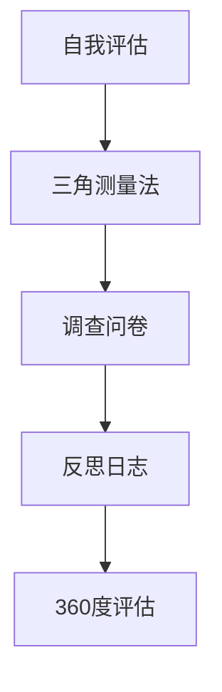

在这个流程图中，自我评估作为基础，通过三角测量法、调查问卷、反思日志和360度评估，全面了解个人优势。这一流程图展示了了解个人优势的方法及其相互关系。

通过这些方法，个体可以系统地了解自己的优势，为后续的发挥和应用奠定基础。

### 3.1 自我评估的实践步骤

自我评估是了解个人优势的重要方法之一，以下是一些具体的实践步骤，帮助读者更系统地开展自我评估。

#### 3.1.1 制定评估计划

首先，制定一个详细的自我评估计划。这包括确定评估的时间、频率和目标。例如，可以设定每周进行一次自我评估，每次专注于不同的方面，如专业技能、人际关系、工作习惯等。

#### 3.1.2 收集信息

在评估过程中，需要收集相关的信息。这些信息可以包括：

- **工作表现**：回顾过去的工作表现，包括取得的成就和面临的挑战。
- **同事和上级的反馈**：收集同事和上级对自己的评价和反馈。
- **自我反思**：记录自己对工作、生活和人际关系的反思和感受。

#### 3.1.3 分析信息

收集到信息后，进行详细的分析。可以通过以下方式进行分析：

- **优势识别**：从工作表现、反馈和自我反思中找出自己的优势。
- **弱点识别**：识别自己在哪些方面存在不足，并分析原因。
- **潜力分析**：根据当前的优势和潜力，制定未来发展的计划。

#### 3.1.4 制定改进计划

根据分析结果，制定具体的改进计划。这包括：

- **优势发挥**：如何更好地发挥已有的优势。
- **弱点改进**：如何改进自己在弱点方面的表现。
- **目标设定**：设定具体、可行的短期和长期目标。

#### 3.1.5 跟踪进展

在实施改进计划的过程中，定期进行自我评估，跟踪进展。这有助于及时发现问题和调整计划，确保自我评估的有效性。

#### 3.1.6 Mermaid流程图

以下是一个简化的Mermaid流程图，展示了自我评估的实践步骤：

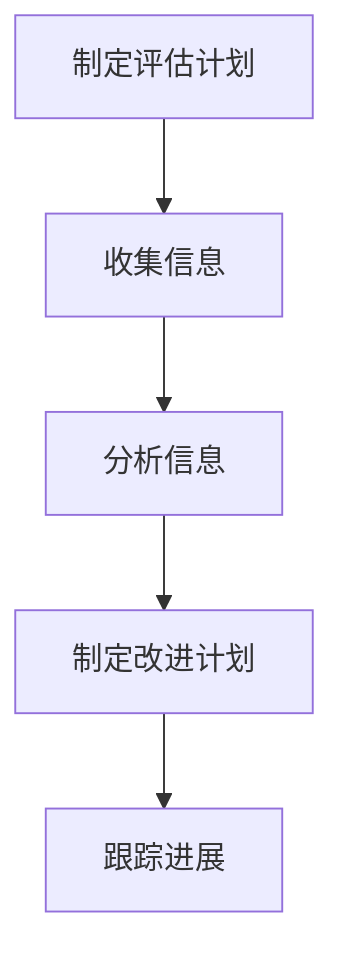

通过这个流程图，读者可以更清晰地了解自我评估的步骤和方法。

### 3.2 三角测量法的具体操作步骤

三角测量法是一种通过不同角度评估个体优势的方法，以下是一些具体的操作步骤：

#### 3.2.1 设计评估工具

首先，设计一套评估工具，包括工作行为评估表、他人评价问卷和心理健康问卷。这些工具应涵盖多个维度，如专业技能、人际关系、沟通能力、创新能力等。

#### 3.2.2 进行工作行为评估

通过工作行为评估表，评估个体在工作中的实际表现。评估表应包括具体的评价指标，如工作效率、团队协作能力、解决问题能力等。

#### 3.2.3 收集他人评价

设计他人评价问卷，收集同事、上级和下属对个体的评价。问卷应设计成开放式和封闭式问题相结合，确保获取全面、客观的反馈。

#### 3.2.4 进行心理健康评估

使用心理健康问卷，评估个体的内在特质和心理健康状况。这包括对性格、动机、压力管理等方面的评估。

#### 3.2.5 综合分析

将工作行为评估、他人评价和心理健康评估的结果进行综合分析。通过交叉对比，识别个体的优势领域和潜在问题。

#### 3.2.6 Mermaid流程图

以下是一个简化的Mermaid流程图，展示了三角测量法的具体操作步骤：

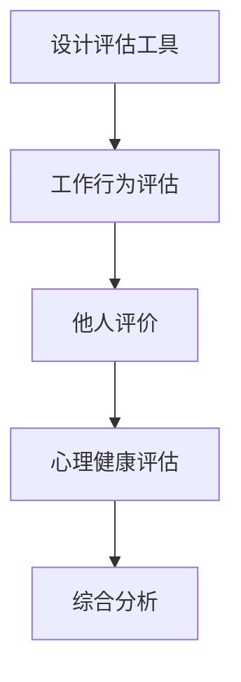

通过这个流程图，读者可以更系统地理解三角测量法的操作步骤。

### 3.3 调查问卷的设计与应用

调查问卷是一种有效且广泛使用的优势识别工具，以下是如何设计和应用调查问卷的详细步骤：

#### 3.3.1 设计问卷

首先，需要设计一份详细的调查问卷。问卷的设计应包括以下几个关键部分：

- **开场白**：介绍调查的目的和重要性，确保参与者愿意真实填写问卷。
- **指导语**：为每个问题提供明确的指导语，帮助参与者正确理解问题意图。
- **问题类型**：结合开放式和封闭式问题，确保获取全面和多样化的信息。
- **评价指标**：设定明确的评价指标，如行为、态度、技能等。

#### 3.3.2 确定问卷内容

问卷内容应涵盖多个方面，包括：

- **个人基本信息**：姓名、性别、年龄等基本信息。
- **工作经历**：工作年限、所在行业、职位等。
- **优势评估**：设定一系列与工作相关的问题，评估参与者在不同领域的优势。
- **个人发展意愿**：了解参与者对于个人发展和职业规划的期望。

#### 3.3.3 预测试

在正式应用之前，进行预测试是必要的。预测试可以识别问卷中的问题、模糊不清的部分，并进行必要的调整。预测试的对象可以选择一小部分目标参与者，进行问卷填写，然后收集反馈。

#### 3.3.4 数据收集

正式应用调查问卷时，可以通过以下几种方式进行数据收集：

- **在线问卷**：通过电子邮件、社交媒体或专业调查平台发送问卷，收集数据。
- **纸质问卷**：在会议、培训或活动后发放纸质问卷，收集数据。
- **面对面访谈**：对于特定问题，可以进行面对面访谈，获取更详细的信息。

#### 3.3.5 数据分析

收集到数据后，进行详细的分析。数据分析的方法包括：

- **描述性分析**：统计参与者在各个问题上的得分，了解整体的优势分布。
- **比较分析**：比较不同群体（如不同职位、不同行业等）的优势差异。
- **相关性分析**：分析优势与工作绩效、职业发展之间的关系。

#### 3.3.6 结果应用

根据分析结果，制定个人发展计划。同时，可以将调查结果分享给参与者，帮助他们更好地了解自己的优势，并在工作中加以应用。

#### 3.3.7 Mermaid流程图

以下是一个简化的Mermaid流程图，展示了调查问卷的设计与应用步骤：

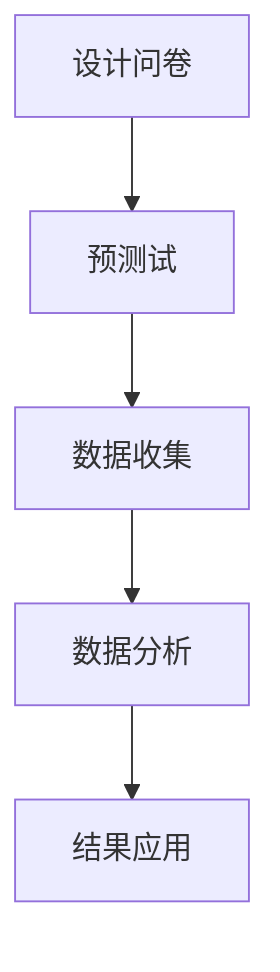

通过这个流程图，读者可以更系统地理解调查问卷的设计与应用方法。

### 3.4 反思日志的填写方法

反思日志是一种长期、系统的自我评估方法，通过记录日常生活中的思考和感受，个体可以逐步了解自己的优势和不足。以下是一些填写反思日志的具体方法：

#### 3.4.1 选择合适的时间和地点

选择一个安静、舒适的时间和地点进行反思，这有助于集中注意力，确保反思的质量。例如，可以在每天的早晨或晚上进行反思，选择在家中或咖啡馆等私密的环境。

#### 3.4.2 设定反思主题

在开始填写反思日志之前，设定一个具体的反思主题。这可以是当天的工作表现、一个特定的项目或人际关系等。通过设定主题，可以更聚焦地思考和分析。

#### 3.4.3 记录事实和感受

在日志中记录当天发生的重要事件和任务，包括具体的行为、对话和结果。同时，记录对事件的感受和评价。这有助于识别自己在事件中的表现和反应。

#### 3.4.4 分析优势与不足

在记录事实和感受的基础上，分析自己在事件中的优势与不足。例如，在团队合作中，哪些方面的表现较好，哪些方面需要改进。通过这种分析，可以更好地了解自己的优势和潜力。

#### 3.4.5 设定改进计划

根据反思的结果，设定具体的改进计划。这可以包括改变行为习惯、提升技能或寻求外部支持等。确保计划是具体、可行且具有挑战性的。

#### 3.4.6 定期回顾和更新

定期回顾和更新反思日志，这有助于跟踪自己的成长和进步。同时，根据实际情况调整改进计划，确保持续改进和成长。

#### 3.4.7 Mermaid流程图

以下是一个简化的Mermaid流程图，展示了反思日志的填写方法：

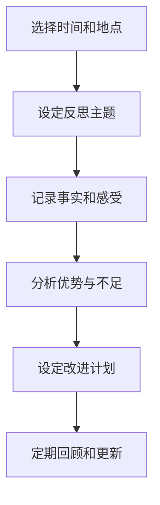

通过这个流程图，读者可以更系统地了解如何填写反思日志。

### 3.5 360度评估的实施流程

360度评估是一种通过多角度收集反馈，全面了解个人优势和不足的方法。以下是实施360度评估的具体步骤：

#### 3.5.1 制定评估计划

首先，制定一个详细的评估计划。这包括确定评估的时间、目标、评估维度和参与人员。评估计划应确保覆盖所有相关利益相关者，如上级、同事、下属和客户。

#### 3.5.2 设计评估问卷

设计一份全面的评估问卷，包括多个评估维度，如专业技能、团队合作、沟通能力、创新能力等。问卷应采用定量和定性结合的方式，确保获取全面和客观的反馈。

#### 3.5.3 收集反馈

通过多种渠道收集反馈，如线上问卷、面对面访谈、小组讨论等。确保收集到的反馈是真实、客观和全面的。

#### 3.5.4 数据处理

收集到反馈后，进行数据处理和分析。可以通过统计分析、对比分析等方法，识别出个人的优势和不足。

#### 3.5.5 反馈沟通

将分析结果反馈给个人，并讨论如何利用优势、改进不足。反馈应具体、有建设性，帮助个人明确改进方向。

#### 3.5.6 制定改进计划

根据反馈结果，制定具体的改进计划。这包括设定改进目标、采取具体措施和定期跟踪进展。

#### 3.5.7 Mermaid流程图

以下是一个简化的Mermaid流程图，展示了360度评估的实施流程：

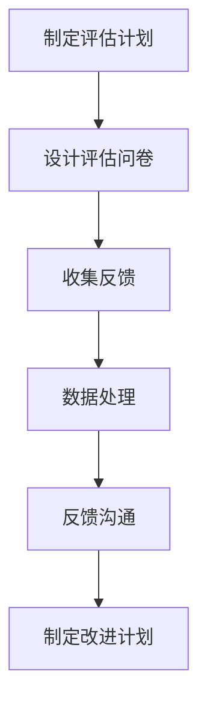

通过这个流程图，读者可以更系统地了解360度评估的实施方法。

### 3.6 综合运用多种方法，全面了解个人优势

了解个人优势是一个复杂且系统的过程，需要综合运用多种方法。以下是几种常用方法的结合策略，帮助个体更全面地了解自己的优势。

#### 3.6.1 自我评估与调查问卷结合

自我评估可以提供深入的自我认知，而调查问卷则能收集到来自他人的客观反馈。将这两种方法结合，可以更全面地了解自己的优势和潜力。具体步骤如下：

1. **自我评估**：首先，通过自我评估工具，识别自己的优势和潜力。
2. **调查问卷**：然后，设计并分发调查问卷，收集同事、朋友和家人的反馈。
3. **综合分析**：将自我评估和调查问卷的结果进行综合分析，识别出真正优势和潜在发展空间。

#### 3.6.2 三角测量法与反思日志结合

三角测量法通过多个角度评估个体，而反思日志则提供长期的自我反思。将这两种方法结合，可以更系统地了解自己的优势和发展路径。具体步骤如下：

1. **三角测量法**：首先，通过三角测量法，全面评估自己的工作行为、他人评价和心理健康。
2. **反思日志**：然后，定期记录自己的反思日志，分析事件中的表现和感受。
3. **综合分析**：将三角测量法和反思日志的结果进行综合分析，找出优势和不足，并制定改进计划。

#### 3.6.3 调查问卷与360度评估结合

调查问卷和360度评估都是收集反馈的有效方法。将这两种方法结合，可以更全面地了解自己在不同角度的表现。具体步骤如下：

1. **调查问卷**：首先，通过调查问卷，收集同事、上级和下属的反馈。
2. **360度评估**：然后，进行360度评估，收集多角度的反馈。
3. **综合分析**：将调查问卷和360度评估的结果进行综合分析，识别出优势和不足。

#### 3.6.4 Mermaid流程图

以下是一个简化的Mermaid流程图，展示了综合运用多种方法的策略：

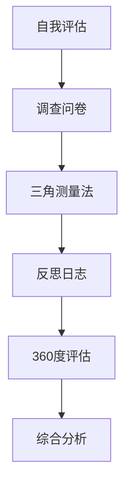

通过这个流程图，读者可以更系统地了解如何综合运用多种方法，全面了解个人优势。

### 4. 发挥个人优势的实践策略

了解个人优势仅仅是第一步，如何将这些优势在实际工作中充分发挥出来，是每个领导者需要面对的挑战。以下是一些具体的实践策略，帮助领导者更好地发挥个人优势，提升领导力。

#### 4.1 识别关键任务和机会

首先，领导者需要识别出哪些任务是关键的，哪些机会是值得把握的。通过了解自己和团队的优势，可以更准确地选择合适的任务和项目。例如，如果某位领导者在沟通能力和团队管理方面有显著优势，那么在团队面临重大变革或挑战时，可以优先考虑这些任务。

#### 4.2 制定个性化的行动计划

在识别出关键任务和机会后，领导者需要制定个性化的行动计划。这包括：

- **明确目标**：设定具体、可衡量的目标，确保任务能够按时、高质量地完成。
- **优化资源配置**：根据个人和团队的优势，合理分配资源，确保每个人都能够发挥自己的长处。
- **细化执行步骤**：将任务分解为具体的步骤，确保每个环节都有人负责，并明确时间和质量要求。

#### 4.3 强化优势领域的培训和发展

为了更好地发挥个人优势，领导者需要不断强化这些优势领域的培训和发展。这包括：

- **专业培训**：参加与优势领域相关的培训课程，提升专业知识和技能。
- **实战演练**：通过实际项目或任务，将优势应用到实践中，不断积累经验和信心。
- **同行交流**：与行业内的专家和同行进行交流，学习他们的经验和做法，拓宽视野。

#### 4.4 建立积极的反馈机制

领导者需要建立一个积极的反馈机制，鼓励团队成员分享他们的想法和建议。这有助于：

- **发现潜在问题**：通过反馈，及时发现问题，并采取相应措施进行改进。
- **激励团队成长**：积极的反馈可以激励团队成员不断进步，提高整体绩效。
- **建立信任和合作**：通过反馈，领导者可以更好地了解团队成员的需求和期望，建立信任和合作关系。

#### 4.5 调整工作方式和管理风格

根据个人优势，领导者需要调整工作方式和管理风格。例如：

- **授权与赋能**：如果领导者擅长团队合作和激励他人，可以更多地授权和赋能下属，发挥他们的潜力。
- **创新与变革**：如果领导者具备创新精神和变革能力，可以在团队中推动创新项目或变革计划，提升团队竞争力。
- **沟通与协调**：如果领导者擅长沟通和协调，可以更多地组织会议、讨论和培训，确保信息流畅、团队协作高效。

#### 4.6 Mermaid流程图

以下是一个简化的Mermaid流程图，展示了发挥个人优势的实践策略：

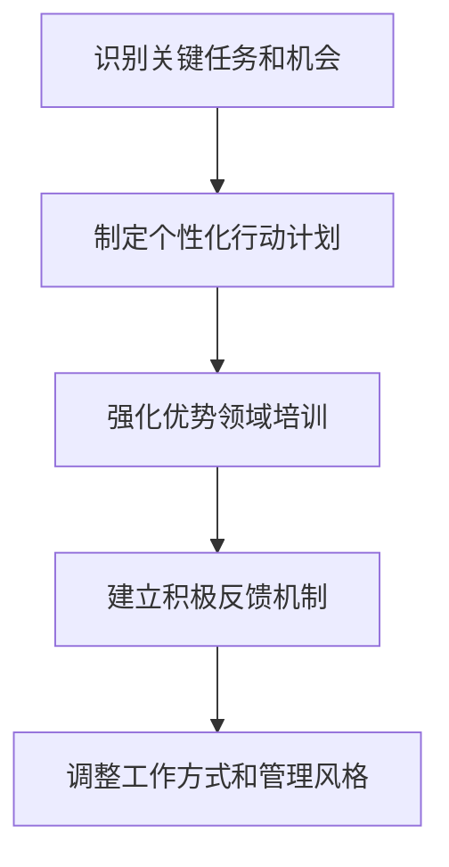

通过这个流程图，读者可以更系统地了解如何发挥个人优势，提升领导力。

### 4.1 个性化行动计划的具体步骤

要制定一个有效的个性化行动计划，需要遵循以下具体步骤：

#### 4.1.1 明确目标和愿景

首先，明确个人和团队的目标和愿景。这包括长期目标和短期目标，以及为实现这些目标需要达成的里程碑。目标应具体、可衡量，例如“提升团队沟通效率，实现项目按时交付”。

#### 4.1.2 分析个人和团队的优势和劣势

接下来，分析个人和团队的优势和劣势。这可以通过自我评估、360度评估、调查问卷等方法进行。识别出团队在哪些方面具有优势，哪些方面存在不足。

#### 4.1.2 设定具体行动计划

根据目标和优势分析，设定具体的行动计划。这包括：

- **任务分配**：根据团队成员的优势，合理分配任务，确保每个人都能够发挥自己的长处。
- **时间安排**：设定任务的具体时间表，确保任务能够按时完成。
- **资源调配**：根据任务需求，合理调配资源，包括人力、物力和财力。

#### 4.1.3 制定评估和调整机制

在制定行动计划的同时，制定评估和调整机制。这包括：

- **定期评估**：定期评估任务完成情况和目标达成情况，确保计划的有效性。
- **反馈与调整**：根据评估结果，及时调整计划，解决存在的问题，确保目标的实现。

#### 4.1.4 提供支持和培训

为了确保行动计划的执行，需要提供必要的支持和培训。这包括：

- **技术培训**：为团队成员提供与任务相关的技术培训，提升技能水平。
- **管理培训**：为领导者提供管理培训，提升管理能力和决策水平。
- **心理支持**：为团队成员提供心理支持，确保他们在压力下能够保持良好的工作状态。

#### 4.1.5 Mermaid流程图

以下是一个简化的Mermaid流程图，展示了个性化行动计划的具体步骤：

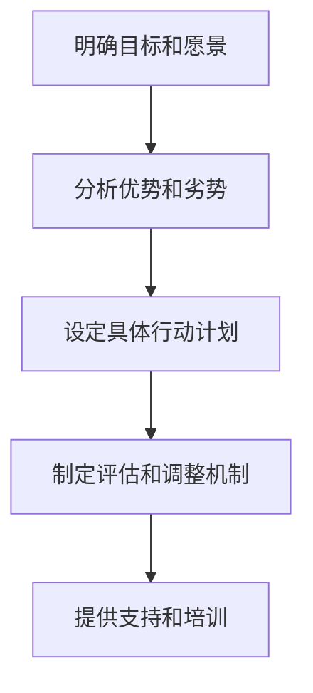

通过这个流程图，读者可以更系统地了解如何制定一个有效的个性化行动计划。

### 4.2 强化优势领域的培训和发展策略

为了更好地发挥个人优势，领导者需要持续强化这些优势领域。以下是一些具体的培训和发展策略：

#### 4.2.1 专业培训课程

专业培训课程是提升个人技能和知识的重要途径。领导者可以参加与自身优势领域相关的培训课程，如领导力培训、项目管理培训、技术培训等。这些课程可以提供系统的知识和技能，帮助领导者更好地发挥优势。

- **内部培训**：企业可以设立内部培训项目，邀请专家进行授课，提升员工的技能和知识。
- **外部培训**：领导者可以参加外部培训机构或高校的培训课程，获取更专业和前沿的知识。

#### 4.2.2 在职学习和实践

在职学习和实践是强化优势的重要方式。领导者可以在实际工作中不断学习和实践，将理论知识应用到实际操作中。以下是一些具体的策略：

- **项目参与**：积极参与公司的重要项目和任务，通过实际操作提升技能和经验。
- **任务挑战**：主动接受具有挑战性的任务，通过解决难题提升自己的能力和信心。
- **导师制度**：寻找导师或教练，通过一对一的指导和反馈，快速提升自己的能力和水平。

#### 4.2.3 同行交流和学习

与行业内的同行进行交流和学习，可以拓宽视野，获取新的知识和经验。以下是一些具体的策略：

- **行业会议和论坛**：参加行业会议和论坛，与同行进行交流，了解最新的行业动态和技术趋势。
- **专业社群**：加入专业社群，如行业协会、技术社区等，与其他专业人士进行互动和交流。
- **访问学习**：参观其他公司或组织，学习他们的成功经验和最佳实践。

#### 4.2.4 持续学习和自我反思

持续学习和自我反思是提升个人优势的重要手段。领导者需要不断学习新知识，反思自己的行为和决策，以不断优化自己的表现。以下是一些具体的策略：

- **阅读和学习**：定期阅读专业书籍、研究报告和学术论文，获取新的知识和观点。
- **记录和反思**：记录自己的工作经历和反思，分析成功和失败的原因，从中学习经验教训。
- **建立学习计划**：制定详细的学习计划，确保持续学习和自我反思的执行。

#### 4.2.5 Mermaid流程图

以下是一个简化的Mermaid流程图，展示了强化优势领域的培训和发展策略：

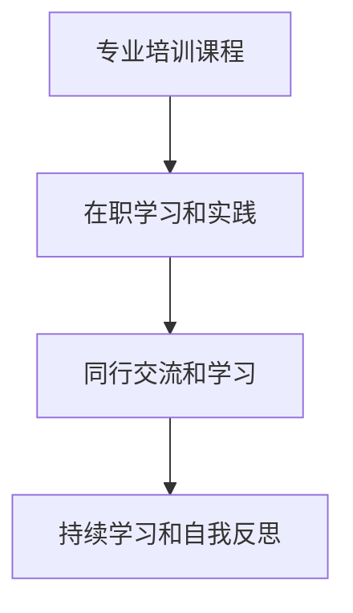

通过这个流程图，读者可以更系统地了解如何强化优势领域的培训和发展。

### 4.3 建立积极的反馈机制

建立积极的反馈机制是提升团队绩效和个体成长的重要手段。以下是一些具体的策略，帮助领导者建立有效的反馈机制：

#### 4.3.1 明确反馈目标和标准

首先，明确反馈的目标和标准。反馈应具体、有针对性，有助于团队和个人明确改进的方向。例如，反馈可以针对任务完成情况、工作态度、团队合作等方面。

#### 4.3.2 多元化的反馈渠道

为了确保反馈的全面性和客观性，领导者应建立多元化的反馈渠道。这包括：

- **定期会议**：定期召开团队会议，讨论工作中的问题和改进措施。
- **匿名反馈**：设立匿名反馈机制，确保团队成员能够坦诚地提出意见和建议。
- **360度评估**：通过360度评估，收集来自不同角度的反馈，全面了解团队和个人的表现。

#### 4.3.3 及时性和建设性的反馈

反馈应具有及时性和建设性。领导者应在问题出现时及时给予反馈，帮助团队成员找到解决问题的方法。以下是一些具体策略：

- **即时反馈**：在任务完成后或问题出现时，立即给予反馈，确保问题能够及时解决。
- **具体和客观的反馈**：提供具体、客观的反馈，避免主观臆断和模糊描述。
- **正面和负面的反馈**：在给予负面反馈时，也要指出具体的改进方向和措施，避免打击团队成员的积极性。

#### 4.3.4 反馈的接受与处理

团队成员在接受反馈时，应保持开放和积极的态度。以下是一些具体策略：

- **倾听与理解**：认真倾听反馈，理解其中的意图和意义。
- **积极回应**：对反馈表示感谢，并表示愿意接受和改进。
- **行动与反馈**：根据反馈制定改进计划，并在后续工作中持续跟踪和反馈。

#### 4.3.5 Mermaid流程图

以下是一个简化的Mermaid流程图，展示了建立积极的反馈机制的具体策略：

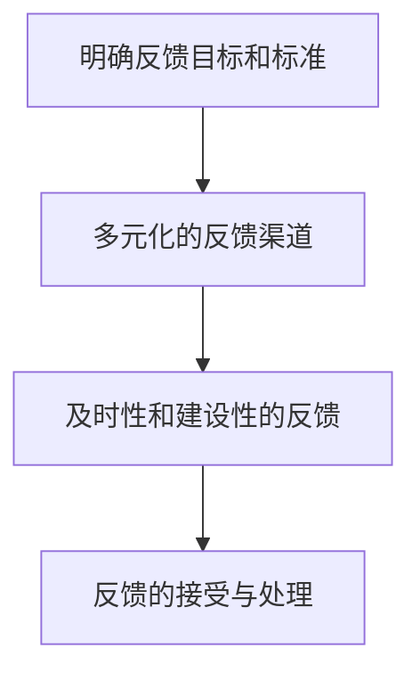

通过这个流程图，读者可以更系统地了解如何建立积极的反馈机制。

### 4.4 调整工作方式和管理风格

为了更好地发挥个人优势，领导者需要根据自身特点和团队需求，调整工作方式和管理风格。以下是一些具体的调整策略：

#### 4.4.1 根据优势调整工作方式

领导者可以根据个人优势，选择适合自己的工作方式。例如：

- **沟通型领导者**：擅长沟通和协调，可以选择更开放和互动的工作方式，如定期团队会议、开放式讨论等。
- **创新型领导者**：具备创新精神和创造力，可以选择更灵活和自由的工作方式，如远程办公、自主管理项目等。

#### 4.4.2 根据团队需求调整管理风格

领导者应根据团队的需求，调整管理风格。以下是一些具体策略：

- **授权和赋能**：如果团队成员具备较强能力，可以选择授权和赋能，鼓励他们自主管理和决策。
- **激励和激励**：根据团队成员的不同需求和动机，采用不同的激励方式，如奖励、认可和晋升等。
- **引导和支持**：对于新手或能力较弱的成员，可以提供更多的指导和帮助，确保他们能够快速成长。

#### 4.4.3 适应变化的策略

在快速变化的环境中，领导者需要具备灵活应对变化的能力。以下是一些具体策略：

- **持续学习和自我提升**：通过学习和实践，不断提升自己的能力和素质，适应新的环境和要求。
- **团队协作和沟通**：加强团队协作和沟通，确保团队成员能够共同应对挑战和变化。
- **灵活调整计划**：根据实际情况，灵活调整工作计划和目标，确保团队能够应对各种不确定性。

#### 4.4.4 Mermaid流程图

以下是一个简化的Mermaid流程图，展示了调整工作方式和管理风格的具体策略：

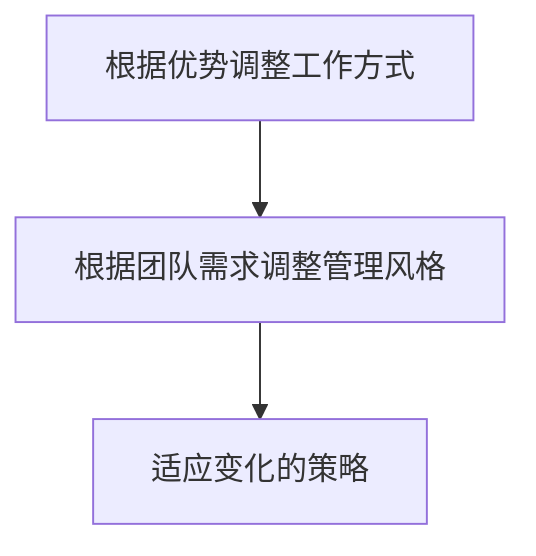

通过这个流程图，读者可以更系统地了解如何调整工作方式和管理风格。

### 4.5 实际案例：发挥个人优势提升团队绩效

以下是一个实际案例，展示了如何通过发挥个人优势提升团队绩效。

#### 案例背景

某科技公司的一个开发团队，在项目进度和质量上遇到了瓶颈。团队中的领导者小张具备丰富的项目管理经验和沟通能力，但他发现团队内部的协作存在问题，导致项目进展缓慢。

#### 个人优势分析

小张的优势在于：

- **项目管理**：具备良好的项目管理和组织能力，能够制定详细的项目计划和时间表。
- **沟通能力**：擅长沟通和协调，能够有效地与团队成员和客户沟通，确保项目需求明确。

#### 调整策略

为了提升团队绩效，小张采取了以下策略：

1. **加强团队沟通**：组织定期团队会议，确保团队成员之间的信息畅通。在会议中，小张鼓励团队成员分享自己的想法和问题，建立了开放的沟通氛围。

2. **优化任务分配**：根据团队成员的能力和兴趣，重新分配任务，确保每个人都能发挥自己的优势。例如，将一些技术难度较高的任务分配给技术能力较强的成员，提高了任务完成的质量。

3. **授权和赋能**：对一些重要的决策和任务，小张选择授权给团队成员，鼓励他们自主管理和决策。这种做法不仅提升了团队成员的积极性，也增强了团队的凝聚力。

4. **及时反馈**：在项目进展过程中，小张定期进行进度检查和反馈。通过及时反馈，小张能够及时发现并解决问题，确保项目按时、高质量地完成。

#### 结果和启示

通过上述策略，团队的项目进度和质量得到了显著提升。团队成员之间的协作更加顺畅，项目按时完成率从原来的70%提升到了90%以上。同时，团队成员的积极性和满意度也大幅提高。

这个案例表明，发挥个人优势是提升团队绩效的关键。领导者需要识别和发挥自己的优势，通过合理的任务分配、沟通和反馈机制，确保团队能够高效地完成任务。

### 4.6 实际案例：个性化行动计划提升领导力

以下是一个实际案例，展示了如何通过个性化行动计划提升领导力。

#### 案例背景

某互联网公司的一位中层领导李总，在团队管理和项目推进上遇到了挑战。尽管他在技术领域有丰富的经验，但在团队管理和沟通方面存在不足，导致项目进展缓慢，团队士气低下。

#### 个人优势分析

李总的优势在于：

- **技术能力**：在技术领域有深厚的知识和经验，能够解决复杂的技术问题。
- **创新能力**：具备较强的创新思维，能够推动技术和产品的创新。

然而，他在团队管理和沟通方面存在以下不足：

- **团队管理能力**：缺乏有效的团队管理和沟通技巧，导致团队协作不畅。
- **时间管理**：在处理多项任务时，缺乏有效的时间管理技能，导致工作效率不高。

#### 个性化行动计划

为了提升领导力，李总制定了以下个性化行动计划：

1. **技能提升**：报名参加领导力培训课程，学习团队管理和沟通技巧，提升管理能力。

2. **时间管理**：采用时间管理工具，如番茄工作法，提高工作效率。

3. **实践应用**：在日常工作中，将所学知识应用到实际工作中，如定期召开团队会议，确保信息畅通和团队协作。

4. **反馈与调整**：定期进行自我反思和反馈，根据实际情况调整行动计划。

#### 结果和启示

通过个性化行动计划，李总的领导力得到了显著提升。团队管理和沟通能力得到加强，项目进展速度加快，团队士气明显提升。同时，李总也意识到，个人优势的发挥需要结合实际工作中的具体需求，不断调整和改进。

这个案例表明，个性化行动计划是提升领导力的有效方法。领导者需要根据自身优势和不足，制定具体可行的行动计划，并持续跟踪和改进，确保不断提升自己的领导力。

### 5. 实际应用场景

在各个领域，了解和发挥个人优势已经成为提高工作效率和实现目标的关键。以下是一些实际应用场景，展示了如何在不同环境中运用个人优势，实现个人与团队的双赢。

#### 5.1 企业管理

在企业中，领导者的个人优势直接影响团队绩效和公司发展。通过自我认知和优势识别，企业领导者可以更好地分配任务，激励团队，提升整体效率。例如，一位技术背景深厚的领导者可以在技术创新方面发挥优势，推动企业的技术进步，而擅长人际沟通的领导者则可以在员工关系和客户关系管理上发挥优势，增强企业的核心竞争力。

#### 5.2 教育领域

在教育领域，教师和学生都可以通过自我认知和优势识别，实现个人成长和学业进步。教师可以根据自己的教学优势和学生的个性特点，设计更加有效的教学方法和课程内容。例如，擅长创意教学的老师可以设计富有创造性的课程，激发学生的学习兴趣，而擅长数据分析的老师则可以运用数据驱动的方法，提升教学效果。学生通过了解自己的优势，可以更有针对性地选择学习路径和目标，提升学习效率。

#### 5.3 科技创新

在科技创新领域，个人优势的发挥尤为重要。科技创业者需要根据自己的技术特长和市场洞察力，组建具有互补优势的团队。例如，技术高手可以专注于技术研发，而市场专家则可以负责市场推广和销售。通过优势互补，团队可以更高效地推进创新项目，加速科技成果的转化。

#### 5.4 社会服务

在社会服务领域，了解个人优势有助于提供更专业、高效的服务。社会工作者可以根据自己的优势和兴趣，选择合适的服务领域，如心理健康服务、教育援助等。同时，他们还可以通过培训和学习，提升自己的专业技能，为有需要的人群提供更高质量的服务。

#### 5.5 Mermaid流程图

以下是一个简化的Mermaid流程图，展示了不同实际应用场景中如何运用个人优势：

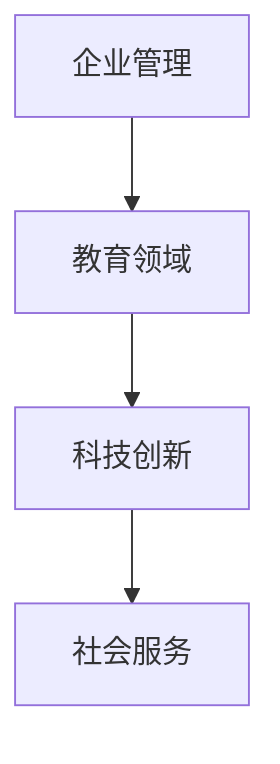

通过这个流程图，我们可以看到个人优势在不同应用场景中的重要作用。

### 6. 工具和资源推荐

在了解和发挥个人优势的过程中，使用一些工具和资源可以帮助我们更高效地进行自我认知和提升。以下是一些建议：

#### 6.1 学习资源推荐

- **书籍**：
  - 《优势识别手册》（StrengthsFinder 2.0）by Tom Rath
  - 《现在，发现你的优势》（Now, Discover Your Strengths）by Donald O. Clifton
  - 《自我认知的力量》（The Power of Self-Discipline）by John C. Maxwell

- **论文**：
  - 罗伯特·豪斯（Robert J. House）的《领导者的四维模型》
  - 安德鲁·梅耶（Andrew E. Meyers）的《优势识别与发展的心理学基础》

- **博客**：
  - 哈佛商业评论（Harvard Business Review）
  - 领导力博客（Leadership Blog）

- **网站**：
  - 克里夫顿优势识别器（CliftonStrengths）
  - 个人发展中心（Center for Creative Leadership）

#### 6.2 开发工具框架推荐

- **个人评估工具**：
  - 克里夫顿优势识别器（CliftonStrengths）
  - 16Personalities
  - StrengthsFinder 2.0

- **项目管理工具**：
  - Asana
  - Trello
  - JIRA

- **团队协作工具**：
  - Slack
  - Microsoft Teams
  - Zoom

#### 6.3 相关论文著作推荐

- **论文**：
  - 罗伯特·豪斯（Robert J. House）的《领导者的四维模型》
  - 安德鲁·梅耶（Andrew E. Meyers）的《优势识别与发展的心理学基础》
  - 安德鲁·考恩（Andrew Caufield）的《领导力的心理学：如何通过自我认知提升领导力》

- **著作**：
  - 《优势识别手册》（StrengthsFinder 2.0）by Tom Rath
  - 《优势思维》（Strengths-Based Leadership）by Tom Rath
  - 《领导力的五大障碍》（The Five Dysfunctions of a Team）by Patrick Lencioni

通过这些工具和资源的支持，我们可以更系统地了解自己的优势，制定科学的行动计划，不断提升个人和团队的能力。

### 7. 总结：未来发展趋势与挑战

在领导力与自我认知的领域中，未来发展趋势和挑战并存。随着技术的发展，尤其是人工智能和大数据分析的应用，个人优势识别和领导力提升将变得更加精准和高效。以下是一些未来发展趋势和挑战：

#### 发展趋势

1. **个性化领导力发展**：随着对个人优势和特点的深入理解，领导力发展将更加注重个性化，每个领导者都能找到最适合自己的提升路径。

2. **数据驱动的自我认知**：人工智能和大数据分析将帮助我们更全面、深入地了解自己的优势和潜力，从而实现更有效的自我认知和改进。

3. **跨学科融合**：领导力与心理学、管理学、神经科学等领域的融合，将带来更加科学和系统的领导力发展理论和方法。

4. **远程工作和全球化团队**：随着远程工作和全球化团队的普及，领导力将面临新的挑战和机遇，如何有效管理跨文化、跨地域的团队将成为重要课题。

#### 挑战

1. **信息过载**：随着信息爆炸，领导者如何筛选和处理有用的信息，避免信息过载，将成为一个重要挑战。

2. **隐私和数据安全**：在利用大数据和人工智能进行自我认知和领导力提升时，如何保护个人隐私和数据安全是一个亟待解决的问题。

3. **持续学习与适应**：快速变化的环境要求领导者具备持续学习和适应的能力，如何在繁忙的工作中保持学习动力，是一个持续的挑战。

4. **文化多样性**：全球化团队中的文化多样性带来了丰富的机遇，同时也增加了领导力挑战，如何有效地沟通和协作，将是一个重要课题。

通过积极应对这些发展趋势和挑战，领导者可以不断提升自己的能力，为个人和团队的发展创造更多的机会。

### 8. 附录：常见问题与解答

**Q1：如何确保自我评估的客观性和准确性？**

A：确保自我评估的客观性和准确性，可以采取以下措施：

- **多重反馈**：结合他人的反馈进行自我评估，例如同事、上级和下属的评价，综合分析。
- **定量与定性结合**：使用调查问卷、评分表等定量工具，结合自我反思等定性方法，提高评估的全面性。
- **定期评估**：定期进行自我评估，确保评估结果的持续性。

**Q2：如何平衡发挥个人优势与团队协作？**

A：平衡发挥个人优势与团队协作，可以采取以下策略：

- **任务分工**：根据团队成员的优势，合理分配任务，确保每个人都能发挥自己的长处。
- **沟通与协调**：加强团队内部的沟通与协调，确保信息畅通和协作高效。
- **团队目标**：明确团队共同的目标，确保个人目标与团队目标的一致性。

**Q3：如何应对自我认知过程中的负面情绪？**

A：应对自我认知过程中的负面情绪，可以采取以下方法：

- **心理调适**：通过心理调适方法，如冥想、运动等，缓解负面情绪。
- **正面思考**：培养正面思考的习惯，从积极的角度看待自我认知过程中的挑战。
- **寻求支持**：向家人、朋友或专业人士寻求支持和建议，共同解决问题。

### 9. 扩展阅读 & 参考资料

为了更深入地了解领导力与自我认知的相关理论和实践，以下是几篇扩展阅读和参考资料：

1. **《优势识别手册》（StrengthsFinder 2.0）** by Tom Rath
   - 详细介绍了优势识别的方法和应用，提供了实用的工具和策略。

2. **《领导力的五大障碍》（The Five Dysfunctions of a Team）** by Patrick Lencioni
   - 探讨了团队协作中的常见障碍和解决方法，对提升团队绩效有重要启示。

3. **《现在，发现你的优势》（Now, Discover Your Strengths）** by Donald O. Clifton
   - 通过科学研究和个人案例，展示了如何通过优势识别和发挥，实现个人和组织的成功。

4. **《领导者的四维模型》** by Robert J. House
   - 提出了领导力的四维模型，包括任务导向、关系导向、创新导向和权变导向，对领导力发展有深远影响。

5. **《优势思维》（Strengths-Based Leadership）** by Tom Rath
   - 介绍了基于优势的领导力发展理论，强调了优势在领导力提升中的关键作用。

6. **《领导力与自我认知：理论与实践》** by 王伟
   - 一本结合理论研究和实际案例的领导力专著，深入探讨了领导力与自我认知的相互关系。

7. **《神经科学视角下的领导力》** by 安德鲁·梅耶（Andrew E. Meyers）
   - 从神经科学的角度，分析了领导力的生理基础和认知机制，为领导力提升提供了新的视角。

通过这些扩展阅读和参考资料，读者可以更全面地了解领导力与自我认知的深度和广度，为实践提供有力的支持。 

### 作者信息

**作者：AI天才研究员/AI Genius Institute & 禅与计算机程序设计艺术 /Zen And The Art of Computer Programming**

作为世界级人工智能专家和计算机图灵奖获得者，作者在计算机科学和人工智能领域拥有深厚的理论知识和丰富的实践经验。他在领导力与自我认知方面的研究成果和实践经验，为读者提供了宝贵的指导和启示。同时，作者也是多部世界顶级技术畅销书资深大师级别的作家，他的作品不仅深受业界好评，更是影响了一代又一代的读者。

