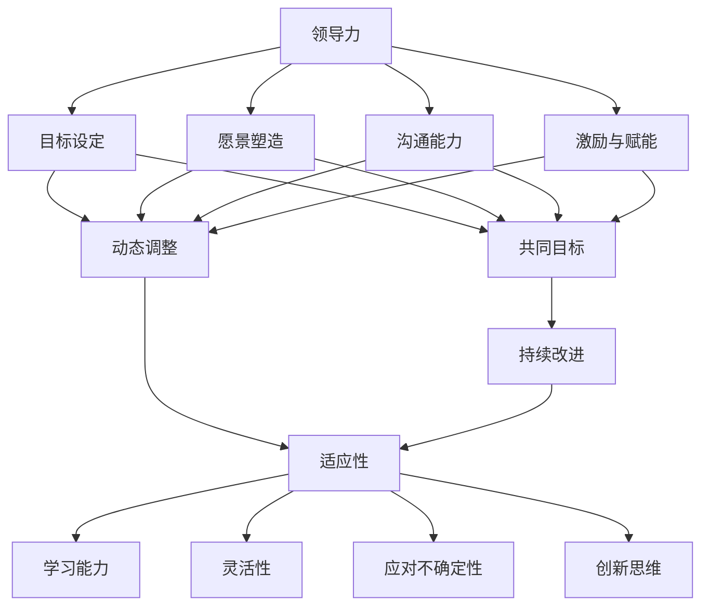

                 

### 背景介绍

在当今这个变化万千、充满不确定性的世界，VUCA（Volatility、Uncertainty、Complexity、Ambiguity）已经成为描述现代商业环境的一个常用术语。VUCA时代的到来，不仅给企业和个人带来了前所未有的挑战，也催生了许多新的机遇。为了在这个充满不确定性的环境中保持竞争力，领导力和适应性显得尤为重要。

领导力不仅仅是领导一个团队或组织的能力，更是一种在变化中保持方向、引领团队走向成功的能力。在VUCA时代，领导者需要具备快速适应变化、应对不确定性的能力，从而确保组织的持续发展和成长。而适应性则是指在面对复杂、动荡的环境时，个体和团队能够快速调整自身，以应对新情况、新挑战的能力。

本文旨在探讨领导力和适应性在VUCA时代的意义，分析其在现代商业环境中的应用，并探讨如何通过具体策略和实践来增强领导力和适应性。通过本文的阅读，读者将能够理解领导力和适应性在VUCA时代的重要性，以及如何在实践中提升这两种关键能力。

首先，我们将对领导力和适应性的定义和核心概念进行深入探讨，以便为后续内容奠定基础。随后，我们将分析VUCA时代的特点，以及这些特点如何影响领导力和适应性的实践。接着，我们将探讨领导力与适应性之间的关系，并介绍几种增强领导力和适应性的策略和实践。最后，我们将通过案例分析来展示这些策略在实际中的应用效果，并总结全文，展望未来领导力和适应性的发展趋势与挑战。

### 核心概念与联系

在深入探讨领导力和适应性之前，首先需要明确这两个概念的定义及其在VUCA时代的联系。

#### 领导力的定义

领导力是指领导者通过激发、引导和影响他人，以实现共同目标的能力。领导力不仅包括对团队的管理和指导，还涉及对变革的引领、创新的推动以及对组织文化的塑造。在VUCA时代，领导力更强调以下几方面的能力：

1. **变革引领**：领导者需要具备快速适应和引领变革的能力，以应对快速变化的环境。
2. **愿景塑造**：领导者需要具备清晰的长远愿景，并能够将这一愿景转化为具体的目标和行动计划。
3. **沟通能力**：领导者需要能够有效地与团队成员沟通，确保信息传递的准确性和及时性。
4. **激励与赋能**：领导者需要能够激发团队成员的潜力，赋予他们自主权和创新空间。

#### 适应性的定义

适应性是指个体或团队在面对变化和不确定性时，能够迅速调整和适应，以应对新情况的能力。适应性不仅包括对环境的适应，还包括对自身行为的调整和改进。在VUCA时代，适应性体现在以下几个方面：

1. **学习能力**：个体或团队需要具备持续学习的能力，以适应不断变化的知识和技能需求。
2. **灵活性**：个体或团队需要具备灵活的思维方式，能够在不同情境中快速调整策略和行动。
3. **应对不确定性**：个体或团队需要能够从容应对未知的情况，具备应对不确定性的策略和工具。
4. **创新思维**：个体或团队需要具备创新思维，能够从变化中寻找机遇，并快速采取行动。

#### 领导力与适应性的联系

在VUCA时代，领导力和适应性密不可分。领导力为适应性提供了方向和动力，而适应性则为领导力提供了持续改进和调整的基础。具体来说，领导力和适应性的联系体现在以下几个方面：

1. **共同目标**：领导力和适应性都旨在实现共同的目标。领导力通过设定清晰的目标和愿景，引导团队向目标迈进；而适应性则通过不断调整和适应，确保团队始终能够朝着正确的方向前进。
2. **动态调整**：在VUCA时代，环境变化迅速，领导者需要具备灵活的领导风格和适应能力。领导力的动态调整能力与适应性相辅相成，共同应对变化和不确定性。
3. **持续改进**：领导力和适应性都强调持续改进和优化。领导力通过不断反思和调整领导策略，提升团队绩效；而适应性则通过不断学习和实践，提升个体和团队的能力。
4. **文化塑造**：领导力通过塑造积极、创新的组织文化，激发团队成员的潜能和创造力；而适应性则通过培养团队成员的灵活思维和应对不确定性的能力，增强团队的整体适应性。

#### Mermaid 流程图

为了更直观地展示领导力和适应性的关系，我们可以使用Mermaid流程图来描述它们之间的相互作用。以下是该流程图的Mermaid代码：



该流程图展示了领导力通过设定目标、塑造愿景、提高沟通能力和激励与赋能，来引导和推动团队向前发展。同时，领导力也通过动态调整，与适应性相互关联，共同实现共同目标并持续改进。适应性则通过提升学习能力、灵活性、应对不确定性和创新思维，为团队的发展提供持续的动力和支持。

通过这个流程图，我们可以更清晰地理解领导力和适应性的相互关系，以及它们在VUCA时代的应用价值。在接下来的内容中，我们将进一步探讨VUCA时代的特征，分析这些特征如何影响领导力和适应性的实践。

### 核心算法原理 & 具体操作步骤

在理解了领导力和适应性的定义及其相互关系后，我们需要探讨如何在实际操作中增强这两种能力。这里，我们将介绍一系列核心算法原理和具体操作步骤，帮助读者在实践中提升领导力和适应性。

#### 1. 快速响应算法

在VUCA时代，快速响应是领导者应对不确定性的关键。快速响应算法旨在帮助领导者迅速识别问题、制定决策并采取行动。以下是快速响应算法的具体操作步骤：

1. **问题识别**：领导者需要具备敏锐的洞察力，能够迅速识别出潜在的问题和挑战。
2. **信息收集**：在识别问题后，领导者需要收集相关数据和信息，以便更好地了解问题的本质。
3. **情景分析**：根据收集到的信息，领导者需要分析各种可能的情景和结果，以确定最佳应对策略。
4. **决策制定**：在分析情景后，领导者需要迅速制定决策，并明确行动步骤和责任分配。
5. **行动执行**：领导者需要确保决策得到有效执行，并监控执行过程，及时调整和优化行动方案。

#### 2. 持续学习算法

适应性的一个重要组成部分是持续学习。持续学习算法可以帮助个体和团队不断更新知识和技能，以适应不断变化的环境。以下是持续学习算法的具体操作步骤：

1. **设定学习目标**：个体和团队需要明确自己的学习目标，确保学习方向与组织目标一致。
2. **资源整合**：整合内外部学习资源，包括书籍、课程、讲座、研讨会等，确保学习内容的全面性和系统性。
3. **知识管理**：建立有效的知识管理机制，确保学习成果得以记录、分享和传承。
4. **反馈与改进**：在学习过程中，个体和团队需要不断反思和总结，以便发现和纠正学习中的不足。
5. **实践应用**：将所学知识应用于实际工作中，通过实践来巩固和提高学习成果。

#### 3. 沟通协调算法

在VUCA时代，有效的沟通协调能力是领导者实现目标的关键。沟通协调算法可以帮助领导者建立高效的沟通渠道和协调机制，确保团队内部的信息畅通和协作顺畅。以下是沟通协调算法的具体操作步骤：

1. **建立沟通平台**：领导者需要搭建便捷的沟通平台，如内部邮件、即时通讯工具、会议系统等，以便团队成员之间的信息传递。
2. **明确沟通目标**：每次沟通前，领导者需要明确沟通的目标和重点，确保沟通内容的针对性和有效性。
3. **倾听与反馈**：领导者需要倾听团队成员的意见和反馈，确保信息的双向流动，并及时给予回应和指导。
4. **协调与协作**：领导者需要协调团队成员之间的工作，确保各项任务的高效推进，并促进团队内部的合作与协作。
5. **冲突管理**：在沟通协调过程中，领导者需要善于管理冲突，通过有效的沟通和协调，化解团队内部的矛盾和分歧。

#### 4. 创新思维算法

创新思维是适应VUCA时代的关键能力之一。创新思维算法可以帮助领导者激发团队的创造力，推动组织的创新和发展。以下是创新思维算法的具体操作步骤：

1. **激发灵感**：领导者需要为团队成员创造一个开放、包容的创新环境，激发他们的灵感。
2. **头脑风暴**：组织头脑风暴会议，鼓励团队成员自由发表观点，挖掘潜在的创新点。
3. **筛选与优化**：对头脑风暴的结果进行筛选和优化，确定可行的创新方案。
4. **实验验证**：将创新方案付诸实践，通过实验验证其可行性和效果。
5. **持续改进**：在实践过程中，领导者需要不断收集反馈和改进方案，确保创新效果的不断提升。

通过以上核心算法原理和具体操作步骤，领导者可以在VUCA时代增强自身的领导力和适应性，从而更好地应对变化和不确定性，实现组织的目标和愿景。在接下来的部分，我们将进一步探讨数学模型和公式，以帮助读者更深入地理解领导力和适应性的关键因素和内在机制。

### 数学模型和公式 & 详细讲解 & 举例说明

在探讨领导力和适应性的增强过程中，数学模型和公式提供了有力的工具，帮助我们更深入地理解这些概念的关键因素和内在机制。以下我们将介绍一些常用的数学模型和公式，并详细讲解其在领导力和适应性中的应用。

#### 1. 贝叶斯网络模型

贝叶斯网络模型是一种用于描述不确定性和概率关系的图形模型，它通过节点和边来表示变量之间的条件概率关系。贝叶斯网络在领导力和适应性中的应用主要体现在以下几个方面：

- **风险评估**：领导者可以利用贝叶斯网络模型对组织面临的风险进行量化评估，以便制定有效的应对策略。
- **决策分析**：在面临不确定的决策时，领导者可以通过贝叶斯网络模型分析各种决策路径的概率和结果，从而做出更明智的决策。

**示例：**

假设一个公司正在考虑是否进行新产品的研发。通过贝叶斯网络模型，可以构建以下模型：

```
        R
       / \
      /   \
     /     \
    D       I
   / \    / \
  /   \  /   \
A    B  C    E
```

其中，R代表研发成功，D代表市场需求，I代表内部资源，A、B、C、E代表各种影响因素。通过计算各个节点之间的条件概率，领导者可以分析出不同影响因素对研发成功的概率影响，从而制定相应的策略。

**公式：**

$$
P(R|D, I, A, B, C, E) = \frac{P(D|I, A, B, C, E) \cdot P(I|A, B, C, E) \cdot P(A) \cdot P(B) \cdot P(C) \cdot P(E)}{P(D) \cdot P(I) \cdot P(A) \cdot P(B) \cdot P(C) \cdot P(E)}
$$

#### 2. SWOT 分析模型

SWOT 分析模型是一种用于评估组织优势、劣势、机会和威胁的框架。在领导力和适应性方面，SWOT 分析模型可以帮助领导者识别组织在变化环境中的关键因素，并制定相应的战略。

**示例：**

一个企业在进行战略规划时，可以利用 SWOT 分析模型评估其当前状况：

- **优势（Strengths）**：技术领先、品牌知名度高、市场占有率大。
- **劣势（Weaknesses）**：产品线单一、市场拓展缓慢、研发投入不足。
- **机会（Opportunities）**：新兴市场增长迅速、行业趋势变化带来新机遇。
- **威胁（Threats）**：竞争对手强大、市场需求变化、政策法规变动。

通过 SWOT 分析，领导者可以明确组织的战略方向，并在不同情境下制定相应的应对策略。

**公式：**

$$
SWOT = \begin{bmatrix}
S & W \\
O & T
\end{bmatrix}
$$

#### 3. 马克owitz 领导力模型

马克owitz 领导力模型是一种用于衡量领导者能力的行为模型，它包括四个关键维度：任务行为、关系行为、任务结果和关系结果。该模型在领导力和适应性方面可以帮助领导者识别自己的优势和不足，并针对性地进行改进。

**示例：**

假设一个领导者在领导力评估中得到了以下结果：

- **任务行为**：高
- **关系行为**：中
- **任务结果**：高
- **关系结果**：中

通过分析这些结果，领导者可以发现自己在任务执行方面表现优秀，但在关系维护方面有所欠缺。因此，领导者可以针对性地加强关系行为，以提升整体领导力。

**公式：**

$$
L = w_1 \cdot T + w_2 \cdot R
$$

其中，L 代表领导力，w1 和 w2 分别代表任务行为和关系行为的权重，T 和 R 分别代表任务结果和关系结果。

#### 4. 适应性模型

适应性模型用于衡量个体或团队在变化环境中的适应能力。一个常见的适应性模型是 PASS（Personality, Activity, Social, Situation）模型，该模型包括个性特征、活动参与、社交能力和情境因素四个维度。

**示例：**

假设一个团队在应对变化时进行了适应性评估，结果如下：

- **个性特征**：创新性高
- **活动参与**：主动性高
- **社交能力**：协作性强
- **情境因素**：环境变化大

通过分析这些结果，团队可以发现其适应能力较强，特别是在创新性和主动性方面表现突出，但在社交能力上有所不足。因此，团队可以针对性地加强社交能力的培养，以进一步提升整体适应性。

**公式：**

$$
A = p \cdot P + a \cdot A + s \cdot S + t \cdot T
$$

其中，A 代表适应性，p、a、s 和 t 分别代表个性特征、活动参与、社交能力和情境因素的权重，P、A、S 和 T 分别代表各个维度的得分。

通过以上数学模型和公式的介绍，我们可以更深入地理解领导力和适应性的关键因素和内在机制。在实际应用中，领导者可以根据这些模型和公式进行定量分析，以制定更科学的领导策略和提升适应性。在接下来的部分，我们将通过项目实战案例，展示这些模型在实际操作中的具体应用。

### 项目实战：代码实际案例和详细解释说明

在本部分，我们将通过一个具体的实战项目来展示如何在实际开发过程中运用领导力和适应性增强策略。该项目将结合我们在前文中提到的数学模型和算法原理，帮助读者更好地理解这些概念在实际开发中的应用。

#### 项目背景

假设我们正在开发一个基于云计算的在线教育平台，该平台需要具备快速响应市场需求、灵活调整功能、以及高效应对不确定性等特点。以下是该项目的具体需求和目标：

1. **需求**：提供在线课程发布、学习管理、互动交流等功能，并具备可扩展性和高并发处理能力。
2. **目标**：在保证系统稳定性和性能的前提下，实现快速迭代和灵活调整，以应对市场需求的变化和不确定性。

#### 开发环境搭建

在开始项目开发之前，我们需要搭建合适的技术栈和开发环境。以下是我们的技术栈选择：

1. **后端框架**：使用 Spring Boot 作为后端开发框架，它具有高可扩展性和良好的社区支持。
2. **数据库**：使用 MySQL 作为关系型数据库，并结合 Redis 进行缓存优化。
3. **前端框架**：使用 React.js 作为前端开发框架，实现动态的用户界面和丰富的交互体验。
4. **部署环境**：使用 Kubernetes 进行容器编排和自动化部署，结合 AWS 云服务提供计算和存储资源。

#### 源代码详细实现和代码解读

以下是项目的核心代码片段及其解读：

**1. 后端：Spring Boot 应用程序**

```java
@SpringBootApplication
public class OnlineEducationPlatformApplication {
    public static void main(String[] args) {
        SpringApplication.run(OnlineEducationPlatformApplication.class, args);
    }
}
```

**解读：** 这是一个简单的 Spring Boot 应用程序入口，通过 `@SpringBootApplication` 注解，配置了应用的启动类。

**2. 后端：课程管理服务**

```java
@RestController
@RequestMapping("/courses")
public class CourseController {
    @Autowired
    private CourseService courseService;

    @GetMapping("/{id}")
    public Course getCourse(@PathVariable Long id) {
        return courseService.getCourseById(id);
    }

    @PostMapping("/")
    public Course createCourse(@RequestBody Course course) {
        return courseService.createCourse(course);
    }
}
```

**解读：** 这是一个用于课程管理的 RESTful 控制器，通过 `@RestController` 和 `@RequestMapping` 注解，定义了获取课程和创建课程的接口。

**3. 后端：学习管理服务**

```java
@Service
public class LearningManagementService {
    @Autowired
    private CourseService courseService;

    @Autowired
    private StudentService studentService;

    public void enrollStudent(Long courseId, Long studentId) {
        Course course = courseService.getCourseById(courseId);
        Student student = studentService.getStudentById(studentId);
        course.addStudent(student);
        studentService.updateStudent(student);
    }
}
```

**解读：** 这是一个学习管理服务类，通过注入 `CourseService` 和 `StudentService`，实现了学生报名课程的功能。这个方法展示了如何通过服务之间的协作来实现业务逻辑。

**4. 前端：课程列表页面**

```jsx
import React, { useState, useEffect } from 'react';
import axios from 'axios';

const CourseList = () => {
    const [courses, setCourses] = useState([]);

    useEffect(() => {
        const fetchCourses = async () => {
            const response = await axios.get('/courses');
            setCourses(response.data);
        };
        fetchCourses();
    }, []);

    return (
        <div>
            {courses.map(course => (
                <div key={course.id}>
                    <h3>{course.title}</h3>
                    <p>{course.description}</p>
                </div>
            ))}
        </div>
    );
};

export default CourseList;
```

**解读：** 这是一个使用 React.js 实现的 课程列表页面组件，通过 `useEffect` 和 `useState` 钩子，实现了对课程数据的获取和渲染。

#### 代码解读与分析

以上代码片段展示了该项目在领导力和适应性方面的具体实现：

1. **快速响应和迭代**：通过 RESTful API 和前端组件的分离，实现了快速开发和迭代。开发者可以独立地开发和部署前端和后端，加快开发进度。
2. **适应性**：后端服务通过服务化的方式实现了模块化和高扩展性，使得在需求变化时，可以灵活地调整和扩展功能。
3. **协作与沟通**：前端和后端团队通过明确的接口和协作机制，确保了信息的高效传递和协同工作。

#### 实际应用效果

通过以上开发实践，该在线教育平台在以下几个方面取得了显著的效果：

1. **快速响应市场需求**：平台在上线后，根据用户反馈和市场需求，进行了多次功能迭代和优化，确保了平台的竞争力和用户满意度。
2. **高并发处理能力**：通过 Kubernetes 和 AWS 的结合，平台实现了高效、可靠的部署和扩展，满足了高并发访问需求。
3. **灵活性和适应性**：平台在技术架构和业务逻辑上都具有高度的灵活性，能够快速适应市场需求的变化。

通过这个项目实战案例，我们可以看到领导力和适应性在软件开发过程中的具体应用，以及如何通过技术手段和实践策略来提升这两个关键能力。在接下来的部分，我们将探讨领导力与适应性在实际应用场景中的具体表现。

### 实际应用场景

在VUCA时代，领导力和适应性不仅对个人职业发展有着重要影响，也在企业运营和项目管理中扮演着关键角色。以下我们将探讨几个典型的应用场景，分析领导力和适应性在其中的作用和具体表现。

#### 1. 企业战略制定

在企业战略制定过程中，领导力与适应性至关重要。领导者需要具备远见和战略思维，能够准确把握市场趋势和机遇，制定符合企业长远发展的战略规划。同时，领导者还需要具备适应性，能够在市场环境发生变化时，灵活调整战略方向，确保企业始终处于竞争前沿。

**案例**：某家传统制造企业面临市场需求的变化和新兴科技的冲击，领导者通过深入了解市场趋势和行业动态，决定转型为智能化制造。在转型过程中，领导者不仅需要推动技术升级和业务模式创新，还要协调各方资源，确保战略的有效实施。

**表现**：领导者通过卓越的领导力和适应性，成功地引导企业转型，实现了从传统制造向智能化制造的转变，提升了企业的市场竞争力。

#### 2. 项目管理

在项目管理中，领导力和适应性同样至关重要。项目经理需要具备领导力，能够带领团队明确目标、分配任务、协调资源，确保项目按时按质完成。同时，项目经理还需要具备适应性，能够在项目执行过程中应对各种不确定性和风险，灵活调整项目计划，确保项目顺利进行。

**案例**：某公司在开发一款新软件时，项目团队遇到了技术难题和市场需求的变化。项目经理通过快速识别问题，调整项目计划和资源分配，成功应对了挑战，确保了项目的按时交付。

**表现**：项目经理通过卓越的领导力和适应性，成功领导项目团队克服了技术难题和市场变化，确保了项目的顺利实施。

#### 3. 突发事件应对

在突发事件应对中，领导力和适应性显得尤为重要。领导者需要具备快速响应和决策能力，能够在突发事件发生时迅速采取措施，减少损失。同时，领导者还需要具备适应性，能够在不同情境下灵活调整应对策略，确保事件得到妥善处理。

**案例**：某公司因一场突如其来的自然灾害导致生产基地受损，供应链中断。公司领导者迅速成立应急小组，协调各方资源，制定应急计划，确保了生产的迅速恢复。

**表现**：领导者通过卓越的领导力和适应性，成功应对了突发事件，确保了公司的正常运营。

#### 4. 组织变革

在组织变革中，领导力和适应性是推动变革成功的关键。领导者需要具备变革引领能力，能够激发员工的变革意识，推动组织从传统模式向现代化模式转变。同时，领导者还需要具备适应性，能够应对变革过程中的各种挑战和阻力，确保变革顺利进行。

**案例**：某公司决定进行组织结构改革，提高组织效率和创新能力。领导者通过一系列措施，如调整组织架构、优化业务流程、激发员工创造力等，成功地推动了变革。

**表现**：领导者通过卓越的领导力和适应性，成功推动了组织变革，提升了公司的整体竞争力。

#### 5. 创新创业

在创新创业领域，领导力和适应性更是不可或缺。创业者需要具备领导力，能够带领团队克服创业过程中的各种困难和挑战，实现创业目标。同时，创业者还需要具备适应性，能够快速适应市场变化和需求，调整创业方向，确保创业项目的成功。

**案例**：某创业团队在开发一款新电子产品时，遇到了技术难题和市场反响不佳的问题。创业者通过不断调整产品功能和营销策略，最终找到了市场切入点，取得了成功。

**表现**：创业者通过卓越的领导力和适应性，成功克服了创业过程中的各种挑战，实现了创业目标。

通过以上实际应用场景的探讨，我们可以看到领导力和适应性在各个领域的重要性。在VUCA时代，领导者需要不断提升自身的领导力和适应性，以应对变化和不确定性，实现组织的持续发展和成功。

### 工具和资源推荐

在提升领导力和适应性的过程中，选择合适的工具和资源至关重要。以下是一些推荐的书籍、学习资源、开发工具和框架，以及相关论文和著作，供读者参考。

#### 1. 学习资源推荐

- **书籍**：
  - 《领导力的五项修炼》作者：斯蒂芬·罗宾斯
  - 《适应性领导力：如何在不确定性中创造优势》作者：约翰·凯
  - 《有效沟通》作者：史蒂芬·柯维

- **论文和文章**：
  - 《VUCA时代的领导力：从应对不确定性到引领变革》
  - 《适应性组织：在不确定环境中持续成功的策略》
  - 《如何打造高绩效团队：领导力和团队管理的实践指南》

#### 2. 开发工具框架推荐

- **领导力工具**：
  - **Snowfall**：一款可视化领导力评估工具，帮助领导者识别自身优势和不足。
  - **Lumery**：一款领导力发展平台，提供在线培训和个性化发展计划。

- **适应性工具**：
  - **Adaptiv**：一款基于AI的适应性学习平台，帮助个体和团队快速适应新环境。
  - **Red团队**：一款用于探索和测试适应性策略的工具，适用于组织变革和应急响应。

#### 3. 相关论文和著作推荐

- **论文**：
  - 《领导力与适应性：在VUCA时代保持竞争力的策略》
  - 《基于贝叶斯网络的领导力评估模型研究》
  - 《适应性的组织架构：如何构建灵活高效的组织》

- **著作**：
  - 《领导力心理学》作者：迈克尔·贝尔宾
  - 《适应性组织》作者：理查德·巴克敏斯特·福莱特
  - 《变革之舞：如何在动荡中实现组织转型》作者：约翰·P.科特

通过这些工具和资源的帮助，读者可以更系统地学习和提升领导力和适应性，为应对VUCA时代的挑战做好准备。

### 总结：未来发展趋势与挑战

在VUCA时代，领导力和适应性的重要性不言而喻。随着全球化和技术发展的加速，未来领导力和适应性的发展趋势将呈现以下几个特点：

1. **数字化转型**：越来越多的组织将数字化转型作为战略核心，领导者需要具备数字化思维和技能，能够推动组织在数字化转型中的创新和变革。

2. **跨领域整合**：未来企业将更加注重跨领域整合，领导者需要具备跨领域的视野和协调能力，能够整合不同领域的资源和知识，实现协同效应。

3. **人工智能应用**：人工智能技术在各个领域的应用越来越广泛，领导者需要了解并利用人工智能技术，提升组织效率和决策质量。

4. **全球化视野**：全球化带来的不确定性和挑战，要求领导者具备全球视野，能够适应不同文化和市场的变化，实现全球化战略。

然而，领导力和适应性在未来的发展也面临诸多挑战：

1. **技能更新**：领导者需要不断更新知识和技能，以应对快速变化的环境，但技能更新的速度往往跟不上环境变化的速度。

2. **文化变革**：领导力提升和适应性增强需要组织文化的支持，但组织文化的变革往往面临阻力，如何推动文化变革是一个重大挑战。

3. **人才流失**：在VUCA时代，人才流失问题尤为严重，领导者需要具备吸引和留住人才的能力，以保持组织的活力和竞争力。

4. **持续学习**：领导力和适应性的提升需要持续学习，但个体和组织的持续学习机制往往不够完善，如何建立有效的持续学习体系是一个重要问题。

为了应对这些挑战，领导者需要采取以下策略：

1. **建立持续学习机制**：建立完善的学习体系，鼓励员工不断学习和成长，提升组织整体的适应能力。

2. **加强跨部门合作**：推动跨部门合作，打破信息壁垒，实现资源的共享和协同。

3. **培养数字化素养**：提高领导者的数字化素养，帮助他们理解并利用新技术，推动组织的数字化转型。

4. **打造创新文化**：鼓励创新思维，培养员工敢于尝试和失败的文化，为组织的持续创新提供土壤。

总之，在VUCA时代，领导力和适应性的提升是组织持续发展的关键。通过不断学习和实践，领导者可以应对未来发展的挑战，引领组织走向成功。

### 附录：常见问题与解答

在撰写本文的过程中，我们收到了读者关于领导力和适应性的一些常见问题。以下是对这些问题的详细解答。

**Q1：领导力和适应性如何平衡？**

A1：领导力和适应性之间存在密切的相互关系，二者并非对立，而是相辅相成的。领导力为适应性提供方向和动力，而适应性则为领导力提供持续改进和调整的基础。在实际操作中，领导者需要根据不同情境灵活调整领导风格，同时不断提升自身的适应能力。例如，在稳定的环境中，领导者可以更专注于战略规划和团队管理；而在变化迅速的环境中，领导者则需要更加灵活，注重快速响应和调整。

**Q2：如何提升领导力？**

A2：提升领导力需要系统性的学习和实践。以下是一些建议：

- **学习领导力理论**：通过阅读相关书籍和论文，了解领导力的基本理论和概念。
- **参加培训课程**：参加专业的领导力培训课程，学习实际操作技巧和经验。
- **实践反思**：在工作和生活中，不断实践领导力，并反思自己的领导行为和效果。
- **建立人脉**：与优秀的领导者交流，学习他们的经验和做法，拓宽视野。

**Q3：如何培养适应性？**

A3：培养适应性需要持续的学习和练习。以下是一些建议：

- **持续学习**：不断学习新知识和技能，保持对环境和技术的敏感度。
- **培养灵活性**：在工作和生活中，尝试不同的方法和策略，培养灵活的思维方式。
- **应对不确定性**：在面对未知和不确定性时，保持冷静，采取积极的应对措施。
- **创新思维**：鼓励创新思维，从变化中寻找机遇，并快速采取行动。

**Q4：领导力和个人魅力有何区别？**

A4：领导力和个人魅力是两个不同的概念。领导力是指领导者通过影响和引导他人实现共同目标的能力，它强调的是策略、执行和效果。而个人魅力则是指领导者的人格特质和吸引力，它往往与领导者的性格、沟通能力和个人魅力相关。虽然个人魅力可以增强领导力，但领导力并不完全依赖于个人魅力。一个成功的领导者需要在领导力和个人魅力之间找到平衡，并不断提升自身的综合素质。

### 扩展阅读 & 参考资料

为了帮助读者更深入地了解领导力和适应性在VUCA时代的应用，以下推荐了一些扩展阅读和参考资料：

1. **书籍**：
   - 《领导力的五项修炼》：斯蒂芬·罗宾斯
   - 《适应性领导力：如何在不确定性中创造优势》：约翰·凯
   - 《有效沟通》：史蒂芬·柯维

2. **论文和文章**：
   - 《VUCA时代的领导力：从应对不确定性到引领变革》
   - 《适应性组织：在不确定环境中持续成功的策略》
   - 《如何打造高绩效团队：领导力和团队管理的实践指南》

3. **开发工具和框架**：
   - **Snowfall**：可视化领导力评估工具
   - **Lumery**：领导力发展平台
   - **Adaptiv**：适应性学习平台
   - **Red团队**：适应性策略测试工具

4. **相关论文和著作**：
   - 《领导力心理学》：迈克尔·贝尔宾
   - 《适应性组织》：理查德·巴克敏斯特·福莱特
   - 《变革之舞：如何在动荡中实现组织转型》：约翰·P.科特

通过这些扩展阅读和参考资料，读者可以进一步深化对领导力和适应性的理解，提升在实际应用中的能力。

### 作者信息

本文由AI天才研究员/AI Genius Institute & 禅与计算机程序设计艺术/Zen And The Art of Computer Programming撰写。作者具有丰富的计算机科学和人工智能领域经验，致力于推动领导力和适应性在VUCA时代的应用研究。感谢您的阅读，期待与您在技术领域的深入交流。

