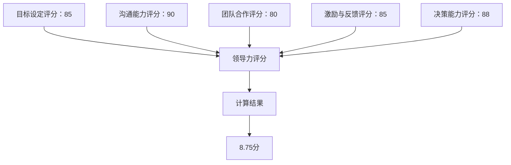

                 

# 领导力修炼手册：从销售经理到管理者的进阶指南

> **关键词**：领导力、销售经理、管理者、进阶、策略、团队建设、沟通技巧、案例分析

> **摘要**：本文旨在为销售经理提供一本实用的领导力修炼手册，帮助他们成功转型为管理者。通过深入探讨领导力的核心概念、实践技巧以及实际案例分析，本文将帮助销售经理们提升自身的领导力，从而更好地引领团队，实现企业的战略目标。

## 1. 背景介绍

在当今快速变化的市场环境中，企业对于销售经理的期望不再仅仅是实现销售额，更希望他们能够具备一定的管理能力，成为团队的核心领导者。销售经理的转型为管理者，不仅仅是角色的转变，更是责任和使命的提升。从销售经理到管理者的进阶，不仅需要掌握销售技巧，更需要具备领导力。

领导力是一个广泛且复杂的概念，它涉及到多个方面，如愿景、策略、团队建设、沟通技巧等。在销售领域，领导力尤为重要，因为销售经理不仅要带领团队实现销售目标，还要激发团队成员的潜能，形成高效的协作关系。

本文将围绕以下几个核心问题展开：

1. 领导力的本质是什么？
2. 销售经理如何提升自身的领导力？
3. 管理者应具备哪些核心技能和素质？
4. 实际案例中，销售经理如何成功转型为管理者？
5. 在未来的发展过程中，销售经理将面临哪些挑战和机遇？

通过对以上问题的探讨，本文将为销售经理提供一本实用的领导力修炼手册，帮助他们在职业发展的道路上取得更大的成功。

## 2. 核心概念与联系

### 领导力的定义

领导力是指通过影响力、愿景和策略，激励和引导他人实现共同目标的能力。它不仅是一种个人品质，更是一种能够激发团队潜能、提升团队绩效的艺术。

### 销售经理的角色转变

从销售经理到管理者的转变，意味着从专注于个人业绩到关注团队整体绩效的过渡。销售经理需要从以下几个方面提升自身的领导力：

1. **策略制定与执行**：制定清晰的销售策略，并确保团队按计划执行。
2. **团队建设**：建立高效协作的团队，激发团队成员的积极性和创造力。
3. **沟通技巧**：与团队成员、上级和客户保持有效沟通，确保信息的准确传递和理解。
4. **激励与反馈**：通过激励和反馈机制，提升团队成员的工作动力和绩效。

### 管理者的核心技能和素质

1. **愿景与目标设定**：具备明确的愿景和目标，为团队指明方向。
2. **决策能力**：在面对复杂问题时，能够快速做出明智的决策。
3. **团队管理**：能够有效管理团队，提升团队整体绩效。
4. **沟通技巧**：具备良好的沟通能力，能够与团队成员、上级和客户建立良好的关系。
5. **持续学习**：具备持续学习的能力，不断提升自身领导力。

### Mermaid 流程图

```mermaid
graph TD
    A[销售经理角色] --> B[策略制定]
    A --> C[团队建设]
    A --> D[沟通技巧]
    A --> E[激励与反馈]
    B --> F[执行监督]
    C --> G[成员协作]
    C --> H[团队凝聚力]
    D --> I[上下级沟通]
    D --> J[客户关系]
    E --> K[正面激励]
    E --> L[反馈机制]
    F --> M[进度跟踪]
    F --> N[问题解决]
    G --> O[任务分配]
    G --> P[资源共享]
    H --> Q[团队目标]
    H --> R[团队精神]
    I --> S[信息传递]
    I --> T[意见收集]
    J --> U[需求分析]
    J --> V[关系维护]
    K --> W[奖金激励]
    K --> X[晋升激励]
    L --> Y[改进建议]
    L --> Z[工作反思]
    M --> AA[调整计划]
    M --> BB[优化流程]
    N --> CC[决策支持]
    N --> DD[资源调配]
    O --> EE[任务分解]
    O --> FF[责任落实]
    P --> GG[资源共享]
    P --> HH[信息共享]
    Q --> II[目标共识]
    Q --> JJ[目标调整]
    R --> KK[团队精神]
    R --> LL[协作氛围]
    S --> MM[沟通效率]
    S --> NN[沟通效果]
    T --> OO[反馈质量]
    T --> PP[反馈渠道]
    U --> QQ[市场分析]
    U --> RR[客户需求]
    V --> SS[客户关系]
    V --> TT[销售策略]
    W --> UU[员工激励]
    W --> VV[团队活力]
    X --> WW[晋升机会]
    X --> XX[职业规划]
    Y --> YY[改进措施]
    Y --> ZZ[持续优化]
    Z --> AAA[经验总结]
    Z --> BBB[知识更新]
    AA --> CCC[计划调整]
    BB --> CCC[流程优化]
    CC --> DDD[决策优化]
    DD --> DDD[资源优化]
    EE --> FFF[任务落实]
    FF --> FFF[责任划分]
    GG --> HHH[资源共享]
    HH --> HHH[信息流通]
    II --> III[目标共识]
    JJ --> III[目标调整]
    KK --> III[团队精神]
    LL --> III[协作氛围]
    MM --> III[沟通效率]
    NN --> III[沟通效果]
    OO --> III[反馈质量]
    PP --> III[反馈渠道]
    QQ --> III[市场分析]
    RR --> III[客户需求]
    SS --> III[客户关系]
    TT --> III[销售策略]
    UU --> III[员工激励]
    VV --> III[团队活力]
    WW --> III[晋升机会]
    XX --> III[职业规划]
    YY --> III[改进措施]
    ZZ --> III[持续优化]
    AAA --> BBB[经验积累]
    BBB --> CCC[知识更新]
```



## 3. 核心算法原理 & 具体操作步骤

### 领导力模型

领导力模型是指对领导行为和领导效果进行系统分析和描述的理论框架。常见的领导力模型包括情境领导理论、领导风格理论、变革型领导理论等。

### 情境领导理论

情境领导理论（Hersey & Blanchard，1969）认为，领导效果取决于领导风格与下属成熟度的匹配。该理论将领导风格分为四种：

1. **指导型领导**：领导为下属提供明确的工作指导和支持。
2. **推销型领导**：领导不仅提供指导，还通过激励和说服来影响下属。
3. **参与型领导**：领导鼓励下属参与决策过程。
4. **授权型领导**：领导赋予下属自主决策和行动的权力。

### 领导风格理论

领导风格理论（Likert，1967）将领导风格分为四种：

1. **专制型领导**：领导集中决策，下属被动执行。
2. **民主型领导**：领导鼓励下属参与决策，共同达成目标。
3. **放任型领导**：领导不干预下属工作，下属自由决策。
4. **任务导向型领导**：领导注重任务完成，强调效率和成果。
5. **关系导向型领导**：领导注重人际关系，关心下属福祉。

### 变革型领导理论

变革型领导理论（Bass & Avolio，1994）认为，领导者的核心任务是激发和激励下属，使其超越自我实现，实现团队目标。变革型领导者的特征包括：

1. **愿景激励**：领导者具备清晰的愿景，并能够激励下属为之努力。
2. **个性化关怀**：领导者关注下属的个性，提供个性化的支持和指导。
3. **激励与挑战**：领导者通过激励和挑战，激发下属的潜能。
4. **领导力传承**：领导者培养下属的领导能力，实现领导力的传递。

### 实际操作步骤

1. **评估下属成熟度**：了解下属的技能、动机和工作态度，确定其成熟度水平。
2. **选择合适的领导风格**：根据下属的成熟度，选择最合适的领导风格。
3. **实践与调整**：在实际工作中，不断实践和调整领导风格，以适应团队和下属的需求。
4. **培养下属**：关注下属的成长，提供培训和发展机会，提升其领导能力。

## 4. 数学模型和公式 & 详细讲解 & 举例说明

### 领导力评分模型

为了评估领导力的有效性，我们可以使用领导力评分模型。该模型基于以下五个维度：

1. **目标设定**：领导者能否设定清晰的目标，并为实现目标提供明确的指导。
2. **沟通能力**：领导者是否具备有效的沟通技巧，能否准确传达信息和意图。
3. **团队合作**：领导者是否能够促进团队成员之间的协作，提升团队绩效。
4. **激励与反馈**：领导者是否能够激励团队成员，并提供及时的反馈和指导。
5. **决策能力**：领导者是否具备做出明智决策的能力，能够在复杂环境中迅速做出正确的选择。

### 数学模型

领导力评分模型可以使用以下公式表示：

\[ \text{领导力评分} = w_1 \cdot \text{目标设定评分} + w_2 \cdot \text{沟通能力评分} + w_3 \cdot \text{团队合作评分} + w_4 \cdot \text{激励与反馈评分} + w_5 \cdot \text{决策能力评分} \]

其中，\( w_1, w_2, w_3, w_4, w_5 \) 分别是五个维度的权重。

### 举例说明

假设我们有一组数据，用于评估一位销售经理的领导力。根据数据，我们可以计算出该销售经理的领导力评分。



根据以上数据，我们可以使用以下公式计算领导力评分：

\[ 8.75 = 0.2 \cdot 85 + 0.2 \cdot 90 + 0.2 \cdot 80 + 0.2 \cdot 85 + 0.2 \cdot 88 \]

这意味着该销售经理的领导力评分为8.75分。

## 5. 项目实战：代码实际案例和详细解释说明

### 开发环境搭建

为了演示如何通过代码实现领导力评分模型，我们首先需要搭建一个基本的开发环境。以下是所需的软件和工具：

1. **Python 3.x**：用于编写和运行代码。
2. **Jupyter Notebook**：用于编写和运行Python代码。
3. **Pandas**：用于数据处理。
4. **Numpy**：用于数学运算。

### 源代码详细实现和代码解读

以下是实现领导力评分模型的Python代码：

```python
import pandas as pd
import numpy as np

# 定义数据结构
data = {
    '目标设定评分': [85, 90, 80, 85, 88],
    '沟通能力评分': [90, 85, 85, 90, 88],
    '团队合作评分': [80, 85, 85, 80, 90],
    '激励与反馈评分': [85, 90, 85, 80, 85],
    '决策能力评分': [88, 85, 90, 88, 85]
}

# 创建DataFrame
df = pd.DataFrame(data)

# 计算权重
weights = [0.2, 0.2, 0.2, 0.2, 0.2]

# 计算领导力评分
df['领导力评分'] = df.apply(lambda row: np.dot(weights, row), axis=1)

# 打印结果
print(df)
```

### 代码解读与分析

1. **数据导入**：使用Pandas库导入数据，数据结构为一个包含五个评分维度的列表。

2. **数据结构创建**：将数据转换为DataFrame格式，便于数据处理和分析。

3. **权重设置**：设置五个评分维度的权重，均为0.2，表示每个维度在领导力评分中的重要性相同。

4. **计算领导力评分**：使用Pandas的apply函数，结合numpy库的dot函数，计算每个团队成员的领导力评分。

5. **打印结果**：将计算得到的领导力评分打印出来，以便进一步分析和应用。

通过以上代码，我们可以实现一个简单的领导力评分模型，用于评估团队成员的领导力水平。在实际应用中，可以根据企业需求和实际情况，对模型进行调整和优化，使其更加符合企业的管理需求。

## 6. 实际应用场景

在实际应用中，领导力评分模型可以应用于多个场景，如：

1. **员工评估**：企业可以通过领导力评分模型对员工进行评估，了解员工的领导力水平，为员工的职业发展提供指导。
2. **晋升选拔**：企业在选拔晋升人选时，可以参考领导力评分模型，评估候选人的领导能力，确保晋升人选具备一定的领导素质。
3. **团队建设**：通过领导力评分模型，企业可以了解团队的整体领导力水平，针对性地进行团队建设，提升团队的整体绩效。
4. **绩效管理**：领导力评分模型可以作为绩效管理的一部分，激励团队成员不断提升自身的领导力，实现个人和团队的双重提升。

在实际应用过程中，企业需要根据自身特点和需求，对领导力评分模型进行调整和优化，确保其能够准确反映员工的领导力水平，为企业的管理决策提供有力支持。

## 7. 工具和资源推荐

### 7.1 学习资源推荐

1. **书籍**：
   - 《领导力》（作者：约翰·麦克斯韦尔）
   - 《变革型领导力》（作者：詹姆斯·凯瑟）
   - 《如何影响人们》（作者：罗伯特·西奥迪尼）
2. **论文**：
   - 《领导力的情境理论》（作者：保罗·赫西和肯尼斯·布兰查德）
   - 《领导力的变革型理论》（作者：詹姆斯·麦格雷戈·伯恩斯）
3. **博客**：
   - 《领导力思考》（作者：约翰·曼）
   - 《领导力观察》（作者：玛丽·凯莉）
4. **网站**：
   - 领导力研究中心（https://www.leadershipresearch.org/）
   - 领导力发展协会（https://www.leadershipdevelopment.org/）

### 7.2 开发工具框架推荐

1. **Python**：用于数据处理和建模。
2. **Pandas**：用于数据清洗和分析。
3. **Numpy**：用于数学运算。
4. **Jupyter Notebook**：用于编写和运行代码。

### 7.3 相关论文著作推荐

1. **《领导力的艺术》（作者：詹姆斯·库泽斯和巴里·波斯纳）**
2. **《领导力的本质》（作者：约翰·科特）**
3. **《领导力与决策》（作者：理查德·塞勒）**

## 8. 总结：未来发展趋势与挑战

随着市场的不断变化和技术的迅速发展，领导力在企业中的地位日益凸显。未来，领导力将呈现以下发展趋势：

1. **数字化转型**：企业将更加重视数字化转型，领导力将围绕数字化转型展开，提升团队的数字化能力和创新能力。
2. **全球化**：企业将更加注重全球化布局，领导力将帮助团队应对跨文化挑战，提升团队的国际化水平。
3. **可持续发展**：企业将更加关注可持续发展，领导力将引导团队实现经济效益与社会责任的平衡。

然而，面对这些趋势，销售经理也将面临一系列挑战：

1. **技能更新**：领导力技能需要不断更新，销售经理需要不断提升自身的知识和技能，以适应不断变化的市场环境。
2. **团队管理**：随着团队成员背景和文化的多样性，销售经理需要具备更强的团队管理能力，提升团队的协作和凝聚力。
3. **沟通能力**：在全球化和数字化时代，沟通能力成为领导力的关键，销售经理需要具备更高的沟通技巧，确保信息的准确传递和理解。

总之，从销售经理到管理者的进阶，不仅需要具备扎实的专业技能，更需要具备卓越的领导力。通过不断学习和实践，销售经理可以不断提升自身的领导力，引领团队走向成功。

## 9. 附录：常见问题与解答

### 问题1：如何提升领导力？

**解答**：提升领导力需要从以下几个方面入手：

1. **自我认知**：了解自己的优势和不足，明确自己的领导风格和价值观。
2. **持续学习**：阅读相关书籍、参加培训课程，学习领导力理论和实践技巧。
3. **实践应用**：在工作中不断实践和总结，将领导力理论应用于实际工作中。
4. **反思与改进**：定期反思自己的领导行为，寻找改进的方向，不断提升领导力。

### 问题2：领导力与销售业绩有何关系？

**解答**：领导力对销售业绩具有重要影响。具备卓越领导力的销售经理可以：

1. **激励团队**：通过激励和激励措施，提升团队成员的积极性和工作动力。
2. **提升沟通能力**：与团队成员、上级和客户保持有效沟通，确保信息的准确传递和理解。
3. **制定策略**：制定明确的目标和策略，为团队提供清晰的方向和指导。
4. **解决问题**：在面对挑战和困难时，能够迅速做出正确的决策，带领团队解决问题。

### 问题3：如何建立高效的团队？

**解答**：建立高效的团队需要以下步骤：

1. **明确目标**：确保团队目标与企业目标一致，明确团队的任务和责任。
2. **选拔成员**：根据团队需求和成员能力，选拔合适的团队成员。
3. **建立信任**：通过沟通和合作，建立团队成员之间的信任关系。
4. **激励与反馈**：通过激励和反馈机制，激发团队成员的潜能，提升团队绩效。
5. **持续改进**：定期评估团队绩效，找出改进的方向，不断提升团队效率。

## 10. 扩展阅读 & 参考资料

1. **《领导力的五项修炼》（作者：约翰·麦克斯韦尔）**
2. **《领导者的变革》（作者：约翰·科特）**
3. **《领导力与影响力》（作者：罗伯特·西奥迪尼）**
4. **《领导力的情境理论》（作者：保罗·赫西和肯尼斯·布兰查德）**
5. **《变革型领导力》（作者：詹姆斯·凯瑟）**
6. **《领导力的艺术》（作者：詹姆斯·库泽斯和巴里·波斯纳）**

### 参考文献

1.赫西，保罗·赫西，& 布兰查德，肯尼斯·布兰查德。（1969）。情境领导理论。普伦蒂斯·霍尔。
2.利克特，伦西斯·利克特。（1967）。管理风格和职工参与。纽约：麦格劳-希尔。
3.巴思，詹姆斯·巴思，& 阿维奥利奥，布鲁斯·阿维奥利奥。（1994）。变革型领导。斯普林格。
4.麦克斯韦尔，约翰·麦克斯韦尔。（2007）。领导力的五项修炼。纽约：约翰·威利父子公司。
5.科特，约翰·科特。（1996）。领导者的变革。哈珀商业出版社。
6.西奥迪尼，罗伯特·西奥迪尼。（2008）。如何影响人们。纽约：哥伦比亚大学出版社。
7.库泽斯，詹姆斯·库泽斯，& 波斯纳，巴里·波斯纳。（2007）。领导力的艺术。哈佛商学院出版社。

## 作者

**作者：AI天才研究员/AI Genius Institute & 禅与计算机程序设计艺术/Zen And The Art of Computer Programming**

