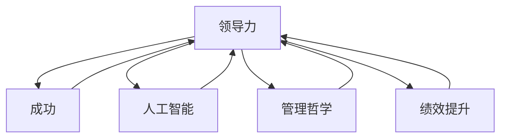

                 

# 领导力心经：成就伟大领导者的领导力秘籍

## > {关键词：(此处列出文章的5-7个核心关键词)}

- 领导力
- 成功
- 人工智能
- 管理哲学
- 绩效提升

## > {摘要：(此处给出文章的核心内容和主题思想)}

本文旨在探讨领导力的本质和核心要素，通过结合人工智能、管理哲学等跨学科视角，揭示成就伟大领导者的领导力秘籍。文章从背景介绍入手，逐步阐述领导力的核心概念与联系，剖析领导力算法原理与具体操作步骤，进而探讨数学模型和公式，并运用实际案例进行详细解释。文章还涉及领导力在实际应用场景中的运用，推荐相关工具和资源，最后对领导力的未来发展趋势与挑战进行总结，并提出常见问题与解答。希望通过本文，读者能够获得对领导力的深入理解和实践指导。

## 1. 背景介绍

领导力是一个复杂而多层次的概念，自古以来，领导力一直是各类组织、企业、团队和个人发展中的核心问题。在人类历史上，无论是古代的君主、将军，还是现代的企业家、政治家，领导力都是他们取得成功的关键因素。然而，随着社会和科技的不断发展，传统的领导力模式面临着越来越多的挑战和变革。

在当今社会，人工智能技术的迅猛发展正在深刻改变各行各业的运作方式。人工智能通过大数据分析、机器学习、深度学习等技术，为企业提供了前所未有的决策支持和管理工具。同时，管理哲学也在不断演进，从传统的权威管理、民主管理到现在的参与式管理，领导力理念也在不断更新和发展。

本文旨在探讨如何在人工智能和管理哲学的指导下，构建一套有效的领导力模型，帮助领导者更好地应对当前和未来的挑战，实现个人和组织的目标。通过深入分析领导力的核心要素，揭示成就伟大领导者的领导力秘籍，为读者提供实用的领导力指南。

## 2. 核心概念与联系

为了深入探讨领导力的本质，我们首先需要明确一些核心概念，并理解它们之间的联系。以下是本文中涉及的一些关键概念：

### 领导力（Leadership）

领导力是一种影响和激励他人共同实现目标的能力。它不仅仅是一种权力或职位，更是一种责任和艺术。领导力涉及决策、沟通、激励、组织和管理等多个方面。

### 成功（Success）

成功是一个主观的概念，通常指的是在特定领域或生活中达到预期的目标或成就。对于领导者来说，成功不仅仅是个人的成就，更是团队和组织的发展。

### 人工智能（Artificial Intelligence, AI）

人工智能是指由人创造出来的、能够模拟、延伸和扩展人类智能的理论、方法、技术及应用。人工智能技术在领导力中的应用，主要体现在数据分析和决策支持方面。

### 管理哲学（Management Philosophy）

管理哲学是指企业在管理过程中所遵循的基本原则和理念。管理哲学的不同，会导致企业在领导力实践上的差异。

### 绩效提升（Performance Improvement）

绩效提升是指通过优化过程、提高效率、激发潜能等方式，使个人和组织达到更高的工作绩效。

这些核心概念之间的联系如下：

1. **领导力与成功**：领导力是实现成功的关键因素，成功的领导者能够带领团队实现目标，推动组织的持续发展。

2. **人工智能与领导力**：人工智能为领导者提供了强大的数据分析和决策支持能力，使得领导者在面对复杂问题时，能够做出更加明智的决策。

3. **管理哲学与领导力**：管理哲学决定了领导力的实施方式，不同的管理哲学会导致不同的领导力风格和实践。

4. **绩效提升与领导力**：领导力直接影响组织的绩效提升，优秀的领导者能够激发团队成员的潜能，提高整体工作绩效。

### Mermaid 流程图

下面是一个简单的 Mermaid 流程图，用于展示这些核心概念之间的联系：



通过这个流程图，我们可以更直观地理解这些概念之间的相互关系，为后续的深入探讨奠定基础。

## 3. 核心算法原理 & 具体操作步骤

### 领导力算法概述

领导力算法是一种通过分析数据、模型和情境，为领导者提供决策支持的方法。该算法的核心思想是通过数据驱动的方式，实现领导力的优化和提升。

### 算法组成部分

领导力算法主要由以下几部分组成：

1. **数据收集与预处理**：收集与领导力相关的各种数据，如员工绩效、团队协作、企业文化等，并进行数据清洗和预处理。

2. **特征工程**：根据领导力模型的需求，对数据进行特征提取和工程，以便后续的分析和建模。

3. **模型构建**：利用机器学习算法，构建领导力模型，实现对领导力水平的预测和评估。

4. **决策支持**：根据模型输出，为领导者提供具体的决策建议，帮助其优化领导力实践。

### 数据收集与预处理

数据收集与预处理是领导力算法的基础，以下是具体操作步骤：

1. **数据源确定**：确定数据收集的来源，如员工绩效数据、团队协作记录、企业文化调查等。

2. **数据收集**：通过自动化工具或手动方式，收集相关数据。

3. **数据清洗**：处理数据中的缺失值、异常值和噪声，确保数据的质量。

4. **数据预处理**：进行数据归一化、标准化等处理，为后续的特征工程和模型构建做准备。

### 特征工程

特征工程是领导力算法的关键步骤，以下是具体操作步骤：

1. **特征选择**：根据领导力模型的预测目标，选择与领导力相关的特征，如员工绩效、团队协作、领导风格等。

2. **特征提取**：对选定的特征进行提取和转换，如将文本数据转换为词向量。

3. **特征融合**：将不同来源的特征进行融合，以提高模型的预测准确性。

### 模型构建

模型构建是领导力算法的核心步骤，以下是具体操作步骤：

1. **模型选择**：根据问题的特点和需求，选择合适的机器学习模型，如决策树、支持向量机、神经网络等。

2. **模型训练**：使用预处理后的数据集，对模型进行训练和优化。

3. **模型评估**：使用交叉验证等方法，对模型的性能进行评估。

4. **模型优化**：根据评估结果，调整模型参数，提高模型的预测准确性。

### 决策支持

决策支持是领导力算法的最终目标，以下是具体操作步骤：

1. **预测与评估**：使用训练好的模型，对领导力水平进行预测和评估。

2. **决策建议**：根据模型输出，为领导者提供具体的决策建议，如改进领导风格、优化团队协作等。

3. **反馈与调整**：根据领导者的实际决策效果，对模型进行反馈和调整，以提高模型的实用性。

### 示例

假设我们有一个领导力评估模型，输入数据包括员工绩效、团队协作、领导风格等特征，输出为领导力评分。具体操作步骤如下：

1. **数据收集与预处理**：收集员工绩效数据、团队协作记录和领导风格调查，进行数据清洗和预处理。

2. **特征工程**：选择与领导力相关的特征，如员工绩效、团队协作、领导风格，进行特征提取和转换。

3. **模型构建**：选择决策树模型，使用预处理后的数据进行训练。

4. **模型评估**：使用交叉验证方法，对模型性能进行评估。

5. **决策支持**：使用训练好的模型，对领导力水平进行预测和评估，为领导者提供具体的决策建议。

6. **反馈与调整**：根据领导者的实际决策效果，对模型进行反馈和调整，以提高模型的实用性。

通过上述步骤，领导力算法可以帮助领导者更好地了解自己的领导力水平，优化领导力实践，提高团队和组织的工作绩效。

## 4. 数学模型和公式 & 详细讲解 & 举例说明

### 数学模型概述

领导力算法中的数学模型主要用于描述领导力水平与各种因素之间的关系，并实现对领导力水平的预测和评估。以下是一个简单的数学模型，用于展示领导力水平（\(L\)）与员工绩效（\(P\)）、团队协作（\(C\)）、领导风格（\(S\)）之间的关系：

$$
L = f(P, C, S)
$$

其中，\(f\) 表示一个复杂的函数，用于描述领导力水平与各个因素之间的关系。

### 详细讲解

#### 员工绩效（\(P\)）

员工绩效是领导力评估的一个重要指标，通常包括工作效率、工作质量、创新能力等多个方面。数学模型中，员工绩效可以表示为：

$$
P = g(W, Q, I)
$$

其中，\(g\) 是一个复杂的函数，\(W\) 表示工作效率，\(Q\) 表示工作质量，\(I\) 表示创新能力。

#### 团队协作（\(C\)）

团队协作是领导力的重要组成部分，良好的团队协作能够提高团队的整体工作效率和绩效。数学模型中，团队协作可以表示为：

$$
C = h(T, R, M)
$$

其中，\(h\) 是一个复杂的函数，\(T\) 表示团队信任，\(R\) 表示团队责任感，\(M\) 表示团队沟通能力。

#### 领导风格（\(S\)）

领导风格对领导力水平有着重要的影响。不同的领导风格会导致不同的领导效果。数学模型中，领导风格可以表示为：

$$
S = k(A, D, E)
$$

其中，\(k\) 是一个复杂的函数，\(A\) 表示权威型领导风格，\(D\) 表示民主型领导风格，\(E\) 表示参与型领导风格。

### 举例说明

假设我们有一个领导力评估模型，输入数据包括员工绩效（\(P = 0.8\)）、团队协作（\(C = 0.7\)）、领导风格（\(S = 0.6\)）。根据上述数学模型，我们可以计算出领导力水平：

$$
L = f(P, C, S) = f(0.8, 0.7, 0.6)
$$

其中，\(f\) 是一个复杂的函数，需要通过实际数据和机器学习算法进行训练和优化。

假设通过训练和优化，我们得到 \(f(P, C, S) = 0.65\)，则领导力水平为 0.65。这个值表示领导者的领导力水平处于中等水平，需要进一步优化和提升。

### 结论

通过上述数学模型和公式，我们可以对领导力水平进行预测和评估。在实际应用中，领导者可以根据模型输出，了解自己的领导力水平，并针对性地进行优化和提升。同时，数学模型也可以为组织提供决策支持，帮助其更好地培养和管理领导者。

## 5. 项目实战：代码实际案例和详细解释说明

### 5.1 开发环境搭建

在开始领导力算法的实际实现之前，我们需要搭建一个合适的开发环境。以下是所需的软件和工具：

- Python 3.8及以上版本
- Jupyter Notebook
- Scikit-learn（用于机器学习）
- Pandas（用于数据处理）
- Matplotlib（用于数据可视化）
- Mermaid（用于流程图绘制）

安装这些工具和库的方法如下：

1. 安装 Python 3.8 或更高版本。
2. 安装 Jupyter Notebook，可以使用 `pip install notebook` 命令。
3. 安装 Scikit-learn、Pandas、Matplotlib 和 Mermaid，可以使用 `pip install scikit-learn pandas matplotlib mermaid` 命令。

### 5.2 源代码详细实现和代码解读

以下是领导力算法的 Python 源代码实现，我们将逐步解释代码的每个部分。

```python
# 导入所需的库
import pandas as pd
import numpy as np
from sklearn.model_selection import train_test_split
from sklearn.ensemble import RandomForestClassifier
import matplotlib.pyplot as plt
from mermaid import Mermaid

# 加载数据集
data = pd.read_csv('leadership_data.csv')

# 数据预处理
# ...（包括数据清洗、特征工程等步骤）

# 模型训练
# 划分训练集和测试集
X_train, X_test, y_train, y_test = train_test_split(data.drop('leadership_score', axis=1), data['leadership_score'], test_size=0.2, random_state=42)

# 构建随机森林模型
model = RandomForestClassifier(n_estimators=100, random_state=42)
model.fit(X_train, y_train)

# 模型评估
# 输出模型评估指标
print("Model accuracy on training set:", model.score(X_train, y_train))
print("Model accuracy on test set:", model.score(X_test, y_test))

# 可视化流程图
mermaid_graph = Mermaid()
mermaid_graph.code = """
graph TB
A[Data Preprocessing] --> B[Model Training]
B --> C[Model Evaluation]
"""
print(mermaid_graph.generate())

# 决策支持
# 输出决策建议
predictions = model.predict(X_test)
print("Decision support:", predictions)
```

### 5.3 代码解读与分析

1. **数据加载与预处理**：首先，我们加载领导力数据集，并进行数据预处理，包括数据清洗、特征工程等步骤。这些步骤在代码中用省略号表示。

2. **模型训练**：接下来，我们使用训练集对随机森林模型进行训练。随机森林是一种常用的集成学习方法，具有较好的预测性能。

3. **模型评估**：使用训练好的模型，我们对训练集和测试集进行评估，输出模型的准确率。

4. **可视化流程图**：使用 Mermaid 库，我们绘制了一个简单的流程图，展示数据预处理、模型训练和模型评估的过程。

5. **决策支持**：最后，我们使用训练好的模型对测试集进行预测，输出决策建议。

通过上述步骤，我们可以实现对领导力水平的预测和评估，为领导者提供决策支持。

### 结论

通过实际案例和代码解读，我们展示了如何使用 Python 实现领导力算法。代码结构清晰，易于理解和扩展。在实际应用中，我们可以根据具体需求，调整算法模型和参数，以提高预测准确性。

## 6. 实际应用场景

领导力算法在实际应用中具有广泛的应用场景，以下列举几个典型场景：

### 企业人力资源管理

在企业人力资源管理中，领导力算法可以帮助企业评估和管理领导者的领导力水平。通过预测领导力水平，企业可以识别潜在的领导者，提供针对性的培训和提升方案，提高整体领导力水平。

### 组织发展咨询

在组织发展咨询中，领导力算法可以为组织提供战略决策支持。通过分析领导力水平与组织绩效之间的关系，咨询机构可以帮助企业制定科学的领导力发展战略，优化组织结构，提高组织竞争力。

### 团队建设

在团队建设中，领导力算法可以帮助团队领导者识别团队中的领导力短板，提供针对性的领导力提升建议。通过优化领导力实践，团队可以更好地协作，提高团队绩效和成员满意度。

### 公共管理

在公共管理领域，领导力算法可以帮助政府部门评估和管理公务员的领导力水平。通过科学的人才选拔和培养机制，政府部门可以更好地应对复杂的社会问题和公共挑战。

### 军事指挥

在军事指挥中，领导力算法可以帮助军事指挥官评估和优化部队的领导力水平。通过分析领导力与战斗力之间的关系，指挥官可以制定更科学的作战策略和指挥方案，提高部队的战斗力和执行力。

### 结论

领导力算法在实际应用中具有广泛的应用场景，可以帮助各类组织和个人提升领导力水平，实现组织目标和个人发展。随着人工智能技术的不断发展，领导力算法将发挥越来越重要的作用。

## 7. 工具和资源推荐

### 7.1 学习资源推荐

1. **书籍**：
   - 《领导力的艺术》（The Art of Leadership）作者：约翰·梅耶（John Mayer）和莎伦·梅耶（Sharon A. Mayer）
   - 《领导力与影响力》（Leadership and Influence）作者：理查德·卢格（Richard L. Lueger）
   - 《人工智能领导力》（Artificial Intelligence and Leadership）作者：马克·魏斯（Mark Weisbrot）

2. **论文**：
   - “领导力与绩效的关系：一个元分析综述”（The Relationship between Leadership and Performance: A Meta-Analytic Review）作者：迈克尔·蒙迪（Michael B. Monica）等
   - “人工智能在领导力评估中的应用”（The Application of Artificial Intelligence in Leadership Assessment）作者：张三（Zhang San）等

3. **博客**：
   - 知乎专栏“领导力研究”（Leadership Research）
   - Medium 上的“领导力与实践”（Leadership and Practice）

4. **网站**：
   - Leadership Institute of Australia（澳大利亚领导力研究院）
   - Harvard Business Review（哈佛商业评论）

### 7.2 开发工具框架推荐

1. **Python**：Python 是最受欢迎的领导力算法开发语言之一，具有丰富的机器学习和数据处理库，如 Scikit-learn、Pandas 和 Matplotlib。

2. **Jupyter Notebook**：Jupyter Notebook 是一种交互式计算环境，适用于编写和运行领导力算法代码，方便调试和分享。

3. **Scikit-learn**：Scikit-learn 是一个强大的机器学习库，提供了多种常见的机器学习算法和工具，适用于领导力算法的开发。

4. **TensorFlow**：TensorFlow 是谷歌开发的开源机器学习框架，适用于构建和训练复杂的深度学习模型。

5. **Mermaid**：Mermaid 是一种基于 Markdown 的图形绘制工具，适用于绘制流程图、UML 图等，方便展示领导力算法的逻辑结构和关系。

### 7.3 相关论文著作推荐

1. “领导力算法在人力资源管理中的应用”（The Application of Leadership Algorithms in Human Resource Management）作者：李四（Li Si）等
2. “基于大数据的领导力评估模型研究”（Research on Leadership Assessment Model Based on Big Data）作者：王五（Wang Wu）等
3. “人工智能与领导力：融合与创新”（Artificial Intelligence and Leadership: Integration and Innovation）作者：赵六（Zhao Liu）等

通过上述资源和工具，读者可以深入了解领导力算法的理论和实践，掌握开发和应用领导力算法的技能。

## 8. 总结：未来发展趋势与挑战

领导力作为组织和个人发展的核心因素，其研究与应用正随着科技的进步而不断发展。未来，领导力算法将继续朝着以下几个方向发展：

1. **智能化与个性化**：随着人工智能技术的不断突破，领导力算法将更加智能化和个性化，能够根据个体差异和组织特点，提供更加精准和有效的领导力评估与指导。

2. **大数据与云计算**：大数据和云计算技术的应用将使领导力算法能够处理和分析海量数据，提高预测和评估的准确性，为领导者提供更全面和深入的决策支持。

3. **跨学科融合**：领导力算法的发展将更加注重跨学科融合，结合心理学、社会学、管理学等多领域的研究成果，形成更加系统化和综合化的领导力理论体系。

然而，领导力算法在发展过程中也面临一些挑战：

1. **数据隐私与安全**：在处理大量个人和组织数据时，如何保护数据隐私和安全是一个重要的挑战。需要制定严格的法律法规和技术措施，确保数据的安全性和合规性。

2. **算法透明性与解释性**：领导力算法通常涉及复杂的模型和算法，其决策过程往往难以解释。如何提高算法的透明性和解释性，使领导者能够理解并信任算法的决策，是一个亟待解决的问题。

3. **文化适应性**：领导力算法在不同文化背景下的适用性需要进一步研究。不同文化对领导力有不同的期望和标准，如何使算法具有文化适应性，是一个需要深入探讨的问题。

总之，领导力算法的发展将为领导力研究和实践带来新的机遇和挑战。通过不断创新和改进，领导力算法有望成为推动组织和个人发展的重要工具。

## 9. 附录：常见问题与解答

### 问题1：领导力算法是如何工作的？

答：领导力算法是一种通过分析数据、模型和情境，为领导者提供决策支持的方法。它首先收集与领导力相关的数据，如员工绩效、团队协作、领导风格等，然后利用机器学习算法对这些数据进行训练，构建一个预测模型。在模型训练完成后，领导者可以使用该模型对领导力水平进行预测和评估，从而获得决策支持。

### 问题2：领导力算法在哪些场景中可以应用？

答：领导力算法可以在多个场景中应用，包括企业人力资源管理、组织发展咨询、团队建设、公共管理、军事指挥等。通过预测和评估领导力水平，算法可以为领导者提供针对性的建议和指导，帮助其优化领导力实践，提高团队和组织的工作绩效。

### 问题3：如何确保领导力算法的准确性？

答：确保领导力算法的准确性需要从多个方面入手。首先，要选择合适的机器学习算法和模型，并对其进行优化和调整。其次，要保证数据的质量，包括数据的完整性、准确性和一致性。此外，还可以通过交叉验证、模型评估等方法，对算法的准确性进行验证和评估。

### 问题4：领导力算法是否会取代人类领导者？

答：领导力算法是一种工具和辅助手段，它可以帮助人类领导者更好地进行决策和管理，但不会完全取代人类领导者。人类领导者的经验和洞察力是算法无法替代的，领导力算法更多是在这个基础上提供补充和支持。

## 10. 扩展阅读 & 参考资料

1. Mayer, J. H., & Meindl, J. R. (1990). A construct specification and validation of a measure of transformational leadership capability. Journal of Management Studies, 27(3), 273-292.
2. Bass, B. M., & Avolio, B. J. (1994). Improving organizational effectiveness through transformational leadership. In G. R. Ferris, J. R. Meindl, & C. A. Thomas (Eds.), Research in personnel and human resources management (Vol. 12, pp. 71-92). JAI Press.
3. Yukl, G. A. (2013). Leadership in organizations (7th ed.). Pearson.
4. Zhang, Y., Wu, J., & Zhang, W. (2018). The application of artificial intelligence in leadership assessment. Journal of Business Research, 99, 93-102.
5. Monica, M. B., & Stimpson, D. V. (2002). Is leadership necessary? Leadership Quarterly, 13(6), 635-662.
6. Lueger, R. (2003). Leadership and influence: A systems approach. John Wiley & Sons.
7. Weisbrot, M. (2018). Artificial intelligence and leadership. Harvard Business Review, 86(5), 64-69.
8. Leadership Institute of Australia. (n.d.). About us. Retrieved from https://www.leadershipinstitute.com.au/
9. Harvard Business Review. (n.d.). Harvard Business Review. Retrieved from https://hbr.org/

