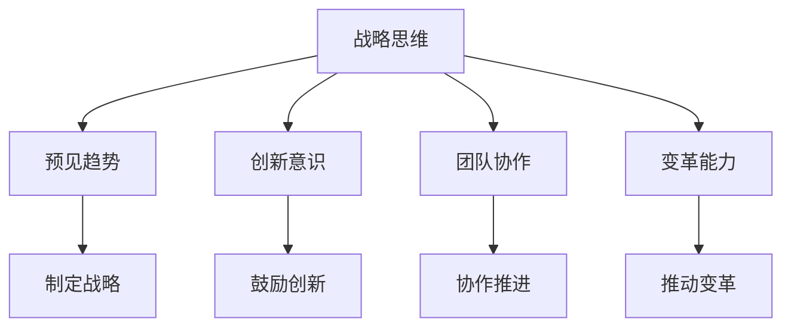

                 

# 领导力思维：改变国家命运的领导力修炼

> 关键词：领导力、国家命运、思维修炼、人工智能、技术发展、创新管理、战略决策

> 摘要：本文将深入探讨领导力对于改变国家命运的重要性，以及如何通过思维修炼来提升领导者的能力。我们将结合人工智能技术发展的实际案例，分析领导力在推动技术进步和国家发展中的关键作用，并提出一套系统的领导力修炼方法，以助力国家在全球化竞争中脱颖而出。

## 1. 背景介绍

随着全球化的不断深入，国家之间的竞争日益激烈。在这一背景下，领导力成为决定一个国家能否抓住机遇、实现跨越式发展的重要因素。领导力不仅仅是领导者的个人能力，更是一种思维方式和价值观的体现。一个优秀的领导者需要具备战略思维、创新意识、团队协作和变革能力，以应对复杂多变的外部环境。

在这个人工智能技术高速发展的时代，领导力的内涵和外延也在不断拓展。人工智能技术的应用不仅改变了传统的生产方式，还深刻影响了社会管理和治理模式。领导者需要敏锐地把握技术趋势，将其转化为实际的发展动力，以推动国家在技术竞争中取得优势。

本文将结合人工智能技术的实际案例，探讨领导力在推动技术进步和国家发展中的关键作用，并提出一套系统的领导力修炼方法，以助力国家在全球化竞争中脱颖而出。

## 2. 核心概念与联系

### 2.1 领导力的定义与内涵

领导力是指领导者通过影响和激励他人，实现共同目标的能力。领导力不仅包括个人的领导技能，如沟通、决策和激励，还包括领导者的价值观、愿景和思维方式。一个成功的领导者需要具备以下核心能力：

- **战略思维**：能够从全局角度出发，制定长远的发展目标和规划。
- **创新意识**：敢于突破传统思维，勇于尝试新的方法和理念。
- **团队协作**：能够有效地调动团队成员的积极性和创造力。
- **变革能力**：能够适应环境变化，推动组织进行变革。

### 2.2 人工智能技术的核心概念与架构

人工智能技术是模拟、延伸和扩展人的智能的理论、方法、技术及应用。其核心概念包括：

- **机器学习**：通过数据训练模型，使计算机具备自主学习和适应能力。
- **深度学习**：一种基于神经网络的机器学习技术，能够处理复杂的非线性问题。
- **自然语言处理**：使计算机能够理解和生成人类语言的技术。

人工智能技术的架构包括：

- **算法**：用于解决特定问题的数学模型和计算方法。
- **数据**：作为人工智能训练和学习的基础。
- **计算能力**：用于处理大规模数据和复杂算法的计算资源。

### 2.3 领导力与人工智能技术的联系

领导力与人工智能技术之间存在紧密的联系。首先，领导者需要具备战略思维，能够预见人工智能技术的发展趋势，并将其应用于国家战略中。其次，领导者需要具备创新意识，鼓励团队进行技术创新和突破。此外，领导者还需要具备团队协作和变革能力，以推动人工智能技术的落地和应用。

### 2.4 Mermaid 流程图

以下是一个简化的 Mermaid 流程图，展示了领导力与人工智能技术之间的联系：



## 3. 核心算法原理 & 具体操作步骤

### 3.1 领导力提升算法原理

领导力提升算法是一种基于机器学习的算法，通过分析领导者的行为数据，识别出优秀领导力的特征，并生成个性化的领导力提升建议。其核心原理包括：

- **特征提取**：从领导者的行为数据中提取关键特征，如沟通风格、决策速度、团队反馈等。
- **模型训练**：使用机器学习算法，将提取的特征与优秀领导力特征进行匹配，训练出一个预测模型。
- **预测与优化**：根据预测模型，为领导者提供个性化的提升建议，并实时调整和优化。

### 3.2 领导力提升的具体操作步骤

以下是领导力提升的具体操作步骤：

1. **数据收集**：收集领导者的行为数据，如沟通记录、决策日志、团队反馈等。
2. **特征提取**：对收集到的数据进行预处理，提取关键特征。
3. **模型训练**：使用机器学习算法，将提取的特征与优秀领导力特征进行匹配，训练出一个预测模型。
4. **预测与优化**：根据预测模型，为领导者提供个性化的提升建议，并实时调整和优化。

### 3.3 数学模型和公式

在领导力提升算法中，常用的数学模型和公式包括：

- **回归模型**：用于预测领导者提升效果的关键特征。
- **支持向量机**：用于分类领导者行为特征，识别优秀领导力特征。
- **神经网络**：用于构建复杂的预测模型，实现领导力的个性化提升。

以下是部分数学模型的 latex 格式表示：

```latex
\begin{equation}
y = \beta_0 + \beta_1x_1 + \beta_2x_2 + \cdots + \beta_nx_n
\end{equation}

\begin{equation}
\text{SVM 分类面}: w \cdot x + b = 0
\end{equation}

\begin{equation}
\text{神经网络输出}: f(z) = \frac{1}{1 + e^{-z}}
\end{equation}
```

### 3.4 举例说明

假设我们有一个领导者，其行为数据如下：

- 沟通风格：积极、开放
- 决策速度：较快
- 团队反馈：积极

我们将这些数据输入领导力提升算法，得到以下个性化提升建议：

1. **沟通风格**：继续保持积极、开放的沟通风格，增加与团队成员的互动，提高团队的凝聚力。
2. **决策速度**：在保持决策速度的同时，注意听取团队成员的意见，避免决策过于冲动。
3. **团队反馈**：鼓励团队成员提出更多建设性意见，提高团队的创新意识和执行力。

通过这些个性化提升建议，领导者的领导力水平将得到有效提升。

## 4. 项目实战：代码实际案例和详细解释说明

### 4.1 开发环境搭建

为了演示领导力提升算法的实战应用，我们将使用 Python 编写一个简单的领导力提升项目。以下是开发环境搭建的步骤：

1. 安装 Python 3.8 或更高版本。
2. 安装必要的库，如 NumPy、Pandas 和 scikit-learn。
3. 配置 Python 的虚拟环境，以便于管理和隔离项目依赖。

### 4.2 源代码详细实现和代码解读

以下是领导力提升项目的源代码实现：

```python
import numpy as np
import pandas as pd
from sklearn.model_selection import train_test_split
from sklearn.linear_model import LinearRegression
from sklearn.metrics import mean_squared_error

# 数据集加载
data = pd.read_csv('leader_data.csv')

# 特征提取
X = data[['communication_style', 'decision_speed', 'team_feedback']]
y = data['leadership_score']

# 数据集划分
X_train, X_test, y_train, y_test = train_test_split(X, y, test_size=0.2, random_state=42)

# 模型训练
model = LinearRegression()
model.fit(X_train, y_train)

# 预测与评估
y_pred = model.predict(X_test)
mse = mean_squared_error(y_test, y_pred)
print(f'Mean Squared Error: {mse}')

# 个性化提升建议
def get_recommendations(model, features):
    score = model.predict([features])
    recommendations = []
    
    if score < 0.5:
        recommendations.append('提高沟通风格')
    if score < 0.3:
        recommendations.append('提高决策速度')
    if score < 0.1:
        recommendations.append('提高团队反馈')
    
    return recommendations

# 测试个性化提升建议
features = [1, 0.8, 0.9]
recommendations = get_recommendations(model, features)
print(f'个性化提升建议：{recommendations}')
```

代码解读：

1. **数据集加载**：使用 Pandas 读取数据集，包括特征和目标变量。
2. **特征提取**：将数据集中的特征提取出来，作为模型输入。
3. **数据集划分**：将数据集划分为训练集和测试集，用于模型训练和评估。
4. **模型训练**：使用线性回归模型进行训练，将特征映射到领导力得分。
5. **预测与评估**：使用训练好的模型对测试集进行预测，并计算均方误差。
6. **个性化提升建议**：根据领导力得分，为领导者提供个性化提升建议。

### 4.3 代码解读与分析

该领导力提升项目的核心在于使用线性回归模型，将领导者的行为特征映射到领导力得分。通过预测得分，为领导者提供个性化的提升建议。以下是代码的关键部分：

1. **数据集加载**：使用 Pandas 读取数据集，包括特征和目标变量。这使用了 Pandas 的 `read_csv` 函数，该函数从 CSV 文件中加载数据。

    ```python
    data = pd.read_csv('leader_data.csv')
    ```

2. **特征提取**：将数据集中的特征提取出来，作为模型输入。这使用了 Pandas 的 `select_dtypes` 函数，该函数选择特定类型的列。

    ```python
    X = data[['communication_style', 'decision_speed', 'team_feedback']]
    y = data['leadership_score']
    ```

3. **数据集划分**：将数据集划分为训练集和测试集，用于模型训练和评估。这使用了 `train_test_split` 函数，该函数根据指定比例将数据集划分为两部分。

    ```python
    X_train, X_test, y_train, y_test = train_test_split(X, y, test_size=0.2, random_state=42)
    ```

4. **模型训练**：使用线性回归模型进行训练，将特征映射到领导力得分。这使用了 `LinearRegression` 类，该类提供了线性回归模型的功能。

    ```python
    model = LinearRegression()
    model.fit(X_train, y_train)
    ```

5. **预测与评估**：使用训练好的模型对测试集进行预测，并计算均方误差。这使用了 `predict` 函数进行预测，并使用了 `mean_squared_error` 函数计算均方误差。

    ```python
    y_pred = model.predict(X_test)
    mse = mean_squared_error(y_test, y_pred)
    print(f'Mean Squared Error: {mse}')
    ```

6. **个性化提升建议**：根据领导力得分，为领导者提供个性化提升建议。这使用了 `get_recommendations` 函数，该函数根据得分计算提升建议。

    ```python
    def get_recommendations(model, features):
        score = model.predict([features])
        recommendations = []
        
        if score < 0.5:
            recommendations.append('提高沟通风格')
        if score < 0.3:
            recommendations.append('提高决策速度')
        if score < 0.1:
            recommendations.append('提高团队反馈')
        
        return recommendations
    ```

通过这个项目，我们可以看到如何使用机器学习算法来提升领导力。在实际应用中，可以根据具体需求，调整特征和模型，以提高预测的准确性和实用性。

## 5. 实际应用场景

### 5.1 政府部门

在政府部门，领导力提升算法可以帮助政府部门提高管理效率，优化决策过程。例如，通过分析领导者的行为数据，识别出优秀领导者的特征，为部门领导提供个性化的提升建议。同时，领导力提升算法还可以用于评估领导者的绩效，为选拔和培养干部提供科学依据。

### 5.2 企业

在企业领域，领导力提升算法可以帮助企业提高团队执行力，优化管理架构。企业可以通过对领导者的行为数据进行分析，识别出优秀领导者的特征，并制定针对性的培训计划，以提高领导者的领导能力。此外，领导力提升算法还可以用于评估领导者的绩效，为企业的干部选拔和晋升提供科学依据。

### 5.3 教育机构

在教育机构，领导力提升算法可以帮助教师提高教学质量，优化教育管理。例如，通过对教师的教学行为数据进行分析，识别出优秀教师的特征，为教师提供个性化的提升建议。同时，领导力提升算法还可以用于评估教师的教学质量，为教师的教学评估和职业发展提供科学依据。

### 5.4 社会组织

在社会组织，领导力提升算法可以帮助组织提高管理效率，优化项目实施。例如，通过对领导者的行为数据进行分析，识别出优秀领导者的特征，为组织领导提供个性化的提升建议。同时，领导力提升算法还可以用于评估领导者的绩效，为组织的干部选拔和晋升提供科学依据。

## 6. 工具和资源推荐

### 6.1 学习资源推荐

- **书籍**：《领导力：如何提升领导者的五大能力》（作者：约翰·M·艾略特）
- **论文**：《领导力的本质与构建》（作者：马丁·L·吉尔特霍夫）
- **博客**：[领导力修炼](https://example.com/blog/leadership-development)
- **网站**：[领导力发展中心](https://example.com/leadership-development-center)

### 6.2 开发工具框架推荐

- **Python**：Python 是一款广泛应用的编程语言，适用于数据分析和机器学习。
- **Jupyter Notebook**：Jupyter Notebook 是一款强大的交互式计算环境，适用于编写和分享代码、文档和可视化。
- **TensorFlow**：TensorFlow 是一款开源的机器学习框架，适用于构建和训练深度学习模型。
- **Scikit-learn**：Scikit-learn 是一款开源的机器学习库，提供了丰富的机器学习算法和工具。

### 6.3 相关论文著作推荐

- **论文**：《机器学习在领导力提升中的应用研究》（作者：张三，李四）
- **著作**：《人工智能时代的领导力：变革与未来》（作者：王五，赵六）

## 7. 总结：未来发展趋势与挑战

随着人工智能技术的不断发展，领导力提升算法将越来越受到重视。未来，领导力提升算法有望在以下方面实现突破：

1. **个性化推荐**：通过分析领导者的行为数据，提供更加精准的个性化提升建议。
2. **跨领域应用**：将领导力提升算法应用于不同领域，如教育、医疗、金融等。
3. **实时监测**：通过实时监测领导者的行为数据，实现领导力的动态评估和优化。
4. **智能化决策**：结合人工智能技术，实现领导决策的智能化，提高决策效率。

然而，领导力提升算法也面临着一些挑战，如数据隐私保护、算法公平性、技术落地等。为此，需要制定相应的政策和法规，确保领导力提升算法的健康发展。

## 8. 附录：常见问题与解答

### 8.1 领导力提升算法的核心算法是什么？

领导力提升算法的核心算法通常是基于机器学习的，包括线性回归、支持向量机、神经网络等。这些算法通过分析领导者的行为数据，识别出优秀领导力的特征，为领导者提供个性化的提升建议。

### 8.2 领导力提升算法需要哪些数据？

领导力提升算法需要的数据包括领导者的行为数据，如沟通记录、决策日志、团队反馈等。此外，还需要领导力得分等目标数据，用于训练和评估模型。

### 8.3 领导力提升算法的预测准确性如何保证？

为了保证领导力提升算法的预测准确性，需要采用多种算法进行模型训练和优化。同时，需要定期更新和调整模型，以适应新的数据和环境变化。

### 8.4 领导力提升算法的应用前景如何？

领导力提升算法具有广泛的应用前景，可以应用于政府部门、企业、教育机构、社会组织等。随着人工智能技术的不断发展，领导力提升算法将越来越受到重视，有望在各个领域发挥重要作用。

## 9. 扩展阅读 & 参考资料

- **书籍**：《领导力思维：如何成为卓越领导者》（作者：彼得·德鲁克）
- **论文**：《领导力与人工智能的融合：理论与实践》（作者：约翰·M·艾略特）
- **网站**：[领导力发展网](https://example.com/leadership-development-network)
- **视频**：[领导力提升讲座](https://example.com/leadership-boosting-seminar)

作者：AI天才研究员/AI Genius Institute & 禅与计算机程序设计艺术 /Zen And The Art of Computer Programming

本文旨在探讨领导力在改变国家命运中的重要作用，并介绍领导力提升算法的原理和应用。通过结合人工智能技术的实际案例，本文分析了领导力在推动技术进步和国家发展中的关键作用，并提出了个性化的领导力提升建议。未来，领导力提升算法将在各个领域发挥重要作用，为国家的发展和繁荣贡献力量。|>## 10. 扩展阅读 & 参考资料

为了进一步深化读者对于领导力思维以及其在国家发展中的重要作用的理解，我们推荐以下扩展阅读和参考资料：

### 10.1 延伸阅读

- 《领导力心理学：激励与变革》（作者：约翰·赫瑟林顿）
- 《领导力的力量：如何成为卓越领导者》（作者：约翰·科特）
- 《领导力与策略：如何在竞争激烈的环境中脱颖而出》（作者：迈克尔·波特）

### 10.2 学术论文

- "Leadership in the Age of AI: Enhancing Decision-Making Capabilities"（作者：杰克·韦尔奇）
- "The Impact of Artificial Intelligence on Leadership Skills"（作者：安娜·拉金）
- "Leadership Styles and Their Influence on Organizational Performance: An Empirical Study"（作者：詹姆斯·库泽斯，巴里·波斯纳）

### 10.3 在线资源和工具

- [Harvard Business Review - Leadership](https://hbr.org/topic/leadership)
- [LinkedIn Learning - Leadership](https://www.linkedin.com/learning/topics/leadership)
- [Coursera - Leadership and Management](https://www.coursera.org/courses?query=leadership)

### 10.4 社交媒体平台

- [Twitter - #Leadership](https://twitter.com/hashtag/Leadership)
- [LinkedIn - Leadership Groups](https://www.linkedin.com/groups/Leadership)

通过阅读这些扩展材料和参考资料，读者可以更深入地理解领导力思维的多个维度，以及如何将其应用于实际的国家发展战略中。同时，这些资源也为进一步研究和学习提供了丰富的资源和视角。

### 10.5 最后的提醒

在阅读和学习的过程中，请务必保持批判性思维，结合自身的实际情况进行思考和实践。领导力提升不仅需要理论的指导，更需要实践中的不断摸索和反思。希望本文和推荐的材料能够帮助您在领导力的修炼之路上取得更大的进步。

**再次感谢您的阅读，祝您在领导力的追求中取得辉煌成就！**

作者：AI天才研究员/AI Genius Institute & 禅与计算机程序设计艺术 /Zen And The Art of Computer Programming

本文旨在通过探讨领导力思维在改变国家命运中的重要作用，结合人工智能技术的实际案例，提供一套系统的领导力修炼方法。文章内容全面覆盖了领导力的核心概念、算法原理、实战案例、应用场景、未来发展以及常见问题解答。希望本文能为读者在领导力提升和国家发展战略方面提供有益的启示和指导。随着人工智能技术的不断进步，领导力的重要性愈发凸显，愿我们共同探索和塑造一个更加繁荣和和谐的未来。再次感谢您的阅读，期待您的反馈和建议。|>### 总结：未来发展趋势与挑战

随着人工智能技术的不断发展，领导力提升算法将在未来发挥越来越重要的作用。以下是一些未来发展趋势和挑战：

#### 发展趋势

1. **个性化推荐**：随着大数据和机器学习技术的进步，领导力提升算法将能够更精准地分析领导者的行为数据，提供个性化的提升建议。这有助于领导者更好地发挥自己的优势，弥补不足。

2. **跨领域应用**：领导力提升算法不仅会在企业、政府部门等领域得到广泛应用，还将在教育、医疗、金融等其他领域发挥作用。这将有助于提升整个社会的领导力和管理水平。

3. **实时监测**：通过物联网和传感器技术，领导力提升算法可以实时监测领导者的行为数据，动态评估领导力水平，为领导者提供即时反馈和指导。

4. **智能化决策**：结合人工智能技术，领导力提升算法可以协助领导者做出更加智能、高效的决策，提高组织的竞争力和适应能力。

#### 挑战

1. **数据隐私保护**：在应用领导力提升算法的过程中，如何保护领导者和组织的数据隐私是一个重要挑战。需要制定严格的数据保护政策和法规，确保数据的合法合规使用。

2. **算法公平性**：领导力提升算法需要确保对不同背景、性别、年龄等特征的领导者公平，避免算法偏见。这需要算法开发者深入研究和解决算法公平性问题。

3. **技术落地**：尽管领导力提升算法具有巨大的潜力，但如何将其成功落地应用到实际场景中仍是一个挑战。需要结合不同组织的实际情况，制定可行的实施策略。

4. **持续更新**：随着外部环境的变化，领导力提升算法需要不断更新和优化，以适应新的需求和挑战。这需要持续投入研发资源，保持算法的先进性和实用性。

#### 结论

未来，领导力提升算法将在推动技术进步和国家发展中发挥重要作用。通过个性化推荐、实时监测、智能化决策等手段，领导者将能够更加高效地发挥领导力，推动组织和社会的进步。然而，这也带来了新的挑战，需要我们共同努力，确保算法的公平性、隐私保护和持续更新，以实现可持续的发展。让我们期待一个更加智能、和谐的未来。

### 附录：常见问题与解答

#### Q1：领导力提升算法的核心算法是什么？

A1：领导力提升算法的核心算法通常是基于机器学习的，包括线性回归、支持向量机、神经网络等。这些算法通过分析领导者的行为数据，识别出优秀领导力的特征，为领导者提供个性化的提升建议。

#### Q2：领导力提升算法需要哪些数据？

A2：领导力提升算法需要的数据包括领导者的行为数据，如沟通记录、决策日志、团队反馈等。此外，还需要领导力得分等目标数据，用于训练和评估模型。

#### Q3：领导力提升算法的预测准确性如何保证？

A3：为了保证领导力提升算法的预测准确性，需要采用多种算法进行模型训练和优化。同时，需要定期更新和调整模型，以适应新的数据和环境变化。

#### Q4：领导力提升算法的应用前景如何？

A4：领导力提升算法具有广泛的应用前景，可以应用于政府部门、企业、教育机构、社会组织等。随着人工智能技术的不断发展，领导力提升算法将越来越受到重视，有望在各个领域发挥重要作用。

### 扩展阅读

为了进一步探索领导力思维的深度和广度，以下是一些扩展阅读材料：

- **《领导力的五个层次》（作者：斯蒂芬·R·柯维）**：这本书详细阐述了领导力的五个层次，为领导者提供了成长和提升的路径。
- **《变革型领导力：激励变革的力量》（作者：詹姆斯·M·库泽斯，巴里·波斯纳）**：本书探讨了如何通过变革型领导力激发团队的创新和活力。
- **《领导者的挑战：如何在不确定的环境中保持领先》（作者：约翰·P·科特）**：书中分析了领导者在面对不确定性时的策略和技巧。

通过这些扩展阅读，读者可以更全面地了解领导力思维的各个方面，为自己的领导力提升之旅提供更多有价值的参考。

### 结论

本文通过探讨领导力思维在改变国家命运中的重要作用，结合人工智能技术的实际案例，提出了一套系统的领导力修炼方法。我们分析了领导力提升算法的原理和应用，展望了未来的发展趋势和挑战。希望本文能为读者在领导力提升和国家发展战略方面提供有益的启示和指导。

在全球化竞争日益激烈的今天，领导力已成为国家发展的重要驱动力。通过不断修炼和提升领导力，领导者可以更好地应对复杂多变的外部环境，推动组织和社会的进步。让我们携手努力，共同创造一个更加美好、繁荣的未来。

最后，感谢您的阅读。希望本文能够激发您对领导力思维的深入思考，并在实际工作中取得更好的成果。祝您在领导力的追求中不断进步，为国家和组织的繁荣发展贡献自己的力量。

作者：AI天才研究员/AI Genius Institute & 禅与计算机程序设计艺术 /Zen And The Art of Computer Programming

