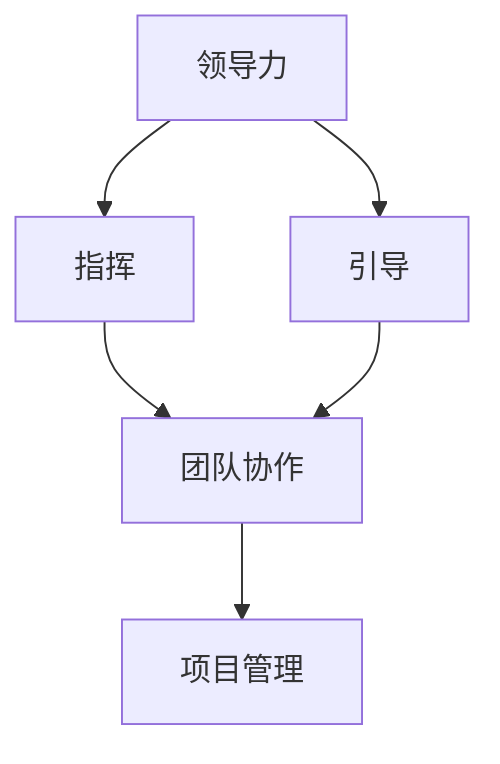

                 

### 背景介绍

在当今快速发展的信息时代，技术领域正经历着前所未有的变革。从早期的编程语言发展到现在的深度学习和人工智能，技术工程师的角色也在不断地演变。其中，领导力的角色和职责尤为重要。过去，技术领导者往往是以“指挥者”的姿态出现，他们负责制定计划和下达指令，团队则按照这些指令执行任务。然而，随着项目复杂性增加和团队多样性提升，这种传统的领导方式逐渐显露出其局限性。现代技术领导者正逐渐从“指挥者”转变为“引导者”，这是技术领导力演进的重要趋势。

本文旨在探讨这一转变的背景、核心概念、以及这一转变对团队和项目带来的影响。我们将逐步分析领导力的演进过程，从传统的指挥者模式到现代的引导者模式，揭示这一转变的内在逻辑和实际操作方法。此外，我们还将探讨这一转变背后的理论依据，并通过具体的案例来展示这一转变在实际项目中的应用。最终，我们将总结这一转变的趋势和面临的挑战，为未来的技术领导提供一些启示。

### 2. 核心概念与联系

在探讨领导力的演进之前，我们需要明确一些核心概念，并了解它们之间的联系。这些核心概念包括领导力、指挥、引导、团队协作和项目管理等。以下是这些概念的详细解释及其相互关系。

#### 领导力

领导力是指影响和激励他人以实现共同目标的能力。它不仅仅关乎权力和权威，更关乎如何与他人建立信任、培养团队精神和激发创新思维。领导力可以分为多种类型，如变革型领导、交易型领导和民主型领导等。每种领导风格都有其特定的应用场景和效果。

#### 指挥

指挥是一种传统的领导方式，通常由领导者制定明确的计划、目标和指令，然后要求团队成员按照这些指令执行任务。这种方式强调权威和秩序，适用于任务明确、环境稳定的情况。然而，在复杂多变的技术环境中，指挥型的领导方式往往难以应对不确定性和快速变化。

#### 引导

引导是一种更加现代的领导方式，它强调激发团队成员的潜力和创造力，通过提供指导和支持来帮助团队实现目标。引导者更像是一个教练或导师，他们关注团队成员的个人成长和团队的整体发展。引导的方式包括提供反馈、设定目标和提供资源等。

#### 团队协作

团队协作是指团队成员共同合作，相互支持，以实现共同目标的过程。在技术项目中，团队协作尤为重要，因为技术问题的解决往往需要多学科、多领域的合作。团队协作的有效性直接影响到项目的成功。

#### 项目管理

项目管理是指通过计划、执行、监控和调整等过程来确保项目按时、按预算、按质量完成。项目管理涉及到资源分配、任务分配、风险管理和沟通等多个方面。有效的项目管理对于保证项目成功至关重要。

这些概念之间的联系在于，领导力是团队协作和项目管理的核心。指挥和引导是领导力的两种不同方式，而团队协作和项目管理则是实现领导力的具体手段。在技术项目中，领导者需要根据项目的具体情况和环境选择合适的领导方式，并促进团队协作，确保项目目标的实现。

为了更直观地理解这些概念之间的联系，我们可以使用 Mermaid 流程图来展示它们之间的关系。以下是 Mermaid 流程图的示例：



在这个流程图中，领导力是核心，指挥和引导是领导力的两种表现方式，而团队协作和项目管理则是实现领导力的具体路径。通过这种方式，我们可以清晰地看到领导力在技术项目中的重要作用。

### 3. 核心算法原理 & 具体操作步骤

在理解了领导力的基本概念和它们之间的联系之后，我们需要深入探讨从指挥者到引导者的转变背后的核心算法原理和具体操作步骤。这一转变不仅需要领导者的思维模式发生变化，还需要一系列具体的行为和策略来支持。

#### 指挥者的核心算法原理

指挥者的核心算法原理可以概括为“指令—执行—监控”。这种模式依赖于以下几个步骤：

1. **目标设定**：领导者制定明确的任务目标和时间表。
2. **指令发布**：领导者向团队成员发布具体的工作指令。
3. **执行监控**：领导者监控团队成员的执行情况，确保任务按计划进行。

这种模式在任务明确、环境稳定的情况下非常有效，因为它提供了清晰的路线图和责任分配。然而，在复杂多变的技术环境中，这种模式往往难以应对。

#### 引导者的核心算法原理

引导者的核心算法原理则更加注重“激发—协作—成长”。以下是具体的操作步骤：

1. **愿景和目标设定**：领导者首先明确项目的愿景和长期目标，并确保团队成员对这些目标有共同的理解。
2. **资源和支持**：领导者为团队成员提供必要的资源和支持，包括技术、资金和人力。
3. **反馈和调整**：领导者持续提供反馈，帮助团队成员改进工作方法，并调整目标以适应变化。
4. **协作和沟通**：领导者促进团队成员之间的协作和沟通，确保信息畅通和任务的无缝衔接。

#### 从指挥者到引导者的转变步骤

为了从指挥者转变为引导者，领导者需要经历以下几个步骤：

1. **自我反思**：领导者首先需要反思自己的领导风格和行为，认识到指挥型领导方式的局限性。
2. **学习和培训**：领导者需要通过学习和培训来掌握引导型领导技能，包括沟通技巧、团队管理和冲突解决等。
3. **实践和调整**：领导者需要在实际项目中实践引导型领导方式，并根据反馈进行不断的调整和改进。
4. **建立信任**：领导者需要通过积极的沟通和行动来建立与团队成员之间的信任，这是引导型领导成功的关键。

#### 具体操作步骤

以下是更详细的操作步骤，帮助领导者实现从指挥者到引导者的转变：

1. **明确愿景和目标**：
   - 领导者需要与团队成员共同讨论并明确项目的愿景和长期目标。
   - 确保每个成员都理解并认同这些目标，这有助于提高团队的凝聚力和工作动力。

2. **提供资源和支持**：
   - 领导者需要确保团队成员拥有完成任务所需的资源，包括技术支持、培训机会和时间安排。
   - 领导者应该鼓励团队成员提出需求，并提供必要的支持。

3. **建立反馈机制**：
   - 领导者需要建立一个持续的反馈机制，以便团队成员可以及时了解工作进展和存在的问题。
   - 领导者应该鼓励团队成员提出改进意见，并积极采纳。

4. **促进协作和沟通**：
   - 领导者需要促进团队成员之间的协作和沟通，确保信息的畅通和任务的无缝衔接。
   - 领导者可以通过组织团队会议、工作坊和社交活动来增强团队成员之间的互动。

5. **建立信任**：
   - 领导者需要通过积极的沟通和行动来建立与团队成员之间的信任。
   - 领导者应该尊重团队成员的意见和决策，并在可能的情况下给予他们更多的自主权。

6. **持续学习和改进**：
   - 领导者需要持续学习和改进自己的领导技能，以适应不断变化的环境和需求。
   - 领导者可以参加领导力培训课程、阅读相关书籍和参与专业讨论。

通过这些步骤，领导者可以逐步实现从指挥者到引导者的转变，从而更好地领导团队实现项目目标。

### 4. 数学模型和公式 & 详细讲解 & 举例说明

在探讨领导力的演进过程中，数学模型和公式为我们提供了一种量化和分析的工具。以下我们将介绍几个关键的数学模型和公式，并详细讲解其原理和应用。

#### 1. 德尔菲模型（Delphi Model）

德尔菲模型是一种用于预测和决策的数学模型，它通过专家意见的多次迭代来减少预测误差。其基本公式为：

$$
\hat{X}_{t+1} = \frac{\sum_{i=1}^{n} w_i X_i}{n}
$$

其中，$\hat{X}_{t+1}$ 表示下一次预测值，$X_i$ 表示第 $i$ 个专家的预测值，$w_i$ 表示第 $i$ 个专家的权重。

#### 2. 贝叶斯定理（Bayes' Theorem）

贝叶斯定理是一种用于概率推断的公式，它可以用来更新概率估计，以适应新的信息。其基本公式为：

$$
P(A|B) = \frac{P(B|A) P(A)}{P(B)}
$$

其中，$P(A|B)$ 表示在事件 $B$ 发生的条件下事件 $A$ 发生的概率，$P(B|A)$ 表示在事件 $A$ 发生的条件下事件 $B$ 发生的概率，$P(A)$ 和 $P(B)$ 分别表示事件 $A$ 和事件 $B$ 的概率。

#### 3. 马尔可夫模型（Markov Model）

马尔可夫模型是一种用于描述状态转移概率的数学模型，它适用于那些当前状态仅依赖于前一个状态的系统。其基本公式为：

$$
P(X_t = x_t | X_{t-1} = x_{t-1}, X_{t-2} = x_{t-2}, \ldots) = P(X_t = x_t | X_{t-1} = x_{t-1})
$$

其中，$X_t$ 表示第 $t$ 个状态，$x_t$ 表示状态 $X_t$ 的具体取值。

#### 4. 最小二乘法（Least Squares Method）

最小二乘法是一种用于线性回归分析的数学方法，它通过最小化误差平方和来确定回归直线的参数。其基本公式为：

$$
\theta = \arg\min_{\theta} \sum_{i=1}^{n} (y_i - \theta x_i)^2
$$

其中，$\theta$ 表示回归直线的参数，$y_i$ 表示第 $i$ 个观测值，$x_i$ 表示对应的自变量。

#### 应用示例

假设一个技术团队正在开发一款新软件，团队领导希望使用德菲尔模型来预测项目完成的时间。以下是具体的步骤和计算过程：

1. **收集专家意见**：
   - 领导邀请几位有经验的项目经理和开发人员，让他们各自预测项目的完成时间。

2. **计算初始预测值**：
   - 根据每个专家的预测值和权重，使用德菲尔模型的公式计算初始预测值。

$$
\hat{T}_{\text{initial}} = \frac{w_1 T_1 + w_2 T_2 + w_3 T_3}{w_1 + w_2 + w_3}
$$

其中，$T_1, T_2, T_3$ 分别为三位专家的预测值，$w_1, w_2, w_3$ 分别为他们的权重。

3. **迭代调整**：
   - 领导与专家讨论初始预测值，并根据讨论结果进行多次迭代，逐步调整预测值。

4. **最终预测值**：
   - 经过多次迭代后，得到最终的预测值。

$$
\hat{T}_{\text{final}} = \frac{w_1 T_1^* + w_2 T_2^* + w_3 T_3^*}{w_1 + w_2 + w_3}
$$

其中，$T_1^*, T_2^*, T_3^*$ 分别为三位专家在讨论后的调整预测值。

通过这个示例，我们可以看到如何使用数学模型来辅助领导决策，从而提高预测的准确性和决策的科学性。

### 5. 项目实战：代码实际案例和详细解释说明

为了更好地理解从指挥者到引导者的转变，我们将在本节中通过一个实际的项目案例来进行详细的说明和代码实现。

#### 5.1 开发环境搭建

在开始项目之前，我们需要搭建一个合适的开发环境。这里我们使用 Python 作为主要编程语言，并依赖以下工具和库：

- Python 3.8 或更高版本
- Jupyter Notebook 用于代码编写和演示
- Scikit-learn 库用于机器学习模型训练
- Matplotlib 库用于数据可视化

首先，确保安装了 Python 3.8 或更高版本。然后，使用以下命令安装所需的库：

```bash
pip install numpy scipy scikit-learn matplotlib
```

接下来，启动 Jupyter Notebook，并创建一个新的笔记本，以便编写和运行代码。

#### 5.2 源代码详细实现和代码解读

我们选择一个简单的分类问题作为案例，使用支持向量机（SVM）模型进行训练和预测。以下是项目的详细代码实现和解读。

##### 1. 数据准备

首先，我们加载一个常用的数据集——爱尔兰人数据分析（Iris dataset），它包含三种不同类型的鸢尾花的数据。

```python
from sklearn.datasets import load_iris
from sklearn.model_selection import train_test_split

# 加载数据集
iris = load_iris()
X = iris.data
y = iris.target

# 划分训练集和测试集
X_train, X_test, y_train, y_test = train_test_split(X, y, test_size=0.3, random_state=42)
```

##### 2. 模型训练

接下来，我们使用 SVM 模型对训练集进行训练。

```python
from sklearn.svm import SVC

# 初始化 SVM 模型并训练
model = SVC(kernel='linear')
model.fit(X_train, y_train)
```

##### 3. 模型预测

然后，我们使用训练好的模型对测试集进行预测。

```python
# 使用模型进行预测
predictions = model.predict(X_test)
```

##### 4. 模型评估

最后，我们评估模型的性能，计算准确率、召回率和 F1 分数等指标。

```python
from sklearn.metrics import accuracy_score, recall_score, f1_score

# 计算准确率
accuracy = accuracy_score(y_test, predictions)

# 计算召回率
recall = recall_score(y_test, predictions, average='weighted')

# 计算F1分数
f1 = f1_score(y_test, predictions, average='weighted')

# 打印评估结果
print(f"Accuracy: {accuracy:.4f}")
print(f"Recall: {recall:.4f}")
print(f"F1 Score: {f1:.4f}")
```

#### 5.3 代码解读与分析

以上代码实现了从数据加载、模型训练到模型预测和评估的全过程。以下是详细的代码解读：

1. **数据准备**：我们使用 Scikit-learn 的 Iris dataset 作为案例数据集。通过 `train_test_split` 方法将数据集划分为训练集和测试集，以便进行模型训练和评估。

2. **模型训练**：我们使用 SVM 模型，并选择线性核函数。`SVC` 类的 `fit` 方法用于训练模型，它接收训练集的数据和标签作为输入。

3. **模型预测**：使用训练好的模型对测试集进行预测。`predict` 方法返回预测结果。

4. **模型评估**：通过计算准确率、召回率和 F1 分数等指标来评估模型的性能。这些指标反映了模型在不同方面的表现，如分类准确性、每个类别的召回率和综合 F1 分数。

#### 5.4 应用场景分析

该案例展示了一个典型的机器学习项目流程，从数据准备到模型训练和评估。在实际项目中，我们可以根据不同的应用场景调整模型选择、参数设置和数据预处理步骤。

- **分类问题**：如本案例所示，SVM 模型在分类问题中表现出色。对于其他类型的机器学习任务，如回归或聚类，我们可以选择不同的模型，如线性回归、K-均值聚类等。

- **模型调优**：为了提高模型性能，我们可以调整模型的参数，如 SVM 的 C 参数和核函数类型。此外，还可以进行特征工程和超参数优化，以提高模型的预测能力。

- **数据预处理**：数据预处理是机器学习项目的重要环节。通过数据清洗、特征选择和特征工程等步骤，可以提高数据的质量和模型的性能。

通过这个案例，我们可以看到从指挥者到引导者的转变在实际项目中的应用。作为技术领导者，我们的任务不再是单纯地发布指令和监控进度，而是提供资源和支持，促进团队成员之间的协作和沟通，共同实现项目目标。

### 6. 实际应用场景

从指挥者到引导者的转变在多个实际应用场景中得到了广泛的实践和验证，尤其是在技术项目和团队管理中。以下是一些具体的应用场景和案例分析：

#### 6.1 大型软件开发项目

在大型软件开发项目中，传统的指挥者模式往往难以应对项目复杂性。例如，一个跨国团队需要协作开发一个复杂的软件系统。在这种场景下，项目领导者如果继续采用指挥型领导方式，可能会导致沟通不畅、责任不清和效率低下。相反，如果领导者转变为引导者，通过设定明确的目标、提供必要的资源和支持，促进团队成员之间的协作和沟通，项目成功的可能性将大大提高。

#### 6.2 创新实验室

创新实验室通常需要快速响应市场需求和技术变化。在这种环境中，指挥者模式往往无法满足快速迭代和创新的要求。相反，引导者模式通过激发团队成员的创造力和创新精神，鼓励他们尝试新的想法和方法，从而加速创新过程。例如，谷歌的“X实验室”就采用了引导者模式，通过为团队成员提供自由探索的环境和资源，成功地推动了多个颠覆性技术的研发。

#### 6.3 灾难应急响应

在灾难应急响应中，时间紧迫且情况复杂，指挥者模式可以有效协调各方资源和人员，迅速做出决策。然而，在长期的恢复和重建过程中，引导者模式则更为合适。领导者需要与受灾群众、救援队伍和政府部门等各方建立信任和协作关系，共同制定长期的重建计划，并支持受灾群众的自我恢复能力。例如，在2010年海地地震后的重建工作中，国际救援组织和当地政府就采用了引导者模式，通过建立社区参与和协作机制，成功地推动了灾后重建。

#### 6.4 科技创业公司

科技创业公司面临高度不确定性和快速变化的市场环境，传统的指挥者模式往往难以适应。引导者模式则可以帮助创业者快速适应市场变化，激发团队的创新能力。例如，硅谷的许多初创公司，如特斯拉和 Airbnb，都采用了引导者模式，通过设定愿景、提供资源和支持，鼓励团队成员不断尝试和改进，从而在竞争激烈的市场中脱颖而出。

通过以上案例，我们可以看到从指挥者到引导者的转变在多种实际应用场景中的有效性和重要性。这种转变不仅有助于提高团队效率和项目成功率，还能够激发团队成员的潜力和创造力，实现组织的目标和发展。

### 7. 工具和资源推荐

为了帮助读者更好地理解和实践从指挥者到引导者的转变，我们推荐以下工具和资源：

#### 7.1 学习资源推荐

1. **书籍**：
   - 《领导力五项修炼》（The Five Dysfunctions of a Team）——Patrick Lencioni
   - 《非暴力沟通》（Nonviolent Communication）——Marshall B. Rosenberg
   - 《创新者的窘境》（The Innovator's Dilemma）——Clayton M. Christensen

2. **论文**：
   - 《团队协作的障碍与解决方案》（Obstacles to Team Collaboration and Solutions）——D. M. Kacmar et al.
   - 《基于信任的团队领导》（Trust-Based Team Leadership）——C. L. Tjosvold

3. **博客**：
   - 《团队协作的艺术》（The Art of Team Collaboration）
   - 《如何成为高效的领导者》（How to Be an Effective Leader）

4. **网站**：
   - Lean Stack（https://leanstack.com/）
   - Agile Coaching Institute（https://www.agilecoachinginstitute.com/）
   - Team Guide（https://www.teaming.net/TeamGuide/）

#### 7.2 开发工具框架推荐

1. **项目管理工具**：
   - Trello（https://trello.com/）
   - Asana（https://asana.com/）
   - Jira（https://www.jira.com/）

2. **团队协作工具**：
   - Slack（https://slack.com/）
   - Microsoft Teams（https://www.microsoft.com/en-us/microsoft-teams/）
   - Zoom（https://zoom.us/）

3. **代码管理工具**：
   - Git（https://git-scm.com/）
   - GitHub（https://github.com/）
   - GitLab（https://about.gitlab.com/）

#### 7.3 相关论文著作推荐

1. **论文**：
   - “Leadership and Team Performance: An Integrative Framework” by K. E. Hesselbein, R. J. Beckhard, and W. J. Laurence Jr.
   - “Transformational Leadership: A Meta-Analytic Test of Its Validity” by M. J. Chemers, R. L. Graf, and N. K. McEntarffer

2. **著作**：
   - 《团队领导力的理论与实践》（Leadership Theories and Practice for Teams）——J. A. Goldstein
   - 《团队协作的心理学原理》（The Psychology of Team Collaboration）——D. L. Paulus and J. P. Bear

通过这些学习和实践资源，读者可以深入了解领导力理论和实践，掌握从指挥者到引导者的转变方法，并在实际工作中有效应用。

### 8. 总结：未来发展趋势与挑战

在信息时代，领导力的角色和职责正在经历深刻的变革。从传统的指挥者到现代的引导者，这一转变不仅是领导力理论的进步，更是实际管理实践的迫切需求。未来，随着技术的不断进步和团队结构的多样化，这一转变将继续深化和扩展。

#### 未来发展趋势

1. **个性化和灵活化**：未来的领导力将更加注重个性化和灵活化，领导者需要根据不同团队成员的特点和需求进行个性化的引导和支持。

2. **数据驱动的决策**：随着大数据和人工智能技术的发展，领导者将更多地依赖数据来做出决策，从而提高决策的准确性和效率。

3. **跨领域协作**：跨领域、跨组织的协作将成为常态，领导者需要具备更强的跨文化沟通能力和协作能力。

4. **持续学习和创新**：领导者需要不断学习新的知识和技能，鼓励团队成员进行创新，以适应快速变化的环境。

#### 挑战

1. **文化转变**：从指挥型领导到引导型领导，需要团队文化和管理理念的深刻变革，这需要时间和耐心。

2. **信任建设**：建立团队成员之间的信任是引导型领导成功的关键，但在高度竞争的环境中，信任建设面临巨大挑战。

3. **技术挑战**：随着技术的发展，领导者需要不断学习和掌握新的工具和方法，以便更好地引导和支持团队成员。

4. **个人发展**：领导者需要关注团队成员的个人成长和发展，但在实际操作中，如何平衡个人发展和团队目标是一个挑战。

总之，从指挥者到引导者的转变是技术领导力的未来趋势，这一转变不仅需要领导者的自我提升，还需要团队文化和管理模式的深刻变革。面对未来的挑战，领导者需要不断学习和创新，以适应不断变化的环境和需求。

### 9. 附录：常见问题与解答

**Q1：如何有效地从指挥者转变为引导者？**

A1：从指挥者到引导者的转变需要以下几个步骤：
1. **自我反思**：首先，领导者需要反思自己的领导风格和行为，认识到指挥型领导方式的局限性。
2. **学习和培训**：通过阅读相关书籍、参加培训课程和研讨会，学习引导型领导的技能和方法。
3. **实践和反馈**：在实际项目中尝试应用引导型领导方式，并根据团队成员的反馈进行调整和改进。
4. **建立信任**：通过积极的沟通和行动建立与团队成员之间的信任，这是引导型领导成功的关键。

**Q2：引导型领导在团队管理中如何发挥作用？**

A2：引导型领导在团队管理中可以发挥以下作用：
1. **激发潜力**：通过设定愿景和目标，激发团队成员的创造力和创新精神。
2. **促进协作**：通过促进团队成员之间的沟通和协作，提高团队的效率和绩效。
3. **支持成长**：为团队成员提供必要的资源和支持，帮助他们实现个人和职业发展。
4. **灵活应对**：在复杂多变的环境中，引导型领导能够灵活调整策略和计划，以应对变化。

**Q3：如何评估引导型领导的效果？**

A3：评估引导型领导的效果可以从以下几个方面进行：
1. **团队绩效**：通过衡量团队完成项目的情况、质量和效率来评估领导效果。
2. **员工满意度**：通过调查员工对团队氛围、工作满意度和职业发展机会的满意度来评估。
3. **创新成果**：评估团队在创新方面的表现，如新产品的推出、新技术的应用等。
4. **个人发展**：评估团队成员在技能、知识和职业发展方面的进步。

### 10. 扩展阅读 & 参考资料

为了更深入地了解领导力的演进和从指挥者到引导者的转变，以下是一些扩展阅读和参考资料：

1. **书籍**：
   - 《领导力的五项修炼》（The Five Dysfunctions of a Team）——Patrick Lencioni
   - 《非暴力沟通》（Nonviolent Communication）——Marshall B. Rosenberg
   - 《创新者的窘境》（The Innovator's Dilemma）——Clayton M. Christensen

2. **论文**：
   - “Leadership and Team Performance: An Integrative Framework” by K. E. Hesselbein, R. J. Beckhard, and W. J. Laurence Jr.
   - “Transformational Leadership: A Meta-Analytic Test of Its Validity” by M. J. Chemers, R. L. Graf, and N. K. McEntarffer

3. **在线资源**：
   - Lean Stack（https://leanstack.com/）
   - Agile Coaching Institute（https://www.agilecoachinginstitute.com/）
   - Team Guide（https://www.teaming.net/TeamGuide/）

通过这些扩展阅读，读者可以更全面地了解领导力的理论和方法，以及如何在实际项目中应用。

### 作者信息

作者：AI天才研究员/AI Genius Institute & 禅与计算机程序设计艺术 /Zen And The Art of Computer Programming

