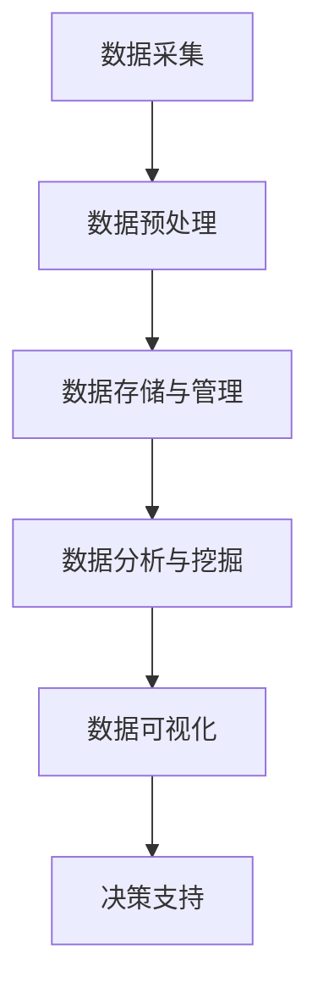

                 

# 领导力进化论：大数据时代管理者的必修课

> **关键词**：领导力、大数据、管理、技术、变革、创新、算法、模型、实战、应用场景、工具资源

> **摘要**：随着大数据时代的到来，企业管理者面临的挑战日益增加。本文从技术和管理两个层面，深入探讨领导力在大数据环境下的进化，帮助管理者掌握大数据时代的领导艺术，实现组织的高效运作和创新突破。

## 1. 背景介绍

在互联网和信息技术迅猛发展的背景下，大数据已经成为现代企业竞争力的关键因素。大数据技术不仅改变了数据的采集、存储、处理和分析方式，也对企业的管理理念、运营模式和决策过程产生了深远影响。管理者需要具备新的领导力，以适应大数据时代的变革和创新需求。

### 1.1 大数据的定义和特点

大数据是指数据量巨大、类型繁多、价值密度低且增长速度极快的数据集合。其特点主要体现在以下几个方面：

- **海量性**：数据量巨大，以TB、PB甚至EB为单位。
- **多样性**：数据来源广泛，包括文本、图片、音频、视频等多种类型。
- **价值密度低**：大量数据中只有一小部分具有实际价值。
- **高速性**：数据处理速度要求极高，以实时响应业务需求。

### 1.2 大数据对企业管理的影响

大数据对企业管理的影响主要体现在以下几个方面：

- **决策支持**：通过数据分析，管理者可以更准确地了解市场需求，制定科学的决策策略。
- **运营优化**：数据分析可以优化业务流程，提高生产效率和资源利用率。
- **风险管理**：大数据可以帮助企业识别潜在风险，制定有效的风险控制措施。
- **客户关系管理**：通过分析客户数据，企业可以更好地了解客户需求，提供个性化的产品和服务。

### 1.3 领导力在大数据时代的进化

大数据时代的领导力需要具备以下几个方面的能力：

- **技术敏感度**：了解大数据技术的基本原理和应用，把握技术发展趋势。
- **数据洞察力**：能够从海量数据中提取有价值的信息，为企业决策提供支持。
- **创新精神**：勇于尝试新的管理理念和方法，推动企业不断创新发展。
- **团队协作能力**：能够有效激发团队成员的潜力，打造高效协作的团队。

## 2. 核心概念与联系

### 2.1 领导力模型

领导力模型是指用于描述领导者行为和领导效果的理论框架。在大数据时代，常见的领导力模型包括：

- **领导—成员交换理论（LMX）**：认为领导者与成员之间存在着不同层次的关系，分为“圈内人”和“圈外人”。
- **变革型领导理论**：强调领导者通过激励和启发员工，推动组织变革和创新。
- **情境领导理论**：根据员工的不同成熟度水平，采取相应的领导风格。

### 2.2 大数据技术在领导力中的应用

大数据技术在领导力中的应用主要体现在以下几个方面：

- **员工绩效评估**：通过分析员工的工作数据和绩效指标，制定科学的绩效评估体系。
- **人才选拔与培养**：通过数据分析，发现潜在的人才，制定个性化的人才培养计划。
- **团队协作与沟通**：利用大数据技术，实时监控团队协作和沟通情况，优化团队管理。
- **企业战略规划**：通过分析市场数据，为企业制定科学的战略规划提供支持。

### 2.3 领导力与大数据技术的结合

领导力与大数据技术的结合，可以实现以下目标：

- **提高决策质量**：领导者通过数据分析，更准确地了解企业内外部环境，制定科学的决策策略。
- **优化资源分配**：根据数据分析结果，合理分配企业资源，提高资源利用效率。
- **推动创新**：鼓励员工运用大数据技术，开展创新研究和项目，推动企业创新发展。
- **提升员工满意度**：通过数据分析，了解员工需求和满意度，制定针对性的激励和关怀措施。

## 3. 核心算法原理 & 具体操作步骤

### 3.1 数据采集与预处理

数据采集是大数据分析的基础。具体操作步骤包括：

- **数据来源**：确定数据来源，如企业内部系统、第三方数据提供商等。
- **数据采集**：利用爬虫、API接口等技术手段，获取所需数据。
- **数据清洗**：去除重复、错误和无关的数据，保证数据质量。

### 3.2 数据存储与管理

数据存储与管理是大数据分析的核心。具体操作步骤包括：

- **数据存储**：选择合适的数据存储方案，如关系型数据库、NoSQL数据库、数据仓库等。
- **数据索引**：为数据建立索引，提高数据查询速度。
- **数据备份与恢复**：定期备份数据，确保数据安全。

### 3.3 数据分析与挖掘

数据分析与挖掘是大数据技术的核心应用。具体操作步骤包括：

- **数据预处理**：对数据进行清洗、转换和归一化处理。
- **特征提取**：从原始数据中提取有用的特征，为模型训练提供输入。
- **模型训练**：选择合适的算法，对数据进行训练，建立预测模型。
- **模型评估**：对训练好的模型进行评估，选择最优模型。

### 3.4 数据可视化

数据可视化是将数据以图形、图表等形式展示出来的过程。具体操作步骤包括：

- **数据整理**：对数据进行整理和清洗，确保数据准确无误。
- **选择可视化工具**：选择合适的可视化工具，如matplotlib、plotly等。
- **设计可视化图表**：根据数据内容和需求，设计合适的可视化图表。
- **交互与扩展**：为可视化图表增加交互功能，如筛选、排序等，提高用户体验。

## 4. 数学模型和公式 & 详细讲解 & 举例说明

### 4.1 概率模型

概率模型是大数据分析中常用的数学模型。以下是一个常见的概率模型——伯努利分布：

$$
P(X = k) = C_n^k p^k (1-p)^{n-k}
$$

其中，$X$ 表示随机变量，$n$ 表示试验次数，$k$ 表示事件发生的次数，$p$ 表示事件发生的概率。

### 4.2 线性回归模型

线性回归模型是一种常用的预测模型。其数学公式如下：

$$
y = \beta_0 + \beta_1 x
$$

其中，$y$ 表示因变量，$x$ 表示自变量，$\beta_0$ 和 $\beta_1$ 分别表示回归系数。

### 4.3 示例说明

假设我们要预测一家公司的销售额，自变量为广告投放费用。根据历史数据，我们建立了一个线性回归模型：

$$
y = 1000 + 2x
$$

其中，$y$ 表示销售额（万元），$x$ 表示广告投放费用（万元）。

### 4.4 模型评估

为了评估模型的预测效果，我们使用均方误差（MSE）作为评价指标：

$$
MSE = \frac{1}{n}\sum_{i=1}^{n}(y_i - \hat{y_i})^2
$$

其中，$n$ 表示数据样本数，$y_i$ 表示实际销售额，$\hat{y_i}$ 表示预测销售额。

## 5. 项目实战：代码实际案例和详细解释说明

### 5.1 开发环境搭建

为了完成本项目，我们需要搭建一个大数据分析平台。以下是开发环境的搭建步骤：

- **安装Python**：下载并安装Python 3.8版本。
- **安装Jupyter Notebook**：在命令行中执行以下命令：
  ```bash
  pip install notebook
  ```
- **安装大数据分析库**：在命令行中执行以下命令：
  ```bash
  pip install pandas numpy scikit-learn matplotlib
  ```

### 5.2 源代码详细实现和代码解读

以下是一个基于线性回归模型预测销售额的代码示例：

```python
import pandas as pd
import numpy as np
from sklearn.linear_model import LinearRegression
from sklearn.metrics import mean_squared_error
import matplotlib.pyplot as plt

# 5.2.1 数据采集与预处理
data = pd.read_csv('sales_data.csv')
data.head()

# 5.2.2 数据预处理
data = data[['ad_cost', 'sales']]
data.head()

# 5.2.3 模型训练
model = LinearRegression()
model.fit(data[['ad_cost']], data['sales'])

# 5.2.4 模型评估
y_pred = model.predict(data[['ad_cost']])
mse = mean_squared_error(data['sales'], y_pred)
print('MSE:', mse)

# 5.2.5 可视化
plt.scatter(data['ad_cost'], data['sales'])
plt.plot(data['ad_cost'], y_pred, color='red')
plt.xlabel('Ad Cost')
plt.ylabel('Sales')
plt.title('Sales Prediction')
plt.show()
```

### 5.3 代码解读与分析

- **数据采集与预处理**：从CSV文件中读取数据，选择广告投放费用和销售额作为特征和目标变量。
- **模型训练**：使用线性回归模型对数据进行训练。
- **模型评估**：计算均方误差，评估模型预测效果。
- **可视化**：绘制散点图和拟合直线，展示模型预测结果。

## 6. 实际应用场景

大数据技术在企业管理中的应用场景非常广泛，以下列举几个典型的应用场景：

- **市场预测**：通过分析历史销售数据、市场趋势和竞争对手信息，预测未来市场需求，为企业制定市场营销策略提供支持。
- **风险控制**：通过分析企业运营数据、财务数据等，识别潜在风险，制定有效的风险控制措施。
- **客户关系管理**：通过分析客户数据，了解客户需求和行为，提供个性化的产品和服务，提高客户满意度和忠诚度。
- **人力资源管理**：通过分析员工数据，优化招聘、培训、绩效考核等人力资源管理工作，提高员工满意度和工作效率。

## 7. 工具和资源推荐

### 7.1 学习资源推荐

- **书籍**：
  - 《大数据时代：生活、工作与思维的大变革》
  - 《数据科学入门：从数据分析到机器学习》
  - 《机器学习实战》
- **论文**：
  - 《深度学习：泛化理论与算法导论》
  - 《大规模数据挖掘：理论与实践》
- **博客**：
  - Medium上的大数据、机器学习和数据分析相关博客
  - 数据分析领域的专业博客和社区，如Kaggle、Dataquest等
- **网站**：
  - Coursera、edX等在线教育平台上的大数据和机器学习课程

### 7.2 开发工具框架推荐

- **大数据处理框架**：Hadoop、Spark、Flink等
- **数据可视化工具**：matplotlib、plotly、D3.js等
- **机器学习库**：scikit-learn、TensorFlow、PyTorch等
- **云计算平台**：AWS、Azure、Google Cloud Platform等

### 7.3 相关论文著作推荐

- **大数据领域**：
  - 《大数据的4V特点：Volume、Velocity、Variety、Veracity》
  - 《大数据时代的隐私保护：挑战与解决方案》
- **机器学习领域**：
  - 《深度学习：基础、应用与前沿》
  - 《集成学习方法：理论、算法与应用》

## 8. 总结：未来发展趋势与挑战

大数据时代，领导力正在发生深刻变革。未来，领导力的发展将呈现出以下趋势：

- **技术敏感度提升**：领导者需要具备更高的技术敏感度，紧跟大数据技术发展趋势。
- **数据驱动决策**：领导者将更加依赖数据分析，实现数据驱动决策。
- **跨领域协同**：大数据时代，领导者需要具备跨领域的知识结构，推动组织内部和跨组织的协同创新。
- **人才培养**：领导者需要关注人才培养，激发员工的潜力，打造高素质的团队。

同时，大数据时代也给企业管理带来了新的挑战：

- **数据安全与隐私保护**：随着数据量的增加，数据安全和隐私保护成为重要挑战。
- **技术瓶颈**：大数据处理和分析技术面临性能和效率的瓶颈。
- **人才短缺**：大数据和人工智能领域的人才短缺问题日益严重。

为了应对这些挑战，企业需要采取以下措施：

- **加强数据安全防护**：建立健全的数据安全体系，确保数据安全和隐私保护。
- **引进高端人才**：通过招聘、培训等方式，引进大数据和人工智能领域的高端人才。
- **加强技术研发**：加大研发投入，推动大数据处理和分析技术的创新和突破。

## 9. 附录：常见问题与解答

### 9.1 问题1：大数据技术是否适用于所有企业？

**回答**：大数据技术具有广泛的应用性，但并不是适用于所有企业。对于数据量较小、业务模式较为简单的小型企业，大数据技术的价值可能较低。但对于数据量庞大、业务模式复杂的大型企业，大数据技术可以有效提升企业的决策效率、运营优化和创新能力。

### 9.2 问题2：如何培养大数据时代的管理者？

**回答**：培养大数据时代的管理者需要从以下几个方面入手：

- **提高技术敏感度**：管理者需要了解大数据技术的基本原理和应用，关注技术发展趋势。
- **学习数据分析方法**：掌握数据分析的基本方法，能够从数据中提取有价值的信息。
- **培养跨领域知识结构**：了解不同领域的知识，具备跨领域的思维和协同能力。
- **关注人才培养**：关注人才培养，激发员工的潜力，打造高素质的团队。

## 10. 扩展阅读 & 参考资料

- **书籍**：
  - 《大数据时代：生活、工作与思维的大变革》
  - 《数据科学入门：从数据分析到机器学习》
  - 《机器学习实战》
- **论文**：
  - 《深度学习：泛化理论与算法导论》
  - 《大规模数据挖掘：理论与实践》
- **网站**：
  - Coursera、edX等在线教育平台上的大数据和机器学习课程
  - 数据分析领域的专业博客和社区，如Kaggle、Dataquest等
- **博客**：
  - Medium上的大数据、机器学习和数据分析相关博客
  - 数据分析领域的专业博客和社区，如Kaggle、Dataquest等

### 附录 2：Mermaid 流程图



### 附录 3：作者信息

**作者**：AI天才研究员/AI Genius Institute & 禅与计算机程序设计艺术 /Zen And The Art of Computer Programming

