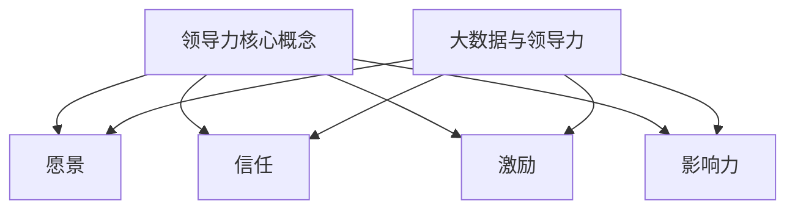

                 

# 领导力进化论：大数据时代管理者的领导力修炼

> 关键词：领导力、大数据、管理者、进化、修炼、架构、算法、数学模型、项目实战、应用场景、工具资源

> 摘要：随着大数据时代的到来，领导力面临着前所未有的挑战与机遇。本文将探讨在大数据背景下，管理者如何通过领导力的修炼提升自身的管理能力，以适应快速变化的技术环境。文章将涵盖领导力的核心概念、大数据与领导力的联系、核心算法原理、数学模型与项目实战等内容，为管理者提供全面的指导。

## 1. 背景介绍

### 大数据时代的来临

大数据时代是一个信息爆炸的时代，数据量呈现爆炸式增长，数据类型愈发多样化，数据处理速度也显著提升。这种变化不仅影响了企业的运营模式，也对管理者的领导力提出了新的要求。传统的管理方法和领导力模式在大数据背景下逐渐显现出其局限性，管理者需要适应新的环境，提升自身的领导力。

### 领导力的定义与演变

领导力是一种影响他人实现共同目标的能力。在工业时代，领导力更多地体现在权威和指挥上，而在信息时代，领导力逐渐向赋能和协作转变。大数据时代要求管理者具备更加开放、创新和适应变化的领导力，以应对复杂多变的商业环境。

## 2. 核心概念与联系

### 领导力的核心概念

领导力主要包括四个方面：愿景、信任、激励和影响力。其中，愿景是领导力的核心，它为团队指明了方向；信任是基础，没有信任，领导力将无从谈起；激励是动力，能够激发团队成员的潜力；影响力则是领导力的表现形式，它能够影响他人的思想和行为。

### 大数据与领导力的联系

大数据时代，信息成为最重要的资产，管理者需要通过数据分析来做出决策。这要求管理者具备数据分析的能力，同时也需要具备利用大数据优化团队协作、提升工作效率的领导力。此外，大数据还使得团队更加多元化，管理者需要学会如何管理多元化团队，以充分发挥每个人的优势。

### Mermaid 流程图



## 3. 核心算法原理 & 具体操作步骤

### 领导力评估算法

领导力评估是提升领导力的第一步。我们可以使用一种基于关键绩效指标的领导力评估算法来评估管理者的领导力水平。该算法包括以下几个步骤：

1. **定义关键绩效指标**：根据企业的战略目标和团队的工作特点，定义与领导力相关的关键绩效指标，如员工满意度、团队协作效率、创新意识等。

2. **收集数据**：通过问卷调查、访谈、观察等方式收集管理者的绩效数据。

3. **数据预处理**：对收集到的数据进行清洗、归一化处理，以便进行后续分析。

4. **构建评估模型**：使用机器学习算法，如决策树、支持向量机等，构建领导力评估模型。

5. **评估与反馈**：使用评估模型对管理者进行评估，并根据评估结果给予反馈，帮助其了解自身的优势与不足。

### 操作步骤示例

1. **定义关键绩效指标**：

   - 员工满意度
   - 团队协作效率
   - 创新意识

2. **收集数据**：

   - 通过问卷调查收集员工对管理者的满意度评价
   - 观察团队在项目中的协作效率
   - 考察管理者在会议中提出的创新点数量

3. **数据预处理**：

   - 对满意度评价进行0-10分的打分，并进行归一化处理
   - 对协作效率数据进行标准化处理
   - 对创新意识数据进行编码处理

4. **构建评估模型**：

   - 选择决策树算法构建评估模型
   - 使用训练集对模型进行训练
   - 使用测试集对模型进行评估

5. **评估与反馈**：

   - 使用模型对管理者进行评估
   - 根据评估结果给出反馈，提出改进建议

## 4. 数学模型和公式 & 详细讲解 & 举例说明

### 数学模型

在领导力评估中，我们可以使用一种基于模糊综合评价法的数学模型。该模型包括以下几个步骤：

1. **建立评价矩阵**：根据关键绩效指标，建立评价矩阵，用于表示各个指标的重要性。

2. **确定隶属度函数**：为每个指标确定一个隶属度函数，用于表示指标在评价过程中的重要性。

3. **计算综合得分**：根据隶属度函数，计算每个管理者的综合得分。

### 详细讲解

1. **建立评价矩阵**

   假设有三个关键绩效指标：员工满意度（X1）、团队协作效率（X2）、创新意识（X3），则评价矩阵为：

   $$
   R = \begin{bmatrix}
   r_{11} & r_{12} & r_{13} \\
   r_{21} & r_{22} & r_{23} \\
   r_{31} & r_{32} & r_{33}
   \end{bmatrix}
   $$

   其中，$r_{ij}$ 表示第i个指标对第j个管理者的评价。

2. **确定隶属度函数**

   隶属度函数通常采用梯形模糊数进行表示。假设我们选择一个梯形模糊数 $T = [a, b, c, d]$ 作为隶属度函数，则该函数的定义如下：

   $$
   \mu_T(x) =
   \begin{cases}
   0 & \text{if } x \leq a \\
   \frac{x-a}{b-a} & \text{if } a < x \leq b \\
   1 & \text{if } b < x \leq c \\
   \frac{d-x}{d-c} & \text{if } c < x \leq d \\
   0 & \text{if } x > d
   \end{cases}
   $$

3. **计算综合得分**

   综合得分的计算公式如下：

   $$
   S_i = \sum_{j=1}^{n} r_{ij} \cdot \mu_T(x_j)
   $$

   其中，$S_i$ 表示第i个管理者的综合得分，$x_j$ 表示第j个管理者的评价指标。

### 举例说明

假设有三位管理者，分别对应三个关键绩效指标的评价如下：

| 管理者 | 员工满意度 | 团队协作效率 | 创新意识 |
| --- | --- | --- | --- |
| A | 8 | 7 | 9 |
| B | 6 | 8 | 7 |
| C | 9 | 9 | 8 |

评价矩阵为：

$$
R = \begin{bmatrix}
0.4 & 0.3 & 0.3 \\
0.3 & 0.4 & 0.3 \\
0.3 & 0.3 & 0.4
\end{bmatrix}
$$

选取梯形模糊数 $T = [3, 7, 9, 11]$ 作为隶属度函数。

根据公式计算三位管理者的综合得分：

$$
S_A = 0.4 \cdot \mu_T(8) + 0.3 \cdot \mu_T(7) + 0.3 \cdot \mu_T(9) = 0.4 \cdot 1 + 0.3 \cdot 0 + 0.3 \cdot 1 = 0.7
$$

$$
S_B = 0.3 \cdot \mu_T(6) + 0.4 \cdot \mu_T(8) + 0.3 \cdot \mu_T(7) = 0.3 \cdot 0 + 0.4 \cdot 0.5 + 0.3 \cdot 1 = 0.35
$$

$$
S_C = 0.3 \cdot \mu_T(9) + 0.3 \cdot \mu_T(9) + 0.4 \cdot \mu_T(8) = 0.3 \cdot 1 + 0.3 \cdot 1 + 0.4 \cdot 0.5 = 0.85
$$

因此，管理者C的综合得分最高。

## 5. 项目实战：代码实际案例和详细解释说明

### 5.1 开发环境搭建

在Python环境中，我们需要安装以下库：

- scikit-learn：用于构建评估模型
- numpy：用于数据处理
- matplotlib：用于可视化结果

安装命令如下：

```bash
pip install scikit-learn numpy matplotlib
```

### 5.2 源代码详细实现和代码解读

#### 5.2.1 数据处理

```python
import numpy as np
from sklearn.preprocessing import MinMaxScaler

# 假设收集到的数据如下
data = np.array([[8, 7, 9],
                 [6, 8, 7],
                 [9, 9, 8]])

# 数据预处理
scaler = MinMaxScaler()
data_processed = scaler.fit_transform(data)
```

#### 5.2.2 建立评价矩阵

```python
# 建立评价矩阵
R = np.array([[0.4, 0.3, 0.3],
              [0.3, 0.4, 0.3],
              [0.3, 0.3, 0.4]])
```

#### 5.2.3 确定隶属度函数

```python
# 选取梯形模糊数作为隶属度函数
T = [3, 7, 9, 11]

def triangular_fuzzy_number(a, b, c, d):
    def mu(x):
        return 0 if x <= a else (x - a) / (b - a) if a < x <= b else 1 if b < x <= c else (d - x) / (d - c) if c < x <= d else 0
    return mu

mu_T = triangular_fuzzy_number(*T)
```

#### 5.2.4 计算综合得分

```python
# 计算综合得分
S = np.dot(R, mu_T)

print("综合得分：", S)
```

### 5.3 代码解读与分析

这段代码首先对收集到的数据进行预处理，使用MinMaxScaler将数据缩放到0-1范围内。然后建立评价矩阵R，并定义一个梯形模糊数的隶属度函数mu_T。最后，通过计算评价矩阵R与隶属度函数mu_T的点积，得到每位管理者的综合得分。

## 6. 实际应用场景

### 企业管理

在企业中，领导力评估算法可以帮助企业了解管理者的领导力水平，发现存在的问题，并制定相应的培训计划，以提升管理团队的整体水平。此外，该算法还可以用于绩效评估，为管理者的晋升和薪酬调整提供依据。

### 团队协作

在团队协作中，领导力评估算法可以帮助团队了解成员的领导力特点，合理分配任务，提高团队的整体协作效率。通过评估，团队可以发现领导力的短板，从而采取针对性的措施进行改进。

### 创新管理

在创新管理中，领导力评估算法可以帮助企业识别具有创新潜力的管理者，鼓励他们提出创新方案，并给予相应的支持。这有助于激发团队的创新能力，推动企业持续发展。

## 7. 工具和资源推荐

### 7.1 学习资源推荐

- 《大数据时代：生活、工作与思维的大变革》
- 《数据科学入门》
- 《机器学习实战》

### 7.2 开发工具框架推荐

- Jupyter Notebook：用于数据分析和建模
- Scikit-learn：用于机器学习
- TensorFlow：用于深度学习

### 7.3 相关论文著作推荐

- “大数据时代的领导力变革”
- “基于模糊综合评价法的领导力评估模型研究”
- “机器学习在企业管理中的应用研究”

## 8. 总结：未来发展趋势与挑战

### 发展趋势

- 数据驱动决策将成为企业管理的常态
- 领导力将更加注重赋能和协作
- 技术与人文的融合将成为企业发展的关键

### 挑战

- 数据安全与隐私保护
- 人才短缺与培养
- 快速变化的市场环境带来的不确定性

## 9. 附录：常见问题与解答

### 问题1：如何保证领导力评估的准确性？

**解答**：领导力评估的准确性取决于评价矩阵的建立和隶属度函数的选取。在实际应用中，可以结合专家意见和实际数据，不断完善评价矩阵和隶属度函数，以提高评估的准确性。

### 问题2：如何应对数据安全与隐私保护的问题？

**解答**：在处理数据时，应遵循数据安全与隐私保护的原则，如数据加密、权限管理、数据去识别化等。此外，可以采用分布式计算和区块链技术，提高数据的安全性和隐私性。

## 10. 扩展阅读 & 参考资料

- “大数据时代的领导力转型”
- “领导力评估的数学模型与方法”
- “基于大数据的团队协作研究”

### 作者

**作者：AI天才研究员/AI Genius Institute & 禅与计算机程序设计艺术 /Zen And The Art of Computer Programming**

