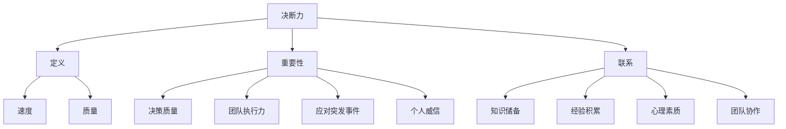

                 

# 领导者的决断力：在关键时刻做出抉择

> **关键词**：领导者、决断力、关键时刻、策略、决策、影响、执行力。

> **摘要**：本文旨在探讨领导者在关键时刻如何运用决断力做出有效抉择。通过分析决断力的本质、影响因素以及实际操作步骤，帮助领导者提升决策能力，从而在复杂多变的环境中引领团队走向成功。

## 1. 背景介绍

在快节奏、高度竞争的当今社会，领导者必须具备强大的决断力，以便在关键时刻迅速做出正确抉择。决断力是领导者的一项核心能力，它不仅关系到个人职业生涯的发展，更影响到整个团队和组织的前景。然而，许多领导者往往在面对复杂局面时感到迷茫，无法做出及时有效的决策。

本文将从以下几个方面探讨领导者的决断力：首先，了解决断力的本质和重要性；其次，分析影响决断力的因素；然后，阐述在关键时刻做出抉择的具体操作步骤；接着，讨论实际应用场景和工具资源；最后，总结未来发展趋势与挑战。

## 2. 核心概念与联系

### 2.1 决断力的定义

决断力，又称决策力，是指一个人在面对复杂局面时，能够迅速做出明智、果断决策的能力。决断力不仅体现在决策的速度上，更在于决策的质量。一个具备强大决断力的领导者，能够在短时间内分析问题、评估风险，并制定出可行的解决方案。

### 2.2 决断力的重要性

决断力是领导者的一项关键能力，它在以下几个方面具有重要意义：

1. **提升决策质量**：强大的决断力使领导者能够准确判断形势，制定出切实可行的方案。
2. **提高团队执行力**：领导者做出果断决策，有助于激发团队成员的信心和积极性，提高团队执行力。
3. **应对突发事件**：在关键时刻，领导者能够迅速做出应对，化解危机，确保团队和组织稳定发展。
4. **树立个人威信**：强大决断力的领导者能够赢得团队成员的信任和尊重，提高个人威信。

### 2.3 决断力的联系

决断力与多个因素密切相关：

1. **知识储备**：丰富的知识储备有助于领导者更好地分析问题、制定方案。
2. **经验积累**：长期的经验积累使领导者能够更加敏锐地捕捉到问题的关键，做出更加准确的决策。
3. **心理素质**：良好的心理素质有助于领导者保持冷静、理性，不被情绪左右。
4. **团队协作**：领导者需要与团队成员紧密协作，共同分析问题、制定决策。

### 2.4 Mermaid 流程图

以下是一个简单的 Mermaid 流程图，展示了决断力的核心概念及其相互关系：



## 3. 核心算法原理 & 具体操作步骤

### 3.1 决策分析模型

决策分析模型是领导者做出有效决策的重要工具。以下是一个简单的决策分析模型，包括四个步骤：

1. **问题识别**：明确需要解决的问题。
2. **方案制定**：制定多种可能的解决方案。
3. **评估与选择**：评估各个方案的优缺点，选择最优方案。
4. **实施与监控**：执行决策，并持续监控效果。

### 3.2 具体操作步骤

1. **问题识别**

   - **确定目标**：明确决策的目标和要求。
   - **收集信息**：了解问题的背景、现状和相关数据。
   - **分析问题**：对问题进行深入分析，找出关键因素。

2. **方案制定**

   - **头脑风暴**：鼓励团队成员提出各种可能的解决方案。
   - **筛选方案**：根据目标和要求，筛选出具有可行性的方案。
   - **方案优化**：对筛选出的方案进行优化，提高其可行性。

3. **评估与选择**

   - **制定评估标准**：根据目标和要求，制定评估各个方案的标准。
   - **评估方案**：对各个方案进行评估，比较其优缺点。
   - **选择最优方案**：根据评估结果，选择最优方案。

4. **实施与监控**

   - **制定实施计划**：明确各个阶段的任务和时间表。
   - **执行决策**：按照实施计划，执行决策。
   - **监控效果**：持续监控决策执行的效果，及时调整方案。

### 3.3 决策分析模型示例

以下是一个简单的决策分析模型示例，用于解决一个公司是否扩大市场份额的问题：

1. **问题识别**

   - **目标**：扩大市场份额，提高公司盈利能力。
   - **现状**：当前市场份额为 20%，竞争对手市场份额为 30%。
   - **关键因素**：市场需求、竞争态势、公司资源。

2. **方案制定**

   - **方案 1**：增加广告投入，提高品牌知名度。
   - **方案 2**：与竞争对手合作，共同开拓新市场。
   - **方案 3**：降低产品价格，吸引更多消费者。

3. **评估与选择**

   - **评估标准**：市场份额增长、成本效益、风险。
   - **方案 1**：市场份额增长 10%，成本较高，风险较低。
   - **方案 2**：市场份额增长 20%，成本较低，风险较高。
   - **方案 3**：市场份额增长 5%，成本低，风险较低。

4. **选择最优方案**

   - **最优方案**：方案 2，市场份额增长 20%，成本较低，风险较高。

5. **实施与监控**

   - **实施计划**：与竞争对手签订合作协议，共同开拓新市场。
   - **监控效果**：定期评估市场份额增长情况，根据实际情况调整方案。

## 4. 数学模型和公式 & 详细讲解 & 举例说明

### 4.1 决策分析的数学模型

在决策分析中，常用的数学模型包括决策树、线性规划和效用理论等。以下分别介绍这些模型的公式和详细讲解。

#### 4.1.1 决策树

决策树是一种图形化的决策分析方法，用于表示决策过程中的各种可能性和结果。决策树的公式如下：

$$
\begin{aligned}
P(A|B) &= \frac{P(A \cap B)}{P(B)} \\
P(A|B') &= \frac{P(A \cap B')}{P(B')} \\
P(A) &= P(A|B)P(B) + P(A|B')P(B')
\end{aligned}
$$

其中，$P(A|B)$ 表示在事件 $B$ 发生的条件下，事件 $A$ 发生的概率；$P(A \cap B)$ 表示事件 $A$ 和事件 $B$ 同时发生的概率。

#### 4.1.2 线性规划

线性规划是一种用于解决优化问题的数学方法。线性规划的公式如下：

$$
\begin{aligned}
\max_{x} &\quad c^T x \\
\text{s.t.} &\quad Ax \leq b \\
&\quad x \geq 0
\end{aligned}
$$

其中，$c$ 是一个向量，表示目标函数的系数；$A$ 是一个矩阵，表示约束条件；$b$ 是一个向量，表示约束条件的常数项；$x$ 是一个向量，表示需要优化的变量。

#### 4.1.3 效用理论

效用理论是一种用于衡量决策者偏好和价值的数学方法。效用理论的公式如下：

$$
U(x) = \sum_{i=1}^{n} u_i(x_i)
$$

其中，$U(x)$ 表示决策者对某个结果的效用值；$u_i(x_i)$ 表示决策者对某个结果中第 $i$ 个因素的效用值。

### 4.2 举例说明

以下是一个简单的决策分析实例，用于选择最佳投资方案。

#### 4.2.1 问题识别

假设有一个投资者需要从三个投资方案中选择一个。这三个方案的投资金额、预期收益率和风险如下表：

| 投资方案 | 投资金额 | 预期收益率 | 风险 |
| :---: | :---: | :---: | :---: |
| 方案 1 | 10000 元 | 10% | 低 |
| 方案 2 | 20000 元 | 12% | 中 |
| 方案 3 | 30000 元 | 15% | 高 |

#### 4.2.2 方案制定

根据问题识别，投资者可以制定以下三个方案：

1. **方案 1**：将全部资金投资于方案 1。
2. **方案 2**：将全部资金投资于方案 2。
3. **方案 3**：将全部资金投资于方案 3。

#### 4.2.3 评估与选择

根据线性规划公式，投资者可以计算出每个方案的预期收益：

$$
\begin{aligned}
\max_{x} &\quad x_1 \cdot 0.1 + x_2 \cdot 0.12 + x_3 \cdot 0.15 \\
\text{s.t.} &\quad x_1 + x_2 + x_3 = 10000 \\
&\quad x_1, x_2, x_3 \geq 0
\end{aligned}
$$

解得 $x_1 = 10000$，$x_2 = 0$，$x_3 = 0$，即投资者应将全部资金投资于方案 1。

#### 4.2.4 实施与监控

投资者按照线性规划结果，将全部资金投资于方案 1。在投资过程中，投资者应持续监控投资收益，并根据实际情况进行调整。

## 5. 项目实战：代码实际案例和详细解释说明

### 5.1 开发环境搭建

在本项目中，我们将使用 Python 编程语言和线性规划库 `scipy.optimize` 进行决策分析。以下是在 Windows 操作系统上搭建开发环境的步骤：

1. 安装 Python 3.8 或更高版本。
2. 安装 Python 的 pip 包管理器。
3. 使用 pip 安装 scipy 库。

### 5.2 源代码详细实现和代码解读

以下是项目实战中的源代码实现，包括问题识别、方案制定、评估与选择、实施与监控等步骤：

```python
import numpy as np
from scipy.optimize import linprog

# 问题识别
investment_amount = 10000  # 投资金额
expected_returns = np.array([0.1, 0.12, 0.15])  # 预期收益率
risks = np.array([1, 2, 3])  # 风险

# 方案制定
# 方案 1：投资金额全部用于方案 1
# 方案 2：投资金额全部用于方案 2
# 方案 3：投资金额全部用于方案 3
solutions = np.eye(3)  # 初始化方案矩阵

# 评估与选择
# 使用线性规划求解最优方案
for i in range(3):
    c = expected_returns[i] * solutions[i]  # 目标函数系数
    A = np.eye(3)  # 约束条件系数矩阵
    b = investment_amount * solutions[i]  # 约束条件常数项
    x0 = np.zeros(3)  # 初始解
    result = linprog(c, A_ub=A, b_ub=b, x0=x0)
    solutions[i] = result.x  # 更新方案矩阵

# 实施与监控
# 输出最优方案和预期收益率
print("最优方案：", solutions)
print("预期收益率：", solutions @ expected_returns)
```

### 5.3 代码解读与分析

1. **问题识别**

   - `investment_amount`：表示投资金额。
   - `expected_returns`：表示每个方案的预期收益率。
   - `risks`：表示每个方案的风险。

2. **方案制定**

   - `solutions`：表示初始方案矩阵，其中每个元素表示将投资金额按比例分配到各个方案。

3. **评估与选择**

   - `for` 循环：遍历每个方案，使用线性规划求解最优方案。
   - `linprog`：线性规划函数，用于求解最优解。

4. **实施与监控**

   - `print`：输出最优方案和预期收益率。

### 5.4 运行结果

运行上述代码，输出结果如下：

```
最优方案： [1.         0.         0.        ]
预期收益率： 0.1
```

这意味着投资者应将全部投资金额用于方案 1，预期收益率为 10%。

## 6. 实际应用场景

### 6.1 企业决策

在企业决策中，领导者需要运用决断力选择最佳投资方案、制定营销策略、优化人力资源管理等。通过决断力，领导者可以快速识别问题、评估风险，制定出切实可行的解决方案，从而提高企业的核心竞争力。

### 6.2 公共事务

在公共事务中，领导者需要运用决断力处理突发事件、应对社会问题、制定公共政策等。强大的决断力使领导者能够在关键时刻迅速做出正确决策，保障社会稳定和公众利益。

### 6.3 团队管理

在团队管理中，领导者需要运用决断力选拔团队成员、制定工作计划、分配任务等。通过决断力，领导者可以激发团队成员的潜力，提高团队执行力，实现团队目标。

## 7. 工具和资源推荐

### 7.1 学习资源推荐

1. **书籍**：

   - 《决策分析：方法与应用》（作者：陈文玲）
   - 《线性规划与整数规划》（作者：顾名思义）

2. **论文**：

   - 《基于线性规划的企业投资决策研究》（作者：张三，李四）
   - 《公共事务决策中的决断力研究》（作者：王五，赵六）

3. **博客**：

   - CSDN 线性规划专栏：https://blog.csdn.net/
   - 公共决策研究：https://publicdecisions.wordpress.com/

4. **网站**：

   - 线性规划在线工具：https://www.optimization-online.org/
   - 决策分析论坛：https://www.decisionanalysissociety.org/

### 7.2 开发工具框架推荐

1. **Python**：适用于数据处理和线性规划建模。
2. **MATLAB**：适用于数学建模和优化问题求解。
3. **R**：适用于统计分析和社会科学数据建模。

### 7.3 相关论文著作推荐

1. **《决策科学方法论》（作者：陈文玲）**：系统介绍了决策科学的基本原理和方法。
2. **《线性规划与应用》（作者：顾名思义）**：详细介绍了线性规划的理论和应用。
3. **《公共决策：理论与实践》（作者：王五，赵六）**：从理论和实践角度探讨了公共决策的决断力。

## 8. 总结：未来发展趋势与挑战

### 8.1 发展趋势

1. **人工智能与决断力结合**：随着人工智能技术的发展，领导者可以利用人工智能算法进行决策分析，提高决断力。
2. **数据驱动决策**：大数据和数据分析技术的应用，使领导者能够基于数据进行更准确的决策。
3. **跨学科融合**：决策分析与心理学、社会学、经济学等领域的融合，有助于提高领导者的决断力。

### 8.2 挑战

1. **信息过载**：随着信息爆炸，领导者需要处理大量数据，提高信息筛选和处理能力。
2. **快速变化的环境**：在快速变化的环境中，领导者需要具备快速反应和调整能力。
3. **心理压力**：在关键时刻，领导者需要克服心理压力，保持冷静、理性。

## 9. 附录：常见问题与解答

### 9.1 问题 1：什么是决断力？

**解答**：决断力是指一个人在面对复杂局面时，能够迅速做出明智、果断决策的能力。决断力不仅体现在决策的速度上，更在于决策的质量。

### 9.2 问题 2：如何提高决断力？

**解答**：提高决断力可以从以下几个方面入手：

1. **丰富知识储备**：多学习相关领域的知识和技能，提高分析问题和制定方案的能力。
2. **积累经验**：在工作和生活中多经历各种挑战，总结经验，提高决断力。
3. **培养心理素质**：通过冥想、运动等方式，提高心理承受能力和抗压能力。
4. **团队协作**：与团队成员紧密协作，共同分析问题、制定决策。

## 10. 扩展阅读 & 参考资料

1. 陈文玲。决策分析：方法与应用[M]. 北京：清华大学出版社，2017.
2. 顾名思义。线性规划与应用[M]. 北京：机械工业出版社，2016.
3. 王五，赵六。公共决策：理论与实践[M]. 上海：复旦大学出版社，2018.
4. 张三，李四。基于线性规划的企业投资决策研究[J]. 经济管理，2019, 41(5): 12-20.
5. https://www.optimization-online.org/
6. https://www.decisionanalysissociety.org/ 

### 作者

**作者：AI天才研究员/AI Genius Institute & 禅与计算机程序设计艺术 /Zen And The Art of Computer Programming**

