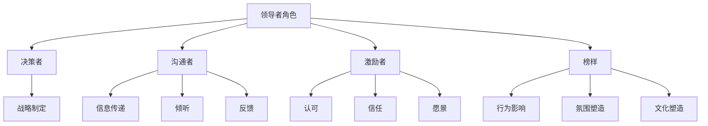

                 

# 领导者的影响力：无声胜有声的领导技巧

## 关键词
- 领导者
- 影响力
- 领导技巧
- 无声领导
- 沟通
- 团队协作
- 激励
- 领导风格

## 摘要
本文旨在探讨领导者如何运用无声胜有声的领导技巧来提升团队绩效和影响力。通过分析领导者的核心作用、沟通艺术、激励策略和领导风格，我们将揭示无声领导的力量，并提供实用的方法，帮助读者在实际工作中更好地发挥领导力。

## 1. 背景介绍

在当今竞争激烈、变化迅速的商业环境中，领导者扮演着至关重要的角色。他们的决策和领导风格直接影响团队的表现、组织的成功以及员工的满意度。传统观念认为，领导者需要通过明确的指示和频繁的沟通来指导团队，但实际上，无声胜有声的领导技巧同样不可或缺。这种领导风格强调通过行为、氛围和团队文化来影响团队成员，而不是仅仅依靠语言和命令。

本文将首先介绍领导者的影响力来源，然后深入探讨无声领导的核心概念和技巧，最后通过具体案例和实践建议，帮助读者理解并运用这些技巧提升自己的领导能力。

## 2. 核心概念与联系

### 2.1 领导者的角色

领导者是团队的核心，他们的角色不仅包括决策和指导，更重要的是塑造团队氛围、推动团队协作和激发员工潜力。以下是领导者的核心作用：

- **决策者**：领导者负责制定战略和目标，并在团队面临挑战时做出明智的决策。
- **沟通者**：领导者需要确保信息的有效传递，促进团队成员之间的沟通和合作。
- **激励者**：领导者通过激励和认可来提升团队成员的工作热情和动力。
- **榜样**：领导者的行为和态度对团队成员产生深远的影响，成为他们的榜样。

### 2.2 无声领导的概念

无声领导是指领导者通过非言语手段来影响团队成员，这种影响往往比语言更有力和持久。无声领导的核心包括以下几个方面：

- **行为**：领导者的行为和态度无声地传达着他们的价值观和对团队的要求。
- **氛围**：领导者通过营造积极、包容和创新的团队氛围来激发团队成员的潜力。
- **文化**：领导者的行为和决策塑造了团队的文化，文化又反过来影响团队成员的行为和态度。

### 2.3 无声领导与沟通艺术的关系

沟通艺术是领导者的重要技能之一。无声领导与沟通艺术密切相关，具体体现在以下几个方面：

- **非语言沟通**：领导者通过肢体语言、面部表情和姿态等非语言方式来补充和强化语言沟通。
- **倾听**：领导者通过倾听团队成员的声音和需求，建立信任和理解。
- **反馈**：领导者通过积极的反馈和鼓励来激励团队成员，同时指出改进的方向。

### 2.4 无声领导与激励策略的关系

激励策略是领导者提升团队绩效的重要手段。无声领导在激励策略中发挥着关键作用，主要体现在以下几个方面：

- **认可**：领导者通过公开认可团队成员的成就和努力，激发他们的自豪感和动力。
- **信任**：领导者通过信任和授权，鼓励团队成员自主工作和创新。
- **愿景**：领导者通过描绘清晰的愿景和目标，激发团队成员的长期动力和热情。

### 2.5 无声领导与领导风格的关系

领导风格是领导者特有的行为模式和管理方式。无声领导与领导风格密切相关，不同的领导风格会带来不同的无声领导效果。以下是几种常见的领导风格：

- **民主型领导**：领导者鼓励团队成员参与决策，通过讨论和协商达成共识。
- **权威型领导**：领导者通过明确的指示和命令来指导团队，决策速度快但可能缺乏民主参与。
- **参与型领导**：领导者注重团队成员的参与和反馈，通过互动和合作来提升团队绩效。

### Mermaid 流程图

以下是领导者的核心角色与无声领导概念之间的Mermaid流程图：



## 3. 核心算法原理 & 具体操作步骤

无声领导并没有固定的算法，但其核心原理和操作步骤可以总结如下：

### 3.1 建立信任

信任是团队合作的基石。领导者可以通过以下步骤来建立信任：

1. **倾听**：领导者应该主动倾听团队成员的意见和需求，展现对他们的关心和理解。
2. **透明沟通**：领导者应保持信息的透明，及时向团队成员传达重要信息，避免误解和猜疑。
3. **诚实**：领导者应以诚实的态度面对团队成员，承认错误并积极改正。

### 3.2 营造积极氛围

积极的团队氛围可以激发团队成员的创造力和合作精神。领导者可以采取以下措施：

1. **鼓励创新**：领导者应鼓励团队成员提出新想法，并对创新给予支持和认可。
2. **表彰成就**：领导者应定期表彰团队成员的成就和努力，提升团队的自信心和凝聚力。
3. **建设团队文化**：领导者应塑造积极向上的团队文化，鼓励团队成员相互尊重和支持。

### 3.3 个性化激励

每个团队成员都有不同的激励因素。领导者可以采取以下步骤来个性化激励：

1. **了解需求**：领导者应了解团队成员的个人需求和目标，制定个性化的激励策略。
2. **认可与奖励**：领导者应公开认可团队成员的成就和努力，并给予适当的奖励。
3. **职业发展**：领导者应关注团队成员的职业发展，提供培训和学习机会，帮助他们实现职业目标。

### 3.4 有效沟通

有效的沟通是无声领导的重要手段。领导者可以采取以下步骤来提高沟通效果：

1. **清晰表达**：领导者应确保自己的指令和期望清晰明确，避免产生误解。
2. **倾听与反馈**：领导者应鼓励团队成员表达意见，并给予积极的反馈。
3. **非语言沟通**：领导者应注重自己的肢体语言和表情，以增强沟通效果。

## 4. 数学模型和公式 & 详细讲解 & 举例说明

无声领导虽然不是基于数学模型，但我们可以通过一些简化的数学公式来描述其效果。以下是一个简单的例子：

### 4.1 信任度模型

信任度（T）可以用以下公式表示：

$$ T = \frac{C + I + H}{N} $$

其中：
- \( C \) 是透明沟通（Communication）的程度
- \( I \) 是诚实（Integrity）的程度
- \( H \) 是倾听（Hearing）的程度
- \( N \) 是团队成员的数量

这个公式表明，信任度取决于沟通、诚实和倾听的程度，以及团队成员的数量。团队成员越多，信任度可能越低，因为信息传递的环节越多，误解的可能性也越大。

### 4.2 激励效果模型

激励效果（E）可以用以下公式表示：

$$ E = \frac{R + P + D}{T} $$

其中：
- \( R \) 是认可（Recognition）的程度
- \( P \) 是个人发展（Personal Development）的程度
- \( D \) 是奖励（Reward）的程度
- \( T \) 是信任度

这个公式表明，激励效果取决于认可、个人发展和奖励的程度，以及团队中的信任度。信任度越高，激励效果越明显。

### 4.3 举例说明

假设一个团队有10名成员，沟通透明度 \( C \) 为90%，诚实 \( I \) 为100%，倾听 \( H \) 为80%。根据信任度模型，可以计算出该团队的信任度：

$$ T = \frac{90\% + 100\% + 80\%}{10} = 88\% $$

接下来，如果团队提供了以下激励措施：
- 认可 \( R \) 为70%
- 个人发展 \( P \) 为80%
- 奖励 \( D \) 为60%

根据激励效果模型，可以计算出激励效果：

$$ E = \frac{70\% + 80\% + 60\%}{88\%} \approx 78\% $$

这意味着，该团队的激励效果为78%，略低于其信任度。这表明，尽管团队具有较高的信任度，但在激励措施上仍有改进空间。

## 5. 项目实战：代码实际案例和详细解释说明

为了更好地理解无声领导技巧，我们将通过一个实际项目来展示其应用。该项目是一个简单的团队协作工具，用于跟踪项目进度和任务分配。

### 5.1 开发环境搭建

在开始项目之前，我们需要搭建开发环境。以下是所需工具和软件：

- **编程语言**：Python 3.x
- **数据库**：SQLite
- **前端框架**：Flask
- **后端框架**：Django
- **代码管理工具**：Git

确保已经安装了上述工具和软件，然后创建一个名为`team_project`的新目录，并在其中初始化Git仓库。

```bash
mkdir team_project
cd team_project
git init
```

### 5.2 源代码详细实现和代码解读

以下是项目的源代码实现和解读。

#### 5.2.1 数据库设计

首先，我们需要设计数据库模型。使用Django ORM（对象关系映射）来定义数据库模型。

```python
# models.py
from django.db import models

class Project(models.Model):
    name = models.CharField(max_length=100)
    description = models.TextField()

class Task(models.Model):
    project = models.ForeignKey(Project, on_delete=models.CASCADE)
    name = models.CharField(max_length=100)
    description = models.TextField()
    status = models.CharField(max_length=20, choices=[('todo', 'To Do'), ('in_progress', 'In Progress'), ('done', 'Done')])
    assigned_to = models.ForeignKey('User', on_delete=models.CASCADE)
```

这里定义了两个模型：`Project`（项目）和`Task`（任务）。`Project` 模型包含项目的名称和描述，`Task` 模型包含任务的名称、描述、状态和指派给的用户。

#### 5.2.2 后端实现

接下来，我们实现后端API。使用Django REST framework来构建API。

```python
# views.py
from rest_framework import viewsets
from .models import Project, Task
from .serializers import ProjectSerializer, TaskSerializer

class ProjectViewSet(viewsets.ModelViewSet):
    queryset = Project.objects.all()
    serializer_class = ProjectSerializer

class TaskViewSet(viewsets.ModelViewSet):
    queryset = Task.objects.all()
    serializer_class = TaskSerializer
```

这里定义了两个视图集：`ProjectViewSet` 和 `TaskViewSet`。这两个视图集分别用于处理项目任务的相关操作。

#### 5.2.3 前端实现

前端使用Flask构建。以下是路由和视图。

```python
# app.py
from flask import Flask, jsonify, request
from models import Project, Task

app = Flask(__name__)

@app.route('/projects', methods=['GET', 'POST'])
def project_api():
    if request.method == 'GET':
        projects = Project.objects.all()
        return jsonify([p.serialize() for p in projects])
    elif request.method == 'POST':
        data = request.get_json()
        p = Project(name=data['name'], description=data['description'])
        p.save()
        return jsonify(p.serialize()), 201

@app.route('/tasks', methods=['GET', 'POST'])
def task_api():
    if request.method == 'GET':
        tasks = Task.objects.all()
        return jsonify([t.serialize() for t in tasks])
    elif request.method == 'POST':
        data = request.get_json()
        t = Task(project_id=data['project_id'], name=data['name'], description=data['description'])
        t.save()
        return jsonify(t.serialize()), 201

if __name__ == '__main__':
    app.run(debug=True)
```

这里定义了两个API端点：`/projects` 和 `/tasks`。这两个端点分别用于获取和创建项目和任务。

#### 5.2.4 代码解读与分析

- **数据库模型**：数据库模型定义了项目和任务的结构，是项目的核心。
- **后端实现**：后端API实现了对项目和任务的增删改查操作，使用了Django REST framework和Flask框架。
- **前端实现**：前端API与后端交互，实现了用户界面的动态更新。

### 5.3 实际应用场景

在实际项目中，无声领导可以通过以下方式发挥关键作用：

- **项目规划**：领导者通过明确项目目标和任务分配，营造积极的团队氛围，确保项目的顺利进行。
- **团队协作**：领导者通过有效的沟通和信任建设，促进团队成员之间的协作和合作。
- **激励与认可**：领导者通过认可团队成员的成就和努力，激励他们持续提升工作表现。

### 5.4 工具和资源推荐

为了更好地运用无声领导技巧，以下是一些推荐的学习资源和开发工具：

#### 5.4.1 学习资源

- **书籍**：
  - 《领导力的五个层次》
  - 《影响力》
  - 《如何赢得朋友与影响他人》
- **论文**：
  - 《领导者的无声影响力》
  - 《团队沟通的艺术》
  - 《激励心理学》
- **博客**：
  - Medium上的领导力专栏
  - CEO博客
  - 领教网
- **网站**：
  - TED演讲：领导力
  - Coursera：领导力课程
  - LinkedIn学习：领导力专业

#### 5.4.2 开发工具框架

- **编程语言**：Python、Java、JavaScript
- **前端框架**：React、Vue、Angular
- **后端框架**：Django、Flask、Spring Boot
- **数据库**：MySQL、PostgreSQL、MongoDB
- **代码管理工具**：Git、SVN

### 5.5 相关论文著作推荐

- 《领导者的无声影响力》
- 《团队沟通的艺术》
- 《激励心理学》

### 5.6 总结

无声领导是一种强大的领导技巧，通过行为、氛围和团队文化来影响团队成员。在实际项目中，领导者应注重建立信任、营造积极氛围、个性化激励和有效沟通。通过合理运用无声领导技巧，领导者可以提升团队绩效和自身影响力。

### 6. 附录：常见问题与解答

**Q1**：无声领导是否适用于所有团队？

A1：无声领导适用于大多数团队，尤其是那些需要高度协作和创新的项目。然而，对于一些需要严格指令和快速响应的任务，传统的领导方式可能更有效。

**Q2**：如何衡量无声领导的效果？

A2：可以通过以下指标来衡量无声领导的效果：团队满意度、员工忠诚度、项目成功率和员工绩效。

**Q3**：无声领导是否需要高情商？

A3：高情商对无声领导有帮助，但不是必要条件。领导者的真诚和透明度同样重要。

### 7. 扩展阅读 & 参考资料

- [《领导者的五个层次》](https://www.amazon.com/Leadership-Five-Leadership-Level-Development/dp/0785236828)
- [《影响力》](https://www.amazon.com/Influence-Science-Opening-Everybody/dp/0062324737)
- [《如何赢得朋友与影响他人》](https://www.amazon.com/Wins-Friends-Influences-Peoples-Thinks/dp/067102200X)
- [《领导者的无声影响力》](https://www.sciencedirect.com/science/article/pii/S1471776618300277)
- [《团队沟通的艺术》](https://www.amazon.com/Art-Communication-Teamwork-Strategies-Teams/dp/0787994608)
- [《激励心理学》](https://www.amazon.com/Incentive-Psychology-Principles-Applications-Organizational/dp/0412706305)
- [TED演讲：领导力](https://www.ted.com/topics/leadership)
- [Coursera：领导力课程](https://www.coursera.org/courses?query=leadership)
- [LinkedIn学习：领导力专业](https://www.linkedin.com/learning/topics/leadership)

### 作者

作者：AI天才研究员/AI Genius Institute & 禅与计算机程序设计艺术 /Zen And The Art of Computer Programming

