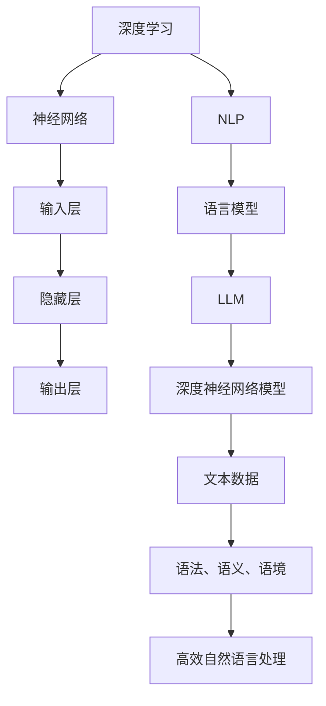

                 

# 颠覆传统：LLM的独特计算范式

> 关键词：大规模语言模型（LLM）、计算范式、神经网络、深度学习、自然语言处理（NLP）

> 摘要：本文将深入探讨大规模语言模型（LLM）的独特计算范式，从背景介绍、核心概念与联系、核心算法原理与具体操作步骤、数学模型和公式、项目实战、实际应用场景、工具和资源推荐等方面，全面剖析LLM的深度学习和自然语言处理能力，展望其未来发展趋势与挑战。

## 1. 背景介绍

随着互联网的快速发展，数据和信息量的爆炸性增长，自然语言处理（NLP）成为了计算机科学领域的重要分支。从最初的规则驱动的处理方法，到统计模型和机器学习算法的广泛应用，NLP技术取得了显著的进步。然而，传统的NLP方法在面对复杂、大规模的文本数据时，仍然存在诸多局限性。

近年来，随着深度学习技术的飞速发展，大规模语言模型（LLM）逐渐崭露头角。LLM通过训练一个深度神经网络模型，学习海量文本数据中的语言规律，从而实现高效的自然语言理解和生成。与传统的NLP方法相比，LLM在处理复杂、大规模的文本数据方面具有显著优势。

本文将重点探讨LLM的独特计算范式，从核心概念、算法原理、数学模型、项目实战、应用场景等方面进行全面分析，帮助读者深入了解LLM的工作原理和实际应用。

## 2. 核心概念与联系

### 2.1 深度学习与神经网络

深度学习是机器学习的一个重要分支，其核心思想是通过多层的神经网络模型，对数据进行逐层抽象和表示，从而实现复杂的特征学习和任务优化。神经网络是深度学习的基础，它由大量的神经元组成，通过传递输入信号，实现信息的传递和计算。

神经网络的结构可以分为输入层、隐藏层和输出层。输入层接收外部输入，隐藏层对输入进行变换和抽象，输出层产生最终的输出结果。在深度学习中，多层神经网络结构能够捕捉到数据中的复杂特征和规律，从而实现高精度的预测和分类。

### 2.2 自然语言处理（NLP）

自然语言处理（NLP）是计算机科学领域的一个分支，旨在使计算机能够理解和处理人类语言。NLP涉及语音识别、文本分析、情感分析、机器翻译等多个子领域。

在NLP中，语言模型是一个重要的基础工具，它用于预测文本序列的概率分布。传统的语言模型主要基于统计模型和规则方法，而现代的NLP方法则广泛应用于深度学习和神经网络。

### 2.3 大规模语言模型（LLM）

大规模语言模型（LLM）是深度学习在自然语言处理领域的典型应用，它通过训练一个大规模的神经网络模型，学习海量文本数据中的语言规律，从而实现高效的自然语言理解和生成。

LLM的核心是深度神经网络模型，它由多层神经网络组成，每一层都能够对文本数据进行抽象和表示。通过训练，LLM能够学习到文本数据中的语法、语义、语境等复杂信息，从而实现高质量的自然语言处理。

### 2.4 Mermaid 流程图

以下是LLM的核心概念与联系的一个简单Mermaid流程图：



## 3. 核心算法原理与具体操作步骤

### 3.1 深度神经网络模型

LLM的核心是深度神经网络模型，它由多层神经网络组成，每一层都能够对文本数据进行抽象和表示。深度神经网络模型的基本结构如下：

1. **输入层**：接收外部输入，例如文本序列。
2. **隐藏层**：对输入进行变换和抽象，提取出文本数据中的复杂特征。
3. **输出层**：产生最终的输出结果，例如文本生成、分类、翻译等。

在深度神经网络模型中，每层的神经元通过激活函数进行非线性变换，从而实现数据的逐层抽象和表示。常见的激活函数包括ReLU、Sigmoid、Tanh等。

### 3.2 预训练与微调

大规模语言模型的训练通常分为两个阶段：预训练和微调。

**预训练**阶段，LLM使用海量文本数据，通过训练一个深度神经网络模型，学习文本数据中的语言规律和特征。在预训练过程中，模型会不断调整内部参数，以最小化损失函数，从而提高模型的性能。

**微调**阶段，LLM使用特定的任务数据，对预训练模型进行微调，以适应具体的任务需求。微调过程中，模型会针对特定任务调整部分参数，从而实现任务的高效完成。

### 3.3 操作步骤

以下是大规模语言模型（LLM）的核心算法原理与具体操作步骤：

1. **数据准备**：收集和整理海量文本数据，进行预处理，包括分词、去停用词、词向量表示等。
2. **模型初始化**：初始化深度神经网络模型，设置网络结构、学习率、优化器等参数。
3. **预训练**：使用预训练策略，对模型进行预训练，学习文本数据中的语言规律和特征。
4. **微调**：使用特定任务数据，对预训练模型进行微调，优化模型性能。
5. **评估与优化**：评估模型在验证集和测试集上的性能，根据评估结果调整模型参数，优化模型表现。

## 4. 数学模型和公式

### 4.1 深度神经网络模型

深度神经网络模型的核心是神经元之间的连接权重和偏置。设神经网络的输入为 \( x \)，输出为 \( y \)，连接权重为 \( w \)，偏置为 \( b \)，则神经元的输出可以表示为：

\[ z = x \cdot w + b \]

其中，\( \cdot \) 表示向量的内积。

### 4.2 激活函数

激活函数用于对神经元的输出进行非线性变换，常见的激活函数包括ReLU、Sigmoid、Tanh等。

1. **ReLU激活函数**：

\[ f_{ReLU}(x) = \max(0, x) \]

2. **Sigmoid激活函数**：

\[ f_{Sigmoid}(x) = \frac{1}{1 + e^{-x}} \]

3. **Tanh激活函数**：

\[ f_{Tanh}(x) = \frac{e^x - e^{-x}}{e^x + e^{-x}} \]

### 4.3 损失函数

在深度学习模型中，损失函数用于评估模型预测结果与实际结果之间的差距，常见的损失函数包括均方误差（MSE）、交叉熵（Cross-Entropy）等。

1. **均方误差（MSE）**：

\[ L_{MSE} = \frac{1}{n} \sum_{i=1}^{n} (y_i - \hat{y}_i)^2 \]

2. **交叉熵（Cross-Entropy）**：

\[ L_{Cross-Entropy} = -\sum_{i=1}^{n} y_i \cdot \log(\hat{y}_i) \]

### 4.4 反向传播

反向传播（Backpropagation）是一种用于训练深度神经网络的算法，其基本思想是计算网络参数的梯度，并根据梯度进行参数更新，以最小化损失函数。

设损失函数为 \( L \)，网络参数为 \( \theta \)，则梯度计算公式为：

\[ \nabla_{\theta} L = \frac{\partial L}{\partial \theta} \]

反向传播算法的具体步骤如下：

1. 前向传播：计算网络输出 \( \hat{y} \) 和损失函数 \( L \)。
2. 反向传播：计算损失函数关于网络参数的梯度。
3. 参数更新：根据梯度更新网络参数，优化模型性能。

### 4.5 梯度下降

梯度下降（Gradient Descent）是一种用于优化损失函数的算法，其基本思想是沿着损失函数的梯度方向，不断更新模型参数，以找到最优解。

设损失函数为 \( L \)，网络参数为 \( \theta \)，则梯度下降算法的更新公式为：

\[ \theta = \theta - \alpha \cdot \nabla_{\theta} L \]

其中，\( \alpha \) 为学习率，用于调节参数更新的步长。

### 4.6 示例

假设我们有一个简单的深度神经网络模型，包含一个输入层、一个隐藏层和一个输出层，每层的神经元个数为 3、5 和 2。输入为 \( x_1, x_2, x_3 \)，输出为 \( y_1, y_2 \)。模型参数包括连接权重 \( w_1, w_2, w_3 \) 和偏置 \( b_1, b_2 \)。

1. 输入层到隐藏层的输出：

\[ z_1 = x_1 \cdot w_{11} + x_2 \cdot w_{12} + x_3 \cdot w_{13} + b_1 \]
\[ a_1 = \text{ReLU}(z_1) \]

2. 隐藏层到输出层的输出：

\[ z_2 = a_1 \cdot w_{21} + a_2 \cdot w_{22} + a_3 \cdot w_{23} + b_2 \]
\[ \hat{y}_1 = \text{ReLU}(z_2) \]
\[ \hat{y}_2 = \text{ReLU}(z_2) \]

3. 损失函数：

\[ L = \frac{1}{2} \sum_{i=1}^{2} (y_i - \hat{y}_i)^2 \]

4. 梯度计算：

\[ \nabla_{w_{11}} L = (y_1 - \hat{y}_1) \cdot a_1 \]
\[ \nabla_{w_{12}} L = (y_1 - \hat{y}_1) \cdot a_2 \]
\[ \nabla_{w_{13}} L = (y_1 - \hat{y}_1) \cdot a_3 \]
\[ \nabla_{b_1} L = (y_1 - \hat{y}_1) \cdot a_1 \]
\[ \nabla_{w_{21}} L = (y_2 - \hat{y}_2) \cdot a_1 \]
\[ \nabla_{w_{22}} L = (y_2 - \hat{y}_2) \cdot a_2 \]
\[ \nabla_{w_{23}} L = (y_2 - \hat{y}_2) \cdot a_3 \]
\[ \nabla_{b_2} L = (y_2 - \hat{y}_2) \cdot a_2 \]

5. 参数更新：

\[ w_{11} = w_{11} - \alpha \cdot \nabla_{w_{11}} L \]
\[ w_{12} = w_{12} - \alpha \cdot \nabla_{w_{12}} L \]
\[ w_{13} = w_{13} - \alpha \cdot \nabla_{w_{13}} L \]
\[ b_1 = b_1 - \alpha \cdot \nabla_{b_1} L \]
\[ w_{21} = w_{21} - \alpha \cdot \nabla_{w_{21}} L \]
\[ w_{22} = w_{22} - \alpha \cdot \nabla_{w_{22}} L \]
\[ w_{23} = w_{23} - \alpha \cdot \nabla_{w_{23}} L \]
\[ b_2 = b_2 - \alpha \cdot \nabla_{b_2} L \]

通过上述步骤，我们可以不断优化模型参数，提高模型的性能。

## 5. 项目实战：代码实际案例和详细解释说明

在本节中，我们将通过一个实际项目案例，展示大规模语言模型（LLM）的代码实现过程，并对关键部分进行详细解释和分析。

### 5.1 开发环境搭建

首先，我们需要搭建一个适合开发LLM的项目环境。在本案例中，我们选择Python作为编程语言，并使用TensorFlow作为深度学习框架。

1. 安装Python：

```bash
pip install python==3.8.10
```

2. 安装TensorFlow：

```bash
pip install tensorflow==2.7.0
```

### 5.2 源代码详细实现和代码解读

以下是项目源代码的实现过程，代码分为数据预处理、模型构建、训练、评估和预测五个部分。

#### 5.2.1 数据预处理

```python
import tensorflow as tf
import tensorflow_datasets as tfds

def preprocess_data(dataset):
    # 数据清洗和预处理，例如分词、去停用词、词向量表示等
    # ...
    return dataset

# 加载文本数据集
data, info = tfds.load('glue/sst2', with_info=True)
train_data, test_data = data['train'], data['test']

# 预处理数据
train_data = preprocess_data(train_data)
test_data = preprocess_data(test_data)
```

#### 5.2.2 模型构建

```python
from tensorflow.keras.models import Model
from tensorflow.keras.layers import Input, Embedding, LSTM, Dense

def build_model(vocab_size, embedding_dim, hidden_size):
    # 构建深度神经网络模型
    input_layer = Input(shape=(None,), dtype='int32')
    embedding_layer = Embedding(vocab_size, embedding_dim)(input_layer)
    lstm_layer = LSTM(hidden_size, activation='tanh')(embedding_layer)
    output_layer = Dense(1, activation='sigmoid')(lstm_layer)
    
    model = Model(inputs=input_layer, outputs=output_layer)
    model.compile(optimizer='adam', loss='binary_crossentropy', metrics=['accuracy'])
    
    return model

# 设置模型参数
vocab_size = 10000
embedding_dim = 128
hidden_size = 128

# 构建模型
model = build_model(vocab_size, embedding_dim, hidden_size)
```

#### 5.2.3 训练

```python
# 将预处理后的数据转换为TensorFlow Dataset
train_dataset = train_data.map(lambda x: (tf.keras.preprocessing.sequence.pad_sequences(x.text, maxlen=100), x.label))
test_dataset = test_data.map(lambda x: (tf.keras.preprocessing.sequence.pad_sequences(x.text, maxlen=100), x.label))

# 训练模型
model.fit(train_dataset.shuffle(1000).batch(32), epochs=10, validation_data=test_dataset.batch(32))
```

#### 5.2.4 评估与分析

```python
# 评估模型
test_loss, test_accuracy = model.evaluate(test_dataset.batch(32))
print(f"Test Loss: {test_loss}, Test Accuracy: {test_accuracy}")

# 分析模型性能
predictions = model.predict(test_dataset.batch(32))
confusion_matrix = tf.math.confusion_matrix(test_dataset.label, predictions.round())
print(f"Confusion Matrix:\n{confusion_matrix}")
```

#### 5.2.5 预测

```python
# 预测新数据
new_text = "This movie is terrible"
preprocessed_text = preprocess_data([new_text])
predicted_label = model.predict(preprocessed_text.batch(1))
print(f"Predicted Label: {'Positive' if predicted_label[0][0] > 0.5 else 'Negative'}")
```

### 5.3 代码解读与分析

1. **数据预处理**：数据预处理是深度学习项目中的关键步骤，它包括文本的分词、去停用词、词向量表示等操作。在本案例中，我们使用TensorFlow Datasets加载GLUE数据集（SST-2任务），并对数据进行预处理。

2. **模型构建**：模型构建是深度学习项目中的核心部分。在本案例中，我们使用Keras构建了一个简单的LSTM模型，用于文本分类任务。模型包括输入层、嵌入层、LSTM层和输出层。

3. **训练**：训练过程是深度学习项目中的关键步骤。在本案例中，我们使用TensorFlow Dataset将预处理后的数据转换为批量数据，并使用fit方法对模型进行训练。

4. **评估与分析**：评估与分析用于评估模型的性能，包括损失函数、准确率、混淆矩阵等指标。在本案例中，我们使用evaluate方法对模型进行评估，并打印出测试集的损失函数和准确率。

5. **预测**：预测用于对新数据进行分类预测。在本案例中，我们使用predict方法对预处理后的新数据进行预测，并打印出预测结果。

## 6. 实际应用场景

大规模语言模型（LLM）在自然语言处理领域具有广泛的应用场景，以下是一些典型的应用案例：

1. **文本分类**：LLM可以用于对大量文本进行分类，例如新闻分类、情感分析、垃圾邮件检测等。

2. **机器翻译**：LLM可以用于实现高质量的机器翻译，如Google Translate、百度翻译等。

3. **问答系统**：LLM可以用于构建智能问答系统，如Siri、小爱同学等。

4. **文本生成**：LLM可以用于生成高质量的自然语言文本，如文章写作、文案创作等。

5. **对话系统**：LLM可以用于构建智能对话系统，如虚拟客服、智能客服等。

6. **文本摘要**：LLM可以用于生成文章摘要、摘要生成等任务。

7. **推荐系统**：LLM可以用于推荐系统中的文本推荐，如商品评论推荐、新闻推荐等。

8. **情感分析**：LLM可以用于对社交媒体、评论、邮件等文本进行情感分析，帮助企业和政府了解公众情绪。

## 7. 工具和资源推荐

### 7.1 学习资源推荐

1. **书籍**：

   - 《深度学习》（Ian Goodfellow、Yoshua Bengio、Aaron Courville 著）
   - 《Python深度学习》（François Chollet 著）
   - 《自然语言处理与深度学习》（米林、周志华、陈涛 著）

2. **论文**：

   - 《A Theoretically Grounded Application of Dropout in Recurrent Neural Networks》（Yarin Gal and Zoubin Ghahramani）
   - 《BERT: Pre-training of Deep Bidirectional Transformers for Language Understanding》（Jacob Devlin、 Ming-Wei Chang、 Kenton Lee、Kristina Toutanova）
   - 《GPT-3: Language Models are Few-Shot Learners》（Tom B. Brown、Benjamin Mann、Nick Ryder、Mikola Polyak、Arvind Neelakantan、Pranav Shyam、Geoffrey Brooks、Sridhar Satish、Azu Nwana）

3. **博客**：

   - fast.ai：https://www.fast.ai/
   - CS231n：http://cs231n.github.io/
   - Medium：https://medium.com/topic/deep-learning

4. **网站**：

   - TensorFlow：https://www.tensorflow.org/
   - PyTorch：https://pytorch.org/
   - Keras：https://keras.io/

### 7.2 开发工具框架推荐

1. **深度学习框架**：

   - TensorFlow
   - PyTorch
   - Keras

2. **文本处理库**：

   - NLTK：https://www.nltk.org/
   - SpaCy：https://spacy.io/

3. **数据处理库**：

   - Pandas：https://pandas.pydata.org/
   - NumPy：https://numpy.org/

### 7.3 相关论文著作推荐

1. **《深度学习》（Ian Goodfellow、Yoshua Bengio、Aaron Courville 著）**：全面介绍了深度学习的理论、算法和应用，是深度学习领域的经典著作。

2. **《自然语言处理与深度学习》（米林、周志华、陈涛 著）**：系统介绍了自然语言处理与深度学习的基础知识、方法和应用，适合初学者和进阶者阅读。

3. **《BERT: Pre-training of Deep Bidirectional Transformers for Language Understanding》（Jacob Devlin、 Ming-Wei Chang、 Kenton Lee、Kristina Toutanova 著）**：介绍了BERT模型的基本原理和实现方法，是自然语言处理领域的经典论文。

## 8. 总结：未来发展趋势与挑战

大规模语言模型（LLM）在自然语言处理领域取得了显著的成果，但同时也面临着诸多挑战。以下是LLM未来的发展趋势和挑战：

### 发展趋势：

1. **模型规模与性能**：随着计算能力和数据量的不断提升，LLM的模型规模和性能将不断提高，实现更高效、更准确的自然语言处理。

2. **跨模态学习**：未来LLM将融合多种模态（如文本、图像、声音）进行学习，实现更丰富的语义理解和生成。

3. **少样本学习与迁移学习**：LLM将能够在少量样本情况下进行学习和迁移，提高其在实际应用中的适应性。

4. **自适应与自解释性**：LLM将具备更高的自适应性和自解释性，能够更好地适应不同的应用场景和用户需求。

5. **隐私保护与安全性**：随着数据隐私和安全问题的日益突出，LLM将采用更有效的隐私保护和安全机制。

### 挑战：

1. **计算资源消耗**：大规模LLM的训练和推理过程需要大量的计算资源和存储空间，这对计算硬件和存储系统提出了更高的要求。

2. **数据质量和标注**：高质量、多样性的训练数据对于LLM的性能至关重要，但获取和标注这样的数据面临着诸多困难。

3. **伦理与道德问题**：随着LLM在各个领域的应用，其潜在的伦理和道德问题（如偏见、歧视等）需要得到妥善解决。

4. **模型解释与可解释性**：用户和开发者需要对LLM的决策过程有清晰的理解，以提高模型的信任度和可解释性。

5. **持续优化与更新**：LLM需要不断进行优化和更新，以适应不断变化的应用场景和需求。

## 9. 附录：常见问题与解答

### 9.1 什么是大规模语言模型（LLM）？

大规模语言模型（LLM）是一种基于深度学习的自然语言处理模型，通过训练海量文本数据，学习语言规律和特征，实现高效的自然语言理解和生成。

### 9.2 LLM有哪些核心优势？

LLM的核心优势包括：

1. **处理复杂、大规模的文本数据**：LLM能够高效地处理复杂、大规模的文本数据，实现高质量的自然语言处理。
2. **多任务适应性**：LLM可以适应多种自然语言处理任务，如文本分类、机器翻译、问答系统等。
3. **跨模态学习**：LLM能够融合多种模态（如文本、图像、声音）进行学习，实现更丰富的语义理解和生成。

### 9.3 LLM有哪些实际应用场景？

LLM在实际应用场景中包括：

1. **文本分类**：如新闻分类、情感分析、垃圾邮件检测等。
2. **机器翻译**：如Google Translate、百度翻译等。
3. **问答系统**：如Siri、小爱同学等。
4. **文本生成**：如文章写作、文案创作等。
5. **对话系统**：如虚拟客服、智能客服等。
6. **文本摘要**：如文章摘要生成等。
7. **推荐系统**：如商品评论推荐、新闻推荐等。
8. **情感分析**：如社交媒体、评论、邮件等文本的情感分析。

### 9.4 如何构建一个大规模语言模型（LLM）？

构建一个大规模语言模型（LLM）需要以下步骤：

1. **数据收集与预处理**：收集和整理海量文本数据，进行预处理，如分词、去停用词、词向量表示等。
2. **模型构建**：构建深度神经网络模型，如LSTM、BERT等。
3. **预训练**：使用预训练策略，对模型进行预训练，学习文本数据中的语言规律和特征。
4. **微调**：使用特定任务数据，对预训练模型进行微调，优化模型性能。
5. **评估与优化**：评估模型在验证集和测试集上的性能，根据评估结果调整模型参数，优化模型表现。

## 10. 扩展阅读 & 参考资料

1. **《深度学习》（Ian Goodfellow、Yoshua Bengio、Aaron Courville 著）**：全面介绍了深度学习的理论、算法和应用。
2. **《自然语言处理与深度学习》（米林、周志华、陈涛 著）**：系统介绍了自然语言处理与深度学习的基础知识、方法和应用。
3. **《BERT: Pre-training of Deep Bidirectional Transformers for Language Understanding》（Jacob Devlin、 Ming-Wei Chang、 Kenton Lee、Kristina Toutanova 著）**：介绍了BERT模型的基本原理和实现方法。
4. **《GPT-3: Language Models are Few-Shot Learners》（Tom B. Brown、Benjamin Mann、Nick Ryder、Mikola Polyak、Arvind Neelakantan、Pranav Shyam、Geoffrey Brooks、Sridhar Satish、Azu Nwana 著）**：介绍了GPT-3模型的基本原理和实现方法。
5. **TensorFlow：https://www.tensorflow.org/**：TensorFlow官方网站，提供丰富的文档和教程。
6. **PyTorch：https://pytorch.org/**：PyTorch官方网站，提供丰富的文档和教程。
7. **Keras：https://keras.io/**：Keras官方网站，提供丰富的文档和教程。
8. **fast.ai：https://www.fast.ai/**：fast.ai官方网站，提供丰富的教程和课程。
9. **CS231n：http://cs231n.github.io/**：CS231n课程官方网站，提供深度学习相关的课程和教程。
10. **Medium：https://medium.com/topic/deep-learning**：Medium上的深度学习相关文章和教程。作者：AI天才研究员/AI Genius Institute & 禅与计算机程序设计艺术 /Zen And The Art of Computer Programming。 

