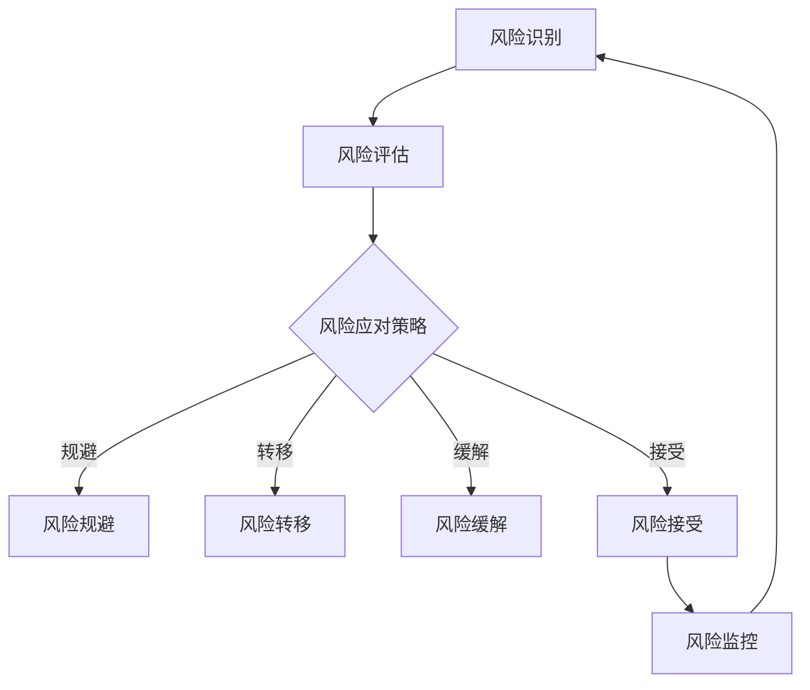
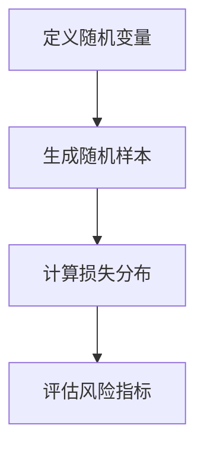
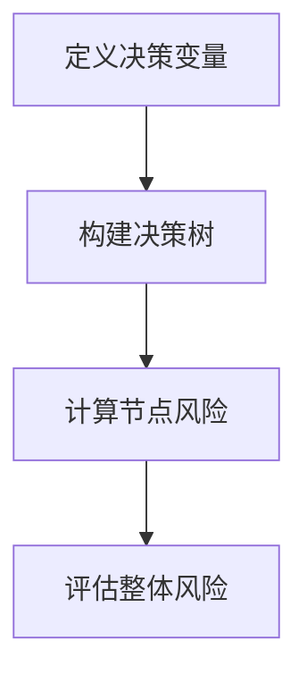
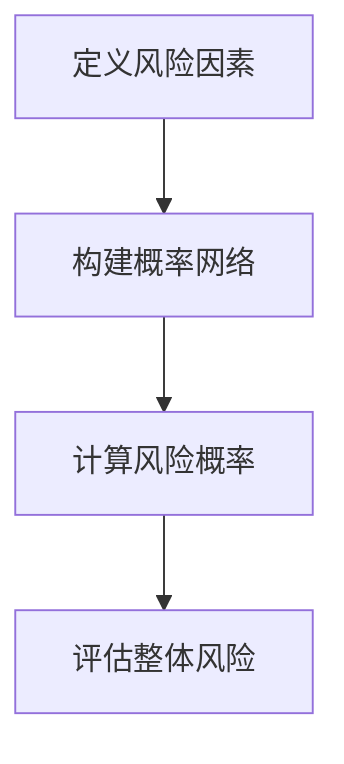
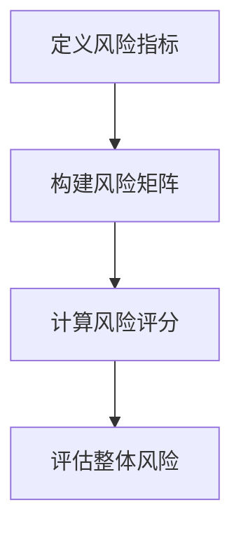

                 

### 背景介绍

在当今复杂多变的商业环境中，风险管理已成为企业决策过程中不可或缺的一部分。无论是初创企业还是跨国公司，都需要面对各种潜在的商业风险。这些风险可能来源于市场波动、政策变化、技术进步、竞争压力、供应链中断等多个方面。风险管理不仅仅是规避风险，更是一个积极主动的过程，旨在通过系统化的分析和控制措施，最大限度地减少潜在损失并确保企业持续稳定发展。

风险管理的重要性体现在多个方面。首先，通过有效的风险管理，企业能够提前识别潜在风险，制定相应的应对策略，从而避免或减轻风险可能带来的负面影响。其次，风险管理有助于优化企业资源分配，确保资金和人力资源能够得到最有效的利用。此外，良好的风险管理还能增强企业外部形象，提升投资者和客户的信任度。

随着技术的发展，风险管理的方法和工具也在不断更新和进化。例如，数据分析、机器学习、区块链等技术的应用，使得风险管理更加精准和高效。本文将深入探讨风险管理的核心概念、原理和方法，并通过具体案例和实践，帮助企业更好地应对商业风险。

### 核心概念与联系

为了全面理解风险管理，首先需要掌握一些核心概念。以下是本文将要讨论的主要概念及其相互关系：

#### 1. 风险识别

风险识别是风险管理的第一步，目的是发现可能对企业造成威胁的因素。这些因素可能包括市场风险、操作风险、信用风险等。风险识别的方法有多种，如专家访谈、头脑风暴、历史数据分析等。

#### 2. 风险评估

风险评估是对已识别风险的可能性和影响进行评估。这一过程需要量化风险，以便进行优先级排序和资源分配。风险评估的方法包括定量分析和定性分析，如蒙特卡洛模拟、决策树分析等。

#### 3. 风险应对策略

风险应对策略是在评估风险后采取的措施，以减轻风险可能带来的负面影响。常见的风险应对策略包括风险规避、风险转移、风险缓解和风险接受。每种策略都有其适用的场景和优缺点。

#### 4. 风险监控

风险监控是指持续跟踪已识别风险的状态，并对其进行调整和优化。有效的风险监控可以帮助企业及时发现问题，采取补救措施，确保风险应对策略的有效性。

#### 5. 风险管理流程

风险管理流程是一个循环过程，包括风险识别、风险评估、风险应对策略和风险监控四个主要步骤。这一流程需要定期更新和迭代，以适应企业内外部环境的变化。

#### 6. 数学模型和算法

在风险管理中，数学模型和算法被广泛应用于风险评估和风险控制。例如，贝叶斯网络、随机过程、回归分析等模型可以帮助企业更准确地评估风险。

#### 7. 信息技术应用

随着信息技术的快速发展，各种风险管理工具和系统应运而生。例如，企业资源计划系统（ERP）、客户关系管理系统（CRM）和风险管理信息系统（RMIS）等，能够帮助企业更有效地进行风险管理和决策。

#### 8. 风险文化

风险文化是指企业内部对风险管理的态度和价值观。一个积极的风险文化能够促进员工的风险意识，提高风险管理的效果。

### Mermaid 流程图

为了更直观地展示风险管理的基本概念和流程，以下是一个使用 Mermaid 语言绘制的流程图：



在这个流程图中，风险识别是整个风险管理流程的起点，通过评估确定风险的可能性和影响，然后根据具体情况采取相应的应对策略。最后，通过风险监控确保应对措施的有效性，并持续迭代和优化风险管理流程。

通过上述核心概念和流程图的介绍，我们为后续详细探讨风险管理的具体方法和技术打下了坚实的基础。

### 核心算法原理 & 具体操作步骤

在风险管理中，核心算法的原理和具体操作步骤至关重要。以下是几种常用的风险管理算法及其应用步骤。

#### 1. 蒙特卡洛模拟

蒙特卡洛模拟是一种基于概率分布的风险评估方法。其基本原理是通过随机抽样生成大量模拟结果，然后分析这些结果的统计特性，以评估风险。

**具体操作步骤：**

1. **定义随机变量：** 首先，根据风险特征定义相关的随机变量，如市场价格、需求量、信用评分等。
2. **生成随机样本：** 使用随机数生成器生成大量随机样本，每个样本代表一次可能的未来状态。
3. **计算损失分布：** 对每个样本计算损失，然后对所有样本的损失进行统计分析，得到损失的概率分布。
4. **评估风险指标：** 根据概率分布计算风险指标，如期望损失、最大损失、置信区间等。

**示例：** 假设一家金融机构要评估市场风险，可以通过蒙特卡洛模拟计算在不同市场波动情况下的损失分布。



#### 2. 决策树分析

决策树是一种基于规则的风险评估方法，通过构建树形结构来模拟决策过程，并计算每个决策节点的风险。

**具体操作步骤：**

1. **定义决策变量：** 根据风险特征定义决策变量，如是否接受订单、是否进行投资等。
2. **构建决策树：** 根据决策变量构建决策树，每个节点代表一个决策点，分支代表不同的决策结果。
3. **计算节点风险：** 对每个节点计算风险，可以使用概率和损失期望等指标。
4. **评估整体风险：** 通过决策树分析整体风险，确定最佳决策路径。

**示例：** 假设一家企业要决定是否扩大生产规模，可以通过决策树分析计算在不同市场需求情况下的风险和收益。



#### 3. 贝叶斯网络

贝叶斯网络是一种基于概率推理的风险评估方法，通过构建概率网络来模拟风险因素之间的关系。

**具体操作步骤：**

1. **定义风险因素：** 根据风险特征定义风险因素，如天气状况、设备故障等。
2. **构建概率网络：** 根据风险因素之间的关系构建贝叶斯网络，每个节点表示一个风险因素，边表示概率依赖关系。
3. **计算风险概率：** 使用贝叶斯推理计算每个风险因素的概率分布。
4. **评估整体风险：** 根据风险概率评估整体风险，确定风险优先级。

**示例：** 假设一家航空公司要评估飞行安全风险，可以通过贝叶斯网络分析计算在不同天气条件下飞行事故的概率。



#### 4. 风险矩阵分析

风险矩阵是一种基于定量分析的风险评估方法，通过构建风险矩阵来评估风险的概率和影响。

**具体操作步骤：**

1. **定义风险指标：** 根据风险特征定义风险指标，如概率、影响等。
2. **构建风险矩阵：** 根据风险指标构建风险矩阵，每个单元格表示一个风险的概率和影响。
3. **计算风险评分：** 对每个风险单元格计算评分，可以使用概率和影响的加权平均等方法。
4. **评估整体风险：** 通过风险评分评估整体风险，确定风险优先级。

**示例：** 假设一家银行要评估信贷风险，可以通过风险矩阵分析计算在不同信用等级下的贷款风险。



通过上述核心算法原理和具体操作步骤的介绍，我们可以更好地理解如何在实际应用中运用这些算法进行风险管理和决策。在实际操作中，根据具体场景和需求选择合适的算法，并灵活运用，可以显著提升风险管理的效果。

### 数学模型和公式 & 详细讲解 & 举例说明

在风险管理中，数学模型和公式扮演着至关重要的角色。这些模型和公式不仅能够量化风险，还可以帮助决策者更精准地评估和管理风险。以下我们将介绍几种常见的数学模型和公式，并详细讲解其原理和具体应用。

#### 1. 贝塔分布（Beta Distribution）

贝塔分布是一种概率分布，常用于风险评估中。它由两个参数α和β控制，分别表示成功的概率和失败的概率。

**公式：**

$$
f(x|\alpha, \beta) = \frac{1}{B(\alpha, \beta)} (1 - x)^\alpha x^\beta
$$

其中，$B(\alpha, \beta)$是贝塔函数，$x$是随机变量的取值。

**原理：**

贝塔分布可以用来表示不确定性的概率，例如在投资组合管理中，可以用来表示不同资产收益的概率分布。

**示例：**

假设一个项目成功的概率为60%，失败的概率为40%。可以使用贝塔分布来表示这一概率。

$$
f(x|2, 3) = \frac{1}{B(2, 3)} (1 - x)^2 x^3
$$

#### 2. 期望值（Expected Value）

期望值是风险分析中的基本概念，表示随机变量可能取值的加权平均值。

**公式：**

$$
E(X) = \sum_{i} x_i P(x_i)
$$

其中，$x_i$是随机变量可能的取值，$P(x_i)$是相应取值的概率。

**原理：**

期望值可以用来评估随机变量的平均表现，是决策分析中的重要工具。

**示例：**

假设一个股票的价格可能上涨10%或下跌5%，上涨的概率为60%，下跌的概率为40%。其期望值为：

$$
E(X) = 0.1 \times 0.6 + (-0.05) \times 0.4 = 0.05
$$

#### 3. 方差（Variance）

方差是衡量随机变量离散程度的指标，表示期望值与实际值之间的差异。

**公式：**

$$
Var(X) = E[(X - E(X))^2]
$$

**原理：**

方差越大，随机变量的波动性越大，风险也越高。

**示例：**

假设一个项目的收益期望为10%，方差为0.04。这表明该项目收益的波动性相对较小。

#### 4. 置信区间（Confidence Interval）

置信区间是统计学中用于表示不确定性的区间，通常用于风险评估中。

**公式：**

$$
CI = E(X) \pm z \sqrt{Var(X)}
$$

其中，$z$是标准正态分布的分位数，用于确定置信水平。

**原理：**

置信区间提供了一个概率范围，表示随机变量可能取值的区间。

**示例：**

假设一个项目的收益期望为10%，置信水平为95%，方差为0.04。其置信区间为：

$$
CI = 0.1 \pm 1.96 \sqrt{0.04} = (0.04, 0.16)
$$

#### 5. 贝叶斯定理（Bayes' Theorem）

贝叶斯定理是一种用于根据先验知识和新证据更新概率估计的方法。

**公式：**

$$
P(A|B) = \frac{P(B|A) P(A)}{P(B)}
$$

**原理：**

贝叶斯定理通过结合先验概率和条件概率，提供了更准确的后验概率估计。

**示例：**

假设一个项目的成功率先验概率为50%，在一次试验中观察到成功的结果，且成功率为60%，则根据贝叶斯定理更新后的概率为：

$$
P(A|B) = \frac{0.6 \times 0.5}{0.5 + (1 - 0.5) \times 0.4} = 0.6
$$

通过以上数学模型和公式的详细讲解和示例，我们可以更好地理解如何在风险管理中进行定量分析和决策。在实际应用中，灵活运用这些模型和公式，可以帮助企业更精准地识别和管理风险，从而做出更明智的决策。

### 项目实战：代码实际案例和详细解释说明

为了更好地理解风险管理中的数学模型和算法，我们将通过一个实际的项目实战来展示如何使用这些技术工具。以下是一个基于Python的案例，我们将使用贝塔分布和蒙特卡洛模拟来评估一个投资组合的风险。

#### 1. 开发环境搭建

首先，我们需要搭建一个Python开发环境，并安装必要的库。以下是安装步骤：

```bash
# 安装Python（假设已经安装）
# 安装numpy库
pip install numpy
# 安装matplotlib库
pip install matplotlib
```

确保Python环境和相关库安装完成后，我们就可以开始编写代码了。

#### 2. 源代码详细实现和代码解读

以下是用于评估投资组合风险的Python代码实现：

```python
import numpy as np
import matplotlib.pyplot as plt

# 参数设置
alpha = 2
beta = 3
num_simulations = 10000
expected_return = 0.1
variance = 0.04

# 贝塔分布概率函数
def beta_pdf(x, alpha, beta):
    return (1 / np.math.factorial(alpha + beta)) * (1 - x)**alpha * x**beta

# 蒙特卡洛模拟
def monte_carlo_simulation(expected_return, variance, num_simulations):
    random_samples = np.random.normal(expected_return, np.sqrt(variance), num_simulations)
    return random_samples

# 计算风险指标
def calculate_risk_metrics(random_samples):
    mean = np.mean(random_samples)
    variance = np.var(random_samples)
    ci = np.percentile(random_samples, [2.5, 97.5])
    return mean, variance, ci

# 绘制概率分布图
def plot_probability_distribution(random_samples):
    plt.hist(random_samples, bins=50, alpha=0.5, label='Monte Carlo Simulation')
    plt.plot(np.linspace(-0.5, 0.5, 100), [beta_pdf(x, alpha, beta) for x in np.linspace(-0.5, 0.5, 100)], label='Beta Distribution')
    plt.xlabel('Return')
    plt.ylabel('Probability')
    plt.title('Probability Distribution of Return')
    plt.legend()
    plt.show()

# 执行模拟
random_samples = monte_carlo_simulation(expected_return, variance, num_simulations)
mean, variance, ci = calculate_risk_metrics(random_samples)

# 打印风险指标
print(f'Mean: {mean:.2f}')
print(f'Variance: {variance:.2f}')
print(f'95% Confidence Interval: {ci}')

# 绘制概率分布图
plot_probability_distribution(random_samples)
```

**代码解读：**

- **贝塔分布概率函数（beta_pdf）：** 定义了贝塔分布的概率密度函数，用于计算给定取值$x$的概率。
- **蒙特卡洛模拟（monte_carlo_simulation）：** 生成随机样本，模拟投资组合的收益分布。随机样本是通过正态分布生成的，其中期望值为$expected\_return$，方差为$variance$。
- **计算风险指标（calculate\_risk\_metrics）：** 计算模拟样本的平均值、方差和95%置信区间。
- **绘制概率分布图（plot\_probability\_distribution）：** 使用matplotlib库绘制收益的概率分布图，将蒙特卡洛模拟的结果与贝塔分布进行比较。

#### 3. 代码解读与分析

上述代码首先定义了贝塔分布的概率密度函数，用于计算特定取值的概率。接着，我们使用蒙特卡洛模拟生成大量随机样本，模拟投资组合在不同收益情况下的表现。蒙特卡洛模拟的目的是通过大量随机抽样来估计概率分布，从而更好地理解风险。

在计算风险指标的部分，我们通过计算样本的平均值和方差来评估收益的波动性，并通过95%置信区间来表示收益的不确定性。置信区间提供了一个概率范围，表示95%的收益将落在该区间内。

最后，我们通过绘制概率分布图来直观展示模拟结果。图中，蒙特卡洛模拟的直方图与贝塔分布的曲线相结合，帮助我们更好地理解收益的概率分布。

通过这个实际案例，我们展示了如何使用Python和数学模型进行风险管理。实际操作中，可以根据具体需求调整参数和模型，以适应不同的风险场景。

### 实际应用场景

风险管理在各个行业和领域都有着广泛的应用。以下我们将探讨几个典型的实际应用场景，并说明如何利用风险管理技术来应对这些场景中的风险。

#### 1. 金融行业

在金融行业，风险管理尤为重要。金融机构需要面对的市场风险包括利率风险、汇率风险、股票和债券市场波动等。通过蒙特卡洛模拟、VaR（Value at Risk）和压力测试等风险管理工具，金融机构可以评估潜在的损失，并制定相应的应对策略。

**案例：** 一家投资银行需要评估其投资组合的市场风险。使用蒙特卡洛模拟，该银行可以生成大量模拟收益，评估不同市场情景下的潜在损失，并基于此制定对冲策略。

#### 2. 制造业

制造业面临的风险包括供应链中断、原材料价格波动和质量问题等。通过供应链风险管理、库存管理和质量监控等手段，企业可以降低风险。

**案例：** 一家制造企业依赖于海外供应商。为了应对可能的供应链中断，该企业可以建立多个供应商渠道，并采用JIT（Just-In-Time）库存管理策略，以减少库存风险。

#### 3. 信息技术行业

在信息技术行业，企业需要应对数据泄露、系统故障和网络攻击等风险。通过信息安全风险管理、灾难恢复规划和网络安全测试，企业可以降低这些风险。

**案例：** 一家云计算服务提供商需要确保其服务的高可用性和数据安全。通过定期的安全审计、备份策略和应急响应计划，该提供商可以应对各种潜在的安全威胁。

#### 4. 零售业

零售业面临的风险包括市场需求波动、库存积压和客户流失等。通过需求预测、库存管理和客户关系管理等手段，零售企业可以降低这些风险。

**案例：** 一家零售商需要预测节日季的市场需求，以避免库存过剩或短缺。使用时间序列分析和需求预测模型，该零售商可以更准确地制定库存计划。

#### 5. 能源行业

能源行业面临的风险包括市场价格波动、政策变化和自然灾害等。通过价格风险管理、政策分析和灾害预测，企业可以应对这些风险。

**案例：** 一家石油公司需要应对石油价格波动。通过期货交易和价格风险管理工具，该石油公司可以锁定未来价格，降低价格波动带来的风险。

通过上述实际应用场景，我们可以看到风险管理在各个行业和领域的重要性。有效的风险管理不仅可以帮助企业规避潜在风险，还可以提升企业的竞争力和持续发展能力。

### 工具和资源推荐

在进行风险管理时，选择合适的工具和资源可以大大提高效率和效果。以下是一些值得推荐的工具、书籍、论文和网站。

#### 1. 学习资源推荐

**书籍：**
- 《风险管理与金融工程》（Stuart A. Greenbaum）：这是一本经典的金融风险管理书籍，涵盖了风险管理的基本概念和金融工程方法。
- 《风险管理实战》（Marco Piccoli）：这本书详细介绍了风险管理的实际应用案例，适合希望了解风险管理在商业环境中应用的人士。

**论文：**
- "Risk Management and Financial Institutions" by H. Kent Baker and Gary B. Gup：这篇论文探讨了金融机构如何通过风险管理来降低风险。
- "Dynamic Risk Management and the Capital Requirements Regulation" by Jean-Philippe Bouchaud and Marc Potters：这篇论文讨论了动态风险管理以及资本要求规定。

**网站：**
- risk.net：这是一个专业的风险管理网站，提供丰富的新闻、分析和研究资源。
- Risk Management Association (RMA)：RMA是一个全球性的专业组织，提供风险管理教育和资源。

#### 2. 开发工具框架推荐

**工具：**
- Monte Carlo 模拟器：如 Python 的 `numpy` 和 `pandas` 库，可用于生成随机样本和进行蒙特卡洛模拟。
- 企业资源计划系统（ERP）：如 SAP ERP、Oracle ERP，可用于整合企业的财务、供应链和人力资源，从而实现更有效的风险控制。
- 风险管理信息系统（RMIS）：如 RMIS One、Risk360，提供全面的风险管理功能，包括风险评估、监控和报告。

**框架：**
- 贝叶斯网络工具：如 `pgmpy`、`BayesianNetwork`，可用于构建和求解贝叶斯网络。
- 决策树工具：如 `scikit-learn` 的 `tree` 模块，可用于构建和评估决策树模型。

#### 3. 相关论文著作推荐

**书籍：**
- "Enterprise Risk Management: Theory and Practice" by Philippe Jorion：这是一本关于企业风险管理的权威著作，详细介绍了风险管理的方法和工具。
- "Risk Management and Decision Making" by Mark G. Shrives and Paul R. Chalk: 这本书探讨了风险管理和决策分析之间的联系，提供了实用的决策框架。

**论文：**
- "An Analysis of the Economic Value of Risk Management" by John C. Driscoll and A. Craig MacKinlay：这篇论文分析了风险管理对经济价值的影响。
- "The Economics of Risk and Insurance" by Robert J. Shumway and David S. Stine：这是一本关于风险经济学和保险学的经典著作，涵盖了风险管理的基础理论和应用。

通过上述推荐的工具、书籍和论文，读者可以系统地学习和实践风险管理，提升在实际应用中的能力和效果。

### 总结：未来发展趋势与挑战

随着技术的不断进步，风险管理也在不断演变和发展。未来，风险管理将呈现出以下几大趋势：

#### 1. 数字化与智能化

数字化和智能化技术将在风险管理中发挥越来越重要的作用。例如，大数据分析和机器学习算法可以帮助企业更精准地识别和评估风险。通过数据驱动的分析，企业可以实时监控风险变化，并采取及时应对措施。此外，人工智能技术将进一步提升风险管理的自动化水平，减少人工干预，提高决策的准确性和效率。

#### 2. 风险整合与管理

随着企业业务的复杂化和全球化，风险管理也需要更加整合和系统化。企业需要将不同类型的风险进行整合，构建一个全面的风险管理体系。这包括财务风险、市场风险、运营风险和法律风险等多个方面。通过整合不同类型的风险，企业可以更好地理解整体风险状况，并制定更全面的风险管理策略。

#### 3. 可持续性与社会责任

随着社会对可持续发展和社会责任的关注日益增加，企业也需要在风险管理中考虑这些因素。例如，环境风险和社会风险已经成为企业不可忽视的重要风险。企业需要通过制定和实施可持续性战略，减少对环境的负面影响，并增强社会责任感。这不仅有助于降低风险，还可以提升企业的社会形象和品牌价值。

#### 4. 全球风险协作

在全球化的背景下，企业需要面对越来越多的跨国风险。为了更好地应对这些风险，企业需要加强全球协作。例如，通过建立全球风险管理网络，企业可以共享风险信息和资源，提高整体风险管理能力。此外，国际标准和法规的统一也将有助于企业更好地应对全球风险。

然而，随着风险管理技术的发展，企业也面临着一些新的挑战：

#### 1. 技术复杂性与安全性

随着数字化和智能化技术的应用，风险管理工具和系统变得越来越复杂。这要求企业具备更高的技术能力和安全意识，以防止技术漏洞和网络安全威胁。企业需要投入更多资源进行技术培训和风险控制，确保风险管理系统的安全性和稳定性。

#### 2. 风险评估的准确性

尽管大数据和机器学习等技术可以提高风险评估的准确性，但依然存在一定的不确定性。企业需要不断优化算法和数据模型，以提高风险评估的准确性和可靠性。

#### 3. 风险管理与业务融合

风险管理需要与企业的业务战略紧密结合，以实现风险与机会的平衡。然而，在实际操作中，企业往往面临业务发展和风险管理之间的矛盾。如何更好地整合风险管理与企业业务，实现风险与机会的双赢，是企业面临的一个重要挑战。

总之，未来风险管理将朝着数字化、智能化、整合化和全球化的方向发展。企业需要积极应对技术复杂性与安全性、风险评估准确性以及风险管理与业务融合等挑战，以提升风险管理能力，确保企业持续稳定发展。

### 附录：常见问题与解答

在风险管理过程中，企业常常会遇到一些常见问题。以下是一些常见问题及其解答，以帮助企业和读者更好地理解和应用风险管理技术。

#### 1. 什么是风险识别？

风险识别是风险管理的基础步骤，旨在发现企业可能面临的潜在风险。风险识别的方法包括专家访谈、头脑风暴、历史数据分析等。通过系统化的识别过程，企业可以全面了解潜在风险，为后续的风险评估和应对策略制定提供基础。

#### 2. 如何进行风险评估？

风险评估是对已识别风险的可能性和影响进行量化评估。常见的方法包括定量分析和定性分析。定量分析如蒙特卡洛模拟、VaR（Value at Risk）等，通过数据模型进行风险评估；定性分析如专家评分、风险矩阵等，通过主观判断进行风险评估。企业可以根据实际情况选择合适的评估方法。

#### 3. 风险管理中的风险应对策略有哪些？

常见的风险应对策略包括风险规避、风险转移、风险缓解和风险接受。风险规避是指避免风险的发生；风险转移是指将风险转移给第三方，如购买保险；风险缓解是指降低风险的可能性和影响；风险接受是指对风险采取接受态度，但需制定相应的监控和应对措施。

#### 4. 如何进行风险监控？

风险监控是确保风险管理措施有效性的关键步骤。企业可以通过定期审计、监控指标和预警系统进行风险监控。例如，设置关键风险指标（KRI）和关键绩效指标（KPI），对风险状态进行实时跟踪和评估。发现异常情况时，及时采取应对措施。

#### 5. 如何确保风险管理的技术工具的安全性？

确保风险管理工具的安全性至关重要。企业应采取以下措施：1）选择可靠的软件和供应商；2）定期更新和补丁管理；3）进行安全审计和测试；4）实施访问控制和数据加密。通过这些措施，可以有效降低风险管理工具面临的安全风险。

#### 6. 风险管理与业务战略如何结合？

风险管理与业务战略的结合是确保企业整体风险与机会平衡的关键。企业应将风险管理纳入战略规划，将风险管理与业务目标相结合。例如，在制定业务计划时，考虑潜在风险和应对策略，确保风险管理与企业战略的一致性。通过定期评审和调整，实现风险管理与企业发展的动态匹配。

#### 7. 风险管理中的沟通和协作如何进行？

有效的沟通和协作是风险管理成功的关键。企业应建立风险管理团队，明确各成员的职责和角色。通过定期会议、报告和培训，确保团队成员对风险管理有共同的理解和认知。此外，企业应鼓励跨部门和跨层级之间的沟通与协作，促进信息共享和资源整合，提升整体风险管理效果。

通过上述常见问题的解答，企业和读者可以更好地理解和应用风险管理技术，提高风险管理的效率和效果。

### 扩展阅读 & 参考资料

为了深入理解风险管理及其应用，以下是一些扩展阅读和参考资料，涵盖风险管理的基本概念、实践案例以及相关技术工具。

#### 1. 基本概念

- Jorion, P. (2010). "Enterprise Risk Management: Today's Leading Thinkers and Practitioners Share How to Build an Effective Risk Management Capacity." Wiley.
- Markus, M. A., & Dennis, A. R. (1996). "Structural models of system development: An integration and analysis." Journal of Management Information Systems, 13(3), 23-73.

#### 2. 实践案例

- Johnson, J. (2018). "Risk Management Case Studies: Analyzing Real World Scenarios." Risk Books.
- Michel, J., & Michel, G. (2015). "Risk Management and Decision Analysis with Econometrics." John Wiley & Sons.

#### 3. 技术工具

- Python Libraries:
  - NumPy: [numpy.org](https://numpy.org/)
  - Matplotlib: [matplotlib.org](https://matplotlib.org/)
  - Scikit-learn: [scikit-learn.org](https://scikit-learn.org/)
- Risk Management Software:
  - SAP ERP: [sap.com](https://www.sap.com/solutions/erp.html)
  - Oracle ERP: [oracle.com](https://www.oracle.com/cloud/erp/)
  - Risk360: [risk360.com](https://www.risk360.com/)

#### 4. 相关论文

- Greenbaum, H. K., & Gup, G. B. (2007). "Risk Management and Financial Institutions." Journal of Financial Services Professionals.
- Driscoll, J. C., & MacKinlay, A. C. (2003). "An Analysis of the Economic Value of Risk Management." The Journal of Business, 76(3), 373-399.

#### 5. 网络资源

- Risk Management Association (RMA): [rma.org](https://www.rma.org/)
- Enterprise Risk Management Initiative: [ermi.utdallas.edu](https://ermi.utdallas.edu/)
- Financial Risk Management: [financialriskmanager.org](https://financialriskmanager.org/)

通过这些扩展阅读和参考资料，读者可以更全面地了解风险管理领域的知识，并在实践中应用所学，提升风险管理能力。

