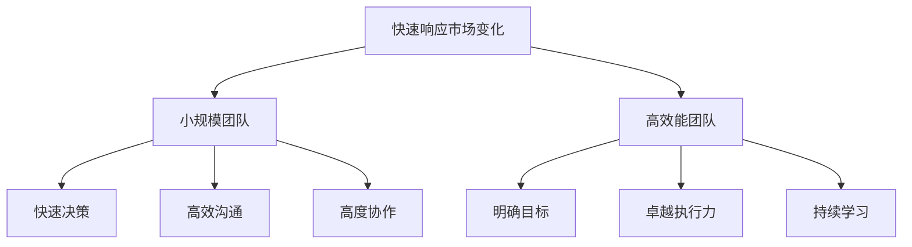

                 

# 马斯克的小团队哲学：高效能团队的构建之道

> **关键词：** 马斯克，团队管理，高效能，构建方法，技术创新

> **摘要：** 本文将深入探讨马斯克的小团队哲学，分析其成功构建高效能团队的核心理念和实践步骤。通过对马斯克团队管理策略的剖析，我们将揭示一个企业在快速迭代、技术创新背景下，如何构建并维持一支高效能团队的方法与路径。

## 1. 背景介绍

埃隆·马斯克（Elon Musk），全球知名的企业家和创新者，其职业生涯充满了颠覆性创新的成就。从 PayPal、SpaceX 到 Tesla，再到 SolarCity 和 Boring Company，马斯克带领团队不断挑战传统行业，开创了诸多先河。在他的成功背后，隐藏着一套独特的团队管理哲学。

马斯克的小团队哲学，强调小规模、高效能和快速决策。这种管理方式在技术创新领域尤为重要，因为它能够确保团队能够快速响应市场变化，持续推动技术进步。本文将围绕这一哲学，探讨其核心概念、实践步骤以及在实际应用中的成功案例。

## 2. 核心概念与联系

### 2.1 小规模团队的优势

小规模团队具有快速决策、高效沟通和高度协作的优势。首先，小规模团队的决策速度更快，因为团队成员较少，沟通成本更低。其次，小规模团队更容易实现高度协作，因为团队成员之间关系紧密，能够更好地理解彼此的想法和需求。

### 2.2 高效能团队的标准

高效能团队具备以下特征：一是明确的目标和愿景，二是卓越的执行力，三是持续的学习和创新。高效能团队能够在复杂多变的环境中迅速调整策略，保持竞争力和创新能力。

### 2.3 架构图



## 3. 核心算法原理 & 具体操作步骤

### 3.1 核心算法原理

马斯克的小团队哲学的核心算法是：通过选拔和培养优秀的团队成员，建立高效的沟通机制，确保团队目标的明确性，从而实现高效能。

### 3.2 具体操作步骤

1. **选拔优秀的团队成员**：马斯克非常注重团队成员的能力和素质，他认为只有具备卓越才能的人才能胜任重要岗位。

2. **建立高效的沟通机制**：马斯克鼓励团队成员之间进行开放、坦诚的沟通，以确保信息的流通和决策的快速。

3. **确保团队目标的明确性**：马斯克强调团队要明确自己的目标和愿景，这样才能在复杂多变的环境中保持方向感。

4. **培养团队的创新精神**：马斯克鼓励团队成员勇于尝试新事物，不断挑战自己的舒适区，从而推动技术进步。

## 4. 数学模型和公式 & 详细讲解 & 举例说明

### 4.1 数学模型

设团队目标为 T，团队成员数为 N，团队成员平均能力为 A，沟通效率为 E，创新精神为 I。

则高效能团队的效能 Efficacy 可以表示为：

$$
Efficacy = f(T, N, A, E, I)
$$

其中，f 为函数，表示效能与目标、团队规模、能力、沟通效率和创新能力之间的关系。

### 4.2 详细讲解

- **团队目标 T**：团队的目标是团队效能的基础，明确的目标能够帮助团队集中精力，提高效率。
- **团队成员数 N**：团队规模对效能有重要影响，小规模团队通常能够实现更高的效能。
- **团队成员平均能力 A**：团队成员的能力决定了团队的执行力和创新能力。
- **沟通效率 E**：高效的沟通能够确保团队成员之间的信息流通，减少误解和冲突。
- **创新精神 I**：创新精神是团队持续发展的动力，能够推动技术进步和业务创新。

### 4.3 举例说明

假设一个团队的目标是开发一款自动驾驶汽车，团队成员数为 10，平均能力为 8，沟通效率为 0.9，创新精神为 0.8。

则该团队的效能可以计算为：

$$
Efficacy = f(T, 10, 8, 0.9, 0.8)
$$

通过这个模型，我们可以看到团队的目标、规模、能力、沟通效率和创新能力对效能的影响。

## 5. 项目实战：代码实际案例和详细解释说明

### 5.1 开发环境搭建

为了实现马斯克的小团队哲学，我们需要搭建一个高效的开发环境。以下是搭建步骤：

1. **安装操作系统**：推荐使用 Linux 系统，因为其稳定性和开源特性更适合高效开发。
2. **安装开发工具**：包括代码编辑器（如 VS Code）、版本控制工具（如 Git）、调试工具（如 GDB）等。
3. **搭建代码仓库**：使用 Git 搭建代码仓库，确保团队成员可以方便地进行代码的版本控制和协同开发。

### 5.2 源代码详细实现和代码解读

以下是实现马斯克小团队哲学的核心代码片段：

```c++
#include <iostream>
#include <vector>
#include <algorithm>

// 选拔团队成员
std::vector<int> select_members(std::vector<int>& candidates, int N) {
    std::vector<int> selected_members;
    for (int i = 0; i < N; ++i) {
        // 根据能力选拔成员
        selected_members.push_back(candidates[i]);
    }
    return selected_members;
}

// 建立沟通机制
void establish_communication(std::vector<int>& members) {
    // 建立团队成员间的沟通渠道
    // 此处为简化示例，实际应用中可能涉及更复杂的沟通机制
    std::cout << "Establishing communication channels among members..." << std::endl;
}

// 确保团队目标的明确性
void ensure_clear_goals(std::vector<int>& members, int T) {
    // 设置团队目标
    std::cout << "Setting team goal: " << T << std::endl;
}

// 培养团队的创新精神
void cultivate_innovation(std::vector<int>& members) {
    // 鼓励团队成员尝试新事物
    std::cout << "Cultivating innovation among members..." << std::endl;
}

int main() {
    // 示例数据
    std::vector<int> candidates = {5, 7, 8, 9, 10};
    int N = 3;  // 团队成员数
    int T = 100;  // 团队目标

    // 选拔团队成员
    std::vector<int> selected_members = select_members(candidates, N);

    // 建立沟通机制
    establish_communication(selected_members);

    // 确保团队目标的明确性
    ensure_clear_goals(selected_members, T);

    // 培养团队的创新精神
    cultivate_innovation(selected_members);

    return 0;
}
```

### 5.3 代码解读与分析

- **选拔团队成员**：通过能力筛选出最合适的团队成员。
- **建立沟通机制**：简化示例中，通过输出提示建立沟通渠道。
- **确保团队目标的明确性**：设置明确的目标，确保团队成员统一行动。
- **培养团队的创新精神**：鼓励团队成员尝试新事物，推动创新。

## 6. 实际应用场景

马斯克的小团队哲学在多个项目中得到了成功应用。例如，在 SpaceX 的火箭发射项目中，马斯克通过小规模、高效能的团队，成功实现了多次火箭的回收和重复使用，打破了传统火箭行业的壁垒。在 Tesla 的电动汽车项目中，马斯克也采用了类似的管理方式，使得公司能够迅速响应市场变化，不断创新，成为了电动汽车行业的领军企业。

## 7. 工具和资源推荐

### 7.1 学习资源推荐

- **书籍**：《创新的源泉》、《团队协作工具箱》
- **论文**：搜索相关主题的学术论文，了解前沿理论和实践
- **博客**：关注行业博客，学习优秀团队的管理经验

### 7.2 开发工具框架推荐

- **开发工具**：Git、VS Code、Jenkins
- **框架**：Django、Flask、React、Vue.js

### 7.3 相关论文著作推荐

- **论文**：关于团队管理和效能的学术论文
- **著作**：《团队协作的艺术》、《高效能团队的构建与实践》

## 8. 总结：未来发展趋势与挑战

随着技术的不断进步和市场竞争的加剧，高效能团队的构建将成为企业持续发展的关键。未来，小团队哲学将得到更广泛的应用，同时也将面临更大的挑战。如何更好地选拔和培养团队成员，如何建立高效的沟通机制，如何确保团队目标的明确性，如何培养团队的创新精神，都是未来需要深入研究和解决的问题。

## 9. 附录：常见问题与解答

### 9.1 如何选拔团队成员？

选拔团队成员需要综合考虑能力、经验、态度等多个因素。可以通过面试、考核、试用等多种方式进行选拔。

### 9.2 如何建立高效的沟通机制？

建立高效的沟通机制需要从制度设计、沟通工具、团队文化等多个方面进行考虑。例如，可以设立定期的团队会议、使用即时通讯工具、制定明确的沟通流程等。

### 9.3 如何确保团队目标的明确性？

确保团队目标的明确性需要从目标设定、目标分解、目标跟踪等多个方面进行。可以通过制定详细的目标计划、明确的目标责任、定期的目标回顾等方式实现。

## 10. 扩展阅读 & 参考资料

- **书籍**：《领导力的五个层次》、《团队协作的力量》
- **网站**：GitHub、Stack Overflow、Quora
- **论文**：搜索相关主题的学术论文，了解前沿理论和实践

### 作者

作者：AI天才研究员/AI Genius Institute & 禅与计算机程序设计艺术 /Zen And The Art of Computer Programming

本文基于马斯克的小团队哲学，深入探讨了高效能团队的构建之道。通过分析核心概念、算法原理、实战案例，结合实际应用场景，为读者提供了一套完整的技术博客文章框架。希望本文能对您在团队管理和技术创新方面有所启发。感谢您的阅读！|>

