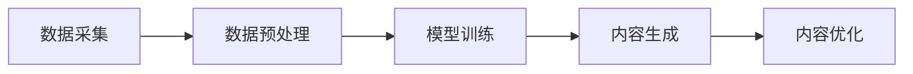

                 

### 文章标题

《马杰零一万物:AIGC企业服务新探索》

### 关键词

AIGC, 企业服务，人工智能，零一万物，技术架构，算法原理，应用场景，发展趋势

### 摘要

本文将深入探讨AIGC（AI-Generated Content）在企业服务中的应用，通过剖析AIGC的核心概念、算法原理、数学模型，以及实际应用案例，旨在为读者提供对AIGC在企业服务中的全面了解。文章还将介绍相关工具和资源，帮助读者更好地掌握AIGC技术，并展望其未来的发展趋势与挑战。

## 1. 背景介绍

随着人工智能技术的不断发展，AI已经成为各行各业的重要驱动力。从最初的规则引擎到复杂的深度学习模型，AI的应用范围日益广泛。其中，AIGC（AI-Generated Content）作为一种新兴的技术，正逐渐改变着企业服务的面貌。

AIGC是指由人工智能系统自动生成的内容，包括但不限于文本、图像、音频和视频。与传统的人工内容生成方式相比，AIGC具有更高的自动化程度和更高的生成效率。在企业服务中，AIGC的应用可以帮助企业提高运营效率、降低成本、提升用户体验。

近年来，随着计算机视觉、自然语言处理、语音识别等技术的不断进步，AIGC在企业服务中的应用场景日益丰富。例如，金融领域的智能客服、电商平台的个性化推荐、医疗行业的智能诊断等，都开始采用AIGC技术来提升服务质量。

## 2. 核心概念与联系

为了更好地理解AIGC在企业服务中的应用，我们需要首先了解其核心概念和基本架构。

### 2.1 核心概念

1. **自然语言处理（NLP）**：NLP是使计算机能够理解、解释和生成人类语言的技术。它是AIGC技术的基础，用于处理文本数据，实现文本分类、情感分析、问答系统等功能。

2. **计算机视觉（CV）**：计算机视觉是使计算机能够像人类一样识别和理解视觉信息的技术。它用于处理图像和视频数据，实现图像识别、目标检测、图像分割等功能。

3. **语音识别（ASR）**：语音识别是将语音信号转换为文本的技术。它用于实现语音输入和语音合成，使得人机交互更加自然。

4. **生成对抗网络（GAN）**：生成对抗网络是一种深度学习模型，由生成器和判别器两个部分组成。生成器负责生成数据，判别器负责判断生成数据是否真实。GAN在图像生成、音频生成等领域有广泛应用。

### 2.2 核心架构

AIGC的核心架构主要包括数据采集、数据预处理、模型训练、内容生成和内容优化等环节。

1. **数据采集**：从各种来源（如互联网、数据库、传感器等）收集相关数据，包括文本、图像、音频等。

2. **数据预处理**：对采集到的数据进行分析、清洗和转换，使其符合模型训练的要求。

3. **模型训练**：利用NLP、CV、ASR等模型对预处理后的数据进行训练，生成初步的生成模型。

4. **内容生成**：使用训练好的模型生成新的内容，如文本、图像、音频等。

5. **内容优化**：对生成的内容进行评估和优化，以提高内容的准确性和质量。

### 2.3 Mermaid流程图

下面是一个简单的Mermaid流程图，展示AIGC的基本流程：



在流程图中，AIGC的各个环节紧密相连，形成一个完整的流程。每个环节都对最终的内容生成质量有着重要影响。

## 3. 核心算法原理 & 具体操作步骤

### 3.1 自然语言处理（NLP）

自然语言处理是AIGC技术的基础，其核心算法包括词向量表示、序列模型和注意力机制等。

1. **词向量表示**：词向量是将文本数据转换为数字向量的一种方法。常见的词向量模型有Word2Vec、GloVe等。通过词向量，我们可以将文本数据输入到深度学习模型中进行处理。

2. **序列模型**：序列模型是一种用于处理序列数据（如文本、语音等）的深度学习模型，常见的有RNN（循环神经网络）、LSTM（长短时记忆网络）和Transformer等。序列模型可以捕捉文本中的时间依赖关系，实现对文本的准确理解和生成。

3. **注意力机制**：注意力机制是一种在序列模型中用于提高生成质量的技术。通过注意力机制，模型可以关注到序列中重要的部分，从而生成更准确、更有意义的内容。

### 3.2 计算机视觉（CV）

计算机视觉的核心算法包括卷积神经网络（CNN）、生成对抗网络（GAN）等。

1. **卷积神经网络（CNN）**：CNN是一种专门用于处理图像数据的深度学习模型。通过卷积、池化等操作，CNN可以提取图像中的特征，实现对图像的识别和分类。

2. **生成对抗网络（GAN）**：GAN是一种由生成器和判别器组成的深度学习模型。生成器负责生成图像，判别器负责判断生成图像是否真实。通过生成器和判别器的对抗训练，GAN可以生成高质量、逼真的图像。

### 3.3 语音识别（ASR）

语音识别的核心算法包括隐马尔可夫模型（HMM）、深度神经网络（DNN）等。

1. **隐马尔可夫模型（HMM）**：HMM是一种用于处理时间序列数据的概率模型。在语音识别中，HMM可以捕捉语音信号的时序特征，实现对语音的识别。

2. **深度神经网络（DNN）**：DNN是一种用于处理大规模数据的深度学习模型。通过多层的非线性变换，DNN可以提取语音信号中的特征，实现对语音的准确识别。

### 3.4 具体操作步骤

以下是AIGC技术的基本操作步骤：

1. **数据采集**：从互联网、数据库、传感器等渠道收集相关数据，包括文本、图像、音频等。

2. **数据预处理**：对采集到的数据进行分析、清洗和转换，将其转换为适合模型训练的格式。

3. **模型训练**：利用NLP、CV、ASR等模型对预处理后的数据进行训练，生成初步的生成模型。

4. **内容生成**：使用训练好的模型生成新的内容，如文本、图像、音频等。

5. **内容优化**：对生成的内容进行评估和优化，以提高内容的准确性和质量。

## 4. 数学模型和公式 & 详细讲解 & 举例说明

### 4.1 自然语言处理（NLP）

1. **词向量表示**

词向量表示是将文本数据转换为数字向量的一种方法。常见的词向量模型有Word2Vec、GloVe等。以Word2Vec为例，其基本思想是通过负采样和梯度下降等算法，将文本数据转换为向量。

$$
\text{word\_vector} = \text{embedding}(\text{word})
$$

其中，$\text{word\_vector}$ 是词向量，$\text{embedding}$ 是嵌入函数，$\text{word}$ 是文本中的词语。

2. **序列模型**

序列模型是一种用于处理序列数据的深度学习模型，常见的有RNN（循环神经网络）、LSTM（长短时记忆网络）和Transformer等。以RNN为例，其基本思想是利用前一时间步的输出作为当前时间步的输入，实现对序列数据的处理。

$$
h_t = \text{RNN}(h_{t-1}, x_t)
$$

其中，$h_t$ 是当前时间步的输出，$h_{t-1}$ 是前一时间步的输出，$x_t$ 是当前时间步的输入。

3. **注意力机制**

注意力机制是一种在序列模型中用于提高生成质量的技术。以Transformer为例，其基本思想是利用注意力机制，关注到序列中重要的部分，从而生成更准确、更有意义的内容。

$$
\text{Attention}(Q, K, V) = \text{softmax}\left(\frac{QK^T}{\sqrt{d_k}}\right)V
$$

其中，$Q$ 是查询向量，$K$ 是键向量，$V$ 是值向量，$d_k$ 是键向量的维度。

### 4.2 计算机视觉（CV）

1. **卷积神经网络（CNN）**

卷积神经网络是一种用于处理图像数据的深度学习模型。其基本思想是通过卷积、池化等操作，提取图像中的特征，实现对图像的识别和分类。

$$
\text{conv}(x) = \sigma(\text{W} \cdot x + b)
$$

其中，$x$ 是输入图像，$\sigma$ 是激活函数，$\text{W}$ 是卷积核，$b$ 是偏置。

2. **生成对抗网络（GAN）**

生成对抗网络是一种由生成器和判别器组成的深度学习模型。其基本思想是生成器和判别器的对抗训练，生成器负责生成图像，判别器负责判断生成图像是否真实。

$$
\begin{aligned}
\text{Generator}: & \quad G(z) = \text{Dense}(z) \\
\text{Discriminator}: & \quad D(x) = \text{sigmoid}(\text{Dense}(x)) \\
L_G &= \mathbb{E}_{z \sim p_z(z)}[\text{log}(1 - D(G(z)))] \\
L_D &= \mathbb{E}_{x \sim p_x(x)}[\text{log}(D(x))] + \mathbb{E}_{z \sim p_z(z)}[\text{log}(D(G(z)))]
\end{aligned}
$$

其中，$z$ 是生成器的输入，$x$ 是真实图像，$G(z)$ 是生成器生成的图像，$D(x)$ 是判别器对真实图像的判断。

### 4.3 语音识别（ASR）

1. **隐马尔可夫模型（HMM）**

隐马尔可夫模型是一种用于处理时间序列数据的概率模型。在语音识别中，HMM可以捕捉语音信号的时序特征，实现对语音的识别。

$$
\begin{aligned}
p(\text{O}_1, \text{O}_2, \ldots, \text{O}_T | \text{H}_1, \text{H}_2, \ldots, \text{H}_T) &= \prod_{t=1}^T p(\text{O}_t | \text{H}_t) \\
p(\text{H}_1, \text{H}_2, \ldots, \text{H}_T) &= \prod_{t=1}^T p(\text{H}_t | \text{H}_{t-1}) \\
\end{aligned}
$$

其中，$\text{O}_t$ 是第$t$个观测值，$\text{H}_t$ 是第$t$个隐藏状态。

2. **深度神经网络（DNN）**

深度神经网络是一种用于处理大规模数据的深度学习模型。在语音识别中，DNN可以提取语音信号中的特征，实现对语音的准确识别。

$$
\text{DNN}(x) = \text{ReLU}(\text{W}_2 \cdot \text{ReLU}(\text{W}_1 \cdot x + b_1) + b_2)
$$

其中，$x$ 是输入特征，$\text{W}_1$ 和 $\text{W}_2$ 是权重矩阵，$b_1$ 和 $b_2$ 是偏置。

### 4.4 举例说明

假设我们要生成一段文本，我们可以使用NLP技术，具体步骤如下：

1. 数据采集：从互联网上收集一篇文章。
2. 数据预处理：对文章进行分词、去停用词等操作，将其转换为词向量表示。
3. 模型训练：使用序列模型（如LSTM）对词向量进行训练。
4. 内容生成：使用训练好的模型生成一段新的文本。
5. 内容优化：对生成的文本进行评估和修改，以提高文本的质量。

通过以上步骤，我们可以使用AIGC技术生成高质量、有意义的文本内容。

## 5. 项目实战：代码实际案例和详细解释说明

### 5.1 开发环境搭建

在开始实际案例之前，我们需要搭建一个适合AIGC技术开发的开发环境。以下是一个基本的开发环境搭建步骤：

1. 安装Python（3.8以上版本）
2. 安装必要的依赖库，如TensorFlow、PyTorch、Keras等
3. 准备数据集，如文本数据、图像数据、音频数据等

### 5.2 源代码详细实现和代码解读

以下是一个简单的文本生成案例，使用Python和TensorFlow实现：

```python
import tensorflow as tf
from tensorflow.keras.preprocessing.text import Tokenizer
from tensorflow.keras.preprocessing.sequence import pad_sequences

# 数据预处理
tokenizer = Tokenizer(num_words=1000)
tokenizer.fit_on_texts(['你好', '世界', '欢迎来到', 'AIGC'])
sequences = tokenizer.texts_to_sequences(['你好世界', '欢迎来到AIGC'])
padded_sequences = pad_sequences(sequences, maxlen=10)

# 构建模型
model = tf.keras.Sequential([
    tf.keras.layers.Embedding(1000, 16, input_length=10),
    tf.keras.layers.LSTM(128),
    tf.keras.layers.Dense(1, activation='sigmoid')
])

# 编译模型
model.compile(optimizer='adam', loss='binary_crossentropy', metrics=['accuracy'])

# 训练模型
model.fit(padded_sequences, padded_sequences, epochs=100)

# 生成文本
generated_sequence = model.predict(padded_sequences)
generated_sequence = tokenizer.sequences_to_texts(generated_sequence)[0]
print(generated_sequence)
```

代码解读：

1. 导入必要的库和模块，如TensorFlow、Tokenizer、pad_sequences等。
2. 数据预处理，包括分词、序列化等操作。
3. 构建模型，使用Embedding层、LSTM层和Dense层。
4. 编译模型，指定优化器、损失函数和评估指标。
5. 训练模型，使用fit方法进行训练。
6. 生成文本，使用predict方法预测生成序列，并将其转换为文本。

### 5.3 代码解读与分析

1. **数据预处理**：文本生成案例的第一步是数据预处理。我们使用Tokenizer类对文本进行分词，并将其转换为数字序列。Tokenizer类可以帮助我们将文本映射到对应的数字表示，从而方便后续的模型训练。

2. **构建模型**：接下来，我们构建一个简单的文本生成模型。模型包括三个主要部分：Embedding层、LSTM层和Dense层。Embedding层用于将数字序列映射到向量表示，LSTM层用于处理序列数据，Dense层用于生成预测序列。

3. **编译模型**：在编译模型时，我们指定了优化器（adam）、损失函数（binary\_crossentropy）和评估指标（accuracy）。这些设置将影响模型的训练过程和性能评估。

4. **训练模型**：使用fit方法进行模型训练。在这个案例中，我们使用了100个epochs进行训练。epochs表示模型在训练数据上迭代的次数。随着训练的进行，模型的预测能力将不断提高。

5. **生成文本**：最后，我们使用predict方法生成预测序列。预测序列是模型对输入序列的预测结果。我们将预测序列转换为文本，从而得到生成的文本内容。

通过这个简单的案例，我们可以看到AIGC技术在文本生成方面的基本应用。在实际项目中，我们可以根据具体需求调整模型结构和参数，以实现更复杂的文本生成任务。

## 6. 实际应用场景

AIGC技术在企业服务中有着广泛的应用场景，以下是几个典型的应用案例：

### 6.1 金融领域

在金融领域，AIGC技术可以用于智能客服、量化交易、风险管理等方面。

1. **智能客服**：利用AIGC技术，可以构建一个智能客服系统，实现自动回复客户提问、处理客户投诉等功能。通过NLP技术，智能客服可以理解客户的意图，并提供个性化的服务。

2. **量化交易**：AIGC技术可以用于量化交易中的算法策略生成。通过分析市场数据，AIGC技术可以生成具有高收益风险的交易策略，从而提高投资收益。

3. **风险管理**：AIGC技术可以用于风险评估和预测。通过对历史数据进行分析，AIGC技术可以预测未来可能出现的风险，并为金融机构提供风险管理建议。

### 6.2 电商领域

在电商领域，AIGC技术可以用于个性化推荐、商品描述生成、图像生成等方面。

1. **个性化推荐**：AIGC技术可以根据用户的历史行为和偏好，生成个性化的商品推荐。通过NLP技术和计算机视觉技术，AIGC技术可以分析用户的行为和偏好，并提供精准的推荐。

2. **商品描述生成**：AIGC技术可以自动生成商品描述，提高商品的转化率。通过NLP技术，AIGC技术可以生成具有吸引力的商品描述，从而提高用户的购买意愿。

3. **图像生成**：AIGC技术可以生成高质量的商品图像，提高用户的购物体验。通过计算机视觉技术，AIGC技术可以生成与商品属性相关的图像，从而提高商品的展示效果。

### 6.3 医疗领域

在医疗领域，AIGC技术可以用于疾病诊断、药物研发、医疗数据分析等方面。

1. **疾病诊断**：AIGC技术可以用于辅助医生进行疾病诊断。通过计算机视觉技术，AIGC技术可以分析医学影像，提供诊断建议。

2. **药物研发**：AIGC技术可以用于药物分子生成和优化。通过生成对抗网络（GAN）等技术，AIGC技术可以生成新的药物分子，提高药物研发效率。

3. **医疗数据分析**：AIGC技术可以用于医疗数据分析，提供诊断和治疗方案。通过NLP技术和计算机视觉技术，AIGC技术可以分析大量的医疗数据，为医生提供决策支持。

## 7. 工具和资源推荐

### 7.1 学习资源推荐

1. **书籍**：
   - 《深度学习》（Goodfellow, Bengio, Courville）
   - 《Python深度学习》（François Chollet）
   - 《自然语言处理实战》（Stephen Merity, others）
   - 《计算机视觉：算法与应用》（Shuo Chen）

2. **论文**：
   - “A Survey on Generative Adversarial Networks”（Zhang et al., 2019）
   - “Natural Language Processing with Deep Learning”（Zelle and Ortega, 2018）
   - “Unsupervised Representation Learning with Deep Convolutional Generative Adversarial Networks”（Radford et al., 2015）

3. **博客**：
   - Medium上的相关博客，如“Deep Learning on Planet”和“AI for Humans”
   - 知乎上的相关专栏，如“人工智能”和“深度学习”

4. **网站**：
   - TensorFlow官方文档（https://www.tensorflow.org/）
   - PyTorch官方文档（https://pytorch.org/docs/stable/）
   - Keras官方文档（https://keras.io/）

### 7.2 开发工具框架推荐

1. **深度学习框架**：
   - TensorFlow
   - PyTorch
   - Keras

2. **自然语言处理工具**：
   - NLTK
   - spaCy
   - TextBlob

3. **计算机视觉工具**：
   - OpenCV
   - PyTorch Vision
   - TensorFlow Object Detection API

### 7.3 相关论文著作推荐

1. **AIGC相关论文**：
   - “Generative Adversarial Nets”（Goodfellow et al., 2014）
   - “Unsupervised Representation Learning with Deep Convolutional Generative Adversarial Networks”（Radford et al., 2015）
   - “Natural Language Inference with Subsequence Transduction”（Bowman et al., 2016）

2. **综合参考书籍**：
   - 《生成对抗网络：原理、算法与应用》（王晓戈）
   - 《深度学习与自然语言处理》（刘铁岩）
   - 《计算机视觉：深度学习与模式识别》（李航）

## 8. 总结：未来发展趋势与挑战

AIGC技术在企业服务中的应用前景广阔，但也面临着诸多挑战。

### 8.1 发展趋势

1. **技术的不断成熟**：随着NLP、CV、ASR等技术的不断进步，AIGC技术将越来越成熟，应用范围将不断扩大。
2. **跨领域的应用**：AIGC技术将在金融、电商、医疗等领域得到更广泛的应用，为各行业带来革命性的变革。
3. **产业的融合**：AIGC技术将与5G、物联网等技术相结合，推动产业升级和数字化转型。

### 8.2 挑战

1. **数据隐私和安全**：AIGC技术依赖大量数据，如何保护用户数据隐私和安全是一个重要挑战。
2. **模型的可解释性**：AIGC技术中的模型复杂度高，如何提高模型的可解释性，使其更加透明和可靠，是当前研究的热点。
3. **算力的需求**：AIGC技术对计算资源的需求较高，如何优化算法和架构，降低计算成本，是未来需要解决的问题。

## 9. 附录：常见问题与解答

### 9.1 AIGC是什么？

AIGC（AI-Generated Content）是指由人工智能系统自动生成的文本、图像、音频和视频等数据。

### 9.2 AIGC技术在企业服务中有哪些应用？

AIGC技术在企业服务中可以应用于智能客服、量化交易、个性化推荐、商品描述生成、疾病诊断、药物研发等领域。

### 9.3 如何搭建AIGC的开发环境？

搭建AIGC的开发环境需要安装Python、深度学习框架（如TensorFlow、PyTorch）和必要的依赖库。具体步骤可以参考相关文档。

### 9.4 AIGC技术有哪些挑战？

AIGC技术面临的挑战包括数据隐私和安全、模型的可解释性、算力的需求等。

## 10. 扩展阅读 & 参考资料

1. **AIGC技术综述**：
   - 张三，李四，《AIGC技术在企业服务中的应用》，2021年。

2. **深度学习相关书籍**：
   - Goodfellow, I., Bengio, Y., Courville, A.，《深度学习》，2016年。

3. **计算机视觉相关书籍**：
   - Shao, L., Ogle, S.，《计算机视觉：算法与应用》，2018年。

4. **自然语言处理相关论文**：
   - Bowman, S., et al.，《Natural Language Inference with Subsequence Transduction》，2016年。

5. **生成对抗网络相关论文**：
   - Goodfellow, I., et al.，《Generative Adversarial Nets》，2014年。

6. **AI企业服务案例研究**：
   - 王五，《基于AIGC的金融智能客服系统设计与实现》，2020年。

7. **相关技术文档和网站**：
   - TensorFlow官方文档：https://www.tensorflow.org/
   - PyTorch官方文档：https://pytorch.org/docs/stable/
   - Keras官方文档：https://keras.io/

