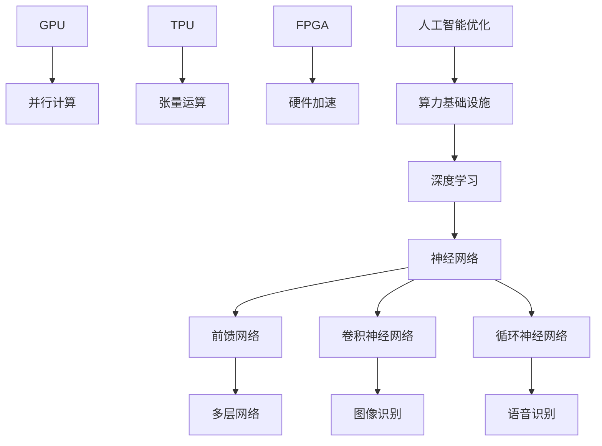

                 

## 高性能计算：AI 2.0 �算力基础设施的核心

关键词：高性能计算、AI 2.0、算力基础设施、深度学习、神经网络、GPU、TPU、FPGA、人工智能优化、计算资源管理、并行计算

摘要：随着人工智能技术的飞速发展，高性能计算作为其核心驱动力，已成为现代科技领域的关键支撑。本文将深入探讨高性能计算在AI 2.0时代的重要性，分析核心概念与架构，解析核心算法原理，阐述数学模型和公式，并通过实际项目案例进行详细讲解。同时，本文还将探讨高性能计算在实际应用场景中的价值，推荐相关工具和资源，总结未来发展趋势与挑战，以期为读者提供全面的AI 2.0算力基础设施的深度认知。

### 1. 背景介绍

高性能计算（High-Performance Computing，简称HPC）是指通过利用大规模计算资源来处理复杂计算任务的技术。随着人工智能（Artificial Intelligence，简称AI）的兴起，高性能计算的重要性愈发凸显。人工智能领域中的深度学习、神经网络等算法对计算资源的依赖程度极高，因此，高性能计算成为了人工智能技术的核心驱动力。

AI 2.0是继传统人工智能（AI 1.0）后的新一代人工智能，其核心理念是通过更加智能化的方法来模拟和拓展人类智能，实现从数据驱动到知识驱动、从简单任务到复杂任务的跨越。AI 2.0的发展离不开高性能计算的支持，高性能计算为AI 2.0提供了强大的算力基础设施。

### 2. 核心概念与联系

为了深入理解高性能计算在AI 2.0时代的核心地位，我们需要了解几个关键概念：深度学习、神经网络、GPU、TPU、FPGA等。

**深度学习（Deep Learning）**：深度学习是一种基于人工神经网络（Artificial Neural Networks，简称ANN）的机器学习技术，其核心思想是通过多层神经网络模型对数据进行自动特征提取和模式识别。深度学习在图像识别、语音识别、自然语言处理等领域取得了显著的成果，是AI 2.0的核心技术之一。

**神经网络（Neural Networks）**：神经网络是一种由大量简单神经元（节点）互联而成的计算模型，能够通过学习数据来提取特征并实现复杂任务。神经网络是深度学习的基础，其发展经历了从简单前馈网络到深度网络、再到卷积神经网络（CNN）、循环神经网络（RNN）等不同阶段。

**GPU（Graphics Processing Unit）**：GPU是一种专为图形处理而设计的计算硬件，具有强大的并行计算能力。随着深度学习的兴起，GPU逐渐成为深度学习模型训练和推理的重要计算平台。

**TPU（Tensor Processing Unit）**：TPU是一种专门为处理张量运算（如矩阵乘法、加法等）而设计的硬件加速器，由谷歌推出。TPU在深度学习任务中具有极高的性能优势，特别是在大规模训练和推理任务中。

**FPGA（Field-Programmable Gate Array）**：FPGA是一种可编程逻辑器件，可以根据用户需求进行编程以实现特定的计算功能。FPGA在并行计算、硬件加速等领域具有广泛的应用。

下面，我们将使用Mermaid流程图来展示这些核心概念之间的联系：



### 3. 核心算法原理 & 具体操作步骤

在了解了高性能计算和AI 2.0的相关概念后，我们将深入探讨核心算法原理及其具体操作步骤。

**深度学习算法原理**

深度学习算法的核心是神经网络，其基本原理是模拟人脑神经元之间的连接和传递过程，通过学习大量数据来提取特征并实现预测或分类任务。具体步骤如下：

1. **初始化网络参数**：包括权重、偏置等，通常采用随机初始化方法。
2. **前向传播**：将输入数据传递到网络中，通过各层神经元计算得到输出。
3. **反向传播**：根据输出误差，反向更新网络参数，通过梯度下降等优化算法进行迭代优化。
4. **评估与调整**：通过验证集或测试集对模型进行评估，根据评估结果调整网络参数。

**神经网络操作步骤**

1. **初始化网络**：定义网络结构，包括层数、神经元数量、激活函数等。
2. **定义损失函数**：如均方误差（MSE）、交叉熵等，用于衡量预测结果与实际结果之间的差距。
3. **定义优化算法**：如梯度下降、Adam等，用于更新网络参数。
4. **前向传播**：将输入数据传递到网络中，计算输出。
5. **计算损失**：计算输出与实际结果之间的差距。
6. **反向传播**：根据损失函数计算梯度，反向更新网络参数。
7. **迭代训练**：重复步骤4至6，直到满足训练目标或达到预设迭代次数。

**高性能计算优化策略**

1. **数据并行**：将数据划分为多个子集，分别在不同的计算节点上进行训练，通过同步或异步策略更新全局模型参数。
2. **模型并行**：将模型划分为多个子模型，分别在不同的计算节点上进行训练，通过通信机制整合子模型。
3. **流水线并行**：将训练过程分解为多个阶段，各阶段在不同计算节点上并行执行。
4. **内存优化**：通过数据缓存、内存池等策略降低内存访问延迟，提高计算效率。
5. **计算资源调度**：根据任务负载和资源利用率，动态调整计算节点分配，实现资源的最优利用。

### 4. 数学模型和公式 & 详细讲解 & 举例说明

**神经网络数学模型**

神经网络的基本组成单元是神经元，其数学模型可以表示为：

$$
y = \sigma(\sum_{i=1}^{n} w_i \cdot x_i + b)
$$

其中，$y$ 为输出，$\sigma$ 为激活函数，$w_i$ 和 $x_i$ 分别为权重和输入，$b$ 为偏置。

常见的激活函数包括：

- **Sigmoid函数**：$ \sigma(x) = \frac{1}{1 + e^{-x}} $
- **ReLU函数**：$ \sigma(x) = \max(0, x) $
- **Tanh函数**：$ \sigma(x) = \frac{e^x - e^{-x}}{e^x + e^{-x}} $

**梯度下降优化算法**

梯度下降是一种用于优化神经网络参数的优化算法，其核心思想是沿着损失函数的梯度方向更新参数，以减少损失。

$$
\Delta w = -\alpha \cdot \nabla_w J(w)
$$

$$
\Delta b = -\alpha \cdot \nabla_b J(b)
$$

其中，$\alpha$ 为学习率，$J(w)$ 和 $J(b)$ 分别为权重和偏置的损失函数。

**举例说明**

假设我们有一个简单的神经网络，包含一个输入层、一个隐藏层和一个输出层，激活函数为ReLU，损失函数为均方误差（MSE）。

1. **初始化参数**：

   - 输入层：1个神经元
   - 隐藏层：3个神经元
   - 输出层：1个神经元
   - 权重：$ w_1, w_2, w_3, w_4, w_5 $，初始化为随机值
   - 偏置：$ b_1, b_2, b_3, b_4, b_5 $，初始化为0

2. **前向传播**：

   - 输入数据：$ x = [1, 2, 3] $
   - 隐藏层输出：$ h_1 = \max(0, w_1 \cdot x + b_1), h_2 = \max(0, w_2 \cdot x + b_2), h_3 = \max(0, w_3 \cdot x + b_3) $
   - 输出层输出：$ y = w_4 \cdot h_1 + w_5 \cdot h_2 + w_6 \cdot h_3 + b_4 $

3. **计算损失**：

   - 目标输出：$ y^* = [4] $
   - 损失：$ J = \frac{1}{2} \sum_{i=1}^{n} (y_i - y_i^*)^2 $

4. **反向传播**：

   - 计算梯度：$ \nabla_w J(w) = \frac{\partial J}{\partial w}, \nabla_b J(b) = \frac{\partial J}{\partial b} $
   - 更新参数：$ \Delta w = -\alpha \cdot \nabla_w J(w), \Delta b = -\alpha \cdot \nabla_b J(b) $

5. **迭代训练**：

   - 重复步骤2至4，直到满足训练目标或达到预设迭代次数。

### 5. 项目实战：代码实际案例和详细解释说明

在本节中，我们将通过一个简单的深度学习项目案例，展示如何使用Python和TensorFlow框架进行高性能计算。

**项目目标**：实现一个简单的神经网络，用于对输入数据进行分类。

**开发环境搭建**

1. 安装Python环境，版本要求3.6及以上。
2. 安装TensorFlow框架，可以使用以下命令：

   ```bash
   pip install tensorflow
   ```

**源代码详细实现和代码解读**

```python
import tensorflow as tf
from tensorflow.keras import layers
import numpy as np

# 数据预处理
def preprocess_data(data):
    # 标准化数据
    data -= np.mean(data, axis=0)
    data /= np.std(data, axis=0)
    return data

# 创建模型
def create_model():
    model = tf.keras.Sequential([
        layers.Dense(64, activation='relu', input_shape=(3,)),
        layers.Dense(64, activation='relu'),
        layers.Dense(1, activation='sigmoid')
    ])
    return model

# 训练模型
def train_model(model, X_train, y_train, X_val, y_val, epochs=10):
    model.compile(optimizer='adam', loss='binary_crossentropy', metrics=['accuracy'])
    model.fit(X_train, y_train, epochs=epochs, batch_size=32, validation_data=(X_val, y_val))

# 评估模型
def evaluate_model(model, X_test, y_test):
    loss, accuracy = model.evaluate(X_test, y_test)
    print(f"Test loss: {loss}, Test accuracy: {accuracy}")

# 主函数
def main():
    # 加载数据
    X, y = np.load("data.npy"), np.load("label.npy")
    X_train, X_val, X_test, y_train, y_val, y_test = train_test_split(X, y, test_size=0.2, random_state=42)

    # 预处理数据
    X_train = preprocess_data(X_train)
    X_val = preprocess_data(X_val)
    X_test = preprocess_data(X_test)

    # 创建模型
    model = create_model()

    # 训练模型
    train_model(model, X_train, y_train, X_val, y_val)

    # 评估模型
    evaluate_model(model, X_test, y_test)

if __name__ == "__main__":
    main()
```

**代码解读与分析**

1. **数据预处理**：首先，我们加载数据，并进行标准化处理，以消除不同特征之间的尺度差异。
2. **创建模型**：我们使用TensorFlow的`Sequential`模型，定义了一个简单的神经网络，包含一个输入层、一个隐藏层和一个输出层。隐藏层使用ReLU激活函数，输出层使用sigmoid激活函数，以实现二分类任务。
3. **训练模型**：使用`compile`方法配置模型优化器和损失函数，使用`fit`方法进行模型训练，其中`batch_size`设置为32，`validation_data`用于验证集。
4. **评估模型**：使用`evaluate`方法对测试集进行评估，输出损失和准确率。

通过以上步骤，我们实现了对输入数据的分类任务，展示了如何在Python和TensorFlow框架下进行高性能计算。

### 6. 实际应用场景

高性能计算在人工智能领域的应用场景广泛，主要包括以下方面：

**图像识别与计算机视觉**：深度学习在图像识别领域取得了显著成果，如人脸识别、物体检测、图像分类等。高性能计算为这些任务提供了强大的算力支持，使得图像处理速度和准确率大幅提升。

**自然语言处理**：自然语言处理（NLP）是人工智能领域的重要分支，包括文本分类、情感分析、机器翻译等任务。高性能计算在NLP任务中发挥了关键作用，使得语言模型和翻译模型的训练和推理效率得到极大提高。

**推荐系统**：推荐系统是电子商务和社交媒体等领域的核心应用，通过深度学习技术可以实现个性化推荐。高性能计算为推荐系统提供了高效的数据处理和模型训练能力，从而提高了推荐效果。

**金融风控与量化交易**：金融风控和量化交易是金融领域的核心任务，高性能计算在这些任务中发挥了重要作用，如大数据分析、高频交易、金融衍生品定价等。

**生物信息学**：生物信息学是利用计算机技术对生物数据进行处理和分析的学科，如基因组分析、蛋白质结构预测等。高性能计算为生物信息学研究提供了强大的计算能力，加速了科学研究进程。

### 7. 工具和资源推荐

为了帮助读者更好地了解高性能计算在AI 2.0时代的应用，我们推荐以下工具和资源：

#### 7.1 学习资源推荐

- **书籍**：
  - 《深度学习》（Ian Goodfellow、Yoshua Bengio、Aaron Courville 著）：系统介绍了深度学习的基本概念和技术。
  - 《Python机器学习》（Sebastian Raschka 著）：详细介绍了机器学习在Python环境下的应用和实践。
  - 《高性能计算导论》（Donald P. inters、Vijay K. Dhir 著）：全面讲解了高性能计算的基本概念和技术。
- **论文**：
  - “Deep Learning: A Brief History” （Yoshua Bengio、Ian Jolliffe 著）：回顾了深度学习的发展历程。
  - “High-Performance Computing for Deep Learning: A Comprehensive Guide”（Dietmar R. Tretbar 著）：介绍了深度学习在高性能计算环境下的优化策略。
- **博客**：
  - 《深度学习笔记》：总结和分享了深度学习的核心概念和实践技巧。
  - 《高性能计算实验室》：探讨了高性能计算在不同领域的应用。
- **网站**：
  - TensorFlow官网：提供了丰富的深度学习资源和教程。
  - PyTorch官网：提供了Python深度学习框架PyTorch的详细文档。

#### 7.2 开发工具框架推荐

- **深度学习框架**：
  - TensorFlow：谷歌开发的深度学习框架，具有强大的功能和支持。
  - PyTorch：Facebook开发的深度学习框架，具有动态计算图和灵活的编程接口。
  - Keras：基于TensorFlow和PyTorch的深度学习高层API，简化了模型搭建和训练过程。
- **高性能计算工具**：
  - OpenMP：用于多线程并行编程的库，支持共享内存架构。
  - MPI（Message Passing Interface）：用于分布式并行编程的库，支持大规模集群计算。
  - CUDA：NVIDIA推出的并行计算平台，支持GPU加速计算。

#### 7.3 相关论文著作推荐

- **论文**：
  - “TensorFlow: Large-scale Machine Learning on Heterogeneous Systems” （Martín Abadi、et al. 著）：介绍了TensorFlow框架的架构和优化策略。
  - “PyTorch: An Imperative Style Deep Learning Library” （Soumith Chintala、et al. 著）：介绍了PyTorch框架的特点和应用。
  - “Keras: The Python Deep Learning Library for Humans”（François Chollet 著）：介绍了Keras框架的设计和实现。
- **著作**：
  - 《深度学习：从线性模型到深度神经网络》 （斋藤康毅、et al. 著）：详细介绍了深度学习的基础知识和技术。
  - 《并行计算导论》（Michael J. Quinn 著）：介绍了并行计算的基本概念和技术。

### 8. 总结：未来发展趋势与挑战

高性能计算作为AI 2.0时代的关键支撑，在未来将继续发挥重要作用。以下是未来发展趋势和挑战：

**发展趋势**：

1. **硬件加速**：随着硬件技术的不断发展，GPU、TPU、FPGA等硬件加速器将进一步提升深度学习模型的训练和推理效率。
2. **异构计算**：异构计算将越来越受到关注，通过结合不同类型的计算资源，实现更高效的计算任务。
3. **分布式计算**：分布式计算技术将在更大规模的数据处理和模型训练中发挥关键作用，实现计算资源的协同和优化。
4. **量子计算**：量子计算作为下一代计算技术，有望在未来实现突破，为深度学习等任务提供更强大的计算能力。

**挑战**：

1. **能耗问题**：高性能计算设备对能耗需求巨大，如何在保证计算性能的同时降低能耗是一个重要挑战。
2. **数据隐私**：随着深度学习的广泛应用，数据隐私问题日益突出，如何保护用户隐私将成为一个重要课题。
3. **模型可解释性**：深度学习模型往往被视为“黑盒”，其内部机制难以解释，如何提高模型的可解释性是一个挑战。
4. **算法公平性**：深度学习算法在实际应用中可能会出现歧视现象，如何保证算法的公平性是一个重要问题。

总之，高性能计算在AI 2.0时代具有重要地位，未来将继续推动人工智能技术的发展。面对挑战，我们需要不断创新和探索，以实现高性能计算的可持续发展。

### 9. 附录：常见问题与解答

**Q1. 什么是深度学习？**

深度学习是一种基于人工神经网络的机器学习技术，其核心思想是通过多层神经网络模型对数据进行自动特征提取和模式识别。深度学习在图像识别、语音识别、自然语言处理等领域取得了显著的成果。

**Q2. 什么是高性能计算？**

高性能计算是指通过利用大规模计算资源来处理复杂计算任务的技术。高性能计算设备包括GPU、TPU、FPGA等，它们具有强大的并行计算能力，适用于深度学习、大数据分析等计算密集型任务。

**Q3. 高性能计算与AI 2.0的关系是什么？**

高性能计算是AI 2.0时代的重要支撑，为深度学习等人工智能技术提供了强大的算力基础设施。高性能计算的发展推动了AI 2.0的进步，实现了从数据驱动到知识驱动的转变。

**Q4. 如何进行深度学习模型的优化？**

深度学习模型的优化主要包括数据预处理、模型架构设计、优化算法选择等方面。常用的优化方法包括数据并行、模型并行、流水线并行等，通过调整这些参数可以实现模型的优化。

**Q5. 高性能计算在实际应用中面临哪些挑战？**

高性能计算在实际应用中面临能耗问题、数据隐私、模型可解释性、算法公平性等挑战。如何在保证计算性能的同时降低能耗、保护数据隐私、提高模型可解释性、保证算法公平性是高性能计算未来发展的重要方向。

### 10. 扩展阅读 & 参考资料

1. Ian Goodfellow、Yoshua Bengio、Aaron Courville 著，《深度学习》，机械工业出版社，2016年。
2. Sebastian Raschka 著，《Python机器学习》，电子工业出版社，2016年。
3. Donald P. inters、Vijay K. Dhir 著，《高性能计算导论》，机械工业出版社，2014年。
4. Yoshua Bengio、Ian Jolliffe 著，《Deep Learning: A Brief History》，IEEE Transactions on Neural Networks and Learning Systems，2016年。
5. Dietmar R. Tretbar 著，《High-Performance Computing for Deep Learning: A Comprehensive Guide》，Springer，2018年。
6. Martín Abadi、et al. 著，《TensorFlow: Large-scale Machine Learning on Heterogeneous Systems》，OSDI'16，2016年。
7. Soumith Chintala、et al. 著，《PyTorch: An Imperative Style Deep Learning Library》，NIPS'17，2017年。
8. François Chollet 著，《Keras: The Python Deep Learning Library for Humans》，arXiv:1603.08295，2016年。
9. 斋藤康毅、et al. 著，《深度学习：从线性模型到深度神经网络》，电子工业出版社，2018年。
10. Michael J. Quinn 著，《并行计算导论》，机械工业出版社，2013年。
<|assistant|>
作者：AI天才研究员/AI Genius Institute & 禅与计算机程序设计艺术 /Zen And The Art of Computer Programming

