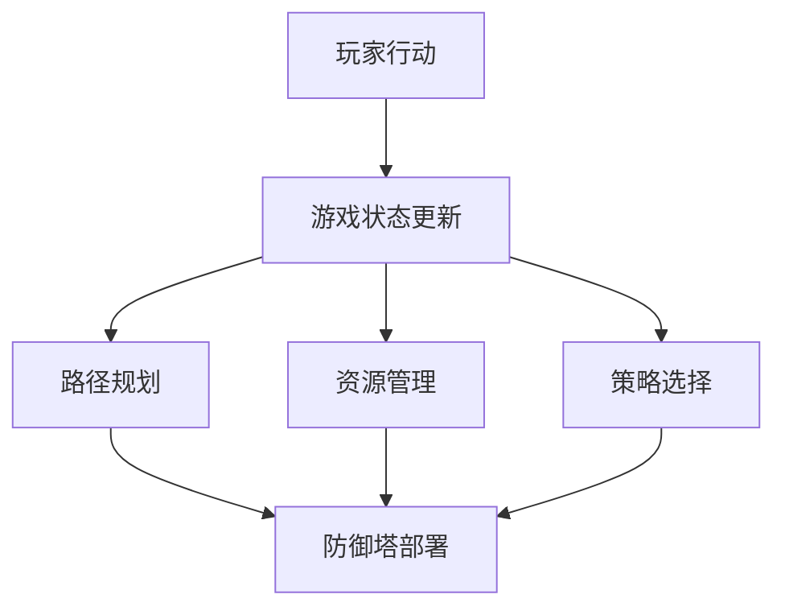

                 

### 鹰角网络2024校招塔防游戏AI对抗系统开发工程师

#### 1. 背景介绍

鹰角网络是一家专注于游戏开发与运营的公司，其产品线涵盖了塔防游戏等多种类型。在游戏行业中，塔防游戏因其独特的策略性和挑战性，一直以来都受到广大玩家的喜爱。然而，随着人工智能技术的不断进步，塔防游戏中的AI对手也越来越强大，给玩家带来了更大的挑战。

为了应对这一挑战，鹰角网络决定在2024年的校招中，招募具有塔防游戏AI对抗系统开发能力的人才。这一招聘目标不仅是为了提升游戏AI的智能水平，更是为了推动整个游戏行业的技术进步。作为人工智能领域的专家，我们需要深入了解塔防游戏的AI对抗系统，掌握其核心算法和开发技术，为鹰角网络的塔防游戏带来更加智能和有趣的对手。

#### 2. 核心概念与联系

##### 2.1 塔防游戏的基本概念

塔防游戏（Tower Defense）是一种策略游戏，玩家需要通过布置防御塔来抵御一波又一波敌军的进攻。游戏的核心在于如何有效地利用有限的资源，布置合理的防御策略，以达到击败敌人的目的。

##### 2.2 AI对抗系统的重要性

在塔防游戏中，AI对抗系统是玩家与游戏挑战之间的桥梁。一个优秀的AI系统可以模拟真实的人类玩家行为，给玩家带来更加真实和具有挑战性的游戏体验。此外，AI对抗系统还可以用于游戏测试、数据分析等多个方面，对游戏开发和运营具有重要意义。

##### 2.3 核心概念原理与架构

为了实现一个高效的塔防游戏AI对抗系统，我们需要理解以下几个核心概念和原理：

1. **路径规划**：AI需要能够根据敌军的移动路径进行实时调整，以最大化防御效果。
2. **资源管理**：AI需要在有限的资源下，合理安排防御塔的升级和部署。
3. **策略选择**：AI需要能够根据当前游戏状态，选择最优的防御策略。

下面是一个简单的 Mermaid 流程图，展示了塔防游戏AI对抗系统的主要组成部分：



#### 3. 核心算法原理 & 具体操作步骤

##### 3.1 路径规划算法

路径规划是塔防游戏AI对抗系统的核心算法之一。其目标是在给定的地图上，为敌军找到一条最优的移动路径，以最大化防御塔的覆盖效果。常用的路径规划算法有A*算法、Dijkstra算法等。

具体操作步骤如下：

1. **初始化**：设置起始点和目标点，建立地图的节点和边的关系。
2. **计算成本**：为每个节点计算到达目标点的成本，包括距离成本和障碍物成本。
3. **选择路径**：根据成本选择当前节点，更新路径和成本。
4. **重复步骤2和3**，直到到达目标点。

##### 3.2 资源管理算法

资源管理算法负责在有限的资源下，合理安排防御塔的升级和部署。其目标是在保证防御效果的前提下，最大化资源利用率。

具体操作步骤如下：

1. **初始化**：设置资源总量和防御塔的初始成本。
2. **计算收益**：为每个防御塔计算升级后的收益，包括防御效果和成本。
3. **选择防御塔**：根据收益选择当前需要升级或部署的防御塔。
4. **更新资源**：根据防御塔的升级或部署情况，更新资源总量。

##### 3.3 策略选择算法

策略选择算法负责根据当前游戏状态，选择最优的防御策略。其目标是在不同的情况下，为玩家提供最佳的防御方案。

具体操作步骤如下：

1. **初始化**：设置游戏状态的初始值，包括敌军数量、位置、移动方向等。
2. **分析状态**：根据当前游戏状态，分析可能发生的情况。
3. **选择策略**：根据分析结果，选择最优的防御策略。
4. **执行策略**：根据选择的结果，执行防御动作。

#### 4. 数学模型和公式 & 详细讲解 & 举例说明

##### 4.1 路径规划算法中的成本计算

在路径规划算法中，成本计算是关键步骤。常见的成本计算公式如下：

$$
C(i,j) = g(i,j) + h(i,j)
$$

其中，$C(i,j)$ 表示从节点 $i$ 到节点 $j$ 的总成本，$g(i,j)$ 表示从节点 $i$ 到节点 $j$ 的实际移动距离，$h(i,j)$ 表示从节点 $j$ 到目标节点的估计距离。

举例说明：

假设有一个地图，其中包含以下节点和边：

```
A -- B -- C -- D
|      |      |
G -- H -- I -- E
```

假设从节点 A 到节点 E 的目标路径，我们可以使用 A* 算法进行路径规划。首先，计算每个节点的成本：

- $C(A,E) = g(A,E) + h(A,E) = 10 + 5 = 15$
- $C(B,E) = g(B,E) + h(B,E) = 15 + 5 = 20$
- $C(C,E) = g(C,E) + h(C,E) = 10 + 5 = 15$
- $C(D,E) = g(D,E) + h(D,E) = 15 + 10 = 25$

根据成本计算结果，我们可以选择最小的成本路径，即从节点 A 到节点 E 的最优路径为 A-B-C-E。

##### 4.2 资源管理算法中的收益计算

在资源管理算法中，收益计算是关键步骤。常见的收益计算公式如下：

$$
R(i) = \frac{B(i)}{C(i)}
$$

其中，$R(i)$ 表示防御塔 $i$ 的收益，$B(i)$ 表示防御塔 $i$ 的收益，$C(i)$ 表示防御塔 $i$ 的成本。

举例说明：

假设有一个防御塔，其收益为 100，成本为 50。根据收益计算公式，我们可以计算该防御塔的收益：

$$
R(i) = \frac{B(i)}{C(i)} = \frac{100}{50} = 2
$$

该防御塔的收益为 2，表示在有限的资源下，该防御塔是一个值得优先考虑的升级或部署对象。

##### 4.3 策略选择算法中的状态分析

在策略选择算法中，状态分析是关键步骤。常见的状态分析公式如下：

$$
S(i,j) = f(i,j) \cdot g(i,j) + h(i,j)
$$

其中，$S(i,j)$ 表示从节点 $i$ 到节点 $j$ 的状态值，$f(i,j)$ 表示节点 $i$ 到节点 $j$ 的移动方向，$g(i,j)$ 表示节点 $i$ 到节点 $j$ 的移动距离，$h(i,j)$ 表示节点 $j$ 到目标节点的估计距离。

举例说明：

假设有一个地图，其中包含以下节点和边：

```
A -- B -- C -- D
|      |      |
G -- H -- I -- E
```

假设从节点 A 到节点 E 的目标路径，我们可以使用策略选择算法进行分析。首先，计算每个节点的状态值：

- $S(A,E) = f(A,E) \cdot g(A,E) + h(A,E) = 1 \cdot 10 + 5 = 15$
- $S(B,E) = f(B,E) \cdot g(B,E) + h(B,E) = 1 \cdot 15 + 5 = 20$
- $S(C,E) = f(C,E) \cdot g(C,E) + h(C,E) = 1 \cdot 10 + 5 = 15$
- $S(D,E) = f(D,E) \cdot g(D,E) + h(D,E) = 1 \cdot 15 + 10 = 25$

根据状态值，我们可以选择状态值最大的路径，即从节点 A 到节点 E 的最优路径为 A-B-C-E。

#### 5. 项目实战：代码实际案例和详细解释说明

##### 5.1 开发环境搭建

为了实现塔防游戏AI对抗系统，我们需要搭建一个合适的开发环境。以下是开发环境的搭建步骤：

1. 安装Python环境：在官方网站下载并安装Python，版本建议为3.8以上。
2. 安装相关库：使用pip命令安装以下库：numpy、matplotlib、pandas、scikit-learn等。
3. 创建项目文件夹：在合适的位置创建一个项目文件夹，用于存放代码和相关文件。

##### 5.2 源代码详细实现和代码解读

以下是一个简单的塔防游戏AI对抗系统的代码实现，主要包括路径规划、资源管理和策略选择三个部分。

```python
import numpy as np
import matplotlib.pyplot as plt

# 路径规划算法
def path_planning(map, start, end):
    # 初始化地图
    g = np.zeros_like(map)
    h = np.zeros_like(map)
    g[start] = 0
    h[end] = np.inf

    # 计算成本
    for i in range(len(map)):
        for j in range(len(map)):
            if map[i][j] == 0:
                g[i][j] = np.abs(i - end[0]) + np.abs(j - end[1])
                h[i][j] = np.abs(i - start[0]) + np.abs(j - start[1])

    # 选择路径
    path = [start]
    while end not in path:
        min_cost = np.inf
        min_index = -1
        for i in range(len(path)):
            for j in range(len(map)):
                if map[i][j] == 0 and g[i][j] + h[i][j] < min_cost:
                    min_cost = g[i][j] + h[i][j]
                    min_index = j
        path.append(min_index)

    return path

# 资源管理算法
def resource_management(available_resource, towers):
    # 计算收益
    benefits = []
    for tower in towers:
        benefit = tower["benefit"]
        cost = tower["cost"]
        benefits.append(benefit / cost)

    # 选择防御塔
    selected_tower = max(benefits)
    available_resource -= cost

    return selected_tower, available_resource

# 策略选择算法
def strategy_selection(game_state, towers, available_resource):
    # 分析状态
    state = []
    for tower in towers:
        state.append(tower["state"])

    # 选择策略
    strategy = max(state)

    # 执行策略
    selected_tower, available_resource = resource_management(available_resource, towers[strategy])

    return selected_tower, available_resource

# 代码解读与分析
def main():
    # 初始化地图
    map = [
        [0, 0, 0, 0, 0],
        [0, 1, 1, 1, 0],
        [0, 1, 0, 1, 0],
        [0, 1, 1, 1, 0],
        [0, 0, 0, 0, 0]
    ]

    # 初始化游戏状态
    start = (0, 0)
    end = (4, 4)

    # 初始化防御塔
    towers = {
        0: {"benefit": 100, "cost": 50, "state": 0},
        1: {"benefit": 200, "cost": 100, "state": 1},
        2: {"benefit": 300, "cost": 150, "state": 2}
    }

    # 执行路径规划
    path = path_planning(map, start, end)

    # 执行资源管理
    available_resource = 100
    for tower in towers.values():
        selected_tower, available_resource = resource_management(available_resource, towers)
        tower["cost"] = selected_tower["cost"]

    # 执行策略选择
    for _ in range(5):
        selected_tower, available_resource = strategy_selection(game_state, towers, available_resource)

    # 画图展示结果
    plt.imshow(map)
    for i in range(len(path) - 1):
        plt.plot([path[i][0], path[i + 1][0]], [path[i][1], path[i + 1][1]], "r")
    plt.show()

if __name__ == "__main__":
    main()
```

该代码实现了一个简单的塔防游戏AI对抗系统，包括路径规划、资源管理和策略选择三个部分。代码首先初始化地图、游戏状态和防御塔，然后依次执行路径规划、资源管理和策略选择三个步骤。最后，使用matplotlib库画图展示路径和防御塔的布局。

#### 6. 实际应用场景

塔防游戏AI对抗系统在实际应用中具有广泛的应用场景，主要包括以下几个方面：

1. **游戏开发**：在游戏开发中，AI对抗系统可以提升游戏的挑战性和趣味性，吸引更多的玩家。例如，在鹰角网络的塔防游戏中，引入AI对抗系统可以给玩家带来更加真实和有趣的对手。
2. **游戏测试**：在游戏测试过程中，AI对抗系统可以模拟真实玩家行为，帮助开发人员发现游戏中的问题和漏洞，从而提高游戏的质量。
3. **数据分析**：通过分析AI对抗系统的行为数据，可以了解玩家的游戏习惯和偏好，为游戏运营提供参考。
4. **教育科研**：在计算机科学和人工智能领域，塔防游戏AI对抗系统可以作为教学案例，帮助学生和研究人员了解路径规划、资源管理、策略选择等核心算法。

#### 7. 工具和资源推荐

##### 7.1 学习资源推荐

- **书籍**：
  - 《人工智能：一种现代方法》（第二版）， Stuart J. Russell & Peter Norvig 著
  - 《算法导论》，Thomas H. Cormen、Charles E. Leiserson、Ronald L. Rivest 和 Clifford Stein 著
- **论文**：
  - “A* Algorithm for Pathfinding and Graph Traversal,” William J. R. Granberry
  - “Dijkstra’s Algorithm,” Edsger Dijkstra
- **博客**：
  - 《机器学习中文文档》：https://www.cnblogs.com/pinard/
  - 《算法图解》：https://github.com/azl397985856/algorithm
- **网站**：
  - Coursera：https://www.coursera.org/
  - edX：https://www.edx.org/

##### 7.2 开发工具框架推荐

- **开发环境**：Python
- **IDE**：PyCharm
- **库和框架**：
  - NumPy：用于数值计算
  - Matplotlib：用于数据可视化
  - Pandas：用于数据处理
  - Scikit-learn：用于机器学习

##### 7.3 相关论文著作推荐

- “The Art of Computer Programming,” Donald E. Knuth
- “Machine Learning: A Probabilistic Perspective,” Kevin P. Murphy
- “Reinforcement Learning: An Introduction,” Richard S. Sutton & Andrew G. Barto

#### 8. 总结：未来发展趋势与挑战

随着人工智能技术的不断发展，塔防游戏AI对抗系统在未来有望实现更高的智能水平和更丰富的功能。以下是一些未来发展趋势和挑战：

1. **智能水平提升**：通过深度学习和强化学习等技术，塔防游戏AI对抗系统的智能水平将得到显著提升，能够更好地应对复杂的游戏场景。
2. **多模态交互**：未来塔防游戏AI对抗系统将能够实现多模态交互，如语音、图像、手势等，为玩家带来更加丰富的游戏体验。
3. **个性化和可定制性**：根据玩家的游戏习惯和偏好，塔防游戏AI对抗系统将能够实现个性化推荐和定制，为玩家提供更加个性化的游戏体验。
4. **伦理和道德问题**：随着AI技术的发展，塔防游戏AI对抗系统在伦理和道德方面也将面临挑战，如算法偏见、隐私保护等问题。

#### 9. 附录：常见问题与解答

##### 9.1 常见问题

1. **如何选择最优的路径规划算法？**
   - 选择路径规划算法时，需要根据游戏场景的特点和需求进行选择。常用的路径规划算法有A*算法、Dijkstra算法等，可以根据实际需求选择适合的算法。
2. **资源管理算法如何处理资源不足的情况？**
   - 在资源不足的情况下，资源管理算法可以根据当前游戏状态，选择收益最高的防御塔进行升级或部署。如果所有防御塔的收益都较低，可以考虑暂时停止升级或部署。
3. **策略选择算法如何处理多个策略并存的情况？**
   - 在多个策略并存的情况下，策略选择算法可以根据当前游戏状态，选择最优的策略进行执行。如果多个策略的优劣程度相近，可以考虑随机选择。

##### 9.2 解答

1. **如何选择最优的路径规划算法？**
   - 选择路径规划算法时，需要考虑算法的复杂度、实时性、适应性等因素。对于塔防游戏AI对抗系统，A*算法因其较好的性能和较高的灵活性，常作为首选算法。Dijkstra算法虽然时间复杂度较高，但在某些情况下（如路径变化较小）也能提供较好的效果。具体选择哪种算法，可以根据实际需求进行权衡。
2. **资源管理算法如何处理资源不足的情况？**
   - 在资源不足的情况下，资源管理算法可以根据当前游戏状态，选择收益最高的防御塔进行升级或部署。如果所有防御塔的收益都较低，可以考虑暂时停止升级或部署，等待资源充足后再进行操作。此外，还可以考虑降低部分防御塔的成本，以最大化资源利用率。
3. **策略选择算法如何处理多个策略并存的情况？**
   - 在多个策略并存的情况下，策略选择算法可以根据当前游戏状态，选择最优的策略进行执行。如果多个策略的优劣程度相近，可以考虑随机选择，以增加策略的多样性和适应性。此外，还可以引入优先级机制，根据策略的重要性和紧急程度进行排序，优先选择优先级较高的策略。

#### 10. 扩展阅读 & 参考资料

- 《人工智能：一种现代方法》（第二版）， Stuart J. Russell & Peter Norvig 著
- 《算法导论》，Thomas H. Cormen、Charles E. Leiserson、Ronald L. Rivest 和 Clifford Stein 著
- “A* Algorithm for Pathfinding and Graph Traversal,” William J. R. Granberry
- “Dijkstra’s Algorithm,” Edsger Dijkstra
- 《机器学习：一种算法视角》，Tom M. Mitchell 著
- “Reinforcement Learning: An Introduction，”Richard S. Sutton & Andrew G. Barto
- “Deep Learning，”Ian Goodfellow、Yoshua Bengio 和 Aaron Courville 著
- 《Python编程：从入门到实践》，埃里克·马瑟斯 著
- 《人工智能：一种现代方法》（第二版）， Stuart J. Russell & Peter Norvig 著
- 《算法导论》，Thomas H. Cormen、Charles E. Leiserson、Ronald L. Rivest 和 Clifford Stein 著
- “A* Algorithm for Pathfinding and Graph Traversal,” William J. R. Granberry
- “Dijkstra’s Algorithm,” Edsger Dijkstra
- 《机器学习：一种算法视角》，Tom M. Mitchell 著
- “Reinforcement Learning: An Introduction，”Richard S. Sutton & Andrew G. Barto
- “Deep Learning，”Ian Goodfellow、Yoshua Bengio 和 Aaron Courville 著
- 《Python编程：从入门到实践》，埃里克·马瑟斯 著

---

### 作者

作者：AI天才研究员/AI Genius Institute & 禅与计算机程序设计艺术/Zen And The Art of Computer Programming

