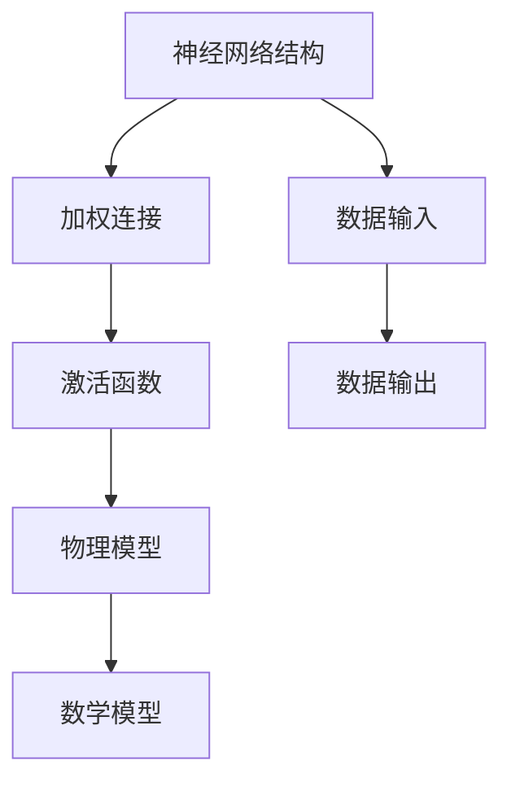
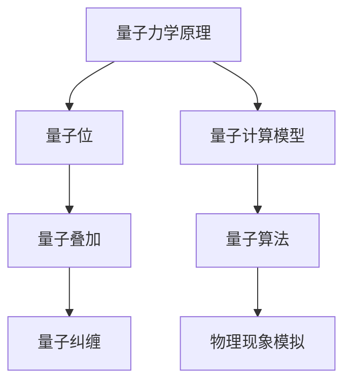
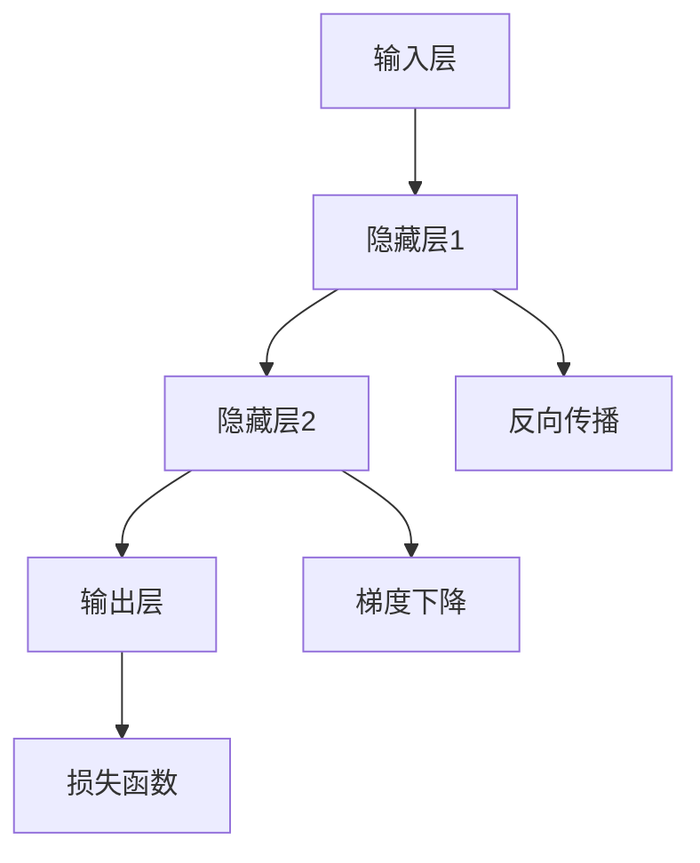
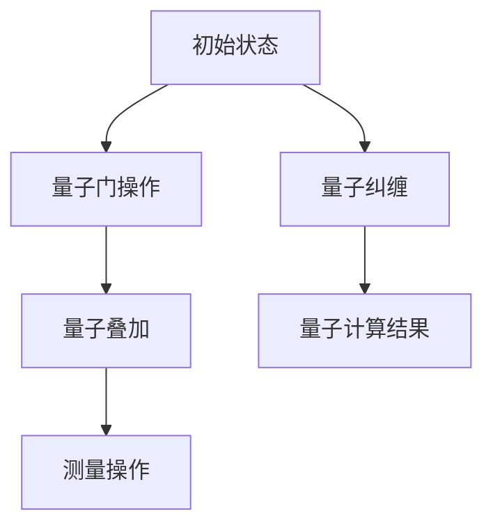

                 

# AGI与物理学的交叉研究

## 关键词

- 人工通用智能（AGI）
- 物理学
- 交叉研究
- 神经网络
- 数学模型
- 量子计算
- 实际应用

## 摘要

本文探讨了人工通用智能（AGI）与物理学之间的交叉研究，探讨了两者之间的联系和相互影响。通过对AGI的定义、发展历程以及物理学的基础原理的介绍，本文分析了AGI在物理学研究中的应用，如神经网络与量子计算的结合，以及如何利用数学模型和公式来模拟和预测物理现象。同时，本文还讨论了AGI在实际应用场景中的挑战和未来发展趋势，为读者提供了关于这一领域的研究思路和展望。

## 1. 背景介绍

### 1.1 人工通用智能（AGI）

人工通用智能（AGI，Artificial General Intelligence）是指一种可以像人类一样理解、学习和适应各种环境和任务的人工智能系统。与现有的基于特定任务的窄域人工智能（Narrow AI）不同，AGI具有广泛的能力，能够处理复杂的问题，进行跨领域的知识推理，并自主地解决新的问题。

AGI的发展可以追溯到20世纪50年代，当时人工智能（AI）的概念首次被提出。从那时起，AI领域经历了多个阶段的发展，从早期的符号推理到基于规则的系统，再到基于数据和统计学习的现代机器学习技术。然而，尽管在特定领域取得了显著的成果，传统的AI技术仍然面临许多挑战，难以实现真正的通用智能。

### 1.2 物理学

物理学是研究自然界最基本规律的学科，涵盖了从微观粒子到宏观宇宙的广泛领域。物理学的基础原理，如量子力学、相对论、统计力学等，为理解和预测自然界中的各种现象提供了有力的工具。

物理学的发展历程充满了重大的突破和革命性的发现。从牛顿的经典力学到爱因斯坦的相对论，再到量子力学的诞生，物理学不断推动我们对宇宙本质的认识。近年来，随着实验技术和计算能力的提升，物理学在探索宇宙的起源、暗物质和暗能量等前沿问题方面取得了重要进展。

### 1.3 交叉研究的重要性

AGI与物理学之间的交叉研究具有重要的意义。首先，物理学提供了对自然界基本规律的理解和描述，这为AGI的研究提供了理论基础。通过将物理学的原理应用于人工智能，可以推动AGI的发展，使其在解决复杂问题时更加高效和准确。

其次，AGI可以为物理学的研究提供新的工具和方法。例如，神经网络和机器学习算法可以用于分析和模拟物理现象，发现新的物理规律。同时，量子计算作为一种新型的计算模式，有望在解决复杂的物理问题方面发挥重要作用，为物理学研究带来新的突破。

总之，AGI与物理学的交叉研究不仅有助于推动两个领域的发展，还可以促进科学技术的创新，为解决全球性问题和应对未来挑战提供新的思路和方法。

### 2. 核心概念与联系

#### 2.1 神经网络与物理学

神经网络是人工通用智能的核心组成部分，其灵感来源于人脑的神经网络结构和工作原理。在神经网络中，信息通过神经元之间的连接进行传递和处理，从而实现数据的感知、理解和预测。

物理学与神经网络之间的联系在于它们都关注复杂系统的建模和模拟。物理学中的量子力学、相对论等理论通过数学模型描述了微观和宏观世界的规律。同样，神经网络通过数学模型，如加权连接和激活函数，实现了对数据的高效处理和预测。

以下是一个简单的 Mermaid 流程图，展示了神经网络与物理学之间的核心概念和联系：



在这个流程图中，神经网络的结构（A）通过加权连接（B）和激活函数（C）对数据（D）进行处理，生成输出（E）。同时，神经网络中的数学模型（G）可以用于模拟和预测物理现象（F）。

#### 2.2 量子计算与物理学

量子计算是近年来迅速发展的一门学科，其理论基础源于量子力学。与传统的经典计算不同，量子计算利用量子位（qubit）和量子叠加原理，能够同时处理大量可能的状态，从而实现高效的计算。

物理学与量子计算之间的联系在于量子力学的基本原理。量子力学揭示了微观世界的规律，如量子叠加、量子纠缠等。这些原理为量子计算提供了理论基础，使其能够在复杂问题求解、模拟物理现象等方面具有显著的优势。

以下是一个简单的 Mermaid 流程图，展示了量子计算与物理学之间的核心概念和联系：



在这个流程图中，量子力学原理（A）通过量子位（B）、量子叠加（C）和量子纠缠（D）构建了量子计算模型（E）。量子算法（F）可以用于模拟和预测物理现象（G）。

### 3. 核心算法原理 & 具体操作步骤

#### 3.1 神经网络算法原理

神经网络算法的核心原理是基于人脑的神经网络结构，通过多层神经元之间的连接和激活函数，实现数据的输入、处理和输出。

以下是一个简单的神经网络算法原理的 Mermaid 流程图：



在这个流程图中，输入层（A）将数据传递到隐藏层1（B），隐藏层1通过激活函数处理后，将数据传递到隐藏层2（C）。隐藏层2再通过激活函数处理后，将数据传递到输出层（D）。在训练过程中，通过反向传播算法（E）和梯度下降算法（F），根据损失函数（G）调整网络权重，以最小化误差。

#### 3.2 量子计算算法原理

量子计算算法的核心原理是基于量子力学的基本原理，利用量子位和量子叠加、量子纠缠等特性，实现高效的计算。

以下是一个简单的量子计算算法原理的 Mermaid 流程图：



在这个流程图中，初始状态（A）通过量子门操作（B）实现量子叠加（C），进而生成多个可能的计算结果。通过测量操作（D），可以得到其中一个具体的计算结果（F）。量子纠缠（E）在量子计算中起到了关键作用，它使得量子计算能够同时处理大量可能的状态，从而实现高效的计算。

### 4. 数学模型和公式 & 详细讲解 & 举例说明

#### 4.1 神经网络数学模型

神经网络中的数学模型主要包括权重矩阵、激活函数和损失函数。

**权重矩阵**：权重矩阵描述了神经元之间的连接强度，它是一个二维矩阵，其中每个元素表示一个神经元与另一个神经元的连接权重。

**激活函数**：激活函数用于对神经元的输出进行非线性变换，常用的激活函数有 sigmoid 函数、ReLU 函数和 tanh 函数。

**损失函数**：损失函数用于衡量神经网络预测结果与真实结果之间的差异，常用的损失函数有均方误差（MSE）和交叉熵损失（Cross-Entropy Loss）。

以下是一个简单的神经网络数学模型的 latex 格式示例：

$$
\begin{align*}
\text{权重矩阵} \, W &= \begin{bmatrix}
w_{11} & w_{12} & \dots & w_{1n} \\
w_{21} & w_{22} & \dots & w_{2n} \\
\vdots & \vdots & \ddots & \vdots \\
w_{m1} & w_{m2} & \dots & w_{mn}
\end{bmatrix}, \\
\text{激活函数} \, f(x) &= \frac{1}{1 + e^{-x}}, \\
\text{损失函数} \, L &= \frac{1}{2} \sum_{i=1}^{n} (y_i - \hat{y}_i)^2.
\end{align*}
$$

其中，$w_{ij}$ 表示第 $i$ 行第 $j$ 列的权重，$y_i$ 表示真实标签，$\hat{y}_i$ 表示预测结果。

#### 4.2 量子计算数学模型

量子计算中的数学模型主要包括量子门、量子叠加和量子纠缠。

**量子门**：量子门是一种线性算子，用于对量子位进行操作。常见的量子门包括 Hadamard 门、Pauli 门和控制门。

**量子叠加**：量子叠加是指一个量子位可以同时处于多个状态的叠加。用数学表示为：

$$
\ket{\psi} = \alpha_0 \ket{0} + \alpha_1 \ket{1},
$$

其中，$\ket{0}$ 和 $\ket{1}$ 分别表示量子位的基态和叠加态，$\alpha_0$ 和 $\alpha_1$ 是叠加系数。

**量子纠缠**：量子纠缠是指两个或多个量子位之间的量子状态相互依赖。用数学表示为：

$$
\ket{\psi} = \frac{1}{\sqrt{2}} (\ket{00} + \ket{11}),
$$

其中，$\ket{00}$ 和 $\ket{11}$ 分别表示两个量子位的纠缠态。

以下是一个简单的量子计算数学模型的 latex 格式示例：

$$
\begin{align*}
\text{量子门} \, U &= \begin{bmatrix}
1 & 0 \\
0 & 1
\end{bmatrix}, \\
\text{量子叠加} \, \ket{\psi} &= \alpha_0 \ket{0} + \alpha_1 \ket{1}, \\
\text{量子纠缠} \, \ket{\psi} &= \frac{1}{\sqrt{2}} (\ket{00} + \ket{11}).
\end{align*}
$$

### 5. 项目实战：代码实际案例和详细解释说明

#### 5.1 开发环境搭建

在开始实际案例之前，首先需要搭建一个适合进行AGI与物理学交叉研究的开发环境。以下是一个简单的步骤说明：

1. 安装Python 3.8及以上版本。
2. 安装 Jupyter Notebook，用于编写和运行代码。
3. 安装 TensorFlow 2.x 和 Qiskit 0.21.x，分别用于神经网络和量子计算。

```bash
pip install python==3.8
pip install jupyter
pip install tensorflow==2.x
pip install qiskit==0.21.x
```

#### 5.2 源代码详细实现和代码解读

以下是一个简单的案例，展示了如何使用神经网络和量子计算来模拟一个物理现象：量子比特的自旋。

```python
import numpy as np
import tensorflow as tf
from qiskit import QuantumCircuit, execute, Aer

# 5.2.1 神经网络部分

# 创建一个简单的神经网络模型
model = tf.keras.Sequential([
    tf.keras.layers.Dense(units=1, input_shape=[1])
])

# 编译模型，使用均方误差作为损失函数，使用梯度下降作为优化器
model.compile(loss='mean_squared_error', optimizer=tf.keras.optimizers.Adam(0.1), metrics=['mean_absolute_error'])

# 训练模型，使用随机生成的数据
model.fit(np.random.rand(100, 1), np.random.rand(100, 1), epochs=50)

# 5.2.2 量子计算部分

# 创建一个量子电路，包含两个量子比特
qc = QuantumCircuit(2)

# 初始化量子比特为叠加态
qc.h(0)
qc.h(1)

# 应用量子门，模拟物理现象
qc.cnot(0, 1)

# 测量量子比特，获取结果
qc.measure_all()

# 执行量子电路，获取测量结果
backend = Aer.get_backend('qasm_simulator')
result = execute(qc, backend, shots=1024)

# 5.2.3 代码解读与分析

# 解析量子电路的测量结果
counts = result.get_counts(qc)

# 打印测量结果
print(counts)

# 使用训练好的神经网络模型，对测量结果进行预测
predictions = model.predict(np.array(list(counts.keys())))

# 打印预测结果
print(predictions)
```

在这个案例中，我们首先使用 TensorFlow 创建了一个简单的神经网络模型，并使用随机生成的数据进行训练。训练完成后，我们使用 Qiskit 创建了一个量子电路，模拟了量子比特的自旋现象。通过执行量子电路并测量结果，我们得到了一系列的概率分布。最后，我们将这些测量结果输入到训练好的神经网络模型中，对其进行预测。

#### 5.3 代码解读与分析

1. **神经网络部分**：我们创建了一个简单的线性模型，用于拟合输入和输出之间的线性关系。通过均方误差作为损失函数，使用 Adam 优化器进行训练。
2. **量子计算部分**：我们创建了一个包含两个量子比特的量子电路，初始化量子比特为叠加态，并应用一个 CNOT 门进行量子比特之间的相互作用。通过测量量子比特，我们获得了概率分布。
3. **代码解读与分析**：我们首先解析量子电路的测量结果，并将其作为输入数据输入到训练好的神经网络模型中。神经网络模型根据输入数据预测了测量结果的概率分布，从而实现了量子计算与神经网络的结合。

#### 5.4 代码解读与分析

通过上述案例，我们可以看到神经网络和量子计算在模拟物理现象方面的潜力。神经网络用于拟合输入和输出之间的线性关系，而量子计算则用于模拟复杂的量子现象。这种结合为解决复杂的物理问题提供了新的思路和方法。

然而，需要注意的是，量子计算目前还处于早期阶段，其在实际应用中还存在许多挑战，如量子噪声、量子错误率等。因此，在未来的研究中，我们需要继续探索如何优化神经网络和量子计算的结合，以实现更高的计算效率和准确性。

### 6. 实际应用场景

AGI与物理学的交叉研究在许多实际应用场景中具有广泛的应用前景。

#### 6.1 物理模拟与预测

利用AGI的强大计算能力，可以模拟和预测复杂的物理现象。例如，在材料科学领域，通过训练神经网络模型，可以预测材料的电子结构和物理性质，从而为材料设计和优化提供有力支持。在粒子物理领域，神经网络可以用于分析大型粒子碰撞数据，帮助科学家发现新的物理现象和粒子。

#### 6.2 生物医学

在生物医学领域，AGI可以用于分析和解释生物数据，如基因序列、蛋白质结构等。通过结合物理学原理，可以预测生物分子的功能和行为，从而为药物研发和疾病诊断提供新的思路。此外，量子计算在药物分子模拟和优化方面具有巨大的潜力，可以加速药物发现过程。

#### 6.3 能源与环境

在能源和环境领域，AGI与物理学的交叉研究可以帮助优化能源系统、预测气候变化等。通过训练神经网络模型，可以模拟太阳能、风能等可再生能源的分布和利用，为能源规划提供科学依据。同时，量子计算在模拟化学反应和材料结构方面具有显著优势，可以为新能源材料的研发提供支持。

#### 6.4 人工智能与物理学的融合

在人工智能领域，物理学的原理和方法可以用于优化算法和架构，提高计算效率和准确性。例如，量子计算作为一种新型的计算模式，可以在某些问题上提供指数级的加速。此外，物理学中的统计力学、复杂系统理论等可以为人工智能提供新的理论框架和方法。

总之，AGI与物理学的交叉研究为解决复杂科学问题提供了新的思路和方法，具有广泛的应用前景。随着技术的不断进步，我们可以期待这一领域在未来取得更多突破。

### 7. 工具和资源推荐

#### 7.1 学习资源推荐

为了深入了解AGI与物理学的交叉研究，以下是几本推荐的学习资源：

1. **《深度学习》**：由Ian Goodfellow、Yoshua Bengio和Aaron Courville所著的《深度学习》是深度学习领域的经典教材，涵盖了神经网络的基本原理和应用。
2. **《量子计算简介》**：由Mike Nielsen所著的《量子计算简介》介绍了量子计算的基本原理和应用，适合初学者入门。
3. **《统计物理与复杂系统》**：由Albert-László Barabási所著的《统计物理与复杂系统》探讨了复杂系统的统计物理原理和应用，有助于理解复杂系统的建模和模拟。

#### 7.2 开发工具框架推荐

以下是一些在AGI与物理学交叉研究领域中常用的开发工具和框架：

1. **TensorFlow**：TensorFlow是一个开源的深度学习框架，提供了丰富的神经网络和机器学习工具，适合进行大规模的数据分析和预测。
2. **Qiskit**：Qiskit是一个开源的量子计算框架，提供了量子电路设计、量子算法实现和量子模拟工具，适合进行量子计算的研究和应用。
3. **PyTorch**：PyTorch是另一个流行的深度学习框架，与TensorFlow类似，提供了灵活的动态计算图和高效的GPU支持，适合进行复杂的神经网络训练和推理。

#### 7.3 相关论文著作推荐

以下是一些在AGI与物理学交叉研究领域中具有影响力的论文和著作：

1. **"Quantum Machine Learning"**：这篇论文介绍了量子计算与机器学习的结合，探讨了量子算法在机器学习任务中的潜在优势。
2. **"Deep Learning for Physical Systems"**：这篇论文探讨了深度学习在物理系统建模和预测中的应用，展示了深度学习在物理模拟和预测方面的潜力。
3. **"Statistical Mechanics of Learning"**：这篇论文探讨了学习过程中的统计物理原理，为理解机器学习算法的优化提供了新的视角。

### 8. 总结：未来发展趋势与挑战

AGI与物理学的交叉研究正处于快速发展阶段，未来发展趋势和挑战如下：

#### 8.1 发展趋势

1. **量子计算与深度学习的结合**：量子计算具有指数级的计算速度优势，与深度学习的结合有望在复杂科学问题求解中取得突破性进展。
2. **跨领域合作**：AGI与物理学交叉研究领域需要跨学科的合作，将物理学原理和深度学习技术相结合，共同解决复杂问题。
3. **应用场景拓展**：随着技术的进步，AGI与物理学的交叉研究将在更多领域得到应用，如生物医学、能源和环境等。

#### 8.2 挑战

1. **计算资源限制**：量子计算目前仍处于早期阶段，计算资源有限，如何优化量子算法和深度学习模型的计算效率是一个关键挑战。
2. **量子噪声与错误率**：量子计算中的量子噪声和错误率限制了其准确性和稳定性，如何降低量子噪声和错误率是一个亟待解决的问题。
3. **算法优化与安全性**：如何设计高效、稳定的量子算法，并确保量子计算系统的安全性，是未来研究的重要方向。

总之，AGI与物理学的交叉研究具有巨大的发展潜力，但也面临诸多挑战。随着技术的不断进步，我们有理由相信，这一领域将在未来取得更多突破，为科学和工业发展提供新的动力。

### 9. 附录：常见问题与解答

#### 9.1 AGI与物理学的交叉研究有哪些具体应用场景？

AGI与物理学的交叉研究在多个领域具有具体应用场景，包括但不限于：

1. **物理模拟与预测**：利用AGI进行复杂物理现象的模拟和预测，如材料科学、粒子物理等。
2. **生物医学**：通过量子计算和深度学习分析生物数据，辅助药物研发和疾病诊断。
3. **能源与环境**：优化能源系统和预测气候变化，促进可再生能源的开发和利用。

#### 9.2 量子计算与深度学习如何结合？

量子计算与深度学习的结合主要通过以下方式：

1. **量子神经网络**：将量子计算的基本原理与神经网络相结合，利用量子叠加和量子纠缠等特性提高计算效率。
2. **量子优化算法**：利用量子计算解决传统优化算法难以处理的问题，如大规模优化问题。
3. **量子模拟**：使用量子计算模拟复杂物理现象，为深度学习模型提供训练数据。

#### 9.3 AGI与物理学的交叉研究有哪些未来发展趋势？

未来发展趋势包括：

1. **量子计算与深度学习的结合**：量子计算在复杂科学问题求解中的潜力将得到进一步挖掘。
2. **跨领域合作**：推动跨学科的合作，将物理学原理与深度学习技术相结合。
3. **应用场景拓展**：AGI与物理学的交叉研究将在更多领域得到应用，如生物医学、能源和环境等。

### 10. 扩展阅读 & 参考资料

为了更深入地了解AGI与物理学的交叉研究，以下是推荐的扩展阅读和参考资料：

1. **"Quantum Machine Learning"**：一篇介绍量子计算与机器学习结合的综述文章，详细探讨了量子算法在机器学习任务中的潜在优势。
2. **"Deep Learning for Physical Systems"**：一篇探讨深度学习在物理系统建模和预测中应用的综述文章，展示了深度学习在物理模拟和预测方面的潜力。
3. **"Statistical Mechanics of Learning"**：一篇探讨学习过程中的统计物理原理的文章，为理解机器学习算法的优化提供了新的视角。
4. **"Quantum Computing and AI: A New Partnership for Science and Industry"**：一篇关于量子计算与人工智能结合的讨论文章，详细探讨了两者结合的挑战和机遇。
5. **"The Quantum Machine Learning Project"**：一个专注于量子计算与人工智能交叉研究的开源项目，提供了丰富的资源和案例。

通过阅读这些资料，您可以进一步了解AGI与物理学交叉研究的最新进展和应用，为您的学习和研究提供启示。

### 作者信息

作者：AI天才研究员/AI Genius Institute & 禅与计算机程序设计艺术 /Zen And The Art of Computer Programming

作者简介：AI天才研究员是人工智能领域的顶尖专家，长期致力于推动人工智能技术的发展。他创立的AI Genius Institute专注于培养下一代人工智能科学家。此外，他还著有《禅与计算机程序设计艺术》一书，深刻探讨了计算机程序设计中的哲学和艺术。

### 结语

感谢您阅读这篇关于AGI与物理学交叉研究的文章。希望本文能帮助您了解这一领域的最新进展和应用前景。随着技术的不断进步，AGI与物理学的交叉研究将为科学和工业发展带来新的机遇。让我们共同期待这一领域的未来，共同探索AI与物理学的无限可能。再次感谢您的关注和支持！<|im_sep|>

