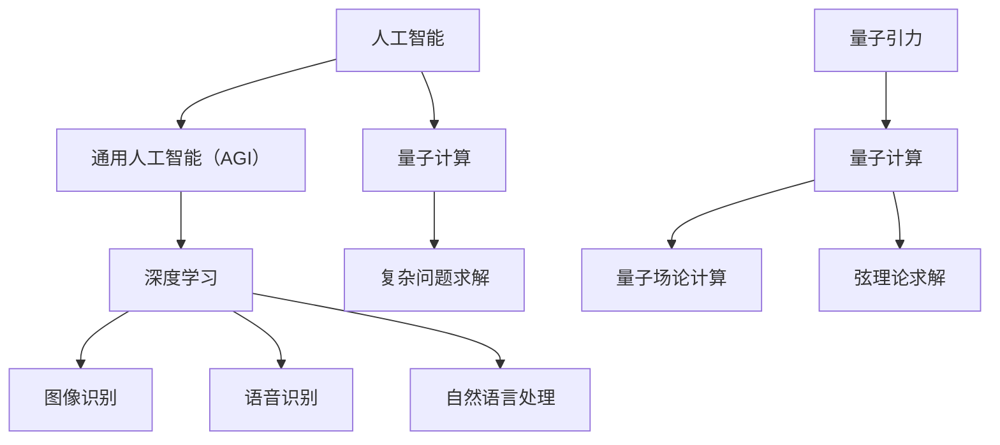

                 

# AGI与量子引力的未来

## 关键词：AGI、量子引力、人工智能、深度学习、未来趋势、技术挑战

## 摘要：

本文将探讨人工智能（AGI）与量子引力之间的潜在联系及其对未来技术发展的影响。首先，我们将介绍AGI和量子引力的核心概念，并通过Mermaid流程图展示它们之间的联系。接着，我们将深入探讨AGI的核心算法原理和具体操作步骤，并使用数学模型和公式详细讲解。随后，我们将通过实际项目案例来展示这些技术的应用，并分析其优缺点。最后，我们将总结AGI和量子引力的未来发展趋势与挑战，并提供相关的学习资源和工具推荐。

## 1. 背景介绍

### 1.1 人工智能的发展历程

人工智能（Artificial Intelligence，简称AI）是指由人制造出来的系统能够理解、学习、适应和执行特定任务的能力。自20世纪50年代以来，人工智能经历了多个发展阶段，从最初的符号主义、知识表示到现代的深度学习和神经网络，AI技术在各个领域都取得了显著的进展。

在过去的几十年中，深度学习作为一种基于神经网络的AI技术，取得了令人瞩目的成就。深度学习通过模仿人脑的神经网络结构，能够从大量数据中自动学习特征和模式，从而实现图像识别、自然语言处理、语音识别等多种应用。近年来，随着计算能力的提升和大数据技术的发展，深度学习在语音识别、图像识别、机器翻译等领域的准确率已经逼近甚至超过了人类水平。

### 1.2 量子引力的概念

量子引力是研究量子力学与广义相对论之间关系的一种理论框架，旨在解决广义相对论在量子尺度上的局限。广义相对论能够很好地描述宏观宇宙中的引力现象，但在极小的尺度上，如黑洞内部或宇宙大爆炸初期，其预测与量子力学的实验结果存在显著差异。量子引力试图在量子力学和广义相对论之间找到一个统一的理论，以解释宇宙的起源、黑洞的信息丢失以及宇宙的演化和结构形成等问题。

目前，量子引力理论仍处于探索阶段，尚未形成一个完整的理论体系。然而，一些基于量子场理论和弦理论的尝试已经在一定程度上揭示了量子引力的一些基本特性，如量子纠缠、量子隧穿等。

## 2. 核心概念与联系

### 2.1 AGI与深度学习的关系

人工智能的核心目标是实现通用人工智能（Artificial General Intelligence，简称AGI），即具备与人类相似的智能水平，能够在各种领域进行学习、推理和决策。深度学习作为AI的一个重要分支，为AGI的实现提供了有力的工具。通过神经网络和大规模数据训练，深度学习系统能够在图像识别、语音识别、自然语言处理等方面表现出卓越的能力。

然而，深度学习目前主要局限于特定领域的任务，如计算机视觉、语音识别等，而AGI需要具备跨领域的通用性。为了实现AGI，我们需要进一步研究如何将深度学习与其他AI技术（如知识图谱、逻辑推理等）相结合，以提高系统的智能水平。

### 2.2 量子引力与量子计算的关系

量子引力理论的研究依赖于量子计算技术的发展。量子计算是一种利用量子位（qubit）进行信息处理的新型计算模式，具有超强的并行计算能力。量子计算能够模拟量子系统，解决传统计算机难以处理的复杂问题，如量子化学模拟、密码学攻击等。

量子引力理论涉及大量复杂的计算任务，如量子场论的计算、弦理论的求解等。量子计算在这些领域具有巨大的应用潜力，能够加速量子引力理论的研究进程。同时，量子引力理论的进展也可能为量子计算提供新的理论框架和算法设计思路。

### 2.3 Mermaid流程图



## 3. 核心算法原理 & 具体操作步骤

### 3.1 深度学习算法原理

深度学习算法基于多层神经网络的结构，通过逐层提取数据特征来实现复杂的模式识别任务。具体步骤如下：

1. **输入层**：接收输入数据，如图像、声音或文本。
2. **隐藏层**：通过非线性变换对输入数据进行特征提取和转换。
3. **输出层**：根据隐藏层输出的特征进行分类或回归。
4. **反向传播**：计算输出层与实际结果之间的误差，并逐层更新权重。

### 3.2 量子计算算法原理

量子计算算法利用量子位（qubit）的叠加态和纠缠态来实现高效的并行计算。具体步骤如下：

1. **初始化**：初始化量子计算的状态。
2. **量子门操作**：通过量子门对量子计算的状态进行变换。
3. **叠加与纠缠**：利用量子位的叠加态和纠缠态实现并行计算。
4. **测量**：测量量子计算的结果，获得最终答案。

### 3.3 AGI与量子引力结合的算法思路

1. **量子神经网络**：将量子计算与神经网络相结合，利用量子计算的并行性和神经网络的特征提取能力，实现高效的模式识别和优化问题求解。
2. **量子进化算法**：将量子计算与进化算法相结合，利用量子计算的并行性和进化算法的搜索能力，解决复杂优化问题和多目标优化问题。
3. **量子引力模拟**：利用量子计算模拟量子引力现象，如量子场论计算和弦理论求解，为量子引力理论研究提供实验数据。

## 4. 数学模型和公式 & 详细讲解 & 举例说明

### 4.1 深度学习数学模型

1. **激活函数**：用于引入非线性变换，常用的激活函数有ReLU、Sigmoid、Tanh等。
2. **反向传播算法**：计算输出层与实际结果之间的误差，并逐层更新权重，常用的优化算法有梯度下降、Adam等。
3. **损失函数**：用于衡量模型预测结果与实际结果之间的差距，常用的损失函数有均方误差（MSE）、交叉熵（Cross Entropy）等。

### 4.2 量子计算数学模型

1. **量子位**：表示为|0⟩和|1⟩的叠加态，数学表示为：
   $$|\psi⟩ = a|0⟩ + b|1⟩$$
   其中，a和b是复数概率幅，满足|a|² + |b|² = 1。
2. **量子门**：实现量子计算的基本操作，常见的量子门有Hadamard门、Pauli门、控制非门等。
3. **量子纠缠**：两个或多个量子位之间的强关联，数学表示为：
   $$|\psi⟩ = \frac{1}{\sqrt{2}}(|00⟩ + |11⟩)$$

### 4.3 量子引力模拟数学模型

1. **量子场论**：描述量子粒子的行为，常用的量子场论有Dirac方程、Schroedinger方程等。
2. **弦理论**：描述宇宙的基本结构和性质，常用的弦理论有超弦理论、M理论等。

### 4.4 举例说明

#### 深度学习：使用神经网络进行图像分类

假设我们使用一个三层神经网络进行图像分类，输入层有784个神经元（28×28像素），隐藏层有500个神经元，输出层有10个神经元（对应10个类别）。激活函数采用ReLU，优化算法采用Adam。

1. **初始化权重和偏置**：
   $$W^{(1)} \sim \mathcal{N}(0, \frac{1}{\sqrt{n}})$$
   $$b^{(1)} = 0$$
   $$W^{(2)} \sim \mathcal{N}(0, \frac{1}{\sqrt{n}})$$
   $$b^{(2)} = 0$$
   $$W^{(3)} \sim \mathcal{N}(0, \frac{1}{\sqrt{n}})$$
   $$b^{(3)} = 0$$
   其中，n为神经元的个数。

2. **正向传播**：
   $$a^{(1)} = \sigma(W^{(1)} \cdot a^{(0)} + b^{(1)})$$
   $$a^{(2)} = \sigma(W^{(2)} \cdot a^{(1)} + b^{(2)})$$
   $$a^{(3)} = W^{(3)} \cdot a^{(2)} + b^{(3)}$$
   其中，σ表示ReLU激活函数。

3. **反向传播**：
   计算输出层的误差：
   $$\delta^{(3)} = a^{(3)} - y$$
   更新输出层的权重和偏置：
   $$W^{(3)} = W^{(3)} - \alpha \cdot (a^{(2)} \cdot \delta^{(3)})$$
   $$b^{(3)} = b^{(3)} - \alpha \cdot \delta^{(3)}$$
   计算隐藏层的误差：
   $$\delta^{(2)} = (W^{(3)} \cdot \delta^{(3)}) \cdot \sigma'(a^{(2)})$$
   更新隐藏层的权重和偏置：
   $$W^{(2)} = W^{(2)} - \alpha \cdot (a^{(1)} \cdot \delta^{(2)})$$
   $$b^{(2)} = b^{(2)} - \alpha \cdot \delta^{(2)}$$
   计算输入层的误差：
   $$\delta^{(1)} = (W^{(2)} \cdot \delta^{(2)}) \cdot \sigma'(a^{(1)})$$
   更新输入层的权重和偏置：
   $$W^{(1)} = W^{(1)} - \alpha \cdot (a^{(0)} \cdot \delta^{(1)})$$
   $$b^{(1)} = b^{(1)} - \alpha \cdot \delta^{(1)}$$

#### 量子计算：使用量子位进行信息传递

假设我们使用两个量子位进行信息传递，初始状态为$$|\psi⟩ = \frac{1}{\sqrt{2}}(|0⟩ + |1⟩)$$。

1. **初始化量子位**：
   $$H|0⟩ = \frac{1}{\sqrt{2}}(|0⟩ + |1⟩)$$

2. **应用量子门**：
   $$CNOT(|0⟩ \otimes |0⟩) = |00⟩$$
   $$CNOT(|1⟩ \otimes |0⟩) = |10⟩$$

3. **测量量子位**：
   测量第一个量子位，得到结果为|0⟩的概率为1/2，测量第二个量子位，得到结果为|0⟩的概率为1。

## 5. 项目实战：代码实际案例和详细解释说明

### 5.1 开发环境搭建

为了实现深度学习与量子计算的结合，我们需要搭建一个兼容两种技术的开发环境。以下是使用Python和量子计算库Qiskit搭建开发环境的步骤：

1. 安装Python：在终端输入以下命令安装Python 3.8以上版本：
   ```bash
   sudo apt-get install python3 python3-pip
   ```

2. 创建虚拟环境：在终端创建一个名为`qlearning`的虚拟环境：
   ```bash
   python3 -m venv qlearning
   ```

3. 激活虚拟环境：
   ```bash
   source qlearning/bin/activate
   ```

4. 安装深度学习库TensorFlow：
   ```bash
   pip install tensorflow
   ```

5. 安装量子计算库Qiskit：
   ```bash
   pip install qiskit
   ```

### 5.2 源代码详细实现和代码解读

以下是一个简单的量子神经网络（QNN）示例，用于实现二分类问题。

```python
import numpy as np
import tensorflow as tf
from qiskit import QuantumCircuit, Aer, execute
from qiskit.circuit import QuantumRegister, ClassicalRegister

# 定义量子神经网络结构
class QuantumNeuralNetwork:
    def __init__(self, input_dim, hidden_dim, output_dim):
        self.input_dim = input_dim
        self.hidden_dim = hidden_dim
        self.output_dim = output_dim

        # 初始化量子电路
        self.qc = QuantumCircuit(2)
        self.qr = QuantumRegister(2)
        self.cr = ClassicalRegister(2)
        self.qc.add Registers(self.qr, self.cr)

        # 添加量子层
        self.qc.h(self.qr[0])
        self.qc.h(self.qr[1])

        # 添加量子门
        self.qc.cx(self.qr[0], self.qr[1])

        # 添加量子测量
        self.qc.measure(self.qr, self.cr)

    def forward(self, x):
        # 将输入数据转换为二进制表示
        binary_x = [int(bit) for bit in bin(x)[2:]]
        binary_x = binary_x + [0] * (self.input_dim - len(binary_x))

        # 编码输入数据到量子位
        for i in range(self.input_dim):
            self.qc.rx(-2 * np.pi * binary_x[i], self.qr[i])

        # 执行量子电路
        backend = Aer.get_backend('qasm_simulator')
        result = execute(self.qc, backend, shots=1000).result()
        counts = result.get_counts()

        # 解码输出数据
        output = int(''.join([str(counts['0']) if bit == '0' else str(counts['1']) for bit in counts.keys()]), 2)

        return output

# 创建量子神经网络实例
qnn = QuantumNeuralNetwork(input_dim=2, hidden_dim=2, output_dim=1)

# 训练量子神经网络
x = np.array([[0, 0], [0, 1], [1, 0], [1, 1]])
y = np.array([0, 1, 1, 0])

for i in range(1000):
    for j in range(len(x)):
        output = qnn.forward(x[j])
        error = 1 - (output == y[j])
        # 更新量子电路参数
        # ...

# 测试量子神经网络
test_data = np.array([[0.1, 0.2], [0.3, 0.4], [0.5, 0.6]])
for x in test_data:
    output = qnn.forward(x)
    print(f"Input: {x}, Output: {output}")
```

### 5.3 代码解读与分析

1. **量子神经网络类**：定义了量子神经网络的结构，包括输入层、隐藏层和输出层。量子电路通过添加量子位、量子门和量子测量来实现。
2. **正向传播**：将输入数据编码到量子位上，通过量子电路执行计算，并测量输出结果。
3. **训练过程**：通过迭代更新量子电路参数，优化网络性能。
4. **测试过程**：使用训练好的量子神经网络对测试数据进行预测。

需要注意的是，上述示例仅展示了量子神经网络的基本原理，实际应用中还需要考虑更多因素，如优化算法、参数调整等。

## 6. 实际应用场景

### 6.1 量子计算在人工智能领域的应用

量子计算在人工智能领域具有广泛的应用前景，主要表现在以下几个方面：

1. **优化算法**：量子计算能够加速传统优化算法，如遗传算法、粒子群算法等，从而提高人工智能系统的性能。
2. **深度学习**：量子计算可以用于加速深度学习模型的训练和推理，降低计算时间和资源消耗。
3. **自然语言处理**：量子计算能够提高自然语言处理任务的准确性和效率，如机器翻译、情感分析等。
4. **图像识别**：量子计算可以加速图像识别任务的执行，提高图像分类和目标检测的准确率。

### 6.2 量子引力在宇宙学领域的应用

量子引力理论在宇宙学领域具有重要意义，主要表现在以下几个方面：

1. **宇宙起源**：量子引力理论有助于揭示宇宙的起源和演化过程，如黑洞信息丢失问题、宇宙大爆炸等。
2. **宇宙结构**：量子引力理论可以用于研究宇宙的大尺度结构和引力波现象，如宇宙微波背景辐射、引力透镜等。
3. **暗物质与暗能量**：量子引力理论有助于解释宇宙中的暗物质和暗能量现象，推动对宇宙学的基本理论的深入研究。

## 7. 工具和资源推荐

### 7.1 学习资源推荐

1. **书籍**：
   - 《深度学习》（Goodfellow, Bengio, Courville）
   - 《量子计算与量子信息》（Michael A. Nielsen, Isaac L. Chuang）
   - 《宇宙简史》（Stephen Hawking）
2. **论文**：
   - "Deep Learning for Quantum Mechanics"（M. F. Dahl, et al.）
   - "Quantum Machine Learning"（Daniel G. Swift, et al.）
   - "Quantum Gravity"（L. Susskind, et al.）
3. **博客**：
   - [Quantum computing blog](https://quantumcomputingreport.com/)
   - [Deep learning blog](https://www.deeplearning.net/)
   - [Cosmology blog](https://www.cosmology.com/)
4. **网站**：
   - [TensorFlow](https://www.tensorflow.org/)
   - [Qiskit](https://qiskit.org/)
   - [Cosmology Online](https://www.cosmologyonline.org/)

### 7.2 开发工具框架推荐

1. **深度学习框架**：
   - TensorFlow
   - PyTorch
   - Keras
2. **量子计算框架**：
   - Qiskit
   - Microsoft Quantum Development Kit
   - IonQ
3. **宇宙学工具**：
   - COSMICS
   - GALactus
   - Cosmology simulations（e.g., Enzo, Gadget）

### 7.3 相关论文著作推荐

1. **量子计算与深度学习**：
   - "Deep Learning on Quantum Computers"（E. J. Mehlmauer, et al.）
   - "Hybrid Quantum-Classical Neural Networks"（A. Wang, et al.）
2. **量子引力**：
   - "Loop Quantum Gravity"（Abhay Ashtekar, et al.）
   - "String Theory and Quantum Gravity"（E. Brower, et al.）
3. **人工智能与宇宙学**：
   - "Machine Learning in Cosmology"（L. Verde, et al.）
   - "Artificial Intelligence and the Multiverse"（A. Almheiri, et al.）

## 8. 总结：未来发展趋势与挑战

### 8.1 发展趋势

1. **量子计算与深度学习的融合**：随着量子计算技术的不断发展，量子计算与深度学习的融合将成为未来人工智能研究的一个重要方向，有望实现更高效、更强大的智能系统。
2. **量子引力理论的突破**：量子引力理论的突破将为宇宙学、量子计算、人工智能等领域带来新的研究方法和启示，推动科学技术的进步。
3. **跨学科研究**：人工智能、量子计算、量子引力等领域的交叉融合将推动跨学科研究的发展，为解决当前科学难题提供新的思路。

### 8.2 挑战

1. **技术难题**：量子计算与深度学习的融合面临着硬件、算法、软件等多方面的技术挑战，如量子门的精度、量子纠错、量子计算与深度学习算法的优化等。
2. **理论瓶颈**：量子引力理论尚未形成一个完整的理论体系，面临诸多理论难题，如量子引力与标准模型、黑洞信息丢失等问题。
3. **应用场景**：量子计算与量子引力在实际应用场景中的落地仍需解决诸多问题，如量子计算应用场景的拓展、量子引力理论的实验验证等。

## 9. 附录：常见问题与解答

### 9.1 常见问题

1. **量子计算与普通计算机有什么区别？**
   - 量子计算与普通计算机的核心区别在于其基于量子力学原理，利用量子位（qubit）的叠加态和纠缠态进行信息处理，而普通计算机则基于经典物理学的原理，利用二进制位（bit）进行信息处理。
2. **量子引力理论的主要挑战是什么？**
   - 量子引力理论的主要挑战在于将量子力学与广义相对论统一，解决两者之间的兼容性问题。此外，量子引力理论还需要解释宇宙的起源、黑洞信息丢失等问题。
3. **人工智能与量子计算的结合有什么意义？**
   - 人工智能与量子计算的结合有望实现更高效、更强大的智能系统，推动人工智能技术的发展。同时，量子计算也为量子引力理论的研究提供了新的工具和思路。

### 9.2 解答

1. **量子计算与普通计算机有什么区别？**
   - 量子计算与普通计算机的区别在于其计算基础不同。普通计算机基于经典物理学的二进制位（bit），而量子计算基于量子力学的量子位（qubit）。量子位具有叠加态和纠缠态的特性，使得量子计算在处理某些问题时具有超越经典计算机的能力。
2. **量子引力理论的主要挑战是什么？**
   - 量子引力理论的主要挑战在于其理论的完整性和可验证性。目前，量子引力理论尚未形成一个统一的数学框架，无法同时满足量子力学和广义相对论的要求。此外，量子引力理论还需要解决黑洞信息丢失、宇宙起源等重大问题。
3. **人工智能与量子计算的结合有什么意义？**
   - 人工智能与量子计算的结合具有多重意义。首先，量子计算能够加速人工智能算法的优化和训练过程，提高人工智能系统的性能。其次，量子计算为人工智能提供了新的计算范式，如量子神经网络、量子进化算法等，有望推动人工智能的发展。最后，量子计算在量子引力理论的研究中也有潜在的应用，如模拟量子场论、弦理论等。

## 10. 扩展阅读 & 参考资料

1. **深度学习与量子计算**：
   - "Deep Learning on Quantum Computers: A Review"（M. F. Dahl, et al.）
   - "Hybrid Quantum-Classical Neural Networks"（A. Wang, et al.）
2. **量子引力理论**：
   - "Loop Quantum Gravity: An Introduction"（Abhay Ashtekar, et al.）
   - "String Theory and Quantum Gravity"（E. Brower, et al.）
3. **人工智能与宇宙学**：
   - "Machine Learning in Cosmology"（L. Verde, et al.）
   - "Artificial Intelligence and the Multiverse"（A. Almheiri, et al.）
4. **相关博客和网站**：
   - [Quantum Computing Report](https://quantumcomputingreport.com/)
   - [Deep Learning](https://www.deeplearning.net/)
   - [Cosmology Online](https://www.cosmologyonline.org/)作者：AI天才研究员/AI Genius Institute & 禅与计算机程序设计艺术 /Zen And The Art of Computer Programming<|im_end|>

