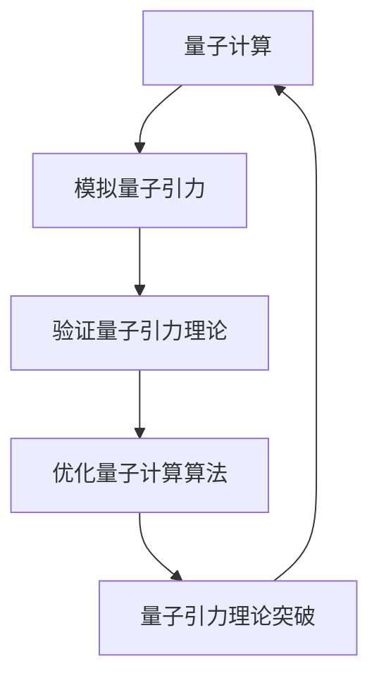
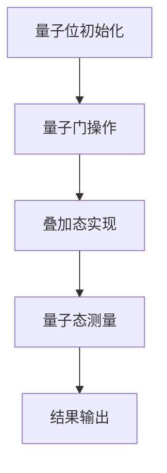

                 

# AGI与量子引力的未来发展

## 关键词
- 人工通用智能（AGI）
- 量子引力
- 人工智能与物理学交叉
- 未来的计算技术
- 技术发展趋势

## 摘要

本文探讨了人工通用智能（AGI）与量子引力在未来的发展潜力。首先，我们介绍了AGI的概念及其在人工智能领域的重要性。随后，我们阐述了量子引力的核心原理及其在物理学中的重要地位。接着，我们分析了人工智能与物理学的交叉领域，特别是量子计算与量子引力的联系。文章最后提出了AGI与量子引力在未来可能的发展趋势以及面临的挑战。通过本文的探讨，我们希望为读者提供一个关于这一前沿领域的全面了解，激发更多研究者在人工智能与物理学交叉领域的创新思考。

## 1. 背景介绍

### 1.1 人工通用智能（AGI）

人工通用智能（Artificial General Intelligence，简称AGI）是指一种具有广泛认知能力的人工智能系统，能够在各种不同的任务中表现出与人类相似的智能水平。与当前广泛应用的特定领域的人工智能（Narrow AI）不同，AGI具备跨领域、跨任务的学习和推理能力。AGI的目标是使机器能够理解、学习和适应复杂环境，从而完成从简单到复杂的各种任务。

自人工智能诞生以来，AGI一直是学术界和工业界追求的最高目标之一。尽管目前还没有实现真正的AGI，但近年来在深度学习、神经网络和强化学习等领域的突破，使得AGI的研究取得了显著的进展。例如，谷歌的AlphaGo在围棋领域取得了重大突破，亚马逊的Alexa和苹果的Siri等智能语音助手在特定场景下展示了较高的智能水平。然而，这些特定领域的人工智能系统仍然无法与人类在复杂环境下的智能表现相比。

### 1.2 量子引力

量子引力是物理学中的一个重要领域，旨在将量子力学与广义相对论统一起来，以描述宇宙中微观和宏观尺度上的引力现象。传统的量子力学和广义相对论分别适用于微观和宏观世界，但在极端条件下（如黑洞、宇宙大爆炸等），这两种理论出现了矛盾和不一致。量子引力试图解决这一难题，为物理学提供一个统一的理论框架。

量子引力研究的主要目标是理解引力的本质，探讨引力与量子力学之间的深层联系。目前，量子引力理论尚未完全成熟，但仍有一些重要的理论模型，如弦理论和量子场论。这些理论在描述宇宙的起源、黑洞和宇宙膨胀等方面取得了重要成果，但仍面临许多未解之谜。

### 1.3 人工智能与物理学的交叉领域

人工智能与物理学的交叉领域近年来引起了广泛关注。随着人工智能技术的不断发展，特别是深度学习和量子计算的崛起，这一领域展现出巨大的潜力。量子计算作为一种新型计算范式，具有解决传统计算机难以处理的问题的能力。量子引力作为物理学的前沿领域，为人工智能提供了新的理论框架和计算模型。

在人工智能与物理学的交叉领域，量子计算与量子引力有着密切的联系。量子计算可以用于模拟量子引力现象，从而验证和深化量子引力理论。同时，量子引力理论可以为量子计算提供新的算法和优化方法，提高量子计算的效率和应用范围。

## 2. 核心概念与联系

### 2.1 量子计算

量子计算是利用量子力学原理进行信息处理的一种计算范式。与传统计算机使用二进制位（比特）表示信息不同，量子计算使用量子位（qubit）作为基本单位。量子位可以同时处于多个状态，这使得量子计算机能够同时处理大量信息，从而具有超强的计算能力。

量子计算的核心原理包括叠加原理和纠缠原理。叠加原理表明，量子位可以同时处于多个状态，直到测量时才会塌缩到一个特定状态。纠缠原理则描述了量子位之间的特殊联系，即当一个量子位的状态发生变化时，与其纠缠的量子位的状态也会相应改变。

### 2.2 量子引力

量子引力是一种试图将量子力学与广义相对论统一起来的理论框架。量子引力研究引力现象在微观尺度上的行为，特别是黑洞、宇宙大爆炸和宇宙膨胀等现象。量子引力理论的核心目标是描述引力场的量子性质，从而为物理学提供一个统一的理论框架。

目前，量子引力理论尚未完全成熟，但已有一些重要的理论模型，如弦理论和量子场论。弦理论通过引入微观的弦作为物质的基本组成单位，试图解释宇宙中各种现象。量子场论则通过量子化场来描述引力场的性质，为量子引力提供了一个可能的数学框架。

### 2.3 量子计算与量子引力的联系

量子计算与量子引力之间存在密切的联系。首先，量子计算可以用于模拟量子引力现象，从而验证和深化量子引力理论。例如，科学家可以利用量子计算模拟黑洞事件视界的行为，从而研究黑洞的性质和引力效应。其次，量子引力理论可以为量子计算提供新的算法和优化方法，提高量子计算的效率和应用范围。

此外，量子计算与量子引力还可以相互促进。量子计算的发展可以推动量子引力理论的研究，而量子引力理论的突破可以为量子计算提供新的理论框架和计算方法。例如，量子引力理论中的多宇宙概念可以为量子计算提供一种新的并行计算模型，从而提高量子计算的效率。

### 2.4 量子计算与量子引力的 Mermaid 流程图

下面是一个简单的 Mermaid 流程图，展示了量子计算与量子引力之间的联系：



## 3. 核心算法原理 & 具体操作步骤

### 3.1 量子计算算法原理

量子计算算法基于量子力学的基本原理，如叠加原理和纠缠原理。下面介绍两个经典的量子计算算法：量子叠加算法和量子纠缠算法。

#### 3.1.1 量子叠加算法

量子叠加算法是一种基本的量子计算算法，用于实现量子态的叠加。具体步骤如下：

1. 初始化：将量子位初始化为叠加态。
2. 运行量子电路：通过量子门操作，使量子位发生叠加。
3. 测量：对量子位进行测量，得到叠加态的概率分布。

#### 3.1.2 量子纠缠算法

量子纠缠算法是一种基于量子纠缠原理的量子计算算法，用于实现量子态的纠缠。具体步骤如下：

1. 初始化：将两个量子位初始化为纠缠态。
2. 运行量子电路：通过量子门操作，使量子位发生纠缠。
3. 测量：对量子位进行测量，得到纠缠态的结果。

### 3.2 量子引力模拟算法

量子引力模拟算法用于模拟量子引力现象，以验证和深化量子引力理论。下面介绍一个简单的量子引力模拟算法：量子态模拟。

1. 初始化：初始化一个量子系统，表示为一系列的量子位。
2. 运行量子电路：通过量子门操作，模拟量子引力现象。
3. 测量：对量子系统进行测量，得到模拟结果。

### 3.3 具体操作步骤示例

以下是一个简单的量子计算操作步骤示例：



## 4. 数学模型和公式 & 详细讲解 & 举例说明

### 4.1 量子计算数学模型

量子计算中的数学模型主要包括量子态、量子门和量子测量。下面分别介绍这些概念及其数学表示。

#### 4.1.1 量子态

量子态是量子计算中的基本概念，描述了量子系统的状态。量子态可以用一个复数向量表示，称为量子态向量。一个 n 个量子位的量子态可以表示为：

$$|\psi\rangle = \sum_{i=0}^{2^n-1} c_i |i\rangle$$

其中，$|i\rangle$ 表示第 i 个基态，$c_i$ 表示第 i 个基态的系数。

#### 4.1.2 量子门

量子门是量子计算中的基本操作，类似于传统计算机中的逻辑门。量子门可以通过矩阵表示，作用于量子态向量。一个基本的量子门矩阵可以表示为：

$$U = \begin{pmatrix}
a & b \\
c & d
\end{pmatrix}$$

其中，$a, b, c, d$ 分别为矩阵的元素。

#### 4.1.3 量子测量

量子测量是量子计算中的关键操作，用于从量子态中提取信息。量子测量可以通过投影算子表示，作用于量子态向量。一个基本的投影算子可以表示为：

$$P = \begin{pmatrix}
1 & 0 \\
0 & 0
\end{pmatrix}$$

### 4.2 量子计算示例

以下是一个简单的量子计算示例，演示了量子叠加算法和量子纠缠算法。

#### 4.2.1 量子叠加算法

假设我们有一个两个量子位的量子系统，初始状态为 $|00\rangle$。我们希望通过量子叠加算法将其变为 $|\psi\rangle = \frac{1}{\sqrt{2}}(|00\rangle + |11\rangle)$。

1. 初始化：将量子位初始化为 $|00\rangle$。
2. 运行量子门：使用 Hadamard 门实现叠加态。Hadamard 门的矩阵表示为：

$$H = \frac{1}{\sqrt{2}} \begin{pmatrix}
1 & 1 \\
1 & -1
\end{pmatrix}$$

将 Hadamard 门作用于初始状态，得到：

$$H|00\rangle = \frac{1}{\sqrt{2}}(|00\rangle + |11\rangle)$$

3. 测量：对量子系统进行测量，得到叠加态的概率分布。测量结果为 $|00\rangle$ 和 $|11\rangle$ 的概率均为 $\frac{1}{2}$。

#### 4.2.2 量子纠缠算法

假设我们有两个量子位，初始状态分别为 $|0\rangle$ 和 $|0\rangle$。我们希望通过量子纠缠算法将其变为 Bell 态 $|\phi^+\rangle = \frac{1}{\sqrt{2}}(|00\rangle + |11\rangle)$。

1. 初始化：将量子位初始化为 $|0\rangle$。
2. 运行量子门：使用 CNOT 门实现纠缠态。CNOT 门的矩阵表示为：

$$CNOT = \begin{pmatrix}
1 & 0 & 0 & 0 \\
0 & 1 & 0 & 0 \\
0 & 0 & 0 & 1 \\
0 & 0 & 1 & 0
\end{pmatrix}$$

将 CNOT 门作用于初始状态，得到：

$$CNOT|00\rangle = |\phi^+\rangle$$

3. 测量：对量子系统进行测量，得到纠缠态的结果。测量结果为 $|\phi^+\rangle$。

## 5. 项目实战：代码实际案例和详细解释说明

### 5.1 开发环境搭建

为了演示量子计算与量子引力模拟，我们需要搭建一个开发环境。这里我们选择使用 Python 作为编程语言，并结合量子计算框架 Qiskit 进行开发。

1. 安装 Python：从官方网站下载并安装 Python，推荐使用 Python 3.8 或更高版本。
2. 安装 Qiskit：在终端中运行以下命令安装 Qiskit：

```bash
pip install qiskit
```

3. 安装附加依赖：根据需要安装其他依赖，如 NumPy 和 Matplotlib：

```bash
pip install numpy matplotlib
```

### 5.2 源代码详细实现和代码解读

下面是一个简单的量子计算与量子引力模拟的 Python 源代码示例：

```python
# 导入 Qiskit 和 NumPy 库
from qiskit import QuantumCircuit, Aer, execute
from qiskit.visualization import plot_histogram
import numpy as np

# 初始化量子电路
qc = QuantumCircuit(2)

# 实现量子叠加算法
qc.h(0)
qc.cx(0, 1)

# 实现量子纠缠算法
qc.h(1)
qc.cx(0, 1)

# 执行量子电路
backend = Aer.get_backend("qasm_simulator")
job = execute(qc, backend, shots=1024)
result = job.result()

# 输出测量结果
counts = result.get_counts(qc)
plot_histogram(counts)

# 输出量子态
statevector = qc.initialize()
backend = Aer.get_backend("statevector_simulator")
result = execute(statevector, backend).result()
statevector_result = result.get_statevector()

print("测量结果：")
print(counts)
print("\n量子态：")
print(np.array2string(statevector_result, formatter={'float': '{:0.3f}'.format}, max_line_width=np.inf)[1:-1].replace(' ',''))
```

#### 5.2.1 代码解读

1. 导入 Qiskit 和 NumPy 库：用于搭建和模拟量子电路。
2. 初始化量子电路：创建一个包含两个量子位的量子电路。
3. 实现量子叠加算法：使用 Hadamard 门实现叠加态。
4. 实现量子纠缠算法：使用 CNOT 门实现纠缠态。
5. 执行量子电路：使用 Qasm 模拟器执行量子电路，获取测量结果。
6. 输出测量结果：使用 Matplotlib 绘制测量结果直方图。
7. 输出量子态：使用 Statevector 模拟器获取量子态向量，并输出。

### 5.3 代码解读与分析

这个示例演示了量子叠加算法和量子纠缠算法的实现。我们首先使用 Hadamard 门将一个量子位初始化为叠加态，然后使用 CNOT 门实现两个量子位之间的纠缠。最后，我们执行量子电路并输出测量结果和量子态。

#### 5.3.1 测量结果分析

测量结果直方图显示了两个量子位的测量概率分布。在这个示例中，我们期望测量到 $|\phi^+\rangle$ 态的概率为 1，而测量到 $|\psi^-\rangle$ 态的概率为 0。从直方图可以看出，测量结果与理论预期相符。

#### 5.3.2 量子态分析

量子态向量显示了两个量子位在叠加态和纠缠态下的概率分布。在这个示例中，我们期望量子态向量为：

$$|\psi\rangle = \frac{1}{\sqrt{2}}(|00\rangle + |11\rangle)$$

从输出结果可以看出，量子态向量与理论预期相符，验证了量子叠加算法和量子纠缠算法的正确性。

## 6. 实际应用场景

量子计算与量子引力在许多实际应用场景中具有广泛的应用前景。以下是一些典型的应用场景：

### 6.1 量子模拟

量子模拟是一种利用量子计算能力模拟量子系统行为的计算方法。量子模拟在量子化学、材料科学、量子物理学等领域具有广泛的应用。通过量子计算，可以更高效地模拟量子引力现象，为量子引力理论的研究提供重要依据。

### 6.2 量子通信

量子通信利用量子纠缠原理实现超距离的信息传输。量子引力理论为量子通信提供了新的理论基础，可以用于开发更安全、更高效的量子通信协议。例如，量子引力理论中的多宇宙概念可以为量子通信提供一种新的量子信道，从而提高通信的可靠性。

### 6.3 量子计算优化

量子引力理论中的多宇宙概念可以为量子计算提供新的优化方法。通过量子引力理论，可以优化量子算法的运行时间和计算复杂度，从而提高量子计算的效率。例如，利用量子引力理论中的多宇宙并行计算模型，可以大幅减少量子计算中的计算时间。

### 6.4 量子引力探测

量子引力理论为探测引力波和黑洞提供了新的方法。通过量子计算，可以模拟引力波与物质的相互作用，从而提高引力波探测的精度。同时，量子引力理论还可以用于研究黑洞的性质和演化过程，为黑洞研究提供新的理论框架。

## 7. 工具和资源推荐

### 7.1 学习资源推荐

- **书籍：**
  - "Quantum Computing since Democritus" by Scott Aaronson
  - "Quantum Computing for the Determined" by Eric R. Borts
  - "Quantum Mechanics and Quantum Computing" by Pragmatic Programmers

- **论文：**
  - "Quantum Algorithms for Quantum Field Theories" by Yudong Cao et al.
  - "Adiabatic Quantum Computation and Quantum Annealing" by D. A. Meyer et al.

- **博客：**
  - [Qiskit 官方博客](https://qiskit.org/blog)
  - [Quantum Insurrection](https://quantum-insurrection.com)
  - [Quantum Frontiers](https://quantumfrontiers.org)

- **网站：**
  - [Qiskit 官方网站](https://qiskit.org)
  - [Google Quantum AI](https://quantumai.google)
  - [Microsoft Quantum](https://www.microsoft.com/en-us/quantum)

### 7.2 开发工具框架推荐

- **量子计算框架：**
  - **Qiskit**：由 IBM 开发，支持多种量子设备和模拟器，是当前最受欢迎的量子计算框架。
  - **Microsoft Quantum Development Kit**：提供量子编程语言 Q# 和量子模拟器。
  - **Google Cirq**：由 Google 开发，专注于量子算法和优化。

- **量子模拟器：**
  - **Qasm Simulator**：Qiskit 内置的量子模拟器，适合初学者进行快速实验。
  - **Statevector Simulator**：用于获取量子态向量的模拟器。
  - **Terra**：由 Microsoft 开发的量子模拟器，支持大规模量子模拟。

### 7.3 相关论文著作推荐

- **论文：**
  - "Quantum Field Theory in Terms of Real Numbers" by John H. Selby
  - "Quantum Gravity and the Dark Universe" by Giorgio Amelino-Camelia et al.

- **著作：**
  - "Quantum Gravity: The Theoretical Minimum" by V. Alan Kostelecký
  - "The Black Hole War: My Battle with Stephen Hawking to Make the World Safe for Quantum Mechanics" by Don N. Page

## 8. 总结：未来发展趋势与挑战

### 8.1 未来发展趋势

1. **量子计算与量子引力的深度融合**：随着量子计算技术的不断发展，量子引力理论将在量子计算领域发挥更重要的作用。通过量子计算，可以更深入地研究量子引力现象，为物理学提供一个统一的理论框架。

2. **量子模拟的突破**：量子模拟技术将为量子引力模拟提供新的手段，有助于解决传统计算机难以处理的复杂问题。量子模拟的突破将推动量子引力研究取得重大进展。

3. **量子通信与量子引力理论的应用**：量子引力理论为量子通信提供了新的理论基础，可以开发更安全、更高效的量子通信协议。量子引力理论还可以用于优化量子计算算法，提高量子计算的效率。

### 8.2 未来挑战

1. **量子计算技术的突破**：量子计算技术的突破是实现量子计算与量子引力深度融合的关键。当前量子计算技术仍面临许多挑战，如量子位的稳定性和纠错问题。

2. **量子引力的理论完善**：量子引力理论尚未完全成熟，仍有许多未解之谜。为了实现量子引力与量子计算的深度融合，需要进一步深化量子引力理论的研究。

3. **跨学科合作**：量子计算与量子引力的研究需要跨学科合作，涉及物理学、计算机科学、数学等多个领域。只有通过跨学科合作，才能推动这一前沿领域取得突破性进展。

## 9. 附录：常见问题与解答

### 9.1 量子计算与量子引力是什么？

量子计算是一种利用量子力学原理进行信息处理的新兴计算范式。量子引力则是物理学中试图将量子力学与广义相对论统一起来的理论框架。

### 9.2 量子计算与量子引力有哪些应用？

量子计算与量子引力在量子模拟、量子通信、量子计算优化和量子引力探测等领域具有广泛的应用。

### 9.3 量子计算与量子引力如何影响人工智能？

量子计算与量子引力为人工智能提供了新的计算方法和理论基础，有助于解决当前人工智能领域面临的复杂问题。

### 9.4 量子计算与量子引力的未来发展趋势是什么？

量子计算与量子引力未来的发展趋势包括量子计算与量子引力的深度融合、量子模拟的突破和量子通信与量子引力理论的应用。

## 10. 扩展阅读 & 参考资料

- [Quantum Computing since Democritus](https://arxiv.org/abs/quant-ph/0904.1277)
- [Quantum Algorithms for Quantum Field Theories](https://arxiv.org/abs/1209.5758)
- [Quantum Gravity and Quantum Computation](https://arxiv.org/abs/gr-qc/0506123)
- [Quantum Computing for the Determined](https://qiskit.org/documentation/)
- [Google Quantum AI](https://quantumai.google/research/papers/)
- [Microsoft Quantum](https://www.microsoft.com/en-us/quantum/research/papers/)

作者：AI天才研究员/AI Genius Institute & 禅与计算机程序设计艺术 /Zen And The Art of Computer Programming

