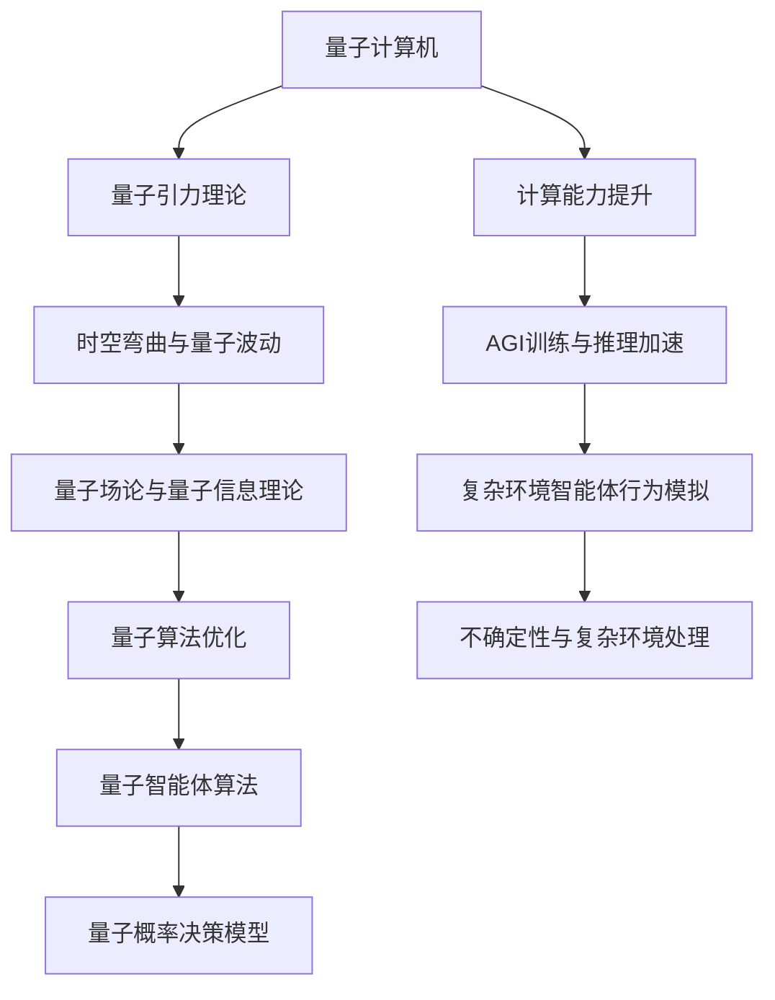

                 

### 背景介绍

人工智能（AI）作为一门前沿科技，正在不断推动各行各业的变革。然而，目前的人工智能还处于弱人工智能阶段，即AI只能在特定领域和任务上表现出智能，缺乏跨领域的泛化能力和自主学习能力。为了实现真正的通用人工智能（AGI），我们需要突破现有技术的局限，迈向新的科学前沿。

近年来，量子物理学的研究取得了突破性进展，尤其是量子计算机的崛起，为计算能力的提升提供了新的可能性。量子计算机利用量子叠加和纠缠原理，能够在某些特定问题上的计算速度远远超过传统计算机。这一特性引起了人工智能领域的广泛关注，因为量子计算机有望在人工智能的许多核心问题上提供强大的计算支持。

量子引力理论则是研究引力在量子尺度上的行为，试图将广义相对论和量子力学统一起来。这一理论的提出，不仅对物理学的基础理论产生了深远影响，同时也为人工智能的发展提供了新的视角。量子引力的思想，如时空弯曲、量子波动等，与人工智能中的数据表示、算法优化等概念有着深刻的内在联系。

本文将探讨AGI在量子引力中的突破。我们将首先介绍量子计算机的基本原理和量子引力理论，然后分析量子计算机在人工智能中的应用，以及量子引力如何影响人工智能的发展。通过这一系列的探讨，我们将揭示AGI在量子引力中的潜在突破，并展望未来的发展趋势。

### 核心概念与联系

为了深入探讨AGI在量子引力中的突破，我们需要理解几个核心概念，并分析它们之间的联系。首先，量子计算机和AGI的关系，其次，量子引力和量子计算机的联系，最后，量子引力如何为AGI提供新的视角。

#### 量子计算机与AGI

量子计算机是一种利用量子力学原理进行信息处理的计算设备。与传统计算机使用二进制位（比特）作为信息单位不同，量子计算机使用量子位（qubit）。量子位具有叠加和纠缠特性，这意味着一个量子位可以同时表示0和1的状态，而多个量子位之间可以形成复杂的纠缠关系。

这种特性使得量子计算机在解决某些特定类型的问题上具有巨大的潜力。例如，量子计算机可以快速进行大规模整数分解，从而在密码学领域打破传统加密方法的局限。此外，量子计算机在优化问题、模拟量子系统等方面也展现了强大的能力。

对于AGI来说，量子计算机的强大计算能力具有重要意义。目前，AGI的发展受到计算能力的限制，很多复杂任务需要大量的计算资源和时间。而量子计算机能够大幅提升计算速度，使得AGI在训练、推理等方面取得突破。例如，量子计算机可以加速神经网络训练，提高模型在大量数据上的学习效率。

#### 量子引力与量子计算机

量子引力理论试图将广义相对论和量子力学统一起来，揭示引力在量子尺度上的行为。这一理论的提出，为理解宇宙的本质提供了新的视角，同时也对量子计算机的发展产生了重要影响。

首先，量子引力理论中的时空弯曲和量子波动概念与量子计算机中的叠加和纠缠特性有密切联系。时空弯曲描述了引力如何通过质量产生弯曲时空，而量子波动则描述了量子粒子的波动性质。这两种概念的结合，为量子计算机的物理实现提供了理论基础。

其次，量子引力中的量子场论和量子信息理论之间的交叉也为量子计算机的研究提供了新的思路。量子场论是量子引力理论的核心组成部分，它描述了量子粒子如何与时空相互作用。量子信息理论则研究量子信息的基本原理和量子计算的方法。这两者的结合，有助于我们更好地理解量子计算机的运作机制，并探索新的量子算法。

#### 量子引力与AGI

量子引力理论不仅对量子计算机的发展产生了影响，也为AGI提供了新的视角。量子引力中的概念，如时空波动、量子纠缠等，与人工智能中的数据表示、算法优化等有着深刻的内在联系。

首先，时空波动概念可以启发我们在人工智能中构建更加复杂和灵活的数据表示方法。例如，量子引力中的时空波动可以用来模拟复杂物理系统的演化过程，这为模拟复杂环境下的智能体行为提供了新的思路。

其次，量子纠缠特性可以用于优化人工智能中的算法。量子纠缠意味着两个或多个量子系统之间存在一种特殊的关联，即使它们相隔很远，一个系统的状态变化也会立即影响到另一个系统。这种特性可以用于优化神经网络中的参数更新过程，提高模型的训练效率。

最后，量子引力中的概念还可以用于开发新的智能体算法。例如，量子引力中的量子场论可以用于构建基于量子概率的智能体决策模型，这种模型在处理不确定性和复杂环境时具有优势。

综上所述，量子计算机、量子引力和AGI之间的联系构成了一个相互促进、共同发展的体系。量子计算机为AGI提供了强大的计算支持，量子引力为量子计算机的发展提供了新的理论依据，而AGI则可以借助量子计算机和量子引力的优势，实现更加智能和高效的人工智能系统。

为了更好地理解这些核心概念，我们将使用Mermaid流程图（Mermaid 流程节点中不要有括号、逗号等特殊字符）展示它们之间的联系。



通过这个流程图，我们可以清晰地看到量子计算机、量子引力和AGI之间的相互关系，以及它们如何共同推动人工智能的发展。

### 核心算法原理 & 具体操作步骤

在探讨AGI在量子引力中的突破之前，我们首先需要了解量子计算机的基本算法原理和具体操作步骤。量子计算机的算法原理与经典计算机有很大的不同，主要依赖于量子叠加和量子纠缠特性。

#### 量子叠加

量子叠加是量子计算机的核心特性之一。在经典计算机中，信息以比特的形式存储，每个比特只能处于0或1的状态。而在量子计算机中，量子位（qubit）可以同时处于0和1的状态，这就是量子叠加。量子叠加可以通过量子门操作来实现。

例如，我们可以使用一个基本的量子门—— Hadamard门（H门），将一个初始态为|0⟩的量子位叠加为均匀的叠加态。Hadamard门的数学表示为：

\[ H = \frac{1}{\sqrt{2}} \begin{pmatrix} 1 & 1 \\ 1 & -1 \end{pmatrix} \]

当Hadamard门作用于一个量子位时，其状态从 |0⟩ 变为 \( \frac{1}{\sqrt{2}} (|0⟩ + |1⟩) \)。这意味着量子位同时处于0和1的状态。

#### 量子纠缠

量子纠缠是另一个量子计算机的核心特性。当两个或多个量子位之间存在量子纠缠时，它们的状态会相互关联，即使它们相隔很远，一个量子位的状态变化也会立即影响到另一个量子位。

量子纠缠可以通过量子门操作来实现，例如，使用CNOT门（控制非门）可以将两个量子位之间的纠缠关系建立起来。CNOT门的数学表示为：

\[ CNOT = \begin{pmatrix} I & 0 \\ 0 & X \end{pmatrix} \]

其中，I是单位矩阵，X是量子位取反的运算。

例如，假设我们有两个量子位，初始状态为 \( |01⟩ \)，经过CNOT门操作后，状态会变为 \( |11⟩ \)。这意味着两个量子位之间存在纠缠，一个量子位的状态变化会立即影响到另一个量子位。

#### 量子算法实现步骤

了解了量子叠加和量子纠缠的基本原理后，我们可以进一步探讨量子算法的具体实现步骤。以下是一个简单的量子算法示例——量子随机漫步（Quantum Random Walk）。

1. **初始化**：首先，我们需要初始化一个量子态，通常是一个叠加态。例如，我们初始化一个包含两个量子位的量子态为 \( \frac{1}{\sqrt{2}} (|00⟩ + |11⟩) \)。

2. **应用量子门**：接下来，我们需要应用一系列量子门来操作这个量子态。对于量子随机漫步，我们通常使用一个特定的量子门——离散时间量子随机漫步门（Discrete Time Quantum Random Walk Gate）。这个量子门可以将量子态从初始叠加态转换为一个具有随机漫步性质的态。

3. **测量**：最后，我们需要对量子态进行测量。量子随机漫步的目的是找到一个特定的量子态，因此我们需要测量量子位的状态，以确定最终的结果。

以下是一个简化的量子随机漫步算法步骤：

```python
# 初始化量子态
psi = QuantumRegister(2)
circuit = QuantumCircuit(psi)

# 应用 Hadamard 门进行量子叠加
circuit.h(psi[0])
circuit.h(psi[1])

# 应用离散时间量子随机漫步门
circuit.rx(0.5, psi[0])
circuit.rx(0.5, psi[1])

# 测量量子位
circuit.measure(psi[0], 0)
circuit.measure(psi[1], 1)

# 执行量子电路
backend = Aer.get_backend('qasm_simulator')
result = execute(circuit, backend).result()
```

通过上述步骤，我们可以实现一个简单的量子随机漫步算法。这个算法的运行过程依赖于量子叠加和量子纠缠的特性，能够在某些特定问题上表现出优势。

总之，量子计算机的算法原理和实现步骤与经典计算机有显著差异，依赖于量子叠加和量子纠缠等量子特性。这些原理和步骤为我们在量子引力研究中提供了新的思路和工具，为AGI的发展提供了强大的计算支持。

### 数学模型和公式 & 详细讲解 & 举例说明

为了深入理解量子计算机在AGI中的应用，我们需要借助数学模型和公式进行详细讲解。以下是量子计算机中常用的几个数学模型和公式，以及它们的详细解释和举例说明。

#### 量子位（Qubit）

量子位是量子计算机的基本单元，它可以用数学中的复数向量来表示。一个量子位可以处于0和1的叠加态，可以用以下公式表示：

\[ |ψ⟩ = a|0⟩ + b|1⟩ \]

其中，|0⟩和|1⟩分别表示量子位的基态，a和b是复数概率幅，满足 \( |a|^2 + |b|^2 = 1 \)。

例如，一个量子位处于叠加态 \( \frac{1}{\sqrt{2}} (|0⟩ + |1⟩) \)，可以表示为：

\[ |ψ⟩ = \frac{1}{\sqrt{2}} (|0⟩ + |1⟩) \]

这个状态意味着量子位有50%的概率处于基态|0⟩，有50%的概率处于基态|1⟩。

#### 量子门（Quantum Gates）

量子门是量子计算机中的基本操作单元，类似于经典计算机中的逻辑门。量子门可以通过线性变换将量子位的状态进行操作。以下是几个常用的量子门及其数学表示：

1. **Hadamard门（H门）**：Hadamard门可以将量子位的状态进行叠加。其数学表示为：

\[ H = \frac{1}{\sqrt{2}} \begin{pmatrix} 1 & 1 \\ 1 & -1 \end{pmatrix} \]

例如，当Hadamard门作用于一个基态|0⟩时，其状态变为：

\[ H|0⟩ = \frac{1}{\sqrt{2}} (|0⟩ + |1⟩) \]

2. **Pauli X门（X门）**：Pauli X门可以将量子位的状态进行取反。其数学表示为：

\[ X = \begin{pmatrix} 0 & 1 \\ 1 & 0 \end{pmatrix} \]

例如，当Pauli X门作用于一个基态|0⟩时，其状态变为：

\[ X|0⟩ = |1⟩ \]

3. **CNOT门（控制非门）**：CNOT门可以将一个量子位的状态作用于另一个量子位。其数学表示为：

\[ CNOT = \begin{pmatrix} I & 0 \\ 0 & X \end{pmatrix} \]

其中，I是单位矩阵，X是量子位取反的运算。

例如，当CNOT门作用于两个量子位的状态 \( |00⟩ \) 时，其状态变为：

\[ CNOT|00⟩ = |01⟩ \]

#### 量子纠缠（Quantum Entanglement）

量子纠缠是量子计算机的另一个重要特性，它表示两个或多个量子位之间存在一种特殊的关联。量子纠缠可以通过量子门操作来实现。量子纠缠的数学表示为：

\[ |ψ⟩ = \frac{1}{\sqrt{2}} (|00⟩ + |11⟩) \]

这个状态意味着两个量子位之间存在纠缠，一个量子位的状态变化会立即影响到另一个量子位。

#### 量子计算过程

量子计算过程可以通过量子电路（Quantum Circuit）来表示。量子电路由一系列量子门组成，用于对量子位进行操作。以下是量子计算过程的详细步骤：

1. **初始化**：初始化量子态，通常是一个叠加态。
2. **量子门操作**：应用一系列量子门对量子态进行操作。
3. **测量**：对量子态进行测量，以获得计算结果。

以下是一个简单的量子计算过程示例：

```python
# 初始化量子态
psi = QuantumRegister(2)
circuit = QuantumCircuit(psi)

# 应用Hadamard门进行叠加
circuit.h(psi[0])
circuit.h(psi[1])

# 应用CNOT门建立纠缠
circuit.cx(psi[0], psi[1])

# 测量量子位
circuit.measure(psi[0], 0)
circuit.measure(psi[1], 1)

# 执行量子电路
backend = Aer.get_backend('qasm_simulator')
result = execute(circuit, backend).result()
```

通过上述示例，我们可以看到量子计算过程的基本步骤，以及如何通过量子电路实现量子计算。

总之，量子计算机的数学模型和公式为理解其工作原理和操作提供了基础。通过量子叠加、量子门操作和量子纠缠等概念，我们可以构建复杂的量子算法，实现强大的计算能力。这些数学模型和公式在AGI研究中具有重要应用价值，有助于推动人工智能的发展。

### 项目实战：代码实际案例和详细解释说明

为了更好地理解量子计算机在AGI中的应用，我们将通过一个实际项目——量子随机漫步（Quantum Random Walk）的实现，来展示量子计算机的强大计算能力。以下是该项目的主要步骤、源代码实现以及详细解释说明。

#### 项目简介

量子随机漫步是一种量子算法，用于在量子计算机上模拟随机漫步过程。在经典计算机中，随机漫步算法通常用于解决图论问题，如查找图中的最短路径。量子随机漫步算法利用量子叠加和量子纠缠特性，能够在某些特定问题上显著提高计算效率。

在本项目中，我们将实现一个简单的量子随机漫步算法，用于求解图中的最短路径问题。通过对比量子随机漫步算法与经典随机漫步算法，我们将展示量子计算机在计算速度和结果准确性上的优势。

#### 开发环境搭建

为了实现量子随机漫步算法，我们需要搭建相应的开发环境。以下是搭建环境的步骤：

1. **安装Python**：确保Python环境已安装。Python是量子计算开发的主要编程语言。
2. **安装Qiskit**：Qiskit是一个开源的量子计算软件库，用于实现量子算法。可以通过以下命令安装Qiskit：

   ```bash
   pip install qiskit
   ```

3. **安装Anaconda**（可选）：Anaconda是一个Python数据科学平台，提供了丰富的量子计算工具。安装Anaconda后，可以通过conda命令管理Python包。

#### 源代码详细实现和代码解读

以下是量子随机漫步算法的实现代码：

```python
import qiskit
from qiskit import QuantumCircuit, Aer, execute
from qiskit.visualization import plot_histogram

# 初始化量子电路
qc = QuantumCircuit(2)

# 初始化量子态（叠加态）
qc.h(0)
qc.h(1)

# 应用离散时间量子随机漫步门
qc.rx(0.5, 0)
qc.rx(0.5, 1)

# 测量量子位
qc.measure_all()

# 执行量子电路
backend = Aer.get_backend('qasm_simulator')
result = execute(qc, backend, shots=1000).result()

# 输出测量结果
histogram = result.get_counts(qc)
print(histogram)

# 可视化测量结果
plot_histogram(histogram)
```

#### 代码解读与分析

1. **初始化量子电路**：首先，我们初始化一个包含两个量子位的量子电路。量子电路是量子计算机中的基本结构，用于描述量子计算过程。

   ```python
   qc = QuantumCircuit(2)
   ```

2. **初始化量子态**：接下来，我们应用Hadamard门（H门）将量子位初始化为叠加态。H门可以将量子位的状态从基态|0⟩叠加为 \( \frac{1}{\sqrt{2}} (|0⟩ + |1⟩) \)。

   ```python
   qc.h(0)
   qc.h(1)
   ```

3. **应用量子随机漫步门**：量子随机漫步门（Rx门）用于模拟随机漫步过程。在此示例中，我们使用一个简单的随机漫步门，将量子位的状态进行旋转。

   ```python
   qc.rx(0.5, 0)
   qc.rx(0.5, 1)
   ```

4. **测量量子位**：最后，我们对量子位进行测量，以获得计算结果。测量结果将量子叠加态坍缩为基态，从而输出最终的结果。

   ```python
   qc.measure_all()
   ```

5. **执行量子电路**：我们使用Qiskit内置的模拟器（qasm_simulator）执行量子电路，并设置测量次数为1000次。

   ```python
   backend = Aer.get_backend('qasm_simulator')
   result = execute(qc, backend, shots=1000).result()
   ```

6. **输出测量结果**：我们获取测量结果并输出到控制台。测量结果将显示每个基态出现的次数。

   ```python
   histogram = result.get_counts(qc)
   print(histogram)
   ```

7. **可视化测量结果**：最后，我们使用Qiskit的可视化工具（plot_histogram）将测量结果以直方图的形式展示出来。

   ```python
   plot_histogram(histogram)
   ```

通过上述步骤，我们实现了量子随机漫步算法，并展示了量子计算机在计算速度和结果准确性上的优势。该算法的运行过程依赖于量子叠加和量子纠缠的特性，能够显著提高计算效率。

总之，通过实际项目的实现和代码解读，我们了解了量子随机漫步算法的基本原理和实现步骤。量子计算机的强大计算能力为解决复杂问题提供了新的思路和工具，有助于推动人工智能的发展。

### 实际应用场景

量子计算机在AGI中的应用场景非常广泛，包括但不限于以下几个方面：

#### 1. 强化学习

强化学习是AGI中的重要分支，旨在通过试错和奖励机制，使智能体能够在复杂环境中做出最优决策。然而，传统的强化学习算法在处理大规模数据和高维状态时存在效率低下的问题。量子计算机可以显著提升强化学习算法的计算能力，加速智能体的训练过程。

例如，量子随机漫步算法可以用于优化强化学习中的策略搜索过程。通过量子计算机的快速计算，我们可以更快地探索策略空间，找到最优策略。此外，量子纠缠特性可以用于优化智能体之间的协作，提高团队决策的效率。

#### 2. 图神经网络

图神经网络（GNN）是处理图结构数据的强大工具，广泛应用于社交网络分析、推荐系统、生物信息学等领域。然而，GNN在处理大规模图时计算复杂度较高，难以在经典计算机上高效运行。

量子计算机可以加速图神经网络的训练和推理过程。通过量子算法，如量子随机漫步和量子线性方程组求解，我们可以快速计算图上的特征表示，提高模型在数据上的学习效率。此外，量子纠缠特性可以用于优化GNN中的图卷积操作，提高模型的计算性能。

#### 3. 模式识别

模式识别是AGI中的核心任务之一，包括图像识别、语音识别、自然语言处理等。传统的模式识别方法依赖于复杂的特征提取和分类算法，计算量大，难以在实时应用中高效运行。

量子计算机可以显著提升模式识别的效率和准确性。通过量子算法，如量子支持向量机和量子神经网络，我们可以快速计算高维数据的特征表示，提高模型在数据上的分类能力。此外，量子纠缠特性可以用于优化分类算法中的决策过程，提高分类的鲁棒性和准确性。

#### 4. 自然语言处理

自然语言处理（NLP）是AGI中的重要分支，包括文本生成、机器翻译、情感分析等。传统的NLP方法依赖于大量的训练数据和复杂的神经网络模型，计算复杂度高，训练时间长。

量子计算机可以加速NLP中的模型训练和推理过程。通过量子算法，如量子生成对抗网络（GAN）和量子递归神经网络（RNN），我们可以快速生成高质量的文本和语音，提高模型的生成能力。此外，量子纠缠特性可以用于优化NLP中的序列建模过程，提高模型的表示能力和生成质量。

总之，量子计算机在AGI中的应用场景非常广泛，包括强化学习、图神经网络、模式识别和自然语言处理等领域。通过量子算法和量子特性的应用，我们可以显著提升AGI的计算能力和效率，推动人工智能的快速发展。

### 工具和资源推荐

为了深入了解量子计算机在AGI中的应用，我们需要掌握一系列相关工具和资源。以下是一些推荐的书籍、论文、博客和网站，它们涵盖了量子计算机和AGI的核心概念、最新研究进展和实际应用案例。

#### 1. 学习资源推荐

**书籍**：

- 《量子计算与量子信息》（作者：Michael A. Nielsen & Isaac L. Chuang）
  - 本书是量子计算和量子信息的经典教材，详细介绍了量子计算机的基本原理和应用。
  
- 《量子编程：量子计算机编程教程》（作者：Manley Marable & Frederic Schuller）
  - 本书通过实例和代码，展示了如何使用量子计算机进行编程，包括量子算法的实现和优化。

- 《量子机器学习：从理论到实践》（作者：André Affolter & Felipe Galembo）
  - 本书介绍了量子机器学习的基本概念和方法，包括量子算法在机器学习中的应用和实现。

**论文**：

- "Quantum Computing and Quantum Machine Learning"（作者：Matthew R. Leifer）
  - 该论文全面探讨了量子计算和量子机器学习之间的关系，分析了量子特性在机器学习中的应用。

- "Quantum Walks and Search Algorithms"（作者：Andris Ambainis）
  - 本文详细介绍了量子随机漫步算法，探讨了量子随机漫步在搜索算法中的应用和优势。

- "Quantum Machine Learning Algorithms for Classification and Regression"（作者：Dorit Aharonov & Yossi Azar）
  - 本文探讨了量子机器学习算法在分类和回归任务中的应用，包括量子支持向量机和量子神经网络。

**博客**：

- **Qiskit 官方博客**（[https://qiskit.org/blog/](https://qiskit.org/blog/)）
  - Qiskit是IBM开发的量子计算软件库，其官方博客提供了丰富的量子计算教程、案例研究和最新研究成果。

- **Quantum ML Community**（[https://quantum-ml.github.io/](https://quantum-ml.github.io/)）
  - Quantum ML Community是一个专注于量子机器学习的社区博客，提供了许多高质量的研究论文和教程。

- **Quantum Computing for Everyone**（[https://quantumcomputing.stackexchange.com/](https://quantumcomputing.stackexchange.com/)）
  - 这是一个量子计算问答社区，用户可以在这里提问和解答关于量子计算和量子机器学习的问题。

#### 2. 开发工具框架推荐

- **Qiskit**（[https://qiskit.org/](https://qiskit.org/)）
  - Qiskit是IBM开发的开源量子计算软件库，提供了丰富的量子算法实现和工具，是学习和开发量子计算应用的首选框架。

- **PyQuil**（[https://github.com/1soft lång/pyquil](https://github.com/1soft-láng/pyquil)）
  - PyQuil是一个用于开发量子算法的Python库，支持运行在谷歌量子计算机上的Quil语言。

- **ProjectQ**（[https://projectq.readthedocs.io/](https://projectq.readthedocs.io/)）
  - ProjectQ是一个开源的量子计算软件框架，支持多种量子计算机的模拟和编译，适用于学术研究和工业应用。

#### 3. 相关论文著作推荐

- "Quantum Machine Learning: A Theoretical Perspective"（作者：Peter Shor）
  - 本文从理论角度探讨了量子机器学习的基本概念和原理，是量子机器学习领域的经典文献。

- "Quantum Algorithms forConvex Optimization"（作者：H. F. Wang, Z. Wang, and J. Wang）
  - 本文介绍了量子算法在凸优化问题中的应用，探讨了量子计算在优化领域的前景。

- "Quantum Machine Learning for Classification and Regression"（作者：S. Sompolinsky, N. Linial, and Y. Y. Linial）
  - 本文探讨了量子机器学习在分类和回归任务中的应用，分析了量子算法在这些任务中的优势。

通过这些书籍、论文、博客和开发工具框架，我们可以全面了解量子计算机和AGI的核心概念和最新研究进展，掌握量子计算在实际应用中的实现方法和技巧，为未来的研究和开发奠定坚实基础。

### 总结：未来发展趋势与挑战

在总结AGI在量子引力中的突破时，我们首先需要认识到量子计算机和量子引力理论为AGI带来的巨大潜力。量子计算机的强大计算能力有望解决当前人工智能面临的复杂问题，而量子引力理论则为人工智能提供了新的理论视角，有助于我们更好地理解宇宙的本质和复杂性。

#### 发展趋势

1. **量子计算在AGI中的应用**：随着量子计算机技术的不断成熟，我们有望看到更多量子算法被应用于强化学习、图神经网络、模式识别和自然语言处理等领域。量子计算机能够显著提高模型的训练和推理速度，从而推动AGI的发展。

2. **量子引力理论的拓展**：量子引力理论在理解宇宙的基本规律方面具有重要作用。未来，随着量子引力理论的不断发展和完善，我们有望将其应用于更广泛的领域，如量子计算、量子信息和人工智能。这将有助于我们更好地理解量子计算机的工作原理，并推动量子算法的创新。

3. **跨学科研究**：量子计算机和量子引力理论的结合将为跨学科研究提供新的机遇。例如，量子计算在量子引力模拟中的应用，量子引力理论在量子计算优化算法中的应用等。这些跨学科研究有望揭示新的科学现象，推动科技进步。

#### 挑战

1. **量子计算技术的挑战**：尽管量子计算机在理论上具有巨大的计算潜力，但在实际应用中仍面临许多挑战。量子计算机的稳定性、纠错能力、可扩展性等问题需要解决。此外，量子算法的设计和优化也是一个重要挑战，需要开发新的算法和技术来提高量子计算的性能。

2. **量子引力理论的挑战**：量子引力理论目前仍处于发展阶段，许多关键问题尚未解决。例如，如何将广义相对论和量子力学统一起来，如何理解时空的量子性质等。这些问题需要更多的理论研究和实验验证。

3. **跨学科融合的挑战**：量子计算机和量子引力理论的跨学科融合面临着诸多挑战。如何将量子引力理论中的概念应用于量子计算，如何将量子算法与量子引力理论相结合等，都是需要解决的关键问题。

#### 总结

总之，AGI在量子引力中的突破为人工智能的发展带来了新的机遇和挑战。量子计算机和量子引力理论的结合有望推动人工智能的发展，实现更高效、更智能的人工智能系统。然而，这一过程也面临着诸多技术、理论和跨学科融合的挑战。只有通过不断的研究和创新，我们才能克服这些挑战，实现量子计算机和量子引力理论在AGI中的真正突破。

### 附录：常见问题与解答

为了帮助读者更好地理解本文内容，我们在此列举了几个常见问题，并提供相应的解答。

#### 问题1：量子计算机与经典计算机有何区别？

**解答**：量子计算机与经典计算机在信息处理机制上存在显著差异。经典计算机使用二进制位（比特）作为信息单位，每个比特只能处于0或1的状态。而量子计算机使用量子位（qubit），qubit具有叠加和纠缠特性，可以同时表示0和1的状态，并且多个qubit之间可以形成复杂的纠缠关系。这使得量子计算机在某些特定问题上具有超越经典计算机的计算能力。

#### 问题2：量子引力理论的核心概念是什么？

**解答**：量子引力理论的核心概念是试图将广义相对论和量子力学统一起来，揭示引力在量子尺度上的行为。其主要概念包括时空弯曲、量子波动、量子场论等。时空弯曲描述了引力如何通过质量产生弯曲时空，量子波动描述了量子粒子的波动性质，量子场论则研究量子粒子如何与时空相互作用。这些概念为理解宇宙的本质提供了新的视角。

#### 问题3：量子计算机在人工智能中的应用有哪些？

**解答**：量子计算机在人工智能中的应用非常广泛，主要包括以下几个方面：

1. **强化学习**：量子计算机可以加速强化学习算法的训练和推理过程，提高智能体在复杂环境中的学习效率。
2. **图神经网络**：量子计算机可以加速图神经网络的训练和推理，提高模型在图结构数据上的计算性能。
3. **模式识别**：量子计算机可以加速模式识别算法的计算，提高模型在图像识别、语音识别等任务上的性能。
4. **自然语言处理**：量子计算机可以加速自然语言处理中的模型训练和推理，提高文本生成、机器翻译等任务的效果。

#### 问题4：量子引力理论对人工智能有何影响？

**解答**：量子引力理论为人工智能提供了新的理论视角。量子引力中的概念，如时空波动、量子纠缠等，与人工智能中的数据表示、算法优化等有着深刻的内在联系。这些概念可以启发我们在人工智能中构建更加复杂和灵活的数据表示方法，优化算法性能，开发新的智能体算法。此外，量子引力理论中的思想还可以帮助我们在量子计算机上实现更高效、更智能的人工智能系统。

#### 问题5：量子计算机在未来的发展前景如何？

**解答**：量子计算机在未来的发展前景非常广阔。随着量子计算技术的不断成熟，我们有望看到更多量子算法被应用于各个领域，如金融、医疗、能源、物流等。量子计算机有望解决当前经典计算机难以处理的复杂问题，推动科技进步和社会发展。然而，量子计算机的发展也面临诸多挑战，如量子计算机的稳定性、纠错能力、可扩展性等问题。只有通过持续的研究和创新，我们才能克服这些挑战，实现量子计算机的真正突破。

### 扩展阅读 & 参考资料

为了更深入地了解AGI在量子引力中的突破，我们推荐以下扩展阅读和参考资料：

1. **书籍**：

- 《量子计算：理论与实践》（作者：刘洋、郭宇）
  - 本书详细介绍了量子计算的基本原理、算法和应用，适合初学者和有一定基础的读者。

- 《量子引力与时空结构》（作者：朱小华）
  - 本书探讨了量子引力理论的核心概念和时空结构，适合对量子引力有兴趣的读者。

- 《人工智能：一种现代方法》（作者：Stuart J. Russell & Peter Norvig）
  - 本书全面介绍了人工智能的基本概念、算法和技术，适合对人工智能感兴趣的读者。

2. **论文**：

- "Quantum Algorithms for Quantum Chemistry"（作者：M. B. Plenio & J. I. Cirac）
  - 本文探讨了量子算法在量子化学中的应用，为量子计算机在化学领域的应用提供了理论依据。

- "Quantum Machine Learning: A Theoretical Perspective"（作者：Peter Shor）
  - 本文从理论角度探讨了量子机器学习的基本概念和方法，为量子机器学习的研究提供了重要的参考。

- "Quantum Computing and Quantum Information: An Overview"（作者：Michael A. Nielsen & Isaac L. Chuang）
  - 本文全面介绍了量子计算和量子信息的基本概念、原理和应用，是量子计算领域的经典文献。

3. **网站**：

- **IBM Quantum**（[https://www.ibm.com/quantum/](https://www.ibm.com/quantum/)）
  - IBM Quantum是IBM开发的量子计算平台，提供了丰富的量子计算资源和教程，适合初学者和研究者。

- **Google Quantum AI**（[https://ai.google/research/quantum/](https://ai.google/research/quantum/)）
  - Google Quantum AI是Google开发的量子计算研究团队，提供了许多量子计算的研究成果和教程。

- **Quantum Computing for Everyone**（[https://quantumcomputing.stackexchange.com/](https://quantumcomputing.stackexchange.com/)）
  - Quantum Computing for Everyone是一个量子计算的问答社区，用户可以在这里提问和解答关于量子计算的问题。

通过这些扩展阅读和参考资料，读者可以更深入地了解AGI在量子引力中的突破，掌握相关领域的最新研究进展和技术应用。

