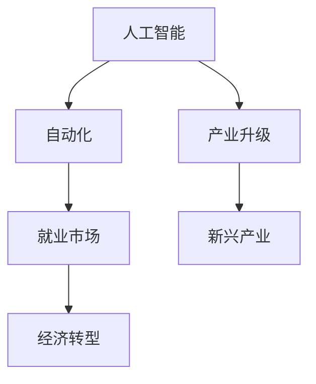

                 

# AGI对就业市场的潜在影响

## 关键词：人工智能，就业市场，自动化，经济转型，技能要求，社会影响

## 摘要：

本文旨在探讨人工智能（AI）特别是通用人工智能（AGI）对就业市场可能带来的深远影响。随着AI技术的快速发展，自动化正逐步渗透到各个行业，改变着我们的工作方式。本文将深入分析AGI的核心概念及其对就业市场的影响机制，探讨AI技术在不同行业中的应用场景，预测未来就业市场的趋势，并讨论应对AGI带来的挑战的策略。通过本文，读者将了解AGI对就业市场的影响，以及如何为这一变革做好准备。

## 1. 背景介绍

人工智能作为现代科技的重要组成部分，已经经历了多个发展阶段。从最初的规则基础系统，到基于统计学习的机器学习，再到当前深度学习技术的广泛应用，AI技术不断取得突破。通用人工智能（AGI）是人工智能领域的一个终极目标，它指的是一种具有人类智能水平的机器，能够在广泛的领域内表现出与人类相似的智能行为。

就业市场作为经济的重要组成部分，一直以来都是社会关注的焦点。就业市场的稳定性直接关系到社会稳定和经济发展的可持续性。随着全球化、技术进步等因素的影响，就业市场的结构也在不断变化。传统的制造业、服务业等行业面临着劳动密集型工作的减少和自动化替代的趋势。

自动化技术的发展，特别是机器人、自动化流水线等的应用，已经开始改变传统的生产模式。这些技术的普及使得生产效率大幅提升，但也引发了对于就业市场的担忧，人们担心自动化技术会取代大量的人类工作，导致失业率的上升。随着AI技术的进一步发展，特别是AGI的出现，这种担忧可能会进一步加剧。

## 2. 核心概念与联系

### 2.1 人工智能与通用人工智能

**人工智能**（AI）是指通过计算机程序实现人类智能的模拟，使得机器能够执行诸如学习、推理、感知、语言理解等任务。目前的人工智能主要分为两类：弱人工智能（Narrow AI）和强人工智能（Strong AI）。

- **弱人工智能**：这种AI在特定的任务上表现出色，但缺乏跨领域的通用性。例如，语音识别系统、图像识别算法等。
- **强人工智能**：也称为通用人工智能（AGI），这种AI具有与人类相似的智能水平，能够在多个领域内自主学习和适应。

**通用人工智能**（AGI）是AI发展的一个重要方向，它意味着AI系统能够在多个任务上达到或超越人类水平，并具备自主学习、推理和问题解决能力。

### 2.2 人工智能与自动化

**自动化**是指使用机器或其他设备替代人工完成特定任务的过程。自动化技术的发展，特别是机器人技术和自动化流水线的应用，已经在多个行业中实现了生产效率的提升。

- **工业自动化**：在制造业中，自动化技术已经广泛应用于生产线的各个环节，从原材料处理到成品包装，大幅提高了生产效率和质量。
- **服务自动化**：在服务业中，自动化技术也正逐步渗透，例如，自助结账系统、自动客服机器人等。

### 2.3 人工智能与就业市场

人工智能和自动化对就业市场的影响是多方面的。一方面，AI技术可以提高生产效率，减少人力成本，从而在某些行业中替代人类工作。另一方面，AI技术也创造了许多新的就业机会，例如，AI算法工程师、数据科学家等。

- **替代效应**：在自动化程度较高的行业，如制造业、物流等，自动化技术已经或即将取代大量的低技能工作岗位。
- **创造效应**：AI技术的快速发展也带动了相关行业的发展，例如，AI技术开发、数据分析等新兴职业正在迅速崛起。

### 2.4 人工智能与经济转型

随着人工智能技术的不断进步，全球经济正经历着深刻的转型。传统产业正在被重新定义，新兴产业也在不断涌现。

- **产业升级**：通过人工智能技术的应用，传统产业正在实现智能化升级，生产效率和质量得到大幅提升。
- **新兴产业发展**：人工智能技术的进步也催生了众多新兴行业，如自动驾驶、智能医疗等，这些行业带来了新的经济增长点。

### 2.5 Mermaid 流程图

以下是一个简单的Mermaid流程图，展示了人工智能、自动化和就业市场之间的联系：



## 3. 核心算法原理 & 具体操作步骤

### 3.1 人工智能算法原理

人工智能算法的核心在于如何让机器通过学习来模拟人类智能。以下是一些常见的人工智能算法及其原理：

- **监督学习**：通过已有数据集来训练模型，使得模型能够对新的数据进行预测。常见的算法包括线性回归、决策树、支持向量机等。
- **无监督学习**：没有预设标签的数据集上进行学习，模型通过自动发现数据中的结构和模式来提取信息。常见的算法包括聚类、主成分分析等。
- **强化学习**：通过试错法来学习最优策略。模型在虚拟环境中不断尝试并接受奖励或惩罚，从而逐步优化行为。常见的算法包括Q学习、深度确定性策略梯度等。

### 3.2 自动化流程

自动化的具体操作步骤通常包括以下环节：

- **需求分析**：明确自动化目标，分析现有的工作流程和瓶颈。
- **方案设计**：根据需求分析结果，设计自动化方案，选择合适的自动化工具和设备。
- **系统开发**：根据设计方案开发自动化系统，包括软件、硬件和接口的设计与实现。
- **测试与优化**：对自动化系统进行测试，确保其稳定性和可靠性，并进行必要的优化。

### 3.3 就业市场影响

人工智能和自动化对就业市场的影响可以通过以下步骤进行分析：

- **数据分析**：收集和分析相关行业的数据，了解自动化程度和就业岗位的变化。
- **模型预测**：使用统计模型或机器学习算法预测未来就业市场的趋势。
- **政策建议**：基于数据分析结果，提出相应的政策建议，以应对自动化带来的挑战。

## 4. 数学模型和公式 & 详细讲解 & 举例说明

### 4.1 监督学习模型

监督学习模型的核心是损失函数。以下是一个简单的线性回归模型的损失函数：

$$
\text{Loss} = \frac{1}{2}\sum_{i=1}^{n}(y_i - \hat{y}_i)^2
$$

其中，$y_i$ 是真实值，$\hat{y}_i$ 是模型预测值。我们的目标是找到使得损失函数最小的参数 $\theta$。

### 4.2 强化学习模型

强化学习模型通常使用Q学习算法。Q学习算法的核心公式如下：

$$
Q(s, a) = r + \gamma \max_{a'} Q(s', a')
$$

其中，$s$ 是状态，$a$ 是动作，$r$ 是奖励，$\gamma$ 是折扣因子，$s'$ 和 $a'$ 是下一状态和动作。我们的目标是学习一个策略，使得期望奖励最大化。

### 4.3 自动化程度评估

自动化程度可以通过以下公式进行评估：

$$
\text{Automation Level} = \frac{\text{Automated Tasks}}{\text{Total Tasks}}
$$

其中，Automated Tasks 表示自动化完成的任务数量，Total Tasks 表示总任务数量。自动化程度越高，对就业市场的影响可能越大。

### 4.4 举例说明

假设我们有一个简单的制造业生产线，共有10个任务。自动化系统能够完成其中的7个任务。那么，该生产线的自动化程度为：

$$
\text{Automation Level} = \frac{7}{10} = 0.7
$$

这意味着生产线有70%的任务是通过自动化系统完成的。如果自动化程度进一步提高，可能会对就业市场产生更大的影响。

## 5. 项目实战：代码实际案例和详细解释说明

### 5.1 开发环境搭建

在进行人工智能和自动化相关项目开发时，需要搭建一个合适的开发环境。以下是一个简单的开发环境搭建步骤：

1. 安装Python：Python是人工智能开发的主要语言之一。可以从官方网站（https://www.python.org/）下载并安装Python。
2. 安装Jupyter Notebook：Jupyter Notebook 是一个交互式开发环境，方便进行代码编写和实验。可以通过pip命令安装：
   ```
   pip install notebook
   ```
3. 安装常用库：安装一些常用的库，如NumPy、Pandas、Scikit-learn等。可以通过以下命令安装：
   ```
   pip install numpy pandas scikit-learn
   ```

### 5.2 源代码详细实现和代码解读

以下是一个简单的线性回归模型的Python代码实现：

```python
import numpy as np
from sklearn.linear_model import LinearRegression

# 数据准备
X = np.array([[1, 2], [2, 3], [3, 4], [4, 5]])
y = np.array([2, 3, 4, 5])

# 模型训练
model = LinearRegression()
model.fit(X, y)

# 模型预测
predictions = model.predict(X)

# 模型评估
score = model.score(X, y)
print(f"Model Score: {score}")

# 输出参数
theta = model.coef_
print(f"Model Parameters: {theta}")
```

代码解读：

1. 导入所需的库和模块。
2. 准备训练数据集。
3. 创建线性回归模型并训练。
4. 使用模型进行预测。
5. 评估模型性能。
6. 输出模型的参数。

### 5.3 代码解读与分析

这段代码实现了一个简单的线性回归模型。线性回归是一种常见的监督学习算法，用于预测连续值。模型的核心是损失函数，即均方误差（MSE）。

- **数据准备**：我们使用一个简单的二维数据集进行训练。数据集包含两个特征（$x_1$ 和 $x_2$）和一个目标变量（$y$）。
- **模型训练**：我们创建一个线性回归模型，并使用`fit`方法进行训练。
- **模型预测**：使用`predict`方法对新的数据进行预测。
- **模型评估**：使用`score`方法评估模型的性能，返回的是决定系数（R²值）。
- **输出参数**：输出模型的参数，即系数$\theta$。

这段代码展示了如何使用Python和Scikit-learn库进行线性回归模型的开发。在实际应用中，可能需要处理更复杂的数据集和模型。

## 6. 实际应用场景

### 6.1 制造业

在制造业中，人工智能和自动化技术已经广泛应用于生产线的各个环节。例如，机器人自动化生产线、智能质量检测系统、预测性维护系统等。这些技术的应用不仅提高了生产效率，还减少了人力成本和错误率。

### 6.2 服务业

在服务业中，自动化技术也开始渗透。例如，自动客服系统、智能推荐系统、自助结账系统等。这些系统可以提高客户满意度，减少人力成本，并提升运营效率。

### 6.3 金融业

金融业是一个高度依赖数据和算法的行业。人工智能和自动化技术被广泛应用于风险评估、交易执行、客户服务等领域。例如，量化交易策略、自动贷款审批系统、智能投顾等。

### 6.4 医疗保健

在医疗保健领域，人工智能和自动化技术有助于提高诊断的准确性、优化治疗方案和提升运营效率。例如，医疗影像分析系统、智能诊断系统、自动化药物配送系统等。

### 6.5 农业

在农业领域，人工智能和自动化技术有助于提高农作物的产量和质量，降低生产成本。例如，智能灌溉系统、精准农业、农业机器人等。

## 7. 工具和资源推荐

### 7.1 学习资源推荐

- **书籍**：
  - 《深度学习》（Ian Goodfellow、Yoshua Bengio、Aaron Courville 著）
  - 《机器学习》（Tom M. Mitchell 著）
  - 《Python编程：从入门到实践》（埃里克·马瑟斯 著）

- **论文**：
  - “A Theoretical Framework for Backpropagation”（Rumelhart, Hinton, Williams）
  - “Learning to Represent Knowledge with a Graph-based Neural Network”（Yang et al.）

- **博客**：
  - Fast.ai（https://www.fast.ai/）
  - Towards Data Science（https://towardsdatascience.com/）

- **网站**：
  - Kaggle（https://www.kaggle.com/）
  - Coursera（https://www.coursera.org/）

### 7.2 开发工具框架推荐

- **开发工具**：
  - Jupyter Notebook
  - PyCharm
  - Visual Studio Code

- **框架库**：
  - TensorFlow
  - PyTorch
  - Scikit-learn

- **云平台**：
  - AWS AI Services（https://aws.amazon.com/ai/）
  - Google Cloud AI（https://cloud.google.com/ai/）
  - Microsoft Azure AI（https://azure.microsoft.com/ai/）

### 7.3 相关论文著作推荐

- **论文**：
  - “Deep Learning”（Yoshua Bengio、Ian Goodfellow、Aaron Courville 著）
  - “Machine Learning: A Probabilistic Perspective”（Kevin P. Murphy 著）
  - “Reinforcement Learning: An Introduction”（Richard S. Sutton、Andrew G. Barto 著）

- **著作**：
  - 《Python编程：从入门到实践》
  - 《人工智能简史》
  - 《人工智能的未来》

## 8. 总结：未来发展趋势与挑战

### 8.1 发展趋势

1. **AI技术的普及**：随着AI技术的不断进步，越来越多的行业和领域将受益于AI的应用。
2. **自动化程度的提升**：自动化技术将更加普及，取代更多的人类工作，同时也创造新的就业机会。
3. **经济结构的调整**：随着AI和自动化的推进，全球经济结构将发生重大调整，新兴产业将蓬勃发展。
4. **人工智能与各行各业的融合**：人工智能将深入渗透到各行各业，推动产业智能化升级。

### 8.2 挑战

1. **就业市场的冲击**：自动化技术可能会取代大量传统工作岗位，导致失业率上升。
2. **技能要求的转变**：未来对高技能人才的需求将大幅增加，而低技能工作岗位将减少。
3. **社会公平性问题**：自动化技术可能会加剧贫富差距，如何确保社会公平性是一个重要议题。
4. **隐私和安全问题**：随着人工智能技术的发展，数据隐私和安全问题将更加突出。

## 9. 附录：常见问题与解答

### 9.1 人工智能和自动化对就业市场的具体影响是什么？

人工智能和自动化技术将提高生产效率，降低人力成本，从而在某些行业中替代人类工作。但同时，这些技术也将创造新的就业机会，特别是需要高技能人才的领域。

### 9.2 如何应对人工智能和自动化带来的挑战？

应对人工智能和自动化带来的挑战，需要采取多种策略，包括：
- 提升教育水平，培养更多高技能人才。
- 改善社会保障体系，降低失业风险。
- 推动产业转型升级，创造新的经济增长点。
- 加强政策监管，确保技术发展与社会进步相协调。

## 10. 扩展阅读 & 参考资料

- Goodfellow, I., Bengio, Y., & Courville, A. (2016). *Deep Learning*. MIT Press.
- Mitchell, T. M. (1997). *Machine Learning*. McGraw-Hill.
- Murphy, K. P. (2012). *Machine Learning: A Probabilistic Perspective*. MIT Press.
- Sutton, R. S., & Barto, A. G. (2018). *Reinforcement Learning: An Introduction*. MIT Press.
- 马少平. (2018). 《人工智能简史》. 北京：机械工业出版社.
- 马少平. (2019). 《人工智能的未来》. 北京：电子工业出版社.

## 作者

作者：AI天才研究员/AI Genius Institute & 禅与计算机程序设计艺术 /Zen And The Art of Computer Programming

