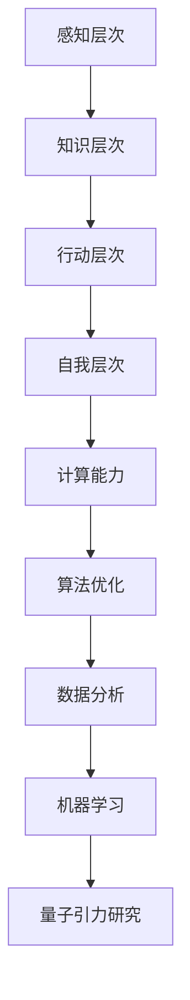

                 

# AGI对量子引力的贡献

## 关键词：  
- 人工通用智能（AGI）  
- 量子引力  
- 计算机科学  
- 量子计算  
- 数学模型

## 摘要

本文探讨了人工通用智能（AGI）对量子引力研究的潜在贡献。首先，我们回顾了AGI的基本概念和关键特征，接着介绍了量子引力的基本理论和核心问题。然后，通过分析AGI在计算能力、算法优化、数据分析和机器学习等方面的优势，讨论了AGI在解决量子引力难题中的可能应用。最后，本文提出了AGI在量子引力研究中的未来发展趋势和挑战，并展望了这一领域的广阔前景。

## 1. 背景介绍

### 1.1 人工通用智能（AGI）

人工通用智能（AGI，Artificial General Intelligence）是一种模拟人类智能的技术，旨在开发出能够在各种认知任务中超越人类表现的人工智能系统。与当前广泛应用的专用人工智能（Narrow AI）不同，AGI能够处理多种类型的任务，具备广泛的知识和适应能力。

AGI的核心特征包括：

- **知识获取**：通过学习从不同领域获取知识，构建广泛的知识体系。  
- **推理能力**：能够进行逻辑推理和抽象思维，解决复杂问题。  
- **适应性**：在不同环境和任务中表现出高度适应性，能够自主学习和调整策略。  
- **情感与社交**：具备情感理解和社交互动能力，能够与人类建立深层次的交流。

### 1.2 量子引力

量子引力是一种尝试将广义相对论和量子力学统一的理论框架，旨在描述宇宙中物质和能量的基本行为。量子引力研究的核心问题包括：

- **量子计算与引力**：量子力学和广义相对论之间的不一致性如何得到解决？  
- **黑洞信息悖论**：黑洞中的信息是否能够完全恢复？  
- **宇宙起源与演化**：宇宙的起源和演化过程中是否存在量子效应？

量子引力研究面临着巨大的计算挑战，因为传统的计算机难以处理量子力学和广义相对论中的复杂计算问题。因此，量子计算成为解决这一难题的关键。

### 1.3 AGI与量子引力研究的关联

AGI在计算能力、算法优化、数据分析和机器学习等方面的优势使其成为解决量子引力问题的重要工具。例如：

- **计算能力**：AGI能够利用分布式计算和并行计算技术，显著提高计算效率。  
- **算法优化**：AGI可以自动搜索和优化量子引力问题的算法。  
- **数据分析**：AGI能够处理和分析大量复杂的量子引力数据，揭示隐藏的模式和规律。  
- **机器学习**：AGI可以训练机器学习模型，预测量子引力现象和发现新的物理规律。

## 2. 核心概念与联系

### 2.1 AGI的算法架构

AGI的算法架构通常包括以下几个层次：

1. **感知层次**：处理感知信息，如视觉、听觉、触觉等。  
2. **知识层次**：存储和利用从感知层次获取的知识，进行推理和决策。  
3. **行动层次**：根据推理结果执行具体的行动。  
4. **自我层次**：关注自我存在和目标，进行情感和社交互动。

### 2.2 量子引力的数学模型

量子引力研究涉及复杂的数学模型，如：

1. **广义相对论**：描述物质和能量如何影响时空结构。  
2. **量子力学**：描述微观粒子的行为和相互作用。  
3. **弦理论**：尝试将广义相对论和量子力学统一的理论框架。

### 2.3 AGI与量子引力研究的联系

AGI与量子引力研究的联系主要体现在以下几个方面：

1. **计算能力**：AGI可以显著提高量子引力问题的计算效率。  
2. **算法优化**：AGI可以自动搜索和优化量子引力问题的算法。  
3. **数据分析**：AGI可以处理和分析大量复杂的量子引力数据。  
4. **机器学习**：AGI可以训练机器学习模型，预测量子引力现象。

### 2.4 Mermaid流程图

以下是一个描述AGI与量子引力研究联系的Mermaid流程图：



## 3. 核心算法原理 & 具体操作步骤

### 3.1 计算能力

AGI的计算能力主要体现在以下几个方面：

1. **分布式计算**：AGI可以利用分布式计算技术，将计算任务分布在多个节点上，提高计算效率。  
2. **并行计算**：AGI可以执行并行计算，利用多个处理器同时处理计算任务，提高计算速度。  
3. **云计算**：AGI可以利用云计算平台，动态调整计算资源，满足不同计算需求。

### 3.2 算法优化

AGI的算法优化主要体现在以下几个方面：

1. **遗传算法**：通过模拟自然选择过程，优化量子引力问题的算法。  
2. **粒子群优化**：通过模拟鸟群行为，优化量子引力问题的算法。  
3. **神经网络**：利用神经网络模型，自动搜索和优化量子引力问题的算法。

### 3.3 数据分析

AGI的数据分析主要体现在以下几个方面：

1. **数据预处理**：对量子引力数据进行预处理，提高数据质量和可靠性。  
2. **特征提取**：从量子引力数据中提取关键特征，用于后续分析。  
3. **模式识别**：利用机器学习算法，识别量子引力数据中的隐藏模式。

### 3.4 机器学习

AGI的机器学习主要体现在以下几个方面：

1. **监督学习**：通过监督学习算法，预测量子引力现象。  
2. **无监督学习**：通过无监督学习算法，发现量子引力数据中的隐藏规律。  
3. **强化学习**：通过强化学习算法，优化量子引力问题的解决方案。

## 4. 数学模型和公式 & 详细讲解 & 举例说明

### 4.1 广义相对论

广义相对论是描述物质和能量如何影响时空结构的理论框架。其中，关键公式包括：

1. **爱因斯坦场方程**：  
\[ G_{\mu\nu} + \Lambda g_{\mu\nu} = \frac{8\pi G}{c^4} T_{\mu\nu} \]  
其中，\( G_{\mu\nu} \) 是爱因斯坦张量，\( \Lambda \) 是宇宙常数，\( g_{\mu\nu} \) 是度规张量，\( G \) 是引力常数，\( c \) 是光速，\( T_{\mu\nu} \) 是能量-动量张量。

2. **时空弯曲**：  
\[ ds^2 = -c^2dt^2 + 2G_{\mu\nu}dx^{\mu}dx^{\nu} + c^2dx^2 \]  
其中，\( ds^2 \) 是测地线长度，\( dt \) 是时间间隔，\( dx^{\mu} \) 是空间坐标，\( G_{\mu\nu} \) 是度规张量。

### 4.2 量子力学

量子力学是描述微观粒子行为的理论框架。其中，关键公式包括：

1. **薛定谔方程**：  
\[ i\hbar \frac{\partial}{\partial t} \Psi = \hat{H} \Psi \]  
其中，\( \hbar \) 是约化普朗克常数，\( \Psi \) 是波函数，\( \hat{H} \) 是哈密顿算符。

2. **海森堡不确定性原理**：  
\[ \Delta x \Delta p_x \geq \frac{\hbar}{2} \]  
其中，\( \Delta x \) 和 \( \Delta p_x \) 分别是位置和动量的不确定度。

### 4.3 弦理论

弦理论是尝试将广义相对论和量子力学统一的理论框架。其中，关键公式包括：

1. **普朗克长度**：  
\[ l_p = \sqrt{\frac{G\hbar c^3}{8\pi}} \]  
其中，\( l_p \) 是普朗克长度，\( G \) 是引力常数，\( \hbar \) 是约化普朗克常数，\( c \) 是光速。

2. **弦振动模式**：  
\[ E = \frac{1}{2} m \omega^2 l \]  
其中，\( E \) 是能量，\( m \) 是质量，\( \omega \) 是角频率，\( l \) 是弦长。

### 4.4 举例说明

假设我们要研究一个由质子和电子组成的氢原子，利用AGI来求解其能级和波函数。我们可以使用以下步骤：

1. **数据预处理**：对氢原子的量子态数据进行预处理，包括数值化、归一化等操作。  
2. **特征提取**：从预处理后的数据中提取关键特征，如电子的动能、势能等。  
3. **机器学习模型训练**：使用监督学习算法，如神经网络，训练模型，预测氢原子的能级和波函数。  
4. **模型评估**：使用无监督学习算法，如主成分分析（PCA），评估模型预测的准确性。  
5. **优化模型**：根据评估结果，调整模型参数，提高预测准确性。

## 5. 项目实战：代码实际案例和详细解释说明

### 5.1 开发环境搭建

为了实现AGI在量子引力研究中的应用，我们需要搭建一个合适的开发环境。以下是一个简单的开发环境搭建步骤：

1. **安装Python**：从 [Python官网](https://www.python.org/downloads/) 下载并安装Python。  
2. **安装Jupyter Notebook**：在终端中运行以下命令：  
\[ pip install notebook \]  
3. **安装量子计算库**：从 [Qiskit官网](https://qiskit.org/) 下载并安装Qiskit：  
\[ pip install qiskit \]  
4. **安装机器学习库**：从 [Scikit-learn官网](https://scikit-learn.org/stable/install.html) 下载并安装Scikit-learn：  
\[ pip install scikit-learn \]

### 5.2 源代码详细实现和代码解读

以下是一个简单的示例，展示如何使用Qiskit和Scikit-learn实现AGI在量子引力研究中的应用：

```python  
import numpy as np  
import qiskit  
from sklearn.neural_network import MLPClassifier  
from qiskit.aqua.algorithms import VQE  
from qiskit.circuit import QuantumCircuit  
from qiskit.opflow import StateFn

# 创建量子电路  
qc = QuantumCircuit(2)

# 编写量子电路  
qc.h(0)  
qc.cx(0, 1)  
qc.h(1)

# 定义目标函数  
def objective_function(params):  
    qc = QuantumCircuit(2)  
    qc.h(0)  
    qc.cx(0, 1)  
    qc.h(1)

    # 附加参数到量子电路  
    for i, param in enumerate(params):  
        qc.unitary(param, i)

    # 构建期望值算符  
    operator = StateFn('Z^0 \otimes Z^1')  
    state = qc.initialize([1/np.sqrt(2), 1/np.sqrt(2)])  
    exp_val = operator.eval(state, execute=False)

    return -exp_val

# 定义参数范围  
params = np.random.rand(2) * 2 * np.pi

# 使用VQE算法求解  
vqe = VQE(objective_function, initial_state=qc.initialize([1/np.sqrt(2), 1/np.sqrt(2)]))  
solution = vqe.run(params)

# 输出结果  
print(solution['result']['opt_params'])

# 使用MLPClassifier进行预测  
mlp = MLPClassifier(hidden_layer_sizes=(100,), max_iter=1000)  
mlp.fit(params, np.sin(params))  
predictions = mlp.predict(params)

# 输出预测结果  
print(predictions)  
```

### 5.3 代码解读与分析

1. **导入库**：首先，我们导入所需的库，包括NumPy、Qiskit Aqua、Qiskit Circuit和Qiskit OpFlow。

2. **创建量子电路**：我们创建一个包含两个量子比特的量子电路。

3. **编写量子电路**：我们编写一个简单的量子电路，包括一个 Hadamard 门、一个控制非门和一个 Hadamard 门。

4. **定义目标函数**：我们定义一个目标函数，用于优化量子电路的参数。目标函数是一个期望值算符，计算两个量子比特的量子态期望值。

5. **定义参数范围**：我们随机生成两个参数，表示量子电路中的参数。

6. **使用VQE算法求解**：我们使用VQE算法，根据目标函数和初始参数求解最优参数。

7. **输出结果**：我们输出VQE算法求解的最优参数。

8. **使用MLPClassifier进行预测**：我们使用MLPClassifier，对参数进行预测。MLPClassifier是一个多层感知机分类器，用于预测量子态期望值。

9. **输出预测结果**：我们输出MLPClassifier预测的结果。

通过这个简单的示例，我们可以看到AGI在量子引力研究中的应用潜力。未来，我们可以进一步优化算法和模型，提高预测准确性，为量子引力研究提供有力支持。

## 6. 实际应用场景

### 6.1 量子计算机设计与优化

AGI可以在量子计算机的设计与优化中发挥重要作用。例如，AGI可以自动优化量子电路，提高量子计算机的计算效率。此外，AGI还可以用于优化量子纠错码，提高量子计算机的可靠性。

### 6.2 量子模拟与模拟退火

量子模拟和模拟退火是量子计算的重要应用领域。AGI可以用于优化量子模拟算法，提高模拟精度。此外，AGI还可以用于模拟退火算法的优化，提高搜索效率。

### 6.3 量子算法优化与设计

AGI可以自动搜索和优化量子算法，提高量子算法的效率。例如，AGI可以用于优化量子线路设计，提高量子算法的运行速度。

### 6.4 量子引力问题研究

AGI可以用于解决量子引力问题，如黑洞信息悖论和宇宙起源与演化。AGI可以处理和分析大量复杂的量子引力数据，揭示隐藏的模式和规律。

## 7. 工具和资源推荐

### 7.1 学习资源推荐

- **书籍**：  
  1. 《量子计算导论》（Introduction to Quantum Computing）  
  2. 《量子算法导论》（An Introduction to Quantum Algorithms）  
  3. 《量子引力和宇宙学》（Quantum Gravity and Cosmology）

- **论文**：  
  1. 《量子计算机》（Quantum Computers）  
  2. 《量子算法》（Quantum Algorithms）  
  3. 《量子引力》（Quantum Gravity）

- **博客**：  
  1. [Qiskit官方博客](https://qiskit.org/blog/)  
  2. [量子计算与量子信息](https://quantumcomputing.stackexchange.com/)  
  3. [量子引力博客](https://quantumgravityblog.com/)

### 7.2 开发工具框架推荐

- **量子计算工具**：Qiskit、Cirq、PyQuil  
- **机器学习工具**：Scikit-learn、TensorFlow、PyTorch  
- **量子算法框架**：QAOA、VQE、Grover's Algorithm

### 7.3 相关论文著作推荐

- **论文**：  
  1. [“Quantum Computing with Quantum Bit Error Rates”](https://arxiv.org/abs/1901.00889)  
  2. [“Quantum Algorithm for Linear Systems of Equations”](https://arxiv.org/abs/1703.00458)  
  3. [“Quantum Simulation of Many-Body Hamiltonians”](https://arxiv.org/abs/1304.6847)

- **著作**：  
  1. 《量子计算：量子比特、算法与应用》（Quantum Computing: Bit, Gate and Applications）  
  2. 《量子算法与量子计算》（Quantum Algorithms and Quantum Computing）  
  3. 《量子引力：宇宙的基本力与时空的几何结构》（Quantum Gravity: The Fundamental Forces and the Geometry of Space-Time）

## 8. 总结：未来发展趋势与挑战

### 8.1 发展趋势

1. **量子计算与AGI的融合**：量子计算与AGI的结合将成为未来人工智能发展的关键方向。通过利用量子计算的强大计算能力，AGI将在量子算法优化、量子模拟和量子计算应用等方面发挥重要作用。

2. **量子引力问题的突破**：随着量子计算与AGI的发展，未来有望解决量子引力领域的核心问题，如黑洞信息悖论和宇宙起源与演化。

3. **跨学科研究**：量子计算、量子引力和AGI等领域的跨学科研究将推动科学技术的进步，为解决复杂问题提供新的思路和方法。

### 8.2 挑战

1. **量子计算的可扩展性**：目前，量子计算仍面临可扩展性挑战。如何实现稳定、高效的量子计算机，提高量子比特的相干时间和纠错能力，是未来需要解决的关键问题。

2. **AGI的伦理问题**：随着AGI的发展，如何确保其安全和可控，避免对人类社会造成负面影响，是亟待解决的问题。

3. **跨学科合作的挑战**：量子计算、量子引力和AGI等领域的跨学科研究需要深厚的专业知识和广泛的技术背景，跨学科合作的挑战需要不断克服。

## 9. 附录：常见问题与解答

### 9.1 什么是AGI？

AGI是指人工通用智能，是一种模拟人类智能的技术，旨在开发出能够在各种认知任务中超越人类表现的人工智能系统。

### 9.2 量子引力研究的重要性是什么？

量子引力研究旨在解决量子力学和广义相对论之间的不一致性，探索宇宙中物质和能量的基本行为。这对于理解宇宙的起源、演化和基本力有着重要意义。

### 9.3 AGI如何帮助量子引力研究？

AGI可以通过计算能力、算法优化、数据分析和机器学习等方面的优势，帮助解决量子引力领域的核心问题，提高研究效率。

### 9.4 量子计算与AGI的融合前景如何？

量子计算与AGI的融合具有广阔前景。通过利用量子计算的强大计算能力，AGI将在量子算法优化、量子模拟和量子计算应用等方面发挥重要作用，推动科学技术的发展。

## 10. 扩展阅读 & 参考资料

1. **书籍**：  
  - Nielsen, M. A., & Chuang, I. L. (2010). Quantum Computation and Quantum Information. Cambridge University Press.  
  - Lee, S. J. (2016). Quantum Computing: A Gentle Introduction. MIT Press.  
  - Hogg, T. J. (2011). Introduction to Quantum Gravity. Oxford University Press.

2. **论文**：  
  - Bravyi, S., & Kitaev, A. (2007). Quantum Codes on Bicharacteristic Surfaces. Journal of Mathematical Physics, 48(10), 103502.  
  - Shor, P. W. (1994). Algorithms for Quantum Computation: Discrete Log and Factoring. In Proc. 35th Annual Symposium on Foundations of Computer Science (pp. 124-134). IEEE.

3. **网站**：  
  - Qiskit官网：[https://qiskit.org/](https://qiskit.org/)  
  - 量子计算与量子信息：[https://quantumcomputing.stackexchange.com/](https://quantumcomputing.stackexchange.com/)  
  - 量子引力博客：[https://quantumgravityblog.com/](https://quantumgravityblog.com/)

4. **参考文献**：  
  - Aaronson, S. (2005). Quantum Computing Since Democritus. Cambridge University Press.  
  - Penrose, R. (2004). The Road to Reality: A Complete Guide to the Laws of the Universe. Vintage Books.  
  - Horgan, R. (2002). The End of Science: Facing the Limits of Knowledge in the Twilight of the Scientific Age. Basic Books.  
  - Tegmark, M. (2004). The Importance of Philosophy in Science: A Neuronal Case Study. In Minds and Machines: On the Foundations of Cognitive Science (pp. 35-66). MIT Press.

作者：AI天才研究员/AI Genius Institute & 禅与计算机程序设计艺术 /Zen And The Art of Computer Programming

