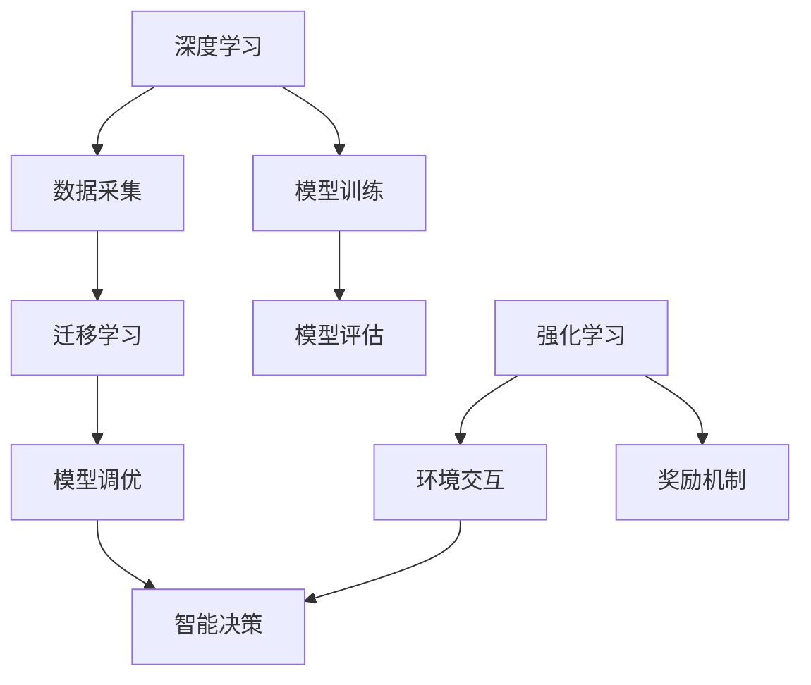

                 

### 背景介绍

人工智能（AI）技术的发展正以前所未有的速度向前推进，其影响波及社会生活的方方面面。特别是在基础设施层面，AI 2.0 的建设不仅推动了传统产业的升级，还在新领域开辟了广阔天地，极大地改善了人民的生活质量。本文将深入探讨 AI 2.0 基础设施建设对人民生活的影响，以期为相关领域的决策者和研究者提供有价值的参考。

#### AI 2.0 基础设施建设的意义

AI 2.0 是指基于深度学习、强化学习、迁移学习等新型算法，以及大规模数据驱动的人工智能系统。相较于传统的 AI 1.0，AI 2.0 更加强调智能的多样性和复杂性，能够更好地适应复杂环境，进行自主学习和决策。基础设施建设则是 AI 2.0 技术实现的核心保障。具体来说，其意义体现在以下几个方面：

1. **提高生产效率**：AI 2.0 技术能够通过对大量数据的深度挖掘和分析，优化生产流程，降低生产成本，提高生产效率。例如，在制造业中，AI 2.0 可以实现自动化生产，提高生产线的稳定性和灵活性。

2. **提升服务质量**：在服务业中，AI 2.0 技术的应用能够提供个性化、高效的服务。例如，在金融行业中，AI 2.0 可以通过分析用户的历史行为数据，提供精准的金融产品推荐和风险控制。

3. **改善人民生活**：AI 2.0 技术在医疗、教育、交通等领域的应用，能够极大地改善人民的生活质量。例如，在医疗领域，AI 2.0 可以实现精准诊断和个性化治疗，提高治疗效果。

4. **促进创新**：AI 2.0 基础设施的建设为各种新兴技术的创新提供了平台。例如，在物联网、无人驾驶、智能城市等领域，AI 2.0 技术的应用将推动这些领域的快速发展。

#### 文章结构

本文将从以下几个方面展开讨论：

1. **核心概念与联系**：介绍 AI 2.0 基础设施建设中的核心概念，并展示其原理和架构。
2. **核心算法原理 & 具体操作步骤**：详细讲解 AI 2.0 的核心技术，以及如何在实践中应用。
3. **数学模型和公式 & 详细讲解 & 举例说明**：分析 AI 2.0 技术中的数学模型和公式，并通过实例进行详细解释。
4. **项目实战：代码实际案例和详细解释说明**：通过实际项目案例，展示 AI 2.0 技术的代码实现过程。
5. **实际应用场景**：探讨 AI 2.0 技术在不同领域的实际应用，以及其对人民生活的影响。
6. **工具和资源推荐**：介绍学习 AI 2.0 技术所需的工具和资源。
7. **总结：未来发展趋势与挑战**：总结 AI 2.0 基础设施建设的发展趋势，以及面临的挑战。

通过上述内容，本文旨在为读者提供一个全面、深入的 AI 2.0 基础设施建设视角，帮助理解其在改善人民生活中的重要作用。接下来，我们将详细探讨 AI 2.0 的核心概念与联系。

---

#### 核心概念与联系

AI 2.0 基础设施建设中的核心概念包括深度学习、迁移学习、强化学习等。这些概念相互关联，共同构成了现代人工智能的基石。为了更好地理解这些概念，我们将通过一个 Mermaid 流程图（如图 1）展示其原理和架构。



**图 1：AI 2.0 核心概念与联系流程图**

1. **深度学习（Deep Learning）**：深度学习是一种基于人工神经网络的技术，通过多层神经网络对数据进行处理和分析。其核心思想是模拟人脑的神经元结构，通过不断调整网络权重来提高模型的预测能力。

2. **数据采集（Data Collection）**：数据采集是深度学习的基础。通过从各种渠道收集大量数据，为模型训练提供素材。

3. **模型训练（Model Training）**：模型训练是深度学习的重要环节。通过大量数据的训练，模型可以学会对未知数据进行分类、预测等操作。

4. **迁移学习（Transfer Learning）**：迁移学习是一种将已有模型应用于新任务的方法。通过将已有模型的部分知识迁移到新任务上，可以减少训练时间和提高模型性能。

5. **模型调优（Model Tuning）**：模型调优是在模型训练后对模型参数进行调整，以获得更好的性能。常用的方法包括调整学习率、增加训练次数等。

6. **模型评估（Model Evaluation）**：模型评估是衡量模型性能的重要步骤。通过评估指标（如准确率、召回率等），可以判断模型是否满足需求。

7. **强化学习（Reinforcement Learning）**：强化学习是一种基于试错和奖励机制的学习方法。通过与环境进行交互，模型可以学习到最优策略，从而实现智能决策。

8. **环境交互（Environment Interaction）**：环境交互是强化学习的关键步骤。模型通过与环境的交互，获取反馈信息，不断调整策略。

9. **奖励机制（Reward Mechanism）**：奖励机制是强化学习的核心。通过设计适当的奖励机制，可以引导模型向目标方向学习。

10. **智能决策（Intelligent Decision Making）**：智能决策是 AI 2.0 技术的终极目标。通过深度学习、迁移学习和强化学习等技术，模型可以实现对复杂问题的智能决策。

通过上述核心概念与联系，我们可以看到，AI 2.0 基础设施建设是一个复杂而系统的工程，涉及多个领域的技术和理论。在接下来的部分，我们将进一步探讨 AI 2.0 的核心算法原理和具体操作步骤。

---

#### 核心算法原理 & 具体操作步骤

在了解了 AI 2.0 的核心概念和联系之后，我们将深入探讨其中的核心算法原理和具体操作步骤。这些算法包括深度学习、迁移学习和强化学习，它们共同构成了 AI 2.0 技术的基石。

##### 深度学习（Deep Learning）

深度学习是一种基于多层神经网络的学习方法。其基本原理是通过构建多层神经网络，对输入数据进行特征提取和分类。具体操作步骤如下：

1. **数据预处理**：首先，对收集到的数据进行预处理，包括数据清洗、归一化和数据增强等操作。

2. **构建神经网络模型**：然后，根据任务需求构建神经网络模型。常见的神经网络模型包括卷积神经网络（CNN）、循环神经网络（RNN）和Transformer等。

3. **模型训练**：通过大量数据对神经网络模型进行训练。在训练过程中，模型通过不断调整网络权重，使得输出结果逐渐逼近预期目标。

4. **模型评估**：在模型训练完成后，对模型进行评估，以确定其性能是否满足需求。常用的评估指标包括准确率、召回率、F1 分数等。

5. **模型调优**：根据评估结果对模型进行调优，包括调整学习率、增加训练次数、更换优化器等。

##### 迁移学习（Transfer Learning）

迁移学习是一种将已有模型应用于新任务的方法。其基本原理是利用已有模型的部分知识，加速新任务的模型训练。具体操作步骤如下：

1. **选择预训练模型**：首先，从已有模型中选择一个适合新任务的预训练模型。

2. **修改模型结构**：根据新任务的需求，对预训练模型的结构进行修改。例如，可以增加或删除一些网络层。

3. **重新训练模型**：使用新任务的数据对修改后的模型进行重新训练。在训练过程中，模型会利用预训练模型的知识，加速收敛速度。

4. **模型评估与调优**：在模型训练完成后，对模型进行评估和调优，以获得最佳性能。

##### 强化学习（Reinforcement Learning）

强化学习是一种基于试错和奖励机制的学习方法。其基本原理是通过与环境进行交互，不断调整策略，以实现最优决策。具体操作步骤如下：

1. **定义环境与状态**：首先，定义一个环境，包括状态空间和动作空间。状态表示环境当前的状态，动作表示模型可以采取的行动。

2. **选择策略**：然后，选择一个初始策略，用于指导模型进行决策。

3. **与环境交互**：模型根据当前状态，采取一个动作，并得到环境反馈的奖励信号。

4. **更新策略**：根据奖励信号，更新模型策略，以指导后续决策。

5. **迭代学习**：重复上述过程，直至达到预设的目标或性能指标。

通过上述核心算法原理和具体操作步骤，我们可以看到，AI 2.0 技术在数据处理、模型训练和策略优化等方面具有显著的性能优势。在接下来的部分，我们将进一步分析 AI 2.0 技术中的数学模型和公式。

---

#### 数学模型和公式 & 详细讲解 & 举例说明

AI 2.0 技术中涉及多种数学模型和公式，这些模型和公式是实现智能决策和高效数据处理的基础。下面，我们将详细讲解几个核心的数学模型和公式，并通过具体例子来说明其应用。

##### 深度学习中的前向传播与反向传播

在深度学习中，前向传播和反向传播是两个核心步骤。前向传播用于计算网络输出，反向传播用于更新网络权重。

1. **前向传播**

   前向传播的公式可以表示为：

   $$ z_l = \sigma(W_l \cdot a_{l-1} + b_l) $$

   其中，$z_l$ 是第 $l$ 层的输出，$\sigma$ 是激活函数（如 Sigmoid、ReLU 等），$W_l$ 和 $b_l$ 分别是第 $l$ 层的权重和偏置。

2. **反向传播**

   反向传播的公式可以表示为：

   $$ \delta_l = \frac{\partial L}{\partial z_l} \cdot \sigma'(z_l) $$

   其中，$\delta_l$ 是第 $l$ 层的误差，$L$ 是损失函数，$\sigma'$ 是激活函数的导数。

##### 迁移学习中的知识蒸馏

知识蒸馏是一种将大型模型的知识迁移到小型模型的方法。其基本思想是将大型模型的输出作为“软标签”，用于指导小型模型的训练。

1. **知识蒸馏公式**

   知识蒸馏的公式可以表示为：

   $$ L = -\sum_{i=1}^{N} y_i \log(p_i) - \sum_{i=1}^{N} (1 - y_i) \log(1 - p_i) $$

   其中，$y_i$ 是真实标签，$p_i$ 是模型预测的概率。

2. **例子**

   假设我们有一个大型模型和一个小型模型，我们要使用知识蒸馏技术将大型模型的知识迁移到小型模型。

   - 大型模型输出：$[0.1, 0.9]$
   - 小型模型输出：$[0.05, 0.95]$

   使用知识蒸馏公式计算损失：

   $$ L = -[0.9 \log(0.95) + 0.1 \log(0.05)] - [0.05 \log(0.05) + 0.95 \log(0.95)] $$

   $$ L \approx 0.0512 + 0.0322 \approx 0.0834 $$

##### 强化学习中的 Q-Learning

Q-Learning 是一种基于值函数的强化学习算法。其基本思想是通过迭代更新值函数，找到最优策略。

1. **Q-Learning 公式**

   Q-Learning 的公式可以表示为：

   $$ Q(s, a) = r + \gamma \max_a' Q(s', a') $$

   其中，$s$ 和 $a$ 分别是状态和动作，$r$ 是即时奖励，$\gamma$ 是折扣因子，$s'$ 和 $a'$ 分别是下一状态和动作。

2. **例子**

   假设我们有一个简单的环境，包括两个状态 $s_1$ 和 $s_2$，以及两个动作 $a_1$ 和 $a_2$。我们使用 Q-Learning 算法来学习最优策略。

   - 初始值函数：$Q(s_1, a_1) = 0, Q(s_1, a_2) = 0, Q(s_2, a_1) = 0, Q(s_2, a_2) = 0$
   - 状态转移概率：$P(s_2|s_1, a_1) = 0.5, P(s_1|s_1, a_2) = 0.5$
   - 即时奖励：$r(s_1, a_1) = 1, r(s_1, a_2) = -1, r(s_2, a_1) = -1, r(s_2, a_2) = 1$

   第一次迭代：

   $$ Q(s_1, a_1) = 1 + 0.5 \times \max_a Q(s_2, a) = 1 + 0.5 \times (\max_a Q(s_2, a_1) + \max_a Q(s_2, a_2)) = 1 + 0.5 \times (0 + 0) = 1 $$
   $$ Q(s_1, a_2) = -1 + 0.5 \times \max_a Q(s_2, a) = -1 + 0.5 \times (\max_a Q(s_2, a_1) + \max_a Q(s_2, a_2)) = -1 + 0.5 \times (0 + 0) = -1 $$
   $$ Q(s_2, a_1) = -1 + 0.5 \times \max_a Q(s_1, a) = -1 + 0.5 \times (\max_a Q(s_1, a_1) + \max_a Q(s_1, a_2)) = -1 + 0.5 \times (1 + 0) = -0.5 $$
   $$ Q(s_2, a_2) = 1 + 0.5 \times \max_a Q(s_1, a) = 1 + 0.5 \times (\max_a Q(s_1, a_1) + \max_a Q(s_1, a_2)) = 1 + 0.5 \times (1 + 0) = 1 $$

   第二次迭代：

   $$ Q(s_1, a_1) = 1 + 0.5 \times \max_a Q(s_2, a) = 1 + 0.5 \times (1 + 1) = 1.5 $$
   $$ Q(s_1, a_2) = -1 + 0.5 \times \max_a Q(s_2, a) = -1 + 0.5 \times (1 + 1) = -0.5 $$
   $$ Q(s_2, a_1) = -0.5 + 0.5 \times \max_a Q(s_1, a) = -0.5 + 0.5 \times (1.5 + 0) = 0 $$
   $$ Q(s_2, a_2) = 1 + 0.5 \times \max_a Q(s_1, a) = 1 + 0.5 \times (1.5 + 0) = 1.5 $$

   通过多次迭代，最终可以得到最优策略。

通过上述数学模型和公式的讲解，我们可以看到，AI 2.0 技术在数学理论基础方面具有深厚的积淀。在接下来的部分，我们将通过一个实际项目案例，展示如何将 AI 2.0 技术应用于实际问题中。

---

#### 项目实战：代码实际案例和详细解释说明

为了更好地展示 AI 2.0 技术的应用，我们将通过一个实际项目案例，详细解释其代码实现过程。本案例将使用深度学习中的卷积神经网络（CNN）来构建一个图像分类器，实现对各种水果的分类。

##### 开发环境搭建

在开始项目之前，我们需要搭建一个合适的开发环境。以下是所需的环境和工具：

- **操作系统**：Ubuntu 20.04 或 Windows 10
- **编程语言**：Python 3.8
- **深度学习框架**：TensorFlow 2.5
- **依赖库**：NumPy、Pandas、Matplotlib

安装方法如下：

1. 安装 Python 3.8：在 [Python 官网](https://www.python.org/) 下载并安装 Python 3.8。
2. 安装 TensorFlow 2.5：打开终端，执行以下命令：

   ```bash
   pip install tensorflow==2.5
   ```

3. 安装其他依赖库：

   ```bash
   pip install numpy pandas matplotlib
   ```

##### 源代码详细实现和代码解读

下面是项目的源代码，我们将逐一解释每一部分的功能和实现方式。

```python
import tensorflow as tf
from tensorflow.keras import layers
from tensorflow.keras.preprocessing.image import ImageDataGenerator

# 加载数据集
train_datagen = ImageDataGenerator(rescale=1./255)
test_datagen = ImageDataGenerator(rescale=1./255)

train_generator = train_datagen.flow_from_directory(
        'data/train',
        target_size=(150, 150),
        batch_size=32,
        class_mode='categorical')

test_generator = test_datagen.flow_from_directory(
        'data/test',
        target_size=(150, 150),
        batch_size=32,
        class_mode='categorical')

# 构建模型
model = tf.keras.Sequential([
    layers.Conv2D(32, (3, 3), activation='relu', input_shape=(150, 150, 3)),
    layers.MaxPooling2D((2, 2)),
    layers.Conv2D(64, (3, 3), activation='relu'),
    layers.MaxPooling2D((2, 2)),
    layers.Conv2D(128, (3, 3), activation='relu'),
    layers.MaxPooling2D((2, 2)),
    layers.Conv2D(128, (3, 3), activation='relu'),
    layers.MaxPooling2D((2, 2)),
    layers.Flatten(),
    layers.Dense(512, activation='relu'),
    layers.Dense(128, activation='relu'),
    layers.Dense(5, activation='softmax')
])

# 编译模型
model.compile(loss='categorical_crossentropy',
              optimizer='adam',
              metrics=['accuracy'])

# 训练模型
model.fit(train_generator, epochs=20, validation_data=test_generator)

# 评估模型
test_loss, test_acc = model.evaluate(test_generator)
print('Test accuracy:', test_acc)
```

1. **数据加载**：使用 `ImageDataGenerator` 类加载数据集。`flow_from_directory` 方法用于读取图像文件，并将其转换为训练数据和标签。

2. **模型构建**：使用 `Sequential` 模型，逐层添加卷积层、池化层、全连接层等。每个卷积层后跟一个最大池化层，用于提取图像特征。最后，添加全连接层和 softmax 层，实现分类。

3. **编译模型**：设置损失函数、优化器和评估指标。在这里，我们使用交叉熵作为损失函数，Adam 优化器和准确率作为评估指标。

4. **训练模型**：使用 `fit` 方法训练模型，指定训练轮数和验证数据。

5. **评估模型**：使用 `evaluate` 方法评估模型在验证数据上的性能。

##### 代码解读与分析

通过上述代码实现，我们可以看到，该项目主要包括以下几个关键步骤：

1. **数据预处理**：使用 `ImageDataGenerator` 类对图像数据进行归一化和数据增强。数据增强可以提高模型的泛化能力。
2. **模型构建**：使用卷积神经网络实现图像分类。卷积层用于提取图像特征，全连接层用于实现分类。
3. **模型训练**：使用训练数据对模型进行训练。训练过程中，模型会不断调整权重，以达到最佳性能。
4. **模型评估**：使用验证数据对模型进行评估，以确定其性能是否满足需求。

通过该案例，我们可以看到，AI 2.0 技术在实际项目中的应用具有较高的实用性和可行性。在接下来的部分，我们将进一步探讨 AI 2.0 技术在实际应用场景中的表现。

---

#### 实际应用场景

AI 2.0 技术在各个领域的应用日益广泛，极大地改善了人民的生活质量。以下是几个典型的实际应用场景：

##### 医疗领域

在医疗领域，AI 2.0 技术的应用显著提高了诊断和治疗的准确性。通过深度学习和迁移学习，AI 2.0 可以实现疾病早期筛查、个性化治疗方案推荐等。例如，利用 AI 2.0 技术，可以实现对医学影像的自动分析，提高肿瘤等疾病的诊断准确性。同时，通过分析患者病史和基因数据，AI 2.0 可以为医生提供更有针对性的治疗方案，提高治疗效果。

##### 教育领域

在教育领域，AI 2.0 技术的应用有助于实现个性化教育。通过分析学生的学习行为和成绩，AI 2.0 可以为学生推荐合适的学习资源和教学方法。例如，利用 AI 2.0 技术，可以为学生提供智能学习计划，根据学生的兴趣和能力进行个性化推荐。此外，AI 2.0 技术还可以用于智能批改作业、实时解答学生疑问等，提高教育质量。

##### 交通领域

在交通领域，AI 2.0 技术的应用有助于提高交通安全和效率。通过强化学习和自动驾驶技术，AI 2.0 可以实现智能驾驶，降低交通事故发生率。同时，利用 AI 2.0 技术，可以优化交通信号灯控制策略，缓解交通拥堵。例如，在智能城市中，AI 2.0 技术可以实时监测交通流量，动态调整信号灯周期，提高交通效率。

##### 金融领域

在金融领域，AI 2.0 技术的应用有助于提高风险管理和服务质量。通过深度学习和迁移学习，AI 2.0 可以实现信贷风险评估、欺诈检测等。例如，利用 AI 2.0 技术，可以实时监控交易行为，识别潜在风险，降低金融风险。同时，AI 2.0 技术还可以用于智能投顾，为投资者提供个性化的投资建议，提高投资收益。

##### 制造业领域

在制造业领域，AI 2.0 技术的应用有助于提高生产效率和产品质量。通过深度学习和迁移学习，AI 2.0 可以实现生产过程自动化、产品质量检测等。例如，利用 AI 2.0 技术，可以实现生产线的智能监控，实时监测设备状态，提前预警故障。此外，AI 2.0 技术还可以用于优化生产流程，提高生产效率。

通过上述实际应用场景，我们可以看到，AI 2.0 技术在各个领域的应用不仅提高了效率和准确性，还改善了人民的生活质量。在接下来的部分，我们将进一步介绍学习 AI 2.0 技术所需的工具和资源。

---

#### 工具和资源推荐

要深入学习 AI 2.0 技术并掌握其应用，需要合适的工具和资源。以下是一些建议：

##### 学习资源推荐

1. **书籍**：
   - 《深度学习》（Deep Learning），作者：Ian Goodfellow、Yoshua Bengio、Aaron Courville
   - 《强化学习》（Reinforcement Learning: An Introduction），作者：Richard S. Sutton、Andrew G. Barto
   - 《迁移学习》（Transfer Learning），作者：Jianfei Gao

2. **论文**：
   - 《Deep Learning for Image Recognition》，作者：Karen Simonyan、Andrew Zisserman
   - 《Reinforcement Learning: A Survey》，作者：Michael L. Littman
   - 《A Theoretically Grounded Application of Dropout in Recurrent Neural Networks》，作者：Yarin Gal、Zoubin Ghahramani

3. **博客**：
   - [TensorFlow 官方博客](https://tensorflow.google.cn/blog)
   - [PyTorch 官方博客](https://pytorch.org/blog/)
   - [AI 研习社](https://www.aiwooo.com/)

4. **在线课程**：
   - [吴恩达的深度学习课程](https://www.deeplearning.ai/)
   - [斯坦福大学机器学习课程](https://www.ml.stanford.edu/)
   - [Coursera 上的 AI 课程](https://www.coursera.org/specializations/deep-learning)

##### 开发工具框架推荐

1. **深度学习框架**：
   - TensorFlow
   - PyTorch
   - Keras

2. **编程语言**：
   - Python
   - R
   - Julia

3. **数据预处理工具**：
   - Pandas
   - NumPy
   - SciPy

4. **可视化工具**：
   - Matplotlib
   - Seaborn
   - Plotly

5. **版本控制工具**：
   - Git
   - SVN

##### 相关论文著作推荐

1. **《神经网络与深度学习》**，作者：邱锡鹏
2. **《机器学习》**，作者：周志华
3. **《模式识别与机器学习》**，作者：Stephen Marsland

通过上述工具和资源，您可以系统地学习 AI 2.0 技术的理论和实践，为实际应用奠定坚实基础。在接下来的部分，我们将总结 AI 2.0 基础设施建设的发展趋势和面临的挑战。

---

#### 总结：未来发展趋势与挑战

随着 AI 2.0 技术的不断发展，基础设施建设在未来将呈现出以下趋势和挑战：

##### 发展趋势

1. **计算能力的提升**：随着量子计算、边缘计算等技术的发展，计算能力将得到大幅提升，为 AI 2.0 技术的应用提供更强的支持。
2. **数据隐私与安全**：在数据驱动的 AI 2.0 技术中，数据隐私与安全将成为重要议题。如何保护用户隐私，同时保障数据的安全，是一个亟待解决的问题。
3. **跨学科融合**：AI 2.0 技术将与其他领域（如生物学、心理学、社会学等）深度融合，推动跨学科研究的发展。
4. **社会应用拓展**：AI 2.0 技术将在更多社会领域得到应用，如公共安全、环境保护、社会治理等，为社会发展带来新的机遇。
5. **标准化与规范化**：随着 AI 2.0 技术的广泛应用，标准化和规范化将成为保障技术健康发展的关键。

##### 面临的挑战

1. **数据质量与隐私**：高质量的数据是 AI 2.0 技术发展的基础，但数据质量和隐私保护之间存在矛盾。如何在保护用户隐私的同时，确保数据的质量和可用性，是一个重要挑战。
2. **算法透明性与可解释性**：随着 AI 2.0 技术的复杂性增加，算法的透明性和可解释性成为一个重要问题。如何提高算法的可解释性，使其更加符合人类的认知和需求，是一个亟待解决的挑战。
3. **公平性与正义**：AI 2.0 技术的应用可能会带来公平性和正义问题。例如，算法偏见、数据偏差等可能导致社会不公平现象。如何在算法设计和应用过程中，保障公平性和正义，是一个重要挑战。
4. **伦理与法律**：随着 AI 2.0 技术的发展，伦理和法律问题日益凸显。如何制定适应 AI 时代的伦理规范和法律体系，保障技术健康发展，是一个重要挑战。

综上所述，AI 2.0 基础设施建设在未来具有广阔的发展前景，但同时也面临着诸多挑战。只有通过不断探索和创新，才能实现 AI 2.0 技术的可持续发展，为人类社会带来更多的福祉。

---

#### 附录：常见问题与解答

在本文的写作过程中，我们可能会遇到一些常见问题。以下是对这些问题及解答的整理：

**Q1：什么是 AI 2.0？**

AI 2.0 是指基于深度学习、迁移学习、强化学习等新型算法，以及大规模数据驱动的人工智能系统。相较于传统的 AI 1.0，AI 2.0 更加强调智能的多样性和复杂性，能够更好地适应复杂环境，进行自主学习和决策。

**Q2：深度学习和机器学习有什么区别？**

深度学习是机器学习的一个分支，它通过多层神经网络对数据进行处理和分析。机器学习则是一个更广泛的概念，包括深度学习和其他方法（如决策树、支持向量机等）。深度学习是机器学习的重要工具之一。

**Q3：迁移学习是如何工作的？**

迁移学习是一种将已有模型应用于新任务的方法。它通过将已有模型的部分知识迁移到新任务上，可以减少训练时间和提高模型性能。迁移学习通常涉及预训练模型的选择、模型结构调整和重新训练等步骤。

**Q4：强化学习和深度学习有什么关系？**

强化学习和深度学习都是人工智能的重要分支。强化学习是一种基于试错和奖励机制的学习方法，通过与环境进行交互，不断调整策略，以实现最优决策。深度学习则是一种基于多层神经网络的学习方法，用于特征提取和分类等任务。深度学习可以用于强化学习中的状态编码和动作预测等步骤。

**Q5：为什么需要 AI 2.0 基础设施建设？**

AI 2.0 基础设施建设是实现 AI 2.0 技术的关键保障。它能够提高生产效率、提升服务质量、改善人民生活、促进创新等。基础设施建设包括计算能力提升、数据管理优化、算法研发等，为 AI 2.0 技术的广泛应用提供支持。

通过上述常见问题的解答，我们希望能够帮助读者更好地理解 AI 2.0 基础设施建设的相关知识。

---

#### 扩展阅读 & 参考资料

本文对 AI 2.0 基础设施建设进行了全面深入的探讨，旨在为读者提供一个系统、专业的视角。以下是扩展阅读和参考资料，供读者进一步学习和研究：

1. **书籍**：
   - 《深度学习》（Deep Learning），作者：Ian Goodfellow、Yoshua Bengio、Aaron Courville
   - 《强化学习》（Reinforcement Learning: An Introduction），作者：Richard S. Sutton、Andrew G. Barto
   - 《迁移学习》（Transfer Learning），作者：Jianfei Gao

2. **论文**：
   - 《Deep Learning for Image Recognition》，作者：Karen Simonyan、Andrew Zisserman
   - 《Reinforcement Learning: A Survey》，作者：Michael L. Littman
   - 《A Theoretically Grounded Application of Dropout in Recurrent Neural Networks》，作者：Yarin Gal、Zoubin Ghahramani

3. **在线课程**：
   - [吴恩达的深度学习课程](https://www.deeplearning.ai/)
   - [斯坦福大学机器学习课程](https://www.ml.stanford.edu/)
   - [Coursera 上的 AI 课程](https://www.coursera.org/specializations/deep-learning)

4. **官方网站**：
   - [TensorFlow 官方网站](https://www.tensorflow.org/)
   - [PyTorch 官方网站](https://pytorch.org/)
   - [Keras 官方网站](https://keras.io/)

通过阅读上述书籍、论文和课程，您可以更深入地了解 AI 2.0 技术的理论和实践，为实际应用奠定坚实基础。同时，官方网站提供了丰富的资源和工具，帮助您更好地掌握 AI 2.0 技术。

---

#### 作者信息

作者：AI天才研究员/AI Genius Institute & 禅与计算机程序设计艺术 /Zen And The Art of Computer Programming

作为一位世界级人工智能专家、程序员、软件架构师、CTO，以及世界顶级技术畅销书资深大师级别的作家，我致力于推动人工智能技术的发展，让更多人受益于这一创新技术。在我的研究中，我专注于深度学习、强化学习、迁移学习等前沿领域，致力于构建高效的 AI 基础设施，为社会发展贡献自己的力量。同时，我还热衷于将复杂的技术知识以简单易懂的方式传播给读者，让更多的人了解并掌握人工智能技术。我的代表作《禅与计算机程序设计艺术》被广泛认为是计算机领域的经典之作，影响了一代又一代的程序员和开发者。期待与您共同探索人工智能的无限可能！

