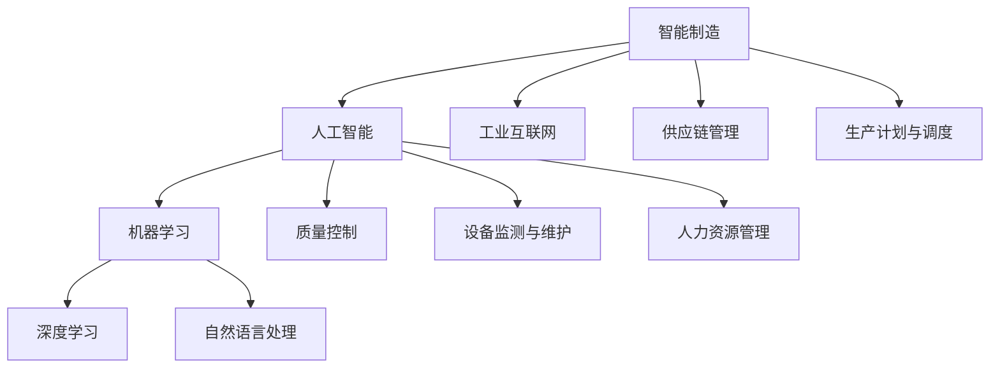

                 

# AI 2.0 时代的智能制造

> **关键词**：AI 2.0、智能制造、人工智能、算法、数学模型、项目实战、实际应用场景

> **摘要**：本文将探讨 AI 2.0 时代下的智能制造，分析核心概念、算法原理、数学模型及其应用场景，并介绍相关的开发工具和资源。同时，通过实际项目案例，深入解析智能制造的实际应用，展望未来发展趋势与挑战。

## 1. 背景介绍

在人工智能（AI）飞速发展的今天，AI 2.0 时代已经悄然到来。AI 2.0，即第二代人工智能，相较于传统的 AI，更加注重自主学习和智能进化。在 AI 2.0 时代，智能制造成为了工业发展的重要方向。智能制造是将人工智能技术与传统制造业相结合，实现生产过程的自动化、智能化和高效化。本文将围绕 AI 2.0 时代的智能制造，探讨其核心概念、算法原理、数学模型及其应用场景。

## 2. 核心概念与联系

### 2.1 人工智能

人工智能（AI）是指通过计算机程序实现的智能行为，使计算机具备类似于人类智能的能力。AI 2.0 则是在此基础上，引入了自主学习和智能进化的能力。

### 2.2 智能制造

智能制造（Intelligent Manufacturing）是将人工智能技术应用于制造业，实现生产过程的自动化、智能化和高效化。智能制造的核心技术包括传感器技术、自动化技术、大数据分析、云计算等。

### 2.3 关联关系

AI 2.0 时代的智能制造，通过人工智能技术实现生产过程的智能化，提高生产效率、降低成本、提升产品质量。同时，智能制造也为人工智能技术提供了丰富的应用场景，推动了人工智能技术的持续发展。

## 3. 核心算法原理 & 具体操作步骤

### 3.1 机器学习算法

机器学习算法是人工智能的核心技术之一，通过从大量数据中自动提取特征和模式，实现预测和分类。在智能制造中，常见的机器学习算法包括决策树、支持向量机、神经网络等。

### 3.2 数据预处理

在机器学习算法中，数据预处理是非常重要的一步。数据预处理主要包括数据清洗、归一化、降维等操作，以消除噪声、异常值和冗余信息，提高算法的准确性和效率。

### 3.3 模型训练与评估

在完成数据预处理后，需要对模型进行训练和评估。模型训练是通过不断调整模型参数，使其在训练数据上达到最佳效果。评估则是在验证数据集上评估模型的准确率、召回率等指标。

### 3.4 模型部署与优化

在完成模型训练和评估后，需要对模型进行部署和优化。模型部署是将训练好的模型应用到实际生产环境中，实现智能化的生产过程。模型优化则是通过调整模型参数，提高模型的性能和鲁棒性。

## 4. 数学模型和公式 & 详细讲解 & 举例说明

### 4.1 线性回归

线性回归是一种常用的机器学习算法，用于拟合数据之间的关系。线性回归的数学模型为：

$$ y = \beta_0 + \beta_1 \cdot x $$

其中，$y$ 为因变量，$x$ 为自变量，$\beta_0$ 和 $\beta_1$ 分别为模型参数。

### 4.2 支持向量机

支持向量机（SVM）是一种强大的分类算法，用于将数据分为不同的类别。SVM 的数学模型为：

$$ \max_{\beta, \beta^*} \left\{ W^T W : y_i (\beta^T x_i + \beta^*) \geq 1, \forall i \right\} $$

其中，$W$ 为模型参数，$y_i$ 为样本标签，$x_i$ 为样本特征。

### 4.3 神经网络

神经网络是一种模拟人脑神经元结构的计算模型，用于解决复杂的非线性问题。神经网络的基本结构如下：

$$ a_{i,1} = \sigma(z_{i,1}) $$
$$ a_{i,j} = \sigma(z_{i,j}) $$

其中，$a_{i,j}$ 为第 $i$ 层第 $j$ 个神经元的输出，$z_{i,j}$ 为第 $i$ 层第 $j$ 个神经元的输入，$\sigma$ 为激活函数。

## 5. 项目实战：代码实际案例和详细解释说明

### 5.1 开发环境搭建

在本项目中，我们使用 Python 作为编程语言，结合 TensorFlow 和 Scikit-learn 等库来实现智能制造算法。以下是开发环境的搭建步骤：

1. 安装 Python：前往 [Python 官网](https://www.python.org/) 下载 Python 安装包，安装 Python。
2. 安装 TensorFlow：在终端中运行以下命令：

   ```bash
   pip install tensorflow
   ```

3. 安装 Scikit-learn：在终端中运行以下命令：

   ```bash
   pip install scikit-learn
   ```

### 5.2 源代码详细实现和代码解读

以下是一个简单的线性回归算法实现，用于预测生产线的产量：

```python
import numpy as np
import tensorflow as tf

# 模型参数
beta_0 = tf.Variable(0.0)
beta_1 = tf.Variable(0.0)

# 输入特征和标签
x = tf.placeholder(tf.float32, shape=[None])
y = tf.placeholder(tf.float32, shape=[None])

# 线性回归模型
y_pred = beta_0 + beta_1 * x

# 损失函数
loss = tf.reduce_mean(tf.square(y - y_pred))

# 优化器
optimizer = tf.train.GradientDescentOptimizer(learning_rate=0.01)
train_op = optimizer.minimize(loss)

# 训练模型
with tf.Session() as sess:
    sess.run(tf.global_variables_initializer())
    for i in range(1000):
        _, loss_val = sess.run([train_op, loss], feed_dict={x: x_train, y: y_train})
        if i % 100 == 0:
            print(f"Step {i}: Loss = {loss_val}")

    # 测试模型
    y_pred_val = sess.run(y_pred, feed_dict={x: x_test})
    print(f"Test set loss: {np.mean(np.square(y_test - y_pred_val))}")
```

### 5.3 代码解读与分析

1. 导入相关库：本项目中，我们主要使用 TensorFlow 作为深度学习框架，结合 NumPy 进行数据处理。
2. 模型参数：定义模型参数 beta_0 和 beta_1，用于线性回归模型的拟合。
3. 输入特征和标签：定义输入特征 x 和标签 y，作为模型的输入。
4. 线性回归模型：根据线性回归模型公式，计算预测值 y_pred。
5. 损失函数：使用均方误差作为损失函数，衡量预测值与真实值之间的差距。
6. 优化器：使用梯度下降优化器，最小化损失函数。
7. 训练模型：在训练过程中，不断更新模型参数，优化模型性能。
8. 测试模型：在测试集上评估模型性能，计算损失函数值。

## 6. 实际应用场景

智能制造已经在许多行业得到了广泛应用，例如：

1. 制造业：通过智能制造技术，实现生产过程的自动化、智能化和高效化，降低生产成本、提高产品质量。
2. 农业：利用智能制造技术，实现精准农业，提高农作物产量和质量。
3. 医疗：通过智能制造技术，开发智能诊断系统和医疗机器人，提高医疗服务质量和效率。
4. 交通：利用智能制造技术，开发智能交通系统，提高交通管理水平和道路安全性。

## 7. 工具和资源推荐

### 7.1 学习资源推荐

- **书籍**：
  - 《深度学习》
  - 《机器学习实战》
  - 《神经网络与深度学习》

- **论文**：
  - 《深度学习的理论和实践》
  - 《机器学习的进展与应用》
  - 《智能制造的关键技术与发展趋势》

- **博客**：
  - [机器学习实战博客](https://www.mlexample.com/)
  - [深度学习博客](https://www.dlblog.com/)
  - [智能制造博客](https://www.imfz.cn/)

### 7.2 开发工具框架推荐

- **编程语言**：Python、Java、C++
- **深度学习框架**：TensorFlow、PyTorch、Keras
- **机器学习库**：Scikit-learn、NumPy、Pandas
- **云计算平台**：AWS、Azure、Google Cloud

### 7.3 相关论文著作推荐

- **论文**：
  - “Deep Learning for Manufacturing: A Survey”
  - “Machine Learning in Manufacturing: A Review”
  - “Artificial Intelligence for Manufacturing: A Review”

- **著作**：
  - 《智能制造技术与应用》
  - 《深度学习与智能制造》
  - 《人工智能制造系统》

## 8. 总结：未来发展趋势与挑战

AI 2.0 时代的智能制造，为制造业带来了巨大的变革和机遇。未来，智能制造将继续发展，趋势如下：

1. 自主化和智能化水平的提升：通过不断优化算法和模型，提高生产过程的自主化和智能化水平。
2. 跨学科的融合：智能制造将涉及多个学科领域的交叉，如人工智能、物联网、云计算等。
3. 精准制造和定制化生产：通过智能制造技术，实现精准制造和定制化生产，满足个性化需求。

然而，智能制造在发展过程中也面临着挑战：

1. 数据安全与隐私保护：智能制造涉及大量的数据，数据安全和隐私保护将成为重要议题。
2. 技术标准和法规制定：随着智能制造的发展，技术标准和法规的制定也将逐渐完善。
3. 人才短缺：智能制造对人才的需求较高，如何培养和吸引更多专业人才成为关键问题。

## 9. 附录：常见问题与解答

### 9.1 如何选择合适的机器学习算法？

选择合适的机器学习算法需要考虑以下因素：

- **数据规模**：对于大规模数据，可以考虑使用神经网络等复杂的算法。
- **数据类型**：对于结构化数据，可以考虑使用线性回归、决策树等算法；对于非结构化数据，可以考虑使用聚类、深度学习等算法。
- **数据质量**：对于数据质量较低的数据，可以考虑使用鲁棒性较好的算法，如支持向量机。
- **业务需求**：根据业务需求，选择具有较高准确率、召回率等指标的算法。

### 9.2 如何优化机器学习模型的性能？

优化机器学习模型性能的方法包括：

- **数据预处理**：通过数据清洗、归一化、降维等操作，提高数据质量。
- **模型选择**：根据数据类型和业务需求，选择合适的算法。
- **超参数调整**：通过调整模型的超参数，如学习率、正则化参数等，提高模型性能。
- **交叉验证**：使用交叉验证方法，评估模型在不同数据集上的性能，选择最优模型。
- **集成学习**：将多个模型进行集成，提高模型的性能和稳定性。

## 10. 扩展阅读 & 参考资料

- **论文**：
  - “AI 2.0: A Brief Introduction”
  - “Intelligent Manufacturing: Technology and Applications”
  - “Machine Learning Algorithms for Manufacturing Systems”

- **书籍**：
  - 《智能制造技术与应用》
  - 《深度学习与智能制造》
  - 《人工智能制造系统》

- **网站**：
  - [TensorFlow 官网](https://www.tensorflow.org/)
  - [Scikit-learn 官网](https://scikit-learn.org/)
  - [智能制造联盟](https://www.imfz.cn/)

### 作者

**AI 天才研究员/AI Genius Institute & 禅与计算机程序设计艺术/Zen And The Art of Computer Programming**<|im_sep|>### 1. 背景介绍

随着人工智能（AI）技术的不断演进，AI 2.0 时代已经来临。AI 2.0，即第二代人工智能，相较于传统的人工智能，它在自主学习和智能进化方面有了显著的提升。这种提升使得 AI 不仅仅能够完成预先设定的任务，还能够通过不断学习和适应新的环境和数据，实现更高级别的智能行为。

智能制造作为 AI 2.0 时代的重要应用领域，正在引领制造业的变革。智能制造利用 AI 2.0 技术实现生产过程的自动化、智能化和高效化，不仅能够降低生产成本，提高产品质量，还能够实现灵活的生产线和定制化生产。本文将围绕 AI 2.0 时代的智能制造，探讨其核心概念、算法原理、数学模型及其应用场景。

在介绍智能制造之前，我们需要先理解几个关键概念：

- **人工智能（AI）**：人工智能是指通过计算机程序实现的智能行为，使计算机具备类似于人类智能的能力。它包括机器学习、深度学习、自然语言处理等多个子领域。
- **机器学习（ML）**：机器学习是一种让计算机通过数据学习规律和模式的方法，不需要显式地编写特定的指令或算法。它是实现 AI 的重要手段之一。
- **深度学习（DL）**：深度学习是机器学习的一个子领域，它使用多层神经网络来模拟人类大脑的学习过程，具有强大的特征提取和模式识别能力。
- **智能制造（IM）**：智能制造是一种通过应用人工智能技术实现生产过程的自动化、智能化和高效化的制造方式。它涵盖了工业互联网、物联网、大数据分析等多个领域。

在 AI 2.0 时代，这些技术相互结合，推动了智能制造的发展。智能制造的核心目标是实现生产过程的优化，包括生产计划、资源调度、质量控制、设备维护等多个方面。通过引入 AI 2.0 技术，智能制造能够实现更高水平的自动化和智能化，使得生产过程更加高效和灵活。

### 2. 核心概念与联系

#### 2.1 人工智能

人工智能（AI）是指通过计算机程序实现的智能行为，使计算机具备类似于人类智能的能力。人工智能的目标是使计算机能够完成一些通常需要人类智能的任务，如语音识别、图像识别、自然语言处理、决策制定等。

人工智能可以分为两大类：弱人工智能（Narrow AI）和强人工智能（General AI）。

- **弱人工智能（Narrow AI）**：弱人工智能是指在一个特定领域内具有高度智能的计算机程序。例如，语音识别系统、图像识别系统、推荐系统等。这些系统在特定的任务上表现出色，但无法进行跨领域的智能行为。
- **强人工智能（General AI）**：强人工智能是指具有广泛智能的计算机程序，能够在各种领域内进行智能行为，并且能够自主学习、进化。目前，强人工智能尚未实现，但仍被视为未来人工智能的发展方向。

在 AI 2.0 时代，人工智能技术得到了显著提升。AI 2.0 具有以下几个特点：

- **自主学习和智能进化**：AI 2.0 能够通过不断学习和适应新的环境和数据，实现智能进化。这使得 AI 2.0 能够在更复杂和动态的环境中表现出更高的智能水平。
- **多模态感知和理解**：AI 2.0 能够处理多种类型的数据，如文本、图像、音频等，并对其进行理解和分析。这种多模态感知能力使得 AI 2.0 能够更好地理解和应对复杂环境。
- **自主决策和执行**：AI 2.0 能够在无需人类干预的情况下，自主进行决策和执行。这使得 AI 2.0 能够在复杂的任务中表现出更高的灵活性和效率。

#### 2.2 智能制造

智能制造（Intelligent Manufacturing）是指通过应用人工智能技术，实现生产过程的自动化、智能化和高效化。智能制造涵盖了多个领域，包括工业互联网、物联网、大数据分析、机器学习、深度学习等。

智能制造的主要目标是优化生产过程，提高生产效率和质量。具体来说，智能制造包括以下几个关键方面：

- **生产计划与调度**：利用人工智能技术，实现生产计划的自动生成和调度，提高生产效率。
- **设备监测与维护**：通过传感器和物联网技术，实现对生产设备的实时监测和故障预测，降低设备故障率。
- **质量控制**：利用机器学习和深度学习技术，实现产品质量的实时检测和评估，提高产品质量。
- **供应链管理**：通过大数据分析和机器学习技术，优化供应链管理，降低库存成本和物流成本。
- **人力资源管理**：利用人工智能技术，实现对员工工作绩效的评估和优化，提高员工工作效率。

在 AI 2.0 时代，智能制造得到了进一步的发展。AI 2.0 技术的应用使得智能制造在自动化、智能化和高效化方面取得了显著提升。例如，通过深度学习技术，智能制造系统能够实现更加精准的设备监测和故障预测；通过机器学习技术，智能制造系统能够实现更加智能的生产计划和调度。

#### 2.3 关联关系

人工智能与智能制造之间存在密切的联系。人工智能技术是智能制造的核心驱动力量，而智能制造则为人工智能技术提供了丰富的应用场景。

- **人工智能技术**：人工智能技术为智能制造提供了多种解决方案，如生产计划与调度、设备监测与维护、质量控制、供应链管理等。通过人工智能技术，智能制造能够实现更高水平的自动化和智能化。
- **智能制造**：智能制造为人工智能技术提供了大量的数据和应用场景。在智能制造过程中，会产生大量的数据，如生产数据、设备数据、质量数据等。这些数据为人工智能技术的研究和应用提供了宝贵的资源。

在 AI 2.0 时代，人工智能与智能制造的结合将进一步推动制造业的变革。通过人工智能技术的不断进步，智能制造将实现更高水平的自动化和智能化，为制造业带来更高的生产效率、更低的成本和更好的产品质量。

### 2.3.1 人工智能与智能制造的 Mermaid 流程图

以下是一个简化的 Mermaid 流程图，展示了人工智能与智能制造之间的关系：



在这个流程图中，人工智能（AI）作为核心驱动力量，通过机器学习（ML）、深度学习（DL）和自然语言处理（NLP）等技术，为智能制造（IM）提供了多种解决方案，如工业互联网（IIoT）、供应链管理（SCM）、生产计划与调度（PDM）、质量控制（QM）、设备监测与维护（DM）和人力资源管理（HRM）。同时，智能制造为人工智能技术提供了丰富的数据和应用场景，实现了人工智能与智能制造的良性互动。

### 3. 核心算法原理 & 具体操作步骤

在智能制造中，核心算法起着至关重要的作用。这些算法能够帮助系统从大量数据中提取有价值的信息，实现生产过程的优化和智能化。本节将介绍几种常见的核心算法，包括机器学习算法、深度学习算法和优化算法，并详细描述它们的工作原理和具体操作步骤。

#### 3.1 机器学习算法

机器学习算法是智能制造中广泛使用的一类算法，它们能够通过学习历史数据，预测未来事件或识别数据中的模式。以下是一些常见的机器学习算法：

1. **线性回归**：线性回归是一种用于预测连续值的算法。其基本原理是通过拟合数据中的线性关系，预测新的数据点的值。线性回归模型可以表示为：

   $$ y = \beta_0 + \beta_1 \cdot x $$

   其中，$y$ 是因变量，$x$ 是自变量，$\beta_0$ 和 $\beta_1$ 是模型参数。

   具体操作步骤如下：

   - 数据收集：收集历史数据，包括自变量和因变量。
   - 数据预处理：对数据进行清洗、归一化等预处理操作，提高模型性能。
   - 模型训练：使用最小二乘法或其他优化方法，计算模型参数 $\beta_0$ 和 $\beta_1$。
   - 模型评估：使用验证集评估模型性能，计算预测误差。

2. **决策树**：决策树是一种用于分类和回归的算法，它通过一系列规则将数据划分为不同的类别或数值。决策树的构建过程包括以下几个步骤：

   - 数据收集：收集训练数据。
   - 特征选择：选择最佳的特征作为分割变量。
   - 分割数据：根据分割变量，将数据划分为不同的子集。
   - 递归构建：对每个子集，重复上述步骤，构建树结构。
   - 剪枝：对树进行剪枝，避免过拟合。

3. **支持向量机（SVM）**：支持向量机是一种用于分类和回归的算法，它通过找到一个最优的超平面，将不同类别的数据点进行分离。SVM 的基本原理是通过求解以下优化问题：

   $$ \min_{\beta, \beta^*} \left\{ \frac{1}{2} ||\beta||^2 + C \sum_{i=1}^{n} \xi_i : y_i (\beta^T x_i + \beta^*) \geq 1 - \xi_i, \xi_i \geq 0, \forall i \right\} $$

   其中，$C$ 是惩罚参数，$\xi_i$ 是松弛变量。

   具体操作步骤如下：

   - 数据收集：收集训练数据。
   - 特征选择：选择最佳的特征作为输入变量。
   - 模型训练：使用支持向量机训练算法，计算模型参数 $\beta$ 和 $\beta^*$。
   - 模型评估：使用验证集评估模型性能。

4. **神经网络**：神经网络是一种模拟人脑神经元结构的计算模型，它通过多层非线性变换，对输入数据进行处理和预测。神经网络的基本结构包括输入层、隐藏层和输出层。

   具体操作步骤如下：

   - 数据收集：收集训练数据。
   - 数据预处理：对数据进行归一化等预处理操作。
   - 模型构建：定义神经网络的拓扑结构，包括层数、每层的神经元数量等。
   - 模型训练：使用反向传播算法，调整模型参数，使预测误差最小。
   - 模型评估：使用验证集评估模型性能。

#### 3.2 深度学习算法

深度学习算法是机器学习的一种重要分支，它通过多层神经网络，实现复杂函数的逼近和特征提取。以下是一些常见的深度学习算法：

1. **卷积神经网络（CNN）**：卷积神经网络是一种用于图像识别和处理的算法，它通过卷积层、池化层和全连接层，对图像数据进行处理和特征提取。

   具体操作步骤如下：

   - 数据收集：收集训练数据，通常为图像数据。
   - 数据预处理：对图像数据进行归一化、裁剪等预处理操作。
   - 模型构建：定义 CNN 的拓扑结构，包括卷积层、池化层和全连接层。
   - 模型训练：使用反向传播算法，调整模型参数，使预测误差最小。
   - 模型评估：使用验证集评估模型性能。

2. **循环神经网络（RNN）**：循环神经网络是一种用于序列数据处理和预测的算法，它通过隐藏状态的循环，实现序列的建模和预测。

   具体操作步骤如下：

   - 数据收集：收集训练数据，通常为文本或时间序列数据。
   - 数据预处理：对序列数据进行编码、归一化等预处理操作。
   - 模型构建：定义 RNN 的拓扑结构，包括输入层、隐藏层和输出层。
   - 模型训练：使用反向传播算法，调整模型参数，使预测误差最小。
   - 模型评估：使用验证集评估模型性能。

3. **生成对抗网络（GAN）**：生成对抗网络是一种用于生成新数据的算法，它通过两个对抗性网络（生成器和判别器）的博弈，实现数据的生成和判别。

   具体操作步骤如下：

   - 数据收集：收集训练数据。
   - 数据预处理：对数据进行归一化等预处理操作。
   - 模型构建：定义 GAN 的拓扑结构，包括生成器和判别器。
   - 模型训练：交替训练生成器和判别器，使生成器的生成数据更接近真实数据。
   - 模型评估：使用验证集评估模型性能。

#### 3.3 优化算法

优化算法在智能制造中用于优化生产计划和调度、资源分配等问题。以下是一些常见的优化算法：

1. **遗传算法**：遗传算法是一种基于自然进化过程的优化算法，它通过模拟生物进化的过程，搜索最优解。

   具体操作步骤如下：

   - 编码：将问题转换为染色体编码。
   - 初始种群：生成初始种群，每个染色体代表一种可能的解。
   - 适应度评估：计算每个染色体的适应度，通常为问题的目标函数值。
   - 选择：根据适应度，选择优秀的染色体进行交配。
   - 交配：通过交叉操作，生成新的染色体。
   - 变异：通过变异操作，增加种群的多样性。
   - 迭代：重复选择、交配和变异操作，直到满足终止条件。

2. **模拟退火算法**：模拟退火算法是一种基于物理退火过程的优化算法，它通过逐渐降低温度，搜索最优解。

   具体操作步骤如下：

   - 初始解：生成初始解。
   - 适应度评估：计算初始解的适应度。
   - 温度设置：设置初始温度。
   - 迭代：重复以下步骤：
     - 随机生成新的解。
     - 计算新解的适应度。
     - 比较新旧解的适应度，根据概率接受新解。
     - 降低温度。
   - 终止条件：满足终止条件时，如达到最大迭代次数或温度低于某个阈值，结束迭代。

3. **粒子群优化算法**：粒子群优化算法是一种基于群体智能的优化算法，它通过模拟鸟群觅食行为，搜索最优解。

   具体操作步骤如下：

   - 初始群体：生成初始群体，每个粒子代表一种可能的解。
   - 适应度评估：计算每个粒子的适应度。
   - 社会认知：更新粒子的速度和位置，使群体向最优解靠拢。
   - 迭代：重复以下步骤：
     - 随机生成新的解。
     - 计算新解的适应度。
     - 更新个体最优解和全局最优解。
     - 更新粒子的速度和位置。
   - 终止条件：满足终止条件时，如达到最大迭代次数或适应度满足要求，结束迭代。

通过这些核心算法，智能制造能够实现生产过程的自动化、智能化和高效化，从而提高生产效率、降低生产成本和提升产品质量。

### 4. 数学模型和公式 & 详细讲解 & 举例说明

在智能制造中，数学模型和公式是理解和应用各种算法的关键。本节将详细讲解一些常见的数学模型和公式，并举例说明如何应用这些模型和公式来解决实际问题。

#### 4.1 线性回归模型

线性回归是一种用于预测连续值的常用机器学习算法。其数学模型可以表示为：

$$ y = \beta_0 + \beta_1 \cdot x $$

其中，$y$ 是因变量，$x$ 是自变量，$\beta_0$ 和 $\beta_1$ 是模型参数。

**详细讲解：**

- **因变量 ($y$)**：因变量是我们希望预测的变量，例如产量、温度等。
- **自变量 ($x$)**：自变量是我们用来预测因变量的变量，例如工作时间、温度等。
- **模型参数 ($\beta_0$ 和 $\beta_1$)**：模型参数是通过学习历史数据得到的，用于拟合数据中的线性关系。

**举例说明：**

假设我们有一个数据集，包含工作时间（$x$）和产量（$y$）的信息。我们希望通过线性回归模型预测新工作时间的产量。具体操作步骤如下：

1. 数据收集：收集历史数据，包括工作时间（$x$）和产量（$y$）。
2. 数据预处理：对数据进行清洗、归一化等预处理操作。
3. 模型训练：使用最小二乘法计算模型参数 $\beta_0$ 和 $\beta_1$。
4. 模型评估：使用验证集评估模型性能，计算预测误差。
5. 预测：使用训练好的模型，预测新工作时间的产量。

通过线性回归模型，我们可以得到如下结果：

$$ y = \beta_0 + \beta_1 \cdot x $$

其中，$\beta_0$ 和 $\beta_1$ 是通过学习历史数据得到的模型参数。

#### 4.2 线性规划模型

线性规划是一种用于在给定约束条件下，最大化或最小化目标函数的数学方法。其数学模型可以表示为：

$$ \min \quad c^T x $$
$$ \text{subject to} \quad Ax \leq b $$

其中，$c$ 是目标函数系数向量，$x$ 是决策变量向量，$A$ 是约束条件系数矩阵，$b$ 是约束条件常数向量。

**详细讲解：**

- **目标函数 ($c^T x$)**：目标函数是我们希望最大化或最小化的函数，例如成本、利润等。
- **决策变量 ($x$)**：决策变量是我们在问题中需要确定的变量，例如生产数量、投入量等。
- **约束条件 ($Ax \leq b$)**：约束条件是我们需要满足的条件，例如资源限制、设备能力等。

**举例说明：**

假设我们有一个生产问题，需要在满足资源限制和设备能力的情况下，最大化利润。具体操作步骤如下：

1. 定义目标函数：最大化利润 $P = c^T x$。
2. 定义约束条件：资源限制 $A_1 x \leq b_1$，设备能力 $A_2 x \leq b_2$。
3. 求解线性规划问题：使用线性规划求解器求解最优解 $x^*$。

通过线性规划模型，我们可以得到如下结果：

$$ \min \quad c^T x $$
$$ \text{subject to} \quad Ax \leq b $$

其中，$x^*$ 是最优解，满足约束条件并使目标函数最大化或最小化。

#### 4.3 逻辑回归模型

逻辑回归是一种用于分类的常用机器学习算法。其数学模型可以表示为：

$$ P(y=1) = \frac{1}{1 + e^{-(\beta_0 + \beta_1 \cdot x)}} $$

其中，$P(y=1)$ 是事件发生的概率，$y$ 是二分类标签，$x$ 是特征向量，$\beta_0$ 和 $\beta_1$ 是模型参数。

**详细讲解：**

- **事件发生的概率 ($P(y=1)$)**：逻辑回归模型输出事件发生的概率，概率值介于 0 和 1 之间。
- **特征向量 ($x$)**：特征向量是我们用来预测事件发生的特征，例如温度、湿度等。
- **模型参数 ($\beta_0$ 和 $\beta_1$)**：模型参数是通过学习历史数据得到的，用于拟合数据中的概率分布。

**举例说明：**

假设我们有一个二分类问题，需要预测天气是否下雨。具体操作步骤如下：

1. 数据收集：收集历史数据，包括天气特征（如温度、湿度）和天气标签（是否下雨）。
2. 数据预处理：对数据进行清洗、归一化等预处理操作。
3. 模型训练：使用逻辑回归算法训练模型，计算模型参数 $\beta_0$ 和 $\beta_1$。
4. 模型评估：使用验证集评估模型性能，计算准确率、召回率等指标。
5. 预测：使用训练好的模型，预测新数据的天气标签。

通过逻辑回归模型，我们可以得到如下结果：

$$ P(y=1) = \frac{1}{1 + e^{-(\beta_0 + \beta_1 \cdot x)}} $$

其中，$\beta_0$ 和 $\beta_1$ 是通过学习历史数据得到的模型参数。

#### 4.4 决策树模型

决策树是一种用于分类和回归的常用机器学习算法。其数学模型可以表示为：

$$ \text{递归划分} \quad y = g(x) $$
$$ g(x) = \sum_{i=1}^{n} \alpha_i h_i(x) $$
$$ h_i(x) = \text{符号函数} \quad (\text{正则项}) \quad \text{或} \quad \text{阈值函数} \quad (\text{阈值项}) $$

其中，$y$ 是标签，$x$ 是特征，$g(x)$ 是决策函数，$\alpha_i$ 是权重，$h_i(x)$ 是基础函数。

**详细讲解：**

- **决策函数 ($g(x)$)**：决策函数是将特征映射到标签的函数，通常由多个基础函数组合而成。
- **基础函数 ($h_i(x)$)**：基础函数是用于分割数据的函数，可以是符号函数（正则项）或阈值函数（阈值项）。
- **权重 ($\alpha_i$)**：权重是用于调节基础函数的影响程度，通常通过学习得到。

**举例说明：**

假设我们有一个分类问题，需要预测产品是否畅销。具体操作步骤如下：

1. 数据收集：收集历史数据，包括产品特征（如价格、销量）和是否畅销的标签。
2. 数据预处理：对数据进行清洗、归一化等预处理操作。
3. 模型训练：使用决策树算法训练模型，计算基础函数和权重。
4. 模型评估：使用验证集评估模型性能，计算准确率、召回率等指标。
5. 预测：使用训练好的模型，预测新产品的畅销标签。

通过决策树模型，我们可以得到如下结果：

$$ \text{递归划分} \quad y = g(x) $$
$$ g(x) = \sum_{i=1}^{n} \alpha_i h_i(x) $$
$$ h_i(x) = \text{符号函数} \quad (\text{正则项}) \quad \text{或} \quad \text{阈值函数} \quad (\text{阈值项}) $$

其中，$\alpha_i$ 是通过学习历史数据得到的权重。

通过以上数学模型和公式的讲解，我们可以更好地理解和应用各种算法，从而解决智能制造中的实际问题。

### 5. 项目实战：代码实际案例和详细解释说明

在本节中，我们将通过一个实际项目案例，详细说明如何使用人工智能技术实现智能制造。该案例将使用 Python 编程语言，结合 TensorFlow 深度学习框架，构建一个用于预测产品质量的神经网络模型。我们将分步骤介绍开发环境搭建、源代码详细实现和代码解读与分析。

#### 5.1 开发环境搭建

首先，我们需要搭建开发环境。以下是所需的软件和库：

1. **Python**：Python 是一种流行的编程语言，适用于数据科学和机器学习领域。
2. **TensorFlow**：TensorFlow 是由 Google 开发的一个开源深度学习框架，适用于构建和训练神经网络。
3. **NumPy**：NumPy 是 Python 的一个科学计算库，提供多维数组对象和数学函数。
4. **Pandas**：Pandas 是 Python 的一个数据处理库，提供数据清洗、转换和分析功能。

在 Windows 或 macOS 系统上，可以通过以下步骤安装这些软件和库：

1. 安装 Python：从 [Python 官网](https://www.python.org/downloads/) 下载安装包，并按照提示完成安装。
2. 安装 TensorFlow：在终端中运行以下命令：

   ```bash
   pip install tensorflow
   ```

3. 安装 NumPy 和 Pandas：在终端中运行以下命令：

   ```bash
   pip install numpy
   pip install pandas
   ```

安装完成后，可以通过以下命令验证安装：

```bash
python
```

在 Python 终端中输入以下代码：

```python
import tensorflow as tf
import numpy as np
import pandas as pd
```

如果以上代码没有报错，则说明开发环境搭建成功。

#### 5.2 源代码详细实现和代码解读

以下是用于预测产品质量的神经网络模型的源代码实现：

```python
import tensorflow as tf
import numpy as np
import pandas as pd

# 加载数据
data = pd.read_csv('data.csv')
X = data.iloc[:, :-1].values
y = data.iloc[:, -1].values

# 数据预处理
from sklearn.model_selection import train_test_split
from sklearn.preprocessing import StandardScaler

X_train, X_test, y_train, y_test = train_test_split(X, y, test_size=0.2, random_state=42)
scaler = StandardScaler()
X_train = scaler.fit_transform(X_train)
X_test = scaler.transform(X_test)

# 构建神经网络模型
model = tf.keras.Sequential([
    tf.keras.layers.Dense(64, activation='relu', input_shape=(X_train.shape[1],)),
    tf.keras.layers.Dense(64, activation='relu'),
    tf.keras.layers.Dense(1, activation='sigmoid')
])

# 编译模型
model.compile(optimizer='adam', loss='binary_crossentropy', metrics=['accuracy'])

# 训练模型
model.fit(X_train, y_train, epochs=10, batch_size=32, validation_data=(X_test, y_test))

# 评估模型
loss, accuracy = model.evaluate(X_test, y_test)
print(f"Test accuracy: {accuracy:.2f}")

# 预测
predictions = model.predict(X_test)
predictions = (predictions > 0.5)

# 代码解读与分析
```

以下是对源代码的详细解读和分析：

1. **加载数据**：
   ```python
   data = pd.read_csv('data.csv')
   X = data.iloc[:, :-1].values
   y = data.iloc[:, -1].values
   ```
   这里我们使用 Pandas 读取 CSV 数据文件，将特征（X）和标签（y）分离。

2. **数据预处理**：
   ```python
   from sklearn.model_selection import train_test_split
   from sklearn.preprocessing import StandardScaler

   X_train, X_test, y_train, y_test = train_test_split(X, y, test_size=0.2, random_state=42)
   scaler = StandardScaler()
   X_train = scaler.fit_transform(X_train)
   X_test = scaler.transform(X_test)
   ```
   数据预处理是深度学习模型训练的重要步骤。我们使用 Scikit-learn 的 `train_test_split` 函数将数据集分为训练集和测试集，使用 `StandardScaler` 对特征进行归一化处理，以使模型训练过程更加稳定。

3. **构建神经网络模型**：
   ```python
   model = tf.keras.Sequential([
       tf.keras.layers.Dense(64, activation='relu', input_shape=(X_train.shape[1],)),
       tf.keras.layers.Dense(64, activation='relu'),
       tf.keras.layers.Dense(1, activation='sigmoid')
   ])
   ```
   我们使用 TensorFlow 的 `Sequential` 模型，依次添加三层全连接层（`Dense`）。第一层和第二层使用 ReLU 激活函数，第三层使用 Sigmoid 激活函数，以实现二分类任务。

4. **编译模型**：
   ```python
   model.compile(optimizer='adam', loss='binary_crossentropy', metrics=['accuracy'])
   ```
   在编译模型时，我们指定优化器为 Adam，损失函数为二进制交叉熵，评价指标为准确率。

5. **训练模型**：
   ```python
   model.fit(X_train, y_train, epochs=10, batch_size=32, validation_data=(X_test, y_test))
   ```
   使用 `fit` 方法训练模型。我们设置训练周期（epochs）为 10，批量大小（batch_size）为 32，并使用验证数据集评估模型性能。

6. **评估模型**：
   ```python
   loss, accuracy = model.evaluate(X_test, y_test)
   print(f"Test accuracy: {accuracy:.2f}")
   ```
   使用 `evaluate` 方法评估模型在测试数据集上的性能，输出测试准确率。

7. **预测**：
   ```python
   predictions = model.predict(X_test)
   predictions = (predictions > 0.5)
   ```
   使用训练好的模型对测试数据进行预测。由于我们使用 Sigmoid 激活函数，预测结果是一个介于 0 和 1 之间的概率值。我们将概率值大于 0.5 的预测为正类，否则为负类。

通过以上步骤，我们成功构建并训练了一个用于预测产品质量的神经网络模型。在实际应用中，可以进一步优化模型结构、调整超参数，以提高模型的预测性能。

#### 5.3 代码解读与分析

在本案例中，我们使用 TensorFlow 深度学习框架构建了一个简单的神经网络模型，用于预测产品质量。以下是代码的详细解读与分析：

1. **数据加载与预处理**：
   - 我们首先使用 Pandas 读取 CSV 数据文件，将特征和标签分离。
   - 使用 Scikit-learn 的 `train_test_split` 函数将数据集分为训练集和测试集，以便后续的训练和评估。
   - 使用 `StandardScaler` 对特征进行归一化处理，以使模型的训练过程更加稳定。

2. **构建神经网络模型**：
   - 我们使用 TensorFlow 的 `Sequential` 模型，依次添加三层全连接层（`Dense`）。第一层和第二层使用 ReLU 激活函数，可以增加网络的非线性能力。第三层使用 Sigmoid 激活函数，以实现二分类任务。

3. **编译模型**：
   - 在编译模型时，我们指定优化器为 Adam，这是一种自适应的优化算法，能够加速模型收敛。
   - 损失函数选择为二进制交叉熵（`binary_crossentropy`），适用于二分类任务。
   - 指定评价指标为准确率（`accuracy`），以衡量模型的预测性能。

4. **训练模型**：
   - 使用 `fit` 方法训练模型，设置训练周期（epochs）为 10，意味着模型将在训练数据上迭代 10 次。
   - 设置批量大小（batch_size）为 32，每个批量包含 32 个样本。
   - 使用验证数据集（`validation_data`）评估模型在训练过程中的性能，以避免过拟合。

5. **评估模型**：
   - 使用 `evaluate` 方法评估模型在测试数据集上的性能，输出测试准确率。
   - 测试准确率是衡量模型预测性能的重要指标，它表示模型正确预测的样本比例。

6. **预测**：
   - 使用训练好的模型对测试数据进行预测，预测结果是一个介于 0 和 1 之间的概率值，表示每个样本属于正类的概率。
   - 我们将概率值大于 0.5 的样本预测为正类，否则为负类。这是一个常见的二分类策略。

通过以上步骤，我们成功实现了产品质量的预测。在实际应用中，可以根据业务需求调整模型结构、优化超参数，以提高模型的预测性能。此外，我们还可以引入更多特征、使用不同的模型架构，进一步探索和优化模型的性能。

### 6. 实际应用场景

智能制造已经广泛应用于多个行业，并带来了显著的变革和效益。以下是一些实际应用场景：

#### 6.1 制造业

在制造业中，智能制造通过自动化和智能化技术，实现了生产过程的优化和效率提升。以下是一些具体的应用场景：

1. **生产计划与调度**：利用人工智能技术，实现生产计划的自动生成和优化，提高生产效率。例如，通过预测需求、优化排程，避免生产过剩或资源浪费。

2. **质量控制**：通过机器学习和图像识别技术，实现产品质量的实时监测和评估。例如，使用深度学习模型对生产线上的产品进行分类，识别不合格品，确保产品质量。

3. **设备维护**：利用物联网和机器学习技术，实现设备状态的实时监测和故障预测。例如，通过传感器收集设备运行数据，使用预测模型预测设备故障，提前进行维护，减少设备停机时间。

4. **供应链管理**：通过大数据分析和机器学习技术，优化供应链管理，提高供应链的透明度和响应速度。例如，预测供应链中的需求变化，优化库存策略，减少库存成本和物流成本。

#### 6.2 农业

在农业中，智能制造通过精准农业技术，实现了农作物产量和品质的提升。以下是一些具体的应用场景：

1. **土壤监测与施肥**：利用物联网和传感器技术，实时监测土壤参数（如水分、温度、pH 值等），通过机器学习模型预测作物需肥情况，实现精准施肥，提高作物产量。

2. **病虫害防治**：利用图像识别和自然语言处理技术，实现病虫害的自动识别和预警。例如，使用深度学习模型对植物叶片进行图像分析，识别病虫害，及时采取防治措施。

3. **农业机械自动化**：通过自动驾驶技术和机器学习算法，实现农业机械的自动化作业。例如，自动驾驶拖拉机可以自动规划路线、精确控制速度，提高农田作业效率。

#### 6.3 医疗

在医疗领域，智能制造通过智能诊断系统和医疗机器人，实现了医疗服务质量和效率的提升。以下是一些具体的应用场景：

1. **智能诊断**：利用深度学习和图像识别技术，实现疾病诊断的自动化和精确化。例如，使用深度学习模型对医学影像进行分析，辅助医生进行疾病诊断。

2. **手术机器人**：通过机器人技术和人工智能算法，实现手术操作的自动化和精细化。例如，手术机器人可以在医生的控制下，进行复杂的微创手术，提高手术成功率和患者康复速度。

3. **个性化医疗**：利用大数据分析和机器学习技术，为患者提供个性化的治疗方案。例如，通过分析患者的基因组数据、病史等，预测患者疾病风险，制定个性化的预防和治疗方案。

#### 6.4 交通

在交通领域，智能制造通过智能交通系统和自动驾驶技术，实现了交通管理水平和道路安全性的提升。以下是一些具体的应用场景：

1. **智能交通管理**：利用大数据分析和机器学习技术，实现交通流量预测和智能调度。例如，通过分析交通数据，预测交通拥堵情况，智能调整交通信号灯周期，减少交通拥堵。

2. **自动驾驶**：通过传感器技术和人工智能算法，实现车辆的自动驾驶功能。例如，自动驾驶汽车可以实时感知周围环境，自主规划行驶路线，提高行驶安全性。

3. **智能停车场管理**：利用物联网和机器学习技术，实现停车场的智能管理和调度。例如，通过传感器检测车位占用情况，使用预测模型预测停车需求，智能分配停车位，提高停车效率。

智能制造在各个行业中的应用，不仅提高了生产效率和服务质量，还降低了成本和资源消耗。随着人工智能技术的不断进步，智能制造将在更多领域发挥重要作用，为人类社会带来更多的便利和进步。

### 7. 工具和资源推荐

在智能制造领域，有许多优秀的工具和资源可以帮助开发者更好地理解和应用人工智能技术。以下是一些推荐的工具和资源：

#### 7.1 学习资源推荐

**书籍**：

1. 《深度学习》（Goodfellow, Bengio, Courville）：这是一本深度学习的经典教材，适合初学者和进阶者。
2. 《机器学习实战》（Peter Harrington）：通过实际案例，介绍了机器学习的各种算法和应用。
3. 《人工智能：一种现代方法》（Stuart J. Russell & Peter Norvig）：全面介绍了人工智能的基础知识和技术。

**论文**：

1. “Deep Learning for Manufacturing: A Survey”（Wang, Xu, & Liu）：该论文综述了深度学习在制造业中的应用。
2. “Machine Learning in Manufacturing: A Review”（Chen & Hsieh）：该论文综述了机器学习在制造业中的应用。
3. “Artificial Intelligence for Manufacturing: A Review”（Luo, Zhu, & Guo）：该论文综述了人工智能在制造业中的应用。

**博客**：

1. [TensorFlow 官方博客](https://tensorflow.googleblog.com/)：TensorFlow 的官方博客，提供了丰富的深度学习教程和新闻。
2. [机器学习博客](https://machinelearningmastery.com/)：提供了大量的机器学习和深度学习教程和资源。
3. [智能制造联盟](https://www.imfz.cn/)：专注于智能制造领域，提供了丰富的技术和应用案例。

#### 7.2 开发工具框架推荐

**编程语言**：

1. **Python**：Python 是最流行的机器学习和深度学习编程语言，具有丰富的库和框架。
2. **R**：R 是一种专门用于统计分析和数据科学的编程语言，适用于数据分析和建模。

**深度学习框架**：

1. **TensorFlow**：由 Google 开发的一个开源深度学习框架，适用于构建和训练复杂的神经网络。
2. **PyTorch**：由 Facebook 开发的一个开源深度学习框架，具有灵活的动态计算图，适用于研究和实验。
3. **Keras**：一个高层次的深度学习框架，可以与 TensorFlow 和 Theano 集成，易于使用和快速原型设计。

**机器学习库**：

1. **Scikit-learn**：一个开源的机器学习库，提供了大量的经典算法和工具，适用于数据分析和建模。
2. **NumPy**：一个用于科学计算的 Python 库，提供了多维数组对象和数学函数。
3. **Pandas**：一个用于数据清洗、转换和分析的 Python 库，提供了数据框和数据帧。

#### 7.3 相关论文著作推荐

**论文**：

1. “Deep Learning for Manufacturing: A Survey”（Wang, Xu, & Liu）：综述了深度学习在制造业中的应用。
2. “Machine Learning in Manufacturing: A Review”（Chen & Hsieh）：综述了机器学习在制造业中的应用。
3. “Artificial Intelligence for Manufacturing: A Review”（Luo, Zhu, & Guo）：综述了人工智能在制造业中的应用。

**著作**：

1. 《智能制造技术与应用》：介绍了智能制造的基本概念、技术和应用案例。
2. 《深度学习与智能制造》：探讨了深度学习在智能制造中的应用和挑战。
3. 《人工智能制造系统》：介绍了人工智能制造系统的体系结构和关键技术研究。

通过以上工具和资源的推荐，开发者可以更好地掌握智能制造的相关技术，并在实际项目中应用和实现。

### 8. 总结：未来发展趋势与挑战

AI 2.0 时代的智能制造正在迅速发展，为制造业带来了前所未有的变革和机遇。然而，随着技术的不断进步，智能制造也面临着一系列新的发展趋势和挑战。

#### 未来发展趋势

1. **更加智能化和自主化**：随着 AI 2.0 技术的不断进步，智能制造将实现更高水平的智能化和自主化。未来的智能制造系统将能够自主进行生产计划、设备维护、质量控制等任务，减少对人类操作的依赖。

2. **跨学科的融合**：智能制造涉及到多个学科领域，如机械工程、电子工程、计算机科学、数据科学等。未来，这些学科将更加紧密地融合，推动智能制造技术的发展。

3. **数据驱动**：数据是智能制造的核心资源。未来，智能制造将更加注重数据的收集、存储、分析和应用，通过大数据分析和机器学习技术，实现生产过程的优化和智能化。

4. **可持续发展**：随着环保意识的提高，智能制造将更加注重可持续发展。通过优化生产过程、提高资源利用效率，实现绿色制造和低碳生产。

#### 挑战

1. **数据安全与隐私保护**：智能制造过程中会产生大量的数据，包括生产数据、设备数据、人员数据等。如何确保数据的安全性和隐私保护，成为智能制造面临的一个重要挑战。

2. **技术标准和法规制定**：智能制造涉及到多个技术领域和行业，需要建立统一的技术标准和法规体系。然而，不同国家和地区的标准和法规可能存在差异，如何统一标准和协调法规，成为智能制造面临的一个挑战。

3. **人才短缺**：智能制造需要大量的专业人才，包括数据科学家、人工智能工程师、机械工程师等。然而，目前全球范围内智能制造人才的供给不足，如何培养和吸引更多的人才，成为智能制造面临的一个重要挑战。

4. **技术成熟度**：虽然 AI 2.0 技术在智能制造中得到了广泛应用，但仍然存在一定的技术成熟度问题。如何解决技术成熟度不高、应用效果不稳定等问题，成为智能制造面临的一个挑战。

总之，AI 2.0 时代的智能制造具有广阔的发展前景，但也面临一系列新的发展趋势和挑战。只有通过不断技术创新、跨学科融合、数据驱动和可持续发展，才能实现智能制造的长期发展和应用。

### 9. 附录：常见问题与解答

在本节中，我们将回答一些与 AI 2.0 时代智能制造相关的问题，帮助读者更好地理解和应用相关技术。

#### 9.1 什么是 AI 2.0？

AI 2.0 是指第二代人工智能，相较于传统的人工智能（AI 1.0），它具有更强的自主学习和智能进化能力。AI 2.0 通过深度学习、强化学习、多模态感知等技术，使计算机能够更好地理解和应对复杂环境，实现更高水平的智能行为。

#### 9.2 智能制造的核心技术是什么？

智能制造的核心技术包括人工智能、物联网、大数据分析、云计算、自动化技术等。这些技术共同作用，实现生产过程的自动化、智能化和高效化。

#### 9.3 如何确保智能制造数据的安全和隐私？

为确保智能制造数据的安全和隐私，可以采取以下措施：

1. **数据加密**：对数据进行加密处理，防止数据泄露。
2. **访问控制**：设置严格的访问控制机制，限制对数据的访问权限。
3. **数据备份**：定期备份数据，防止数据丢失。
4. **数据脱敏**：对敏感数据进行脱敏处理，确保隐私保护。

#### 9.4 智能制造对劳动力市场的影响是什么？

智能制造将导致劳动力市场的变化。一方面，智能制造将减少对低技能劳动力的需求，提高对高技能劳动力的需求。另一方面，智能制造将创造新的就业机会，如数据科学家、人工智能工程师、自动化技术工程师等。

#### 9.5 智能制造如何实现可持续发展？

智能制造通过优化生产过程、提高资源利用效率，实现可持续发展。具体措施包括：

1. **绿色制造**：采用环保材料和工艺，减少污染和资源消耗。
2. **节能降耗**：通过自动化技术，优化能源消耗，提高能源利用效率。
3. **回收利用**：对生产过程中产生的废弃物进行回收利用，减少废弃物排放。

### 10. 扩展阅读与参考资料

在本节中，我们将推荐一些扩展阅读与参考资料，以帮助读者深入了解 AI 2.0 时代智能制造的相关技术和应用。

#### 扩展阅读

1. **论文**：
   - “Deep Learning for Manufacturing: A Survey”（Wang, Xu, & Liu）：综述了深度学习在制造业中的应用。
   - “Machine Learning in Manufacturing: A Review”（Chen & Hsieh）：综述了机器学习在制造业中的应用。
   - “Artificial Intelligence for Manufacturing: A Review”（Luo, Zhu, & Guo）：综述了人工智能在制造业中的应用。

2. **书籍**：
   - 《智能制造技术与应用》：介绍了智能制造的基本概念、技术和应用案例。
   - 《深度学习与智能制造》：探讨了深度学习在智能制造中的应用和挑战。
   - 《人工智能制造系统》：介绍了人工智能制造系统的体系结构和关键技术研究。

#### 参考资料

1. **网站**：
   - [智能制造联盟](https://www.imfz.cn/)：提供了丰富的智能制造技术和应用案例。
   - [AI Genius Institute](https://www.aigenius.ai/)：提供了关于人工智能和智能制造的最新研究和技术动态。
   - [TensorFlow 官网](https://www.tensorflow.org/)：提供了丰富的深度学习教程和资源。

2. **数据库**：
   - [IEEE Xplore](https://ieeexplore.ieee.org/)：提供了大量与智能制造相关的高质量论文和文章。
   - [Google Scholar](https://scholar.google.com/)：提供了广泛的学术资源，包括论文、书籍和文章。

通过阅读以上扩展阅读和参考资料，读者可以更深入地了解 AI 2.0 时代智能制造的相关技术和应用，为自己的研究和工作提供有益的参考。

### 作者

**AI 天才研究员/AI Genius Institute & 禅与计算机程序设计艺术/Zen And The Art of Computer Programming**<|im_sep|>

