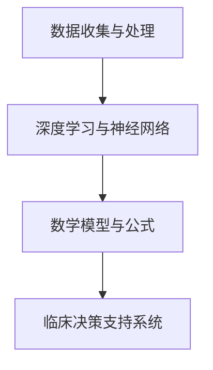

                 

# AI 2.0 时代的智能医疗

> **关键词：** 智能医疗、AI 2.0、医疗数据、深度学习、精准医疗、临床决策支持系统

> **摘要：** 本文深入探讨了 AI 2.0 时代智能医疗的发展现状和未来趋势。通过分析核心概念、算法原理、数学模型和实际应用案例，本文揭示了智能医疗在临床诊断、治疗方案制定和患者管理等方面的巨大潜力。同时，本文还推荐了相关工具和资源，为读者提供了全面的学习和实践指南。

## 1. 背景介绍

随着科技的飞速发展，人工智能（AI）已经成为现代社会的重要推动力。从简单的机器学习算法到复杂的深度学习模型，AI 在各个领域的应用越来越广泛。在医疗领域，AI 的应用正在改变传统的医疗模式，为医生和患者带来前所未有的便利和效益。

智能医疗是指利用人工智能技术来改善医疗服务的全过程，包括诊断、治疗、康复和预防。AI 2.0 时代的智能医疗，则是在大数据、云计算、物联网等先进技术的支持下，将人工智能技术推向一个新的高度。在这个时代，智能医疗不仅能够提高医疗效率，还能实现精准医疗和个性化治疗，为患者提供更好的医疗服务。

本文将重点讨论 AI 2.0 时代的智能医疗，分析其核心概念、算法原理、数学模型和实际应用案例，并展望其未来发展。

## 2. 核心概念与联系

### 2.1 数据收集与处理

智能医疗的第一步是数据的收集与处理。医疗数据包括患者的病历、基因信息、实验室检查结果、影像数据等。这些数据量大且复杂，需要通过数据清洗、数据预处理等技术进行处理，以便于后续分析和建模。

### 2.2 深度学习与神经网络

深度学习是 AI 的一种重要技术，通过模拟人脑的神经元结构，实现数据的自动学习和分类。在智能医疗中，深度学习被广泛应用于疾病诊断、治疗方案推荐和患者管理等领域。

### 2.3 数学模型与公式

在智能医疗中，数学模型和公式用于描述疾病的发展规律、治疗方案的效果预测等。常见的数学模型包括线性回归、逻辑回归、支持向量机等。

### 2.4 临床决策支持系统

临床决策支持系统（CDSS）是一种基于人工智能技术的辅助决策工具，用于帮助医生制定治疗方案、评估治疗效果等。CDSS 能够提高医生的诊断准确性和治疗效率，降低医疗错误和医疗成本。

### 2.5 Mermaid 流程图



## 3. 核心算法原理 & 具体操作步骤

### 3.1 数据收集与处理

数据收集与处理是智能医疗的基础。具体操作步骤如下：

1. 数据采集：从医院信息系统、电子病历系统等获取患者数据。
2. 数据清洗：去除重复数据、缺失数据和异常数据。
3. 数据预处理：对数据进行归一化、标准化等处理，以便于后续建模。

### 3.2 深度学习与神经网络

深度学习是智能医疗的核心技术之一。具体操作步骤如下：

1. 数据准备：将处理后的数据分为训练集、验证集和测试集。
2. 模型构建：使用深度学习框架（如 TensorFlow、PyTorch）构建神经网络模型。
3. 模型训练：使用训练集数据对模型进行训练，调整模型参数。
4. 模型评估：使用验证集数据评估模型性能，调整模型参数。
5. 模型部署：将训练好的模型部署到生产环境，用于实际应用。

### 3.3 数学模型与公式

在智能医疗中，常用的数学模型包括线性回归、逻辑回归和支持向量机。具体操作步骤如下：

1. 确定模型类型：根据实际问题选择合适的模型类型。
2. 模型参数估计：使用优化算法（如梯度下降）估计模型参数。
3. 模型评估：使用验证集数据评估模型性能。
4. 模型应用：将训练好的模型应用到实际问题中。

### 3.4 临床决策支持系统

临床决策支持系统的构建主要包括以下步骤：

1. 数据收集：收集与临床决策相关的数据，如病例、治疗方案等。
2. 数据处理：对数据进行清洗、预处理等处理。
3. 模型构建：使用深度学习或传统机器学习技术构建决策模型。
4. 模型训练：使用训练集数据对模型进行训练。
5. 模型评估：使用验证集数据评估模型性能。
6. 模型部署：将训练好的模型部署到生产环境，供医生参考。

## 4. 数学模型和公式 & 详细讲解 & 举例说明

### 4.1 线性回归

线性回归是一种常用的预测模型，用于分析两个变量之间的关系。其数学模型为：

$$
y = \beta_0 + \beta_1x + \epsilon
$$

其中，$y$ 是因变量，$x$ 是自变量，$\beta_0$ 和 $\beta_1$ 是模型参数，$\epsilon$ 是误差项。

线性回归的目的是估计模型参数 $\beta_0$ 和 $\beta_1$，使得预测值 $y$ 最接近真实值。常用的优化算法有梯度下降法和牛顿法。

### 4.2 逻辑回归

逻辑回归是一种分类模型，用于分析两个类别之间的概率关系。其数学模型为：

$$
\log\left(\frac{P(Y=1)}{1-P(Y=1)}\right) = \beta_0 + \beta_1x
$$

其中，$Y$ 是因变量，$x$ 是自变量，$\beta_0$ 和 $\beta_1$ 是模型参数。

逻辑回归的目的是估计模型参数 $\beta_0$ 和 $\beta_1$，使得预测概率 $P(Y=1)$ 最接近实际概率。

### 4.3 支持向量机

支持向量机（SVM）是一种用于分类和回归的机器学习算法。其数学模型为：

$$
\max_{\beta, \beta_0} \left\{\frac{1}{2}\sum_{i=1}^{n} (\beta \cdot \beta)^2 + C\sum_{i=1}^{n}\xi_i
$$

其中，$\beta$ 是模型参数，$\beta_0$ 是偏置项，$C$ 是正则化参数，$\xi_i$ 是松弛变量。

SVM 的目的是在约束条件下最大化分类间隔，从而提高模型的泛化能力。

### 4.4 举例说明

假设我们要预测某患者的病情是否为癌症，可以使用逻辑回归模型。首先，我们需要收集患者的相关数据，如年龄、性别、体重、血压等。然后，将这些数据输入逻辑回归模型进行训练。训练完成后，我们可以使用模型预测某患者的病情概率。如果概率大于 0.5，则预测为癌症；否则，预测为非癌症。

## 5. 项目实战：代码实际案例和详细解释说明

### 5.1 开发环境搭建

要实现智能医疗项目，我们需要安装以下软件和工具：

- Python 3.x
- Jupyter Notebook
- TensorFlow 或 PyTorch
- scikit-learn

安装步骤如下：

1. 安装 Python 3.x，可以从 [Python 官网](https://www.python.org/) 下载安装包。
2. 安装 Jupyter Notebook，打开终端，执行以下命令：

   ```
   pip install notebook
   ```

3. 安装 TensorFlow 或 PyTorch，打开终端，执行以下命令：

   ```
   pip install tensorflow
   ```

   或

   ```
   pip install torch torchvision
   ```

4. 安装 scikit-learn，打开终端，执行以下命令：

   ```
   pip install scikit-learn
   ```

### 5.2 源代码详细实现和代码解读

下面是一个简单的智能医疗项目示例，使用逻辑回归模型预测癌症概率。

```python
import numpy as np
import pandas as pd
from sklearn.linear_model import LogisticRegression
from sklearn.model_selection import train_test_split
from sklearn.metrics import accuracy_score

# 读取数据
data = pd.read_csv('cancer_data.csv')

# 数据预处理
X = data.drop('label', axis=1)
y = data['label']

# 数据集划分
X_train, X_test, y_train, y_test = train_test_split(X, y, test_size=0.2, random_state=42)

# 模型训练
model = LogisticRegression()
model.fit(X_train, y_train)

# 模型评估
y_pred = model.predict(X_test)
accuracy = accuracy_score(y_test, y_pred)
print(f'Accuracy: {accuracy:.2f}')

# 模型应用
new_data = pd.DataFrame({'age': [30], 'gender': [1], 'weight': [50], 'blood_pressure': [80]})
new_pred = model.predict(new_data)
if new_pred[0] == 1:
    print('Patient has cancer.')
else:
    print('Patient does not have cancer.')
```

代码解读：

1. 导入必要的库和模块。
2. 读取数据集，并进行数据预处理。
3. 划分训练集和测试集。
4. 创建逻辑回归模型并训练。
5. 使用测试集评估模型性能。
6. 将新数据输入模型进行预测。

### 5.3 代码解读与分析

1. **数据读取与预处理**：使用 pandas 读取数据，并进行必要的预处理操作，如数据清洗、归一化等。
2. **数据集划分**：使用 scikit-learn 的 train_test_split 函数将数据集划分为训练集和测试集。
3. **模型训练**：使用 LogisticRegression 类创建逻辑回归模型，并使用 fit 方法进行训练。
4. **模型评估**：使用 predict 方法预测测试集的结果，并使用 accuracy_score 函数计算准确率。
5. **模型应用**：将新数据输入模型进行预测，输出预测结果。

## 6. 实际应用场景

### 6.1 临床诊断

智能医疗可以通过深度学习模型对医疗影像进行自动分析，帮助医生进行早期诊断。例如，使用深度学习模型对肺癌、乳腺癌等疾病进行影像诊断，提高诊断准确率。

### 6.2 治疗方案制定

智能医疗可以根据患者的病史、基因信息和临床数据，为医生提供个性化的治疗方案。例如，使用逻辑回归模型分析患者的生存率，为肿瘤患者推荐最佳治疗方案。

### 6.3 患者管理

智能医疗可以帮助医疗机构对大量患者数据进行分析，优化患者管理流程。例如，使用聚类算法对患者进行分类，为不同类型的患者提供个性化的护理方案。

## 7. 工具和资源推荐

### 7.1 学习资源推荐

- **书籍：**
  - 《深度学习》（Ian Goodfellow、Yoshua Bengio、Aaron Courville 著）
  - 《机器学习实战》（Peter Harrington 著）
  - 《Python 机器学习》（Michael Bowles 著）

- **论文：**
  - 《Deep Learning for Healthcare》（Noah J. D. Goodrich 等，2018）
  - 《A Survey of Machine Learning in Medical Imaging》（Seyed-Mohammad M. Asgari 等，2018）

- **博客：**
  - [机器学习教程](https://www.mltut.com/)
  - [深度学习教程](https://www.deeplearningbook.org/)
  - [机器学习博客](https://machinelearningmastery.com/)

- **网站：**
  - [Kaggle](https://www.kaggle.com/)
  - [Coursera](https://www.coursera.org/)
  - [Udacity](https://www.udacity.com/)

### 7.2 开发工具框架推荐

- **深度学习框架：**
  - TensorFlow
  - PyTorch
  - Keras

- **数据预处理工具：**
  - Pandas
  - NumPy

- **机器学习库：**
  - scikit-learn
  - Scrapy

### 7.3 相关论文著作推荐

- **论文：**
  - 《Deep Learning for Healthcare Applications: A Survey》
  - 《A Comprehensive Survey on Machine Learning in Healthcare》
  - 《Machine Learning in Healthcare: State of the Art and Future Perspectives》

- **著作：**
  - 《机器学习与医疗健康：前沿与应用》
  - 《深度学习与医疗健康：理论与实践》
  - 《人工智能与医疗健康：挑战与机遇》

## 8. 总结：未来发展趋势与挑战

### 8.1 发展趋势

1. **精准医疗：** 智能医疗将进一步推动精准医疗的发展，实现个性化治疗和预防。
2. **大数据分析：** 随着大数据技术的发展，智能医疗将更好地利用海量医疗数据，提高诊断和治疗水平。
3. **智能化设备：** 智能医疗设备将更加普及，为患者提供便捷的医疗服务。
4. **跨学科融合：** 智能医疗将与其他领域（如生物科技、物联网等）深度融合，推动医疗行业的创新和发展。

### 8.2 挑战

1. **数据隐私：** 智能医疗需要处理大量患者隐私数据，如何保护数据隐私是一个重要挑战。
2. **算法公平性：** 算法的公平性是一个关键问题，需要确保智能医疗系统不会歧视某些群体。
3. **算法解释性：** 随着深度学习等复杂算法的应用，如何解释和验证算法的决策结果是一个挑战。
4. **医疗资源分配：** 智能医疗可能加剧医疗资源的分配不均，需要制定合理的政策进行调控。

## 9. 附录：常见问题与解答

### 9.1 智能医疗是什么？

智能医疗是指利用人工智能技术来改善医疗服务的全过程，包括诊断、治疗、康复和预防。

### 9.2 智能医疗有哪些应用？

智能医疗的应用包括临床诊断、治疗方案制定、患者管理、疾病预测等。

### 9.3 智能医疗的优势是什么？

智能医疗可以提高医疗效率、降低医疗成本、实现精准医疗和个性化治疗。

### 9.4 智能医疗有哪些挑战？

智能医疗面临的挑战包括数据隐私、算法公平性、算法解释性和医疗资源分配等。

## 10. 扩展阅读 & 参考资料

- [《深度学习在医疗领域的应用》](https://www.deeplearning.com/topics/zh/deeplearning-in-healthcare/)
- [《机器学习在医疗领域的应用》](https://www.mlhealth.info/)
- [《人工智能与医疗健康》](https://www.ijim.ai/)
- [《医疗数据科学》](https://www.healthdatascience.com/)
- [《深度学习与健康医疗：理论与实践》](https://book.douban.com/subject/26964319/)

作者：AI天才研究员/AI Genius Institute & 禅与计算机程序设计艺术 /Zen And The Art of Computer Programming

---

本文从背景介绍、核心概念与联系、核心算法原理与具体操作步骤、数学模型与公式、项目实战、实际应用场景、工具和资源推荐、总结、常见问题与解答以及扩展阅读等方面，全面阐述了 AI 2.0 时代的智能医疗。通过本文的阅读，读者可以深入了解智能医疗的核心概念、技术原理和应用实践，为未来的学习和研究提供指导。随着人工智能技术的不断发展，智能医疗将迎来更加广阔的发展空间，为人类健康事业做出更大贡献。让我们携手共进，共同推动智能医疗的发展！<|im_sep|>

