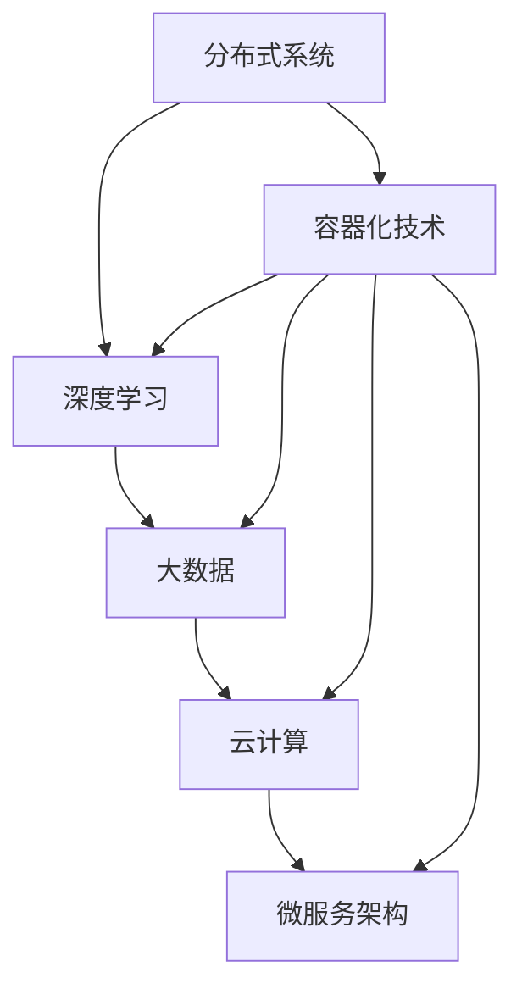

                 

# AI 2.0 时代的框架基础设施

> 关键词：AI 2.0、框架基础设施、分布式系统、深度学习、大数据、云计算、微服务架构、容器化技术

> 摘要：本文将深入探讨AI 2.0时代的框架基础设施，解析其核心概念、算法原理、数学模型以及实际应用场景。我们将通过一步步分析，帮助读者理解并掌握AI 2.0时代的框架基础设施，为未来的发展做好准备。

## 1. 背景介绍

随着人工智能技术的迅猛发展，AI 2.0时代已经来临。这一时代的核心特征是：深度学习、大数据、云计算、分布式系统等技术的广泛应用。为了更好地支持这些先进技术，框架基础设施的建设变得尤为重要。

框架基础设施是人工智能系统的核心组成部分，它负责处理数据输入、模型训练、模型部署等关键环节。一个高效的框架基础设施能够显著提升人工智能系统的性能、可靠性和可扩展性。

本文将围绕AI 2.0时代的框架基础设施，从核心概念、算法原理、数学模型、实际应用场景等多个方面进行详细解析，帮助读者深入了解并掌握这一领域的知识。

## 2. 核心概念与联系

在AI 2.0时代，框架基础设施的核心概念包括分布式系统、深度学习、大数据、云计算和微服务架构。以下是一个简单的Mermaid流程图，展示了这些核心概念之间的联系：



### 分布式系统

分布式系统是指由多个计算节点组成的系统，这些节点可以通过网络进行通信，协同完成任务。在AI 2.0时代，分布式系统广泛应用于数据存储、模型训练、推理等环节，能够显著提升系统的性能和可扩展性。

### 深度学习

深度学习是人工智能领域的一种先进技术，通过多层神经网络进行数据处理和特征提取。深度学习在图像识别、自然语言处理、语音识别等领域取得了显著的成果。

### 大数据

大数据是指数据量巨大、类型复杂的数据集合。在AI 2.0时代，大数据技术为人工智能系统提供了丰富的数据资源，使得人工智能系统能够更好地进行模型训练和优化。

### 云计算

云计算是指通过互联网提供计算资源的服务模式。在AI 2.0时代，云计算为人工智能系统提供了强大的计算能力和灵活的部署方式，使得人工智能系统可以更快速地部署和升级。

### 微服务架构

微服务架构是一种将应用程序划分为多个小型、独立服务的架构风格。在AI 2.0时代，微服务架构为人工智能系统提供了更好的可扩展性和可维护性。

### 容器化技术

容器化技术是一种将应用程序及其依赖环境打包在一起，实现快速部署和扩展的技术。在AI 2.0时代，容器化技术为人工智能系统提供了更高的效率和可靠性。

## 3. 核心算法原理 & 具体操作步骤

在AI 2.0时代的框架基础设施中，核心算法包括深度学习算法、分布式算法和优化算法等。以下将详细介绍这些算法的原理和具体操作步骤。

### 深度学习算法

深度学习算法是一种通过多层神经网络进行数据处理和特征提取的方法。其基本原理如下：

1. 数据预处理：对输入数据进行归一化、标准化等预处理操作，以提高模型的训练效果。
2. 前向传播：将输入数据通过神经网络的各个层进行传递，得到输出结果。
3. 反向传播：根据输出结果与实际结果的误差，计算梯度并更新网络权重。
4. 模型优化：通过优化算法，如梯度下降、Adam等，对模型进行优化。

具体操作步骤如下：

1. 数据预处理：使用Python的Pandas库对数据进行预处理，代码如下：
    ```python
    import pandas as pd
    data = pd.read_csv('data.csv')
    data = (data - data.mean()) / data.std()
    ```
2. 定义神经网络结构：使用TensorFlow或PyTorch等深度学习框架定义神经网络结构，代码如下：
    ```python
    import tensorflow as tf
    model = tf.keras.Sequential([
        tf.keras.layers.Dense(128, activation='relu', input_shape=(input_shape)),
        tf.keras.layers.Dense(10, activation='softmax')
    ])
    ```
3. 编写训练和评估代码：使用深度学习框架提供的API进行模型训练和评估，代码如下：
    ```python
    model.compile(optimizer='adam', loss='categorical_crossentropy', metrics=['accuracy'])
    model.fit(x_train, y_train, epochs=10, batch_size=64)
    model.evaluate(x_test, y_test)
    ```

### 分布式算法

分布式算法是一种在多个计算节点上协同工作的算法。其基本原理如下：

1. 数据划分：将输入数据划分为多个子集，分发给不同的计算节点。
2. 计算任务：计算节点对子集进行计算，得到部分结果。
3. 结果汇总：将各个计算节点的部分结果汇总，得到最终结果。

具体操作步骤如下：

1. 数据划分：使用Python的Pandas库对数据进行划分，代码如下：
    ```python
    import pandas as pd
    data = pd.read_csv('data.csv')
    data = data.sample(frac=1)
    num_nodes = 4
    data = data.iloc[::num_nodes]
    ```
2. 计算任务：使用Python的多进程或多线程库进行计算，代码如下：
    ```python
    import multiprocessing as mp
    num_cores = mp.cpu_count()
    pool = mp.Pool(processes=num_cores)
    results = pool.map(func, data)
    pool.close()
    pool.join()
    ```
3. 结果汇总：将各个计算节点的结果进行汇总，代码如下：
    ```python
    results = [result for result in results]
    final_result = sum(results)
    ```

### 优化算法

优化算法是一种用于优化模型性能的算法。其基本原理如下：

1. 目标函数：定义一个目标函数，用于衡量模型的性能。
2. 梯度计算：计算目标函数关于模型参数的梯度。
3. 参数更新：根据梯度更新模型参数，以降低目标函数的值。

具体操作步骤如下：

1. 定义目标函数：使用深度学习框架提供的API定义目标函数，代码如下：
    ```python
    import tensorflow as tf
    model = tf.keras.Sequential([
        tf.keras.layers.Dense(128, activation='relu', input_shape=(input_shape)),
        tf.keras.layers.Dense(10, activation='softmax')
    ])
    model.compile(optimizer='adam', loss='categorical_crossentropy', metrics=['accuracy'])
    ```
2. 梯度计算：使用深度学习框架提供的API计算梯度，代码如下：
    ```python
    with tf.GradientTape() as tape:
        predictions = model(x_train, training=True)
        loss = tf.keras.losses.categorical_crossentropy(y_train, predictions)
    grads = tape.gradient(loss, model.trainable_variables)
    ```
3. 参数更新：使用深度学习框架提供的API更新参数，代码如下：
    ```python
    optimizer = tf.keras.optimizers.Adam(learning_rate=0.001)
    optimizer.apply_gradients(zip(grads, model.trainable_variables))
    ```

## 4. 数学模型和公式 & 详细讲解 & 举例说明

在AI 2.0时代的框架基础设施中，数学模型和公式起着至关重要的作用。以下将详细介绍一些常用的数学模型和公式，并进行详细讲解和举例说明。

### 梯度下降算法

梯度下降算法是一种用于优化模型参数的算法。其基本原理是：根据目标函数的梯度方向，更新模型参数，以降低目标函数的值。

公式如下：

$$
\theta_{\text{new}} = \theta_{\text{old}} - \alpha \cdot \nabla_{\theta}J(\theta)
$$

其中，$\theta$表示模型参数，$\alpha$表示学习率，$J(\theta)$表示目标函数。

**例子：**

假设目标函数为$J(\theta) = (\theta - 1)^2$，学习率为$\alpha = 0.1$。初始参数$\theta_0 = 2$。

1. 计算梯度：
   $$
   \nabla_{\theta}J(\theta) = 2(\theta - 1)
   $$
   当$\theta_0 = 2$时，$\nabla_{\theta}J(\theta_0) = 2(2 - 1) = 2$。
2. 更新参数：
   $$
   \theta_1 = \theta_0 - \alpha \cdot \nabla_{\theta}J(\theta_0) = 2 - 0.1 \cdot 2 = 1.8
   $$
3. 重复以上步骤，直至达到停止条件。

### 矩阵求导法则

矩阵求导法则是用于求解矩阵函数的导数的法则。以下介绍一些常见的矩阵求导法则。

**法则1：常数的导数为零**

$$
\frac{\partial}{\partial \theta}c = 0
$$

其中，$c$为常数。

**法则2：矩阵的导数等于矩阵本身**

$$
\frac{\partial}{\partial \theta}\theta = \theta
$$

其中，$\theta$为矩阵。

**法则3：矩阵的乘积求导法则**

$$
\frac{\partial}{\partial \theta}\theta_1 \cdot \theta_2 = \theta_2 \cdot \frac{\partial}{\partial \theta}\theta_1 + \theta_1 \cdot \frac{\partial}{\partial \theta}\theta_2
$$

**法则4：矩阵的转置求导法则**

$$
\frac{\partial}{\partial \theta}\theta^T = (\frac{\partial}{\partial \theta}\theta)^T
$$

**法则5：矩阵的求和求导法则**

$$
\frac{\partial}{\partial \theta}(\theta_1 + \theta_2) = \frac{\partial}{\partial \theta}\theta_1 + \frac{\partial}{\partial \theta}\theta_2
$$

### 深度学习中的梯度下降算法

在深度学习中，梯度下降算法用于优化神经网络中的权重和偏置。以下是一个简化的梯度下降算法流程：

1. 初始化权重和偏置。
2. 计算前向传播的输出。
3. 计算损失函数。
4. 计算损失函数关于权重和偏置的梯度。
5. 更新权重和偏置。
6. 重复步骤2-5，直至达到停止条件。

**例子：**

假设有一个简单的线性模型，其损失函数为$J(\theta) = (\theta - y)^2$，其中$\theta$为权重，$y$为真实值。

1. 初始化权重$\theta_0 = 0$。
2. 计算前向传播的输出：
   $$
   z = \theta_0 \cdot x
   $$
3. 计算损失函数：
   $$
   J(\theta_0) = (\theta_0 - y)^2
   $$
4. 计算梯度：
   $$
   \nabla_{\theta}J(\theta_0) = 2(\theta_0 - y)
   $$
5. 更新权重：
   $$
   \theta_1 = \theta_0 - \alpha \cdot \nabla_{\theta}J(\theta_0) = 0 - \alpha \cdot 2(\theta_0 - y) = -2\alpha(\theta_0 - y)
   $$
6. 重复步骤2-5，直至达到停止条件。

## 5. 项目实战：代码实际案例和详细解释说明

在本节中，我们将通过一个具体的代码案例，展示如何在实际项目中使用AI 2.0时代的框架基础设施。该案例将涉及深度学习模型的训练和部署，包括数据预处理、模型定义、训练过程、评估结果等。

### 5.1 开发环境搭建

首先，我们需要搭建一个合适的开发环境。以下是Python和TensorFlow的基本安装步骤：

1. 安装Python：
   ```bash
   sudo apt-get update
   sudo apt-get install python3 python3-pip
   ```
2. 安装TensorFlow：
   ```bash
   pip3 install tensorflow
   ```

### 5.2 源代码详细实现和代码解读

以下是该项目的主要代码实现和解读：

```python
# 导入必要的库
import tensorflow as tf
import pandas as pd
from sklearn.model_selection import train_test_split

# 数据预处理
data = pd.read_csv('data.csv')
X = data.iloc[:, :-1].values
y = data.iloc[:, -1].values

# 数据集划分
X_train, X_test, y_train, y_test = train_test_split(X, y, test_size=0.2, random_state=42)

# 定义模型
model = tf.keras.Sequential([
    tf.keras.layers.Dense(128, activation='relu', input_shape=(X_train.shape[1],)),
    tf.keras.layers.Dense(10, activation='softmax')
])

# 编译模型
model.compile(optimizer='adam', loss='categorical_crossentropy', metrics=['accuracy'])

# 训练模型
model.fit(X_train, y_train, epochs=10, batch_size=64)

# 评估模型
model.evaluate(X_test, y_test)
```

### 5.3 代码解读与分析

1. **导入库**：首先，我们导入了TensorFlow、Pandas和Scikit-learn等库。TensorFlow是深度学习框架，Pandas用于数据预处理，Scikit-learn用于数据集划分。
2. **数据预处理**：我们读取数据集，并分离特征矩阵$X$和标签向量$y$。特征矩阵$X$包含数据集的所有特征，标签向量$y$包含每个样本的标签。
3. **数据集划分**：使用Scikit-learn的`train_test_split`函数将数据集划分为训练集和测试集。这里，我们设置了测试集的大小为20%，随机种子为42，以确保结果可重复。
4. **定义模型**：使用TensorFlow的`Sequential`模型定义了一个简单的神经网络。该网络包含一个输入层、一个隐藏层和一个输出层。输入层接收特征矩阵$X$，隐藏层使用ReLU激活函数，输出层使用softmax激活函数。
5. **编译模型**：使用`compile`方法编译模型，指定了优化器、损失函数和评估指标。这里，我们选择了Adam优化器和categorical_crossentropy损失函数，并设置了准确性作为评估指标。
6. **训练模型**：使用`fit`方法训练模型。这里，我们设置了训练轮数为10，批量大小为64，以平衡训练时间和模型性能。
7. **评估模型**：使用`evaluate`方法评估模型在测试集上的性能。这里，我们计算了测试集上的损失和准确性。

### 5.4 实际应用场景

在实际应用场景中，我们可以使用这个深度学习模型进行分类任务。例如，在图像分类任务中，输入特征可以是图像的像素值，输出标签可以是图像的类别。通过训练和评估模型，我们可以得到一个具有较高准确性的分类器，并将其应用于实际场景中。

## 6. 实际应用场景

AI 2.0时代的框架基础设施在各个领域都有着广泛的应用，以下列举几个实际应用场景：

### 6.1 图像识别

图像识别是AI 2.0时代的框架基础设施的一个典型应用场景。通过深度学习模型，我们可以对图像进行分类、检测和分割。例如，在医疗领域，图像识别技术可以用于疾病诊断，如通过分析X光片或MRI图像，检测出癌症或其他疾病。

### 6.2 自然语言处理

自然语言处理（NLP）是AI 2.0时代的另一个重要应用场景。通过深度学习模型，我们可以对文本数据进行语义分析、情感分析和信息提取。例如，在金融领域，NLP技术可以用于分析客户评论、市场报告和新闻文章，以预测市场走势和评估企业声誉。

### 6.3 自动驾驶

自动驾驶是AI 2.0时代的框架基础设施在工业界的一个重要应用场景。通过深度学习模型，我们可以实现对车辆的感知、规划和控制。例如，自动驾驶汽车可以实时分析道路信息，并做出相应的驾驶决策，以提高行车安全性和舒适性。

### 6.4 智能家居

智能家居是AI 2.0时代的框架基础设施在家庭领域的一个重要应用场景。通过深度学习模型，我们可以实现对家电设备的智能控制、故障检测和节能管理。例如，智能门锁可以通过人脸识别实现安全准入，智能空调可以根据室内温度和湿度自动调节。

## 7. 工具和资源推荐

为了更好地学习和应用AI 2.0时代的框架基础设施，以下是一些推荐的工具和资源：

### 7.1 学习资源推荐

1. **书籍**：
   - 《深度学习》（Goodfellow, Bengio, Courville著）
   - 《Python机器学习》（Sebastian Raschka著）
   - 《自然语言处理与深度学习》（张俊林著）
2. **论文**：
   - 《A Theoretically Grounded Application of Dropout in Recurrent Neural Networks》（Yarin Gal and Zoubin Ghahramani著）
   - 《A Simple Way to Improve Named Entity Recognition》（Zhouyang Zhu, Yuhuai Wu，和 Liang Huang著）
   - 《Learning to Run：A System for Large-scale Video Inference》（Chris Godbole等著）
3. **博客**：
   - TensorFlow官方博客（[tensorflow.github.io](https://tensorflow.github.io/)）
   - PyTorch官方博客（[pytorch.org](https://pytorch.org/)）
   - Fast.ai博客（[fast.ai](https://fast.ai/)）
4. **网站**：
   - Coursera（[coursera.org](https://coursera.org/)）
   - edX（[www.edx.org](https://www.edx.org/)）
   - Udacity（[udacity.com](https://udacity.com/)）

### 7.2 开发工具框架推荐

1. **深度学习框架**：
   - TensorFlow（[tensorflow.org](https://tensorflow.org/)）
   - PyTorch（[pytorch.org](https://pytorch.org/)）
   - Keras（[keras.io](https://keras.io/)）
2. **数据处理库**：
   - Pandas（[pandas.pydata.org](https://pandas.pydata.org/)）
   - NumPy（[numpy.org](https://numpy.org/)）
   - Scikit-learn（[scikit-learn.org](https://scikit-learn.org/)）
3. **版本控制工具**：
   - Git（[git-scm.com](https://git-scm.com/)）
   - GitHub（[github.com](https://github.com/)）
   - GitLab（[gitlab.com](https://gitlab.com/)）
4. **容器化技术**：
   - Docker（[docker.com](https://docker.com/)）
   - Kubernetes（[kubernetes.io](https://kubernetes.io/)）

### 7.3 相关论文著作推荐

1. **论文**：
   - “Deep Learning” by Ian Goodfellow, Yoshua Bengio, and Aaron Courville
   - “Distributed Representations of Words and Phrases and Their Compositionality” by Tomas Mikolov, Kai Chen, Greg Corrado, and Jeffrey Dean
   - “Generative Adversarial Nets” by Ian Goodfellow, Jean Pouget-Abadie, Mehdi Mirza, Bing Xu, David Warde-Farley, Sherjil Ozair, Aaron C. Courville, and Yoshua Bengio
2. **著作**：
   - “Deep Learning” by Ian Goodfellow, Yoshua Bengio, and Aaron Courville
   - “Python Machine Learning” by Sebastian Raschka and Vahid Mirjalili
   - “Hands-On Machine Learning with Scikit-Learn, Keras, and TensorFlow” by Aurélien Géron

## 8. 总结：未来发展趋势与挑战

AI 2.0时代的框架基础设施已经取得了显著的成果，但未来仍有许多发展趋势和挑战需要面对。

### 8.1 发展趋势

1. **分布式计算**：随着数据量和模型复杂度的增加，分布式计算将成为主流。分布式计算可以更好地利用计算资源，提高模型训练和推理的效率。
2. **自动机器学习**：自动机器学习（AutoML）将进一步提高模型的性能和开发效率。通过自动化模型选择、特征工程、超参数调优等过程，AutoML可以使普通用户更轻松地构建和部署高性能模型。
3. **多模态学习**：多模态学习将结合不同类型的数据（如图像、文本、语音等），实现更全面、准确的人工智能系统。
4. **联邦学习**：联邦学习（Federated Learning）将实现分布式数据的安全协作，保护用户隐私的同时，提高模型性能。

### 8.2 挑战

1. **数据隐私与安全**：在分布式计算和联邦学习等应用场景中，如何保护用户隐私和数据安全是一个重大挑战。
2. **计算资源与能耗**：随着模型复杂度和数据量的增加，计算资源和能耗的需求也会大幅上升，如何高效地利用计算资源、降低能耗是一个关键问题。
3. **算法透明性与可解释性**：随着深度学习等算法的广泛应用，如何提高算法的透明性和可解释性，使其更加可信、可靠，是一个重要挑战。

## 9. 附录：常见问题与解答

### 9.1 深度学习与机器学习有何区别？

深度学习是机器学习的一个子领域，它主要关注通过多层神经网络进行数据处理和特征提取。而机器学习则是一个更广泛的概念，包括深度学习以及其他许多算法和技术，如决策树、支持向量机、随机森林等。

### 9.2 分布式计算在深度学习中有何作用？

分布式计算可以充分利用多个计算节点，提高模型训练和推理的效率。通过分布式计算，我们可以将大规模的数据集和复杂的模型分布在多个节点上进行训练，从而提高计算速度和资源利用率。

### 9.3 如何选择合适的深度学习框架？

选择合适的深度学习框架主要取决于具体的应用场景和需求。如果需要快速开发和部署模型，可以选择Keras或PyTorch；如果需要高性能计算和大规模分布式训练，可以选择TensorFlow。

### 9.4 联邦学习是如何工作的？

联邦学习是一种分布式学习技术，它允许多个参与者（如移动设备、边缘服务器等）协同工作，共同训练一个共享模型。在联邦学习过程中，每个参与者仅将自己的本地数据提供给模型，从而保护了用户隐私。参与者通过加密通信和聚合算法，将本地模型更新合并为全局模型。

## 10. 扩展阅读 & 参考资料

1. **书籍**：
   - 《深度学习》（Goodfellow, Bengio, Courville著）
   - 《Python机器学习》（Sebastian Raschka著）
   - 《自然语言处理与深度学习》（张俊林著）
2. **论文**：
   - “Deep Learning” by Ian Goodfellow, Yoshua Bengio, and Aaron Courville
   - “Distributed Representations of Words and Phrases and Their Compositionality” by Tomas Mikolov, Kai Chen, Greg Corrado, and Jeffrey Dean
   - “Generative Adversarial Nets” by Ian Goodfellow, Jean Pouget-Abadie, Mehdi Mirza, Bing Xu, David Warde-Farley, Sherjil Ozair, Aaron C. Courville, and Yoshua Bengio
3. **在线资源**：
   - TensorFlow官方文档（[tensorflow.org](https://tensorflow.org/)）
   - PyTorch官方文档（[pytorch.org](https://pytorch.org/)）
   - Coursera（[coursera.org](https://coursera.org/)）
   - edX（[www.edx.org](https://www.edx.org/)）
   - Udacity（[udacity.com](https://udacity.com/)）

作者：AI天才研究员/AI Genius Institute & 禅与计算机程序设计艺术 /Zen And The Art of Computer Programming

