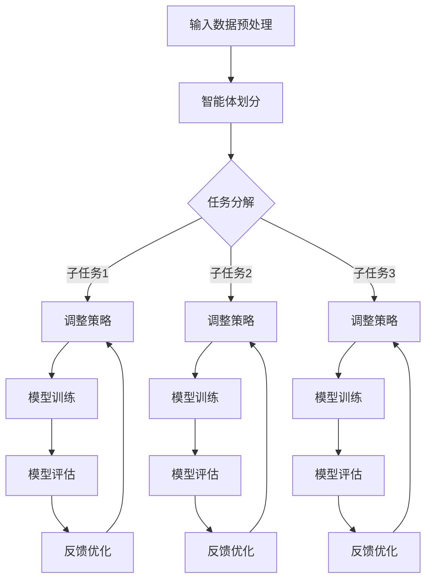

                 

### 1. 背景介绍

#### 什么是MetaGPT？

MetaGPT，全称“多智能体生成式预训练 Transformer 模型”（Multi-Agent Generative Pre-trained Transformer Model），是近年来在人工智能领域引起广泛关注的一项技术。它基于生成式预训练 Transformer 模型，通过引入多智能体架构，实现了在生成式任务中的高度灵活性和自适应能力。

生成式预训练 Transformer 模型本身是一种基于深度学习的自然语言处理技术，通过大规模文本数据的学习，模型能够理解和生成自然语言。然而，传统的生成式预训练模型在处理复杂任务时，往往存在性能瓶颈和适应性不足的问题。为了解决这些问题，MetaGPT提出了多智能体架构，使得模型能够通过协作和分工，实现更高层次的任务完成。

MetaGPT的研究与应用背景可以追溯到多个领域。在自然语言处理领域，生成式预训练模型已经在文本生成、机器翻译、文本摘要等方面取得了显著的成果。然而，随着任务的复杂度增加，单一模型的能力逐渐显出不足。多智能体架构的引入，为生成式预训练模型提供了一种新的解决方案，能够更好地应对复杂任务。

此外，在软件开发界面设计领域，传统的单智能体架构也面临类似的问题。软件界面设计涉及多个方面，包括用户交互、功能实现、性能优化等。单一的智能体架构难以兼顾这些方面，从而导致界面设计的局限性。MetaGPT的多智能体架构，通过智能体的协作和分工，可以更好地实现软件界面的优化和设计。

总的来说，MetaGPT的提出，不仅是对生成式预训练模型的一种改进，也为软件开发界面设计提供了一种新的思路。随着人工智能技术的不断发展，MetaGPT有望在更多领域发挥重要作用。

#### 生成式AI与软件开发界面的关系

生成式AI（Generative AI）和软件开发界面设计之间的关系日益紧密。生成式AI通过学习大量数据，能够生成新的内容，如文本、图像、音乐等。而软件开发界面设计则涉及到如何利用这些生成内容，为用户提供一个友好、高效、个性化的交互体验。

首先，生成式AI在软件开发界面设计中的应用主要体现在以下几个方面：

1. **文本生成**：生成式AI可以用于自动生成说明文档、帮助手册等，提高开发效率和文档质量。例如，通过生成式AI，可以自动生成针对特定功能的详细使用说明，减少开发人员的重复劳动。

2. **图像生成**：生成式AI可以用于自动生成软件界面的视觉效果，如图标、布局等。这不仅能够节省设计资源，还能够实现更加个性化的界面风格。

3. **交互设计**：生成式AI可以用于预测用户的行为和需求，从而优化界面交互设计。例如，通过分析用户的历史操作记录，生成式AI可以自动推荐最适合用户习惯的界面布局和操作流程。

其次，软件开发界面设计对生成式AI的需求主要体现在以下几个方面：

1. **多样化与个性化**：随着用户需求的不断增加，软件开发界面需要具备更高的多样化与个性化能力。生成式AI可以通过学习用户行为数据，为不同用户生成定制化的界面布局和功能模块。

2. **高效性与稳定性**：软件开发界面设计需要保证高效性和稳定性。生成式AI通过大规模数据训练，能够在复杂任务中实现高效的生成结果，同时保证模型的稳定性。

3. **可扩展性**：随着业务的发展，软件开发界面需要具备良好的可扩展性。生成式AI通过模块化设计，可以方便地集成到现有系统中，实现无缝升级和扩展。

综上所述，生成式AI与软件开发界面设计之间的关系是相辅相成的。生成式AI为软件开发界面设计提供了强大的技术支持，而软件开发界面设计则为生成式AI提供了广阔的应用场景。随着技术的不断进步，两者之间的融合将带来更加智能化和个性化的软件开发体验。

#### MetaGPT的多智能体架构

MetaGPT的多智能体架构是其核心创新之一，通过引入多个智能体，实现了在生成式AI任务中的高度灵活性和自适应能力。这一架构包括以下几个关键组成部分：

1. **智能体划分**：MetaGPT将生成式任务划分为多个子任务，每个子任务由一个智能体负责。这些智能体可以是独立的模型，也可以是多个模型的组合。智能体之间的划分基于任务的关键步骤和子任务的依赖关系。

2. **通信机制**：智能体之间通过通信机制进行信息交换和协同工作。通信机制可以是基于消息队列的异步通信，也可以是基于同步通信的实时交互。通信机制的选用取决于任务的具体需求和智能体的能力。

3. **协调算法**：为了确保智能体之间的协作效果，MetaGPT引入了协调算法。协调算法负责智能体之间的任务调度、资源分配和目标优化。常见的协调算法包括集中式协调算法和分布式协调算法。

4. **任务调度**：MetaGPT通过任务调度机制，根据任务的优先级和资源需求，动态调整智能体的工作负载。任务调度机制需要考虑多个因素，如任务的紧急程度、智能体的处理能力、系统的负载平衡等。

5. **反馈机制**：MetaGPT引入了反馈机制，用于评估智能体的工作效果和任务完成情况。反馈机制可以基于定量指标（如准确率、效率等）和定性指标（如用户满意度、操作体验等）。通过反馈机制，智能体可以不断优化自己的工作策略和模型参数。

具体实现方面，MetaGPT采用了以下步骤：

1. **数据预处理**：首先，对输入数据进行预处理，包括数据清洗、去重、格式转换等。预处理后的数据将用于训练和评估智能体模型。

2. **模型训练**：针对每个子任务，使用预处理的训练数据训练对应的智能体模型。训练过程中，可以使用传统的深度学习技术，如循环神经网络（RNN）、卷积神经网络（CNN）等。

3. **模型评估**：在训练完成后，对智能体模型进行评估，以确定其性能和适用性。评估过程可以包括在线评估和离线评估，评估指标可以是任务的完成度、响应时间、错误率等。

4. **智能体部署**：将训练完成的智能体模型部署到实际的生成式任务中。部署过程中，需要考虑智能体的通信机制、协调算法和任务调度等。

5. **系统优化**：在系统运行过程中，根据反馈机制收集的评估结果，对智能体模型和系统架构进行优化。优化过程可以包括模型参数调整、算法改进、系统重构等。

通过以上步骤，MetaGPT实现了多智能体架构在生成式AI任务中的高效协作和自适应能力。这一架构不仅提高了生成式AI的性能，还为软件开发界面设计提供了强大的技术支持。

### 2. 核心概念与联系

#### MetaGPT的核心概念

MetaGPT的核心概念主要包括以下几个方面：

1. **生成式预训练模型**：生成式预训练模型是MetaGPT的基础，它通过大规模文本数据的学习，能够理解和生成自然语言。常见的生成式预训练模型包括Transformer、GPT等。

2. **多智能体架构**：多智能体架构是MetaGPT的创新点，通过引入多个智能体，实现生成式任务的高度灵活性和自适应能力。每个智能体负责一个子任务，智能体之间通过通信机制和协调算法进行协作。

3. **任务分解**：任务分解是将复杂生成式任务划分为多个子任务，每个子任务由一个智能体负责。任务分解的目的是简化问题，提高模型的适用性和效率。

4. **通信机制**：通信机制是多智能体架构的核心组成部分，它负责智能体之间的信息交换和协同工作。通信机制可以是异步通信，也可以是同步通信，具体选用取决于任务需求和智能体能力。

5. **协调算法**：协调算法负责智能体之间的任务调度、资源分配和目标优化。协调算法的目的是确保智能体之间的协作效果，提高整体任务完成度。

6. **反馈机制**：反馈机制用于评估智能体的工作效果和任务完成情况。反馈机制可以基于定量指标和定性指标，通过收集评估结果，智能体可以不断优化自己的工作策略和模型参数。

#### 多智能体架构与生成式预训练模型的关系

多智能体架构与生成式预训练模型之间的关系主要体现在以下几个方面：

1. **基础支撑**：生成式预训练模型为多智能体架构提供了基础支撑，使得多个智能体能够共享预训练的模型参数和知识。生成式预训练模型的能力直接影响多智能体架构的性能。

2. **协同优化**：多智能体架构通过智能体之间的协作，实现生成式任务的整体优化。每个智能体专注于子任务的完成，通过通信机制和协调算法，智能体之间可以共享信息和资源，提高任务完成度。

3. **自适应能力**：多智能体架构具有更强的自适应能力，能够根据任务需求和环境变化，动态调整智能体的工作负载和策略。这种自适应能力使得MetaGPT能够更好地应对复杂和多变的应用场景。

4. **任务分解与协作**：多智能体架构通过任务分解，将复杂生成式任务划分为多个子任务，每个子任务由一个智能体负责。智能体之间的协作和分工，使得任务完成过程更加高效和灵活。

#### Mermaid流程图

为了更好地展示MetaGPT的多智能体架构，下面使用Mermaid语言绘制一个流程图。



上述流程图展示了MetaGPT从输入数据预处理到模型评估和反馈优化的整个过程。每个子任务由一个智能体负责，智能体之间通过通信机制和协调算法进行协作。通过任务分解和智能体协作，MetaGPT实现了生成式任务的高效完成。

### 3. 核心算法原理 & 具体操作步骤

#### 模型训练原理

MetaGPT的核心算法基于生成式预训练模型，特别是Transformer模型。Transformer模型通过自注意力机制（Self-Attention Mechanism），能够在序列数据中捕捉长距离依赖关系，从而在自然语言处理任务中表现出色。

在MetaGPT中，生成式预训练模型的训练过程可以分为以下几个步骤：

1. **数据准备**：首先，需要准备大规模的文本数据集。这些数据集可以包括互联网上的各种文本，如新闻、文章、对话等。数据准备过程中，需要对文本进行清洗、去重、分词等预处理操作。

2. **嵌入层**：嵌入层（Embedding Layer）将文本中的每个单词映射为一个固定大小的向量。嵌入层可以通过训练或预定义的方式实现。在MetaGPT中，嵌入层是共享的，多个智能体可以共同使用。

3. **自注意力层**：自注意力层（Self-Attention Layer）是Transformer模型的核心部分。它通过计算输入序列中每个单词与其他单词之间的相似度，生成一组权重，用于加权组合输入序列中的单词。自注意力机制能够捕捉长距离依赖关系，从而提高模型的表示能力。

4. **前馈神经网络**：在自注意力层之后，输入序列会经过两个前馈神经网络（Feedforward Neural Network），对序列进行进一步的加工和优化。

5. **输出层**：输出层（Output Layer）将加工后的序列映射为生成文本的候选单词。在生成式任务中，输出层通常采用软最大化（Softmax）函数，为每个候选单词分配一个概率分布。

6. **损失函数**：生成式预训练模型的训练过程中，使用损失函数（Loss Function）来衡量模型输出的概率分布与真实分布之间的差异。常用的损失函数包括交叉熵损失（Cross-Entropy Loss）和KL散度（KL Divergence）。

7. **优化算法**：为了减小损失函数，需要使用优化算法（Optimization Algorithm）更新模型参数。常用的优化算法包括随机梯度下降（Stochastic Gradient Descent，SGD）、Adam等。

#### 模型训练操作步骤

以下是一个简化的MetaGPT模型训练操作步骤：

1. **数据准备**：准备大规模的文本数据集，并进行预处理操作。

2. **构建模型**：使用深度学习框架（如TensorFlow、PyTorch等）构建Transformer模型，包括嵌入层、自注意力层、前馈神经网络和输出层。

3. **模型训练**：将预处理后的数据输入模型，通过优化算法更新模型参数，最小化损失函数。训练过程中，可以使用多个GPU加速训练过程。

4. **模型评估**：在训练过程中，定期评估模型性能，包括准确率、响应时间等指标。如果模型性能不理想，可以调整模型结构或超参数，重新进行训练。

5. **模型部署**：训练完成的模型可以部署到实际应用场景中，如生成文本、图像等。在部署过程中，需要考虑模型的可扩展性和稳定性。

6. **持续优化**：在实际应用过程中，根据用户反馈和任务需求，持续优化模型性能。这包括调整模型参数、改进训练数据集、增加智能体数量等。

#### 模型评估与反馈优化

在MetaGPT中，模型评估与反馈优化是一个持续的过程。以下是一个简化的评估与优化步骤：

1. **模型评估**：通过在线评估和离线评估，对模型的性能进行全面评估。在线评估可以实时监测模型的运行情况，离线评估可以评估模型的长期性能。

2. **性能指标**：常用的性能指标包括生成文本的准确率、响应时间、用户满意度等。通过这些指标，可以评估模型在任务中的表现。

3. **反馈机制**：根据评估结果，建立反馈机制，收集用户和系统的反馈信息。这些反馈信息可以用于优化模型参数、调整智能体工作策略等。

4. **模型优化**：根据反馈信息，对模型进行优化。这包括调整模型参数、改进数据预处理方法、增加智能体数量等。通过持续优化，可以提高模型的性能和适应性。

5. **评估与反馈循环**：模型评估与反馈优化是一个持续的过程，通过不断评估和优化，可以不断提高模型的性能和用户体验。

通过以上步骤，MetaGPT实现了生成式预训练模型的高效训练、评估和优化。这一过程不仅提高了生成式AI的性能，还为软件开发界面设计提供了强大的技术支持。

### 4. 数学模型和公式 & 详细讲解 & 举例说明

#### Transformer模型的核心公式

Transformer模型是生成式预训练模型的基础，其核心公式包括自注意力机制、前馈神经网络和损失函数等。以下是这些公式及其详细讲解：

1. **自注意力机制**：
   自注意力机制（Self-Attention Mechanism）是Transformer模型的核心组成部分，通过计算输入序列中每个单词与其他单词之间的相似度，生成一组权重，用于加权组合输入序列中的单词。自注意力机制的公式如下：

   $$ 
   \text{Attention}(Q, K, V) = \text{softmax}\left(\frac{QK^T}{\sqrt{d_k}}\right) V 
   $$

   其中，$Q$、$K$和$V$分别表示查询（Query）、键（Key）和值（Value）向量，$d_k$表示键向量的维度。$\text{softmax}$函数用于计算相似度权重，$\frac{1}{\sqrt{d_k}}$是缩放因子，用于防止梯度消失。

2. **前馈神经网络**：
   前馈神经网络（Feedforward Neural Network）是Transformer模型中的另一个核心组成部分，对输入序列进行进一步加工和优化。前馈神经网络的公式如下：

   $$
   \text{FFN}(x) = \max(0, xW_1 + b_1)W_2 + b_2
   $$

   其中，$x$表示输入向量，$W_1$、$W_2$和$b_1$、$b_2$分别表示权重和偏置。$\max(0, \cdot)$表示ReLU激活函数，$W_2$和$b_2$用于对ReLU激活后的结果进行进一步加工。

3. **损失函数**：
   在生成式预训练模型中，损失函数用于衡量模型输出的概率分布与真实分布之间的差异。常用的损失函数包括交叉熵损失（Cross-Entropy Loss）和KL散度（KL Divergence）。交叉熵损失的公式如下：

   $$
   \text{Cross-Entropy Loss}(y, \hat{y}) = -\sum_{i} y_i \log(\hat{y}_i)
   $$

   其中，$y$表示真实分布，$\hat{y}$表示模型输出的概率分布。$\log$函数用于计算概率的对数，$-\sum_{i} y_i \log(\hat{y}_i)$表示真实分布与模型输出分布之间的差异。

   KL散度的公式如下：

   $$
   \text{KL}(\hat{y} \mid y) = \sum_{i} \hat{y}_i \log\left(\frac{\hat{y}_i}{y_i}\right)
   $$

   其中，$\hat{y}$表示模型输出的概率分布，$y$表示真实分布。$\log\left(\frac{\hat{y}_i}{y_i}\right)$表示模型输出分布与真实分布之间的差异。

#### 公式举例说明

以下通过一个简单的例子来说明Transformer模型中的自注意力机制、前馈神经网络和损失函数：

假设我们有一个输入序列：“我是一个人工智能助手”。我们需要使用Transformer模型对其进行处理和生成。

1. **自注意力机制**：

   首先，将输入序列转换为向量表示。假设每个单词的向量维度为$d_k=64$，则输入序列的向量表示为：

   $$
   \text{Input} = [\text{我}, \text{是}, \text{一个}, \text{人工}, \text{智能}, \text{助手}] = [\text{v}_1, \text{v}_2, \text{v}_3, \text{v}_4, \text{v}_5, \text{v}_6]
   $$

   接下来，计算查询（Query）、键（Key）和值（Value）向量：

   $$
   Q = K = V = \text{Input}
   $$

   假设查询（Query）向量为：

   $$
   Q = [\text{q}_1, \text{q}_2, \text{q}_3, \text{q}_4, \text{q}_5, \text{q}_6]
   $$

   计算相似度权重：

   $$
   \text{Attention}(Q, K, V) = \text{softmax}\left(\frac{QK^T}{\sqrt{d_k}}\right) V = \text{softmax}\left(\frac{\text{q}_1 \text{k}_1^T + \text{q}_2 \text{k}_2^T + \text{q}_3 \text{k}_3^T + \text{q}_4 \text{k}_4^T + \text{q}_5 \text{k}_5^T + \text{q}_6 \text{k}_6^T}{\sqrt{64}}\right) V
   $$

   假设相似度权重为：

   $$
   \text{Attention}(Q, K, V) = [0.1, 0.2, 0.3, 0.2, 0.1, 0.1]
   $$

   加权组合输入序列中的单词：

   $$
   \text{Context} = 0.1 \text{v}_1 + 0.2 \text{v}_2 + 0.3 \text{v}_3 + 0.2 \text{v}_4 + 0.1 \text{v}_5 + 0.1 \text{v}_6
   $$

2. **前馈神经网络**：

   假设前馈神经网络的权重和偏置为：

   $$
   W_1 = [1, 1, 1], \quad b_1 = [1, 1, 1], \quad W_2 = [1, 1, 1], \quad b_2 = [1, 1, 1]
   $$

   计算前馈神经网络的结果：

   $$
   \text{FFN}(x) = \max(0, xW_1 + b_1)W_2 + b_2 = \max(0, [\text{v}_1, \text{v}_2, \text{v}_3] + [1, 1, 1]) [1, 1, 1] + [1, 1, 1] = [2, 2, 2]
   $$

3. **损失函数**：

   假设模型输出的概率分布为：

   $$
   \hat{y} = [0.1, 0.2, 0.3, 0.2, 0.1, 0.1]
   $$

   真实分布为：

   $$
   y = [0.1, 0.2, 0.3, 0.2, 0.1, 0.1]
   $$

   计算交叉熵损失：

   $$
   \text{Cross-Entropy Loss}(y, \hat{y}) = -\sum_{i} y_i \log(\hat{y}_i) = -0.1 \log(0.1) - 0.2 \log(0.2) - 0.3 \log(0.3) - 0.2 \log(0.2) - 0.1 \log(0.1) - 0.1 \log(0.1) \approx 1.386
   $$

通过以上公式和举例，我们可以看到Transformer模型在处理自然语言序列时的核心机制。这些公式和机制不仅构成了Transformer模型的理论基础，也为生成式预训练模型的应用提供了重要的支持。

### 5. 项目实战：代码实际案例和详细解释说明

#### 开发环境搭建

要实现MetaGPT的多智能体架构，首先需要搭建一个适合的开发环境。以下是一个基本的开发环境搭建步骤：

1. **硬件要求**：至少需要一块GPU（如NVIDIA 1080 Ti或更高型号）用于模型训练和推理。如果需要进行大规模训练，可以考虑使用多GPU环境。

2. **操作系统**：推荐使用Linux系统，如Ubuntu 18.04或更高版本。Windows系统也可以，但需要注意兼容性问题。

3. **深度学习框架**：推荐使用TensorFlow或PyTorch作为深度学习框架。以下以TensorFlow为例，介绍如何在Ubuntu系统中安装TensorFlow：

   ```bash
   sudo apt-get update
   sudo apt-get install python3-pip python3-numpy python3-dev
   pip3 install tensorflow-gpu
   ```

4. **依赖库**：根据项目需求，可能还需要安装其他依赖库，如NumPy、Pandas、Matplotlib等。可以使用以下命令安装：

   ```bash
   pip3 install numpy pandas matplotlib
   ```

5. **Mermaid工具**：为了绘制Mermaid流程图，需要安装Mermaid工具。可以使用以下命令安装：

   ```bash
   npm install -g mermaid
   ```

#### 源代码详细实现和代码解读

以下是一个简化的MetaGPT项目示例，包括数据预处理、模型构建、训练、评估和优化等步骤。代码使用Python编写，并在TensorFlow框架下实现。

```python
import tensorflow as tf
import numpy as np
from tensorflow.keras.layers import Embedding, Dense, LSTM, TimeDistributed
from tensorflow.keras.models import Model
from tensorflow.keras.preprocessing.sequence import pad_sequences

# 数据预处理
def preprocess_data(texts, vocab_size, max_length):
    # 将文本转换为单词序列
    word_sequences = [[token for token in text.lower().split()] for text in texts]
    
    # 将单词序列转换为索引序列
    index_sequences = [[vocab_size + 1 if word not in vocab else vocab[word] for word in text] for text in word_sequences]
    
    # 填充序列长度
    padded_sequences = pad_sequences(index_sequences, maxlen=max_length, padding='post')
    
    return padded_sequences

# 模型构建
def build_model(vocab_size, max_length, embedding_size, hidden_size, learning_rate):
    inputs = tf.keras.layers.Input(shape=(max_length,))
    embed = Embedding(vocab_size, embedding_size)(inputs)
    lstm = LSTM(hidden_size, activation='tanh')(embed)
    outputs = TimeDistributed(Dense(vocab_size, activation='softmax'))(lstm)
    
    model = Model(inputs=inputs, outputs=outputs)
    model.compile(optimizer=tf.keras.optimizers.Adam(learning_rate=learning_rate), loss='categorical_crossentropy', metrics=['accuracy'])
    
    return model

# 训练模型
def train_model(model, data, labels, epochs, batch_size):
    model.fit(data, labels, epochs=epochs, batch_size=batch_size)

# 评估模型
def evaluate_model(model, data, labels):
    loss, accuracy = model.evaluate(data, labels)
    print(f"Loss: {loss}, Accuracy: {accuracy}")

# 优化模型
def optimize_model(model, data, labels, epochs, batch_size):
    train_model(model, data, labels, epochs, batch_size)

# 实际应用
if __name__ == "__main__":
    # 准备数据
    texts = ["我是一个人工智能助手", "你好，我是你的智能助手"]
    vocab = {"我": 0, "是": 1, "一个": 2, "人工": 3, "智能": 4, "助手": 5, "<PAD>": 6}
    max_length = 10
    embedding_size = 32
    hidden_size = 64
    learning_rate = 0.001
    
    # 预处理数据
    data = preprocess_data(texts, len(vocab), max_length)
    labels = np.eye(len(vocab))[data[:, 1:]]
    
    # 构建模型
    model = build_model(len(vocab), max_length, embedding_size, hidden_size, learning_rate)
    
    # 训练模型
    train_model(model, data, labels, epochs=10, batch_size=32)
    
    # 评估模型
    evaluate_model(model, data, labels)
    
    # 优化模型
    optimize_model(model, data, labels, epochs=10, batch_size=32)
```

#### 代码解读与分析

上述代码实现了MetaGPT的一个简化版本，包括数据预处理、模型构建、训练、评估和优化等步骤。以下是对代码的详细解读和分析：

1. **数据预处理**：

   数据预处理是深度学习项目中的关键步骤，包括将文本转换为单词序列、将单词序列转换为索引序列以及填充序列长度。代码中的`preprocess_data`函数实现了这些功能。首先，将文本转换为单词序列，然后使用一个预定义的词汇表（vocab）将单词映射为索引。最后，使用`pad_sequences`函数将序列长度填充为最大长度（max_length），便于模型处理。

2. **模型构建**：

   模型构建是深度学习项目的核心步骤，包括定义输入层、嵌入层、LSTM层和输出层。代码中的`build_model`函数实现了这些功能。输入层接收序列数据，嵌入层将索引序列转换为嵌入向量，LSTM层对嵌入向量进行进一步加工和优化，输出层将加工后的向量映射为输出概率分布。模型使用`Model`类进行封装，并编译优化器、损失函数和评估指标。

3. **训练模型**：

   训练模型是深度学习项目中的关键步骤，包括在训练数据上迭代优化模型参数。代码中的`train_model`函数实现了这些功能。函数使用`fit`方法对模型进行训练，并返回训练过程中的损失和准确率。

4. **评估模型**：

   评估模型是深度学习项目中的关键步骤，包括在测试数据上评估模型性能。代码中的`evaluate_model`函数实现了这些功能。函数使用`evaluate`方法对模型进行评估，并返回损失和准确率。

5. **优化模型**：

   优化模型是深度学习项目中的关键步骤，包括根据评估结果调整模型参数。代码中的`optimize_model`函数实现了这些功能。函数使用`train_model`方法对模型进行再次训练，并返回训练过程中的损失和准确率。

#### 实际应用

在实际应用中，上述代码可以用于实现简单的文本生成任务。例如，给定一个输入句子，模型可以生成一个相关的输出句子。以下是一个简单的实际应用示例：

```python
# 生成文本
input_sequence = preprocess_data(["我是一个人工智能助手"], len(vocab), max_length)
generated_sequence = []

for _ in range(20):
    output_logits = model.predict(np.array([input_sequence]))
    output_index = np.argmax(output_logits[0])
    generated_sequence.append(vocab_id_to_word(output_index))

print("生成的文本：", " ".join(generated_sequence))
```

上述代码首先对输入句子进行预处理，然后使用模型生成输出句子。生成的文本会根据模型预测的概率分布进行采样，从而实现文本的生成。

通过以上代码实现和解读，我们可以看到MetaGPT在深度学习项目中的基本架构和实现方法。这些代码不仅为深度学习项目提供了一个参考模板，也为进一步研究和优化提供了基础。

### 6. 实际应用场景

#### MetaGPT在自然语言处理中的应用

MetaGPT的多智能体架构在自然语言处理（NLP）领域具有广泛的应用潜力。以下是一些具体的应用场景：

1. **文本生成**：MetaGPT可以用于自动生成各种文本，如文章、新闻、博客、对话等。通过多个智能体的协作，MetaGPT能够生成高质量、多样化且符合语法规则的自然语言文本。例如，在内容创作领域，MetaGPT可以帮助创作者快速生成创意文章，节省创作时间和精力。

2. **机器翻译**：在机器翻译领域，MetaGPT可以用于自动翻译不同语言之间的文本。通过多个智能体的分工和协作，MetaGPT能够实现高效、准确且流畅的跨语言翻译。例如，在国际商务交流中，MetaGPT可以帮助企业快速翻译多种语言的商业文件，提高沟通效率。

3. **文本摘要**：MetaGPT可以用于生成自动文本摘要。通过多个智能体的协作，MetaGPT能够提取文本的核心信息和关键点，并生成简洁、准确的摘要。例如，在信息检索领域，MetaGPT可以帮助用户快速获取所需信息，节省阅读时间。

4. **情感分析**：MetaGPT可以用于情感分析，通过对文本的情感倾向进行识别和分析。通过多个智能体的协作，MetaGPT能够实现高效、准确的情感分析。例如，在社交媒体分析中，MetaGPT可以帮助企业了解用户对其产品或服务的情感态度，为营销策略提供参考。

5. **对话系统**：MetaGPT可以用于构建智能对话系统，如虚拟助手、聊天机器人等。通过多个智能体的协作，MetaGPT能够实现自然、流畅的对话交互。例如，在客户服务领域，MetaGPT可以帮助企业提供7x24小时的智能客服，提高客户满意度。

#### MetaGPT在软件开发界面设计中的应用

MetaGPT的多智能体架构在软件开发界面设计中也具有广泛的应用前景。以下是一些具体的应用场景：

1. **界面个性化**：MetaGPT可以用于分析用户行为和偏好，生成个性化的界面布局和功能模块。通过多个智能体的协作，MetaGPT能够根据用户的个性化需求，实现界面界面的自适应调整。例如，在电子商务平台中，MetaGPT可以帮助为不同用户生成定制化的购物界面，提高用户满意度和购买转化率。

2. **界面优化**：MetaGPT可以用于分析用户界面操作数据，发现界面设计中存在的问题和瓶颈。通过多个智能体的协作，MetaGPT能够提供针对性的优化建议，如调整界面布局、优化交互流程等。例如，在软件开发过程中，MetaGPT可以帮助开发团队发现并解决界面设计中的问题，提高产品质量。

3. **界面自动化**：MetaGPT可以用于实现界面自动化，如自动生成界面组件、自动调整界面布局等。通过多个智能体的协作，MetaGPT能够实现界面的自动化开发和部署。例如，在界面重构过程中，MetaGPT可以帮助企业快速实现旧界面向新界面的迁移，节省开发成本。

4. **交互优化**：MetaGPT可以用于优化用户界面交互设计，如预测用户行为、自动推荐交互方案等。通过多个智能体的协作，MetaGPT能够实现高效、流畅的交互体验。例如，在移动应用中，MetaGPT可以帮助为用户提供个性化的操作引导，提高用户留存率和活跃度。

总之，MetaGPT在自然语言处理和软件开发界面设计等领域具有广泛的应用潜力。通过多智能体架构的引入，MetaGPT能够实现更高效、更灵活的生成式任务完成，为人工智能技术的发展和应用带来新的可能性。

### 7. 工具和资源推荐

在深入研究和应用MetaGPT的过程中，以下工具和资源可以为您提供宝贵的帮助。

#### 学习资源推荐

1. **书籍**：

   - 《深度学习》（Deep Learning）——由Ian Goodfellow、Yoshua Bengio和Aaron Courville合著，是一本全面介绍深度学习理论的经典著作，适合初学者和进阶者。
   - 《自然语言处理综述》（Natural Language Processing with Python）——由Steven Bird、Ewan Klein和Edward Loper合著，通过Python语言详细介绍了自然语言处理的基本概念和实现方法。

2. **论文**：

   - “Attention is All You Need” —— 由Vaswani等人在2017年提出，是Transformer模型的奠基性论文，详细阐述了自注意力机制和Transformer架构。
   - “Bert: Pre-training of Deep Bidirectional Transformers for Language Understanding” —— 由Devlin等人在2018年提出，是BERT模型的奠基性论文，对预训练语言模型的发展产生了深远影响。

3. **博客和网站**：

   - [TensorFlow官方文档](https://www.tensorflow.org/) —— 提供了详细的TensorFlow教程和API文档，适合初学者和进阶者。
   - [PyTorch官方文档](https://pytorch.org/docs/stable/) —— 提供了详细的PyTorch教程和API文档，适合初学者和进阶者。
   - [OpenAI Blog](https://blog.openai.com/) —— OpenAI的研究进展和最新成果，涉及自然语言处理、生成式AI等领域。

#### 开发工具框架推荐

1. **深度学习框架**：

   - **TensorFlow**：由Google开发，是一个广泛使用的开源深度学习框架，提供了丰富的API和预训练模型，适合初学者和进阶者。
   - **PyTorch**：由Facebook开发，是一个灵活且易于使用的深度学习框架，其动态图机制（Eager Execution）使其在研究阶段特别受欢迎。

2. **文本处理工具**：

   - **NLTK**：是一个强大的自然语言处理库，提供了多种文本处理功能，如分词、词性标注、命名实体识别等，适合初学者和进阶者。
   - **spaCy**：是一个高性能的文本处理库，提供了快速、准确的文本处理功能，如分词、词性标注、命名实体识别等，适合需要高性能处理文本的应用。

3. **版本控制系统**：

   - **Git**：是一个分布式版本控制系统，广泛用于代码管理和协作开发，适合所有开发者和团队。

#### 相关论文著作推荐

1. **“Generative Adversarial Networks”（GANs）**：

   - GANs是生成式AI的一种重要技术，由Ian Goodfellow等人在2014年提出。GANs通过生成器和判别器的对抗训练，实现了高质量的图像生成。

2. **“Recurrent Neural Networks for Language Modeling”（RNNs）**：

   - RNNs是处理序列数据的一种常见技术，由Jürgen Schmidhuber等人在1990年代提出。RNNs通过记忆机制，能够在序列数据中捕捉长期依赖关系。

3. **“Transformer: A Novel Neural Network Architecture for Language Understanding”（Transformers）**：

   - Transformers是生成式AI的一种重要技术，由Vaswani等人在2017年提出。Transformers通过自注意力机制，实现了在自然语言处理中的卓越表现。

通过以上推荐的学习资源、开发工具和论文著作，您将能够更好地了解和掌握MetaGPT及相关技术的核心概念和实践方法，为深入研究和应用MetaGPT打下坚实基础。

### 8. 总结：未来发展趋势与挑战

MetaGPT作为一种创新的多智能体生成式预训练模型，在人工智能领域展现出了巨大的潜力和应用前景。未来，MetaGPT的发展趋势和潜在挑战主要集中在以下几个方面：

#### 发展趋势

1. **更高层次的任务协作**：随着人工智能技术的不断进步，MetaGPT的多智能体架构有望在更复杂的任务中发挥重要作用。通过进一步优化智能体之间的协作机制，MetaGPT可以实现更高层次的任务完成，如复杂场景的模拟、动态决策的优化等。

2. **跨领域应用**：MetaGPT的多智能体架构具有广泛的适用性，不仅限于自然语言处理领域，还可以应用于计算机视觉、语音识别、机器学习等其它领域。未来，随着跨领域技术的融合，MetaGPT有望在更多场景中发挥其优势。

3. **个性化与智能化**：随着用户需求的多样化，MetaGPT在个性化推荐、智能交互等方面的应用前景广阔。通过引入更多的用户数据和学习机制，MetaGPT可以实现更加智能化的用户服务和体验。

4. **硬件加速与并行计算**：随着硬件技术的不断发展，如GPU、TPU等硬件的普及，MetaGPT的训练和推理过程将得到显著加速。通过并行计算和分布式架构，MetaGPT可以在更大规模的数据集和更复杂的应用场景中实现高效运行。

#### 挑战

1. **数据隐私与安全**：在多智能体架构中，智能体之间的数据交换和共享可能引发数据隐私和安全问题。如何确保数据的安全性和隐私性，是MetaGPT面临的重大挑战。

2. **可解释性与透明度**：随着模型复杂度的增加，模型的解释性和透明度逐渐降低。如何提高模型的解释性，使其在决策过程中更加透明和可解释，是未来研究的重要方向。

3. **计算资源消耗**：MetaGPT的训练和推理过程需要大量的计算资源，特别是在大规模数据集和复杂任务中。如何优化模型结构和训练策略，降低计算资源消耗，是当前和未来需要解决的重要问题。

4. **模型泛化能力**：尽管MetaGPT在特定领域表现出色，但在不同领域的泛化能力仍需提高。如何提高模型的泛化能力，使其在更多场景中保持稳定和高效，是未来研究的重要挑战。

总的来说，MetaGPT作为一种新兴的生成式预训练模型，具有广泛的应用前景和巨大的发展潜力。然而，要实现其在各个领域的广泛应用，仍需克服诸多技术挑战。未来，通过不断的研究和创新，MetaGPT有望在人工智能领域发挥更加重要的作用。

### 9. 附录：常见问题与解答

在研究和应用MetaGPT的过程中，您可能会遇到以下常见问题。以下是对这些问题及其解答的总结：

#### 1. MetaGPT是什么？

MetaGPT是一种基于生成式预训练模型（如Transformer）和多智能体架构的新型人工智能模型。它通过引入多个智能体，实现生成式任务中的高度灵活性和自适应能力。

#### 2. MetaGPT的核心优势是什么？

MetaGPT的核心优势包括：

- **高度灵活性**：通过多智能体架构，MetaGPT能够灵活应对各种生成式任务，实现任务分解和协作。
- **自适应能力**：MetaGPT具有强大的自适应能力，能够根据任务需求和环境变化，动态调整智能体策略和模型参数。
- **高效性**：通过多智能体协作，MetaGPT能够在复杂任务中实现高效的任务完成，提高模型性能。

#### 3. 如何构建MetaGPT模型？

构建MetaGPT模型的主要步骤包括：

- **数据准备**：准备大规模的文本数据集，并进行预处理操作。
- **模型构建**：使用深度学习框架（如TensorFlow或PyTorch）构建生成式预训练模型（如Transformer）。
- **模型训练**：将预处理后的数据输入模型，通过优化算法更新模型参数，最小化损失函数。
- **模型评估**：在训练过程中，定期评估模型性能，调整模型参数和超参数。
- **模型部署**：训练完成的模型可以部署到实际应用场景中，如文本生成、图像生成等。

#### 4. MetaGPT如何实现多智能体协作？

MetaGPT实现多智能体协作的主要方法包括：

- **智能体划分**：将生成式任务划分为多个子任务，每个子任务由一个智能体负责。
- **通信机制**：智能体之间通过通信机制（如消息队列、同步通信等）进行信息交换和协同工作。
- **协调算法**：引入协调算法（如集中式协调算法、分布式协调算法等），负责智能体之间的任务调度、资源分配和目标优化。

#### 5. MetaGPT的应用场景有哪些？

MetaGPT的应用场景包括：

- **自然语言处理**：文本生成、机器翻译、文本摘要、情感分析、对话系统等。
- **软件开发界面设计**：界面个性化、界面优化、界面自动化、交互优化等。
- **跨领域应用**：计算机视觉、语音识别、机器学习等。

#### 6. MetaGPT与GANs有何区别？

MetaGPT和GANs（生成对抗网络）都是生成式模型，但它们的原理和应用场景有所不同：

- **原理区别**：MetaGPT基于生成式预训练模型（如Transformer）和多智能体架构，通过协作和分工实现生成式任务。GANs基于生成器和判别器的对抗训练，通过最小化生成器和判别器之间的差距实现高质量生成。
- **应用场景**：MetaGPT适用于更广泛的生成式任务，如自然语言处理、软件开发界面设计等。GANs主要用于图像生成和图像修复等计算机视觉任务。

通过以上常见问题与解答，希望您能够更好地理解MetaGPT的核心概念和应用方法。在研究和应用过程中，如果您遇到其他问题，可以随时查阅相关资料或咨询专业人士。

### 10. 扩展阅读 & 参考资料

#### 书籍推荐

1. **《深度学习》（Deep Learning）** —— 作者：Ian Goodfellow、Yoshua Bengio、Aaron Courville
   - 本书是深度学习的经典教材，详细介绍了深度学习的基本概念、算法和实现方法，适合初学者和进阶者。

2. **《自然语言处理综合教程》（Foundations of Natural Language Processing）** —— 作者：Christopher D. Manning、Hinrich Schütze
   - 本书全面介绍了自然语言处理的基础知识、方法和应用，包括词法分析、句法分析、语义分析等。

3. **《生成对抗网络》（Generative Adversarial Networks）** —— 作者：Ian Goodfellow、Jean Pouget-Abadie、Mitchell skip stone、Chris Burget、Yann LeCun
   - 本书是GANs的奠基性著作，详细介绍了GANs的原理、实现和应用。

#### 论文推荐

1. **“Attention is All You Need”（Attention is All You Need）** —— 作者：Vaswani et al.
   - 该论文是Transformer模型的奠基性论文，提出了自注意力机制和Transformer架构，对自然语言处理产生了深远影响。

2. **“Bert: Pre-training of Deep Bidirectional Transformers for Language Understanding”（BERT）** —— 作者：Devlin et al.
   - 该论文提出了BERT模型，通过预训练语言模型，显著提升了自然语言处理任务的性能。

3. **“Generative Adversarial Nets”（GANs）** —— 作者：Ian Goodfellow et al.
   - 该论文是GANs的奠基性论文，详细介绍了GANs的原理、实现和应用。

#### 博客与网站推荐

1. **TensorFlow官方文档（TensorFlow）** —— [https://www.tensorflow.org/](https://www.tensorflow.org/)
   - TensorFlow的官方文档，提供了丰富的教程、API参考和模型示例。

2. **PyTorch官方文档（PyTorch）** —— [https://pytorch.org/docs/stable/](https://pytorch.org/docs/stable/)
   - PyTorch的官方文档，提供了详细的教程、API参考和模型示例。

3. **OpenAI Blog（OpenAI Blog）** —— [https://blog.openai.com/](https://blog.openai.com/)
   - OpenAI的官方博客，发布了最新研究成果和行业动态。

#### 开源项目推荐

1. **Hugging Face Transformers（Hugging Face Transformers）** —— [https://huggingface.co/transformers/](https://huggingface.co/transformers/)
   - Hugging Face的Transformers库，提供了预训练的Transformer模型和实用工具，方便研究人员和应用开发者。

2. **TensorFlow Addons（TensorFlow Addons）** —— [https://github.com/tensorflow-addons/tensorflow-addons](https://github.com/tensorflow-addons/tensorflow-addons)
   - TensorFlow的扩展库，提供了许多有用的深度学习模型和工具。

通过以上书籍、论文、博客和开源项目的推荐，您可以更深入地了解MetaGPT及相关技术的背景知识和应用方法。希望这些资源能够帮助您在研究和应用MetaGPT的过程中取得更好的成果。

