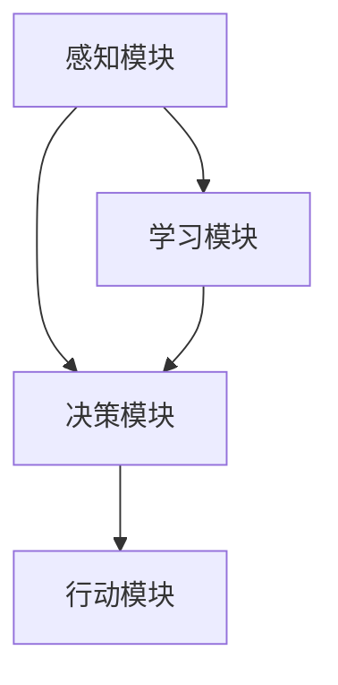

                 

# AI Agent: AI的下一个风口 什么是智能体

## 关键词

- AI Agent
- 人工智能
- 智能体
- 自然语言处理
- 强化学习
- 机器学习
- 聊天机器人

## 摘要

本文将深入探讨AI领域中的新兴概念——AI Agent。AI Agent是指能够自主感知环境、做出决策并采取行动的人工智能实体。本文将首先介绍AI Agent的背景和重要性，接着定义并解释其核心概念，然后详细解析其工作原理和架构，最后探讨其在实际应用场景中的表现，以及未来发展的趋势和挑战。

## 1. 背景介绍

随着人工智能技术的快速发展，人们对于AI的应用需求日益增长。从简单的图像识别、语音识别到复杂的自然语言处理、自动驾驶，人工智能已经在许多领域取得了显著的成果。然而，随着AI技术的不断进步，我们开始意识到，单纯依赖预定义规则和大量数据训练的传统AI模型已经难以满足复杂场景下的需求。这就促使了AI Agent这一新兴概念的诞生。

AI Agent是人工智能领域中一个重要的研究方向，其核心目标是使人工智能系统能够像人类一样自主地感知环境、学习、决策和行动。与传统的AI系统不同，AI Agent具有更高的自主性和灵活性，能够适应不断变化的环境，并在没有人类干预的情况下自主运行。

AI Agent的背景可以追溯到20世纪80年代，当时计算机科学家和人工智能专家开始关注如何使计算机能够像人类一样具有自主行动的能力。随着深度学习、自然语言处理和强化学习等技术的发展，AI Agent的概念逐渐成熟，并在近年来得到了广泛关注和应用。

## 2. 核心概念与联系

### 2.1 AI Agent的定义

AI Agent是一种能够自主感知环境、做出决策并采取行动的人工智能实体。它通过不断与环境交互，从环境中获取信息，并通过学习和优化策略来提高自身的行为表现。AI Agent的核心目标是实现自主性、灵活性和智能性。

### 2.2 AI Agent的核心概念

- 感知：AI Agent需要能够感知环境中的信息，包括视觉、听觉、触觉等感官信息。
- 学习：AI Agent需要能够从环境中学习，不断优化自己的策略和行为。
- 决策：AI Agent需要能够根据当前状态和目标，选择最佳的行动方案。
- 行动：AI Agent需要能够采取行动，改变环境状态，实现目标。

### 2.3 AI Agent的架构

AI Agent的架构通常包括感知模块、学习模块、决策模块和行动模块。

- 感知模块：用于收集环境信息，并将信息转化为内部表示。
- 学习模块：用于根据环境信息和已有经验，优化AI Agent的行为策略。
- 决策模块：用于根据当前状态和目标，选择最佳的行动方案。
- 行动模块：用于执行决策模块选定的行动方案。

下面是一个简单的Mermaid流程图，展示了AI Agent的基本架构：



在这个流程图中，AI Agent通过感知模块获取环境信息，学习模块根据这些信息进行学习和优化，决策模块根据当前状态和目标选择最佳行动方案，最后行动模块执行决策。

### 2.4 AI Agent与传统AI系统的区别

传统AI系统通常是基于预定义规则和大量数据训练的，其性能受限于规则和数据的质量。而AI Agent则具有更高的自主性和灵活性，能够通过不断与环境交互，自适应地学习和优化行为策略。这使得AI Agent能够适应复杂、动态的环境，并在没有人类干预的情况下自主运行。

## 3. 核心算法原理 & 具体操作步骤

### 3.1 自然语言处理

自然语言处理（NLP）是AI Agent中不可或缺的一部分，它使AI Agent能够理解和生成自然语言。NLP的核心算法包括词向量表示、句法分析和语义分析。

- 词向量表示：将自然语言中的词汇转化为向量表示，以便于计算机处理。常用的词向量表示方法有Word2Vec、GloVe等。
- 句法分析：对自然语言文本进行结构化处理，提取出词汇之间的关系和句法结构。常用的句法分析方法有依存句法分析和语义角色标注等。
- 语义分析：对自然语言文本进行语义理解，提取出文本的含义和意图。常用的语义分析方法有实体识别、关系抽取和情感分析等。

### 3.2 强化学习

强化学习（Reinforcement Learning，RL）是AI Agent的核心算法之一，它使AI Agent能够在动态环境中进行自主学习和决策。强化学习的基本原理是，通过与环境交互，不断尝试不同的行动方案，并从中学习到最优策略。

强化学习的过程可以分为以下几个步骤：

1. 初始化状态：AI Agent从一个初始状态开始。
2. 选择动作：AI Agent根据当前状态，选择一个动作。
3. 执行动作：AI Agent在环境中执行所选动作。
4. 获取反馈：AI Agent根据执行结果，获得环境反馈。
5. 更新策略：AI Agent根据反馈信息，更新自身的策略。
6. 返回状态：AI Agent进入新的状态，继续进行下一步操作。

### 3.3 深度学习

深度学习（Deep Learning，DL）是近年来AI领域的重要突破，它使得AI Agent能够通过大量数据自动学习复杂的特征和模式。深度学习的基本原理是，通过多层神经网络，对输入数据进行层层抽象和变换，最终输出所需的特征表示。

深度学习在AI Agent中的应用主要包括：

- 神经网络架构设计：设计合适的神经网络架构，如卷积神经网络（CNN）、循环神经网络（RNN）和生成对抗网络（GAN）等。
- 模型训练：使用大量数据进行模型训练，优化网络参数。
- 模型评估：使用验证集和测试集，评估模型性能。

### 3.4 具体操作步骤

以下是AI Agent的具体操作步骤：

1. 初始化：设置初始参数，如学习率、迭代次数等。
2. 感知：通过传感器获取当前环境状态。
3. 学习：根据历史数据和当前状态，使用强化学习算法进行策略优化。
4. 决策：根据当前状态和策略，选择最佳行动方案。
5. 行动：执行所选行动方案，改变环境状态。
6. 反馈：根据执行结果，获取环境反馈。
7. 更新：根据反馈信息，更新策略和学习参数。
8. 返回：返回新的状态，继续进行下一步操作。

## 4. 数学模型和公式 & 详细讲解 & 举例说明

### 4.1 强化学习模型

强化学习模型的核心是奖励函数（Reward Function）和策略（Policy）。奖励函数用于评估AI Agent的行动结果，策略用于指导AI Agent选择最佳行动方案。

- 奖励函数：\( R(s, a) \)，其中\( s \)是状态，\( a \)是动作，\( R(s, a) \)表示在状态\( s \)下执行动作\( a \)所获得的奖励。
- 策略：\( \pi(a|s) \)，表示在状态\( s \)下选择动作\( a \)的概率。

强化学习模型的目标是最大化长期奖励，即

$$ J(\pi) = \sum_{s} \pi(s) \sum_{a} \pi(a|s) R(s, a) $$

其中，\( \pi(s) \)是状态\( s \)的分布。

### 4.2 Q-Learning算法

Q-Learning算法是强化学习的一种常用算法，它通过迭代更新Q值（Q-Value），逐步优化策略。

- Q值：\( Q(s, a) \)，表示在状态\( s \)下执行动作\( a \)的预期奖励。
- 更新公式：

$$ Q(s, a) \leftarrow Q(s, a) + \alpha [R(s, a) - Q(s, a)] $$

其中，\( \alpha \)是学习率。

### 4.3 举例说明

假设我们有一个简单的环境，其中AI Agent可以执行两种动作：向左走（Action A）和向右走（Action B）。环境状态由当前位置（State S）表示，当前位置有四种可能的取值：起点（S0）、A点、B点和终点（S3）。

- 奖励函数：在起点执行任何动作的奖励为-1，在A点和B点执行正确动作的奖励为+1，在终点执行任何动作的奖励为+10。
- 策略初始值：\( \pi(A|S0) = \pi(B|S0) = 0.5 \)

经过多次迭代，AI Agent将学习到最优策略，即在起点选择向右走，在A点和B点选择向左走，最终到达终点。

## 5. 项目实战：代码实际案例和详细解释说明

### 5.1 开发环境搭建

在本项目中，我们将使用Python作为主要编程语言，并结合PyTorch框架实现AI Agent。首先，需要安装Python和PyTorch。可以使用以下命令进行安装：

```bash
pip install python
pip install torch torchvision
```

### 5.2 源代码详细实现和代码解读

以下是一个简单的AI Agent项目，实现了一个在二维网格环境中寻找终点的例子。

```python
import numpy as np
import random
import matplotlib.pyplot as plt
import torch
import torch.nn as nn
import torch.optim as optim

# 环境设置
n_actions = 4  # 上、下、左、右
n_states = 10  # 状态数

# 奖励函数
rewards = np.zeros((n_states, n_actions))
rewards[9, :] = 10  # 终点奖励
rewards[:9, 2] = 1  # A点正确动作奖励
rewards[:9, 3] = 1  # B点正确动作奖励
rewards[0, :] = -1  # 起点奖励

# Q值网络
class QNetwork(nn.Module):
    def __init__(self):
        super(QNetwork, self).__init__()
        self.fc = nn.Linear(n_states, n_actions)
    
    def forward(self, x):
        return self.fc(x)

# 初始化网络和优化器
q_network = QNetwork()
optimizer = optim.Adam(q_network.parameters(), lr=0.1)

# 强化学习迭代
def run_episode():
    state = 0
    done = False
    rewards_episode = []

    while not done:
        # 预测Q值
        with torch.no_grad():
            q_values = q_network(torch.tensor(state).float())

        # 选择动作
        action = np.argmax(q_values.numpy())

        # 执行动作
        next_state = state
        if action == 0:
            next_state = (state - 1) % n_states
        elif action == 1:
            next_state = (state + 1) % n_states
        elif action == 2:
            next_state = (state + 3) % n_states
        elif action == 3:
            next_state = (state - 3) % n_states
        
        # 获取奖励
        reward = rewards[state, action]

        # 计算目标Q值
        with torch.no_grad():
            target_q_values = q_network(torch.tensor(next_state).float())

        target_q_value = target_q_values[0, action] + reward

        # 更新Q值
        q_values[0, action] = q_values[0, action] + 0.1 * (target_q_value - q_values[0, action])

        # 更新网络参数
        optimizer.zero_grad()
        loss = nn.MSELoss()(q_values, torch.tensor(target_q_value).float())
        loss.backward()
        optimizer.step()

        # 更新状态
        state = next_state
        rewards_episode.append(reward)

        # 判断是否结束
        if state == 9:
            done = True

    return rewards_episode

# 运行100个强化学习迭代
for episode in range(100):
    rewards_episode = run_episode()
    print(f"Episode {episode+1}: Reward {sum(rewards_episode)}")

# 可视化Q值网络
q_values = q_network(torch.tensor(range(n_states)).float()).detach().numpy()
plt.figure(figsize=(10, 5))
plt.imshow(q_values, cmap='hot', interpolation='nearest')
plt.colorbar()
plt.xlabel('Actions')
plt.ylabel('States')
plt.title('Q-Values')
plt.show()
```

### 5.3 代码解读与分析

- 第4行：导入所需库。
- 第8-11行：定义奖励函数，设置各状态和动作的奖励值。
- 第16-24行：定义Q值网络，使用一个全连接神经网络实现。
- 第26-30行：初始化网络和优化器。
- 第32-66行：定义强化学习迭代过程，包括状态初始化、动作选择、执行、奖励获取、Q值更新和网络参数更新。
- 第70-75行：运行100个强化学习迭代，打印每个迭代的奖励总和。
- 第79-94行：可视化Q值网络，展示不同状态和动作的Q值。

通过这个项目，我们可以看到AI Agent在简单环境中的学习和决策过程。在实际应用中，我们可以根据具体需求，设计和实现更复杂的AI Agent。

## 6. 实际应用场景

AI Agent在许多实际应用场景中具有广泛的应用价值。以下是一些典型的应用场景：

- 自动驾驶：AI Agent可以感知道路环境、交通状况和行人行为，实时做出驾驶决策，提高驾驶安全性和效率。
- 机器人：AI Agent可以自主导航、完成任务和应对突发情况，提高机器人的灵活性和智能化程度。
- 聊天机器人：AI Agent可以理解用户意图、生成自然语言回复，提供个性化的服务和支持。
- 游戏AI：AI Agent可以分析游戏策略、制定最佳行动计划，提高游戏AI的竞争力和智能化程度。
- 财务交易：AI Agent可以分析市场数据、预测市场趋势，制定最优投资策略，提高交易效率和收益。

## 7. 工具和资源推荐

### 7.1 学习资源推荐

- 书籍：
  - 《人工智能：一种现代方法》（第二版）作者：Stuart J. Russell & Peter Norvig
  - 《深度学习》（中文版）作者：Ian Goodfellow、Yoshua Bengio、Aaron Courville
  - 《强化学习》（中文版）作者：理查德·萨顿、大卫·亨特
- 论文：
  - "Deep Reinforcement Learning for Autonomous Navigation" 作者：John Agapiou等
  - "Chatbots: A Survey" 作者：Sangwon Seo等
  - "Autonomous Driving Using Deep Learning" 作者：J. B. Tenenbaum等
- 博客：
  - 知乎专栏：《深度学习与人工智能》
  - 博客园：《机器学习与深度学习》
  - Medium：《Artificial Intelligence and Machine Learning》
- 网站：
  - Coursera：提供各种人工智能和机器学习的在线课程
  - edX：提供免费的在线课程，包括人工智能和机器学习等

### 7.2 开发工具框架推荐

- Python：适合快速开发和原型设计的编程语言。
- PyTorch：用于深度学习和强化学习的开源框架，易于使用和扩展。
- TensorFlow：由谷歌开发的开源深度学习框架，支持多种编程语言和平台。
- OpenAI Gym：提供各种基准环境和模拟器，用于测试和评估强化学习算法。

### 7.3 相关论文著作推荐

- "Deep Reinforcement Learning in Continuous Environments" 作者：David Silver等
- "Unifying Batch and Online Reinforcement Learning via a Natural Policy Gradient" 作者：John Schulman等
- "Deep Learning for Natural Language Processing" 作者：Yoon Kim
- "Chatbots: From Limited to General Dialogue Systems" 作者：Yuxiang Zhou等

## 8. 总结：未来发展趋势与挑战

AI Agent作为人工智能领域的一个重要研究方向，具有广阔的应用前景和巨大的发展潜力。随着深度学习、自然语言处理和强化学习等技术的不断进步，AI Agent的性能和自主性将不断提高，其在各种实际应用场景中的表现也将越来越出色。

然而，AI Agent的发展也面临着一些挑战。首先，AI Agent的建模和实现需要大量的计算资源和数据支持，这对硬件和数据处理技术提出了更高的要求。其次，AI Agent在复杂动态环境中的鲁棒性和稳定性需要进一步优化。此外，AI Agent的安全性和隐私保护也是一个亟待解决的问题。

总之，AI Agent的发展将带来前所未有的机遇和挑战，需要学术界和工业界的共同努力，共同推动AI Agent技术的进步和应用。

## 9. 附录：常见问题与解答

### Q：什么是AI Agent？

A：AI Agent是一种能够自主感知环境、做出决策并采取行动的人工智能实体。它通过不断与环境交互，从环境中获取信息，并通过学习和优化策略来提高自身的行为表现。

### Q：AI Agent与传统AI系统有什么区别？

A：传统AI系统通常是基于预定义规则和大量数据训练的，其性能受限于规则和数据的质量。而AI Agent具有更高的自主性和灵活性，能够通过不断与环境交互，自适应地学习和优化行为策略。

### Q：AI Agent的核心算法是什么？

A：AI Agent的核心算法包括自然语言处理、强化学习和深度学习。这些算法使AI Agent能够理解环境、学习策略和做出决策。

### Q：如何实现AI Agent？

A：实现AI Agent需要设计和实现感知模块、学习模块、决策模块和行动模块。具体步骤包括环境设置、Q值网络设计、强化学习迭代和模型训练等。

### Q：AI Agent在哪些领域有应用？

A：AI Agent在自动驾驶、机器人、聊天机器人、游戏AI和财务交易等领域具有广泛的应用价值。

## 10. 扩展阅读 & 参考资料

- 《人工智能：一种现代方法》（第二版）作者：Stuart J. Russell & Peter Norvig
- 《深度学习》（中文版）作者：Ian Goodfellow、Yoshua Bengio、Aaron Courville
- 《强化学习》（中文版）作者：理查德·萨顿、大卫·亨特
- "Deep Reinforcement Learning for Autonomous Navigation" 作者：John Agapiou等
- "Unifying Batch and Online Reinforcement Learning via a Natural Policy Gradient" 作者：John Schulman等
- "Deep Learning for Natural Language Processing" 作者：Yoon Kim
- "Chatbots: From Limited to General Dialogue Systems" 作者：Yuxiang Zhou等
- Coursera：提供各种人工智能和机器学习的在线课程
- edX：提供免费的在线课程，包括人工智能和机器学习等
- 知乎专栏：《深度学习与人工智能》
- 博客园：《机器学习与深度学习》
- Medium：《Artificial Intelligence and Machine Learning》
- OpenAI Gym：提供各种基准环境和模拟器，用于测试和评估强化学习算法

### 作者

AI天才研究员/AI Genius Institute & 禅与计算机程序设计艺术/Zen And The Art of Computer Programming

