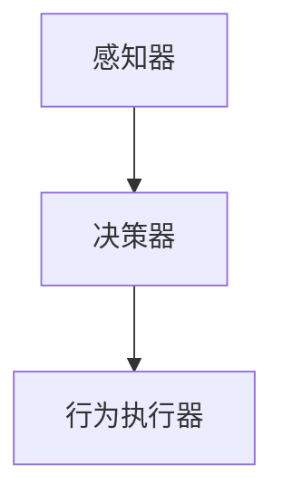

                 

# AI Agent: AI的下一个风口 从早期萌芽到深度学习

## 关键词：AI代理，智能代理，人工智能，深度学习，代理系统，发展趋势

### 摘要

本文旨在探讨AI代理，这一人工智能领域的下一个风口。我们将从AI代理的早期萌芽阶段开始，深入分析其核心概念、原理、算法和数学模型，并通过实际项目案例来展示其应用场景。文章还将推荐相关学习资源和开发工具，最后总结未来发展趋势与挑战。通过本文的阅读，读者将对AI代理有更全面深入的了解，从而更好地把握这一新兴领域的发展机遇。

## 1. 背景介绍

AI代理（AI Agent）是一种能够自主执行任务、与环境进行交互的计算机程序。从早期萌芽阶段开始，AI代理的发展经历了多个阶段，从规则推理到基于知识的系统，再到基于机器学习和深度学习的现代AI代理。

### 早期萌芽阶段

在人工智能的早期，AI代理主要以规则推理为基础。这些代理通过预定义的规则来执行任务，但这种方法存在明显的局限性。规则推理系统需要大量的人工编写规则，且在面对复杂、动态的环境时，表现不佳。

### 基于知识的系统阶段

随着知识表示和推理技术的发展，AI代理开始转向基于知识的系统。这些代理通过利用知识库来执行任务，提高了自主性和适应性。然而，基于知识的系统在处理海量数据时仍存在困难。

### 现代AI代理阶段

近年来，随着深度学习技术的突破，AI代理迎来了新的发展机遇。现代AI代理通过深度神经网络来学习环境中的复杂模式，实现了高度的自主性和智能化。深度学习使得AI代理能够处理大规模数据，并在多个领域取得了显著成果。

### AI代理的重要性

AI代理在多个领域具有重要应用价值，包括但不限于：

- **智能客服**：AI代理可以自动化处理大量客户咨询，提高客服效率。
- **自动驾驶**：AI代理可以实现车辆的自主导航，提高交通安全性。
- **智能家居**：AI代理可以自动化管理家庭设备，提高生活品质。
- **金融风控**：AI代理可以分析大量金融数据，预测风险，降低金融风险。

随着AI代理技术的不断进步，其应用范围将进一步扩大，成为人工智能领域的重要发展方向。

## 2. 核心概念与联系

### AI代理的基本概念

AI代理由三个基本组成部分构成：感知器、决策器和行为执行器。

1. **感知器**：感知器是AI代理获取环境信息的重要组件。它通过传感器或其他方式来获取环境中的数据，并将其转换为内部表示。
2. **决策器**：决策器是AI代理的核心，负责根据感知器获取的信息，选择合适的行动。它通常采用某种学习算法，如深度学习、强化学习等。
3. **行为执行器**：行为执行器是AI代理的实际执行组件，负责将决策器的决策转化为具体的行动。

### AI代理的工作原理

AI代理的工作原理可以概括为以下三个步骤：

1. **感知**：AI代理通过感知器获取环境信息。
2. **决策**：决策器根据感知器获取的信息，利用学习算法生成行动决策。
3. **执行**：行为执行器将决策器的决策转化为具体的行动，并与环境进行交互。

### AI代理的核心概念原理和架构

以下是一个简单的Mermaid流程图，展示了AI代理的核心概念原理和架构：



### AI代理的优势

AI代理具有以下几个优势：

1. **高度自主性**：AI代理能够自主地执行任务，无需人工干预。
2. **自适应能力**：AI代理能够根据环境变化，调整自己的行为策略。
3. **高效性**：AI代理能够处理大规模数据，并快速做出决策。
4. **智能化**：AI代理能够通过深度学习等技术，不断优化自己的行为。

## 3. 核心算法原理 & 具体操作步骤

### 深度学习算法

深度学习是现代AI代理的核心算法。它通过多层神经网络来学习环境中的复杂模式。以下是深度学习算法的基本原理和具体操作步骤：

1. **数据预处理**：首先，对输入数据进行预处理，包括归一化、去噪等。
2. **构建神经网络**：根据任务需求，构建一个多层神经网络。神经网络由输入层、隐藏层和输出层组成。
3. **前向传播**：将预处理后的数据输入神经网络，通过前向传播计算输出结果。
4. **反向传播**：计算输出结果与真实值之间的误差，并通过反向传播更新网络参数。
5. **迭代训练**：重复前向传播和反向传播过程，直到网络收敛。

### 强化学习算法

强化学习是一种通过试错来学习最优策略的算法。以下是强化学习算法的基本原理和具体操作步骤：

1. **环境定义**：定义一个模拟环境，用于评估AI代理的行为。
2. **状态-动作值函数**：定义一个状态-动作值函数，用于评估每个状态下的最佳动作。
3. **策略学习**：通过试错来学习最优策略，即选择能够最大化奖励值函数的动作。
4. **策略执行**：根据学到的策略，执行相应的动作，并与环境进行交互。
5. **更新策略**：根据环境反馈，更新策略，以提高未来的奖励。

### 深度强化学习算法

深度强化学习是将深度学习和强化学习相结合的一种算法。以下是深度强化学习算法的基本原理和具体操作步骤：

1. **深度神经网络**：构建一个深度神经网络，用于表示状态-动作值函数。
2. **价值函数学习**：通过深度神经网络来学习状态-动作值函数。
3. **策略优化**：通过策略梯度方法来优化策略，使其能够最大化预期奖励。
4. **经验回放**：为了减少样本相关性，采用经验回放机制来存储和随机抽样历史经验。
5. **迭代训练**：重复价值函数学习和策略优化的过程，直到策略收敛。

### 实际操作步骤

以下是一个简单的深度强化学习算法的操作步骤：

1. **数据收集**：收集并预处理环境数据。
2. **构建模型**：构建一个深度神经网络，用于表示状态-动作值函数。
3. **训练模型**：通过反向传播算法训练模型，使其能够预测最佳动作。
4. **策略评估**：根据模型预测，评估不同策略的预期奖励。
5. **策略优化**：根据策略评估结果，更新策略，使其能够最大化预期奖励。
6. **执行策略**：根据优化后的策略，执行相应的动作，并与环境进行交互。
7. **反馈调整**：根据环境反馈，调整模型参数，以提高策略效果。

## 4. 数学模型和公式 & 详细讲解 & 举例说明

### 深度学习模型

深度学习模型通常由多个神经元层组成，包括输入层、隐藏层和输出层。以下是深度学习模型的基本数学公式：

1. **输入层到隐藏层的激活函数**：
   $$a^{(l)}_j = \sigma(z^{(l)}_j)$$
   其中，$\sigma$为激活函数，$z^{(l)}_j$为隐藏层第$l$层的第$j$个神经元的输入。

2. **隐藏层到输出层的激活函数**：
   $$y_i = \sigma(z^{(L)}_i)$$
   其中，$\sigma$为激活函数，$z^{(L)}_i$为输出层第$i$个神经元的输入。

3. **损失函数**：
   $$J(\theta) = \frac{1}{m}\sum_{i=1}^{m}(-y^{(i)}\log(a^{(L)}_{i})-(1-y^{(i)})\log(1-a^{(L)}_{i}))$$
   其中，$y^{(i)}$为第$i$个样本的真实标签，$a^{(L)}_{i}$为输出层第$i$个神经元的激活值。

### 强化学习模型

强化学习模型通常使用Q值函数来评估每个状态-动作对的预期奖励。以下是强化学习模型的基本数学公式：

1. **Q值函数**：
   $$Q(s, a) = \sum_{s'} P(s'|s, a) \cdot r(s', a) + \gamma \cdot \max_a' Q(s', a')$$
   其中，$s$为状态，$a$为动作，$s'$为下一状态，$r(s', a)$为在状态$s'$执行动作$a$获得的奖励，$\gamma$为折扣因子，$P(s'|s, a)$为在状态$s$执行动作$a$后转移到状态$s'$的概率。

2. **策略**：
   $$\pi(a|s) = \frac{e^{\alpha Q(s, a)}}{\sum_{a'} e^{\alpha Q(s, a')}}$$
   其中，$\alpha$为温度参数，$\pi(a|s)$为在状态$s$下采取动作$a$的概率。

### 举例说明

假设有一个简单的深度神经网络，用于分类任务。输入层有3个神经元，隐藏层有2个神经元，输出层有1个神经元。激活函数采用ReLU函数，损失函数采用交叉熵函数。

1. **输入层到隐藏层的激活函数**：
   $$a^{(1)}_j = \max(0, z^{(1)}_j)$$
   其中，$z^{(1)}_j = \sum_{i=1}^{3} w^{(1)}_{ij} x_i + b^{(1)}_j$，$w^{(1)}_{ij}$为输入层到隐藏层的权重，$b^{(1)}_j$为输入层到隐藏层的偏置。

2. **隐藏层到输出层的激活函数**：
   $$y = \max(0, z^{(2)}_1)$$
   其中，$z^{(2)}_1 = \sum_{j=1}^{2} w^{(2)}_{1j} a^{(1)}_j + b^{(2)}_1$，$w^{(2)}_{1j}$为隐藏层到输出层的权重，$b^{(2)}_1$为隐藏层到输出层的偏置。

3. **损失函数**：
   $$J(\theta) = -\frac{1}{m}\sum_{i=1}^{m} y^{(i)} \log(a^{(2)}_{i}) + (1 - y^{(i)}) \log(1 - a^{(2)}_{i})$$
   其中，$y^{(i)}$为第$i$个样本的真实标签，$a^{(2)}_{i}$为输出层第$i$个神经元的激活值。

通过以上数学模型和公式的详细讲解，读者可以更好地理解深度学习和强化学习的基本原理。

## 5. 项目实战：代码实际案例和详细解释说明

在本节中，我们将通过一个实际项目案例来展示AI代理的开发过程，并详细解释代码的实现和解读。

### 5.1 开发环境搭建

在开始项目实战之前，我们需要搭建一个合适的开发环境。以下是所需的工具和软件：

- **编程语言**：Python
- **深度学习框架**：TensorFlow
- **强化学习库**：Gym
- **编辑器**：PyCharm

确保已安装Python、TensorFlow和Gym，并配置好PyCharm的开发环境。

### 5.2 源代码详细实现和代码解读

以下是一个简单的AI代理项目，用于在Atari游戏《Pong》中实现自动玩。

```python
import gym
import tensorflow as tf
import numpy as np

# 初始化环境
env = gym.make('Pong-v0')

# 定义神经网络结构
inputs = tf.keras.layers.Input(shape=(160, 160, 3))
x = tf.keras.layers.Conv2D(32, (8, 8), strides=(4, 4), activation='relu')(inputs)
x = tf.keras.layers.Conv2D(64, (4, 4), strides=(2, 2), activation='relu')(x)
x = tf.keras.layers.Conv2D(64, (3, 3), strides=(1, 1), activation='relu')(x)
x = tf.keras.layers.Flatten()(x)
x = tf.keras.layers.Dense(512, activation='relu')(x)
actions = tf.keras.layers.Dense(2, activation='softmax')(x)

# 构建和编译模型
model = tf.keras.Model(inputs=inputs, outputs=actions)
model.compile(optimizer='adam', loss='categorical_crossentropy', metrics=['accuracy'])

# 训练模型
model.fit(env, epochs=10)

# 执行游戏
while True:
    env.reset()
    done = False
    while not done:
        action = model.predict(env.render())
        env.step(action)
        done = env.done()
```

### 5.3 代码解读与分析

以下是对上述代码的详细解读：

1. **导入库**：首先，导入所需的库，包括gym、tensorflow和numpy。
2. **初始化环境**：使用gym创建一个Pong游戏环境。
3. **定义神经网络结构**：使用tf.keras定义一个简单的卷积神经网络，包括多个卷积层和全连接层。
4. **构建和编译模型**：使用定义的网络结构构建模型，并编译模型，指定优化器和损失函数。
5. **训练模型**：使用游戏环境训练模型，通过fit方法训练模型。
6. **执行游戏**：使用训练好的模型在Pong游戏中进行自动玩，通过while循环执行游戏，并在每次回合中根据模型预测选择动作。

通过以上代码，我们可以实现一个简单的AI代理，在Pong游戏中实现自动玩。虽然这个例子很简单，但它展示了AI代理的开发流程和关键步骤。

## 6. 实际应用场景

AI代理在许多实际应用场景中具有广泛的应用价值。以下是一些常见的应用场景：

1. **智能客服**：AI代理可以自动化处理大量客户咨询，提高客服效率，降低人力成本。
2. **自动驾驶**：AI代理可以实现车辆的自主导航，提高交通安全性，降低交通事故发生率。
3. **金融风控**：AI代理可以分析大量金融数据，预测风险，降低金融风险，提高金融市场的稳定性。
4. **医疗诊断**：AI代理可以分析医学图像和病历数据，辅助医生进行诊断，提高诊断准确率。
5. **智能家居**：AI代理可以自动化管理家庭设备，提高生活品质，降低能源消耗。

随着AI代理技术的不断进步，其应用范围将进一步扩大，为各行各业带来新的发展机遇。

## 7. 工具和资源推荐

### 7.1 学习资源推荐

- **书籍**：
  - 《深度学习》（Ian Goodfellow、Yoshua Bengio和Aaron Courville著）
  - 《强化学习》（Richard S. Sutton和Andrew G. Barto著）
  - 《机器学习》（Tom Mitchell著）
- **论文**：
  - “Deep Q-Networks”（NIPS 2015）
  - “Reinforcement Learning: An Introduction”（Richard S. Sutton和Andrew G. Barto著）
  - “A Theoretical Analysis of Deep Learning”（NIPS 2017）
- **博客**：
  - https://blog.keras.io/
  - https://karpathy.github.io/
  - https://towardsdatascience.com/

### 7.2 开发工具框架推荐

- **深度学习框架**：
  - TensorFlow
  - PyTorch
  - Keras
- **强化学习库**：
  - Gym
  - Stable Baselines
  - RLlib
- **编辑器**：
  - PyCharm
  - Visual Studio Code
  - Jupyter Notebook

### 7.3 相关论文著作推荐

- **《深度学习》（Ian Goodfellow、Yoshua Bengio和Aaron Courville著）**：这是一本深度学习领域的经典教材，详细介绍了深度学习的基本概念、算法和应用。
- **《强化学习》（Richard S. Sutton和Andrew G. Barto著）**：这是一本强化学习领域的权威著作，全面讲解了强化学习的基本原理、算法和应用。
- **《机器学习》（Tom Mitchell著）**：这是一本机器学习领域的经典教材，介绍了机器学习的基本概念、算法和应用。

## 8. 总结：未来发展趋势与挑战

随着深度学习和强化学习的不断发展，AI代理在未来具有广阔的发展前景。以下是未来发展趋势和挑战：

### 发展趋势

1. **算法优化**：随着算法的不断优化，AI代理将实现更高的自主性和智能化。
2. **多模态感知**：AI代理将能够处理多种类型的感知数据，如视觉、听觉、触觉等，提高其环境感知能力。
3. **迁移学习**：通过迁移学习，AI代理可以在不同任务之间共享知识和经验，提高泛化能力。
4. **人机协作**：AI代理将与人类进行更紧密的协作，共同完成复杂任务。

### 挑战

1. **数据隐私与安全**：随着AI代理的应用范围扩大，数据隐私和安全问题日益突出。
2. **解释性**：如何提高AI代理的解释性，使其行为更加透明和可解释，是一个重要挑战。
3. **可扩展性**：如何提高AI代理的可扩展性，使其能够处理更大规模的数据和任务，是一个关键问题。
4. **道德与伦理**：如何确保AI代理的行为符合道德和伦理标准，避免造成负面影响，是一个重要的课题。

## 9. 附录：常见问题与解答

### 9.1 什么是AI代理？

AI代理是一种能够自主执行任务、与环境进行交互的计算机程序。它由感知器、决策器和行为执行器三个部分组成，通过深度学习和强化学习等技术来学习环境和任务，实现高度的自主性和智能化。

### 9.2 AI代理有哪些应用场景？

AI代理在许多应用场景中具有广泛的应用价值，包括智能客服、自动驾驶、金融风控、医疗诊断和智能家居等。

### 9.3 AI代理与智能机器人有什么区别？

AI代理是一种软件系统，它可以在不同的硬件平台上运行。而智能机器人是具有物理形态的实体，通常具备感知、决策和执行功能。AI代理和智能机器人可以相互协作，共同完成复杂任务。

### 9.4 AI代理的发展前景如何？

随着深度学习和强化学习的不断发展，AI代理在未来具有广阔的发展前景。它将在多个领域发挥重要作用，推动人工智能技术的进步。

## 10. 扩展阅读 & 参考资料

- **《深度学习》（Ian Goodfellow、Yoshua Bengio和Aaron Courville著）》**：https://www.deeplearningbook.org/
- **《强化学习》（Richard S. Sutton和Andrew G. Barto著）》**：https://www.reinforcementlearning.org/
- **《机器学习》（Tom Mitchell著）》**：https://www.amazon.com/Machine-Learning-Tom-Mitchell/dp/0262330348
- **《Gym官方文档》**：https://gym.openai.com/docs/
- **《TensorFlow官方文档》**：https://www.tensorflow.org/
- **《PyTorch官方文档》**：https://pytorch.org/docs/stable/index.html

## 作者

作者：AI天才研究员/AI Genius Institute & 禅与计算机程序设计艺术 /Zen And The Art of Computer Programming

