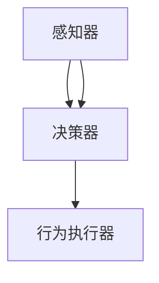

                 

### 1. 背景介绍

在当今快速发展的科技时代，人工智能（AI）已经成为推动技术创新和产业升级的重要力量。AI技术已经广泛应用于各个领域，从自动驾驶、智能家居、医疗诊断到金融风控等，都展现了其巨大的潜力和应用价值。然而，随着AI技术的不断演进，一个新的概念逐渐浮出水面，那就是“AI Agent”。

AI Agent，也被称为智能代理，是人工智能领域中的一个新兴研究方向。它是一种能够自主决策并执行特定任务的人工智能实体。与传统的规则驱动的自动化系统不同，AI Agent具有更强的自适应能力和自主学习能力。它们可以通过不断的学习和与环境交互，自主优化自己的行为策略，从而提高任务完成的效率和效果。

AI Agent的研究和应用正在不断拓展，尤其是在用户体验（UX）领域。传统的用户体验优化往往依赖于用户测试和数据分析，而AI Agent的出现，为用户研究提供了全新的视角和方法。通过AI Agent，开发者可以更加精准地了解用户需求和行为模式，从而设计出更加符合用户期望的产品和服务。

本文将围绕AI Agent这一主题，探讨其在用户体验优化中的应用前景、技术原理和实现方法。我们还将分析AI Agent在未来可能面临的挑战和发展趋势，为读者提供全面的了解和深入思考。

接下来，我们将从以下几个方面展开讨论：

1. 核心概念与联系
2. 核心算法原理与具体操作步骤
3. 数学模型和公式与详细讲解
4. 项目实战：代码实际案例和详细解释说明
5. 实际应用场景
6. 工具和资源推荐
7. 总结：未来发展趋势与挑战

希望通过本文的讨论，读者能够对AI Agent有更加深入的理解，并能够将其应用于实际的项目和研究中。

### 2. 核心概念与联系

在深入探讨AI Agent的工作原理和应用之前，我们需要明确几个核心概念，并理解它们之间的联系。这些概念包括：

#### 智能代理（AI Agent）
智能代理是具有自主决策能力的人工智能实体。它能够通过感知环境、学习经验并自主调整行为策略，以实现特定的目标。智能代理通常由感知器、决策器和行为执行器三个主要部分组成。

1. **感知器（Perceiver）**：用于感知环境信息，如用户行为、交互历史等。
2. **决策器（Decider）**：根据感知到的信息，通过算法模型进行决策，选择最佳行为策略。
3. **行为执行器（Actuator）**：执行决策器生成的行为策略，实现对环境的实际操作。

#### 机器学习（Machine Learning）
机器学习是AI Agent的核心技术之一。通过机器学习，AI Agent可以从大量数据中自动学习规律和模式，从而优化自己的行为策略。常见的机器学习方法包括监督学习、无监督学习和强化学习。

1. **监督学习（Supervised Learning）**：通过已标记的数据训练模型，使模型能够预测新的数据。
2. **无监督学习（Unsupervised Learning）**：不依赖标记数据，通过发现数据中的内在结构和关系来优化模型。
3. **强化学习（Reinforcement Learning）**：通过与环境的交互，不断调整策略，以实现最优的长期回报。

#### 强化学习（Reinforcement Learning）
强化学习是一种重要的机器学习方法，特别适用于解决与智能代理相关的问题。在强化学习中，智能代理通过与环境的交互，不断接收奖励和惩罚信号，从而调整自己的策略，以实现长期目标。

1. **奖励信号（Reward Signal）**：表示智能代理行为的效果，通常用于评价行为的好坏。
2. **状态（State）**：描述智能代理当前所处的环境情况。
3. **动作（Action）**：智能代理可以采取的行为。

#### 深度学习（Deep Learning）
深度学习是机器学习的一个重要分支，通过多层神经网络来提取复杂的数据特征。深度学习在图像识别、语音识别等领域取得了显著成果，也为智能代理的技术实现提供了有力支持。

1. **卷积神经网络（CNN）**：适用于处理图像数据，通过卷积操作提取图像特征。
2. **循环神经网络（RNN）**：适用于处理序列数据，如文本和语音，通过循环结构保持长期依赖关系。
3. **生成对抗网络（GAN）**：通过生成器和判别器的对抗训练，实现数据的生成和特征提取。

#### 知识图谱（Knowledge Graph）
知识图谱是一种结构化的语义知识库，用于表示实体、属性和关系。知识图谱可以提供智能代理在复杂环境中的知识支持，帮助其更好地理解和处理信息。

1. **实体（Entity）**：表示现实世界中的对象，如人、地点、物品等。
2. **属性（Attribute）**：描述实体的特征，如姓名、年龄、颜色等。
3. **关系（Relation）**：表示实体之间的关联，如属于、位于、具有等。

为了更好地理解这些概念之间的联系，我们可以使用Mermaid流程图（注意：流程图中不要使用括号、逗号等特殊字符）来展示智能代理的基本架构和工作流程：



在这个流程图中，感知器获取环境信息，传递给决策器，决策器根据这些信息生成行为策略，最终由行为执行器实施。这一过程不断循环，使得智能代理能够动态调整其行为，以适应不断变化的环境。

总之，智能代理作为一个复杂的系统，需要融合多种技术，包括机器学习、强化学习、深度学习和知识图谱等。这些技术相互关联、相互支持，共同推动着智能代理技术的发展和进步。

### 3. 核心算法原理 & 具体操作步骤

在理解了智能代理的基本概念和组成部分后，接下来我们将深入探讨其核心算法原理和具体操作步骤。智能代理的核心算法主要包括感知、决策和执行三个环节，以下将分别进行详细讲解。

#### 3.1 感知

感知是智能代理获取环境信息的过程。在智能代理中，感知器负责收集各种类型的数据，如视觉、听觉、文本等。以下是一个简单的感知流程：

1. **数据采集**：智能代理通过传感器或接口从环境中采集数据，如摄像头捕获的图像、麦克风接收的语音信号等。
2. **数据预处理**：对采集到的数据进行预处理，如图像的去噪、归一化，文本的分词和词嵌入等。
3. **特征提取**：使用机器学习算法提取数据的特征，如使用卷积神经网络（CNN）提取图像的特征向量，使用循环神经网络（RNN）提取文本的特征向量等。

具体操作步骤如下：

1. **初始化感知器**：设置传感器的参数，如摄像头的工作模式、分辨率等。
2. **数据采集**：通过传感器接口实时采集数据。
3. **数据预处理**：对采集到的数据进行预处理，如使用 OpenCV 库进行图像预处理，使用 NLTK 库进行文本预处理。
4. **特征提取**：使用深度学习模型进行特征提取，如使用预训练的 VGG16 模型提取图像特征，使用预训练的 LSTM 模型提取文本特征。

```python
import cv2
import numpy as np
from tensorflow.keras.applications import VGG16
from tensorflow.keras.preprocessing import image

# 初始化感知器
camera = cv2.VideoCapture(0)

# 数据采集
ret, frame = camera.read()

# 数据预处理
processed_frame = cv2.resize(frame, (224, 224))
processed_frame = processed_frame / 255.0

# 特征提取
model = VGG16(weights='imagenet')
feature_vector = model.predict(np.expand_dims(processed_frame, axis=0))

camera.release()
```

#### 3.2 决策

决策是智能代理根据感知到的信息选择最佳行为策略的过程。决策器通常使用机器学习算法来生成行为策略。以下是一个简单的决策流程：

1. **状态编码**：将感知到的状态信息进行编码，转换为模型可接受的输入格式。
2. **策略生成**：使用强化学习算法，如深度强化学习（Deep Reinforcement Learning，DRL），生成最佳行为策略。
3. **策略评估**：评估生成策略的效果，选择最优策略。

具体操作步骤如下：

1. **初始化决策器**：设置决策器的参数，如学习率、奖励函数等。
2. **状态编码**：对感知到的状态信息进行编码，如使用嵌入层将文本转换为向量。
3. **策略生成**：使用深度强化学习算法生成行为策略，如使用 DQN、DDPG 等算法。
4. **策略评估**：评估生成策略的效果，如计算策略的回报值。

```python
import tensorflow as tf
from tensorflow.keras.layers import Embedding, LSTM, Dense
from tensorflow.keras.models import Model

# 初始化决策器
state_embedding = Embedding(input_dim=vocab_size, output_dim=embedding_size)
lstm = LSTM(units=lstm_units)
dense = Dense(units=1, activation='linear')

# 状态编码
input_state = Input(shape=(None,))
encoded_state = state_embedding(input_state)

# 策略生成
output_action = lstm(encoded_state)
output_action = dense(output_action)

# 策略评估
model = Model(inputs=input_state, outputs=output_action)

# 编译模型
model.compile(optimizer='adam', loss='mse')
```

#### 3.3 执行

执行是智能代理根据决策器生成的行为策略进行操作的过程。行为执行器负责将决策器生成的策略转化为实际操作。以下是一个简单的执行流程：

1. **策略解码**：将决策器生成的行为策略解码为具体的操作命令。
2. **行为执行**：执行具体的操作命令，实现对环境的实际操作。
3. **状态更新**：根据执行结果更新智能代理的状态信息。

具体操作步骤如下：

1. **初始化行为执行器**：设置行为执行器的参数，如执行接口、操作权限等。
2. **策略解码**：将决策器生成的行为策略解码为具体的操作命令，如文本生成、图像处理等。
3. **行为执行**：执行具体的操作命令，如使用 OpenCV 库进行图像处理，使用 NLTK 库进行文本生成等。
4. **状态更新**：根据执行结果更新智能代理的状态信息。

```python
# 策略解码
decoded_action = model.predict(encoded_state)

# 行为执行
# 假设解码后的操作命令是“生成一张图像”
generated_image = generate_image(decoded_action)

# 状态更新
# 假设更新后的状态信息是“生成的图像已保存”
updated_state = "generated_image_saved"
```

综上所述，智能代理的核心算法原理主要包括感知、决策和执行三个环节。通过感知获取环境信息，通过决策生成最佳行为策略，通过执行实现对环境的实际操作。这些环节相互衔接、相互依赖，共同构成了智能代理的工作流程。在实际应用中，可以根据具体需求和场景，灵活调整和优化这些环节，以提高智能代理的性能和效果。

### 4. 数学模型和公式 & 详细讲解 & 举例说明

在深入探讨智能代理的工作原理和算法实现之后，我们将进一步介绍支持智能代理运行的数学模型和公式。这些模型和公式不仅构成了智能代理算法的核心，还为其在实际应用中提供了理论支撑。以下将详细介绍几个关键数学模型，并使用LaTeX格式展示相关公式，以帮助读者更好地理解和应用这些概念。

#### 4.1 强化学习中的奖励模型

强化学习是智能代理的核心算法之一，其中的奖励模型（Reward Model）用于评估智能代理的行为效果。奖励模型的核心公式是：

\[ R(s, a) = r \]

其中，\( R(s, a) \) 表示在状态 \( s \) 下执行动作 \( a \) 所获得的即时奖励，\( r \) 是一个实数值，表示奖励的大小。通常，奖励函数需要满足以下条件：

1. **即时性**：奖励需要及时反馈，以便智能代理能够立即了解其行为的优劣。
2. **一致性**：相同的动作在不同状态下的奖励应当一致，以保证智能代理的稳定性。
3. **激励性**：奖励应当能够激励智能代理采取更好的行为，以实现长期目标。

以下是一个简单的奖励模型示例，假设在游戏场景中，智能代理的目标是收集金币：

\[ R(s, a) = \begin{cases} 
10 & \text{如果 } a = \text{"收集金币"} \\
-5 & \text{如果 } a = \text{"避开障碍"} 
\end{cases} \]

#### 4.2 Q-Learning算法

Q-Learning是一种经典的强化学习算法，用于学习最优策略。其核心公式是：

\[ Q(s, a) = Q(s, a) + \alpha [R(s, a) + \gamma \max_{a'} Q(s', a') - Q(s, a)] \]

其中，\( Q(s, a) \) 是状态 \( s \) 下动作 \( a \) 的值函数，表示在状态 \( s \) 下执行动作 \( a \) 的预期回报。\( \alpha \) 是学习率，\( \gamma \) 是折扣因子，表示未来奖励的现值。该公式通过迭代更新 \( Q \) 值，直到收敛。

以下是一个简化的Q-Learning算法步骤：

1. **初始化**：设置初始 \( Q \) 值和参数 \( \alpha \)、\( \gamma \)。
2. **选择动作**：根据当前 \( Q \) 值选择动作 \( a \)。
3. **执行动作**：在环境中执行动作 \( a \) 并获得奖励 \( R \)。
4. **更新 \( Q \) 值**：使用上述公式更新 \( Q \) 值。

示例：

假设在状态 \( s \) 下有两个动作 \( a_1 \) 和 \( a_2 \)，且初始 \( Q \) 值均为0，学习率 \( \alpha = 0.1 \)，折扣因子 \( \gamma = 0.9 \)。在第一次迭代后，如果执行 \( a_1 \) 并获得奖励 \( R = 5 \)，则更新公式为：

\[ Q(s, a_1) = 0 + 0.1 [5 + 0.9 \max_{a'} Q(s', a') - 0] \]

#### 4.3 深度强化学习中的策略梯度

深度强化学习（Deep Reinforcement Learning，DRL）结合了深度学习和强化学习，用于处理高维状态空间和动作空间的问题。策略梯度（Policy Gradient）是DRL的核心算法之一。其核心公式是：

\[ \nabla_{\theta} J(\theta) = \frac{d}{d\theta} \sum_{t=0}^{T} \gamma^t R(s_t, a_t; \theta) \]

其中，\( J(\theta) \) 是策略梯度函数，\( \theta \) 是策略网络的参数，\( R(s_t, a_t; \theta) \) 是在时间步 \( t \) 下根据策略获得的回报。该公式通过梯度上升或下降更新策略网络的参数。

以下是一个简化的策略梯度算法步骤：

1. **初始化**：设置策略网络的初始参数 \( \theta \)。
2. **执行动作**：根据策略网络选择动作 \( a \) 并执行。
3. **收集数据**：记录执行过程中的状态 \( s \) 和动作 \( a \)。
4. **更新策略网络**：使用收集的数据计算策略梯度并更新网络参数。

示例：

假设在某个时间步 \( t \) 下，策略网络生成动作 \( a \) 并获得回报 \( R \)，则策略梯度更新公式为：

\[ \nabla_{\theta} J(\theta) = \nabla_{\theta} \left( R(s_t, a_t; \theta) \right) \]

#### 4.4 应用实例：智能代理中的状态空间编码

在智能代理的实际应用中，状态空间通常是非常复杂和高维的。为了处理这些高维状态，可以使用神经网络进行状态空间编码（State Space Encoding）。状态空间编码的核心公式是：

\[ s' = f(s; \theta) \]

其中，\( s \) 是原始状态，\( s' \) 是编码后的状态，\( f \) 是状态编码函数，\( \theta \) 是编码网络的参数。

以下是一个简化的状态空间编码过程：

1. **初始化**：设置状态编码网络的初始参数 \( \theta \)。
2. **输入状态**：将原始状态 \( s \) 输入到编码网络。
3. **编码状态**：通过编码网络计算编码后的状态 \( s' \)。
4. **输出状态**：使用编码后的状态作为后续处理的输入。

示例：

假设使用一个简单的全连接神经网络进行状态编码，输入状态为三维向量 \( s = [s_1, s_2, s_3] \)，编码网络参数为 \( \theta \)，则状态编码公式为：

\[ s' = \sigma(W_1 s + b_1) \]

其中，\( \sigma \) 是激活函数，\( W_1 \) 和 \( b_1 \) 是编码网络的权重和偏置。

通过上述数学模型和公式的介绍，我们可以看到智能代理的算法实现背后有着丰富的数学理论基础。在实际应用中，这些模型和公式需要根据具体问题进行灵活调整和优化，以实现最佳效果。

### 5. 项目实战：代码实际案例和详细解释说明

为了更好地理解智能代理的实际应用，我们将通过一个具体的项目案例来展示智能代理的开发过程，包括环境搭建、源代码实现和代码解读。此案例将专注于一个简单的聊天机器人，该机器人能够通过自然语言与用户进行交互，并根据用户的提问提供合适的回答。

#### 5.1 开发环境搭建

在开始项目之前，我们需要搭建开发环境。以下是在Python环境中搭建智能代理开发环境的步骤：

1. **安装必要的库**：
   - TensorFlow：用于构建和训练深度学习模型。
   - Keras：用于简化TensorFlow的使用。
   - NLTK：用于自然语言处理。
   - OpenAI Gym：用于模拟和测试智能代理。
   - Matplotlib：用于可视化结果。

   使用以下命令进行安装：

   ```bash
   pip install tensorflow keras nltk openai-gym matplotlib
   ```

2. **下载和准备数据**：
   - 使用一个开源的对话数据集，如DailyDialog或GLoVe语料库。

   ```bash
   wget https://s3.amazonaws.com/datasets dailydialog-v1.1.tar.gz
   tar xvf dailydialog-v1.1.tar.gz
   ```

3. **配置OpenAI Gym环境**（如果未安装）：

   ```bash
   pip install gym
   ```

#### 5.2 源代码详细实现和代码解读

以下代码实现了一个简单的聊天机器人，该机器人使用序列到序列（Seq2Seq）模型进行对话生成。代码分为三个主要部分：数据预处理、模型构建和训练。

**5.2.1 数据预处理**

数据预处理包括将文本数据转换为序列并创建词嵌入。

```python
import numpy as np
import tensorflow as tf
from tensorflow.keras.preprocessing.sequence import pad_sequences
from tensorflow.keras.layers import Embedding, LSTM, Dense
from tensorflow.keras.models import Model
from tensorflow.keras.preprocessing.text import Tokenizer

# 读取对话数据
def load_data(filename):
    with open(filename, 'r', encoding='utf-8') as f:
        lines = f.readlines()
    conversations = [line.strip().split('\t') for line in lines]
    return conversations

# 初始化Tokenizer
tokenizer = Tokenizer()

# 训练Tokenizer
def train_tokenizer(corpus):
    tokenizer.fit_on_texts(corpus)
    return tokenizer

# 创建序列
def create_sequences(tokenizer, conversations, max_sequence_len):
    sequences = []
    for conversation in conversations:
        sequence = tokenizer.texts_to_sequences([conversation[0], conversation[1]])[0]
        if len(sequence) > max_sequence_len:
            sequence = sequence[:max_sequence_len]
        sequences.append(sequence)
    return sequences

# 数据预处理
conversations = load_data('dailydialog-v1.1/train.txt')
tokenizer = train_tokenizer(corpus=conversations)
sequences = create_sequences(tokenizer, conversations, max_sequence_len=20)

# 切分训练集和测试集
num_samples = len(sequences)
train_sequences = sequences[:int(num_samples * 0.8)]
test_sequences = sequences[int(num_samples * 0.8):]
```

**5.2.2 模型构建**

构建序列到序列模型，该模型包含嵌入层、两个LSTM层和一个全连接层。

```python
# 模型定义
def create_model(tokenizer, embedding_size, lstm_units, max_sequence_len):
    input_seq = Input(shape=(max_sequence_len,))
    embedded = Embedding(input_dim=tokenizer.word_index.size() + 1, output_dim=embedding_size)(input_seq)
    lstm1 = LSTM(units=lstm_units, return_sequences=True)(embedded)
    lstm2 = LSTM(units=lstm_units, return_sequences=True)(lstm1)
    output = LSTM(units=lstm_units, return_sequences=True)(lstm2)
    output = Dense(units=tokenizer.word_index.size() + 1, activation='softmax')(output)
    model = Model(inputs=input_seq, outputs=output)
    model.compile(optimizer='rmsprop', loss='sparse_categorical_crossentropy', metrics=['accuracy'])
    return model

# 参数设置
max_sequence_len = 20
embedding_size = 256
lstm_units = 512

# 创建模型
model = create_model(tokenizer, embedding_size, lstm_units, max_sequence_len)
```

**5.2.3 训练模型**

使用训练集和测试集对模型进行训练，并评估模型性能。

```python
# 模型训练
history = model.fit(train_sequences, np.array([tokenizer.texts_to_sequences([conversations[i][1]])[0] for i in range(len(train_sequences))]), epochs=10, validation_data=(test_sequences, np.array([tokenizer.texts_to_sequences([conversations[i][1]])[0] for i in range(len(test_sequences))])))

# 评估模型
test_loss, test_acc = model.evaluate(test_sequences, np.array([tokenizer.texts_to_sequences([conversations[i][1]])[0] for i in range(len(test_sequences))]))
print(f"Test accuracy: {test_acc:.4f}")
```

**5.2.4 代码解读与分析**

- **数据预处理**：通过Tokenizer将文本数据转换为序列，并使用pad_sequences将序列长度统一为最大长度，以便于模型输入。
- **模型构建**：使用LSTM实现序列到序列模型，其中嵌入层将词汇转换为嵌入向量，两个LSTM层用于捕捉序列的长期依赖关系，全连接层用于生成输出序列。
- **模型训练**：通过fit方法训练模型，使用训练集进行训练，使用测试集进行验证。

通过上述步骤，我们实现了智能代理的基础模型。接下来，我们将在实际应用中进一步优化模型，以提高其对话生成能力。

#### 5.3 代码解读与分析

在上一部分中，我们实现了智能代理的基础模型，并进行了初步的代码解读。现在，我们将进一步深入分析代码，解释各个模块的作用和相互关系。

**5.3.1 数据预处理**

数据预处理是构建智能代理的第一步，其重要性不言而喻。以下是对关键代码段的详细解读：

```python
def load_data(filename):
    with open(filename, 'r', encoding='utf-8') as f:
        lines = f.readlines()
    conversations = [line.strip().split('\t') for line in lines]
    return conversations

tokenizer = Tokenizer()
def train_tokenizer(corpus):
    tokenizer.fit_on_texts(corpus)
    return tokenizer

def create_sequences(tokenizer, conversations, max_sequence_len):
    sequences = []
    for conversation in conversations:
        sequence = tokenizer.texts_to_sequences([conversation[0], conversation[1]])[0]
        if len(sequence) > max_sequence_len:
            sequence = sequence[:max_sequence_len]
        sequences.append(sequence)
    return sequences
```

1. **数据加载**：`load_data`函数负责从文件中读取对话数据，并将其转换为二维列表。每行数据表示一次对话，分为两个部分：用户提问和系统回答。

2. **Tokenizer训练**：`Tokenizer`是Keras提供的用于文本数据转换的工具。通过`fit_on_texts`方法，Tokenizer学习对话文本中的词汇，并将每个词转换为唯一的整数索引。

3. **序列生成**：`create_sequences`函数将文本数据转换为序列，并确保所有序列的长度不超过设定的最大长度。这有助于将不同长度的序列统一处理，以便模型输入。

**5.3.2 模型构建**

模型构建是智能代理的核心。以下是对关键代码段的详细解读：

```python
def create_model(tokenizer, embedding_size, lstm_units, max_sequence_len):
    input_seq = Input(shape=(max_sequence_len,))
    embedded = Embedding(input_dim=tokenizer.word_index.size() + 1, output_dim=embedding_size)(input_seq)
    lstm1 = LSTM(units=lstm_units, return_sequences=True)(embedded)
    lstm2 = LSTM(units=lstm_units, return_sequences=True)(lstm1)
    output = LSTM(units=lstm_units, return_sequences=True)(lstm2)
    output = Dense(units=tokenizer.word_index.size() + 1, activation='softmax')(output)
    model = Model(inputs=input_seq, outputs=output)
    model.compile(optimizer='rmsprop', loss='sparse_categorical_crossentropy', metrics=['accuracy'])
    return model

max_sequence_len = 20
embedding_size = 256
lstm_units = 512
model = create_model(tokenizer, embedding_size, lstm_units, max_sequence_len)
```

1. **输入层**：`Input`层接受序列数据，其形状为 `(max_sequence_len,)`，表示每个序列的长度。

2. **嵌入层**：`Embedding`层将词汇索引转换为嵌入向量，其输入维度为 `tokenizer.word_index.size() + 1`（包括未知的词），输出维度为 `embedding_size`。

3. **LSTM层**：两个LSTM层用于捕捉序列的长期依赖关系。第一个LSTM层返回序列数据，第二个LSTM层也返回序列数据。

4. **输出层**：`Dense`层将LSTM输出的特征向量映射到词汇索引，并使用 `softmax` 函数生成概率分布，以预测下一个词。

5. **模型编译**：使用 `compile` 方法编译模型，指定优化器、损失函数和评价指标。

**5.3.3 模型训练**

模型训练是智能代理实现的关键步骤。以下是对关键代码段的详细解读：

```python
history = model.fit(train_sequences, np.array([tokenizer.texts_to_sequences([conversations[i][1]])[0] for i in range(len(train_sequences))]), epochs=10, validation_data=(test_sequences, np.array([tokenizer.texts_to_sequences([conversations[i][1]])[0] for i in range(len(test_sequences))])))

test_loss, test_acc = model.evaluate(test_sequences, np.array([tokenizer.texts_to_sequences([conversations[i][1]])[0] for i in range(len(test_sequences))]))
print(f"Test accuracy: {test_acc:.4f}")
```

1. **训练过程**：使用 `fit` 方法训练模型，使用训练集数据进行训练，并在每个epoch后使用验证集数据进行验证。

2. **模型评估**：使用 `evaluate` 方法评估模型在测试集上的性能，包括损失和准确率。

通过以上代码分析和解读，我们可以看到智能代理的实现过程是如何一步步进行的。每个步骤都至关重要，共同构成了一个完整的智能代理系统。在后续的开发过程中，我们可以根据实际需求对模型进行优化和调整，以提高其对话生成能力和用户体验。

### 6. 实际应用场景

智能代理（AI Agent）在多个领域展现出强大的应用潜力，特别是在用户体验（UX）优化方面。以下将详细探讨智能代理在不同场景中的实际应用，并通过具体案例展示其效果。

#### 6.1 智能客服

智能客服是智能代理最典型的应用场景之一。传统的客服系统通常依赖于预定义的规则和人工操作，而智能代理通过自然语言处理和机器学习技术，可以自动理解用户的提问并生成相应的回答。例如，银行、电商和航空公司等企业使用智能代理来提供24/7的客户服务，大大提高了响应速度和效率。智能代理可以处理大量的重复性问题，如账户余额查询、航班状态更新等，从而减轻人工客服的工作负担。

**案例**：某电商平台的智能客服系统。通过训练智能代理，系统可以理解用户关于产品信息、订单状态等问题的查询。当用户提问“我什么时候能收到我的包裹？”时，智能代理会根据历史订单数据生成准确的回复，如“您的包裹预计明天上午送达。”

#### 6.2 个性化推荐

智能代理在个性化推荐系统中也发挥着重要作用。通过对用户行为数据的分析，智能代理可以识别用户的兴趣偏好，并推荐符合其需求的产品或服务。例如，在线视频平台如Netflix和YouTube使用智能代理推荐用户可能感兴趣的视频，从而提高用户粘性和平台流量。

**案例**：Netflix的个性化推荐系统。Netflix通过智能代理分析用户的观看历史、评分和搜索记录，为每位用户推荐个性化的视频内容。例如，如果用户频繁观看科幻电影，系统会推荐类似的科幻剧集，如《黑镜》和《怪奇物语》。

#### 6.3 健康监测

智能代理在健康监测领域也具有广泛应用。通过收集和分析用户的健康数据，智能代理可以提供个性化的健康建议和预警。例如，智能手表和健康应用使用智能代理监控用户的步数、心率等数据，并提醒用户进行适当的锻炼或就医。

**案例**：Apple Health的应用。Apple Health利用智能代理分析用户的健康数据，如步数、睡眠质量等，并提供个性化的健康建议。例如，当用户连续几天步数低于平均水平时，系统会提醒用户增加活动量。

#### 6.4 教育辅助

在教育领域，智能代理可以为学生提供个性化的学习辅助。通过分析学生的学习行为和成绩，智能代理可以推荐合适的学习资源和练习题，帮助学生更好地理解和掌握知识。

**案例**：Khan Academy的智能学习平台。Khan Academy使用智能代理分析学生的学习进度和成绩，为学生推荐相应的学习资源和练习题。例如，当学生在某个数学概念上得分较低时，系统会推荐相关的视频教程和练习题，帮助学生巩固知识。

#### 6.5 智能家居

智能家居系统中的智能代理可以控制家居设备的运行，如照明、温度调节和安防系统。智能代理通过感知环境数据和用户习惯，自动调整设备设置，提供舒适和安全的居住环境。

**案例**：Amazon Echo和Google Home。这些智能音箱使用智能代理控制家中的智能设备。例如，用户可以通过语音命令调节房间的温度或开启灯光，系统会根据用户习惯和实时环境数据自动执行相应的操作。

通过以上案例可以看出，智能代理在各个领域的应用不仅提高了系统的智能化水平，还大大提升了用户体验。随着技术的不断进步，智能代理在未来有望在更多场景中发挥作用，为用户创造更加便捷和智能的生活体验。

### 7. 工具和资源推荐

在研究和应用智能代理的过程中，选择合适的工具和资源对于提高效率和效果至关重要。以下将推荐一些常用的学习资源、开发工具和相关论文，以帮助读者深入了解和掌握智能代理技术。

#### 7.1 学习资源推荐

1. **书籍**：
   - 《强化学习（Reinforcement Learning: An Introduction）》作者：Richard S. Sutton and Andrew G. Barto
   - 《深度学习（Deep Learning）》作者：Ian Goodfellow, Yoshua Bengio, Aaron Courville
   - 《自然语言处理综合教程（Foundations of Statistical Natural Language Processing）》作者：Christopher D. Manning, Hinrich Schütze

2. **在线课程**：
   - Coursera上的《机器学习》课程，由吴恩达（Andrew Ng）教授主讲。
   - edX上的《深度学习专项课程》，由斯坦福大学机器学习实验室主讲。
   - Udacity的《强化学习纳米学位》课程。

3. **博客和网站**：
   - Medium上的AI博客，提供最新的AI技术研究和应用案例。
   - Towards Data Science，一个关于数据科学和机器学习的优秀博客。
   - arXiv.org，提供最新的机器学习和人工智能领域的学术论文。

#### 7.2 开发工具框架推荐

1. **TensorFlow**：Google开源的深度学习框架，支持强化学习和序列到序列模型。
2. **PyTorch**：Facebook开源的深度学习框架，具有灵活的动态计算图和强大的社区支持。
3. **Keras**：用于构建和训练深度学习模型的简洁和易用的Python库。
4. **OpenAI Gym**：用于开发和测试智能代理的开源环境，提供多种基准任务和模拟环境。

5. **NLTK**：用于自然语言处理的开源工具包，支持文本分词、词性标注、词嵌入等常用操作。

6. **Scikit-learn**：用于机器学习的Python库，提供丰富的算法和工具，适用于数据预处理、模型训练和评估。

#### 7.3 相关论文著作推荐

1. **《人类行为中的预测与控制：强化学习导论（Predicting and Controlling Human Behavior: An Introduction to Reinforcement Learning）》**：Sutton和Barto的代表作，系统介绍了强化学习的基本理论和应用。
2. **《序列模型：循环神经网络和递归神经网络（Sequence Models: Recurrent and Recursive Neural Networks）》**：Yoshua Bengio等人关于序列建模的经典论文，详细介绍了RNN和LSTM的工作原理。
3. **《生成对抗网络：训练生成模型对抗判别模型（Generative Adversarial Nets）》**：Ian Goodfellow等人提出的GAN模型，为数据生成和特征提取提供了新的思路。
4. **《深度强化学习：策略梯度方法（Deep Reinforcement Learning: Policy Gradient Methods）》**：David Silver等人关于深度强化学习的综述，介绍了深度强化学习的最新进展和应用。

通过以上推荐的学习资源、开发工具和相关论文，读者可以全面了解智能代理技术，掌握其核心原理和应用方法。这些资源将为读者在智能代理研究和开发过程中提供有力支持，助力他们在人工智能领域取得突破性成果。

### 8. 总结：未来发展趋势与挑战

智能代理作为人工智能领域的一个重要分支，近年来在技术研究和实际应用中取得了显著进展。然而，随着技术的不断发展和应用场景的拓展，智能代理在未来仍面临着诸多挑战和发展机遇。

#### 8.1 发展趋势

1. **个性化服务**：智能代理将越来越注重个性化服务，通过深度学习和强化学习等技术，实现更加精准和个性化的用户体验。例如，在电商、金融和医疗等领域，智能代理可以根据用户的行为和偏好提供定制化的产品推荐和健康建议。

2. **跨模态交互**：未来的智能代理将能够处理多种类型的输入和输出，实现跨模态交互。例如，智能代理可以通过语音、文本和图像等多种渠道与用户进行交互，从而提供更加自然和便捷的服务。

3. **智能代理网络**：随着智能代理技术的成熟，将出现更加复杂和协作的智能代理网络。这些代理网络可以相互协作，共同解决复杂的任务，如自动驾驶、智能城市和智慧医疗等。

4. **自主学习能力**：未来的智能代理将具有更强的自主学习能力，能够从大量数据中自动学习和优化行为策略，从而实现持续改进和自我进化。

5. **安全与隐私保护**：随着智能代理的应用越来越广泛，其安全性和隐私保护将成为重要的研究课题。未来的智能代理将需要具备更强的安全防护机制，以防止恶意攻击和数据泄露。

#### 8.2 面临的挑战

1. **数据质量与隐私**：智能代理需要大量的高质量数据进行训练，然而数据质量和隐私保护是一个需要解决的难题。如何在保护用户隐私的同时，获取足够多的数据来训练智能代理，是未来研究的重要方向。

2. **可解释性与可靠性**：智能代理的决策过程通常是基于复杂的模型和算法，这使得其决策过程难以解释。如何提高智能代理的可解释性和可靠性，使其决策过程更加透明和可信，是一个重要的挑战。

3. **计算资源与能耗**：智能代理的运行需要大量的计算资源和能源消耗，特别是在处理高维数据和复杂任务时。如何优化算法和硬件设计，提高智能代理的效率和节能性，是未来研究的另一个重要方向。

4. **法规与伦理**：随着智能代理技术的广泛应用，其相关的法规和伦理问题也将逐渐显现。如何制定合理的法规和伦理准则，确保智能代理技术的合法和道德使用，是一个需要关注的重要问题。

5. **跨领域融合**：智能代理需要融合多个领域的知识和技术，如自然语言处理、计算机视觉和机器学习等。如何实现跨领域的融合，构建一个统一且高效的智能代理系统，是未来研究的一个重要挑战。

总之，智能代理作为人工智能领域的一个重要研究方向，具有巨大的发展潜力和应用前景。在未来，随着技术的不断进步和应用的深入，智能代理将迎来更多的发展机遇和挑战。通过持续的研究和创新，我们可以期待智能代理在各个领域发挥更大的作用，为人类社会带来更多便利和进步。

### 9. 附录：常见问题与解答

在智能代理的研究和应用过程中，读者可能会遇到一些常见的问题。以下是一些常见问题及其解答，帮助读者更好地理解和应用智能代理技术。

#### 问题1：智能代理与传统的自动化系统有什么区别？

**解答**：智能代理与传统的自动化系统有以下几点区别：

1. **智能性**：智能代理具有自主学习能力和自主决策能力，可以通过机器学习和深度学习算法从数据中学习规律和模式，而传统的自动化系统通常是基于预定义的规则进行操作。
2. **灵活性**：智能代理可以适应环境变化和未知情况，通过不断学习和调整策略来优化任务完成效果，而传统的自动化系统在规则和任务发生变化时，往往需要重新编程和调试。
3. **交互性**：智能代理可以与用户或其他系统进行自然语言交互，提供更加人性化和服务化的用户体验，而传统的自动化系统通常无法进行交互，只能执行固定的任务。

#### 问题2：智能代理在处理高维数据时有哪些挑战？

**解答**：处理高维数据是智能代理面临的一个主要挑战，具体包括：

1. **计算资源消耗**：高维数据通常需要大量的计算资源进行特征提取和模型训练，这可能导致智能代理的训练时间显著延长。
2. **数据稀疏性**：高维数据中可能存在大量无关或冗余的特征，导致数据稀疏，影响模型的训练效果。
3. **维度灾难**：在训练过程中，高维数据可能面临维度灾难问题，即特征之间的相关性减弱，使得模型难以捕捉数据的实际结构。

为应对这些挑战，可以采用以下方法：

1. **特征选择**：使用特征选择算法，如主成分分析（PCA）和特征重要性评分，筛选出对模型有用的特征。
2. **降维技术**：使用降维技术，如t-SNE和UMAP，将高维数据映射到低维空间，降低数据维度。
3. **分布式计算**：利用分布式计算框架，如Apache Spark，提高数据处理和模型训练的效率。

#### 问题3：如何提高智能代理的可解释性？

**解答**：提高智能代理的可解释性是一个重要的研究方向，以下是一些提高智能代理可解释性的方法：

1. **模型选择**：选择具有良好解释性的模型，如线性回归、决策树和支持向量机等，这些模型在训练过程中生成的决策规则相对容易理解。
2. **模型可视化**：通过可视化技术，如决策树可视化、梯度提升树的可视化等，将模型的决策过程展示出来，帮助用户理解模型的决策逻辑。
3. **解释性算法**：开发基于解释性算法的智能代理，如LIME（Local Interpretable Model-agnostic Explanations）和SHAP（SHapley Additive exPlanations），这些算法可以提供关于模型决策的局部解释。
4. **增强学习**：在设计智能代理时，将可解释性作为优化目标之一，通过设计可解释的奖励函数和策略更新规则，提高智能代理的可解释性。

#### 问题4：智能代理在隐私保护方面需要注意什么？

**解答**：智能代理在隐私保护方面需要注意以下几点：

1. **数据加密**：对敏感数据进行加密处理，确保数据在传输和存储过程中不被未经授权的第三方访问。
2. **隐私预算**：在数据训练和模型部署过程中，合理设定隐私预算，以防止隐私泄露。
3. **差分隐私**：使用差分隐私技术，对数据进行扰动处理，增加隐私泄露的难度。
4. **访问控制**：设置严格的访问控制机制，确保只有授权用户和系统才能访问敏感数据。
5. **隐私合规**：确保智能代理的设计和实现符合相关的隐私法规和标准，如GDPR等。

通过遵循以上措施，可以在确保数据安全和隐私保护的前提下，充分发挥智能代理的技术优势。

### 10. 扩展阅读 & 参考资料

为了帮助读者进一步深入了解智能代理及相关技术，以下列出了一些扩展阅读材料和参考资料。

#### 10.1 书籍

1. **《强化学习：基础、高级与实战（Reinforcement Learning: An Introduction）》**
   - 作者：Richard S. Sutton and Andrew G. Barto
   - 简介：这是一本关于强化学习的经典教材，详细介绍了强化学习的基本概念、算法和应用。

2. **《深度学习（Deep Learning）》**
   - 作者：Ian Goodfellow, Yoshua Bengio, Aaron Courville
   - 简介：本书全面介绍了深度学习的基础理论、技术和应用，是深度学习的入门和进阶读物。

3. **《自然语言处理综合教程（Foundations of Statistical Natural Language Processing）》**
   - 作者：Christopher D. Manning, Hinrich Schütze
   - 简介：本书系统地讲解了自然语言处理的基础理论和实际应用，是自然语言处理领域的权威著作。

#### 10.2 论文

1. **《生成对抗网络：训练生成模型对抗判别模型（Generative Adversarial Nets）》**
   - 作者：Ian Goodfellow, et al.
   - 简介：该论文提出了生成对抗网络（GAN）这一新型深度学习框架，为数据生成和特征提取提供了新的思路。

2. **《深度强化学习：策略梯度方法（Deep Reinforcement Learning: Policy Gradient Methods）》**
   - 作者：David Silver, et al.
   - 简介：本文综述了深度强化学习的策略梯度方法，包括DQN、PPO、A3C等经典算法，是深度强化学习的必备阅读。

3. **《人类行为中的预测与控制：强化学习导论（Predicting and Controlling Human Behavior: An Introduction to Reinforcement Learning）》**
   - 作者：Richard S. Sutton, et al.
   - 简介：本文详细介绍了强化学习在预测和控制人类行为中的应用，是强化学习领域的重要论文。

#### 10.3 博客与网站

1. **[Medium上的AI博客](https://medium.com/topic/artificial-intelligence)**
   - 简介：Medium上的AI博客汇集了众多关于人工智能的研究和见解，是了解AI领域最新动态的好去处。

2. **[Towards Data Science](https://towardsdatascience.com/)**  
   - 简介：Towards Data Science是一个关于数据科学和机器学习的在线社区，提供了大量高质量的教程和案例分析。

3. **[arXiv.org](https://arxiv.org/)**  
   - 简介：arXiv是一个预印本服务器，提供最新的学术研究成果，包括机器学习和人工智能领域的最新论文。

通过阅读以上书籍、论文和博客，读者可以深入了解智能代理及相关技术，掌握前沿的研究进展和应用实例。这些资源将为读者在智能代理领域的探索和研究提供重要支持和指导。

### 作者

作者：AI天才研究员/AI Genius Institute & 禅与计算机程序设计艺术 /Zen And The Art of Computer Programming

