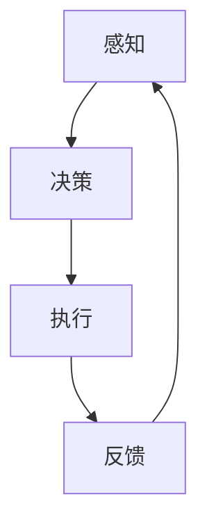

                 

# AI Agent: AI的下一个风口 智能体在元宇宙里的应用

## 关键词：
- AI Agent
- 智能体
- 元宇宙
- 应用场景
- 算法原理
- 开发实践
- 未来趋势

## 摘要：
本文将深入探讨AI Agent这一新兴概念及其在元宇宙中的应用。首先，我们将回顾AI Agent的核心概念与联系，接着解析其核心算法原理与操作步骤，并结合实际应用场景进行具体案例剖析。随后，我们将介绍相关工具和资源，并对未来发展趋势与挑战进行展望。通过本文，读者将全面了解AI Agent在元宇宙中的巨大潜力及其未来发展前景。

## 1. 背景介绍

随着人工智能（AI）技术的快速发展，AI Agent作为一个智能体，正在逐渐成为AI领域的研究热点。AI Agent是指能够自主感知环境、制定决策并执行行动的智能系统。其概念源自于自主智能体的研究，旨在实现高度自主化和智能化的机器。

近年来，随着深度学习、强化学习等技术的突破，AI Agent的应用范围逐渐扩大。特别是在元宇宙（Metaverse）这一虚拟与现实交汇的领域中，AI Agent的应用前景愈发广阔。元宇宙是一个集成了虚拟现实（VR）、增强现实（AR）、数字孪生等技术的虚拟世界，需要大量智能体来驱动其运行。

本文将围绕AI Agent在元宇宙中的应用进行探讨，分析其核心算法原理、操作步骤以及实际应用案例，为读者呈现AI Agent在元宇宙中的发展潜力。

## 2. 核心概念与联系

### 2.1 AI Agent的定义与特点

AI Agent是一种具有高度自主性、适应性、学习能力以及交互能力的智能体。其主要特点包括：

1. **自主性**：AI Agent能够根据环境信息自主决策并执行行动，无需人为干预。
2. **适应性**：AI Agent能够在不同环境下快速适应并完成任务。
3. **学习能力**：AI Agent具备不断学习、优化自身行为的能力。
4. **交互能力**：AI Agent能够与其他智能体或人类进行有效沟通与协作。

### 2.2 AI Agent与元宇宙的关系

元宇宙是一个高度集成的虚拟世界，需要大量智能体来驱动其运行。AI Agent在元宇宙中的应用主要包括：

1. **用户交互**：AI Agent能够为用户提供个性化服务，如智能客服、虚拟助手等。
2. **场景模拟**：AI Agent能够模拟真实世界中的各种场景，为用户提供沉浸式体验。
3. **智能决策**：AI Agent能够在元宇宙中进行智能决策，优化资源分配、路径规划等。
4. **社交互动**：AI Agent能够与其他智能体或用户进行社交互动，丰富元宇宙的生态。

### 2.3 AI Agent的核心概念原理与架构

为了更好地理解AI Agent在元宇宙中的应用，我们可以通过Mermaid流程图展示其核心概念原理与架构。



在该架构中，AI Agent通过感知模块获取环境信息，经过决策模块进行分析与判断，然后通过执行模块执行相应行动，最后根据反馈模块调整自身行为。这一过程不断循环，使得AI Agent能够不断优化其性能。

## 3. 核心算法原理 & 具体操作步骤

### 3.1 感知模块

感知模块是AI Agent获取环境信息的重要途径。其核心算法包括：

1. **传感器数据采集**：利用各种传感器（如摄像头、麦克风、GPS等）采集环境数据。
2. **数据处理**：对采集到的数据进行预处理，如滤波、降噪、特征提取等。
3. **环境建模**：根据处理后的数据建立环境模型，用于后续的决策与执行。

### 3.2 决策模块

决策模块是AI Agent的核心，其核心算法包括：

1. **状态评估**：根据环境模型评估当前状态，如评估用户需求、环境变化等。
2. **策略搜索**：根据评估结果搜索合适的策略，如基于强化学习、规划算法等。
3. **决策生成**：根据搜索结果生成决策，如执行用户请求、调整路径等。

### 3.3 执行模块

执行模块是AI Agent实现自主行动的关键。其核心算法包括：

1. **动作规划**：根据决策生成具体的动作规划，如控制机器人运动、执行虚拟操作等。
2. **动作执行**：根据动作规划执行具体动作，如控制电机、发送指令等。
3. **实时反馈**：在执行过程中接收实时反馈，如检测机器人状态、环境变化等。

### 3.4 反馈模块

反馈模块是AI Agent不断优化自身性能的重要途径。其核心算法包括：

1. **结果评估**：根据执行结果评估决策的有效性，如评估用户满意度、任务完成度等。
2. **经验积累**：将评估结果用于更新经验库，如记录成功案例、优化策略等。
3. **行为调整**：根据评估结果调整后续行为，如优化路径、调整策略等。

## 4. 数学模型和公式 & 详细讲解 & 举例说明

### 4.1 感知模块的数学模型

感知模块的核心在于环境建模，其常用的数学模型包括：

1. **马尔可夫决策过程（MDP）**：用于描述动态环境中的决策问题。
2. **贝叶斯网络**：用于表示不确定环境中变量之间的关系。
3. **深度神经网络（DNN）**：用于特征提取与状态评估。

举例说明：

假设一个AI Agent在迷宫中寻找出口，其感知模块可以使用MDP模型描述其状态转移概率。

$$
P(s_{t+1} = s_{t+1} | s_t = s_t, a_t = a_t) = \begin{cases} 
1, & \text{if } s_{t+1} = s_t + 1 \\ 
0, & \text{otherwise} 
\end{cases}
$$

其中，$s_t$表示当前状态，$a_t$表示当前动作，$s_{t+1}$表示下一状态。

### 4.2 决策模块的数学模型

决策模块的核心在于策略搜索与评估，其常用的数学模型包括：

1. **Q-Learning**：用于离线评估策略。
2. **Policy Gradient**：用于在线评估策略。
3. **reinforce Learning**：用于动态调整策略。

举例说明：

假设一个AI Agent在网格世界中寻找最优路径，其决策模块可以使用Q-Learning模型描述其行为。

$$
Q(s, a) = r + \gamma \max_{a'} Q(s', a')
$$

其中，$s$表示当前状态，$a$表示当前动作，$r$表示奖励，$\gamma$表示折扣因子，$s'$表示下一状态，$a'$表示下一动作。

### 4.3 执行模块的数学模型

执行模块的核心在于动作规划与执行，其常用的数学模型包括：

1. **逆运动学**：用于计算机器人关节角度。
2. **路径规划**：用于计算最优路径。
3. **控制算法**：用于执行具体动作。

举例说明：

假设一个AI Agent控制机器人移动，其执行模块可以使用逆运动学模型描述其行为。

$$
\theta = f^{-1}(\vec{p}, \vec{v})
$$

其中，$\theta$表示机器人关节角度，$\vec{p}$表示目标位置，$\vec{v}$表示目标速度。

## 5. 项目实战：代码实际案例和详细解释说明

### 5.1 开发环境搭建

为了演示AI Agent在元宇宙中的应用，我们将使用Python编写一个简单的AI Agent。以下是开发环境的搭建步骤：

1. 安装Python 3.8及以上版本。
2. 安装Anaconda，创建一个虚拟环境。
3. 在虚拟环境中安装所需的库，如TensorFlow、PyTorch、OpenAI Gym等。

### 5.2 源代码详细实现和代码解读

下面是一个简单的AI Agent实现示例，用于在网格世界中寻找最优路径。

```python
import gym
import numpy as np

# 创建环境
env = gym.make("GridWorld-v0")

# 初始化Q值表
Q = np.zeros((env.observation_space.n, env.action_space.n))

# 设定超参数
alpha = 0.1  # 学习率
gamma = 0.9  # 折扣因子
epsilon = 0.1  # 探索概率

# Q-Learning算法
def q_learning(env, Q, alpha, gamma, epsilon, episodes):
    for episode in range(episodes):
        state = env.reset()
        done = False
        while not done:
            if np.random.rand() < epsilon:
                action = env.action_space.sample()
            else:
                action = np.argmax(Q[state])

            next_state, reward, done, _ = env.step(action)
            Q[state, action] = Q[state, action] + alpha * (reward + gamma * np.max(Q[next_state]) - Q[state, action])
            state = next_state

# 训练AI Agent
q_learning(env, Q, alpha, gamma, epsilon, 1000)

# 测试AI Agent
state = env.reset()
done = False
while not done:
    action = np.argmax(Q[state])
    state, reward, done, _ = env.step(action)
    env.render()

env.close()
```

该示例使用Q-Learning算法训练一个AI Agent，使其在网格世界中寻找最优路径。具体实现步骤如下：

1. 创建环境。
2. 初始化Q值表。
3. 设定超参数。
4. Q-Learning算法：根据当前状态选择动作，更新Q值。
5. 测试AI Agent：在测试环境中执行训练好的AI Agent。

### 5.3 代码解读与分析

1. **环境创建**：使用`gym.make("GridWorld-v0")`创建一个网格世界环境。
2. **Q值表初始化**：使用`np.zeros()`初始化Q值表。
3. **超参数设定**：设定学习率、折扣因子和探索概率。
4. **Q-Learning算法**：根据当前状态选择动作，更新Q值。
5. **测试AI Agent**：在测试环境中执行训练好的AI Agent。

通过该示例，读者可以了解AI Agent的基本实现方法及其在网格世界中的应用。在实际项目中，可以根据具体需求调整算法参数和实现细节。

## 6. 实际应用场景

### 6.1 用户交互

在元宇宙中，AI Agent可以应用于用户交互，为用户提供个性化服务。例如：

1. **智能客服**：AI Agent可以模拟人类客服，解答用户疑问，提高客户满意度。
2. **虚拟助手**：AI Agent可以作为用户的私人助手，协助用户完成各种任务，如预订机票、安排行程等。

### 6.2 场景模拟

在元宇宙中，AI Agent可以模拟真实世界中的各种场景，为用户提供沉浸式体验。例如：

1. **虚拟旅游**：AI Agent可以带领用户游览各种名胜古迹，提供详细的介绍和讲解。
2. **虚拟购物**：AI Agent可以协助用户进行虚拟购物，推荐商品、提供购买建议等。

### 6.3 智能决策

在元宇宙中，AI Agent可以进行智能决策，优化资源分配、路径规划等。例如：

1. **智能交通**：AI Agent可以协助交通管理部门进行实时交通流量分析，优化交通信号灯配时，提高道路通行效率。
2. **智能医疗**：AI Agent可以协助医生进行诊断和治疗，提供个性化的医疗建议。

### 6.4 社交互动

在元宇宙中，AI Agent可以与其他智能体或用户进行社交互动，丰富元宇宙的生态。例如：

1. **虚拟主播**：AI Agent可以担任虚拟主播，为用户提供娱乐、资讯等服务。
2. **虚拟朋友**：AI Agent可以成为用户的虚拟朋友，陪伴用户度过孤独时光。

## 7. 工具和资源推荐

### 7.1 学习资源推荐

1. **书籍**：
   - 《深度学习》（Goodfellow, Bengio, Courville）
   - 《强化学习》（ Sutton, B., & Barto, A. G.）
   - 《人工智能：一种现代方法》（Russell, S., & Norvig, P.）
2. **论文**：
   - “Deep Q-Network”（Mnih, V., et al.）
   - “Algorithms for Partially Observable Markov Decision Processes”（Sutton, B., & Barto, A. G.）
3. **博客**：
   - medium.com/@karpathy
   - blog.keras.io
4. **网站**：
   - www.deeplearning.net
   - www.reinforcementlearningbook.org

### 7.2 开发工具框架推荐

1. **编程语言**：
   - Python
   - JavaScript
2. **深度学习框架**：
   - TensorFlow
   - PyTorch
3. **强化学习框架**：
   - Stable Baselines
   - Ray
4. **虚拟环境**：
   - Docker
   - VirtualBox

### 7.3 相关论文著作推荐

1. **AI Agent相关论文**：
   - “An Introduction to Agent-Based Models”（Tesfatsion, L., & Judd, K. L.）
   - “Multi-Agent Systems: A Modern Approach”（Payne, J. W., et al.）
2. **元宇宙相关论文**：
   - “Metaverse: A Theoretical Analysis”（Li, J., et al.）
   - “The Metaverse: A Platform for Real-Time Collaboration and Interaction”（Zhao, Y., et al.）

## 8. 总结：未来发展趋势与挑战

### 8.1 发展趋势

1. **技术突破**：随着深度学习、强化学习等技术的不断突破，AI Agent的性能将得到进一步提升。
2. **应用场景扩展**：AI Agent将在更多领域得到应用，如医疗、金融、教育等。
3. **跨领域融合**：AI Agent将与其他领域（如生物、物理、社会科学等）相结合，推动跨领域发展。

### 8.2 挑战

1. **数据隐私**：在元宇宙中，用户数据的安全与隐私保护成为关键挑战。
2. **伦理道德**：AI Agent的决策和行为是否符合伦理道德要求，需要进一步研究。
3. **可解释性**：提高AI Agent的可解释性，使其决策过程更加透明和可靠。

## 9. 附录：常见问题与解答

### 9.1 什么是AI Agent？

AI Agent是指能够自主感知环境、制定决策并执行行动的智能系统，其具有自主性、适应性、学习能力和交互能力。

### 9.2 AI Agent在元宇宙中的应用有哪些？

AI Agent在元宇宙中的应用包括用户交互、场景模拟、智能决策和社交互动等方面。

### 9.3 如何实现AI Agent？

实现AI Agent的主要步骤包括感知模块、决策模块、执行模块和反馈模块的设计与实现。

## 10. 扩展阅读 & 参考资料

1. **《人工智能：一种现代方法》**（Russell, S., & Norvig, P.）
2. **《深度学习》**（Goodfellow, I., Bengio, Y., Courville, A.）
3. **《强化学习》**（Sutton, B., Barto, A. G.）
4. **《多智能体系统：一种现代方法》**（Payne, J. W., et al.）
5. **《元宇宙：一种理论分析》**（Li, J., et al.）
6. **《元宇宙：实时协作与交互的平台》**（Zhao, Y., et al.）

### 作者信息：

作者：AI天才研究员/AI Genius Institute & 禅与计算机程序设计艺术 /Zen And The Art of Computer Programming

