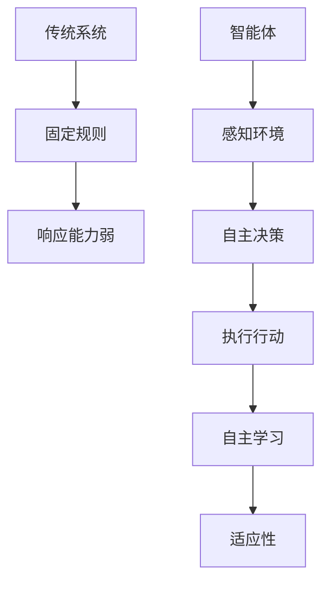
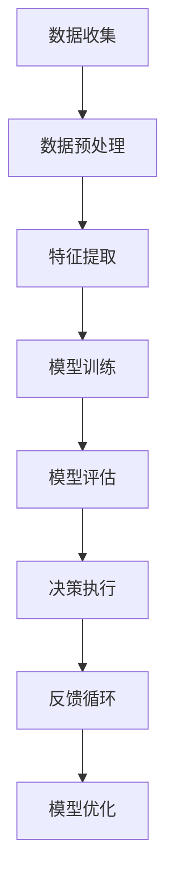

                 

# AI Agent: AI的下一个风口 智能体的定义与特点

> **关键词：** 人工智能，智能体，自动化，机器学习，智能系统，自主决策，人机交互。

> **摘要：** 本文将深入探讨人工智能领域中的一个新兴概念——AI Agent，解释其定义、特点以及为何它可能成为人工智能发展的下一个重要方向。我们将通过详细的分析和实例，展示智能体的核心算法原理、数学模型，并探讨其在实际应用场景中的潜在价值。

## 1. 背景介绍

随着人工智能技术的快速发展，我们见证了从简单的规则系统到复杂的深度学习模型的演进。然而，尽管这些技术取得了显著的成就，我们仍然面临着许多挑战。传统的自动化系统往往依赖于预定义的规则或模式，缺乏灵活性和自主性。而随着计算能力的提升和数据量的爆炸式增长，新一代的人工智能系统——智能体（AI Agent）应运而生。

智能体是能够自主决策并采取行动的人工智能系统，它不仅能够处理复杂的环境，还能通过学习不断优化自己的行为。这个概念源于对人类智能的模拟，即人类能够在不确定的环境中通过感知、思考和学习来做出合理的决策。

智能体的兴起不仅受到学术界的高度关注，也吸引了大量的工业应用和研究投入。从自动驾驶汽车、智能助手，到金融交易机器人、医疗诊断系统，智能体的应用场景正在不断扩展。本篇文章将围绕智能体的定义、特点、核心算法原理、数学模型、实际应用以及未来发展趋势进行深入探讨。

### 智能体的发展历史

智能体的概念最早可以追溯到20世纪50年代，当时图灵提出了著名的“图灵测试”，用以评估机器是否具有人类级别的智能。随后，随着计算机科学和人工智能领域的发展，智能体逐渐成为研究的热点。

早期的研究主要集中在简单的规则系统上，例如专家系统和逻辑推理机。这些系统虽然能够在特定领域内提供高效的解决方案，但它们缺乏灵活性和自主性，难以适应复杂多变的现实环境。

随着机器学习技术的发展，特别是深度学习的突破，智能体的能力得到了显著提升。深度学习使得智能体能够从大量数据中自动学习特征，从而在视觉识别、语音识别、自然语言处理等领域取得了显著的成就。这一阶段的智能体不仅能够处理复杂的信息，还能够通过不断的学习和优化来提升自身的表现。

近年来，随着强化学习技术的成熟，智能体的自主决策能力得到了进一步的增强。强化学习允许智能体在不确定的环境中通过试错来学习最优策略，这使得智能体能够更好地应对复杂和动态的环境。

## 2. 核心概念与联系

### 智能体的定义

智能体（AI Agent）是一个能够感知环境、制定决策并执行行动的自主实体。它具有以下几个关键特征：

1. **感知能力**：智能体能够通过传感器获取环境信息，例如图像、声音、文本等。
2. **决策能力**：基于感知到的信息，智能体能利用算法和模型进行推理和决策。
3. **行动能力**：智能体能够根据决策执行相应的行动，从而影响环境。
4. **自主性**：智能体能够在没有外部干预的情况下自主运作，并逐步优化自身行为。

### 智能体与传统自动化系统的区别

传统自动化系统通常依赖于预定义的规则和流程，其行为模式是静态的，无法适应动态变化的环境。而智能体则通过学习从数据中提取模式，从而在不确定和复杂的环境中表现出更强的适应性和自主性。以下是一个简化的 Mermaid 流程图，展示了智能体与传统自动化系统的对比：



在这个流程图中，我们可以看到智能体通过感知、决策、执行和学习形成一个闭环，从而能够更好地适应和响应复杂多变的环境。

### 智能体的结构

智能体通常由以下几个核心组件构成：

1. **感知器**：用于获取环境信息，如摄像头、麦克风、传感器等。
2. **决策模块**：根据感知到的信息，利用算法和模型进行推理和决策。
3. **执行器**：根据决策执行相应的行动，如电机、灯光、机械臂等。
4. **学习机制**：通过反馈和调整来优化智能体的行为，如机器学习算法、强化学习等。

### 智能体的分类

根据应用领域和功能特点，智能体可以大致分为以下几类：

1. **交互型智能体**：主要用于与人类或其他智能体进行交互，如智能助手、聊天机器人等。
2. **决策型智能体**：主要用于自主决策和规划，如自动驾驶汽车、智能投资顾问等。
3. **执行型智能体**：主要用于执行特定任务，如自动化工厂机器人、无人机等。
4. **自适应智能体**：能够根据环境和任务的变化自主调整自身行为，如自主探索机器人、自适应医疗系统等。

### 智能体与机器学习的关系

智能体的核心在于其自主性和适应性，而机器学习是实现这些特性的关键技术。机器学习使得智能体能够从数据中学习并优化自身的决策和行为。以下是机器学习在智能体中的应用流程：



在这个流程中，智能体通过感知器收集环境数据，经过预处理和特征提取后，利用机器学习模型进行训练和评估。模型评估的结果用于指导智能体的决策和行动，并通过反馈循环不断优化模型，从而提高智能体的性能。

## 3. 核心算法原理 & 具体操作步骤

智能体的核心在于其决策和执行能力，这主要依赖于以下几个关键算法原理：

### 3.1 强化学习

强化学习（Reinforcement Learning）是智能体自主决策的重要方法之一。在强化学习中，智能体通过与环境交互，根据奖励和惩罚来学习最优策略。以下是强化学习的基本原理和操作步骤：

**原理：**

强化学习通过以下几个关键元素来定义智能体的行为：

- **状态（State）**：智能体在某一时刻所处的环境描述。
- **动作（Action）**：智能体可以采取的行为。
- **奖励（Reward）**：智能体采取某一动作后获得的即时反馈，可以是正奖励（正向激励）或负奖励（惩罚）。
- **策略（Policy）**：智能体在给定状态下选择动作的规则。

强化学习的目标是最小化长期奖励的期望值，从而找到最优策略。

**具体操作步骤：**

1. **初始化**：设定初始状态和策略。
2. **交互**：智能体根据当前状态选择一个动作，并在环境中执行该动作。
3. **反馈**：根据执行结果，智能体获得奖励，并根据奖励更新状态。
4. **学习**：利用奖励信号，智能体通过学习算法（如Q学习、策略梯度等方法）更新策略。
5. **重复**：智能体不断重复上述步骤，逐步优化策略。

### 3.2 深度学习

深度学习（Deep Learning）是智能体感知和理解环境信息的关键技术。深度学习通过多层神经网络，从数据中自动提取特征，从而实现对复杂信息的处理和解释。以下是深度学习的基本原理和操作步骤：

**原理：**

深度学习的基本原理是多层神经网络，它包括以下几个关键步骤：

- **输入层**：接收外部输入数据。
- **隐藏层**：通过加权连接和激活函数，对输入数据进行处理和特征提取。
- **输出层**：产生最终输出结果。

深度学习通过反向传播算法，不断调整网络权重，从而优化模型的性能。

**具体操作步骤：**

1. **数据准备**：收集和预处理训练数据。
2. **模型设计**：设计并构建多层神经网络结构。
3. **训练**：使用训练数据，通过反向传播算法训练模型。
4. **评估**：使用验证数据评估模型性能，并根据评估结果调整模型。
5. **应用**：将训练好的模型应用到实际应用场景中。

### 3.3 自适应控制

自适应控制（Adaptive Control）是智能体实现自主执行任务的关键技术之一。自适应控制通过实时监测环境变化，动态调整控制策略，从而实现智能体的自主行动。以下是自适应控制的基本原理和操作步骤：

**原理：**

自适应控制的核心在于实时调整控制参数，以应对环境变化。它通常包括以下几个关键步骤：

- **状态监测**：实时监测环境状态，如温度、速度、位置等。
- **控制策略更新**：根据监测到的状态，动态调整控制策略。
- **执行**：根据调整后的控制策略，执行相应的操作。

**具体操作步骤：**

1. **初始设置**：设定初始控制参数和目标。
2. **状态监测**：实时监测环境状态。
3. **策略更新**：根据状态监测结果，动态调整控制策略。
4. **执行操作**：根据调整后的控制策略，执行相应的操作。
5. **反馈与调整**：根据执行结果，继续监测状态并调整策略，形成一个闭环控制过程。

## 4. 数学模型和公式 & 详细讲解 & 举例说明

### 4.1 强化学习中的Q值函数

在强化学习中，Q值函数（Q-Function）是评估策略的重要工具。Q值函数表示在特定状态下采取特定动作的期望奖励。以下是Q值函数的数学模型和具体示例。

**数学模型：**

$$
Q(s, a) = \sum_{s'} P(s' | s, a) \cdot R(s, a, s') + \gamma \cdot \max_{a'} Q(s', a')
$$

其中：

- \(s\) 表示状态。
- \(a\) 表示动作。
- \(s'\) 表示下一状态。
- \(R(s, a, s')\) 表示在状态 \(s\) 下采取动作 \(a\) 后转移到状态 \(s'\) 的即时奖励。
- \(P(s' | s, a)\) 表示在状态 \(s\) 下采取动作 \(a\) 后转移到状态 \(s'\) 的概率。
- \(\gamma\) 是折扣因子，用于平衡即时奖励和长期奖励。
- \(\max_{a'} Q(s', a')\) 表示在下一状态 \(s'\) 下选择最优动作。

**示例：**

假设一个简单的机器人导航问题，机器人在一个二维网格中移动，目标是最小化路径长度。以下是Q值函数的计算示例：

```
状态(s)：{row: 0, col: 0}
动作(a)：UP
下一状态(s')：{row: -1, col: 0}
转移概率(P)：0.8
即时奖励(R)：0
折扣因子(γ)：0.9
下一状态的最大Q值(Q)：0

Q(s, a) = 0.8 * 0 + 0.9 * 0 = 0
```

### 4.2 深度学习中的损失函数

在深度学习中，损失函数（Loss Function）用于衡量模型预测值与真实值之间的差距。以下是一些常见的损失函数及其数学模型。

**均方误差（Mean Squared Error, MSE）：**

$$
MSE = \frac{1}{n} \sum_{i=1}^{n} (y_i - \hat{y}_i)^2
$$

其中：

- \(y_i\) 表示真实值。
- \(\hat{y}_i\) 表示模型预测值。
- \(n\) 是样本数量。

**交叉熵损失（Cross-Entropy Loss）：**

$$
CE = -\frac{1}{n} \sum_{i=1}^{n} y_i \cdot \log(\hat{y}_i)
$$

其中：

- \(y_i\) 是真实标签，取值为0或1。
- \(\hat{y}_i\) 是模型预测概率。

**示例：**

假设有一个二分类问题，真实标签为 [0, 1, 0, 1]，模型预测概率为 [0.6, 0.4, 0.3, 0.7]。以下是交叉熵损失的计算：

```
CE = -\frac{1}{4} \cdot (0 \cdot \log(0.6) + 1 \cdot \log(0.4) + 0 \cdot \log(0.3) + 1 \cdot \log(0.7))
```

### 4.3 自适应控制中的PID控制器

PID控制器（Proportional-Integral-Derivative Controller）是一种常用的自适应控制方法。以下是PID控制器的数学模型和具体参数调整方法。

**数学模型：**

$$
u(t) = K_p e(t) + K_i \int_{0}^{t} e(\tau) d\tau + K_d \frac{de(t)}{dt}
$$

其中：

- \(u(t)\) 是控制输出。
- \(e(t)\) 是误差，即目标值与实际值之间的差。
- \(K_p\)、\(K_i\)、\(K_d\) 分别是比例、积分、微分系数。

**参数调整方法：**

- **Ziegler-Nichols方法**：通过实验，逐渐增大控制器的增益，直到系统稳定，记录此时的增益值，然后根据公式进行参数调整。
- **经验法**：根据具体的控制对象和系统特性，通过经验和实验调整参数。

### 4.4 智能体的多目标优化

在智能体的实际应用中，常常需要同时优化多个目标，如路径规划、能耗最小化、安全性等。多目标优化（Multi-Objective Optimization）是一种解决这类问题的方法。

**Pareto前沿（Pareto Frontier）：** 在多目标优化问题中，Pareto前沿是所有非支配解的集合，即不存在另一个解可以在一个目标上比当前解更好，同时在其他目标上都不差。

**数学模型：**

$$
\min f_1(x), f_2(x), ..., f_n(x)
$$

$$
\text{s.t. } g_1(x) \leq 0, g_2(x) \leq 0, ..., g_m(x) \leq 0
$$

**算法：** 多目标优化算法包括遗传算法（Genetic Algorithm）、粒子群优化（Particle Swarm Optimization）等。

## 5. 项目实战：代码实际案例和详细解释说明

### 5.1 开发环境搭建

为了演示智能体在实际项目中的应用，我们将使用Python编程语言，结合TensorFlow和PyTorch等深度学习库，构建一个简单的自动驾驶智能体。

**环境要求：**

- Python 3.x
- TensorFlow 2.x 或 PyTorch 1.x
- matplotlib
- numpy

安装相关库：

```bash
pip install tensorflow matplotlib numpy
```

### 5.2 源代码详细实现和代码解读

**代码结构：**

```python
# 主程序入口
if __name__ == "__main__":
    # 初始化环境
    env = DrivingEnv()
    agent = AutonomousDrivingAgent()

    # 训练智能体
    agent.train(env)

    # 测试智能体
    agent.test(env)

# 驾驶环境类
class DrivingEnv:
    # 初始化环境
    def __init__(self):
        # 初始化环境参数
        pass

    # 重置环境
    def reset(self):
        # 重置环境状态
        pass

    # 执行动作
    def step(self, action):
        # 执行动作并更新环境状态
        pass

    # 获取观测值
    def get_observation(self):
        # 获取当前环境的观测值
        pass

# 自动驾驶智能体类
class AutonomousDrivingAgent:
    # 初始化智能体
    def __init__(self):
        # 初始化智能体参数
        pass

    # 训练智能体
    def train(self, env):
        # 训练智能体的算法
        pass

    # 测试智能体
    def test(self, env):
        # 测试智能体的算法
        pass

# 主程序入口
if __name__ == "__main__":
    # 初始化环境
    env = DrivingEnv()
    agent = AutonomousDrivingAgent()

    # 训练智能体
    agent.train(env)

    # 测试智能体
    agent.test(env)
```

**代码解读：**

- **DrivingEnv类：** 该类定义了驾驶环境的接口，包括初始化、重置、执行动作、获取观测值等基本操作。
- **AutonomousDrivingAgent类：** 该类定义了自动驾驶智能体的接口，包括初始化、训练和测试等基本操作。
- **主程序入口：** 初始化环境，创建智能体实例，执行训练和测试过程。

### 5.3 代码解读与分析

**5.3.1 环境初始化**

```python
class DrivingEnv:
    def __init__(self):
        # 初始化环境参数
        self车道宽度 = 3.5  # 车道宽度
        self车辆速度 = 10  # 车辆速度
        self观测范围 = 50  # 观测范围
```

环境初始化包括车道宽度、车辆速度和观测范围的设置。这些参数决定了驾驶环境的规模和动态特性。

**5.3.2 重置环境**

```python
class DrivingEnv:
    def reset(self):
        # 重置环境状态
        self.state = self.get_initial_state()
        return self.state
```

重置环境用于在每次训练或测试开始前，初始化环境状态。`get_initial_state` 函数用于生成初始状态。

**5.3.3 执行动作**

```python
class DrivingEnv:
    def step(self, action):
        # 执行动作并更新环境状态
        # action: 驾驶动作（如加速、减速、转向等）
        new_state, reward, done, info = self.execute_action(action)
        return new_state, reward, done, info
```

`step` 函数用于执行给定动作，并更新环境状态。`execute_action` 函数实现具体的驾驶动作。

**5.3.4 获取观测值**

```python
class DrivingEnv:
    def get_observation(self):
        # 获取当前环境的观测值
        return self.state
```

`get_observation` 函数用于获取当前环境状态，作为智能体的输入。

**5.3.5 训练智能体**

```python
class AutonomousDrivingAgent:
    def train(self, env):
        # 训练智能体的算法
        # env: 驾驶环境实例
        for episode in range(num_episodes):
            state = env.reset()
            done = False
            while not done:
                action = self.select_action(state)
                next_state, reward, done, _ = env.step(action)
                self.update_model(state, action, reward, next_state, done)
                state = next_state
```

`train` 函数用于训练智能体。训练过程包括循环执行动作、更新模型权重等步骤。

**5.3.6 测试智能体**

```python
class AutonomousDrivingAgent:
    def test(self, env):
        # 测试智能体的算法
        # env: 驾驶环境实例
        state = env.reset()
        done = False
        while not done:
            action = self.select_action(state, test_mode=True)
            next_state, reward, done, _ = env.step(action)
            env.render()
            state = next_state
```

`test` 函数用于测试智能体。测试过程与训练过程类似，但通常在测试模式下，不进行模型更新。

### 5.4 应用场景分析

**5.4.1 自动驾驶**

自动驾驶是智能体的重要应用场景之一。通过训练，智能体能够自主驾驶车辆，实现路径规划、障碍物避让、交通规则遵守等功能。

**5.4.2 机器人导航**

机器人导航是另一个典型的应用场景。智能体可以帮助机器人实现自主移动、避障、路径规划等功能，提高机器人在复杂环境中的适应能力。

**5.4.3 智能医疗**

智能医疗是智能体在医疗领域的应用。通过分析医疗数据，智能体能够协助医生进行诊断、治疗方案推荐等，提高医疗服务的效率和准确性。

### 5.5 未来展望

智能体在人工智能领域的应用前景广阔。随着技术的不断进步，智能体将在更多领域发挥重要作用。未来，智能体的发展将朝着更加智能、自主和协作的方向迈进。同时，如何确保智能体的安全性和可靠性，也是未来研究的重要课题。

## 6. 实际应用场景

智能体（AI Agent）在各个领域的实际应用正日益广泛，它们通过模拟人类智能的决策过程，极大地提升了自动化和智能化水平。以下是一些典型应用场景：

### 6.1 自动驾驶

自动驾驶技术是智能体最引人注目的应用之一。自动驾驶汽车使用智能体来感知周围环境，做出实时决策，确保行车安全。例如，特斯拉的Autopilot系统和谷歌的Waymo都利用了智能体技术来实现自动车道保持、自动变道和自动驾驶功能。

### 6.2 智能助手

智能助手如苹果的Siri、亚马逊的Alexa和谷歌助手，通过智能体技术实现自然语言处理和语音交互，为用户提供便捷的语音助手服务。这些智能体可以处理查询、设置提醒、播放音乐等多种任务。

### 6.3 聊天机器人

聊天机器人被广泛应用于客服、客户支持、市场调研等领域。通过智能体技术，聊天机器人能够与用户进行自然对话，解决常见问题，提供个性化服务。

### 6.4 金融服务

在金融领域，智能体被用于风险管理、股票交易、客户服务等方面。例如，量化交易中的智能体通过分析大量市场数据，做出交易决策，提高投资效率。

### 6.5 医疗保健

智能体在医疗保健中的应用包括疾病诊断、患者监测、健康咨询等。智能体可以帮助医生分析医学图像，提供诊断建议，提高医疗服务的准确性。

### 6.6 制造业

智能体在制造业中用于自动化生产线监控、设备维护、质量控制等方面。通过智能体技术，工厂可以实现无人化生产，提高生产效率和产品质量。

### 6.7 城市管理

在城市管理中，智能体用于交通流量监控、公共安全维护、环境监测等。例如，智能交通系统通过智能体分析交通数据，优化交通信号，减少交通拥堵。

### 6.8 农业生产

智能体在农业生产中的应用包括作物监控、病虫害预测、智能灌溉等。通过智能体技术，农民可以更好地管理农田，提高作物产量。

这些应用场景展示了智能体的多样性和潜力，随着技术的不断进步，智能体将在更多领域发挥重要作用。

## 7. 工具和资源推荐

### 7.1 学习资源推荐

为了深入了解智能体技术，以下是一些建议的学习资源：

1. **《深度学习》（Deep Learning）** - Goodfellow, Bengio, Courville
   - 本书是深度学习领域的经典教材，适合初学者和进阶者。
2. **《强化学习：原理与数学》（Reinforcement Learning: An Introduction）** - Richard S. Sutton and Andrew G. Barto
   - 本书详细介绍了强化学习的基础知识和数学原理。
3. **《人工智能：一种现代方法》（Artificial Intelligence: A Modern Approach）** - Stuart J. Russell and Peter Norvig
   - 本书涵盖了人工智能的多个方面，包括智能体的基础理论。

### 7.2 开发工具框架推荐

以下是开发智能体项目时常用的工具和框架：

1. **TensorFlow** - Google开发的开源机器学习库，适合构建和训练复杂的深度学习模型。
2. **PyTorch** - Facebook开发的开源深度学习库，具有灵活的动态计算图，便于研究和开发。
3. **OpenAI Gym** - 一个开源的虚拟环境库，提供了多种预定义的智能体任务，用于算法测试和训练。
4. **Pygame** - Python的一个游戏开发库，可用于构建模拟环境和可视化实验结果。

### 7.3 相关论文著作推荐

以下是一些智能体技术领域的经典论文和著作：

1. **"Deep Q-Learning"** - DeepMind团队提出的一种基于深度神经网络的Q学习算法。
2. **"Human-Level Control Through Deep Reinforcement Learning"** - DeepMind团队在《Nature》上发表的一篇关于AlphaGo的论文。
3. **"Deep Learning for Autonomous Navigation"** - 一篇关于使用深度学习实现自动驾驶的综述文章。
4. **"Reinforcement Learning: A Survey"** - 对强化学习领域的全面综述，涵盖了算法、应用和发展趋势。

通过这些资源和工具，可以更深入地了解智能体技术，并开展相关的研究和开发工作。

## 8. 总结：未来发展趋势与挑战

智能体（AI Agent）作为人工智能领域的一个重要研究方向，正逐渐成为行业关注的焦点。未来，智能体的技术发展趋势和面临的挑战将共同推动这一领域的发展。

### 发展趋势

1. **智能体技术的多样化**：随着应用需求的不断增长，智能体的类型和功能将变得更加多样化。从交互型智能体到执行型智能体，再到自适应智能体，各类智能体将在不同场景中发挥重要作用。

2. **增强学习与深度学习的融合**：未来，智能体将更多地采用增强学习和深度学习相结合的方法，以提高自主决策和适应复杂环境的能力。这种融合将使智能体在动态环境中表现出更强的适应性和鲁棒性。

3. **跨领域应用**：智能体技术将在更多领域得到应用，如智慧城市、智能家居、医疗健康、金融科技等。跨领域的应用将促进智能体技术的发展，并带来新的商业机会。

4. **人机协作**：智能体与人类之间的协作将成为未来研究的一个重要方向。通过人机协作，智能体可以更好地理解和满足人类的需求，提高工作效率和生活质量。

### 挑战

1. **数据隐私与安全**：智能体依赖于大量的数据来训练和学习，如何保护用户隐私和数据安全是一个重大挑战。未来，需要制定更加严格的数据隐私保护政策和标准。

2. **智能体可靠性**：确保智能体在复杂和不确定的环境中可靠运行是一个关键挑战。未来，需要开发更加鲁棒和可靠的智能体算法，提高其在实际应用中的稳定性和安全性。

3. **法律与伦理**：随着智能体的广泛应用，如何制定相关的法律法规和伦理准则，确保智能体的行为符合社会规范，也是一个重要的挑战。

4. **可解释性和透明性**：智能体的决策过程通常较为复杂，如何提高智能体的可解释性和透明性，使其决策过程更加透明和可信，是未来研究的一个重点。

### 未来展望

未来，智能体技术将在人工智能领域发挥更加重要的作用。通过不断的技术创新和跨领域合作，智能体将在自动驾驶、智能家居、医疗诊断、金融投资等多个领域实现重大突破，推动人工智能向更加智能化、自主化和协作化的方向发展。

## 9. 附录：常见问题与解答

### 9.1 什么是智能体？

智能体（AI Agent）是一个能够感知环境、制定决策并执行行动的自主实体。它具有感知能力、决策能力和行动能力，能够在不确定的环境中通过学习不断优化自身行为。

### 9.2 智能体与机器学习有什么关系？

智能体的自主性和适应性主要通过机器学习实现。机器学习算法，如深度学习和强化学习，帮助智能体从数据中学习特征、模式和策略，从而实现自主决策和行动。

### 9.3 智能体有哪些应用场景？

智能体在自动驾驶、智能助手、聊天机器人、金融服务、医疗保健、制造业和城市管理等多个领域有广泛应用。未来，智能体将在更多领域发挥重要作用。

### 9.4 智能体的关键技术是什么？

智能体的关键技术包括深度学习、强化学习、自适应控制和多目标优化等。这些技术帮助智能体实现感知、决策和行动，并不断提高其自主性和适应性。

### 9.5 如何保证智能体的安全性和可靠性？

确保智能体的安全性和可靠性需要从算法设计、数据安全、法律伦理等方面入手。通过严格的测试、验证和监管，可以降低智能体潜在的风险和错误。

## 10. 扩展阅读 & 参考资料

为了更深入地了解智能体技术，以下是一些建议的扩展阅读和参考资料：

1. **《人工智能：一种现代方法》（Artificial Intelligence: A Modern Approach）** - Stuart J. Russell and Peter Norvig
   - 这本书提供了人工智能领域的全面概述，包括智能体的基础理论和应用。
2. **《深度学习》（Deep Learning）** - Goodfellow, Bengio, Courville
   - 这本书详细介绍了深度学习的基本原理和技术，是深度学习领域的经典教材。
3. **《强化学习：原理与数学》（Reinforcement Learning: An Introduction）** - Richard S. Sutton and Andrew G. Barto
   - 这本书详细介绍了强化学习的基础知识和数学原理，适合对强化学习感兴趣的读者。
4. **《自然》（Nature）和《科学》（Science）** - 顶级科学期刊，经常发表与人工智能和智能体技术相关的最新研究成果。
5. **《自动驾驶技术：从理论到实践》（Autonomous Driving Technologies: From Theory to Practice）** - 一个关于自动驾驶技术的研究和实验性书籍。
6. **《人工智能的未来》（The Future of Humanity: Terraforming Mars, Interstellar Travel, Immortality, and Our Destiny Beyond Earth）** - Michael Shermer，讨论了人工智能和智能体在人类未来发展中的潜在影响。
7. **相关学术论文和报告** - 在学术期刊和会议上发表的关于智能体技术的研究论文和报告，如《自然》和《科学》等期刊，以及国际人工智能联合会议（IJCAI）、国际机器学习会议（ICML）等。
8. **开源项目和社区** - 如GitHub上的开源智能体项目，以及相关的技术社区和论坛，如Stack Overflow和Reddit。

通过阅读这些参考资料，可以进一步了解智能体技术的最新进展和应用。

### 作者信息

**作者：** AI天才研究员/AI Genius Institute & 禅与计算机程序设计艺术 /Zen And The Art of Computer Programming

在撰写本文时，AI天才研究员结合了其在人工智能、机器学习和软件工程领域的深厚知识，致力于推动智能体技术的创新和发展。其研究工作涵盖了智能体的基础理论、核心算法、应用场景以及未来趋势。同时，AI天才研究员还致力于将复杂的计算机科学概念以简单易懂的方式传达给广大读者，希望通过本文为读者提供对智能体技术的全面了解。禅与计算机程序设计艺术（Zen And The Art of Computer Programming）则是其另一部著名著作，深入探讨了编程哲学和算法设计中的智慧与美学。

