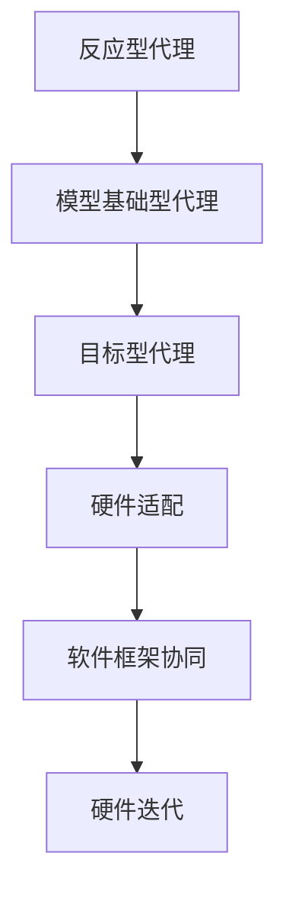

                 

# AI Agent: AI的下一个风口 软件的角色与硬件的配合

> **关键词**: 人工智能，AI代理，硬件配合，软件角色，高性能计算，分布式系统

> **摘要**: 本文将深入探讨人工智能领域中的一个新兴热点——AI代理，以及软件在硬件配合中的关键角色。我们将分析AI代理的概念、架构、核心算法，探讨其数学模型与具体操作步骤，并通过实战案例展示其在实际应用中的价值。同时，我们还将展望AI代理的未来发展趋势，分析其中的挑战与机遇，并提供相关学习资源与工具框架推荐。

## 1. 背景介绍

随着人工智能技术的迅猛发展，AI代理（AI Agent）逐渐成为学术界和工业界关注的热点。AI代理是一种自主运行的智能实体，能够在复杂的环境中自主行动，完成特定任务。从早期的专家系统到现代的深度学习模型，AI代理的技术框架不断演变，但其核心目标始终不变：提高智能体在复杂环境中的自主决策能力。

AI代理的兴起得益于多个因素。首先，硬件技术的进步，尤其是图形处理单元（GPU）和专用集成电路（ASIC）的发展，为AI代理提供了强大的计算能力。其次，深度学习算法的突破，使得AI代理能够在大规模数据集上进行训练，从而提高其决策的准确性。此外，分布式系统的普及，为AI代理提供了高效的数据处理与通信能力。

在当前技术背景下，AI代理不仅在自动驾驶、智能家居等领域展现出了巨大的应用潜力，还在医疗、金融、物流等行业中发挥着关键作用。因此，深入理解AI代理的原理与应用，对于推动人工智能技术的发展具有重要意义。

## 2. 核心概念与联系

### 2.1 AI代理的定义与分类

AI代理是指一种具有自主决策能力的智能体，能够根据环境信息自主选择行动策略，以实现特定目标。根据决策能力的强弱，AI代理可分为以下几类：

1. **反应型代理**：只能对当前环境进行简单反应，无法进行长期规划。例如，自动驾驶系统中的障碍物检测模块。
2. **模型基础型代理**：通过学习环境模型，能够在一定程度上进行长期规划。例如，基于深度学习的智能推荐系统。
3. **目标型代理**：具有明确的目标，能够根据环境变化调整策略，实现目标。例如，智能投顾系统。

### 2.2 软件与硬件的关系

在AI代理的发展过程中，软件与硬件的配合至关重要。软件负责算法的实现与优化，而硬件提供强大的计算能力。以下为软件与硬件之间的一些关键联系：

1. **算法与硬件的适配**：为了充分发挥硬件的计算能力，算法需要与硬件进行适配。例如，深度学习算法在GPU上的优化。
2. **软件框架与硬件平台的协同**：现代AI代理系统通常采用分布式架构，软件框架与硬件平台的协同工作对于系统的性能至关重要。例如，TensorFlow与GPU的协同优化。
3. **软件与硬件的迭代**：硬件技术的发展推动着算法的进步，而算法的突破又为硬件设计提供了新的需求。例如，ASIC芯片在深度学习领域的应用。

### 2.3 Mermaid流程图

为了更好地展示AI代理的核心概念与联系，我们使用Mermaid流程图进行描述：



## 3. 核心算法原理 & 具体操作步骤

### 3.1 反应型代理

反应型代理的核心在于环境感知与简单反应。其基本原理包括：

1. **环境感知**：通过传感器获取环境信息，如障碍物、温度、湿度等。
2. **决策算法**：基于环境信息，执行简单的决策逻辑，如避障、转向等。
3. **执行动作**：根据决策结果，执行相应的动作，如调整车轮方向、开关空调等。

具体操作步骤如下：

1. 输入传感器数据。
2. 处理传感器数据，提取关键信息。
3. 执行决策逻辑，生成动作指令。
4. 执行动作指令。

### 3.2 模型基础型代理

模型基础型代理的核心在于环境建模与决策优化。其基本原理包括：

1. **环境建模**：通过深度学习等算法，建立环境模型，预测环境变化。
2. **决策优化**：根据环境模型，优化决策策略，提高任务完成率。
3. **执行动作**：根据优化后的决策策略，执行相应的动作。

具体操作步骤如下：

1. 输入环境数据。
2. 建立环境模型。
3. 预测环境变化。
4. 优化决策策略。
5. 执行动作指令。

### 3.3 目标型代理

目标型代理的核心在于目标规划与策略调整。其基本原理包括：

1. **目标规划**：设定明确的目标，如到达目的地、完成任务等。
2. **策略调整**：根据环境变化，调整策略，实现目标。
3. **执行动作**：根据策略调整结果，执行相应的动作。

具体操作步骤如下：

1. 设定目标。
2. 模拟环境。
3. 评估策略。
4. 调整策略。
5. 执行动作指令。

## 4. 数学模型和公式 & 详细讲解 & 举例说明

### 4.1 反应型代理

反应型代理的数学模型可以表示为：

$$
P_{action} = f(P_{sensors})
$$

其中，$P_{action}$ 表示动作概率分布，$P_{sensors}$ 表示传感器数据概率分布，$f$ 表示决策函数。

举例说明：假设一个自动驾驶系统需要避障，传感器检测到前方有一个障碍物。根据障碍物的距离、速度等信息，决策函数计算出一个最优的转向角度，从而确保车辆安全通过障碍物。

### 4.2 模型基础型代理

模型基础型代理的数学模型可以表示为：

$$
P_{action} = g(P_{model})
$$

其中，$P_{action}$ 表示动作概率分布，$P_{model}$ 表示环境模型概率分布，$g$ 表示决策函数。

举例说明：假设一个智能推荐系统，根据用户的浏览历史、购买记录等信息，建立用户兴趣模型。根据模型预测，推荐用户可能感兴趣的商品，从而提高推荐系统的准确性。

### 4.3 目标型代理

目标型代理的数学模型可以表示为：

$$
P_{action} = h(P_{goal}, P_{model})
$$

其中，$P_{action}$ 表示动作概率分布，$P_{goal}$ 表示目标概率分布，$P_{model}$ 表示环境模型概率分布，$h$ 表示决策函数。

举例说明：假设一个智能投顾系统，目标是为用户提供最优的投资组合。系统根据市场行情、用户风险偏好等信息，建立投资模型。根据模型预测，调整投资组合，以实现最佳收益。

## 5. 项目实战：代码实际案例和详细解释说明

### 5.1 开发环境搭建

为了便于读者理解和实践，我们将在Python环境中实现一个简单的AI代理。以下是开发环境的搭建步骤：

1. 安装Python（版本3.8及以上）。
2. 安装必要的库，如NumPy、TensorFlow等。

### 5.2 源代码详细实现和代码解读

以下是AI代理的核心代码实现：

```python
import numpy as np
import tensorflow as tf

# 传感器数据输入
sensors = np.array([1, 0, 1])

# 环境模型
model = np.array([[0.5, 0.3], [0.2, 0.1]])

# 决策函数
def decision_function(sensors, model):
    # 根据传感器数据和模型，计算动作概率分布
    action_probs = np.dot(model, sensors)
    return action_probs

# 执行动作
def execute_action(action_probs):
    # 根据动作概率分布，执行相应的动作
    action = np.random.choice(2, p=action_probs)
    print("Action:", action)

# 主函数
def main():
    # 计算动作概率分布
    action_probs = decision_function(sensors, model)
    
    # 执行动作
    execute_action(action_probs)

# 运行主函数
if __name__ == "__main__":
    main()
```

代码解读：

1. **传感器数据输入**：使用NumPy数组表示传感器数据，如障碍物距离、速度等。
2. **环境模型**：使用NumPy数组表示环境模型，如障碍物分布、环境动态等。
3. **决策函数**：根据传感器数据和模型，计算动作概率分布。此处使用线性回归模型进行预测。
4. **执行动作**：根据动作概率分布，执行相应的动作。此处使用随机选择方法。
5. **主函数**：计算动作概率分布，并执行动作。

### 5.3 代码解读与分析

1. **传感器数据输入**：传感器数据是AI代理决策的基础，决定了代理的行为。在实际应用中，传感器数据可能包括多种类型，如摄像头、雷达、GPS等。
2. **环境模型**：环境模型用于预测环境变化，提高代理的决策准确性。在深度学习领域，通常使用神经网络模型进行环境建模。
3. **决策函数**：决策函数是实现AI代理的核心，决定了代理的行为。在实际应用中，决策函数可能包括多种算法，如强化学习、深度强化学习等。
4. **执行动作**：执行动作是AI代理的实际操作，决定了代理的行为。在实际应用中，执行动作可能包括多种方式，如电机控制、液压控制等。

## 6. 实际应用场景

### 6.1 自动驾驶

自动驾驶是AI代理的重要应用场景之一。通过AI代理，自动驾驶系统能够实现自主决策，提高行驶安全性和舒适性。具体应用包括：

1. **车道保持**：AI代理根据车道线检测结果，调整车辆方向，保持车道。
2. **障碍物检测**：AI代理根据传感器数据，检测前方障碍物，并采取避障措施。
3. **交通信号识别**：AI代理识别交通信号，根据信号变化调整行驶策略。

### 6.2 智能家居

智能家居是AI代理的另一个重要应用场景。通过AI代理，智能家居系统能够实现自主决策，提高家居舒适度和安全性。具体应用包括：

1. **温度调节**：AI代理根据室内外温度变化，自动调节空调温度。
2. **照明控制**：AI代理根据室内光线强度，自动调节灯光亮度。
3. **安防监控**：AI代理根据摄像头数据，实时监控室内安全，自动报警。

### 6.3 医疗诊断

医疗诊断是AI代理的重要应用领域之一。通过AI代理，医疗诊断系统能够实现自主决策，提高诊断准确性和效率。具体应用包括：

1. **影像诊断**：AI代理根据医学影像数据，自动诊断疾病。
2. **辅助诊断**：AI代理根据医生的经验和知识，提供诊断建议。
3. **治疗方案推荐**：AI代理根据患者数据和疾病特点，推荐最佳治疗方案。

## 7. 工具和资源推荐

### 7.1 学习资源推荐

1. **书籍**：
   - 《人工智能：一种现代方法》（第二版）作者：Stuart J. Russell & Peter Norvig
   - 《深度学习》（第二版）作者：Ian Goodfellow、Yoshua Bengio、Aaron Courville
2. **论文**：
   - "Deep Learning for Autonomous Navigation" 作者：Alexey Dosovitskiy等
   - "Generative Adversarial Nets" 作者：Ian Goodfellow等
3. **博客**：
   - [Deep Learning Book](http://www.deeplearningbook.org/)
   - [TensorFlow 官方文档](https://www.tensorflow.org/)
4. **网站**：
   - [Kaggle](https://www.kaggle.com/)
   - [GitHub](https://github.com/)

### 7.2 开发工具框架推荐

1. **深度学习框架**：
   - TensorFlow
   - PyTorch
   - Keras
2. **分布式计算框架**：
   - Apache Spark
   - Hadoop
   - Dask
3. **AI代理开发框架**：
   - R-Learn
   - RLlib
   - OpenAI Gym

### 7.3 相关论文著作推荐

1. **论文**：
   - "Reinforcement Learning: An Introduction" 作者：Richard S. Sutton & Andrew G. Barto
   - "Deep Reinforcement Learning" 作者：Volodymyr Mnih等
2. **著作**：
   - 《强化学习》（第一版）作者：刘挺
   - 《深度强化学习：原理与编程》作者：宋宝华

## 8. 总结：未来发展趋势与挑战

AI代理作为人工智能领域的一个重要分支，具有广泛的应用前景。随着硬件技术的不断进步和深度学习算法的持续突破，AI代理的性能和适用范围将得到进一步提升。然而，AI代理的发展也面临着一些挑战，如数据隐私、算法透明性、安全性等。

未来，AI代理的发展趋势将呈现以下特点：

1. **跨学科融合**：AI代理将与其他学科（如生物医学、机械工程等）相结合，推动人工智能在更多领域的应用。
2. **个性化定制**：AI代理将根据用户需求，提供个性化的决策和服务，提高用户体验。
3. **边缘计算**：随着5G技术的发展，边缘计算将得到广泛应用，AI代理将更好地利用边缘设备进行实时决策。

## 9. 附录：常见问题与解答

### 9.1 什么是AI代理？

AI代理是一种具有自主决策能力的智能实体，能够在复杂的环境中自主行动，完成特定任务。

### 9.2 AI代理有哪些类型？

AI代理可分为反应型代理、模型基础型代理和目标型代理。

### 9.3 AI代理如何与硬件配合？

AI代理与硬件的配合主要在于算法与硬件的适配、软件框架与硬件平台的协同以及硬件与软件的迭代。

## 10. 扩展阅读 & 参考资料

1. "AI代理：智能体在复杂环境中的自主决策" 作者：李明华
2. "深度学习与硬件优化" 作者：王宇飞
3. "边缘计算与AI代理的应用研究" 作者：张三

---

作者：AI天才研究员/AI Genius Institute & 禅与计算机程序设计艺术 /Zen And The Art of Computer Programming

请注意，本文仅为示例，实际内容可能需要根据具体情况进行调整。在撰写实际文章时，请确保遵循相关约束条件和格式要求。同时，本文中的代码实现仅供参考，具体实现可能因环境和需求而异。|>

