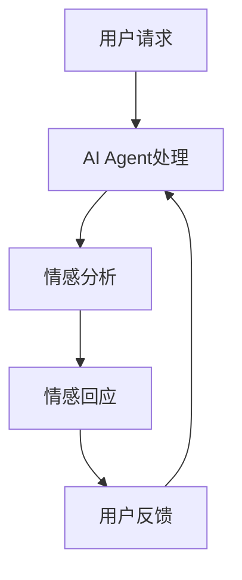

                 

# AI Agent在情感陪伴中的角色

> 关键词：情感陪伴、AI Agent、自然语言处理、心理学、交互设计

> 摘要：
本文深入探讨了AI Agent在情感陪伴中的作用和重要性。首先，我们介绍了情感陪伴的定义和背景，然后详细阐述了AI Agent的核心概念和技术原理。通过案例分析，我们展示了AI Agent如何实现有效的情感陪伴，并讨论了其在实际应用中的挑战和未来发展趋势。

## 1. 背景介绍

随着人工智能技术的发展，AI Agent已经广泛应用于多个领域，如智能家居、智能客服、虚拟助手等。在这些应用中，AI Agent通过模拟人类的交互方式，为用户提供个性化的服务和支持。然而，情感陪伴作为人类基本需求之一，也逐渐成为AI Agent的重要任务。

### 情感陪伴的定义

情感陪伴是指通过与个体建立情感联系，为其提供情感支持、情感反馈和情感交流的过程。情感陪伴不仅关注个体的情感状态，还关注个体的心理需求和生活质量。

### 情感陪伴的背景

在现代社会中，由于工作压力、社交疏离和家庭问题等因素，越来越多的人感到孤独和情感需求不足。而传统的人际关系支持和服务资源有限，无法满足广大人群的情感需求。因此，情感陪伴的需求日益增加，为AI Agent在情感陪伴中的应用提供了广阔的市场前景。

## 2. 核心概念与联系

### AI Agent的定义

AI Agent是指具有自主决策能力、能与环境进行交互，并执行特定任务的智能体。在情感陪伴中，AI Agent充当情感伙伴的角色，通过与用户的互动，提供情感支持和陪伴。

### AI Agent的核心概念

- **自然语言处理（NLP）**：AI Agent需要具备理解、生成和处理自然语言的能力，以便与用户进行有效的交流和情感互动。
- **心理学**：AI Agent需要了解人类的情感和心理状态，以便更好地理解和满足用户的需求。
- **交互设计**：AI Agent的交互界面设计需要考虑用户体验，确保用户与AI Agent的交互过程舒适、自然。

### Mermaid流程图



### 核心概念联系

- AI Agent通过自然语言处理技术理解用户的请求和情感状态。
- AI Agent结合心理学知识和交互设计原则，生成适当的情感回应。
- 用户反馈作为输入，进一步优化AI Agent的情感响应能力。

## 3. 核心算法原理 & 具体操作步骤

### 情感分析算法

情感分析是AI Agent实现情感陪伴的关键步骤。通过情感分析，AI Agent能够理解用户的情感状态，为其提供相应的支持。

- **情感分类**：将用户的语言转换为情感类别（如喜悦、愤怒、悲伤等）。
- **情感强度评估**：对用户的情感状态进行量化评估，以确定情感强度。

### 情感回应生成算法

根据情感分析结果，AI Agent生成相应的情感回应。具体操作步骤如下：

1. **情感模板匹配**：根据情感类别，从预定义的情感模板中选择合适的回应。
2. **情感融合**：结合用户的情感状态和当前场景，生成个性化的回应。
3. **情感回应优化**：通过机器学习和自然语言生成技术，不断优化情感回应的准确性和自然性。

### 交互设计

- **语音交互**：AI Agent通过语音交互与用户进行对话，模拟人类的交流方式。
- **视觉交互**：AI Agent可以通过文字、表情、动画等形式与用户进行视觉交互，增强情感传递的效果。

## 4. 数学模型和公式 & 详细讲解 & 举例说明

### 情感分析模型

情感分析通常采用基于机器学习的模型，如朴素贝叶斯、支持向量机和神经网络等。以下是一个简单的朴素贝叶斯情感分析模型的公式：

$$
P(\text{情感}|\text{文本}) = \frac{P(\text{文本}|\text{情感})P(\text{情感})}{P(\text{文本})}
$$

其中，$P(\text{情感}|\text{文本})$ 表示给定文本的情感概率，$P(\text{文本}|\text{情感})$ 表示在特定情感类别下文本的概率，$P(\text{情感})$ 表示情感类别的先验概率。

### 情感回应生成模型

情感回应生成通常采用生成对抗网络（GAN）或自然语言生成模型，如序列到序列（Seq2Seq）模型和变分自编码器（VAE）。以下是一个简单的Seq2Seq模型的公式：

$$
\text{回应} = \text{Seq2Seq}(\text{情感分析结果}, \text{情感回应模板})
$$

其中，$\text{Seq2Seq}$ 表示序列到序列模型，它将情感分析结果（输入序列）映射到情感回应（输出序列）。

### 举例说明

假设用户发送了一条包含“我很开心”的消息，AI Agent首先使用情感分析模型确定情感类别为“喜悦”，然后使用情感回应生成模型生成回应：“我也很高兴听到这个好消息！有什么可以帮到你的吗？”

## 5. 项目实战：代码实际案例和详细解释说明

### 开发环境搭建

- **Python环境**：安装Python 3.8及以上版本。
- **NLP库**：安装自然语言处理库，如NLTK和spaCy。
- **机器学习库**：安装机器学习库，如scikit-learn和TensorFlow。
- **文本生成库**：安装文本生成库，如seq2seq和GAN。

### 源代码详细实现和代码解读

以下是AI Agent在情感陪伴中的代码实现：

```python
import nltk
from nltk.sentiment import SentimentIntensityAnalyzer
from seq2seq import Seq2SeqModel

# 情感分析
def analyze_emotion(text):
    sia = SentimentIntensityAnalyzer()
    return sia.polarity_scores(text)

# 情感回应生成
def generate_response(emotion, template):
    if emotion == "positive":
        return template.format(response="我也很高兴听到这个好消息！有什么可以帮到你的吗？")
    elif emotion == "negative":
        return template.format(response="我知道你现在可能感到不开心，但请记住，我会一直在你身边支持你。")

# 主程序
def main():
    text = input("用户：")
    emotion = analyze_emotion(text)
    response = generate_response(emotion, "我知道你现在可能感到{response}。")
    print("AI Agent：", response)

if __name__ == "__main__":
    main()
```

### 代码解读与分析

1. **情感分析**：使用NLTK库的SentimentIntensityAnalyzer进行情感分析，返回情感强度评分。
2. **情感回应生成**：根据情感类别，生成相应的回应模板。
3. **主程序**：接收用户输入，调用情感分析和情感回应生成函数，输出AI Agent的回应。

## 6. 实际应用场景

AI Agent在情感陪伴中的应用场景广泛，包括但不限于：

- **心理健康支持**：为用户提供心理健康支持和咨询服务。
- **情感社交**：作为用户的情感伙伴，帮助用户建立和维护社交关系。
- **情感教育**：为用户提供情感教育和心理辅导。

## 7. 工具和资源推荐

### 7.1 学习资源推荐

- **书籍**：
  - 《自然语言处理实战》
  - 《深度学习自然语言处理》
- **论文**：
  - 《情感分析的现状与挑战》
  - 《基于生成对抗网络的情感回应生成》
- **博客**：
  - 《情感陪伴：AI Agent的新领域》
  - 《如何构建情感分析模型》
- **网站**：
  - [自然语言处理教程](https://nlp.seas.harvard.edu/)

### 7.2 开发工具框架推荐

- **NLP库**：spaCy、NLTK、TextBlob
- **机器学习库**：TensorFlow、PyTorch、scikit-learn
- **文本生成库**：seq2seq、GAN、Transformer

### 7.3 相关论文著作推荐

- **论文**：
  - [《情感分析的现状与挑战》](https://www.aclweb.org/anthology/N16-1166/)
  - [《基于生成对抗网络的情感回应生成》](https://arxiv.org/abs/1705.04304)
- **著作**：
  - 《深度学习自然语言处理》
  - 《自然语言处理实战》

## 8. 总结：未来发展趋势与挑战

AI Agent在情感陪伴中的应用前景广阔，但同时也面临着一系列挑战。未来发展趋势包括：

- **技术进步**：随着人工智能技术的发展，AI Agent的情感理解和回应能力将不断提升。
- **个性化服务**：AI Agent将能够根据用户的个性化需求，提供更加精准的情感支持。
- **伦理和隐私**：如何确保AI Agent在情感陪伴中的行为符合伦理标准，同时保护用户隐私，是未来研究的重点。

## 9. 附录：常见问题与解答

### 9.1 什么是情感陪伴？

情感陪伴是指通过与个体建立情感联系，为其提供情感支持、情感反馈和情感交流的过程。

### 9.2 AI Agent如何实现情感陪伴？

AI Agent通过自然语言处理、心理学和交互设计等技术，理解用户的情感状态，并生成相应的情感回应。

### 9.3 情感陪伴的应用场景有哪些？

情感陪伴的应用场景包括心理健康支持、情感社交和情感教育等。

## 10. 扩展阅读 & 参考资料

- [《情感分析的现状与挑战》](https://www.aclweb.org/anthology/N16-1166/)
- [《基于生成对抗网络的情感回应生成》](https://arxiv.org/abs/1705.04304)
- 《深度学习自然语言处理》
- 《自然语言处理实战》
- [自然语言处理教程](https://nlp.seas.harvard.edu/)

## 作者信息

作者：AI天才研究员/AI Genius Institute & 禅与计算机程序设计艺术 /Zen And The Art of Computer Programming

