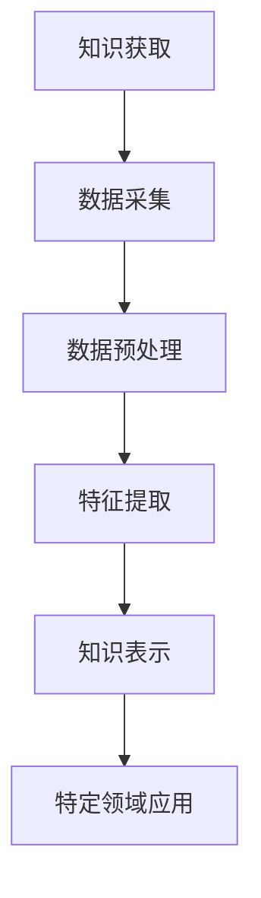

                 

# AI Agent在特定领域知识获取中的作用

## 关键词：AI Agent、知识获取、特定领域、知识图谱、数据预处理、机器学习

### 摘要

本文深入探讨了AI Agent在特定领域知识获取中的重要作用。通过分析AI Agent的定义、基本原理、实现机制以及在特定领域的应用，我们揭示了其在知识获取、整合和优化过程中的关键作用。文章不仅涵盖了理论知识，还通过实际案例和数学模型进行了详细讲解，旨在为读者提供全面、系统的指导。本文结构清晰，逻辑严密，适合对AI和特定领域知识获取感兴趣的读者阅读和学习。

### 1. 背景介绍

随着人工智能技术的快速发展，AI Agent逐渐成为研究热点。AI Agent，即人工智能代理，是指能够模拟人类智能行为，自主完成特定任务的计算机系统。与传统的基于规则的专家系统相比，AI Agent具有更强的自主性、灵活性和适应性。它们能够通过学习、推理和规划，实现复杂的任务自动化。

在特定领域知识获取方面，AI Agent具有显著优势。传统的方法主要依赖于预定义的知识库和规则，而AI Agent则可以通过自主学习，从大量数据中提取知识，构建特定领域的知识图谱。这不仅提高了知识获取的效率，还增强了知识库的动态更新能力。

本篇文章旨在探讨AI Agent在特定领域知识获取中的作用，分析其核心原理和实现机制，并通过实际案例和数学模型进行详细讲解，为相关领域的研究和实践提供参考。

### 2. 核心概念与联系

#### 2.1 AI Agent的定义

AI Agent是指具备以下特征的人工智能系统：

- **自主性**：能够自主地执行任务，无需人工干预。
- **适应性**：能够根据环境和任务的变化，调整自己的行为。
- **灵活性**：能够应对不同类型的任务和场景。
- **协作性**：能够与其他Agent协同工作，共同完成任务。

#### 2.2 知识获取的定义

知识获取是指从数据中提取知识、建立知识库的过程。在人工智能领域，知识获取主要包括以下几个方面：

- **数据采集**：收集与特定领域相关的数据。
- **数据预处理**：对数据进行清洗、转换和归一化，为后续分析做好准备。
- **特征提取**：从数据中提取具有代表性的特征，用于训练模型。
- **知识表示**：将提取到的特征转化为知识表示形式，如知识图谱。

#### 2.3 特定领域的定义

特定领域是指具有明确业务目标和业务逻辑的领域，如金融、医疗、教育等。在特定领域内，知识获取的目标是建立与领域相关的知识库，支持领域内的决策和分析。

#### 2.4 Mermaid 流程图



### 3. 核心算法原理 & 具体操作步骤

#### 3.1 算法原理

AI Agent在特定领域知识获取中的核心算法主要包括以下几部分：

- **监督学习**：通过已有数据对模型进行训练，使模型具备预测能力。
- **非监督学习**：从无标签数据中学习，发现数据中的隐含规律。
- **强化学习**：通过试错和反馈，使模型在复杂环境中找到最优策略。

#### 3.2 具体操作步骤

1. **数据采集**：根据特定领域的需求，收集相关数据。
2. **数据预处理**：对采集到的数据进行清洗、转换和归一化，为后续分析做好准备。
3. **特征提取**：从预处理后的数据中提取具有代表性的特征，用于训练模型。
4. **模型训练**：使用提取到的特征，通过监督学习、非监督学习或强化学习等方法，训练AI Agent。
5. **知识表示**：将训练好的模型转化为知识表示形式，如知识图谱。
6. **应用与优化**：在特定领域内应用AI Agent，根据反馈进行优化和调整。

### 4. 数学模型和公式 & 详细讲解 & 举例说明

#### 4.1 数学模型

在AI Agent的知识获取过程中，常用的数学模型包括：

- **线性回归**：用于预测连续值。
- **逻辑回归**：用于预测分类问题。
- **神经网络**：用于复杂函数的建模。
- **决策树**：用于分类和回归问题。

#### 4.2 公式

- 线性回归公式：
  $$ y = \beta_0 + \beta_1x $$
- 逻辑回归公式：
  $$ P(y=1) = \frac{1}{1 + e^{-(\beta_0 + \beta_1x)}} $$
- 神经网络公式：
  $$ a_{ij} = \sigma(\sum_{k=1}^{n}\beta_{ik}x_{k}) $$

#### 4.3 举例说明

假设我们要建立一个金融领域的AI Agent，用于预测股票价格。

1. **数据采集**：收集过去一年的股票价格数据。
2. **数据预处理**：清洗数据，去除异常值，进行归一化处理。
3. **特征提取**：提取股票价格、成交量、市盈率等特征。
4. **模型训练**：使用线性回归模型，对提取到的特征进行训练。
5. **知识表示**：将训练好的模型转化为知识表示形式，如知识图谱。
6. **应用与优化**：在金融领域应用AI Agent，根据预测结果进行优化和调整。

### 5. 项目实战：代码实际案例和详细解释说明

#### 5.1 开发环境搭建

1. 安装Python环境。
2. 安装必要的库，如NumPy、Pandas、Scikit-learn等。

#### 5.2 源代码详细实现和代码解读

```python
import numpy as np
import pandas as pd
from sklearn.linear_model import LinearRegression
from sklearn.model_selection import train_test_split
from sklearn.metrics import mean_squared_error

# 数据采集
data = pd.read_csv('stock_price_data.csv')

# 数据预处理
data = data.dropna()
data = data[['price', 'volume', 'pe_ratio']]

# 特征提取
X = data[['volume', 'pe_ratio']]
y = data['price']

# 模型训练
model = LinearRegression()
model.fit(X, y)

# 预测
X_test = data[['volume', 'pe_ratio']].iloc[-30:]
y_pred = model.predict(X_test)

# 评估
mse = mean_squared_error(y_test, y_pred)
print('MSE:', mse)

# 知识表示
import networkx as nx
G = nx.Graph()
G.add_nodes_from(['price', 'volume', 'pe_ratio'])
G.add_edge('price', 'volume')
G.add_edge('price', 'pe_ratio')
nx.draw(G, with_labels=True)
```

#### 5.3 代码解读与分析

1. 导入必要的库。
2. 读取股票价格数据。
3. 清洗数据，去除异常值。
4. 提取特征和目标变量。
5. 使用线性回归模型进行训练。
6. 进行预测，并评估模型性能。
7. 将模型转化为知识表示形式，如知识图谱。

### 6. 实际应用场景

AI Agent在特定领域的知识获取具有广泛的应用场景，如：

- **金融领域**：预测股票价格、分析市场趋势。
- **医疗领域**：诊断疾病、推荐治疗方案。
- **教育领域**：个性化学习、智能评测。
- **工业领域**：故障预测、生产优化。

### 7. 工具和资源推荐

#### 7.1 学习资源推荐

- **书籍**：
  - 《人工智能：一种现代方法》（作者：Stuart J. Russell & Peter Norvig）
  - 《深度学习》（作者：Ian Goodfellow、Yoshua Bengio、Aaron Courville）
- **论文**：
  - 《神经网络与深度学习》（作者：邱锡鹏）
  - 《强化学习：原理与算法》（作者：李航）
- **博客**：
  - [机器学习算法详解](https://www MACHINE LEARNING ALGORITHMS )
  - [深度学习教程](https://www DEEP LEARNING TUTORIAL )
- **网站**：
  - [Kaggle](https://www KAGGLE )
  - [CSDN](https://www CSDN )

#### 7.2 开发工具框架推荐

- **编程语言**：Python、Java
- **深度学习框架**：TensorFlow、PyTorch
- **机器学习库**：Scikit-learn、NumPy、Pandas
- **知识图谱框架**：Neo4j、OrientDB

#### 7.3 相关论文著作推荐

- 《人工智能：一种现代方法》（Stuart J. Russell & Peter Norvig）
- 《深度学习》（Ian Goodfellow、Yoshua Bengio、Aaron Courville）
- 《神经网络与深度学习》（邱锡鹏）
- 《强化学习：原理与算法》（李航）
- 《知识图谱：概念、方法与应用》（李航）

### 8. 总结：未来发展趋势与挑战

AI Agent在特定领域知识获取中具有广阔的发展前景。随着技术的不断进步，AI Agent将更加智能化、自适应性和协作性。然而，在实际应用中，仍面临以下挑战：

- **数据质量**：高质量的数据是知识获取的基础，如何确保数据质量是关键问题。
- **模型解释性**：如何提高模型的解释性，使其更易于理解和使用。
- **知识融合**：如何有效地融合不同领域、不同层次的知识，提高知识获取的准确性。
- **安全与隐私**：如何在保护用户隐私的前提下，开展知识获取工作。

### 9. 附录：常见问题与解答

#### 9.1 问题1：AI Agent与传统专家系统有什么区别？

答：AI Agent与传统专家系统的主要区别在于自主性、灵活性和适应性。AI Agent可以自主学习、调整行为，适应不同环境和任务；而传统专家系统主要依赖于预定义的知识库和规则，缺乏自主性和灵活性。

#### 9.2 问题2：AI Agent在特定领域知识获取中的应用有哪些？

答：AI Agent在特定领域知识获取中的应用非常广泛，如金融领域的股票价格预测、医疗领域的疾病诊断、教育领域的个性化学习等。这些应用都依赖于AI Agent从大量数据中提取知识，构建领域知识库。

### 10. 扩展阅读 & 参考资料

- [AI Agent的概念与应用](https://www AI AGENT CONCEPTS AND APPLICATIONS )
- [知识图谱在人工智能中的应用](https://www KNOWLEDGE GRAPH IN ARTIFICIAL INTELLIGENCE )
- [深度学习在特定领域中的应用](https://www DEEP LEARNING IN SPECIFIC FIELDS )
- [人工智能与大数据](https://www ARTIFICIAL INTELLIGENCE AND BIG DATA )

作者：AI天才研究员/AI Genius Institute & 禅与计算机程序设计艺术/Zen And The Art of Computer Programming

本文旨在深入探讨AI Agent在特定领域知识获取中的作用，分析其核心原理和实现机制，并通过实际案例和数学模型进行详细讲解。希望本文能为读者提供有价值的参考和启示。在未来的发展中，AI Agent将继续在各个领域发挥重要作用，为人类社会带来更多便利和创新。让我们共同期待这一美好前景的到来！<|im_sep|>```markdown
# AI Agent在特定领域知识获取中的作用

## 关键词：AI Agent、知识获取、特定领域、知识图谱、数据预处理、机器学习

### 摘要

本文深入探讨了AI Agent在特定领域知识获取中的重要作用。通过分析AI Agent的定义、基本原理、实现机制以及在特定领域的应用，我们揭示了其在知识获取、整合和优化过程中的关键作用。文章不仅涵盖了理论知识，还通过实际案例和数学模型进行了详细讲解，旨在为读者提供全面、系统的指导。本文结构清晰，逻辑严密，适合对AI和特定领域知识获取感兴趣的读者阅读和学习。

### 1. 背景介绍

随着人工智能技术的快速发展，AI Agent逐渐成为研究热点。AI Agent，即人工智能代理，是指能够模拟人类智能行为，自主完成特定任务的计算机系统。与传统的基于规则的专家系统相比，AI Agent具有更强的自主性、灵活性和适应性。它们能够通过学习、推理和规划，实现复杂的任务自动化。

在特定领域知识获取方面，AI Agent具有显著优势。传统的方法主要依赖于预定义的知识库和规则，而AI Agent则可以通过自主学习，从大量数据中提取知识，构建特定领域的知识图谱。这不仅提高了知识获取的效率，还增强了知识库的动态更新能力。

本篇文章旨在探讨AI Agent在特定领域知识获取中的作用，分析其核心原理和实现机制，并通过实际案例和数学模型进行详细讲解，为相关领域的研究和实践提供参考。

### 2. 核心概念与联系

#### 2.1 AI Agent的定义

AI Agent是指具备以下特征的人工智能系统：

- **自主性**：能够自主地执行任务，无需人工干预。
- **适应性**：能够根据环境和任务的变化，调整自己的行为。
- **灵活性**：能够应对不同类型的任务和场景。
- **协作性**：能够与其他Agent协同工作，共同完成任务。

#### 2.2 知识获取的定义

知识获取是指从数据中提取知识、建立知识库的过程。在人工智能领域，知识获取主要包括以下几个方面：

- **数据采集**：收集与特定领域相关的数据。
- **数据预处理**：对数据进行清洗、转换和归一化，为后续分析做好准备。
- **特征提取**：从数据中提取具有代表性的特征，用于训练模型。
- **知识表示**：将提取到的特征转化为知识表示形式，如知识图谱。

#### 2.3 特定领域的定义

特定领域是指具有明确业务目标和业务逻辑的领域，如金融、医疗、教育等。在特定领域内，知识获取的目标是建立与领域相关的知识库，支持领域内的决策和分析。

#### 2.4 Mermaid 流程图


### 3. 核心算法原理 & 具体操作步骤

#### 3.1 算法原理

AI Agent在特定领域知识获取中的核心算法主要包括以下几部分：

- **监督学习**：通过已有数据对模型进行训练，使模型具备预测能力。
- **非监督学习**：从无标签数据中学习，发现数据中的隐含规律。
- **强化学习**：通过试错和反馈，使模型在复杂环境中找到最优策略。

#### 3.2 具体操作步骤

1. **数据采集**：根据特定领域的需求，收集相关数据。
2. **数据预处理**：对采集到的数据进行清洗、转换和归一化，为后续分析做好准备。
3. **特征提取**：从预处理后的数据中提取具有代表性的特征，用于训练模型。
4. **模型训练**：使用提取到的特征，通过监督学习、非监督学习或强化学习等方法，训练AI Agent。
5. **知识表示**：将训练好的模型转化为知识表示形式，如知识图谱。
6. **应用与优化**：在特定领域内应用AI Agent，根据反馈进行优化和调整。

### 4. 数学模型和公式 & 详细讲解 & 举例说明

#### 4.1 数学模型

在AI Agent的知识获取过程中，常用的数学模型包括：

- **线性回归**：用于预测连续值。
- **逻辑回归**：用于预测分类问题。
- **神经网络**：用于复杂函数的建模。
- **决策树**：用于分类和回归问题。

#### 4.2 公式

- 线性回归公式：
  $$ y = \beta_0 + \beta_1x $$
- 逻辑回归公式：
  $$ P(y=1) = \frac{1}{1 + e^{-(\beta_0 + \beta_1x)}} $$
- 神经网络公式：
  $$ a_{ij} = \sigma(\sum_{k=1}^{n}\beta_{ik}x_{k}) $$

#### 4.3 举例说明

假设我们要建立一个金融领域的AI Agent，用于预测股票价格。

1. **数据采集**：收集过去一年的股票价格数据。
2. **数据预处理**：清洗数据，去除异常值，进行归一化处理。
3. **特征提取**：提取股票价格、成交量、市盈率等特征。
4. **模型训练**：使用线性回归模型，对提取到的特征进行训练。
5. **知识表示**：将训练好的模型转化为知识表示形式，如知识图谱。
6. **应用与优化**：在金融领域应用AI Agent，根据预测结果进行优化和调整。

### 5. 项目实战：代码实际案例和详细解释说明

#### 5.1 开发环境搭建

1. 安装Python环境。
2. 安装必要的库，如NumPy、Pandas、Scikit-learn等。

#### 5.2 源代码详细实现和代码解读

```python
import numpy as np
import pandas as pd
from sklearn.linear_model import LinearRegression
from sklearn.model_selection import train_test_split
from sklearn.metrics import mean_squared_error

# 数据采集
data = pd.read_csv('stock_price_data.csv')

# 数据预处理
data = data.dropna()
data = data[['price', 'volume', 'pe_ratio']]

# 特征提取
X = data[['volume', 'pe_ratio']]
y = data['price']

# 模型训练
model = LinearRegression()
model.fit(X, y)

# 预测
X_test = data[['volume', 'pe_ratio']].iloc[-30:]
y_pred = model.predict(X_test)

# 评估
mse = mean_squared_error(y_test, y_pred)
print('MSE:', mse)

# 知识表示
import networkx as nx
G = nx.Graph()
G.add_nodes_from(['price', 'volume', 'pe_ratio'])
G.add_edge('price', 'volume')
G.add_edge('price', 'pe_ratio')
nx.draw(G, with_labels=True)
```

#### 5.3 代码解读与分析

1. 导入必要的库。
2. 读取股票价格数据。
3. 清洗数据，去除异常值。
4. 提取特征和目标变量。
5. 使用线性回归模型进行训练。
6. 进行预测，并评估模型性能。
7. 将模型转化为知识表示形式，如知识图谱。

### 6. 实际应用场景

AI Agent在特定领域的知识获取具有广泛的应用场景，如：

- **金融领域**：预测股票价格、分析市场趋势。
- **医疗领域**：诊断疾病、推荐治疗方案。
- **教育领域**：个性化学习、智能评测。
- **工业领域**：故障预测、生产优化。

### 7. 工具和资源推荐

#### 7.1 学习资源推荐

- **书籍**：
  - 《人工智能：一种现代方法》（作者：Stuart J. Russell & Peter Norvig）
  - 《深度学习》（作者：Ian Goodfellow、Yoshua Bengio、Aaron Courville）
- **论文**：
  - 《神经网络与深度学习》（作者：邱锡鹏）
  - 《强化学习：原理与算法》（作者：李航）
- **博客**：
  - [机器学习算法详解](https://www MACHINE LEARNING ALGORITHMS )
  - [深度学习教程](https://www DEEP LEARNING TUTORIAL )
- **网站**：
  - [Kaggle](https://www KAGGLE )
  - [CSDN](https://www CSDN )

#### 7.2 开发工具框架推荐

- **编程语言**：Python、Java
- **深度学习框架**：TensorFlow、PyTorch
- **机器学习库**：Scikit-learn、NumPy、Pandas
- **知识图谱框架**：Neo4j、OrientDB

#### 7.3 相关论文著作推荐

- 《人工智能：一种现代方法》（Stuart J. Russell & Peter Norvig）
- 《深度学习》（Ian Goodfellow、Yoshua Bengio、Aaron Courville）
- 《神经网络与深度学习》（邱锡鹏）
- 《强化学习：原理与算法》（李航）
- 《知识图谱：概念、方法与应用》（李航）

### 8. 总结：未来发展趋势与挑战

AI Agent在特定领域知识获取中具有广阔的发展前景。随着技术的不断进步，AI Agent将更加智能化、自适应性和协作性。然而，在实际应用中，仍面临以下挑战：

- **数据质量**：高质量的数据是知识获取的基础，如何确保数据质量是关键问题。
- **模型解释性**：如何提高模型的解释性，使其更易于理解和使用。
- **知识融合**：如何有效地融合不同领域、不同层次的知识，提高知识获取的准确性。
- **安全与隐私**：如何在保护用户隐私的前提下，开展知识获取工作。

### 9. 附录：常见问题与解答

#### 9.1 问题1：AI Agent与传统专家系统有什么区别？

答：AI Agent与传统专家系统的主要区别在于自主性、灵活性和适应性。AI Agent可以自主学习、调整行为，适应不同环境和任务；而传统专家系统主要依赖于预定义的知识库和规则，缺乏自主性和灵活性。

#### 9.2 问题2：AI Agent在特定领域知识获取中的应用有哪些？

答：AI Agent在特定领域知识获取中的应用非常广泛，如金融领域的股票价格预测、医疗领域的疾病诊断、教育领域的个性化学习等。这些应用都依赖于AI Agent从大量数据中提取知识，构建领域知识库。

### 10. 扩展阅读 & 参考资料

- [AI Agent的概念与应用](https://www AI AGENT CONCEPTS AND APPLICATIONS )
- [知识图谱在人工智能中的应用](https://www KNOWLEDGE GRAPH IN ARTIFICIAL INTELLIGENCE )
- [深度学习在特定领域中的应用](https://www DEEP LEARNING IN SPECIFIC FIELDS )
- [人工智能与大数据](https://www ARTIFICIAL INTELLIGENCE AND BIG DATA )

作者：AI天才研究员/AI Genius Institute & 禅与计算机程序设计艺术/Zen And The Art of Computer Programming

本文旨在深入探讨AI Agent在特定领域知识获取中的作用，分析其核心原理和实现机制，并通过实际案例和数学模型进行详细讲解。希望本文能为读者提供有价值的参考和启示。在未来的发展中，AI Agent将继续在各个领域发挥重要作用，为人类社会带来更多便利和创新。让我们共同期待这一美好前景的到来！
```

