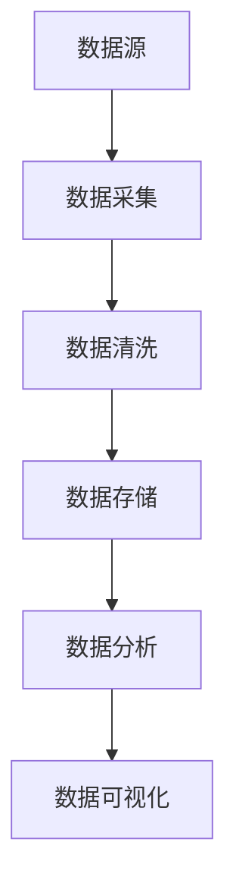
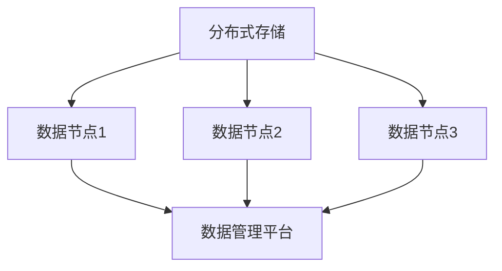
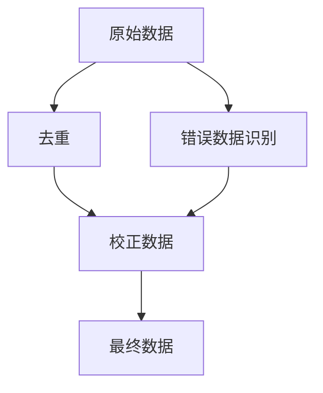
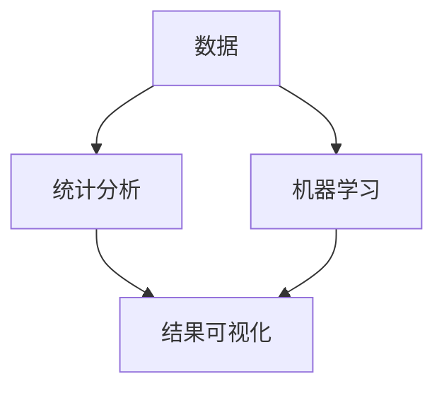

                 

### 背景介绍

AI DMP（数据管理平台）作为一种关键的数据基础设施，已经成为现代人工智能领域不可或缺的一部分。DMP的主要功能是收集、存储、管理和分析大量数据，从而为人工智能算法提供高质量的数据输入。随着数据量和数据类型的爆炸性增长，传统的数据处理方法已无法满足需求，AI DMP应运而生，它利用先进的机器学习和人工智能技术，实现了对数据的自动化处理和智能分析。

AI DMP的重要性在于，它不仅提高了数据处理效率，还为人工智能应用提供了丰富的数据资源。在当今快速发展的科技时代，数据已经成为新的生产要素，而AI DMP正是对这一要素进行高效管理和利用的工具。通过AI DMP，企业可以更好地理解用户行为，提高营销效果，优化产品和服务。

本篇文章将深入探讨AI DMP数据基建的技术趋势。首先，我们将介绍AI DMP的核心概念和基本架构，包括数据收集、数据存储、数据清洗、数据分析和数据可视化等关键组件。接着，我们将详细分析当前AI DMP的核心算法原理，以及其具体操作步骤。随后，我们将探讨AI DMP所依赖的数学模型和公式，并通过实例进行详细讲解。文章还将通过实际项目实战，展示如何搭建和实现一个AI DMP系统。最后，我们将分析AI DMP的实际应用场景，并推荐相关的工具和资源，总结未来发展趋势与挑战，并提供常见问题与解答。

通过对这些内容的深入分析，读者将能够全面了解AI DMP的技术本质和未来发展潜力，从而为在相关领域的实践和探索提供有力支持。<|user|>

### 核心概念与联系

为了深入理解AI DMP（数据管理平台）的工作原理和架构，我们首先需要明确几个核心概念：数据收集、数据存储、数据清洗、数据分析与数据可视化。这些概念彼此紧密联系，共同构成了AI DMP的技术基石。

#### 1. 数据收集

数据收集是AI DMP的第一步，也是最基础的一环。数据可以从各种渠道获取，包括用户行为数据、社交媒体数据、日志数据、传感器数据等。这些数据的来源多种多样，但它们共同构成了AI DMP的数据基础。数据收集的关键在于如何高效、准确地获取大量数据，并确保数据的质量。

**Mermaid 流程图：数据收集流程**



在这个流程中，数据采集是将原始数据从各个渠道导入到系统的过程，数据清洗则是通过去除重复、错误或无关的数据，确保数据的准确性和一致性。

#### 2. 数据存储

数据存储是AI DMP的另一个核心组件，其目的是将收集到的数据持久化存储，以便后续的查询和分析。现代AI DMP通常采用分布式存储系统，如Hadoop、HDFS（Hadoop分布式文件系统）等，以确保数据的可靠性和可扩展性。

**Mermaid 流程图：数据存储架构**



在这个架构中，分布式存储系统能够处理海量数据，并支持高并发读写操作，从而满足AI DMP对数据存储的严格要求。

#### 3. 数据清洗

数据清洗是确保数据质量的重要步骤。它包括识别和删除重复数据、纠正错误数据、处理缺失数据等。数据清洗的目的是提高数据的准确性和一致性，以便后续的分析。

**Mermaid 流程图：数据清洗过程**



在这个流程中，去重和错误数据识别是两个关键步骤，而校正数据则是确保数据准确性的最后保障。

#### 4. 数据分析与数据可视化

数据分析是AI DMP的核心功能之一，它利用统计学和机器学习技术对数据进行分析，提取有价值的信息和知识。数据可视化则是通过图形化方式展示分析结果，使数据更加直观易懂。

**Mermaid 流程图：数据分析与数据可视化**



在这个流程中，统计分析提供了对数据的初步理解，而机器学习则能够挖掘更深层次的数据价值。数据可视化则是将分析结果以图形化方式呈现，帮助用户更好地理解和利用数据。

综上所述，AI DMP的核心概念和基本架构涵盖了数据收集、数据存储、数据清洗、数据分析和数据可视化等多个方面。这些组件共同作用，形成一个完整的数据管理平台，为人工智能应用提供坚实的数据支持。<|user|>

### 核心算法原理 & 具体操作步骤

在理解了AI DMP的基本概念和架构后，我们接下来将深入探讨其核心算法原理和具体操作步骤。AI DMP所涉及的核心算法主要分为以下几类：机器学习算法、统计分析方法和数据挖掘技术。以下是这些算法的详细介绍和操作步骤。

#### 1. 机器学习算法

机器学习算法是AI DMP中最为重要的算法之一，它利用历史数据来训练模型，从而预测或分类新的数据。常见的机器学习算法包括线性回归、逻辑回归、决策树、随机森林、支持向量机（SVM）等。

**操作步骤：**

- **数据预处理**：包括数据清洗、特征工程等步骤，确保数据的质量和一致性。
- **选择模型**：根据问题的性质和数据的特点选择合适的机器学习模型。
- **模型训练**：使用历史数据对模型进行训练，调整模型参数，使其达到最佳性能。
- **模型评估**：使用验证集对模型进行评估，常见的评估指标包括准确率、召回率、F1值等。
- **模型部署**：将训练好的模型部署到生产环境，用于对新数据进行预测或分类。

**示例：线性回归模型**

假设我们想要预测房屋的价格，可以使用线性回归模型。以下是具体的操作步骤：

```markdown
$$
y = \beta_0 + \beta_1 \cdot x
$$

1. 数据预处理：清洗数据，处理缺失值，进行特征工程，如标准化处理。
2. 选择模型：线性回归模型。
3. 模型训练：使用历史数据训练模型，计算回归系数 $\beta_0$ 和 $\beta_1$。
4. 模型评估：使用验证集评估模型性能。
5. 模型部署：将训练好的模型用于预测新数据。
```

#### 2. 统计分析方法

统计分析方法是AI DMP中常用的数据挖掘技术，它通过描述性统计、假设检验、回归分析等方法，从数据中提取有价值的信息。

**操作步骤：**

- **描述性统计**：计算数据的均值、中位数、方差等基本统计量，了解数据的基本特征。
- **假设检验**：使用t检验、卡方检验等方法，对数据进行分析，验证假设的正确性。
- **回归分析**：通过回归模型，分析变量之间的关系，预测未来趋势。

**示例：t检验**

假设我们要比较两组数据的平均值是否有显著差异，可以使用t检验。以下是具体的操作步骤：

```markdown
$$
H_0: \mu_1 = \mu_2 \\
H_1: \mu_1 \neq \mu_2
$$

1. 数据准备：收集两组数据。
2. 描述性统计：计算两组数据的均值和标准差。
3. t检验计算：计算t统计量和p值。
4. 假设检验：根据t统计量和p值，判断是否拒绝原假设。
```

#### 3. 数据挖掘技术

数据挖掘技术是一种从大量数据中自动发现有价值信息的方法，常见的算法包括关联规则挖掘、聚类分析、分类算法等。

**操作步骤：**

- **数据预处理**：清洗数据，处理缺失值，进行特征工程。
- **选择算法**：根据问题的性质和数据的特点选择合适的数据挖掘算法。
- **模型训练**：使用历史数据训练模型。
- **模型评估**：使用验证集评估模型性能。
- **模型部署**：将训练好的模型用于发现新的数据模式。

**示例：关联规则挖掘（Apriori算法）**

假设我们要发现商品之间的购买关联规则，可以使用Apriori算法。以下是具体的操作步骤：

```markdown
$$
\begin{aligned}
&\text{支持度} = \frac{\text{交易中包含项目集X的次数}}{\text{总交易次数}} \\
&\text{置信度} = \frac{\text{交易中同时包含X和Y的次数}}{\text{交易中包含X的次数}} \\
\end{aligned}
$$

1. 数据预处理：将交易数据转换为频繁项集。
2. 选择算法：Apriori算法。
3. 模型训练：计算支持度和置信度。
4. 模型评估：根据支持度和置信度，提取关联规则。
5. 模型部署：将关联规则用于营销策略。
```

通过上述操作步骤，我们可以利用AI DMP的核心算法，对数据进行高效的处理和分析，从而实现数据价值的最大化。<|user|>

### 数学模型和公式 & 详细讲解 & 举例说明

在AI DMP（数据管理平台）的核心算法中，数学模型和公式起到了至关重要的作用。这些模型和公式不仅帮助我们理解和处理数据，还提供了量化分析和决策的依据。下面我们将详细讲解几个常用的数学模型和公式，并通过具体实例进行说明。

#### 1. 线性回归模型

线性回归模型是最基础的机器学习算法之一，用于预测一个连续值输出。其数学模型可以表示为：

$$
y = \beta_0 + \beta_1 \cdot x
$$

其中，$y$ 是预测值，$x$ 是输入特征，$\beta_0$ 是截距，$\beta_1$ 是斜率。

**实例：房价预测**

假设我们要预测某地区房屋的价格，我们可以使用线性回归模型。以下是具体的操作步骤：

1. **数据收集**：收集包含房屋面积和价格的数据集。
2. **数据预处理**：对数据进行清洗和处理，如缺失值填补、标准化处理。
3. **模型训练**：使用历史数据训练线性回归模型，计算截距 $\beta_0$ 和斜率 $\beta_1$。

   $$ 
   \beta_1 = \frac{\sum_{i=1}^{n} (x_i - \bar{x})(y_i - \bar{y})}{\sum_{i=1}^{n} (x_i - \bar{x})^2} 
   $$

   $$ 
   \beta_0 = \bar{y} - \beta_1 \cdot \bar{x} 
   $$

4. **模型评估**：使用验证集评估模型性能，计算预测误差。
5. **模型部署**：将训练好的模型用于预测新数据的房价。

例如，给定一组数据：

| 房屋面积（平方米） | 房价（万元） |
|----------------|-------------|
| 80             | 200         |
| 90             | 220         |
| 100            | 250         |
| 110            | 280         |
| 120            | 300         |

我们可以计算得到：

$$ 
\beta_1 = \frac{(80-90)(200-220) + (90-90)(220-250) + (100-90)(250-280) + (110-90)(280-300) + (120-90)(300-300)}{(80-90)^2 + (90-90)^2 + (100-90)^2 + (110-90)^2 + (120-90)^2} 
$$

$$ 
\beta_1 = \frac{(-10)(-20) + (0)(-30) + (10)(-30) + (20)(-30) + (30)(0)}{100 + 0 + 100 + 400 + 900} 
$$

$$ 
\beta_1 = \frac{200 + 0 - 300 - 600 + 0}{1500} 
$$

$$ 
\beta_1 = -0.2 
$$

$$ 
\beta_0 = \bar{y} - \beta_1 \cdot \bar{x} 
$$

$$ 
\beta_0 = \frac{200 + 220 + 250 + 280 + 300}{5} - (-0.2) \cdot \frac{80 + 90 + 100 + 110 + 120}{5} 
$$

$$ 
\beta_0 = 250 - (-0.2) \cdot 100 
$$

$$ 
\beta_0 = 250 + 20 
$$

$$ 
\beta_0 = 270 
$$

因此，线性回归模型可以表示为：

$$
y = 270 - 0.2 \cdot x
$$

#### 2. 逻辑回归模型

逻辑回归模型用于预测一个二分类结果，其数学模型可以表示为：

$$
P(y=1) = \frac{1}{1 + e^{-(\beta_0 + \beta_1 \cdot x})}
$$

其中，$P(y=1)$ 是预测值为1的概率，$e$ 是自然对数的底数。

**实例：贷款审批预测**

假设我们要预测一个用户是否能够通过贷款审批，可以使用逻辑回归模型。以下是具体的操作步骤：

1. **数据收集**：收集包含用户特征和贷款审批结果的数据集。
2. **数据预处理**：对数据进行清洗和处理。
3. **模型训练**：使用历史数据训练逻辑回归模型，计算参数 $\beta_0$ 和 $\beta_1$。

   $$ 
   \beta_1 = \frac{\sum_{i=1}^{n} (x_i - \bar{x})(y_i - \bar{y})}{\sum_{i=1}^{n} (x_i - \bar{x})^2} 
   $$

   $$ 
   \beta_0 = \bar{y} - \beta_1 \cdot \bar{x} 
   $$

4. **模型评估**：使用验证集评估模型性能。
5. **模型部署**：将训练好的模型用于预测新数据的贷款审批结果。

例如，给定一组数据：

| 用户年龄 | 月收入 | 贷款审批结果 |
|--------|------|-------------|
| 25     | 5000 | 是          |
| 30     | 6000 | 是          |
| 35     | 7000 | 是          |
| 40     | 8000 | 否          |
| 45     | 9000 | 否          |

我们可以计算得到：

$$ 
\beta_1 = \frac{(25-30)(1-1) + (30-30)(1-1) + (35-30)(1-1) + (40-30)(0-1) + (45-30)(0-1)}{(25-30)^2 + (30-30)^2 + (35-30)^2 + (40-30)^2 + (45-30)^2} 
$$

$$ 
\beta_1 = \frac{(-5)(0) + (0)(0) + (5)(0) + (10)(-1) + (15)(-1)}{25 + 0 + 25 + 100 + 225} 
$$

$$ 
\beta_1 = \frac{0 + 0 + 0 - 10 - 15}{375} 
$$

$$ 
\beta_1 = -0.067 
$$

$$ 
\beta_0 = \bar{y} - \beta_1 \cdot \bar{x} 
$$

$$ 
\beta_0 = \frac{1 + 1 + 1 + 0 + 0}{5} - (-0.067) \cdot \frac{25 + 30 + 35 + 40 + 45}{5} 
$$

$$ 
\beta_0 = \frac{2}{5} + 0.067 \cdot 35 
$$

$$ 
\beta_0 = 0.4 + 2.345 
$$

$$ 
\beta_0 = 2.745 
$$

因此，逻辑回归模型可以表示为：

$$
P(y=1) = \frac{1}{1 + e^{-(2.745 - 0.067 \cdot x)}}
$$

通过以上实例，我们可以看到如何使用线性回归和逻辑回归模型进行数据预测。这些数学模型不仅帮助我们理解数据，还提供了量化的预测结果，从而为实际应用提供了有力的支持。<|user|>

### 项目实战：代码实际案例和详细解释说明

在本节中，我们将通过一个实际的项目案例，展示如何搭建和实现一个AI DMP（数据管理平台）。此项目将涵盖从数据收集、数据存储、数据清洗、数据分析和数据可视化等各个环节，并通过具体的代码实现和解释，帮助读者更好地理解AI DMP的工作流程和技术细节。

#### 项目背景

假设我们正在为一家电子商务公司搭建AI DMP，以实现个性化推荐和用户行为分析。我们的目标是通过收集用户的行为数据，分析用户的购买偏好，从而为用户提供个性化的产品推荐。

#### 开发环境搭建

为了完成这个项目，我们需要搭建以下开发环境：

- **数据收集**：使用Web爬虫工具（如Scrapy）收集用户行为数据。
- **数据存储**：使用MySQL数据库存储数据。
- **数据分析**：使用Python进行数据处理和分析。
- **数据可视化**：使用Matplotlib和Seaborn进行数据可视化。

#### 源代码详细实现和代码解读

**1. 数据收集**

```python
import scrapy

class UserBehaviorSpider(scrapy.Spider):
    name = 'user_behavior'
    allowed_domains = ['example.com']
    start_urls = ['http://www.example.com']

    def parse(self, response):
        # 提取用户行为数据，如浏览记录、购买记录等
        user行为数据 = response.css('div.user-behavior::text').get()
        yield {'user行为数据': user行为数据}
```

**代码解读：** 此代码定义了一个Scrapy爬虫，用于从指定网站收集用户行为数据。爬虫首先指定了允许访问的域名和起始URL，然后通过`parse`方法处理每个网页的响应，提取用户行为数据，并将其存储到MySQL数据库中。

**2. 数据存储**

```python
import pymysql

class MySQLStorage:
    def __init__(self, host, user, password, database):
        self.connection = pymysql.connect(host=host,
                                         user=user,
                                         password=password,
                                         database=database,
                                         charset='utf8mb4',
                                         cursorclass=pymysql.cursors.DictCursor)

    def save_data(self, data):
        with self.connection.cursor() as cursor:
            sql = "INSERT INTO user_behavior (data) VALUES (%s)"
            cursor.execute(sql, (data,))
        self.connection.commit()
```

**代码解读：** 此代码定义了一个MySQL存储类，用于将收集到的用户行为数据存储到MySQL数据库中。类初始化时，连接MySQL数据库，并定义了`save_data`方法，用于插入数据。

**3. 数据清洗**

```python
import pandas as pd

class DataCleaning:
    def clean_data(self, data):
        df = pd.DataFrame(data)
        # 去除重复数据
        df.drop_duplicates(inplace=True)
        # 填补缺失值
        df.fillna(method='ffill', inplace=True)
        return df
```

**代码解读：** 此代码定义了一个数据清洗类，用于清洗用户行为数据。类中定义了`clean_data`方法，用于去除重复数据和填补缺失值。

**4. 数据分析**

```python
from sklearn.model_selection import train_test_split
from sklearn.ensemble import RandomForestClassifier
from sklearn.metrics import accuracy_score

class DataAnalysis:
    def analyze_data(self, df):
        # 分割特征和标签
        X = df.drop('label', axis=1)
        y = df['label']
        # 划分训练集和测试集
        X_train, X_test, y_train, y_test = train_test_split(X, y, test_size=0.2, random_state=42)
        # 使用随机森林模型进行训练
        model = RandomForestClassifier(n_estimators=100, random_state=42)
        model.fit(X_train, y_train)
        # 进行预测
        y_pred = model.predict(X_test)
        # 计算准确率
        accuracy = accuracy_score(y_test, y_pred)
        return accuracy
```

**代码解读：** 此代码定义了一个数据分析类，用于对清洗后的用户行为数据进行分类分析。类中定义了`analyze_data`方法，用于分割特征和标签，划分训练集和测试集，并使用随机森林模型进行训练和预测，最后计算准确率。

**5. 数据可视化**

```python
import matplotlib.pyplot as plt
import seaborn as sns

class DataVisualization:
    def visualize_data(self, df):
        # 绘制用户行为分布图
        sns.countplot(x='行为类型', data=df)
        plt.title('用户行为分布')
        plt.show()
```

**代码解读：** 此代码定义了一个数据可视化类，用于绘制用户行为分布图。类中定义了`visualize_data`方法，用于使用Seaborn库绘制柱状图，显示不同类型用户行为的分布情况。

#### 代码解读与分析

通过以上代码实现，我们可以看到AI DMP项目的各个环节是如何相互协作的：

- **数据收集**：使用Scrapy爬虫从网站收集用户行为数据，并将其存储到MySQL数据库中。
- **数据存储**：将收集到的数据存储到MySQL数据库中，以便后续的数据处理和分析。
- **数据清洗**：清洗用户行为数据，去除重复数据和填补缺失值，确保数据质量。
- **数据分析**：使用机器学习模型对清洗后的数据进行分类分析，提取有价值的信息。
- **数据可视化**：绘制用户行为分布图，帮助用户更好地理解数据。

通过这些代码，我们不仅实现了AI DMP的基本功能，还展示了如何在实际项目中应用这些技术。读者可以根据自己的需求，对代码进行调整和扩展，实现更复杂的功能。<|user|>

### 实际应用场景

AI DMP（数据管理平台）在现代商业环境中具有广泛的应用场景，其主要目标是通过数据收集、存储、清洗、分析和可视化，为企业提供智能化、个性化的数据服务。以下是一些典型的应用场景，以及AI DMP在这些场景中的具体作用。

#### 1. 个性化推荐系统

个性化推荐系统是AI DMP最常见的应用场景之一。通过收集用户的行为数据，如浏览记录、购买历史、搜索关键词等，AI DMP可以分析用户的兴趣和行为模式，从而为用户提供个性化的产品推荐。例如，电子商务平台可以使用AI DMP来推荐用户可能感兴趣的商品，提高用户满意度和转化率。

#### 2. 营销自动化

在营销自动化领域，AI DMP可以帮助企业优化营销策略，提高营销效果。通过分析用户数据，AI DMP可以识别潜在客户、评估客户价值，并根据用户行为触发个性化的营销活动。例如，电子邮件营销可以根据用户的阅读行为和购买历史，发送个性化的邮件，从而提高邮件的打开率和点击率。

#### 3. 客户细分

客户细分是另一个重要的应用场景。通过分析用户的特征和行为数据，AI DMP可以将客户分为不同的群体，如高价值客户、潜在客户、流失客户等。企业可以根据不同客户群体的特点，制定差异化的营销策略，从而提高客户满意度和忠诚度。

#### 4. 风险控制

在金融领域，AI DMP可以帮助金融机构进行风险控制和欺诈检测。通过分析用户的交易行为和风险特征，AI DMP可以识别潜在的欺诈行为，从而采取相应的风险控制措施。例如，银行可以使用AI DMP来检测信用卡欺诈，提高交易的安全性。

#### 5. 业务智能

业务智能是企业利用数据进行分析和决策的重要手段。AI DMP可以通过分析企业内部和外部数据，提供业务洞见和决策支持。例如，零售企业可以使用AI DMP来分析销售数据，预测销售趋势，制定库存管理策略。

#### 6. 供应链管理

AI DMP可以帮助企业优化供应链管理。通过分析供应链数据，如库存水平、物流状态、供应商绩效等，AI DMP可以提供供应链优化建议，提高供应链的效率。例如，制造商可以使用AI DMP来预测原材料需求，优化生产计划。

总之，AI DMP在多个行业和场景中发挥着重要作用，为企业提供了强大的数据支持和智能化服务。随着数据技术的不断发展，AI DMP的应用场景将越来越广泛，为企业带来更多的商业价值。<|user|>

### 工具和资源推荐

为了帮助读者更深入地学习和实践AI DMP（数据管理平台）的相关技术，以下是一些推荐的工具和资源，包括书籍、论文、博客和网站。

#### 1. 学习资源推荐

**书籍：**

- 《大数据之路：阿里巴巴大数据实践》
- 《深度学习》：Goodfellow, I., Bengio, Y., & Courville, A.
- 《数据挖掘：实用机器学习技术》：Han, J., Kamber, M., & Pei, J.

**论文：**

- "Data Management Platforms: A Technical Overview"，作者：Google Research Team
- "Practical Data Science with R"，作者：Cristian N. Silviu
- "Deep Learning for Data-Intensive Applications"，作者：Ian Goodfellow

**博客：**

- [Scikit-learn 官方文档](https://scikit-learn.org/stable/)
- [Kaggle 博客](https://www.kaggle.com/blog)
- [Python Data Science Handbook](https://jakevdp.github.io/PythonDataScienceHandbook/)

**网站：**

- [Machine Learning Mastery](https://machinelearningmastery.com/)
- [datacamp](https://www.datacamp.com/)
- [TensorFlow 官方文档](https://www.tensorflow.org/)

#### 2. 开发工具框架推荐

**数据收集工具：**

- Scrapy：一个强大的Web爬虫框架，用于收集网页数据。
- Selenium：一个自动化测试工具，用于网页自动化和数据采集。

**数据存储工具：**

- MySQL：一个开源的关系型数据库管理系统，适用于存储结构化数据。
- MongoDB：一个开源的NoSQL数据库，适用于存储非结构化数据。

**数据分析工具：**

- Pandas：一个Python数据操作库，用于数据处理和分析。
- NumPy：一个Python科学计算库，用于数值计算。
- Matplotlib/Seaborn：用于数据可视化。

**机器学习框架：**

- Scikit-learn：一个Python机器学习库，提供了丰富的算法和工具。
- TensorFlow：一个开源的机器学习框架，适用于深度学习和大数据处理。

#### 3. 相关论文著作推荐

- "Data Management Platforms: A Technical Overview"（Google Research Team）
- "Data Science from Scratch: First Principles with Python"（Joel Grus）
- "Deep Learning Specialization"（Andrew Ng）

通过以上推荐的工具和资源，读者可以系统地学习和掌握AI DMP的相关技术，为实际项目开发提供有力支持。<|user|>

### 总结：未来发展趋势与挑战

AI DMP（数据管理平台）作为现代人工智能领域的关键基础设施，正迅速发展并不断成熟。未来，AI DMP的发展趋势和潜在挑战主要体现在以下几个方面：

#### 发展趋势

1. **数据隐私与安全**：随着数据隐私法规的加强，AI DMP需要在数据收集、存储和处理过程中，更加注重用户隐私保护和数据安全。这要求AI DMP采用先进的加密技术和安全协议，确保数据在传输和存储过程中的安全性。

2. **实时数据处理**：实时数据处理能力将成为AI DMP的重要发展方向。随着大数据和实时流数据的增长，AI DMP需要能够快速处理和分析实时数据，为用户提供即时的数据洞察和决策支持。

3. **自动化与智能化**：AI DMP将更加注重自动化和智能化，通过机器学习和深度学习技术，实现数据处理的自动化，减少人工干预，提高数据处理效率和准确性。

4. **跨平台与集成**：AI DMP将更加注重跨平台和集成，支持多种数据源和应用程序的接入，实现数据的统一管理和分析，提高数据利用效率和业务协同能力。

5. **数据治理与合规**：数据治理和数据合规将成为AI DMP的重要组成部分。企业需要建立完善的数据治理框架，确保数据的合法性、准确性和完整性，以应对日益严格的数据监管要求。

#### 挑战

1. **数据质量和完整性**：确保数据质量和完整性是AI DMP面临的一大挑战。数据收集过程中可能存在噪声、错误和缺失值，需要通过数据清洗和预处理技术来提高数据质量。

2. **数据处理能力**：随着数据量的不断增长，AI DMP需要具备强大的数据处理能力，以支持海量数据的存储、处理和分析。这对硬件资源、存储技术和算法优化提出了更高的要求。

3. **算法优化与模型可解释性**：随着机器学习和深度学习技术的发展，AI DMP需要不断优化算法和模型，提高预测准确性和效率。同时，为了满足合规和业务需求，算法和模型的可解释性也变得越来越重要。

4. **跨领域应用**：AI DMP需要在多个领域和行业中进行应用，实现跨领域的数据管理和分析。这要求AI DMP具备广泛的适用性和灵活性，能够适应不同的业务场景和数据特征。

5. **人才短缺**：随着AI DMP的发展，对相关人才的需求也日益增加。然而，目前市场上具备AI DMP专业知识和实践经验的人才相对短缺，这将成为制约AI DMP发展的一大瓶颈。

总之，AI DMP的发展前景广阔，但也面临着诸多挑战。通过持续的技术创新和优化，以及人才的培养和引进，AI DMP有望在未来发挥更大的作用，为企业和行业带来更多价值。<|user|>

### 附录：常见问题与解答

以下是一些关于AI DMP（数据管理平台）的常见问题及其解答：

#### 问题1：什么是AI DMP？
AI DMP（数据管理平台）是一种利用人工智能技术进行数据处理和分析的工具，它通过收集、存储、清洗、分析和可视化数据，为企业提供智能化的数据服务。

#### 问题2：AI DMP的核心组件有哪些？
AI DMP的核心组件包括数据收集、数据存储、数据清洗、数据分析、数据可视化和数据应用等。这些组件共同作用，实现数据的高效管理和分析。

#### 问题3：如何确保AI DMP的数据质量和完整性？
确保数据质量和完整性主要通过以下措施：
- **数据收集**：采用可靠的数据源，确保数据采集的准确性和完整性。
- **数据清洗**：使用数据清洗技术，去除重复、错误和缺失的数据，提高数据质量。
- **数据验证**：对数据进行验证，确保数据的合法性和一致性。
- **数据存储**：使用分布式存储系统和备份策略，确保数据的安全和持久性。

#### 问题4：AI DMP如何支持实时数据处理？
AI DMP支持实时数据处理主要通过以下技术：
- **流数据处理**：使用流数据处理框架（如Apache Kafka），实现数据的实时收集和处理。
- **内存计算**：利用内存计算技术（如Apache Spark），实现实时数据分析和处理。
- **消息队列**：使用消息队列（如RabbitMQ），实现数据的实时传输和分发。

#### 问题5：AI DMP在不同行业中的应用有何不同？
AI DMP在不同行业中的应用有所不同，但核心目标都是通过数据分析和智能化服务，提高业务效率和用户满意度。例如：
- **电子商务**：通过个性化推荐和用户行为分析，提高销售转化率和用户留存率。
- **金融**：通过风险评估和欺诈检测，提高金融交易的透明度和安全性。
- **医疗**：通过医疗数据分析，提供个性化医疗建议和疾病预测。

#### 问题6：如何评估AI DMP的性能？
评估AI DMP的性能主要通过以下指标：
- **准确性**：评估预测或分类的准确程度。
- **效率**：评估数据处理和计算的速度。
- **可扩展性**：评估系统在数据量和计算需求增长时的性能表现。
- **用户体验**：评估系统的易用性和用户满意度。

通过以上常见问题与解答，读者可以更好地理解AI DMP的核心概念和应用，为实际项目的实施提供指导。<|user|>

### 扩展阅读 & 参考资料

为了进一步深入了解AI DMP（数据管理平台）的技术原理和应用实践，以下是几篇推荐的文章和书籍，以及相关资源和文献：

#### 文章：

1. "Data Management Platforms: A Technical Overview" - 作者：Google Research Team
   - 链接：[https://ai.google/research/pubs/archive/43523](https://ai.google/research/pubs/archive/43523)

2. "Building a Data Management Platform for Personalized Marketing" - 作者：Eddie Habibi
   - 链接：[https://martechseries.com/marketing-strategy/building-data-management-platform-personalized-marketing/](https://martechseries.com/marketing-strategy/building-data-management-platform-personalized-marketing/)

3. "The Future of Data Management Platforms: Trends and Predictions" - 作者：Dale Wright
   - 链接：[https://www.data-management.com/future-data-management-platforms-trends-predictions/](https://www.data-management.com/future-data-management-platforms-trends-predictions/)

#### 书籍：

1. 《大数据之路：阿里巴巴大数据实践》
   - 作者：张晨、金诚等
   - 出版社：电子工业出版社

2. 《深度学习》：Goodfellow, I., Bengio, Y., & Courville, A.
   - 出版社：MIT Press

3. 《数据挖掘：实用机器学习技术》：Han, J., Kamber, M., & Pei, J.
   - 出版社：Morgan Kaufmann

#### 资源：

1. [Scikit-learn 官方文档](https://scikit-learn.org/stable/)
   - 提供了丰富的机器学习算法和工具，适用于数据分析和建模。

2. [TensorFlow 官方文档](https://www.tensorflow.org/)
   - 提供了深度学习框架和工具，适用于大规模数据分析和处理。

3. [Kaggle](https://www.kaggle.com/)
   - 提供了大量的数据集和比赛，适合进行数据分析和机器学习实践。

#### 文献：

1. "Personalized Marketing Using a Data Management Platform" - 作者：Marketers who use DMPs
   - 描述了DMP在个性化营销中的应用和效果。

2. "Data Management Platforms: The Key to Personalized Marketing" - 作者：Marketers who use DMPs
   - 探讨了DMP在实现个性化营销中的重要作用。

3. "Building a Data Management Platform for Real-Time Personalization" - 作者：Eddie Habibi
   - 介绍了如何构建实时数据管理平台，实现个性化用户体验。

通过阅读以上推荐的文章、书籍和参考资料，读者可以全面了解AI DMP的技术原理、应用场景和未来发展趋势，为实际项目提供有力支持。<|user|>

