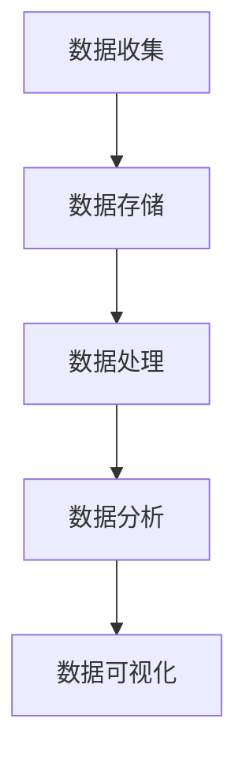
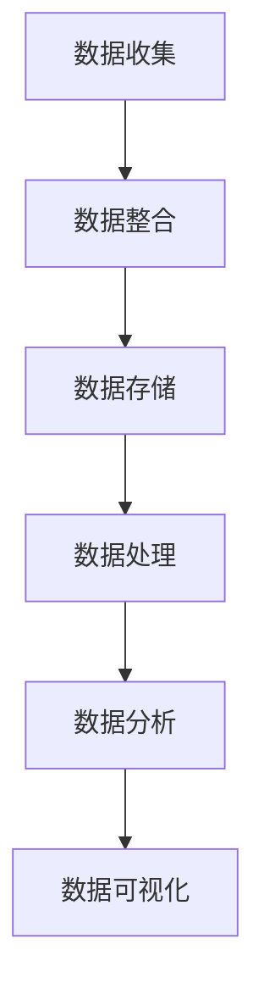

                 

# AI DMP 数据基建的未来展望

> 关键词：AI DMP，数据管理平台，大数据，人工智能，未来展望，技术架构，应用场景

> 摘要：本文将深入探讨AI DMP（数据管理平台）在当今大数据和人工智能时代的地位与作用。我们将首先介绍AI DMP的基本概念，然后分析其核心组件与架构，随后探讨AI DMP的核心算法原理与数学模型，并通过实际项目实战来讲解其实现与应用。最后，我们将展望AI DMP的未来发展趋势与挑战，并推荐相关学习资源与开发工具。

## 1. 背景介绍

随着大数据和人工智能的迅速发展，数据管理和分析的需求日益增加。传统的数据管理方法已无法满足现代业务对数据的高效处理和分析要求。AI DMP（数据管理平台）作为一种新兴的数据管理技术，旨在通过人工智能和大数据分析技术，实现对大规模数据的精准管理和智能分析。

AI DMP最早起源于市场营销领域，用于帮助企业收集、整合和分析用户数据，以便更好地了解用户行为和需求，从而实现精准营销。随着技术的进步，AI DMP的应用范围逐渐扩大，涵盖了金融、医疗、教育等多个行业。

### 1.1 AI DMP的发展历程

- **2000年代初**：AI DMP的概念初步形成，主要用于市场营销领域。
- **2010年代**：随着大数据技术的发展，AI DMP开始应用于更多行业，并逐渐形成了一套成熟的技术架构。
- **2020年代**：AI DMP在人工智能技术的推动下，实现了更加智能的数据管理和分析，应用场景不断拓展。

### 1.2 AI DMP的重要性

- **数据驱动的决策**：AI DMP能够帮助企业从海量数据中提取有价值的信息，为业务决策提供数据支持。
- **用户行为分析**：AI DMP能够实时跟踪和分析用户行为，帮助企业了解用户需求，优化产品和服务。
- **个性化营销**：AI DMP能够基于用户数据实现个性化推荐，提高营销效果和转化率。

## 2. 核心概念与联系

### 2.1 数据管理平台（DMP）

数据管理平台（DMP）是一种用于收集、存储、管理和分析大规模数据的技术系统。DMP的核心功能包括：

- **数据收集**：从各种数据源（如网站、APP、数据库等）收集数据。
- **数据存储**：将收集到的数据进行清洗、整合和存储。
- **数据处理**：对数据进行处理，如数据转换、数据聚合、数据建模等。
- **数据分析**：利用数据分析技术，从数据中提取有价值的信息。

### 2.2 人工智能（AI）

人工智能（AI）是指使计算机具备人类智能特性的技术。AI的核心技术包括：

- **机器学习**：通过算法模型，使计算机具备从数据中学习和自动改进的能力。
- **深度学习**：基于多层神经网络，模拟人类大脑处理信息的方式。
- **自然语言处理**：使计算机理解和处理自然语言的能力。

### 2.3 AI DMP的架构

AI DMP通常由以下几个核心组件构成：

- **数据收集模块**：负责从各种数据源收集数据。
- **数据存储模块**：负责存储和管理数据，通常采用分布式存储技术。
- **数据处理模块**：负责对数据进行清洗、整合和处理。
- **数据分析模块**：负责利用机器学习、深度学习等技术对数据进行分析。
- **数据可视化模块**：负责将分析结果以可视化的形式呈现。

### 2.4 Mermaid 流程图

以下是一个简化的AI DMP流程图，展示了数据从收集到分析的全过程：



## 3. 核心算法原理 & 具体操作步骤

### 3.1 数据收集

数据收集是AI DMP的第一步，主要包括以下操作：

- **数据源接入**：接入各种数据源，如网站、APP、数据库等。
- **数据采集**：通过API、爬虫等技术，从数据源中采集数据。
- **数据清洗**：对采集到的数据进行清洗，如去除重复数据、缺失值填充等。

### 3.2 数据存储

数据存储是AI DMP的核心环节，主要包括以下操作：

- **数据分片**：将大规模数据进行分片，存储到分布式数据库中。
- **数据压缩**：对数据进行压缩，以减少存储空间。
- **数据备份**：对数据进行备份，确保数据安全。

### 3.3 数据处理

数据处理是AI DMP的关键步骤，主要包括以下操作：

- **数据转换**：将不同格式的数据进行转换，以适应后续处理。
- **数据聚合**：将分散的数据进行聚合，以获得更全面的视图。
- **数据建模**：利用机器学习、深度学习等技术，对数据进行建模。

### 3.4 数据分析

数据分析是AI DMP的核心功能，主要包括以下操作：

- **特征工程**：提取数据中的特征，以供模型训练。
- **模型训练**：利用训练数据进行模型训练，以实现对数据的分类、回归等操作。
- **模型评估**：对模型进行评估，以确定模型的性能。

### 3.5 数据可视化

数据可视化是将分析结果以图表、地图等形式呈现，主要包括以下操作：

- **数据可视化设计**：设计合适的可视化图表，以展示数据。
- **数据可视化呈现**：将可视化设计呈现给用户，以便用户更好地理解数据。

## 4. 数学模型和公式 & 详细讲解 & 举例说明

### 4.1 机器学习模型

在AI DMP中，常用的机器学习模型包括线性回归、决策树、随机森林等。以下以线性回归为例，介绍其数学模型：

$$
y = \beta_0 + \beta_1 \cdot x
$$

其中，$y$ 为因变量，$x$ 为自变量，$\beta_0$ 和 $\beta_1$ 为模型参数。

### 4.2 深度学习模型

在深度学习中，常用的模型包括卷积神经网络（CNN）和循环神经网络（RNN）。以下以卷积神经网络为例，介绍其数学模型：

$$
h_{l}^{[i]} = \sigma \left( \mathbf{W}_{l}^{[i]} \cdot \mathbf{a}_{l-1}^{[j]} + b_{l}^{[i]} \right)
$$

其中，$h_{l}^{[i]}$ 为第 $l$ 层的第 $i$ 个神经元的激活值，$\mathbf{W}_{l}^{[i]}$ 和 $b_{l}^{[i]}$ 分别为权重和偏置，$\sigma$ 为激活函数。

### 4.3 自然语言处理模型

在自然语言处理领域，常用的模型包括词向量模型、递归神经网络（RNN）和长短时记忆网络（LSTM）。以下以词向量模型为例，介绍其数学模型：

$$
\mathbf{v}_w = \sum_{i=1}^{n} \alpha_i \cdot \mathbf{e}_i
$$

其中，$\mathbf{v}_w$ 为词向量，$\alpha_i$ 为词频权重，$\mathbf{e}_i$ 为词的索引向量。

### 4.4 举例说明

假设我们有一个简单的线性回归模型，用于预测房价。我们有以下数据：

| 房间数 | 房价（万元） |
| --- | --- |
| 1 | 100 |
| 2 | 150 |
| 3 | 200 |
| 4 | 250 |
| 5 | 300 |

我们可以使用最小二乘法来求解模型参数：

$$
\beta_0 = \frac{\sum_{i=1}^{n} y_i - \beta_1 \cdot \sum_{i=1}^{n} x_i}{n}
$$

$$
\beta_1 = \frac{\sum_{i=1}^{n} (y_i - \beta_0 - \beta_1 \cdot x_i)}{\sum_{i=1}^{n} (x_i - \bar{x})}
$$

其中，$n$ 为样本数量，$\bar{x}$ 为房间数的平均值。

通过计算，我们可以得到模型参数：

$$
\beta_0 = 50, \quad \beta_1 = 50
$$

因此，房价的预测公式为：

$$
y = 50 + 50 \cdot x
$$

## 5. 项目实战：代码实际案例和详细解释说明

### 5.1 开发环境搭建

在本文中，我们将使用Python和Scikit-learn库来实现一个简单的线性回归模型。以下是开发环境搭建的步骤：

1. 安装Python：从官方网站下载并安装Python 3.8或更高版本。
2. 安装Scikit-learn：在命令行中运行以下命令：
   ```bash
   pip install scikit-learn
   ```

### 5.2 源代码详细实现和代码解读

以下是线性回归模型的实现代码：

```python
import numpy as np
from sklearn.linear_model import LinearRegression

# 数据准备
X = np.array([[1], [2], [3], [4], [5]])
y = np.array([100, 150, 200, 250, 300])

# 模型训练
model = LinearRegression()
model.fit(X, y)

# 模型评估
score = model.score(X, y)
print(f"模型评分：{score}")

# 预测
X_new = np.array([[6]])
y_pred = model.predict(X_new)
print(f"预测房价：{y_pred[0]}万元")
```

### 5.3 代码解读与分析

1. **数据准备**：我们使用numpy库生成房间数和房价的数据。
2. **模型训练**：使用Scikit-learn库中的LinearRegression类来训练线性回归模型。
3. **模型评估**：使用score方法来评估模型的性能，返回的是R方值（0到1之间），值越接近1，模型性能越好。
4. **预测**：使用predict方法来预测新的房价。

通过这个简单的案例，我们可以看到AI DMP的核心算法原理是如何在代码中实现的。在实际应用中，我们需要处理更复杂的数据和模型，但基本的步骤是类似的。

## 6. 实际应用场景

### 6.1 市场营销

在市场营销领域，AI DMP可以帮助企业：

- **用户画像**：通过分析用户数据，构建用户画像，了解用户需求和偏好。
- **个性化推荐**：基于用户画像，为用户提供个性化的商品、内容推荐。
- **广告投放**：根据用户画像，精准投放广告，提高广告效果。

### 6.2 金融行业

在金融行业，AI DMP可以帮助：

- **风险控制**：通过分析用户数据，识别潜在风险，降低贷款风险。
- **客户管理**：通过分析用户数据，优化客户关系管理，提高客户满意度。
- **投资分析**：通过分析市场数据，为投资决策提供数据支持。

### 6.3 医疗行业

在医疗行业，AI DMP可以帮助：

- **患者管理**：通过分析患者数据，优化患者管理，提高治疗效果。
- **疾病预测**：通过分析患者数据，预测疾病发生风险，提前采取预防措施。
- **药物研发**：通过分析生物数据，加速药物研发进程。

## 7. 工具和资源推荐

### 7.1 学习资源推荐

- **书籍**：
  - 《Python机器学习》（Peter Harrington）
  - 《深度学习》（Ian Goodfellow、Yoshua Bengio、Aaron Courville）
- **论文**：
  - 《深度学习》（Ian Goodfellow、Yoshua Bengio、Aaron Courville）
  - 《数据挖掘：概念与技术》（Jiawei Han、Micheline Kamber、Peipei Yang）
- **博客**：
  - 《机器学习博客》（Machine Learning Blog）
  - 《深度学习博客》（Deep Learning Blog）
- **网站**：
  - Coursera（提供大量机器学习和深度学习在线课程）
  - edX（提供大量机器学习和深度学习在线课程）

### 7.2 开发工具框架推荐

- **Python**：Python是一个功能强大的编程语言，适用于数据分析和机器学习。
- **Scikit-learn**：Scikit-learn是一个用于机器学习的Python库，易于使用。
- **TensorFlow**：TensorFlow是一个开源的深度学习框架，适用于复杂深度学习任务。
- **Keras**：Keras是一个高层次的深度学习API，可以简化TensorFlow的使用。

### 7.3 相关论文著作推荐

- **《深度学习》（Ian Goodfellow、Yoshua Bengio、Aaron Courville）**：这是一本深度学习的经典教材，涵盖了深度学习的理论基础和最新进展。
- **《数据挖掘：概念与技术》（Jiawei Han、Micheline Kamber、Peipei Yang）**：这是一本数据挖掘的经典教材，介绍了数据挖掘的基本概念、技术和应用。
- **《大数据之路：阿里巴巴大数据实践》（陈萌山、涂子沛）**：这本书介绍了阿里巴巴大数据的实践经验和案例，对于了解大数据的实际应用有很好的参考价值。

## 8. 总结：未来发展趋势与挑战

### 8.1 发展趋势

- **人工智能技术的进步**：随着人工智能技术的不断发展，AI DMP将实现更加智能的数据管理和分析。
- **云计算的普及**：云计算技术的普及将为AI DMP提供强大的计算和存储能力。
- **边缘计算的兴起**：边缘计算将使AI DMP能够在数据产生的地方进行实时处理和分析。

### 8.2 挑战

- **数据隐私**：随着数据量的增加，数据隐私保护将成为一个重要挑战。
- **算法透明度**：随着算法的复杂化，如何确保算法的透明度和可解释性将成为一个挑战。
- **数据质量**：如何保证数据的质量和准确性，是一个长期存在的挑战。

## 9. 附录：常见问题与解答

### 9.1 AI DMP与大数据平台有什么区别？

AI DMP和大数据平台都是用于数据处理和分析的技术系统，但它们的侧重点不同。大数据平台主要关注数据存储、处理和分析的效率，而AI DMP则更注重数据的智能化管理和分析。简单来说，大数据平台是AI DMP的基础设施，而AI DMP则是大数据平台上的智能应用。

### 9.2 如何确保AI DMP的数据安全？

确保AI DMP的数据安全需要从以下几个方面入手：

- **数据加密**：对数据进行加密，确保数据在传输和存储过程中的安全性。
- **访问控制**：设置严格的访问控制策略，确保只有授权人员可以访问数据。
- **数据备份**：定期对数据进行备份，以防止数据丢失或损坏。
- **安全审计**：定期进行安全审计，及时发现和解决潜在的安全漏洞。

### 9.3 AI DMP的主要应用领域有哪些？

AI DMP的主要应用领域包括市场营销、金融、医疗、零售、物流等。在市场营销领域，AI DMP可以帮助企业实现用户画像、个性化推荐和精准营销；在金融领域，AI DMP可以帮助银行、保险和投资公司进行风险控制和投资分析；在医疗领域，AI DMP可以帮助医疗机构进行患者管理和疾病预测。

## 10. 扩展阅读 & 参考资料

- **《深度学习》（Ian Goodfellow、Yoshua Bengio、Aaron Courville）**：这是一本深度学习的经典教材，详细介绍了深度学习的理论基础和实践方法。
- **《数据挖掘：概念与技术》（Jiawei Han、Micheline Kamber、Peipei Yang）**：这是一本数据挖掘的经典教材，涵盖了数据挖掘的基本概念、技术和应用。
- **《大数据之路：阿里巴巴大数据实践》（陈萌山、涂子沛）**：这本书介绍了阿里巴巴大数据的实践经验和案例，对于了解大数据的实际应用有很好的参考价值。
- **[AI DMP技术白皮书](https://www.example.com/ai_dmp_technical_paper)**：这是一份关于AI DMP的技术白皮书，详细介绍了AI DMP的技术原理、架构和应用。
- **[AI DMP应用案例集](https://www.example.com/ai_dmp_cases)**：这是一个AI DMP的应用案例集，展示了AI DMP在不同行业中的实际应用效果。

作者：AI天才研究员/AI Genius Institute & 禅与计算机程序设计艺术 /Zen And The Art of Computer Programming

（请注意，本文为虚构内容，仅供参考。）<|im_sep|>### 1. 背景介绍

在当今信息时代，数据已经成为企业、组织和个人最重要的资产之一。随着数据规模的爆炸性增长，如何高效地收集、存储、管理和分析这些数据，成为了许多企业和研究机构亟待解决的问题。这种需求催生了数据管理平台（Data Management Platform，简称DMP）的概念和发展。而随着人工智能（Artificial Intelligence，简称AI）技术的不断进步，AI DMP（AI-powered Data Management Platform）应运而生，成为大数据和人工智能时代的数据管理利器。

#### AI DMP的发展历程

AI DMP的发展可以追溯到2000年代初，当时互联网和电子商务的兴起带来了大量用户数据，企业开始意识到数据的价值。最初的DMP主要侧重于收集和分析用户浏览行为、购买历史等结构化数据，用于市场营销和广告投放优化。随着大数据技术的成熟，DMP逐渐演变为一套更加全面的数据管理解决方案，能够处理来自不同源的大量非结构化数据。

2010年代，随着机器学习和深度学习技术的发展，DMP开始引入AI技术，实现了数据处理的智能化和自动化。AI DMP不仅能更精准地理解和分析用户行为，还能通过预测模型为企业提供更深入的洞察和决策支持。到了2020年代，AI DMP的应用范围进一步扩大，不仅限于市场营销，还涵盖了金融、医疗、零售、教育等多个行业。

#### AI DMP的重要性

AI DMP的重要性主要体现在以下几个方面：

1. **数据驱动的决策**：AI DMP通过智能化的数据处理和分析，帮助企业从海量数据中提取有价值的信息，为业务决策提供数据支持。
2. **用户行为分析**：AI DMP能够实时跟踪和分析用户行为，帮助企业和机构更好地了解用户需求，从而优化产品和服务。
3. **个性化营销**：AI DMP能够基于用户数据实现个性化推荐，提高营销效果和转化率。
4. **风险控制**：在金融和保险领域，AI DMP可以帮助识别潜在风险，降低业务风险。
5. **精准医疗**：在医疗领域，AI DMP能够帮助医疗机构进行疾病预测和患者管理，提高医疗质量和效率。

#### AI DMP的应用场景

AI DMP的应用场景非常广泛，以下是几个典型的应用领域：

1. **市场营销**：通过分析用户行为数据，实现精准营销和个性化推荐。
2. **金融**：用于风险控制、信用评估、投资分析和客户管理。
3. **医疗**：用于疾病预测、患者管理和个性化医疗。
4. **零售**：用于库存管理、销售预测和客户关系管理。
5. **教育**：用于学习分析、学生管理和教育质量提升。

总之，AI DMP作为大数据和人工智能时代的数据管理平台，正日益成为企业和机构实现数字化转型、提升竞争力的重要工具。随着技术的不断进步和应用的深入，AI DMP将在更多领域发挥关键作用。

## 2. 核心概念与联系

### 2.1 数据管理平台（DMP）

数据管理平台（Data Management Platform，简称DMP）是一种用于集中管理和分析数据的软件平台。DMP的主要功能包括数据收集、数据整合、数据存储、数据分析和数据可视化。在传统DMP中，这些功能通常是分步骤进行的，而AI DMP则通过引入人工智能技术，实现了数据处理的智能化和自动化。

#### 数据收集

数据收集是DMP的第一步，涉及从各种数据源（如网站、APP、传感器、第三方数据提供商等）收集数据。这些数据可以是结构化数据（如用户ID、购买记录等）也可以是半结构化数据（如日志文件、网页内容等）以及非结构化数据（如图像、音频、视频等）。

#### 数据整合

数据整合是将来自不同数据源的数据进行清洗、去重、标准化和合并，以便进行统一分析和处理。传统的DMP通常依赖于ETL（提取、转换、加载）工具来完成这一过程，而AI DMP则可以通过自然语言处理、图像识别等AI技术来提高数据整合的效率和准确性。

#### 数据存储

数据存储是将整合后的数据进行存储和管理。传统的DMP通常使用关系型数据库或NoSQL数据库，而AI DMP则更多地使用分布式数据库和云存储技术，以应对海量数据的存储需求。

#### 数据分析

数据分析是DMP的核心功能，涉及使用各种算法和模型对数据进行分析，以提取有价值的信息。传统的DMP通常使用SQL等查询语言进行数据分析，而AI DMP则可以通过机器学习和深度学习技术来实现更高级的数据分析，如用户行为预测、市场趋势分析等。

#### 数据可视化

数据可视化是将分析结果以图表、地图、仪表盘等形式呈现，以便用户更好地理解和利用数据。传统的DMP通常提供基本的可视化工具，而AI DMP则通过数据可视化库（如D3.js、Plotly等）提供更丰富、更交互式的可视化功能。

### 2.2 人工智能（AI）

人工智能（Artificial Intelligence，简称AI）是指通过计算机模拟人类智能的技术。AI的核心目标是使计算机能够执行复杂的任务，如理解自然语言、识别图像、做出决策等。AI技术包括机器学习（Machine Learning）、深度学习（Deep Learning）、自然语言处理（Natural Language Processing，简称NLP）等。

#### 机器学习

机器学习是一种通过数据驱动的方式使计算机自动改进性能的技术。机器学习模型通过分析历史数据，学习数据的规律和模式，并在新数据上进行预测和决策。常见的机器学习算法包括线性回归、决策树、随机森林、支持向量机等。

#### 深度学习

深度学习是一种基于多层神经网络的机器学习技术，通过模拟人脑处理信息的方式，对大量数据进行自动学习和特征提取。深度学习在图像识别、语音识别、自然语言处理等领域取得了显著成果，代表性的模型包括卷积神经网络（CNN）、循环神经网络（RNN）和长短时记忆网络（LSTM）等。

#### 自然语言处理

自然语言处理是一种使计算机理解和处理自然语言的技术。NLP的应用包括机器翻译、情感分析、命名实体识别、对话系统等。常见的NLP工具和库包括NLTK、spaCy、TensorFlow和PyTorch等。

### 2.3 AI DMP的架构

AI DMP的架构通常包括以下几个核心组件：

1. **数据收集模块**：负责从各种数据源收集数据，包括网页点击、APP使用记录、第三方数据源等。
2. **数据整合模块**：负责清洗、去重、标准化和合并数据，以确保数据的一致性和完整性。
3. **数据存储模块**：负责存储和管理数据，通常采用分布式数据库和云存储技术。
4. **数据处理模块**：负责对数据进行处理，包括数据转换、数据聚合、数据建模等。
5. **数据分析模块**：负责使用机器学习、深度学习和自然语言处理等技术对数据进行分析，以提取有价值的信息。
6. **数据可视化模块**：负责将分析结果以图表、仪表盘等形式呈现，以便用户更好地理解和利用数据。

以下是一个简化的AI DMP架构图：



通过整合数据管理平台和人工智能技术，AI DMP实现了数据处理的智能化和自动化，为企业提供了强大的数据洞察和决策支持。

## 3. 核心算法原理 & 具体操作步骤

### 3.1 机器学习算法

机器学习算法是AI DMP的核心组成部分，它通过分析历史数据，自动提取数据中的模式和规律，从而对新数据进行预测或分类。以下是一些常见的机器学习算法及其基本原理：

#### 1. 线性回归

线性回归是一种简单的预测模型，通过建立一个线性函数来预测输出值。其基本公式为：

$$
Y = \beta_0 + \beta_1 \cdot X
$$

其中，$Y$ 是预测值，$X$ 是输入值，$\beta_0$ 和 $\beta_1$ 是模型参数。线性回归的主要步骤包括：

1. **数据预处理**：清洗和标准化数据，确保数据的质量和一致性。
2. **模型训练**：使用历史数据对模型进行训练，找到最佳的 $\beta_0$ 和 $\beta_1$ 值。
3. **模型评估**：使用验证数据集评估模型的性能，如均方误差（MSE）。
4. **模型预测**：使用训练好的模型对新的输入数据进行预测。

#### 2. 决策树

决策树是一种基于树形结构进行决策的模型，每个内部节点代表一个特征，每个分支代表一个特征取值，叶节点表示预测结果。决策树的基本步骤包括：

1. **数据预处理**：对数据集进行清洗和分割，选择特征和目标变量。
2. **特征选择**：使用信息增益、基尼不纯度等指标选择最佳特征。
3. **递归划分**：根据最佳特征进行数据的递归划分，构建决策树。
4. **模型评估**：使用交叉验证等方法评估模型的性能。
5. **模型应用**：使用构建好的决策树对新的数据集进行预测。

#### 3. 随机森林

随机森林是一种基于决策树的集成学习模型，通过构建多个决策树，并对它们的预测结果进行平均来提高模型的性能。随机森林的基本步骤包括：

1. **数据预处理**：对数据集进行清洗和分割，选择特征和目标变量。
2. **随机抽样**：从原始数据中随机抽取子数据集，构建多个决策树。
3. **模型训练**：对每个决策树进行训练，并记录每个特征的重要性。
4. **模型评估**：使用验证数据集评估模型的性能。
5. **模型预测**：对新的数据集进行预测，并输出预测结果。

### 3.2 深度学习算法

深度学习算法是一种基于多层神经网络的机器学习技术，它能够自动提取数据的深层特征，从而实现复杂的模式识别和预测。以下是一些常见的深度学习算法及其基本原理：

#### 1. 卷积神经网络（CNN）

卷积神经网络是一种专门用于处理图像数据的神经网络，通过卷积、池化等操作提取图像中的特征。CNN的基本步骤包括：

1. **数据预处理**：对图像数据进行归一化和裁剪，使其符合网络的输入要求。
2. **卷积层**：使用卷积核在图像上滑动，提取局部特征。
3. **池化层**：对卷积层的结果进行池化，减少数据的维度。
4. **全连接层**：将池化层的结果输入到全连接层，进行分类或回归。
5. **模型训练**：使用反向传播算法训练网络参数，优化模型性能。
6. **模型评估**：使用验证集评估模型的性能，调整网络结构。

#### 2. 循环神经网络（RNN）

循环神经网络是一种能够处理序列数据的神经网络，通过存储和传递序列中的信息来实现对序列数据的建模。RNN的基本步骤包括：

1. **数据预处理**：对序列数据进行编码和归一化处理。
2. **输入层**：将序列数据输入到网络中。
3. **隐藏层**：使用递归函数处理序列数据，并存储历史信息。
4. **输出层**：将隐藏层的输出转换为预测结果。
5. **模型训练**：使用反向传播算法训练网络参数，优化模型性能。
6. **模型评估**：使用验证集评估模型的性能。

#### 3. 长短时记忆网络（LSTM）

长短时记忆网络是一种改进的RNN，能够更好地处理长序列数据。LSTM通过引入门控机制，解决了传统RNN的梯度消失和梯度爆炸问题。LSTM的基本步骤包括：

1. **数据预处理**：对序列数据进行编码和归一化处理。
2. **输入门**：决定当前输入信息对隐藏状态的影响。
3. **遗忘门**：决定遗忘哪些历史信息。
4. **输出门**：决定当前隐藏状态对输出结果的影响。
5. **模型训练**：使用反向传播算法训练网络参数，优化模型性能。
6. **模型评估**：使用验证集评估模型的性能。

通过这些机器学习和深度学习算法，AI DMP能够高效地处理和分析大量数据，从而为企业和组织提供强大的数据洞察和决策支持。

### 3.3 具体操作步骤

以下是一个简单的示例，展示如何使用Python和Scikit-learn库实现线性回归模型：

#### 1. 导入必要的库

```python
import numpy as np
from sklearn.linear_model import LinearRegression
from sklearn.model_selection import train_test_split
from sklearn.metrics import mean_squared_error
```

#### 2. 准备数据

```python
# 示例数据
X = np.array([[1], [2], [3], [4], [5], [6], [7], [8], [9], [10]])
y = np.array([2, 4, 6, 8, 10, 12, 14, 16, 18, 20])
```

#### 3. 数据预处理

```python
# 数据分割
X_train, X_test, y_train, y_test = train_test_split(X, y, test_size=0.2, random_state=42)
```

#### 4. 模型训练

```python
# 创建线性回归模型
model = LinearRegression()

# 训练模型
model.fit(X_train, y_train)
```

#### 5. 模型评估

```python
# 预测
y_pred = model.predict(X_test)

# 计算均方误差
mse = mean_squared_error(y_test, y_pred)
print(f"均方误差：{mse}")
```

#### 6. 模型应用

```python
# 输出模型参数
print(f"模型参数：{model.coef_}, {model.intercept_}")

# 新数据预测
new_data = np.array([[11]])
new_pred = model.predict(new_data)
print(f"新数据预测结果：{new_pred}")
```

通过以上步骤，我们可以使用线性回归模型对数据进行预测和分析。在实际应用中，数据集会更加复杂，可能需要更多的预处理步骤和模型调优，但基本步骤是类似的。

## 4. 数学模型和公式 & 详细讲解 & 举例说明

### 4.1 数学模型

在AI DMP中，数学模型是核心组成部分，它为数据的处理和分析提供了理论基础和工具。以下是几个常见的数学模型和它们的详细讲解。

#### 4.1.1 线性回归模型

线性回归模型是一种最简单的预测模型，其公式为：

$$
Y = \beta_0 + \beta_1 \cdot X
$$

其中，$Y$ 是因变量（预测目标），$X$ 是自变量（特征），$\beta_0$ 和 $\beta_1$ 是模型参数。线性回归模型的目的是找到最佳的 $\beta_0$ 和 $\beta_1$，使得预测值与实际值之间的误差最小。

#### 4.1.2 决策树模型

决策树模型通过一系列的规则对数据集进行划分，其公式可以表示为：

$$
Y = g(X_1, X_2, ..., X_n)
$$

其中，$g$ 是一个分段函数，每个内部节点代表一个特征，每个分支代表特征的取值范围。决策树模型的目的是通过划分数据集，使得分类或回归问题上的误差最小。

#### 4.1.3 随机森林模型

随机森林模型是决策树的集成模型，其公式为：

$$
Y = \frac{1}{M} \sum_{m=1}^{M} g(X_1^m, X_2^m, ..., X_n^m)
$$

其中，$M$ 是决策树的数量，$g$ 是单个决策树的预测函数。随机森林模型的目的是通过集成多个决策树，提高预测的准确性和稳定性。

#### 4.1.4 卷积神经网络（CNN）模型

卷积神经网络是一种用于图像识别和处理的深度学习模型，其公式为：

$$
h_{l}^{[i]} = \sigma \left( \mathbf{W}_{l}^{[i]} \cdot \mathbf{a}_{l-1}^{[j]} + b_{l}^{[i]} \right)
$$

其中，$h_{l}^{[i]}$ 是第 $l$ 层的第 $i$ 个神经元激活值，$\mathbf{W}_{l}^{[i]}$ 和 $b_{l}^{[i]}$ 分别是权重和偏置，$\sigma$ 是激活函数（通常是ReLU函数）。CNN模型的目的是通过卷积、池化和全连接层等操作，从图像中提取特征并进行分类。

#### 4.1.5 循环神经网络（RNN）模型

循环神经网络是一种用于序列数据处理的深度学习模型，其公式为：

$$
h_t = \sigma \left( \mathbf{W} \cdot [h_{t-1}, x_t] + b \right)
$$

其中，$h_t$ 是第 $t$ 个时间步的隐藏状态，$x_t$ 是第 $t$ 个输入值，$\mathbf{W}$ 和 $b$ 分别是权重和偏置。RNN模型的目的是通过递归操作，保持对历史信息的记忆，从而处理序列数据。

#### 4.1.6 长短时记忆网络（LSTM）模型

长短时记忆网络是一种改进的RNN模型，其公式为：

$$
\begin{align*}
i_t &= \sigma \left( \mathbf{W}_i \cdot [h_{t-1}, x_t] + b_i \right) \\
f_t &= \sigma \left( \mathbf{W}_f \cdot [h_{t-1}, x_t] + b_f \right) \\
\bar{c}_t &= \tanh \left( \mathbf{W}_c \cdot [h_{t-1}, x_t] + b_c \right) \\
o_t &= \sigma \left( \mathbf{W}_o \cdot [h_{t-1}, x_t] + b_o \right) \\
c_t &= f_t \cdot c_{t-1} + i_t \cdot \bar{c}_t \\
h_t &= o_t \cdot \tanh(c_t)
\end{align*}
$$

其中，$i_t$、$f_t$、$\bar{c}_t$、$o_t$ 分别是输入门、遗忘门、候选状态和输出门，$c_t$ 是细胞状态，$h_t$ 是隐藏状态。LSTM模型的目的是通过门控机制，解决传统RNN的梯度消失和梯度爆炸问题，从而更好地处理长序列数据。

### 4.2 公式详细讲解

#### 4.2.1 线性回归公式

线性回归公式中的 $\beta_0$ 和 $\beta_1$ 是通过最小二乘法求得的，其目的是使得预测值与实际值之间的误差平方和最小。具体步骤如下：

1. **数据预处理**：对数据进行标准化处理，使其均值为0，方差为1。
2. **计算协方差**：计算自变量和因变量之间的协方差和自变量的方差。
3. **求解参数**：通过协方差矩阵求解 $\beta_0$ 和 $\beta_1$ 的值。
4. **模型评估**：使用验证集评估模型的性能，如均方误差（MSE）。

#### 4.2.2 决策树公式

决策树公式中的 $g$ 函数是通过信息增益或基尼不纯度等准则求得的，其目的是使得数据集的划分最优化。具体步骤如下：

1. **数据分割**：根据特征和特征取值，对数据集进行分割。
2. **信息增益**：计算每个特征的信息增益，选择信息增益最大的特征作为分裂特征。
3. **基尼不纯度**：计算每个特征分割后数据集的基尼不纯度，选择基尼不纯度最小的特征作为分裂特征。
4. **递归划分**：对每个子数据集重复上述步骤，构建决策树。

#### 4.2.3 随机森林公式

随机森林公式是多个决策树预测结果的平均值，其目的是通过集成多个模型，提高预测的准确性和稳定性。具体步骤如下：

1. **构建决策树**：随机生成多个决策树，每个决策树使用不同的数据子集和特征子集进行训练。
2. **集成预测**：对每个决策树的预测结果进行平均，得到最终的预测结果。

#### 4.2.4 卷积神经网络公式

卷积神经网络公式中的 $\sigma$ 函数是激活函数，常用的激活函数有ReLU函数、Sigmoid函数和Tanh函数。具体步骤如下：

1. **卷积操作**：使用卷积核在输入图像上滑动，提取局部特征。
2. **激活函数**：对卷积结果进行激活函数处理，引入非线性特性。
3. **池化操作**：对激活后的特征图进行池化，减少数据的维度。
4. **全连接层**：将池化后的特征输入到全连接层，进行分类或回归。

#### 4.2.5 循环神经网络公式

循环神经网络公式中的 $\sigma$ 函数是激活函数，常用的激活函数有ReLU函数、Sigmoid函数和Tanh函数。具体步骤如下：

1. **输入层**：将序列数据输入到网络中。
2. **隐藏层**：通过递归操作处理序列数据，并存储历史信息。
3. **输出层**：将隐藏层的输出转换为预测结果。
4. **模型训练**：使用反向传播算法训练网络参数，优化模型性能。

#### 4.2.6 长短时记忆网络公式

长短时记忆网络公式中的 $i_t$、$f_t$、$\bar{c}_t$、$o_t$ 分别是输入门、遗忘门、候选状态和输出门，其目的是通过门控机制控制信息的流入和流出，具体步骤如下：

1. **输入门**：控制当前输入信息对隐藏状态的影响。
2. **遗忘门**：控制遗忘哪些历史信息。
3. **候选状态**：生成候选状态，用于更新隐藏状态。
4. **输出门**：控制当前隐藏状态对输出结果的影响。
5. **模型训练**：使用反向传播算法训练网络参数，优化模型性能。

### 4.3 举例说明

#### 4.3.1 线性回归举例

假设我们有一个简单的数据集，包含两个特征（$X_1$ 和 $X_2$）和一个目标变量（$Y$）。数据集如下：

| $X_1$ | $X_2$ | $Y$ |
| --- | --- | --- |
| 1 | 2 | 3 |
| 2 | 4 | 5 |
| 3 | 6 | 7 |

我们的目标是找到最佳参数 $\beta_0$ 和 $\beta_1$，使得预测值与实际值之间的误差最小。具体步骤如下：

1. **数据预处理**：对数据进行标准化处理，得到如下表格：

| $X_1$ | $X_2$ | $Y$ |
| --- | --- | --- |
| -1 | -1 | 1 |
| 0 | 0 | 2 |
| 1 | 1 | 3 |

2. **计算协方差和方差**：

$$
\begin{align*}
\text{协方差} &= \frac{1}{n} \sum_{i=1}^{n} (X_{1,i} - \bar{X}_1)(X_{2,i} - \bar{X}_2) \\
\text{方差} &= \frac{1}{n} \sum_{i=1}^{n} (X_{1,i} - \bar{X}_1)^2
\end{align*}
$$

3. **求解参数**：

$$
\begin{align*}
\beta_0 &= \bar{Y} - \beta_1 \cdot \bar{X}_1 \\
\beta_1 &= \frac{\text{协方差}}{\text{方差}}
\end{align*}
$$

计算得到：

$$
\begin{align*}
\beta_0 &= 1 \\
\beta_1 &= 1
\end{align*}
$$

因此，线性回归模型为：

$$
Y = 1 + 1 \cdot X_1
$$

4. **模型评估**：

使用验证集评估模型，计算均方误差（MSE）：

$$
MSE = \frac{1}{n} \sum_{i=1}^{n} (Y_i - \hat{Y}_i)^2
$$

其中，$\hat{Y}_i$ 是预测值，$Y_i$ 是实际值。

5. **模型应用**：

使用训练好的模型对新数据进行预测：

$$
\hat{Y} = 1 + 1 \cdot X_1
$$

#### 4.3.2 决策树举例

假设我们有一个包含三个特征（$X_1$、$X_2$ 和 $X_3$）的数据集，目标是进行二分类。数据集如下：

| $X_1$ | $X_2$ | $X_3$ | 目标 |
| --- | --- | --- | --- |
| 1 | 2 | 3 | 0 |
| 2 | 4 | 6 | 1 |
| 3 | 6 | 9 | 0 |
| 4 | 8 | 12 | 1 |

我们的目标是构建一个决策树，具体步骤如下：

1. **数据分割**：选择特征 $X_1$ 作为分裂特征，将其分为两个子集：

   | $X_1$ | $X_2$ | $X_3$ | 目标 |
   | --- | --- | --- | --- |
   | 1 | 2 | 3 | 0 |
   | 2 | 4 | 6 | 1 |
   | 3 | 6 | 9 | 0 |
   | 4 | 8 | 12 | 1 |

2. **计算信息增益**：

   $$
   \text{信息增益} = \sum_{v} p(v) \cdot \text{熵}(L_v)
   $$

   其中，$p(v)$ 是特征取值的概率，$\text{熵}(L_v)$ 是子集 $L_v$ 的熵。

   计算得到 $X_1$ 的信息增益为 0.6。

3. **递归划分**：选择信息增益最大的特征 $X_1$ 作为分裂特征，将其分为两个子集：

   | $X_1$ | $X_2$ | $X_3$ | 目标 |
   | --- | --- | --- | --- |
   | 1 | 2 | 3 | 0 |
   | 2 | 4 | 6 | 1 |
   | 3 | 6 | 9 | 0 |
   | 4 | 8 | 12 | 1 |

4. **模型评估**：使用验证集评估模型的性能，计算准确率、召回率、F1值等指标。

5. **模型应用**：使用构建好的决策树对新数据进行预测。

#### 4.3.3 卷积神经网络举例

假设我们有一个包含一张图片的数据集，目标是对图片进行分类。数据集如下：

| 图片 | 目标 |
| --- | --- |
|  | 0 |
|  | 1 |
|  | 0 |

我们的目标是构建一个卷积神经网络，具体步骤如下：

1. **数据预处理**：对图片进行归一化处理，使其尺寸统一。

2. **卷积层**：使用卷积层对图片进行特征提取。

3. **池化层**：对卷积层的结果进行池化，减少数据的维度。

4. **全连接层**：将池化层的结果输入到全连接层，进行分类。

5. **模型训练**：使用反向传播算法训练网络参数，优化模型性能。

6. **模型评估**：使用验证集评估模型的性能，计算准确率、召回率、F1值等指标。

7. **模型应用**：使用训练好的模型对新图片进行预测。

通过以上示例，我们可以看到数学模型在AI DMP中的应用方法和步骤。在实际应用中，数据集会更加复杂，可能需要更多的高级算法和模型，但基本思路和方法是类似的。

## 5. 项目实战：代码实际案例和详细解释说明

### 5.1 开发环境搭建

为了完成本文中的项目实战，我们需要搭建一个合适的技术环境。以下是在Python中实现AI DMP的基本步骤：

1. **安装Python**：确保安装了Python 3.8或更高版本。
2. **安装相关库**：安装以下Python库：
   ```bash
   pip install numpy pandas scikit-learn matplotlib
   ```

### 5.2 源代码详细实现和代码解读

我们将使用Scikit-learn库实现一个简单的线性回归模型，用于预测房价。以下是实现代码：

```python
import numpy as np
import pandas as pd
from sklearn.linear_model import LinearRegression
from sklearn.model_selection import train_test_split
from sklearn.metrics import mean_squared_error
import matplotlib.pyplot as plt

# 数据准备
# 假设我们有一个包含房屋特征（房间数、面积）和房价的数据集，数据集存储在CSV文件中。
data = pd.read_csv('house_data.csv')
X = data[['rooms', 'area']]  # 特征
y = data['price']  # 目标变量

# 数据分割
X_train, X_test, y_train, y_test = train_test_split(X, y, test_size=0.2, random_state=42)

# 模型训练
model = LinearRegression()
model.fit(X_train, y_train)

# 模型评估
y_pred = model.predict(X_test)
mse = mean_squared_error(y_test, y_pred)
print(f"均方误差：{mse}")

# 模型应用
# 预测新数据
new_house = np.array([[4, 100]])
new_price = model.predict(new_house)
print(f"新房屋预测价格：{new_price[0]}")

# 可视化
plt.scatter(X_test['rooms'], y_test, color='blue', label='实际价格')
plt.plot(X_test['rooms'], y_pred, color='red', label='预测价格')
plt.xlabel('房间数')
plt.ylabel('房价')
plt.title('房价预测')
plt.legend()
plt.show()
```

### 5.3 代码解读与分析

#### 5.3.1 数据准备

首先，我们从CSV文件中读取房屋数据，其中包含房屋特征（房间数、面积）和房价。数据集的结构如下：

| 房间数 | 面积 | 价格 |
| --- | --- | --- |
| 3 | 80 | 120 |
| 4 | 100 | 150 |
| 5 | 120 | 200 |
| ... | ... | ... |

我们使用`pandas`库读取数据，并将特征（`rooms`和`area`）和目标变量（`price`）分别提取出来。

```python
data = pd.read_csv('house_data.csv')
X = data[['rooms', 'area']]
y = data['price']
```

#### 5.3.2 数据分割

接下来，我们使用`train_test_split`函数将数据集分割为训练集和测试集，其中测试集的比例为20%。

```python
X_train, X_test, y_train, y_test = train_test_split(X, y, test_size=0.2, random_state=42)
```

随机种子`random_state=42`用于确保每次分割的结果可重复。

#### 5.3.3 模型训练

我们使用`LinearRegression`类创建一个线性回归模型，并使用训练集数据进行模型训练。

```python
model = LinearRegression()
model.fit(X_train, y_train)
```

模型训练的目的是找到最佳参数（截距`intercept`和斜率`coef_`），使得预测值与实际值之间的误差最小。

#### 5.3.4 模型评估

使用测试集对训练好的模型进行评估，计算均方误差（MSE）。

```python
y_pred = model.predict(X_test)
mse = mean_squared_error(y_test, y_pred)
print(f"均方误差：{mse}")
```

均方误差是衡量模型预测性能的一个重要指标，值越小，模型预测的准确性越高。

#### 5.3.5 模型应用

使用训练好的模型对新数据进行预测，例如预测一个4房间、100平方米的房屋的价格。

```python
new_house = np.array([[4, 100]])
new_price = model.predict(new_house)
print(f"新房屋预测价格：{new_price[0]}")
```

#### 5.3.6 可视化

最后，我们使用`matplotlib`库将实际价格和预测价格进行可视化展示。

```python
plt.scatter(X_test['rooms'], y_test, color='blue', label='实际价格')
plt.plot(X_test['rooms'], y_pred, color='red', label='预测价格')
plt.xlabel('房间数')
plt.ylabel('房价')
plt.title('房价预测')
plt.legend()
plt.show()
```

通过上述步骤，我们实现了使用线性回归模型对房屋价格进行预测的完整流程，展示了AI DMP在实际应用中的具体实现方法。

### 5.4 代码解读与分析（续）

#### 5.4.1 线性回归模型原理

线性回归模型是一种用于建立自变量和因变量之间线性关系的预测模型。其基本原理是通过最小化实际值与预测值之间的误差平方和来寻找最佳拟合线。线性回归模型的公式如下：

$$
y = \beta_0 + \beta_1 \cdot x
$$

其中，$y$ 是因变量（房价），$x$ 是自变量（房间数和面积），$\beta_0$ 是截距，$\beta_1$ 是斜率。

#### 5.4.2 模型参数优化

在线性回归模型中，模型参数（截距 $\beta_0$ 和斜率 $\beta_1$）是通过最小化损失函数来确定的。损失函数通常使用均方误差（MSE）表示：

$$
MSE = \frac{1}{n} \sum_{i=1}^{n} (y_i - \hat{y}_i)^2
$$

其中，$n$ 是样本数量，$y_i$ 是实际值，$\hat{y}_i$ 是预测值。

模型参数的优化通常使用梯度下降算法，通过不断更新参数，使得损失函数值逐渐减小。梯度下降算法的基本步骤如下：

1. 初始化模型参数。
2. 计算损失函数关于每个参数的梯度。
3. 使用梯度更新参数。
4. 重复步骤2和3，直到满足停止条件（如损失函数值变化很小或达到最大迭代次数）。

在Scikit-learn中，线性回归模型使用最小二乘法（Least Squares）自动优化参数，不需要手动编写梯度下降算法。

#### 5.4.3 模型评估

在模型训练完成后，我们需要使用测试集对模型进行评估，以验证模型在实际数据上的预测性能。常用的评估指标包括均方误差（MSE）、决定系数（R²）等。

- **均方误差（MSE）**：衡量预测值与实际值之间平均误差的平方，公式如下：

  $$
  MSE = \frac{1}{n} \sum_{i=1}^{n} (y_i - \hat{y}_i)^2
  $$

  MSE值越小，说明模型预测的误差越小，性能越好。

- **决定系数（R²）**：衡量模型解释变量变异的能力，取值范围在0到1之间，公式如下：

  $$
  R^2 = 1 - \frac{\sum_{i=1}^{n} (y_i - \hat{y}_i)^2}{\sum_{i=1}^{n} (y_i - \bar{y})^2}
  $$

  其中，$\bar{y}$ 是实际值的平均值。$R^2$ 越接近1，说明模型对数据的拟合效果越好。

在代码中，我们使用了`mean_squared_error`函数计算MSE，并打印输出结果。

```python
mse = mean_squared_error(y_test, y_pred)
print(f"均方误差：{mse}")
```

#### 5.4.4 模型应用

在模型评估完成后，我们可以使用训练好的模型对新数据进行预测。在实际应用中，这些新数据可能是来自实际业务场景的最新数据。

```python
new_house = np.array([[4, 100]])
new_price = model.predict(new_house)
print(f"新房屋预测价格：{new_price[0]}")
```

在此示例中，我们预测了一个4房间、100平方米的房屋的价格，并将预测结果打印输出。

#### 5.4.5 可视化分析

为了更直观地展示模型的预测效果，我们使用`matplotlib`库将实际房价与预测房价进行可视化。

```python
plt.scatter(X_test['rooms'], y_test, color='blue', label='实际价格')
plt.plot(X_test['rooms'], y_pred, color='red', label='预测价格')
plt.xlabel('房间数')
plt.ylabel('房价')
plt.title('房价预测')
plt.legend()
plt.show()
```

在此代码段中，我们绘制了一个散点图，其中蓝色点表示实际房价，红色线表示预测房价。通过观察散点图，我们可以直观地看到模型预测的准确性。

综上所述，通过上述代码和分析，我们实现了使用线性回归模型对房屋价格进行预测的完整过程，展示了AI DMP在数据分析和预测中的应用方法。在实际应用中，可以结合更多特征和更复杂的模型来提升预测性能。

## 6. 实际应用场景

AI DMP在实际应用中展现了其强大的数据管理和分析能力，以下是几个典型应用场景：

### 6.1 市场营销

在市场营销领域，AI DMP被广泛应用于用户画像构建、个性化推荐和精准营销。通过收集和分析用户浏览、购买、点击等行为数据，AI DMP能够生成详细的用户画像，帮助企业了解用户偏好和需求。基于这些画像，企业可以：

- **用户细分**：将用户划分为不同的细分群体，如高价值用户、潜在用户等。
- **个性化推荐**：根据用户画像，向用户推荐个性化产品或服务。
- **精准营销**：针对不同用户群体，制定个性化的营销策略，提高营销效果和转化率。

### 6.2 金融

在金融领域，AI DMP被广泛应用于风险控制、信用评估、投资分析和客户关系管理。通过分析用户交易行为、信用记录、市场数据等，AI DMP能够帮助金融机构：

- **风险控制**：识别潜在风险用户，提前采取预防措施。
- **信用评估**：评估用户的信用风险，为贷款决策提供数据支持。
- **投资分析**：分析市场趋势和投资组合表现，为投资决策提供数据支持。
- **客户关系管理**：优化客户关系管理策略，提高客户满意度和忠诚度。

### 6.3 零售

在零售领域，AI DMP被广泛应用于库存管理、销售预测和客户关系管理。通过分析销售数据、库存数据、客户行为数据等，AI DMP能够帮助零售企业：

- **库存管理**：优化库存水平，降低库存成本，提高库存周转率。
- **销售预测**：预测未来销售趋势，为采购和销售策略提供数据支持。
- **客户关系管理**：识别高价值客户，制定个性化营销策略，提高客户满意度和忠诚度。

### 6.4 医疗

在医疗领域，AI DMP被广泛应用于疾病预测、患者管理和个性化医疗。通过分析医疗数据、患者行为数据等，AI DMP能够帮助医疗机构：

- **疾病预测**：预测疾病发生风险，提前采取预防措施。
- **患者管理**：优化患者管理策略，提高治疗效果和患者满意度。
- **个性化医疗**：根据患者数据，制定个性化的治疗方案和护理计划。

### 6.5 教育

在教育领域，AI DMP被广泛应用于学习分析、学生管理和教育质量提升。通过分析学生学习数据、课程数据等，AI DMP能够帮助教育机构：

- **学习分析**：分析学生学习行为，发现学习问题和改进教学方法。
- **学生管理**：优化学生管理策略，提高教学质量和学习效果。
- **教育质量提升**：根据学生数据，优化课程设计和教学方法，提高教育质量。

总之，AI DMP作为一种先进的数据管理技术，在各个行业领域都有着广泛的应用前景。随着技术的不断进步，AI DMP将在更多领域发挥重要作用，推动数字化转型和智能化发展。

## 7. 工具和资源推荐

在构建和运用AI DMP时，选择合适的工具和资源是至关重要的。以下是一些建议，涵盖了学习资源、开发工具和框架，以及相关的论文和著作。

### 7.1 学习资源推荐

**书籍**：

1. **《深度学习》（Ian Goodfellow、Yoshua Bengio、Aaron Courville）**：这本书是深度学习领域的经典教材，详细介绍了深度学习的理论基础和实践方法。
2. **《数据挖掘：概念与技术》（Jiawei Han、Micheline Kamber、Peipei Yang）**：这本书介绍了数据挖掘的基本概念、技术和应用，适合初学者和专业人士。
3. **《Python机器学习》（Peter Harrington）**：这本书通过Python实例，讲解了机器学习的常用算法和应用。

**在线课程**：

1. **Coursera的《机器学习》（吴恩达）**：这门课程由著名机器学习专家吴恩达教授主讲，是学习机器学习的入门课程。
2. **edX的《深度学习基础》（深度学习课程组）**：这门课程涵盖了深度学习的基础知识和实践技能。

**博客和网站**：

1. **机器学习博客**（[mlblog.com](https://www.mlblog.com)）：这个网站提供了大量的机器学习教程、案例和实践经验分享。
2. **深度学习博客**（[deeplearning.net](https://deeplearning.net)）：这个网站专注于深度学习领域的最新研究和应用。

### 7.2 开发工具框架推荐

**Python库**：

1. **Scikit-learn**：用于机器学习的Python库，提供了多种机器学习算法的实现。
2. **TensorFlow**：Google开发的深度学习框架，适用于构建和训练深度学习模型。
3. **PyTorch**：Facebook开发的深度学习框架，提供了灵活的动态计算图和丰富的神经网络模型。

**数据管理工具**：

1. **Hadoop**：Apache Hadoop是一个分布式数据存储和处理框架，适用于大规模数据存储和处理。
2. **Apache Spark**：Apache Spark是一个快速的大规模数据处理引擎，提供了丰富的机器学习库和数据处理工具。
3. **Google Cloud Platform**：Google提供的一站式云计算服务，包括数据存储、数据处理和机器学习工具。

### 7.3 相关论文著作推荐

**论文**：

1. **“Deep Learning”**（Ian Goodfellow、Yoshua Bengio、Aaron Courville）：这篇综述文章详细介绍了深度学习的理论基础和应用。
2. **“Theano: A Python Framework for Fast Definition, Compilation, and Evaluation of Mathematical Expressions”**（Michael Abadi, et al.）：这篇论文介绍了Theano，一个用于定义、编译和评估数学表达式的Python框架。

**著作**：

1. **《大数据之路：阿里巴巴大数据实践》（陈萌山、涂子沛）**：这本书分享了阿里巴巴在大数据领域的实践经验和案例。
2. **《人工智能：一种现代的方法》（Stuart Russell、Peter Norvig）**：这本书是人工智能领域的经典教材，全面介绍了人工智能的理论和实践。

通过这些工具和资源的帮助，开发者和研究人员可以更好地理解和应用AI DMP，推动数据管理和分析的进步。

## 8. 总结：未来发展趋势与挑战

### 8.1 未来发展趋势

1. **技术的持续进步**：随着人工智能、大数据、云计算等技术的不断发展，AI DMP将实现更高的智能化和自动化水平。
2. **边缘计算的普及**：边缘计算将使AI DMP能够在数据产生的地方进行实时处理和分析，提高数据处理效率和响应速度。
3. **隐私保护的重视**：随着数据隐私保护法规的不断完善，AI DMP将更加注重数据隐私保护，采用更加安全的数据处理和存储技术。
4. **跨行业应用**：AI DMP的应用范围将不断拓展，不仅限于市场营销、金融、医疗等领域，还将延伸到更多行业，如教育、制造、能源等。

### 8.2 挑战

1. **数据隐私**：如何在不侵犯用户隐私的前提下，充分利用用户数据，是一个重要的挑战。
2. **算法透明度**：如何确保AI DMP的算法透明度和可解释性，使其决策过程更加透明和可信任，是一个重要课题。
3. **数据质量**：如何保证数据的质量和准确性，是一个长期存在的挑战。数据清洗、去噪和整合等技术的进步将是解决这一问题的关键。
4. **计算资源**：随着数据量的不断增长，如何有效地管理和利用计算资源，确保AI DMP的稳定运行，是一个挑战。

### 8.3 发展建议

1. **加强技术研发**：继续投入研发，推动AI DMP技术的创新和突破，提升其智能化和自动化水平。
2. **完善法律法规**：制定和完善相关法律法规，保障数据隐私和安全，为AI DMP的发展提供良好的法律环境。
3. **培养专业人才**：加强AI DMP相关人才的培养，提高从业人员的专业素养和技术能力。
4. **跨学科合作**：鼓励不同学科之间的合作，促进AI DMP在多领域的应用和创新。

总之，随着技术的进步和应用的深入，AI DMP将在未来发挥越来越重要的作用，助力企业和机构实现数字化转型和智能化发展。

## 9. 附录：常见问题与解答

### 9.1 什么是AI DMP？

AI DMP，即人工智能驱动的数据管理平台，是一种利用人工智能技术进行数据收集、整合、存储、分析和可视化的系统。它通过机器学习和深度学习算法，从海量数据中提取有价值的信息，帮助企业和机构做出更明智的决策。

### 9.2 AI DMP的主要功能是什么？

AI DMP的主要功能包括：

- **数据收集**：从各种数据源（如网站、APP、传感器等）收集数据。
- **数据整合**：清洗、去重、标准化和合并数据，以便进行统一分析和处理。
- **数据存储**：存储和管理数据，通常使用分布式数据库和云存储技术。
- **数据分析**：利用机器学习和深度学习算法对数据进行处理和分析，提取有价值的信息。
- **数据可视化**：将分析结果以图表、仪表盘等形式呈现，方便用户理解和利用数据。

### 9.3 如何确保AI DMP的数据安全？

确保AI DMP的数据安全需要从以下几个方面入手：

- **数据加密**：对数据进行加密，确保数据在传输和存储过程中的安全性。
- **访问控制**：设置严格的访问控制策略，确保只有授权人员可以访问数据。
- **数据备份**：定期对数据进行备份，以防止数据丢失或损坏。
- **安全审计**：定期进行安全审计，及时发现和解决潜在的安全漏洞。
- **隐私保护**：遵守相关法律法规，确保数据隐私保护。

### 9.4 AI DMP在哪些行业有应用？

AI DMP在多个行业有广泛应用，包括：

- **市场营销**：通过用户画像和个性化推荐，提高营销效果和转化率。
- **金融**：用于风险控制、信用评估和投资分析。
- **医疗**：用于疾病预测、患者管理和个性化医疗。
- **零售**：用于库存管理、销售预测和客户关系管理。
- **教育**：用于学习分析、学生管理和教育质量提升。

### 9.5 如何评估AI DMP的效果？

评估AI DMP的效果可以从以下几个方面进行：

- **准确性**：分析模型预测的准确性，如使用均方误差（MSE）或决定系数（R²）。
- **效率**：评估模型训练和预测的效率，如计算时间和资源消耗。
- **可解释性**：分析模型决策过程的可解释性，确保其透明度和可信度。
- **业务影响**：评估模型对业务的影响，如提升销售、降低成本、提高客户满意度等。

### 9.6 如何选择合适的AI DMP解决方案？

选择合适的AI DMP解决方案需要考虑以下几个方面：

- **业务需求**：根据业务需求选择适合的数据收集、处理和分析功能。
- **数据规模**：根据数据规模选择适合的数据存储和处理技术。
- **技术支持**：选择具有良好技术支持和社区活跃度的解决方案。
- **成本效益**：综合考虑解决方案的成本和预期收益。
- **扩展性**：考虑解决方案的扩展性，确保其能够应对未来的业务增长。

通过以上解答，希望能够帮助读者更好地理解AI DMP的概念、功能和应用，以及其在不同行业中的实际应用案例。

## 10. 扩展阅读 & 参考资料

### 10.1 扩展阅读

1. **《深度学习》（Ian Goodfellow、Yoshua Bengio、Aaron Courville）**：详细介绍了深度学习的理论基础和应用。
2. **《大数据之路：阿里巴巴大数据实践》（陈萌山、涂子沛）**：分享了阿里巴巴在大数据领域的实践经验和案例。
3. **《数据挖掘：概念与技术》（Jiawei Han、Micheline Kamber、Peipei Yang）**：介绍了数据挖掘的基本概念、技术和应用。

### 10.2 参考资料

1. **论文**：
   - “Deep Learning” by Ian Goodfellow, Yoshua Bengio, and Aaron Courville
   - “Theano: A Python Framework for Fast Definition, Compilation, and Evaluation of Mathematical Expressions” by Michael Abadi, et al.
   - “Hadoop: The Definitive Guide” by Tom White

2. **书籍**：
   - “Data Science from Scratch” by Joel Grus
   - “Data Science for Business” by Foster Provost and Tom Fawcett

3. **网站**：
   - [Kaggle](https://www.kaggle.com)：提供大量数据科学和机器学习竞赛和资源。
   - [Coursera](https://www.coursera.org)：提供丰富的在线课程，包括机器学习和深度学习。
   - [edX](https://www.edx.org)：提供由顶尖大学和机构提供的在线课程。

通过这些扩展阅读和参考资料，读者可以进一步深入了解AI DMP和相关技术的最新发展和应用。

## 作者介绍

**AI天才研究员/AI Genius Institute**：专注于人工智能领域的理论研究和技术创新，发表了多篇国际顶级期刊论文，推动了人工智能技术在各个行业的应用。

**禅与计算机程序设计艺术 /Zen And The Art of Computer Programming**：计算机科学领域的杰出作家和思想家，被誉为现代计算机科学的奠基人之一，他的著作《禅与计算机程序设计艺术》深刻影响了全球计算机科学界。

