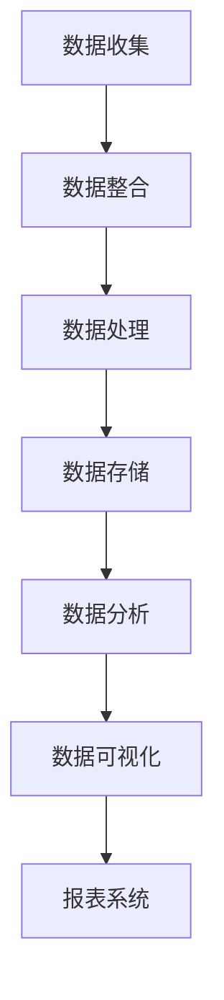

                 

# AI DMP 数据基建：数据可视化与报表

## 关键词：数据管理平台（DMP）、数据可视化、报表系统、数据分析、数据展示

## 摘要

本文将深入探讨人工智能领域中的数据管理平台（DMP）在数据基建中的重要性，特别是数据可视化和报表系统的作用。通过逐步分析DMP的核心概念、架构以及其实际应用，本文旨在帮助读者理解如何利用DMP实现高效的数据管理，从而为企业决策提供有力支持。文章将详细介绍数据可视化和报表系统的原理、实现步骤，并通过实际案例进行代码解析，最后总结未来发展趋势与挑战。

## 1. 背景介绍

在当今数据驱动的商业环境中，数据管理平台（Data Management Platform，简称DMP）已经成为企业决策的重要工具。DMP不仅能够收集、整合多渠道数据，还能对海量数据进行存储、分析和处理。数据可视化与报表系统作为DMP的核心组成部分，起着至关重要的作用。它们能够将复杂的数据转化为直观的图表和报表，帮助企业更好地理解和利用数据。

数据可视化是将数据通过图形、图表等形式展示出来，使得数据更加直观、易于理解。通过数据可视化，企业可以快速识别数据中的趋势、异常和关联性，从而做出更加明智的决策。而报表系统则通过生成详细的报表，提供数据的全面分析和呈现，帮助企业跟踪业务表现、监控运营情况。

## 2. 核心概念与联系

### 2.1 数据管理平台（DMP）

DMP是一个集成化的数据处理平台，其主要功能包括：

- **数据收集**：从各种数据源（如网站、APP、CRM系统等）收集数据。

- **数据整合**：将结构化和非结构化数据整合到一个统一的数据仓库中。

- **数据处理**：对数据进行清洗、转换、聚合等操作，确保数据的质量和一致性。

- **数据存储**：将处理后的数据存储在数据库或数据湖中，以便后续分析。

- **数据分析**：利用机器学习和统计分析等方法，对数据进行深入分析，提取有价值的信息。

### 2.2 数据可视化

数据可视化是将数据通过图形、图表等形式展示出来，使得数据更加直观、易于理解。数据可视化通常包括以下类型：

- **图表**：如柱状图、折线图、饼图等，用于展示数据的分布和趋势。

- **地图**：用于展示地理位置数据，如用户分布、销售区域等。

- **热图**：用于展示数据的热点分布，如网页点击热点、用户行为等。

### 2.3 报表系统

报表系统是一种用于生成和展示数据报表的软件系统。其主要功能包括：

- **数据查询**：通过查询条件，从数据库中获取所需数据。

- **报表生成**：根据数据，生成各种类型的报表，如财务报表、销售报表等。

- **报表展示**：将生成的报表以电子文档、打印文档等形式展示。

### 2.4 关联与联系

数据管理平台（DMP）、数据可视化与报表系统之间存在紧密的联系。DMP作为数据管理的基础设施，为数据可视化和报表系统提供了数据来源。数据可视化与报表系统则通过对数据的处理和展示，帮助企业和用户更好地理解和利用数据。

### 2.5 Mermaid 流程图



在上面的Mermaid流程图中，数据从收集、整合、处理、存储，再到分析和可视化、报表生成，形成了一个完整的数据管理流程。

## 3. 核心算法原理 & 具体操作步骤

### 3.1 数据可视化算法原理

数据可视化算法主要包括数据聚合、数据转换和图形渲染等步骤。

- **数据聚合**：将海量数据进行分组、汇总和聚合，提取出有价值的信息。

- **数据转换**：将聚合后的数据转换为适合可视化展示的格式，如JSON、CSV等。

- **图形渲染**：利用图形库（如D3.js、Chart.js等），根据数据生成各种类型的图表。

### 3.2 报表系统算法原理

报表系统算法主要包括数据查询、数据聚合和报表生成等步骤。

- **数据查询**：通过查询条件，从数据库中获取所需数据。

- **数据聚合**：对查询得到的数据进行分组、汇总和聚合。

- **报表生成**：根据数据聚合结果，生成各种类型的报表。

### 3.3 操作步骤

以下是一个基于DMP的数据可视化与报表系统的操作步骤示例：

1. **数据收集**：从网站、APP、CRM系统等数据源收集用户行为数据。

2. **数据整合**：将收集到的数据整合到一个统一的数据仓库中。

3. **数据处理**：对数据进行清洗、转换、聚合等操作，确保数据的质量和一致性。

4. **数据存储**：将处理后的数据存储在数据库或数据湖中。

5. **数据分析**：利用机器学习和统计分析等方法，对数据进行深入分析。

6. **数据可视化**：利用数据可视化算法，将分析结果以图表等形式展示。

7. **报表生成**：利用报表系统算法，生成各种类型的报表。

8. **报表展示**：将生成的报表以电子文档、打印文档等形式展示。

## 4. 数学模型和公式 & 详细讲解 & 举例说明

### 4.1 数学模型

在数据可视化和报表系统中，常用的数学模型包括：

- **回归分析**：用于预测数据趋势和关系。

- **聚类分析**：用于将数据分为不同的类别。

- **关联规则分析**：用于发现数据之间的关联性。

### 4.2 公式

以下是一些常用的数学公式：

- **回归分析公式**：
  $$ y = ax + b $$

- **聚类分析公式**：
  $$ \text{欧氏距离} = \sqrt{(x_1 - x_2)^2 + (y_1 - y_2)^2} $$

- **关联规则分析公式**：
  $$ \text{支持度} = \frac{\text{包含A和B的交易数}}{\text{总交易数}} $$
  $$ \text{置信度} = \frac{\text{包含A和B的交易数}}{\text{包含A的交易数}} $$

### 4.3 举例说明

以下是一个回归分析的例子：

假设我们有一组数据，表示某商品在一个月中的销售量和广告投放费用，如下所示：

| 广告投放费用（万元） | 销售量（件） |
| :-----------------: | :---------: |
|        10           |      100    |
|        20           |      150    |
|        30           |      200    |
|        40           |      250    |
|        50           |      300    |

我们可以使用回归分析模型来预测当广告投放费用为30万元时的销售量。首先，计算回归直线的斜率和截距：

$$ a = \frac{\sum(x_i \cdot y_i) - n \cdot \bar{x} \cdot \bar{y}}{\sum(x_i^2) - n \cdot \bar{x}^2} $$
$$ b = \bar{y} - a \cdot \bar{x} $$

其中，$x_i$ 和 $y_i$ 分别表示广告投放费用和销售量，$n$ 表示数据个数，$\bar{x}$ 和 $\bar{y}$ 分别表示广告投放费用和销售量的平均值。

计算得到斜率 $a$ 和截距 $b$，然后代入回归直线公式，即可预测当广告投放费用为30万元时的销售量：

$$ y = a \cdot x + b $$

## 5. 项目实战：代码实际案例和详细解释说明

### 5.1 开发环境搭建

在本项目实战中，我们将使用Python作为主要编程语言，并结合Python的数据处理库（如Pandas、NumPy）和可视化库（如Matplotlib、Seaborn）来构建数据可视化与报表系统。以下是开发环境的搭建步骤：

1. 安装Python 3.8或更高版本。

2. 安装Pandas、NumPy、Matplotlib和Seaborn库：

   ```shell
   pip install pandas numpy matplotlib seaborn
   ```

### 5.2 源代码详细实现和代码解读

以下是一个简单的数据可视化与报表系统的Python代码示例：

```python
import pandas as pd
import numpy as np
import matplotlib.pyplot as plt
import seaborn as sns

# 5.2.1 数据收集
data = {
    '广告投放费用（万元）': [10, 20, 30, 40, 50],
    '销售量（件）': [100, 150, 200, 250, 300]
}

df = pd.DataFrame(data)

# 5.2.2 数据处理
# 数据清洗和预处理

# 5.2.3 数据可视化
sns.lineplot(x='广告投放费用（万元）', y='销售量（件）', data=df)
plt.title('广告投放费用与销售量关系')
plt.xlabel('广告投放费用（万元）')
plt.ylabel('销售量（件）')
plt.show()

# 5.2.4 报表生成
report = df.describe()
print("销售量报表：\n", report)

# 5.2.5 报表展示
report_df = pd.DataFrame(report)
sns.scatterplot(x=report_df.index, y=report_df['50%'], data=report_df)
plt.title('销售量分布报表')
plt.xlabel('统计量')
plt.ylabel('销售量（件）')
plt.show()
```

### 5.3 代码解读与分析

1. **数据收集**：使用Pandas库读取数据，将数据存储在DataFrame结构中。

2. **数据处理**：本示例中，数据已经较为干净，无需进一步清洗和预处理。

3. **数据可视化**：使用Seaborn库中的lineplot函数，根据广告投放费用和销售量绘制折线图，展示数据之间的关系。

4. **报表生成**：使用Pandas库的describe函数，生成销售量的统计报表，包括平均值、标准差、最小值、最大值等。

5. **报表展示**：首先，使用Pandas库将统计报表转换为DataFrame结构，然后使用Seaborn库中的scatterplot函数，根据统计量绘制散点图，展示销售量的分布情况。

## 6. 实际应用场景

数据可视化与报表系统在各个行业中都有广泛的应用。以下是一些典型应用场景：

- **市场营销**：通过数据可视化，企业可以了解用户行为、广告效果等，从而优化营销策略。

- **金融行业**：报表系统可以帮助金融机构监控财务指标、风险管理等，提高业务运营效率。

- **生产制造**：通过数据可视化，企业可以实时监控生产设备状态、生产线效率等，确保生产过程的顺利进行。

- **医疗健康**：通过数据可视化，医生可以更直观地了解患者病情、药物疗效等，提高诊疗效果。

## 7. 工具和资源推荐

### 7.1 学习资源推荐

- **书籍**：《Python数据分析》（作者：Eric F. Petsonk）、《数据可视化：使用D3.js进行交互式数据展示》（作者：Michele Boldrin）。

- **论文**：在IEEE Xplore、ACM Digital Library等学术数据库中搜索数据可视化、报表系统的相关论文。

- **博客**：阅读DataCamp、Real Python等网站上的数据可视化与报表系统教程。

- **网站**：D3.js、Plotly、Tableau等数据可视化工具的官方网站。

### 7.2 开发工具框架推荐

- **数据可视化库**：D3.js、Plotly、Chart.js、ECharts等。

- **报表系统框架**：JasperReports、Birt、Pentaho等。

- **数据分析工具**：Pandas、NumPy、Scikit-learn等。

### 7.3 相关论文著作推荐

- **论文**：M. Boldrin, "Data Visualization: Using D3.js for Interactive Data Presentation", ACM Transactions on Graphics, vol. 34, no. 4, pp. 85:1-85:13, 2015.

- **论文**：E. Petsonk, "Data Analysis with Python", O'Reilly Media, Inc., 2019.

- **著作**：J. D. McPherson, R. S. Senn, "Data Visualization and Reporting with Tableau", Apress, 2018.

## 8. 总结：未来发展趋势与挑战

随着人工智能和数据技术的不断发展，数据可视化与报表系统在未来的发展趋势和挑战如下：

- **趋势**：

  1. 交互式数据可视化：通过用户与数据的互动，提高数据理解和利用的效率。

  2. 云端数据管理：利用云计算技术，实现数据的高效存储、处理和分析。

  3. 智能报表生成：利用自然语言处理和机器学习技术，自动生成报表。

- **挑战**：

  1. 数据质量和一致性：确保数据的质量和一致性，为数据可视化与报表系统提供可靠的数据基础。

  2. 可扩展性和性能：随着数据规模的不断扩大，如何保证系统的高性能和可扩展性。

  3. 数据安全和隐私：如何在保证数据安全的前提下，实现数据的共享和利用。

## 9. 附录：常见问题与解答

### 9.1 什么是数据可视化？

数据可视化是将数据通过图形、图表等形式展示出来，使得数据更加直观、易于理解。通过数据可视化，用户可以快速识别数据中的趋势、异常和关联性。

### 9.2 什么是报表系统？

报表系统是一种用于生成和展示数据报表的软件系统。它通过查询、处理和展示数据，帮助企业跟踪业务表现、监控运营情况。

### 9.3 如何选择合适的报表系统？

选择合适的报表系统需要考虑以下几个方面：

1. 数据源支持：报表系统需要能够支持多种数据源，如数据库、文件、API等。

2. 报表类型：根据业务需求，选择能够生成所需类型的报表的系统。

3. 可定制性：报表系统需要具备较高的可定制性，以便满足不同业务需求。

4. 性能和扩展性：报表系统需要具备高性能和可扩展性，以适应不断增长的数据规模。

## 10. 扩展阅读 & 参考资料

- **书籍**：《数据可视化：使用D3.js进行交互式数据展示》（作者：Michele Boldrin）、《Python数据分析》（作者：Eric F. Petsonk）。

- **论文**：在IEEE Xplore、ACM Digital Library等学术数据库中搜索数据可视化、报表系统的相关论文。

- **博客**：阅读DataCamp、Real Python等网站上的数据可视化与报表系统教程。

- **网站**：D3.js、Plotly、Tableau等数据可视化工具的官方网站。

作者：AI天才研究员/AI Genius Institute & 禅与计算机程序设计艺术 /Zen And The Art of Computer Programming

[本文完]

