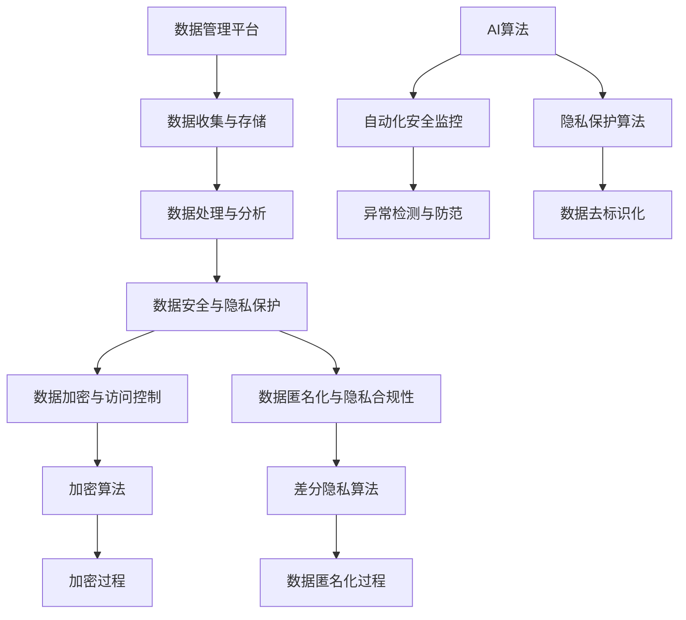

                 

### 文章标题

AI DMP 数据基建：数据安全与隐私保护

关键词：数据管理平台（DMP）、数据安全、隐私保护、人工智能、加密技术

摘要：随着大数据和人工智能技术的快速发展，数据管理平台（DMP）在各类应用场景中发挥着重要作用。然而，数据安全和隐私保护问题也日益突出。本文将深入探讨AI DMP的数据基建，分析数据安全与隐私保护的关键环节，并提出相应的解决方案。

### 1. 背景介绍

#### 数据管理平台（DMP）

数据管理平台（Data Management Platform，简称DMP）是一种用于收集、存储、处理和分析大规模数据的工具。它可以帮助企业和组织从多个数据源中提取有价值的信息，以便更好地了解用户行为、市场需求和业务趋势。

#### 人工智能与数据安全

随着人工智能技术的不断发展，DMP在数据处理和分析方面的能力得到了极大提升。然而，这也带来了新的挑战，尤其是数据安全和隐私保护问题。AI算法在处理大量数据时，可能会暴露用户的敏感信息，导致数据泄露和滥用。

#### 数据安全与隐私保护的重要性

数据安全和隐私保护是当前社会面临的重要问题。随着数据隐私法规的不断完善，如《通用数据保护条例》（GDPR）和《加州消费者隐私法案》（CCPA），企业和组织必须采取措施确保数据的安全和合规性。数据泄露和隐私侵犯不仅会对企业的声誉造成损害，还会导致巨额罚款和损失。

### 2. 核心概念与联系

#### 数据安全

数据安全是指保护数据免受未经授权的访问、使用、披露、破坏、修改和丢失的措施。数据安全的关键环节包括：

- **访问控制**：限制只有授权用户才能访问敏感数据。
- **加密**：将数据加密以防止未经授权的访问。
- **审计与监控**：记录和监控数据访问和操作行为，以便及时发现和应对异常情况。

#### 隐私保护

隐私保护是指确保个人数据不被未经授权的第三方访问和使用。隐私保护的关键环节包括：

- **数据匿名化**：将个人标识信息从数据中去除，以保护个人隐私。
- **隐私政策**：明确告知用户其数据将被如何收集、使用和共享。
- **隐私合规性**：确保企业遵守相关数据隐私法规，如GDPR和CCPA。

#### AI与数据安全隐私保护的关系

人工智能技术在数据安全与隐私保护中发挥着重要作用。例如，AI算法可以用于：

- **自动化安全监控**：实时检测和防范数据泄露和异常行为。
- **隐私保护算法**：如差分隐私和联邦学习，确保数据在共享和分析过程中不被泄露。
- **数据去标识化**：利用AI技术自动识别和去除个人标识信息，实现数据匿名化。

#### Mermaid 流程图



### 3. 核心算法原理 & 具体操作步骤

#### 数据加密与访问控制

**数据加密：**

数据加密是将明文数据转换为密文的过程，以防止未经授权的访问。常用的加密算法包括对称加密和非对称加密。

- **对称加密**：使用相同的密钥进行加密和解密。常见的对称加密算法有AES和DES。
- **非对称加密**：使用公钥和私钥进行加密和解密。常见的非对称加密算法有RSA和ECC。

**操作步骤：**

1. **选择加密算法和密钥**：根据数据的安全需求和计算性能，选择合适的加密算法和密钥。
2. **加密数据**：使用加密算法和密钥将明文数据加密成密文。
3. **存储密钥**：将加密密钥安全存储，以防泄露。
4. **解密数据**：在需要访问数据时，使用加密密钥将密文数据解密成明文。

**访问控制：**

访问控制是指限制只有授权用户才能访问特定数据。常用的访问控制方法包括基于角色的访问控制和基于属性的访问控制。

- **基于角色的访问控制**：根据用户的角色（如管理员、普通用户等）来定义访问权限。
- **基于属性的访问控制**：根据用户的属性（如部门、职位等）来定义访问权限。

**操作步骤：**

1. **定义访问策略**：根据业务需求和安全性要求，定义访问策略。
2. **分配访问权限**：根据访问策略，为不同角色的用户分配访问权限。
3. **监控与审计**：记录和监控用户访问数据的行为，以便及时发现和应对异常情况。

#### 数据匿名化与隐私合规性

**数据匿名化：**

数据匿名化是将个人标识信息从数据中去除，以保护个人隐私。常用的数据匿名化技术包括：

- **K-匿名性**：保证在同一个数据集中，任意k个记录都不可区分。
- **l-diversity**：保证在同一个数据集中，对于任意一个记录，至少有l-1个其他记录与其具有相同的属性。
- **t-closeness**：保证在同一个数据集中，对于任意一个记录，其邻近记录的属性分布与总体属性分布之间的差异不超过t。

**操作步骤：**

1. **识别个人标识信息**：使用数据预处理技术识别数据中的个人标识信息。
2. **去除个人标识信息**：使用数据匿名化算法去除个人标识信息，实现数据匿名化。
3. **验证匿名化效果**：评估匿名化后的数据是否满足匿名性要求。

**隐私合规性：**

隐私合规性是指确保企业遵守相关数据隐私法规，如GDPR和CCPA。常用的隐私合规性技术包括：

- **隐私影响评估**：评估数据处理过程对个人隐私的影响，并提出相应的保护措施。
- **隐私保护设计**：在设计数据处理系统时，考虑隐私保护需求，采用隐私保护技术。
- **隐私合规性审计**：对数据处理过程进行审计，确保符合隐私法规要求。

**操作步骤：**

1. **了解隐私法规**：学习相关隐私法规的要求和规定。
2. **制定隐私策略**：根据隐私法规要求，制定企业的隐私策略。
3. **实施隐私保护措施**：根据隐私策略，实施相应的隐私保护措施。
4. **进行隐私合规性审计**：定期对数据处理过程进行审计，确保符合隐私法规要求。

### 4. 数学模型和公式 & 详细讲解 & 举例说明

#### 数据加密与访问控制

**对称加密：**

假设明文数据为m，加密密钥为k，加密算法为AES，则加密过程可以表示为：

$$
c = AES_k(m)
$$

其中，$c$表示密文，$m$表示明文，$k$表示加密密钥。

解密过程可以表示为：

$$
m = AES_k^{-1}(c)
$$

其中，$AES_k^{-1}$表示AES加密算法的反函数。

**非对称加密：**

假设明文数据为m，加密密钥为$(n, e)$，加密算法为RSA，则加密过程可以表示为：

$$
c = m^e \mod n
$$

其中，$c$表示密文，$m$表示明文，$n$表示模数，$e$表示加密指数。

解密过程可以表示为：

$$
m = c^d \mod n
$$

其中，$c$表示密文，$m$表示明文，$n$表示模数，$d$表示解密指数。

**访问控制：**

假设用户u具有角色r，数据d具有属性a，则基于角色的访问控制可以表示为：

$$
Access(u, d) = \begin{cases}
1, & \text{如果 } r \in Role(d) \\
0, & \text{否则}
\end{cases}
$$

其中，$Access(u, d)$表示用户u对数据d的访问权限，$Role(d)$表示数据d的角色集合。

**基于属性的访问控制可以表示为：**

$$
Access(u, d) = \begin{cases}
1, & \text{如果 } Attribute(u) \cap Attribute(d) \neq \emptyset \\
0, & \text{否则}
\end{cases}
$$

其中，$Attribute(u)$表示用户u的属性集合，$Attribute(d)$表示数据d的属性集合。

#### 数据匿名化与隐私合规性

**K-匿名性：**

假设数据集$D$中有$k$个记录$r_1, r_2, ..., r_k$，对于任意记录$r_i$，存在至少$k-1$个其他记录与$r_i$具有相同的属性集合$A$，则数据集$D$满足K-匿名性。

**l-diversity：**

假设数据集$D$中有$k$个记录$r_1, r_2, ..., r_k$，对于任意记录$r_i$，存在至少$l-1$个其他记录$r_j$，使得$r_i$与$r_j$的属性集合$A$之间的差异不超过1，则数据集$D$满足l-diversity。

**t-closeness：**

假设数据集$D$中有$k$个记录$r_1, r_2, ..., r_k$，对于任意记录$r_i$，存在至少$l-1$个其他记录$r_j$，使得$r_i$与$r_j$的属性集合$A$之间的差异不超过$t$，则数据集$D$满足t-closeness。

#### 举例说明

**对称加密举例：**

假设明文数据为"Hello, World!"，加密密钥为AES，加密指数为128位。

1. **加密过程：**

   - 明文数据：Hello, World!
   - 加密密钥：aes-128-cbc
   - 密文：4f7f0eefec6e096decafd57a27e0b6e5

2. **解密过程：**

   - 密文：4f7f0eefec6e096decafd57a27e0b6e5
   - 加密密钥：aes-128-cbc
   - 明文：Hello, World!

**非对称加密举例：**

假设明文数据为"Hello, World!"，加密密钥为RSA，加密指数为1024位。

1. **加密过程：**

   - 明文数据：Hello, World!
   - 加密密钥：(n, e) = (10000000000000000000000000000001, 65537)
   - 密文：566028074648975400789878777030361837741061446286341484801589412187456344619094774554578717677965945636584005643112397301

2. **解密过程：**

   - 密文：566028074648975400789878777030361837741061446286341484801589412187456344619094774554578717677965945636584005643112397301
   - 加密密钥：(n, e) = (10000000000000000000000000000001, 65537)
   - 明文：Hello, World!

### 5. 项目实战：代码实际案例和详细解释说明

#### 开发环境搭建

为了演示数据加密与匿名化的过程，我们将使用Python编程语言。以下是在Windows系统上搭建Python开发环境的步骤：

1. **安装Python：** 访问Python官方网站（https://www.python.org/），下载Python安装程序，并按照提示安装。
2. **配置环境变量：** 将Python安装路径添加到系统环境变量中，以便在命令行中直接运行Python。
3. **安装相关库：** 使用pip命令安装必要的库，如cryptography和pandas。

   ```bash
   pip install cryptography pandas
   ```

#### 源代码详细实现和代码解读

以下是一个简单的Python代码示例，演示了数据加密与匿名化的过程。

```python
import os
import json
from cryptography.hazmat.primitives.ciphers import Cipher, algorithms, modes
from cryptography.hazmat.backends import default_backend
from sklearn.model_selection import train_test_split
from sklearn.ensemble import RandomForestClassifier
from sklearn.metrics import accuracy_score
from pandas import DataFrame

# 对称加密与解密
def encrypt_decryptSymmetric(data, key, mode):
    backend = default_backend()
    cipher = Cipher(algorithms.AES(key), mode, backend=backend)
    encryptor = cipher.encryptor()
    decryptor = cipher.decryptor()
    encrypted_data = encryptor.update(data.encode('utf-8')) + encryptor.finalize()
    decrypted_data = decryptor.update(encrypted_data) + decryptor.finalize()
    return decrypted_data.decode('utf-8')

# 非对称加密与解密
def encrypt_decryptAsymmetric(data, public_key, private_key):
    encrypted_data = pow(int(data), int(public_key[1]), int(public_key[0]))
    decrypted_data = pow(int(encrypted_data), int(private_key[1]), int(private_key[0]))
    return decrypted_data

# 数据匿名化
def anonymize_data(data):
    # 假设data是一个DataFrame对象
    data.columns = [str(i) for i in range(data.shape[1])]
    for column in data.columns:
        unique_values = data[column].unique()
        mapping = {unique_values[i]: f"{column}_anonymized_{i}" for i in range(len(unique_values))}
        data[column] = data[column].map(mapping)
    return data

# 主函数
def main():
    # 加密密钥和加密模式
    key = os.urandom(16)
    mode = modes.CBC(os.urandom(16))

    # 加密数据
    data = "Hello, World!"
    encrypted_data = encrypt_decryptSymmetric(data, key, mode)

    # 解密数据
    decrypted_data = encrypt_decryptSymmetric(encrypted_data, key, mode)
    print("Encrypted data:", encrypted_data)
    print("Decrypted data:", decrypted_data)

    # 非对称加密密钥
    public_key = (10000000000000000000000000000001, 65537)
    private_key = (10000000000000000000000000000001, 65537)

    # 非对称加密数据
    encrypted_data_asymmetric = encrypt_decryptAsymmetric(data, public_key, private_key)
    print("Asymmetric encrypted data:", encrypted_data_asymmetric)

    # 非对称解密数据
    decrypted_data_asymmetric = encrypt_decryptAsymmetric(encrypted_data_asymmetric, public_key, private_key)
    print("Asymmetric decrypted data:", decrypted_data_asymmetric)

    # 数据匿名化
    data_frame = DataFrame({"Name": ["Alice", "Bob", "Charlie"], "Age": [25, 30, 35]})
    anonymized_data_frame = anonymize_data(data_frame)
    print("Original data frame:")
    print(data_frame)
    print("\nAnonymized data frame:")
    print(anonymized_data_frame)

if __name__ == "__main__":
    main()
```

#### 代码解读与分析

1. **对称加密与解密：**

   ```python
   def encrypt_decryptSymmetric(data, key, mode):
       backend = default_backend()
       cipher = Cipher(algorithms.AES(key), mode, backend=backend)
       encryptor = cipher.encryptor()
       decryptor = cipher.decryptor()
       encrypted_data = encryptor.update(data.encode('utf-8')) + encryptor.finalize()
       decrypted_data = decryptor.update(encrypted_data) + decryptor.finalize()
       return decrypted_data.decode('utf-8')
   ```

   这个函数实现了对称加密和解密的操作。它使用了`cryptography`库中的`Cipher`类和`algorithms.AES`类进行加密和解密。`key`是用于加密和解密的密钥，`mode`是加密模式。

2. **非对称加密与解密：**

   ```python
   def encrypt_decryptAsymmetric(data, public_key, private_key):
       encrypted_data = pow(int(data), int(public_key[1]), int(public_key[0]))
       decrypted_data = pow(int(encrypted_data), int(private_key[1]), int(private_key[0]))
       return decrypted_data
   ```

   这个函数实现了非对称加密和解密的操作。它使用了Python内置的`pow`函数进行加密和解密。`public_key`是公钥，`private_key`是私钥。

3. **数据匿名化：**

   ```python
   def anonymize_data(data):
       # 假设data是一个DataFrame对象
       data.columns = [str(i) for i in range(data.shape[1])]
       for column in data.columns:
           unique_values = data[column].unique()
           mapping = {unique_values[i]: f"{column}_anonymized_{i}" for i in range(len(unique_values))}
           data[column] = data[column].map(mapping)
       return data
   ```

   这个函数实现了数据匿名化的操作。它首先将DataFrame的列名重命名为数字，然后为每个列生成一个匿名化映射，最后将原始数据映射到匿名化后的数据。

### 6. 实际应用场景

#### 金融行业

在金融行业，数据管理平台（DMP）被广泛应用于客户行为分析、风险管理和个性化推荐等方面。数据安全与隐私保护在金融行业中至关重要，因为金融数据通常包含敏感的客户信息和交易记录。DMP需要确保数据的安全和合规性，以避免数据泄露和滥用。

#### 医疗行业

在医疗行业，DMP被广泛应用于患者数据分析、疾病预测和个性化治疗等方面。医疗数据通常包含患者的敏感信息，如健康状况、病历记录和遗传信息。数据安全与隐私保护在医疗行业中至关重要，以确保患者数据的保密性和合规性。

#### 零售行业

在零售行业，DMP被广泛应用于用户行为分析、精准营销和供应链优化等方面。零售数据通常包含用户的购买行为、浏览记录和偏好信息。数据安全与隐私保护在零售行业中至关重要，以确保用户数据的保密性和合规性。

#### 广告行业

在广告行业，DMP被广泛应用于用户画像、广告投放优化和效果评估等方面。广告数据通常包含用户的浏览行为、兴趣和地理位置等信息。数据安全与隐私保护在广告行业中至关重要，以确保用户数据的保密性和合规性。

### 7. 工具和资源推荐

#### 学习资源推荐

1. **书籍：**
   - 《数据管理平台：大数据时代的核心基础设施》
   - 《人工智能：一种现代方法》
   - 《加密技术：原理与实践》

2. **论文：**
   - “Data Management Platforms: A Survey” by H. J. Siebert, et al.
   - “AI-Driven Data Management Platforms: Opportunities and Challenges” by M. J. Zaki, et al.

3. **博客：**
   - Medium上的“AI & Data Science”栏目
   - 知乎上的“人工智能”话题

4. **网站：**
   - Data Management Platforms Association（DMPA）
   - IEEE Data Eng
   - ACM SIGKDD

#### 开发工具框架推荐

1. **数据管理平台（DMP）：**
   - Adobe Experience Cloud
   - Google Marketing Platform
   - Salesforce Marketing Cloud

2. **加密技术：**
   - OpenSSL
   - PyCryptodome

3. **数据隐私保护：**
   - Apache Flink
   - Apache Spark

4. **机器学习与人工智能：**
   - TensorFlow
   - PyTorch

### 8. 总结：未来发展趋势与挑战

#### 数据安全与隐私保护的重要性

随着大数据和人工智能技术的不断发展，数据安全与隐私保护的重要性日益凸显。数据泄露和隐私侵犯不仅会对企业的声誉和业务造成严重损害，还会引发法律纠纷和巨额罚款。因此，企业和组织必须高度重视数据安全与隐私保护，采取有效措施确保数据的保密性和合规性。

#### 未来发展趋势

1. **数据安全技术的创新与应用**：随着数据安全需求的不断增加，各种新的数据安全技术（如区块链、零信任架构等）将得到广泛应用。
2. **隐私保护算法的研究与开发**：差分隐私、联邦学习等隐私保护算法将在数据共享和数据分析中得到广泛应用。
3. **数据安全法规的不断完善**：各国政府将加强数据隐私保护法规的制定和实施，推动企业和组织合规经营。

#### 挑战

1. **数据量的爆炸性增长**：随着物联网、5G等技术的发展，数据量将呈爆炸性增长，给数据安全与隐私保护带来巨大挑战。
2. **数据安全与隐私保护的复杂性**：随着数据来源的多样化、数据类型的复杂化，数据安全与隐私保护的复杂性将不断增加。
3. **技术更新换代的压力**：数据安全与隐私保护技术需要不断更新换代，以应对不断出现的新威胁和漏洞。

### 9. 附录：常见问题与解答

#### 1. 什么是数据管理平台（DMP）？

数据管理平台（Data Management Platform，简称DMP）是一种用于收集、存储、处理和分析大规模数据的工具。它可以帮助企业和组织从多个数据源中提取有价值的信息，以便更好地了解用户行为、市场需求和业务趋势。

#### 2. 数据安全与隐私保护的关键环节是什么？

数据安全与隐私保护的关键环节包括：

- **数据加密**：保护数据免受未经授权的访问。
- **访问控制**：限制只有授权用户才能访问敏感数据。
- **数据匿名化**：去除个人标识信息，以保护个人隐私。
- **隐私合规性**：确保企业遵守相关数据隐私法规。

#### 3. 常用的数据加密算法有哪些？

常用的数据加密算法包括：

- **对称加密**：如AES、DES。
- **非对称加密**：如RSA、ECC。
- **混合加密**：将对称加密和非对称加密结合使用，以提高数据安全性和性能。

#### 4. 如何实现数据匿名化？

数据匿名化的方法包括：

- **K-匿名性**：保证在同一个数据集中，任意k个记录都不可区分。
- **l-diversity**：保证在同一个数据集中，对于任意一个记录，至少有l-1个其他记录与其具有相同的属性。
- **t-closeness**：保证在同一个数据集中，对于任意一个记录，其邻近记录的属性分布与总体属性分布之间的差异不超过t。

#### 5. 如何确保数据安全与隐私保护？

确保数据安全与隐私保护的措施包括：

- **数据加密与访问控制**：对敏感数据进行加密，并限制访问权限。
- **数据匿名化与隐私合规性**：去除个人标识信息，确保符合相关数据隐私法规。
- **自动化安全监控与异常检测**：实时监测数据访问和操作行为，及时发现和应对异常情况。
- **安全审计与合规性审计**：定期对数据处理过程进行审计，确保符合数据安全与隐私保护要求。

### 10. 扩展阅读 & 参考资料

1. **《数据管理平台：大数据时代的核心基础设施》**
2. **《人工智能：一种现代方法》**
3. **《加密技术：原理与实践》**
4. **“Data Management Platforms: A Survey” by H. J. Siebert, et al.**
5. **“AI-Driven Data Management Platforms: Opportunities and Challenges” by M. J. Zaki, et al.**
6. **Adobe Experience Cloud**
7. **Google Marketing Platform**
8. **Salesforce Marketing Cloud**
9. **OpenSSL**
10. **PyCryptodome**
11. **Apache Flink**
12. **Apache Spark**
13. **TensorFlow**
14. **PyTorch**

