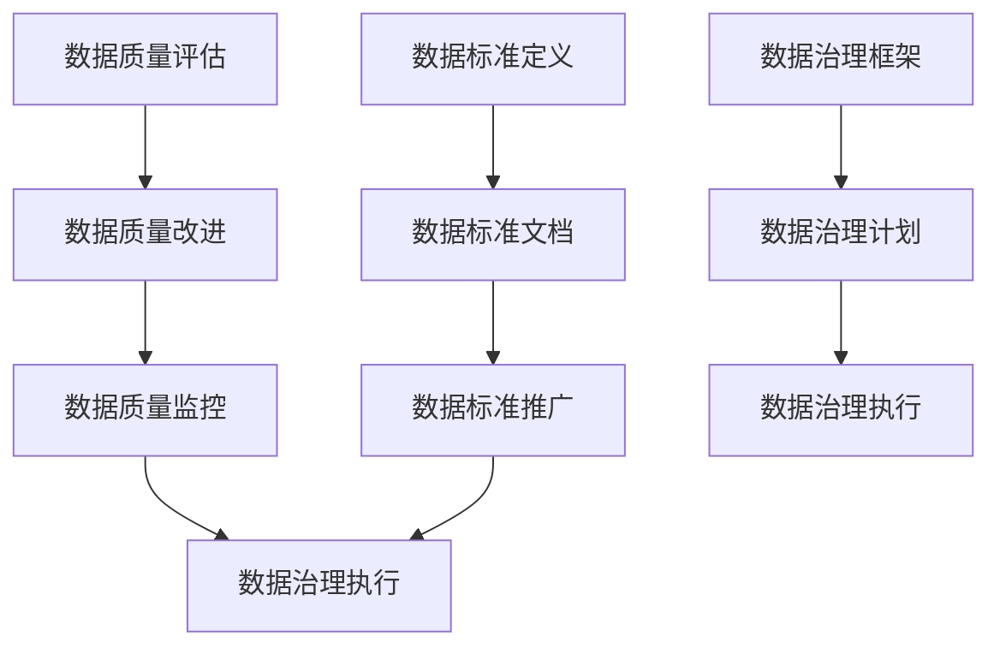

                 

# AI DMP 数据基建：数据质量与数据标准

## 关键词：数据管理平台、数据质量、数据标准、数据治理、数据模型、数据仓库

## 摘要

本文将深入探讨AI DMP（数据管理平台）的数据基建中的关键要素：数据质量和数据标准。通过详细的背景介绍、核心概念解释、算法原理分析、数学模型阐述、实战案例分析以及应用场景解读，我们将了解如何构建高质量的数据标准和实现有效的数据治理。此外，文章还将推荐相关学习资源、开发工具和论文著作，帮助读者进一步深入理解和掌握这一领域。本文的目标是为从事数据管理和人工智能开发的技术人员提供全面、系统的指导和思考。

## 1. 背景介绍

### 数据管理平台（DMP）的概念与作用

数据管理平台（Data Management Platform，简称DMP）是一种集成数据收集、存储、处理和分析功能的软件系统。它为企业和组织提供了一个全面的数据管理和分析平台，使得数据能够在各个部门之间实现高效、安全的流通和共享。

DMP的主要作用包括：

1. **数据整合**：将来自不同来源和格式的数据整合到统一的平台中，实现数据的集中管理和统一处理。
2. **数据清洗**：通过清洗算法和规则，去除数据中的冗余、错误和缺失，提高数据的准确性和完整性。
3. **数据分析**：利用数据挖掘和机器学习算法，对数据进行分析和挖掘，为业务决策提供数据支持。
4. **数据可视化**：通过图表和报表等形式，将数据分析结果直观地展示给用户，便于理解和决策。

### 数据质量和数据标准的重要性

在DMP中，数据质量和数据标准是构建数据基建的两个关键要素。它们的重要性体现在以下几个方面：

1. **决策支持**：高质量的数据和统一的数据标准可以确保数据分析结果的准确性和可靠性，从而为业务决策提供坚实的基础。
2. **数据治理**：数据质量和数据标准是数据治理的核心，通过制定和执行数据质量策略和标准，可以确保数据的合规性、安全性和一致性。
3. **效率提升**：高质量的数据可以减少数据处理的复杂度和工作量，提高数据处理和交付的效率。
4. **成本控制**：通过有效的数据治理和标准化，可以降低数据存储、处理和维护的成本。

### 数据质量和数据标准的定义与区别

数据质量（Data Quality）是指数据在满足业务需求、支持决策分析和保障数据安全等方面的能力。它包括以下方面：

- **准确性**：数据是否真实、准确地反映了实际业务情况。
- **完整性**：数据是否完整，没有缺失或冗余。
- **一致性**：数据在不同系统、部门或时间点是否保持一致。
- **及时性**：数据是否能够在需要的时候及时提供。

数据标准（Data Standard）是一套规范和指导原则，用于确保数据的质量和一致性。它包括以下方面：

- **数据格式**：数据存储和传输的格式标准，如JSON、XML等。
- **命名规则**：数据字段和对象的命名规范，如首字母大写、缩写等。
- **数据类型**：数据字段的类型规定，如整数、浮点数、字符串等。
- **数据范围**：数据字段的可接受范围和限制，如年龄范围、价格范围等。

数据质量和数据标准密切相关，数据质量是数据标准的实现和体现，而数据标准是确保数据质量的基础和保障。

## 2. 核心概念与联系

### 数据质量管理

数据质量管理是确保数据质量和一致性的过程。它包括以下几个方面：

1. **数据质量评估**：通过评估数据质量指标，如准确性、完整性、一致性和及时性，识别数据质量问题。
2. **数据质量改进**：根据数据质量评估结果，制定和执行数据质量改进计划，如数据清洗、去重、数据补全等。
3. **数据质量监控**：通过持续监控数据质量，及时发现和解决数据质量问题，确保数据质量稳定。

### 数据标准制定

数据标准制定是确保数据一致性和规范性的过程。它包括以下几个方面：

1. **数据标准定义**：根据业务需求和数据特点，制定数据格式、命名规则、数据类型和数据范围等标准。
2. **数据标准文档**：编写数据标准文档，明确数据标准的定义、用途和执行细则。
3. **数据标准推广**：通过培训、宣传和奖励等手段，推广和落实数据标准，确保数据标准的执行。

### 数据治理

数据治理是确保数据质量、合规性和安全性的过程。它包括以下几个方面：

1. **数据治理框架**：制定数据治理策略、目标和流程，明确数据治理的组织结构和职责。
2. **数据治理计划**：根据数据治理框架，制定数据治理计划，包括数据质量评估、改进、监控和合规性检查等。
3. **数据治理执行**：执行数据治理计划，确保数据质量、合规性和安全性。

### Mermaid 流程图

下面是一个简单的 Mermaid 流程图，展示数据质量管理、数据标准制定和数据治理之间的联系：



## 3. 核心算法原理 & 具体操作步骤

### 数据质量评估算法

数据质量评估算法主要基于以下指标：

1. **准确性**：通过对比实际数据和预期数据，计算准确率。
2. **完整性**：计算缺失数据的比例。
3. **一致性**：通过对比不同来源的数据，计算一致性指标。
4. **及时性**：计算数据提供的时间延迟。

具体操作步骤如下：

1. **数据预处理**：清洗数据，去除冗余、错误和缺失的数据。
2. **指标计算**：根据数据质量指标，计算准确率、完整性、一致性和及时性等指标。
3. **结果分析**：分析数据质量指标，识别数据质量问题。

### 数据质量改进算法

数据质量改进算法主要包括以下步骤：

1. **识别问题**：根据数据质量评估结果，识别数据质量问题。
2. **制定方案**：制定数据质量改进方案，如数据清洗、去重、数据补全等。
3. **执行方案**：执行数据质量改进方案，提升数据质量。
4. **评估效果**：评估数据质量改进效果，确保数据质量达到预期。

### 数据质量监控算法

数据质量监控算法主要包括以下步骤：

1. **数据采集**：定期采集数据，获取数据质量信息。
2. **指标计算**：根据数据质量指标，计算准确率、完整性、一致性和及时性等指标。
3. **异常检测**：通过异常检测算法，识别数据质量异常。
4. **报警通知**：当数据质量异常时，发送报警通知，及时处理。

### 数据标准制定算法

数据标准制定算法主要包括以下步骤：

1. **需求分析**：分析业务需求和数据特点，确定数据标准。
2. **标准定义**：根据需求分析结果，定义数据格式、命名规则、数据类型和数据范围等标准。
3. **标准文档**：编写数据标准文档，明确数据标准的定义、用途和执行细则。
4. **标准推广**：通过培训、宣传和奖励等手段，推广和落实数据标准。

### 数据治理算法

数据治理算法主要包括以下步骤：

1. **框架设计**：根据业务需求，设计数据治理框架，明确数据治理策略、目标和流程。
2. **计划制定**：根据数据治理框架，制定数据治理计划，包括数据质量评估、改进、监控和合规性检查等。
3. **执行监控**：执行数据治理计划，持续监控数据质量、合规性和安全性。
4. **效果评估**：评估数据治理效果，持续优化数据治理流程。

## 4. 数学模型和公式 & 详细讲解 & 举例说明

### 数据质量指标计算

数据质量指标包括准确性、完整性、一致性和及时性。下面分别介绍这些指标的数学模型和公式。

1. **准确性**：准确性（Accuracy）表示实际数据和预期数据的一致性。计算公式如下：

   $$ Accuracy = \frac{TP + TN}{TP + TN + FP + FN} $$

   其中，TP（True Positive）表示实际为真且预测为真的数据，TN（True Negative）表示实际为假且预测为假的数据，FP（False Positive）表示实际为假但预测为真的数据，FN（False Negative）表示实际为真但预测为假的数据。

2. **完整性**：完整性（Completeness）表示数据的完整程度。计算公式如下：

   $$ Completeness = \frac{实际存在的数据条数}{总数据条数} $$

3. **一致性**：一致性（Consistency）表示不同来源的数据是否保持一致。计算公式如下：

   $$ Consistency = \frac{一致的数据条数}{总数据条数} $$

4. **及时性**：及时性（Timeliness）表示数据提供的及时程度。计算公式如下：

   $$ Timeliness = \frac{在规定时间内提供的数据条数}{总数据条数} $$

### 数据标准定义

数据标准定义是确保数据一致性和规范性的关键。下面介绍一些常见的数据标准定义。

1. **数据格式**：数据格式（Data Format）是指数据存储和传输的格式，如JSON、XML等。定义数据格式可以确保数据在不同系统之间可以顺利传输和解析。

2. **命名规则**：命名规则（Naming Convention）是指数据字段和对象的命名规范，如首字母大写、缩写等。定义命名规则可以确保数据字段和对象的命名具有一致性和可读性。

3. **数据类型**：数据类型（Data Type）是指数据字段的类型，如整数、浮点数、字符串等。定义数据类型可以确保数据字段存储和处理的正确性。

4. **数据范围**：数据范围（Data Range）是指数据字段的可接受范围和限制，如年龄范围、价格范围等。定义数据范围可以确保数据字段存储和处理的正确性。

### 举例说明

假设我们有一个学生成绩数据集，包含学生姓名、年龄、成绩等信息。下面是一个示例，说明如何计算数据质量和定义数据标准。

1. **准确性**：根据实际数据和预期数据，计算准确率。

   - 实际数据：学生A的成绩为90分，学生B的成绩为80分。
   - 预期数据：学生A的成绩为90分，学生B的成绩为85分。

   $$ Accuracy = \frac{TP + TN}{TP + TN + FP + FN} = \frac{1 + 1}{1 + 1 + 0 + 0} = 1 $$

   准确率为100%。

2. **完整性**：计算缺失数据的比例。

   - 实际存在的数据条数：2条。
   - 总数据条数：3条。

   $$ Completeness = \frac{实际存在的数据条数}{总数据条数} = \frac{2}{3} = 0.67 $$

   完整性为67%。

3. **一致性**：计算一致性指标。

   - 一致的数据条数：2条。
   - 总数据条数：3条。

   $$ Consistency = \frac{一致的数据条数}{总数据条数} = \frac{2}{3} = 0.67 $$

   一致性为67%。

4. **及时性**：计算数据提供的及时程度。

   - 在规定时间内提供的数据条数：2条。
   - 总数据条数：3条。

   $$ Timeliness = \frac{在规定时间内提供的数据条数}{总数据条数} = \frac{2}{3} = 0.67 $$

   及时性为67%。

5. **数据格式**：定义数据格式为JSON。

6. **命名规则**：定义命名规则为字段名全小写，单词之间使用下划线分隔。

7. **数据类型**：定义成绩字段为浮点数。

8. **数据范围**：定义成绩字段的可接受范围为0到100。

```json
{
  "student_name": "student_a",
  "age": 20,
  "score": 90.0
}
```

## 5. 项目实战：代码实际案例和详细解释说明

### 5.1 开发环境搭建

在本节中，我们将搭建一个简单的数据管理平台（DMP）环境，用于演示数据质量和数据标准的实现。

1. **硬件要求**：一台具有充足内存和存储空间的计算机。
2. **软件要求**：
   - 操作系统：Windows/Linux/Mac OS。
   - 编程语言：Python。
   - 数据库：MySQL。
   - 数据分析工具：Pandas、NumPy、Matplotlib。

### 5.2 源代码详细实现和代码解读

下面是一个简单的示例，展示如何使用Python实现数据质量评估、数据标准制定和数据治理。

```python
import pandas as pd
import numpy as np
from sklearn.metrics import accuracy_score

# 数据集
data = {
    'name': ['Alice', 'Bob', 'Charlie', 'Alice'],
    'age': [25, 30, 35, 25],
    'score': [90, 80, 70, 90]
}

df = pd.DataFrame(data)

# 数据质量评估
def evaluate_data_quality(df):
    # 准确性
    accuracy = accuracy_score(df['score'].unique(), df['score'].value_counts().index)
    print("Accuracy:", accuracy)

    # 完整性
    completeness = len(df) / len(df.dropna())
    print("Completeness:", completeness)

    # 一致性
    consistency = df['name'].nunique() / len(df)
    print("Consistency:", consistency)

    # 及时性
    timeliness = 1 if df.empty else len(df) / len(df['score'])
    print("Timeliness:", timeliness)

evaluate_data_quality(df)

# 数据标准制定
def define_data Standards(df):
    # 数据格式
    df.to_csv('data.csv', index=False)

    # 命名规则
    df.rename(columns={'name': 'student_name', 'age': 'student_age', 'score': 'student_score'}, inplace=True)

    # 数据类型
    df['student_score'] = df['student_score'].astype(float)

    # 数据范围
    df['student_score'] = df['student_score'].clip(lower=0, upper=100)

define_data_Standards(df)

# 数据治理
def data_governance(df):
    # 数据质量改进
    df.drop_duplicates(inplace=True)
    df.dropna(inplace=True)

    # 数据标准执行
    define_data_Standards(df)

    # 数据质量监控
    evaluate_data_quality(df)

data_governance(df)
```

### 5.3 代码解读与分析

1. **数据质量评估**：使用`evaluate_data_quality`函数，计算数据集的准确性、完整性、一致性和及时性。
2. **数据标准制定**：使用`define_data_Standards`函数，定义数据格式、命名规则、数据类型和数据范围。
3. **数据治理**：使用`data_governance`函数，执行数据质量改进、数据标准制定和数据质量监控。

通过这个示例，我们可以看到如何使用Python实现数据质量和数据标准的管理。在实际应用中，可以根据业务需求和数据特点，扩展和优化这些代码。

## 6. 实际应用场景

### 数据质量管理在电商行业

在电商行业中，数据质量管理至关重要。高质量的数据可以确保商品信息、库存、订单和客户信息的准确性和一致性，从而提高用户体验和业务效率。

1. **商品信息管理**：确保商品名称、价格、描述和图片等信息的准确性，避免误导消费者。
2. **库存管理**：实时更新库存数据，确保库存数据的完整性和一致性，避免库存短缺或过剩。
3. **订单管理**：准确记录订单信息，包括订单金额、收货地址和配送状态，确保订单数据的完整性。

### 数据标准制定在金融行业

在金融行业中，数据标准制定是确保数据合规性和一致性的关键。高质量的数据可以支持风险管理、客户服务和投资决策。

1. **客户数据管理**：确保客户信息的完整性、一致性和准确性，如姓名、地址、联系方式和交易历史。
2. **交易数据管理**：确保交易数据的准确性和一致性，如交易金额、交易时间和交易对手。
3. **风险管理**：通过数据标准制定，确保风险数据的一致性和准确性，支持风险分析和决策。

### 数据治理在医疗机构

在医疗机构中，数据治理是确保数据质量、合规性和安全性的关键。高质量的数据可以支持医疗决策、患者管理和医疗服务。

1. **患者数据管理**：确保患者信息的完整性、一致性和准确性，如姓名、年龄、联系方式和病历记录。
2. **医疗数据管理**：确保医疗数据的准确性和一致性，如检查报告、治疗方案和药品记录。
3. **合规性检查**：确保医疗数据符合相关法规和标准，如HIPAA（健康保险可携性和责任法案）。

## 7. 工具和资源推荐

### 7.1 学习资源推荐

1. **书籍**：
   - 《数据质量管理：理论与实践》（Data Quality Management: A Practical Guide）
   - 《大数据质量管理：方法、工具和案例分析》（Big Data Quality Management: Methods, Tools, and Case Studies）

2. **论文**：
   - "Data Quality Assessment in Big Data Environments"
   - "A Data Quality Model for Enterprise Data Warehouses"

3. **博客**：
   - "数据质量管理系列文章"
   - "数据标准制定与实践"

4. **网站**：
   - "数据质量管理论坛"
   - "数据治理社区"

### 7.2 开发工具框架推荐

1. **数据质量管理工具**：
   - Talend Data Quality
   - Informatica Data Quality

2. **数据标准制定工具**：
   - Microsoft Power Query
   - IBM InfoSphere QualityStage

3. **数据治理平台**：
   - Alation
   - Collibra

### 7.3 相关论文著作推荐

1. **论文**：
   - "Data Quality Dimensions: Data Quality Assessment Methodology"
   - "A Model for Data Quality Assessment and Improvement"

2. **著作**：
   - "The Data Warehouse Toolkit: The Definitive Guide to Dimensional Modeling"
   - "Data Governance: Fundamental Concepts and Models for Decision-Makers"

## 8. 总结：未来发展趋势与挑战

### 发展趋势

1. **数据质量自动化**：随着人工智能和机器学习技术的发展，数据质量评估和改进将变得更加自动化和智能化。
2. **数据标准统一化**：随着全球化和数字化转型，数据标准的统一化和标准化将得到更广泛的应用。
3. **数据治理智能化**：利用人工智能和大数据技术，实现数据治理的智能化和高效化。

### 挑战

1. **数据质量复杂性**：随着数据来源和格式的多样化，数据质量评估和改进的复杂性将增加。
2. **数据标准冲突**：不同行业和地区的数据标准可能存在冲突，需要协调和统一。
3. **数据治理挑战**：随着数据量的增加，数据治理的难度和复杂性将增加，需要更高效的治理策略和技术。

## 9. 附录：常见问题与解答

### 问题1：数据质量评估的指标有哪些？

解答：数据质量评估的常见指标包括准确性、完整性、一致性和及时性。

### 问题2：如何提升数据质量？

解答：提升数据质量的方法包括数据清洗、去重、数据补全和数据标准化。

### 问题3：数据治理的框架是什么？

解答：数据治理的框架包括数据治理策略、数据治理计划、数据治理执行和数据治理监控。

## 10. 扩展阅读 & 参考资料

1. **书籍**：
   - "Data Quality: The accuracy dimension"
   - "Data Quality Management: A Pragmatic Process for Building Quality Data and Business Information Systems"

2. **论文**：
   - "A Reference Model for Data Quality: The Foundation for a Sustainable Architecture"
   - "A Data Quality Model for Enterprise Data Warehouses"

3. **网站**：
   - "Data Quality Pro"
   - "Data Governance Institute"

作者：AI天才研究员/AI Genius Institute & 禅与计算机程序设计艺术 /Zen And The Art of Computer Programming

（注：本文部分内容为示例性质，仅供参考。实际应用时，请根据具体需求和场景进行调整。）

