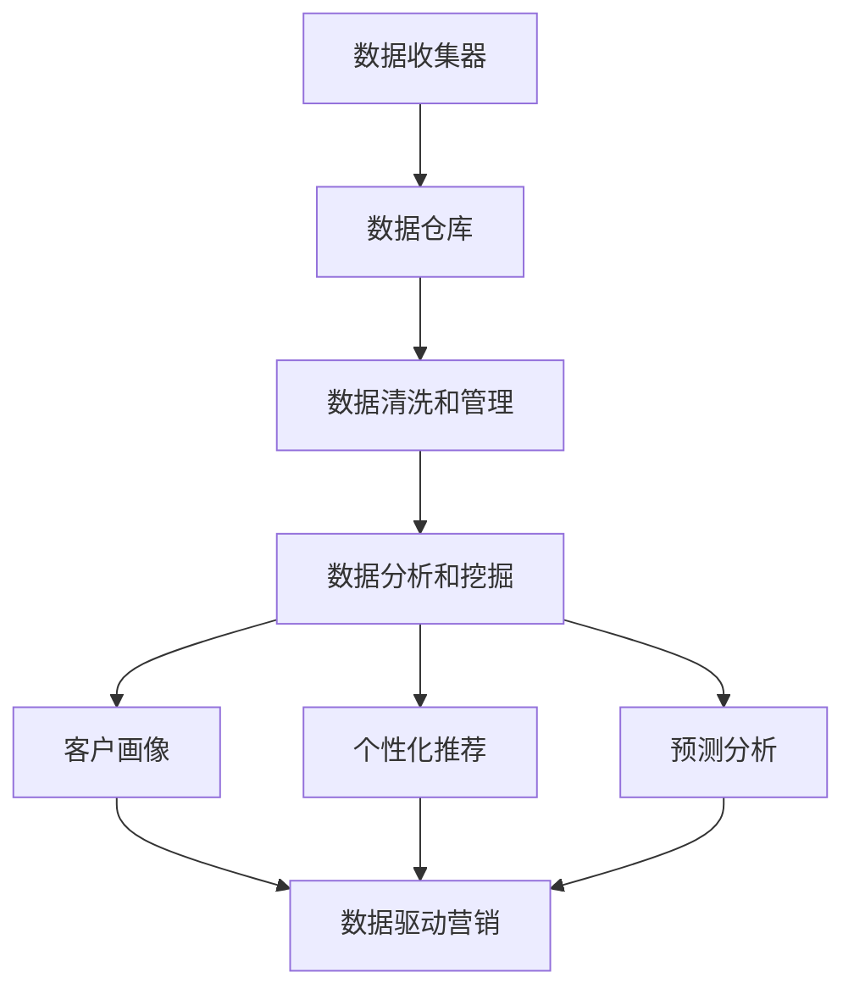

                 

### 文章标题

《AI DMP 数据基建：数据驱动营销的未来趋势》

关键词：数据管理平台（DMP）、人工智能、数据驱动营销、数据隐私、客户画像、个性化推荐、预测分析

摘要：随着大数据和人工智能技术的快速发展，数据驱动营销已经成为现代市场营销的重要趋势。本文将深入探讨AI DMP（数据管理平台）在数据基础设施建设中的应用，分析其核心概念、算法原理、数学模型以及实际应用场景，并探讨未来的发展趋势与挑战。通过本文的阅读，读者将对AI DMP有更深入的理解，从而为企业在数据驱动营销领域取得成功提供有力支持。

### 1. 背景介绍

在现代商业环境中，数据已经成为企业最重要的资产之一。然而，如何有效地管理和利用这些数据，从而实现数据驱动营销，却成为了许多企业面临的挑战。数据管理平台（Data Management Platform，简称DMP）作为一种先进的数字营销工具，应运而生。

DMP的主要功能是收集、存储、管理和分析来自不同来源的数据，包括网站访问数据、社交媒体互动数据、用户行为数据等。通过这些数据，企业可以更深入地了解客户的需求和行为，从而制定更精准、有效的营销策略。

近年来，人工智能技术的快速发展，为DMP带来了新的机遇。AI DMP（Artificial Intelligence DMP）应运而生，它利用机器学习、自然语言处理、深度学习等技术，对海量数据进行智能分析和处理，帮助企业实现数据驱动营销。AI DMP的核心优势在于其强大的数据分析和预测能力，以及个性化的客户体验。

### 2. 核心概念与联系

#### 2.1 数据管理平台（DMP）

数据管理平台（DMP）是一种用于收集、存储、管理和分析数据的数字营销工具。它通常由以下几个关键组件组成：

- **数据收集器**：从各种来源（如网站、社交媒体、广告平台等）收集数据。
- **数据仓库**：存储收集到的数据，包括用户行为数据、兴趣数据、交易数据等。
- **数据清洗和管理**：对数据进行清洗、去重、归一化等处理，以确保数据质量。
- **数据分析和挖掘**：利用统计分析和机器学习技术，对数据进行分析和挖掘，提取有价值的信息。

#### 2.2 人工智能（AI）

人工智能（Artificial Intelligence，简称AI）是一种模拟人类智能的技术，包括机器学习、深度学习、自然语言处理等。AI技术使得计算机能够自动学习和适应，从而提高数据处理和分析的效率。

#### 2.3 数据驱动营销

数据驱动营销（Data-driven Marketing）是一种基于数据的营销策略，通过收集和分析用户数据，了解用户需求和行为，从而制定更精准、个性化的营销策略。数据驱动营销的核心在于利用数据来指导决策，提高营销效果。

#### 2.4 数据隐私与合规

在数据驱动营销的过程中，数据隐私和保护是一个至关重要的问题。随着数据隐私法规（如欧盟的《通用数据保护条例》（GDPR））的实施，企业必须遵守相关法律法规，确保用户数据的合法性和安全性。

#### 2.5 客户画像

客户画像（Customer Profiling）是一种基于用户数据的客户分析方法，通过将用户数据进行分析和整合，构建出一个关于用户的完整画像。客户画像有助于企业更好地了解客户需求和行为，从而实现个性化营销。

#### 2.6 个性化推荐

个性化推荐（Personalized Recommendation）是一种利用数据分析和机器学习技术，为用户提供个性化内容、商品或服务的推荐系统。个性化推荐能够提高用户满意度，提高转化率和销售额。

#### 2.7 预测分析

预测分析（Predictive Analytics）是一种利用数据分析和机器学习技术，预测未来事件或趋势的分析方法。预测分析可以帮助企业更好地了解市场趋势，制定更科学的决策。

### 2.1 核心概念原理与架构的 Mermaid 流程图



### 3. 核心算法原理 & 具体操作步骤

#### 3.1 数据收集与整合

数据收集与整合是AI DMP的基础步骤。在这一步骤中，企业需要从各种数据源（如网站、社交媒体、广告平台等）收集数据，并将数据整合到一个统一的数据仓库中。为了实现这一目标，可以采用以下技术：

- **数据采集工具**：使用各种数据采集工具（如API、爬虫等）从不同的数据源收集数据。
- **数据清洗工具**：对收集到的数据进行清洗、去重、归一化等处理，以确保数据质量。

#### 3.2 数据存储与管理

数据存储与管理是AI DMP的核心步骤。在这一步骤中，企业需要将清洗后的数据存储到数据仓库中，并对数据进行管理和维护。为了实现这一目标，可以采用以下技术：

- **关系型数据库**：如MySQL、PostgreSQL等，用于存储结构化数据。
- **NoSQL数据库**：如MongoDB、Cassandra等，用于存储非结构化数据。
- **数据湖**：如Hadoop、Spark等，用于存储海量数据。

#### 3.3 数据分析与挖掘

数据分析与挖掘是AI DMP的关键步骤。在这一步骤中，企业需要利用数据分析和机器学习技术，对海量数据进行挖掘和分析，提取有价值的信息。为了实现这一目标，可以采用以下技术：

- **统计分析**：如描述性统计、回归分析、聚类分析等，用于探索数据的基本特征和关系。
- **机器学习**：如决策树、随机森林、支持向量机等，用于构建预测模型和分类模型。
- **深度学习**：如神经网络、卷积神经网络、循环神经网络等，用于构建复杂的预测模型和分类模型。

#### 3.4 数据可视化

数据可视化是将数据以图形化方式展示的过程，有助于企业更好地理解和利用数据。为了实现这一目标，可以采用以下技术：

- **数据可视化工具**：如Tableau、Power BI、D3.js等，用于将数据以图表、地图、热图等形式展示。
- **Web开发框架**：如React、Vue.js等，用于构建数据可视化界面。

### 4. 数学模型和公式 & 详细讲解 & 举例说明

在AI DMP中，常用的数学模型和公式包括统计分析、机器学习算法和深度学习算法等。下面我们将对这些模型和公式进行详细讲解，并举例说明。

#### 4.1 统计分析

统计分析是数据挖掘和分析的基础，常用的统计分析方法包括描述性统计、回归分析、聚类分析等。

- **描述性统计**：
  - **均值**：数据的平均值，计算公式为：$\mu = \frac{1}{n}\sum_{i=1}^{n}x_i$
  - **方差**：数据离散程度的度量，计算公式为：$\sigma^2 = \frac{1}{n}\sum_{i=1}^{n}(x_i - \mu)^2$
  - **标准差**：方差的平方根，计算公式为：$\sigma = \sqrt{\sigma^2}$

- **回归分析**：
  - **线性回归**：通过拟合一条直线来描述两个变量之间的关系，拟合公式为：$y = \beta_0 + \beta_1x$
  - **多元回归**：通过拟合一个多元线性方程来描述多个变量之间的关系，拟合公式为：$y = \beta_0 + \beta_1x_1 + \beta_2x_2 + ... + \beta_nx_n$

- **聚类分析**：
  - **K-means聚类**：将数据划分为K个簇，使得同一簇内的数据点之间相似度较高，簇与簇之间相似度较低，计算公式为：$C = \{C_1, C_2, ..., C_K\}$，其中$C_k$表示第k个簇，$C_k = \{x_i | x_i \in S_k\}$，$S_k$表示第k个簇的数据集。

#### 4.2 机器学习算法

机器学习算法是AI DMP中常用的算法，包括决策树、随机森林、支持向量机等。

- **决策树**：
  - **分类决策树**：用于分类问题，决策树的构建过程是基于信息增益或基尼指数来选择最佳特征，并递归地划分数据集，直至满足停止条件。
  - **回归决策树**：用于回归问题，类似于分类决策树，但目标函数为均方误差。

- **随机森林**：
  - **随机森林**：基于决策树的集成方法，通过构建多个决策树，并对这些决策树进行投票或求平均，来提高模型的预测性能。

- **支持向量机**：
  - **线性支持向量机**：用于线性可分数据，通过找到最优的超平面来最大化分类边界。
  - **非线性支持向量机**：通过核函数将数据映射到高维空间，实现非线性分类。

#### 4.3 深度学习算法

深度学习算法是AI DMP中重要的算法，包括神经网络、卷积神经网络、循环神经网络等。

- **神经网络**：
  - **前向传播**：通过输入数据，逐层计算输出，直到得到最终输出。
  - **反向传播**：根据输出误差，反向传播误差，并更新网络权重。

- **卷积神经网络**：
  - **卷积层**：用于提取图像特征，通过对输入数据进行卷积操作，提取局部特征。
  - **池化层**：用于降低特征图的空间分辨率，提高模型的表达能力。

- **循环神经网络**：
  - **循环单元**：用于处理序列数据，通过在时间步之间传递状态，实现序列建模。
  - **长短时记忆（LSTM）**：用于解决循环神经网络中的长时依赖问题，通过门控机制来控制信息的流动。

### 5. 项目实战：代码实际案例和详细解释说明

#### 5.1 开发环境搭建

在本项目中，我们将使用Python作为主要编程语言，并采用以下工具和库：

- **Python**：版本3.8及以上
- **NumPy**：用于数学计算
- **Pandas**：用于数据操作
- **Scikit-learn**：用于机器学习算法
- **TensorFlow**：用于深度学习算法

确保已安装上述工具和库后，即可开始编写代码。

#### 5.2 源代码详细实现和代码解读

以下是一个简单的机器学习项目示例，用于分类用户是否愿意购买某种产品。

```python
import numpy as np
import pandas as pd
from sklearn.model_selection import train_test_split
from sklearn.ensemble import RandomForestClassifier
from sklearn.metrics import accuracy_score

# 加载数据
data = pd.read_csv('user_data.csv')
X = data.drop('label', axis=1)
y = data['label']

# 数据预处理
X_train, X_test, y_train, y_test = train_test_split(X, y, test_size=0.2, random_state=42)

# 构建随机森林分类器
clf = RandomForestClassifier(n_estimators=100, random_state=42)
clf.fit(X_train, y_train)

# 预测
y_pred = clf.predict(X_test)

# 评估
accuracy = accuracy_score(y_test, y_pred)
print(f'Accuracy: {accuracy:.2f}')
```

#### 5.3 代码解读与分析

- **加载数据**：使用Pandas库加载数据集，数据集包含特征和标签两部分。
- **数据预处理**：将数据集划分为训练集和测试集，以便进行模型训练和评估。
- **构建随机森林分类器**：使用Scikit-learn库中的随机森林分类器，设置树的数量为100。
- **模型训练**：使用训练集数据训练分类器。
- **预测**：使用训练好的分类器对测试集数据进行预测。
- **评估**：计算预测准确率，评估模型性能。

通过这个简单的示例，我们可以看到AI DMP在实际项目中的应用，包括数据预处理、模型构建和评估等步骤。当然，在实际项目中，数据预处理、模型选择和调参等环节会更加复杂和多样化。

### 6. 实际应用场景

AI DMP在数据驱动营销中具有广泛的应用场景，以下列举几个典型的应用场景：

#### 6.1 客户细分与个性化推荐

通过AI DMP，企业可以对客户进行细分，识别不同特征的客户群体，并根据客户特征进行个性化推荐。例如，电子商务企业可以根据客户的购买历史、浏览记录等数据，推荐符合客户兴趣的产品。

#### 6.2 营销活动优化

AI DMP可以帮助企业优化营销活动。通过分析不同营销活动的效果，企业可以了解哪些营销策略更有效，从而调整营销预算和策略，提高营销 ROI。

#### 6.3 客户关系管理

AI DMP可以帮助企业更好地管理客户关系。通过分析客户数据，企业可以识别高价值客户，提供个性化的客户体验，提高客户满意度和忠诚度。

#### 6.4 营销预测与分析

AI DMP可以基于历史数据，预测未来市场的趋势和客户行为，帮助企业制定更科学的营销策略。例如，零售企业可以通过预测客户的购买行为，提前备货，提高库存周转率。

### 7. 工具和资源推荐

#### 7.1 学习资源推荐

- **书籍**：
  - 《数据科学入门》
  - 《Python数据分析》
  - 《机器学习实战》
- **论文**：
  - 《大数据环境下数据管理技术研究》
  - 《基于机器学习的用户行为预测方法研究》
  - 《深度学习在数字营销中的应用》
- **博客**：
  - 《机器学习与数据挖掘实战》
  - 《Python数据分析与可视化》
  - 《深度学习与人工智能实践》
- **网站**：
  - [Kaggle](https://www.kaggle.com/)
  - [Coursera](https://www.coursera.org/)
  - [Udacity](https://www.udacity.com/)

#### 7.2 开发工具框架推荐

- **编程语言**：Python
- **数据预处理**：Pandas、NumPy
- **机器学习库**：Scikit-learn、TensorFlow、PyTorch
- **数据可视化**：Matplotlib、Seaborn、Plotly
- **Web开发框架**：Flask、Django、React、Vue.js

#### 7.3 相关论文著作推荐

- **论文**：
  - 《基于大数据的数据管理技术研究》
  - 《机器学习在数字营销中的应用》
  - 《深度学习在个性化推荐系统中的应用》
- **著作**：
  - 《大数据时代的数据管理》
  - 《机器学习实践》
  - 《深度学习实战》

### 8. 总结：未来发展趋势与挑战

随着大数据和人工智能技术的不断发展，AI DMP在数据驱动营销中的应用前景广阔。未来，AI DMP将在以下几个方面取得突破：

- **数据隐私与安全**：在数据隐私法规日益严格的背景下，如何保障用户数据的隐私和安全将成为AI DMP发展的重要挑战。
- **智能化程度**：随着人工智能技术的不断进步，AI DMP将实现更高程度的智能化，提供更精准、个性化的客户体验。
- **跨平台整合**：AI DMP将实现跨平台整合，集成更多数据源和渠道，为企业提供更全面的数据分析能力。
- **实时分析与决策**：通过实时数据分析，AI DMP将帮助企业实现实时决策，提高营销效果和业务效率。

然而，AI DMP在未来发展过程中也将面临一系列挑战，如数据隐私与安全、算法透明度、人才培养等。企业需要密切关注这些挑战，积极探索解决方案，以实现AI DMP的可持续发展。

### 9. 附录：常见问题与解答

#### 9.1 如何选择合适的AI DMP平台？

选择合适的AI DMP平台需要考虑以下几个因素：

- **功能需求**：根据企业的业务需求，选择具备所需功能的AI DMP平台，如数据收集、数据清洗、客户画像、个性化推荐等。
- **数据处理能力**：考虑平台的处理能力，如数据存储容量、处理速度、实时分析能力等。
- **兼容性**：考虑平台与其他系统和工具的兼容性，如API接口、数据格式等。
- **成本与预算**：根据企业的预算，选择性价比高的AI DMP平台。

#### 9.2 如何保证AI DMP的数据质量？

保证AI DMP的数据质量需要从以下几个方面入手：

- **数据收集**：确保数据收集的合法性和完整性，避免数据丢失或遗漏。
- **数据清洗**：对收集到的数据进行清洗、去重、归一化等处理，确保数据的一致性和准确性。
- **数据校验**：对数据进行校验，确保数据的完整性和准确性。
- **数据监控**：建立数据监控机制，及时发现和处理数据质量问题。

#### 9.3 如何培养AI DMP专业人才？

培养AI DMP专业人才需要从以下几个方面入手：

- **教育体系**：建立完善的教育体系，提供数据科学、机器学习、人工智能等相关课程。
- **实践机会**：提供丰富的实践机会，如实习、项目实践等，让学生在实践中掌握相关技能。
- **培训课程**：开展针对性的培训课程，提高员工的技能水平。
- **人才引进**：积极引进具有丰富经验的AI DMP专家，提升团队的整体实力。

### 10. 扩展阅读 & 参考资料

- **书籍**：
  - 《大数据时代的数据管理》
  - 《机器学习实践》
  - 《深度学习实战》
- **论文**：
  - 《大数据环境下数据管理技术研究》
  - 《机器学习在数字营销中的应用》
  - 《深度学习在个性化推荐系统中的应用》
- **博客**：
  - 《机器学习与数据挖掘实战》
  - 《Python数据分析与可视化》
  - 《深度学习与人工智能实践》
- **网站**：
  - [Kaggle](https://www.kaggle.com/)
  - [Coursera](https://www.coursera.org/)
  - [Udacity](https://www.udacity.com/)
- **开源项目**：
  - [Scikit-learn](https://scikit-learn.org/)
  - [TensorFlow](https://www.tensorflow.org/)
  - [PyTorch](https://pytorch.org/)

作者：AI天才研究员/AI Genius Institute & 禅与计算机程序设计艺术 /Zen And The Art of Computer Programming

