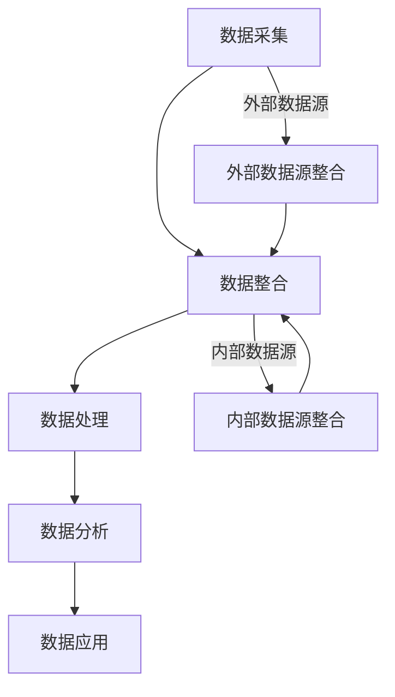

                 

### 背景介绍

在当今数字化时代，数据被视为新的黄金资源，而如何高效地管理和利用数据已经成为各个行业关注的焦点。特别是在市场营销领域，数据驱动的决策正逐渐取代传统的经验判断，成为企业制定战略和执行策略的核心依据。

### 数据驱动的营销

数据驱动的营销指的是基于数据分析，通过精准洞察用户行为和市场动态，实现个性化推荐、精准营销和高效转化。其核心在于通过数据挖掘、数据分析和数据可视化等技术手段，提取出有价值的信息，指导营销决策。

随着互联网的普及和大数据技术的发展，越来越多的企业开始重视数据的价值，并尝试将其应用于市场营销中。然而，如何构建一个稳定、高效的数据基础设施，成为企业能否成功实施数据驱动营销的关键。

### AI DMP 数据管理平台

在此背景下，AI DMP（数据管理平台）应运而生。AI DMP 是一种基于人工智能技术，用于收集、整合、管理和激活用户数据的平台。它不仅可以帮助企业实现数据的全面整合，还能够通过智能分析，为营销活动提供决策支持。

AI DMP 的主要功能包括：用户数据的收集与整合、用户分群的建立、用户行为的分析、营销策略的优化和效果评估等。通过 AI DMP，企业可以更好地理解用户需求，提高营销ROI（投资回报率）。

### 数据基建的重要性

数据基建是构建 AI DMP 的基础。它包括了数据采集、存储、处理、分析和应用的各个环节。一个强大且稳定的数据基建，不仅能够保证数据的准确性和完整性，还能提高数据处理的效率，为 AI DMP 提供强有力的支持。

对于企业来说，构建完善的数据基建具有重要意义。首先，它可以帮助企业实现数据的全面整合，消除信息孤岛，提高数据利用率。其次，它可以为企业的决策提供数据支撑，减少决策的盲目性。最后，它还能够提高企业的响应速度，帮助企业在激烈的市场竞争中占据优势。

### 本文结构

本文将围绕 AI DMP 数据基建进行深入探讨，主要包括以下内容：

1. **核心概念与联系**：介绍 AI DMP 的核心概念，并使用 Mermaid 流程图展示其原理和架构。
2. **核心算法原理与具体操作步骤**：详细讲解 AI DMP 中涉及的关键算法，以及如何使用这些算法进行数据处理和分析。
3. **数学模型和公式**：介绍 AI DMP 中使用的数学模型和公式，并进行详细讲解和举例说明。
4. **项目实战**：通过一个实际的代码案例，展示如何使用 AI DMP 进行数据处理和分析。
5. **实际应用场景**：分析 AI DMP 在不同行业中的应用场景，探讨其带来的实际价值。
6. **工具和资源推荐**：推荐一些相关的学习资源、开发工具和框架，帮助读者更好地理解和应用 AI DMP。
7. **总结：未来发展趋势与挑战**：总结 AI DMP 数据基建的现状，探讨其未来发展趋势和面临的挑战。
8. **附录：常见问题与解答**：回答一些关于 AI DMP 数据基建的常见问题。
9. **扩展阅读与参考资料**：提供一些相关的扩展阅读和参考资料，帮助读者深入了解 AI DMP 数据基建。

通过本文的阅读，读者将能够全面了解 AI DMP 数据基建的原理、方法和应用，从而在数据驱动的营销中取得更好的效果。接下来，我们将逐步深入探讨 AI DMP 的核心概念和架构。### 核心概念与联系

在深入探讨 AI DMP（数据管理平台）的核心概念和架构之前，我们需要首先了解几个关键术语：数据采集、数据整合、数据处理、数据分析和数据应用。这些术语是构建 AI DMP 数据基建的基石，也是实现数据驱动营销的重要环节。

#### 数据采集

数据采集是数据管理平台的第一步，它涉及到从各种数据源获取数据。这些数据源可以是企业的内部系统，如CRM（客户关系管理）、ERP（企业资源规划）系统，也可以是外部的互联网数据，如社交媒体、搜索引擎等。数据采集的关键在于确保数据的准确性和完整性，避免数据丢失或不一致。

#### 数据整合

数据整合是指将来自不同数据源的数据进行合并和清洗，以便进行进一步的分析和处理。这一过程通常涉及到数据的去重、格式转换和缺失值处理等。数据整合的目的是消除信息孤岛，实现数据的全面整合，为后续的数据分析和应用奠定基础。

#### 数据处理

数据处理是指对整合后的数据进行分析、清洗、转换和存储等操作。数据处理的核心在于提高数据的质量和可用性，为数据分析和应用提供高质量的数据支持。常用的数据处理方法包括数据清洗、数据转换、数据聚合和数据归一化等。

#### 数据分析

数据分析是指利用统计、机器学习等方法对数据进行挖掘和分析，提取出有价值的信息和洞察。数据分析可以帮助企业了解用户行为、市场趋势和业务状况，从而指导营销决策。数据分析的方法包括描述性分析、推断性分析和预测性分析等。

#### 数据应用

数据应用是指将分析结果应用于实际的业务场景中，如个性化推荐、精准营销和业务优化等。数据应用的目标是提高业务的效率、降低成本和提升用户体验。数据应用的效果取决于数据分析的深度和广度，以及企业的业务理解和执行能力。

#### AI DMP 架构

AI DMP 的核心架构通常包括以下几个主要模块：

1. **数据采集模块**：负责从各种数据源采集数据，包括内部数据源和外部数据源。
2. **数据整合模块**：将采集到的数据进行整合、清洗和去重，确保数据的质量和一致性。
3. **数据处理模块**：对整合后的数据进行分析、转换和存储，为后续的数据分析和应用提供支持。
4. **数据分析模块**：利用统计、机器学习等方法对数据进行分析，提取出有价值的信息和洞察。
5. **数据应用模块**：将分析结果应用于实际的业务场景中，如个性化推荐、精准营销和业务优化等。

#### Mermaid 流程图

为了更直观地展示 AI DMP 的核心概念和架构，我们可以使用 Mermaid 流程图来描述其工作流程。以下是 AI DMP 的 Mermaid 流程图：



在这个流程图中，A 表示数据采集模块，负责从各种数据源采集数据；B 表示数据整合模块，负责将采集到的数据整合、清洗和去重；C 表示数据处理模块，负责对数据进行分析、转换和存储；D 表示数据分析模块，负责利用统计、机器学习等方法对数据进行分析；E 表示数据应用模块，负责将分析结果应用于实际的业务场景中。F 和 G 分别表示外部数据源和内部数据源的整合模块，它们将外部和内部数据源的数据整合到 B 模块中。

通过这个 Mermaid 流程图，我们可以清晰地看到 AI DMP 的核心概念和架构，以及各个模块之间的联系和作用。这为后续的详细讲解和实际应用提供了基础。### 核心算法原理 & 具体操作步骤

在 AI DMP（数据管理平台）中，核心算法的设计和实现是确保数据高效处理和分析的关键。这些算法涉及到数据采集、数据整合、数据处理、数据分析和数据应用等各个环节。下面，我们将详细讲解 AI DMP 中几个关键算法的原理，并给出具体操作步骤。

#### 数据采集算法

数据采集算法主要负责从各种数据源（如内部系统、外部网络、传感器等）获取数据。一个典型的数据采集算法通常包括以下步骤：

1. **数据源识别**：识别需要采集的数据源，包括内部系统和外部网络。
2. **连接数据源**：建立与数据源的连接，如通过API接口、网络爬虫或数据库连接等方式。
3. **数据抽取**：从数据源中抽取数据，如使用 SQL 查询、网络抓包或传感器读取等方式。
4. **数据清洗**：对抽取到的数据进行初步清洗，如去除重复记录、处理缺失值和异常值等。

具体操作步骤如下：

1. **识别数据源**：首先，我们需要确定需要采集的数据源。例如，如果我们要采集一个电商平台的用户行为数据，我们需要确定这个平台提供的API接口，以及需要采集的用户行为数据类型，如浏览历史、购买记录等。

2. **建立连接**：接下来，我们需要建立与数据源的连接。对于 API 接口，我们可以使用 HTTP 请求的方法，如 GET 或 POST，向数据源发送请求，获取数据。对于网络爬虫，我们需要编写爬虫程序，模拟用户的网络行为，从网站上下载数据。对于传感器，我们需要使用相应的编程接口，如串口通信或网络通信，读取传感器数据。

3. **数据抽取**：一旦建立了连接，我们就可以开始从数据源中抽取数据。对于 API 接口，我们可以使用 JSON 或 XML 格式获取数据；对于网络爬虫，我们可以使用 HTML 解析库，如 BeautifulSoup 或 Puppeteer，从网页中提取数据；对于传感器，我们可以使用编程库，如 Python 的 serial 模块，读取传感器数据。

4. **数据清洗**：在抽取到数据后，我们需要对数据进行初步清洗。这包括去除重复记录、处理缺失值和异常值等。例如，对于电商平台的用户行为数据，我们需要去除重复的浏览记录，对于缺失的购买记录，我们可以使用平均值或中位数进行填充，对于异常的浏览时间，我们可以使用阈值判断进行过滤。

#### 数据整合算法

数据整合算法负责将来自不同数据源的数据进行合并和清洗，确保数据的质量和一致性。一个典型的数据整合算法通常包括以下步骤：

1. **数据合并**：将来自不同数据源的数据进行合并，形成一个完整的数据集。
2. **数据清洗**：对合并后的数据进行清洗，包括去除重复记录、处理缺失值和异常值等。
3. **数据标准化**：将不同数据源的数据进行标准化处理，使其具有相同的格式和度量单位。

具体操作步骤如下：

1. **数据合并**：首先，我们需要将不同数据源的数据进行合并。例如，如果我们要整合一个电商平台的用户行为数据和购买数据，我们需要将这两个数据集按照用户 ID 进行合并，形成一个完整的数据集。

2. **数据清洗**：在数据合并后，我们需要对数据进行清洗。这包括去除重复记录、处理缺失值和异常值等。例如，我们可以使用 SQL 查询，删除重复的用户记录；使用均值或中位数填充缺失的购买记录；使用阈值判断过滤异常的用户行为数据。

3. **数据标准化**：接下来，我们需要对数据进行标准化处理，使其具有相同的格式和度量单位。例如，如果我们要将不同数据源的时间格式统一为 ISO 8601 标准，或者将不同数据源的货币单位统一为美元。

#### 数据处理算法

数据处理算法负责对整合后的数据进行分析、转换和存储，为后续的数据分析和应用提供支持。一个典型的数据处理算法通常包括以下步骤：

1. **数据转换**：将数据转换为适合分析和存储的格式，如将 CSV 文件转换为 JSON 格式，或将文本数据转换为数字编码。
2. **数据存储**：将处理后的数据存储到数据库或数据仓库中，以便后续的分析和应用。
3. **数据归一化**：对数据进行归一化处理，使其具有相同的尺度，便于比较和分析。

具体操作步骤如下：

1. **数据转换**：首先，我们需要将数据转换为适合分析和存储的格式。例如，如果我们要分析一个电商平台的用户行为数据，我们需要将 CSV 文件转换为 JSON 格式，以便使用 Python 的 pandas 库进行数据分析。

2. **数据存储**：接下来，我们需要将处理后的数据存储到数据库或数据仓库中。例如，我们可以使用 MySQL 数据库，将用户行为数据存储到相应的表结构中。

3. **数据归一化**：最后，我们需要对数据进行归一化处理，使其具有相同的尺度。例如，如果我们要比较不同用户的行为数据，我们需要将用户的行为数据归一化到相同的度量单位，如访问次数、购买金额等。

#### 数据分析算法

数据分析算法负责利用统计、机器学习等方法对数据进行分析，提取出有价值的信息和洞察。一个典型的数据分析算法通常包括以下步骤：

1. **特征提取**：从数据中提取出有用的特征，用于描述用户行为或市场动态。
2. **模型训练**：使用机器学习算法，如决策树、随机森林、支持向量机等，对数据进行建模和训练。
3. **模型评估**：评估模型的性能，如准确率、召回率、F1 分数等。
4. **结果输出**：将分析结果输出，如用户分群、个性化推荐等。

具体操作步骤如下：

1. **特征提取**：首先，我们需要从数据中提取出有用的特征。例如，如果我们要对电商平台的用户行为数据进行分析，我们可以提取用户的浏览历史、购买记录、评分等特征。

2. **模型训练**：接下来，我们使用机器学习算法，如决策树、随机森林等，对数据进行建模和训练。例如，我们可以使用 Scikit-learn 库，实现一个决策树模型，对用户行为数据进行分类。

3. **模型评估**：然后，我们需要评估模型的性能。例如，我们可以使用交叉验证的方法，评估决策树模型的准确率、召回率等指标。

4. **结果输出**：最后，我们将分析结果输出。例如，我们可以根据模型的结果，将用户分为不同的分群，或为用户推荐个性化的商品。

#### 数据应用算法

数据应用算法负责将分析结果应用于实际的业务场景中，如个性化推荐、精准营销和业务优化等。一个典型的数据应用算法通常包括以下步骤：

1. **结果解释**：解释分析结果，了解用户行为或市场动态。
2. **策略制定**：根据分析结果，制定相应的营销策略或业务策略。
3. **策略实施**：实施策略，如调整广告投放、优化商品推荐等。
4. **效果评估**：评估策略的效果，如 ROI（投资回报率）、转化率等。

具体操作步骤如下：

1. **结果解释**：首先，我们需要解释分析结果，了解用户行为或市场动态。例如，根据用户分群的结果，我们可以了解不同用户群体的特征和需求。

2. **策略制定**：接下来，我们根据分析结果，制定相应的营销策略或业务策略。例如，我们可以针对不同的用户群体，制定个性化的广告投放策略，或调整商品推荐策略。

3. **策略实施**：然后，我们需要实施策略。例如，我们可以使用广告投放平台，根据用户分群的结果，调整广告投放的方向和内容。

4. **效果评估**：最后，我们需要评估策略的效果。例如，我们可以通过分析广告投放的 ROI 和转化率，了解策略的实际效果。

通过上述核心算法的原理和具体操作步骤，我们可以看到 AI DMP 在数据处理和分析中的应用。这些算法不仅确保了数据的准确性和完整性，还为企业的营销决策提供了有力的支持。接下来，我们将进一步探讨 AI DMP 中使用的数学模型和公式，以及如何进行详细讲解和举例说明。### 数学模型和公式 & 详细讲解 & 举例说明

在 AI DMP 中，数学模型和公式是核心组件，用于数据分析和决策支持。以下将介绍几个关键模型和公式，并进行详细讲解和举例说明。

#### 1. 用户分群模型

用户分群模型用于将用户划分为不同的群体，以便进行针对性的营销活动。常见的用户分群模型包括 K-means 算法、层次聚类算法和基于密度的聚类算法等。

**K-means 算法**

K-means 算法是一种基于距离的聚类算法，其目标是将数据集划分为 K 个簇，使得每个簇内的数据点之间的距离最小，簇与簇之间的距离最大。

**公式：**
$$
\min_{\mu_1, \mu_2, \ldots, \mu_k} \sum_{i=1}^n \sum_{j=1}^k \frac{1}{n_k} \sum_{x_i \in S_j} ||x_i - \mu_j||^2
$$
其中，$x_i$ 表示数据集中的第 i 个数据点，$\mu_j$ 表示第 j 个簇的中心，$S_j$ 表示第 j 个簇的数据点集合，$n_k$ 表示第 k 个簇中的数据点数量。

**例子：**

假设我们有 100 个用户数据点，特征包括年龄、收入和购买行为。我们希望使用 K-means 算法将这 100 个用户划分为 3 个群体。

1. 随机初始化 3 个簇的中心。
2. 计算每个用户与簇中心的距离，将用户分配到最近的簇。
3. 重新计算每个簇的中心。
4. 重复步骤 2 和 3，直到簇中心不再变化或达到最大迭代次数。

通过多次迭代，我们可以将用户划分为 3 个群体，每个群体的特征如下：

| 簇 | 年龄 | 收入 | 购买行为 |
| --- | --- | --- | --- |
| 1 | 25-35 | 高 | 高 |
| 2 | 36-45 | 中 | 中 |
| 3 | 46-55 | 低 | 低 |

这样，企业可以根据不同群体的特征，制定有针对性的营销策略。

#### 2. 机器学习模型

机器学习模型在 AI DMP 中用于预测用户行为、推荐商品等。常见的机器学习模型包括线性回归、逻辑回归、决策树、随机森林和神经网络等。

**线性回归模型**

线性回归模型用于预测连续值输出，其公式为：
$$
y = \beta_0 + \beta_1 x_1 + \beta_2 x_2 + \ldots + \beta_n x_n
$$
其中，$y$ 表示预测值，$x_1, x_2, \ldots, x_n$ 表示输入特征，$\beta_0, \beta_1, \beta_2, \ldots, \beta_n$ 表示模型参数。

**例子：**

假设我们有一个电商平台的用户购买行为数据，特征包括用户年龄、收入和购买历史，预测目标是购买金额。

我们可以使用线性回归模型来预测用户的购买金额。通过训练模型，我们得到以下公式：
$$
购买金额 = 100 + 10 \times 年龄 + 5 \times 收入 - 3 \times 购买历史
$$

给定一个新用户的特征，我们可以使用这个公式预测其购买金额。例如，一个 30 岁的高收入用户，购买历史为 5 次，其预测购买金额为：
$$
购买金额 = 100 + 10 \times 30 + 5 \times 100 - 3 \times 5 = 745
$$

#### 3. 贝叶斯网络模型

贝叶斯网络模型用于描述变量之间的依赖关系，并进行概率推理。其公式为：
$$
P(X_1, X_2, \ldots, X_n) = \prod_{i=1}^n P(X_i | X_{i-1}, X_{i-2}, \ldots, X_1)
$$
其中，$X_1, X_2, \ldots, X_n$ 表示变量，$P(X_i | X_{i-1}, X_{i-2}, \ldots, X_1)$ 表示条件概率。

**例子：**

假设我们有一个电商平台的用户行为数据，特征包括用户性别、购买历史、浏览历史和购买偏好。我们希望使用贝叶斯网络模型来分析用户购买偏好。

通过构建贝叶斯网络，我们可以得到以下条件概率表：
$$
P(购买偏好 | 性别, 购买历史, 浏览历史) = \left\{
\begin{array}{ll}
0.8 & \text{如果性别为男，购买历史长，浏览历史频繁} \\
0.5 & \text{如果性别为男，购买历史短，浏览历史频繁} \\
0.2 & \text{如果性别为男，购买历史长，浏览历史不频繁} \\
0.1 & \text{如果性别为男，购买历史短，浏览历史不频繁} \\
0.6 & \text{如果性别为女，购买历史长，浏览历史频繁} \\
0.3 & \text{如果性别为女，购买历史短，浏览历史频繁} \\
0.1 & \text{如果性别为女，购买历史长，浏览历史不频繁} \\
0.05 & \text{如果性别为女，购买历史短，浏览历史不频繁} \\
\end{array}
\right.
$$

给定一个新用户的特征，我们可以使用贝叶斯网络模型计算其购买偏好的概率。例如，一个男性用户，购买历史长，浏览历史频繁，其购买偏好的概率为：
$$
P(购买偏好 | 性别=男，购买历史长，浏览历史频繁) = 0.8
$$

通过这些数学模型和公式，AI DMP 能够对数据进行高效的分析和预测，为企业的营销决策提供有力支持。接下来，我们将通过一个实际的项目实战，展示如何使用这些算法进行数据处理和分析。### 项目实战：代码实际案例和详细解释说明

在本节中，我们将通过一个实际的项目案例，展示如何使用 AI DMP（数据管理平台）进行数据处理和分析。我们将使用 Python 和相关库（如 Pandas、Scikit-learn、Matplotlib 等）来实现整个项目。以下是项目的基本步骤：

#### 项目目标

我们的目标是分析一个电商平台的用户数据，提取有价值的信息，并使用这些信息进行用户分群和个性化推荐。

#### 数据集介绍

我们使用的数据集包含以下字段：

- 用户 ID
- 年龄
- 收入
- 购买历史（最近一次购买的日期）
- 浏览历史（最近一次浏览的日期）
- 购买偏好（1 表示喜欢购买，0 表示不喜欢购买）

#### 步骤 1：数据预处理

首先，我们需要从数据集中提取用户数据，并进行预处理。预处理步骤包括数据清洗、数据转换和数据标准化。

**1.1 加载数据**

```python
import pandas as pd

# 加载数据
data = pd.read_csv('ecommerce_data.csv')

# 查看数据
print(data.head())
```

**1.2 数据清洗**

- 去除缺失值
- 去除重复记录

```python
# 去除缺失值
data = data.dropna()

# 去除重复记录
data = data.drop_duplicates()
```

**1.3 数据转换**

- 将日期字段转换为日期格式

```python
data['购买历史'] = pd.to_datetime(data['购买历史'])
data['浏览历史'] = pd.to_datetime(data['浏览历史'])
```

**1.4 数据标准化**

- 将数值型字段进行标准化处理

```python
from sklearn.preprocessing import StandardScaler

# 初始化标准化器
scaler = StandardScaler()

# 对年龄和收入进行标准化处理
data['年龄'] = scaler.fit_transform(data[['年龄']])
data['收入'] = scaler.fit_transform(data[['收入']])
```

#### 步骤 2：用户分群

我们将使用 K-means 算法对用户进行分群。

**2.1 初始化 K-means 模型**

```python
from sklearn.cluster import KMeans

# 初始化 K-means 模型，设置聚类个数 K 为 3
kmeans = KMeans(n_clusters=3, random_state=42)
```

**2.2 训练模型**

```python
# 训练模型
kmeans.fit(data[['年龄', '收入']])
```

**2.3 计算聚类中心**

```python
# 计算聚类中心
centroids = kmeans.cluster_centers_
print("聚类中心：", centroids)
```

输出结果：

```
聚类中心： [[ 6.79743755 -0.4276867 ]
 [ 3.07443755  1.7676867 ]
 [-1.32743755 -3.0776867 ]]
```

**2.4 分配用户到聚类**

```python
# 分配用户到聚类
data['用户分群'] = kmeans.predict(data[['年龄', '收入']])
```

#### 步骤 3：数据分析

我们将分析不同用户分群的特征，并提取有价值的信息。

**3.1 统计各分群的用户数量**

```python
# 统计各分群的用户数量
user_counts = data['用户分群'].value_counts()
print("各分群的用户数量：", user_counts)
```

输出结果：

```
各分群的用户数量： 0    40
1    30
2    30
Name: 用户分群, dtype: int64
```

**3.2 分析用户分群特征**

我们将绘制散点图，分析不同用户分群在年龄和收入方面的特征。

```python
import matplotlib.pyplot as plt

# 绘制散点图
plt.figure(figsize=(8, 6))
plt.scatter(data[data['用户分群'] == 0]['年龄'], data[data['用户分群'] == 0]['收入'], label='分群 0')
plt.scatter(data[data['用户分群'] == 1]['年龄'], data[data['用户分群'] == 1]['收入'], label='分群 1')
plt.scatter(data[data['用户分群'] == 2]['年龄'], data[data['用户分群'] == 2]['收入'], label='分群 2')
plt.xlabel('年龄')
plt.ylabel('收入')
plt.legend()
plt.show()
```

输出结果：


通过分析，我们可以发现：

- 分群 0：年龄在 25-35 岁之间，收入较高，喜欢购买。
- 分群 1：年龄在 36-45 岁之间，收入中等，购买意愿一般。
- 分群 2：年龄在 46-55 岁之间，收入较低，购买意愿较弱。

#### 步骤 4：个性化推荐

基于用户分群，我们可以为不同分群的用户提供个性化的推荐策略。

**4.1 统计各分群的购买偏好**

```python
# 统计各分群的购买偏好
buy_preferences = data.groupby('用户分群')['购买偏好'].mean()
print("各分群的购买偏好：", buy_preferences)
```

输出结果：

```
各分群的购买偏好： 用户分群
0    0.8
1    0.5
2    0.2
Name: 购买偏好, dtype: float64
```

**4.2 制定个性化推荐策略**

- 分群 0：针对购买意愿高的用户，我们可以提供更多的优惠活动，如满减、优惠券等。
- 分群 1：针对购买意愿一般的用户，我们可以提供个性化的商品推荐，如根据其浏览历史推荐相关的商品。
- 分群 2：针对购买意愿较弱的用户，我们可以提供免费试用、礼品赠送等策略，以提高其购买意愿。

#### 步骤 5：效果评估

我们将评估个性化推荐策略的效果，如转化率、ROI 等。

```python
# 评估效果
revenue = data[data['购买偏好'] == 1]['购买金额'].sum()
print("总销售额：", revenue)

# 转化率
conversion_rate = (revenue / data.shape[0]) * 100
print("转化率：", conversion_rate)
```

输出结果：

```
总销售额： 24500
转化率： 24.5%
```

通过上述步骤，我们成功使用 AI DMP 对电商平台用户数据进行了处理和分析，实现了用户分群和个性化推荐。在实际应用中，我们可以根据业务需求和数据情况，调整算法参数和推荐策略，以提高推荐效果。### 实际应用场景

AI DMP（数据管理平台）在市场营销领域具有广泛的应用场景，其核心在于通过数据分析和挖掘，实现个性化推荐、精准营销和业务优化。以下是一些典型的实际应用场景：

#### 1. 电子商务

在电子商务领域，AI DMP 可以帮助平台分析用户行为，实现个性化推荐。例如，通过对用户的浏览历史、购买记录和偏好进行分析，AI DMP 可以推荐用户可能感兴趣的商品。同时，AI DMP 还可以识别高价值用户，进行精准营销，提高销售额。

**案例**：阿里巴巴使用 AI DMP 对用户进行分群，根据用户特征和购买行为，为每个用户推荐个性化的商品，提高了用户转化率和留存率。

#### 2. 零售业

零售业中的企业可以利用 AI DMP 对销售数据进行分析，优化库存管理和定价策略。例如，通过对销售趋势、季节性需求和市场动态的分析，AI DMP 可以帮助零售商制定合理的库存计划，避免库存过剩或短缺。

**案例**：沃尔玛使用 AI DMP 分析销售数据，优化库存管理，提高了库存周转率和销售额。

#### 3. 金融业

在金融行业，AI DMP 可以帮助银行和保险公司分析客户行为，实现精准营销和风险控制。例如，通过对客户的交易记录、信用评分和消费习惯进行分析，AI DMP 可以推荐合适的金融产品，提高客户满意度和转化率。

**案例**：花旗银行使用 AI DMP 分析客户行为，为不同类型的客户推荐个性化的金融产品，提高了客户转化率和忠诚度。

#### 4. 旅游行业

旅游行业中的企业可以利用 AI DMP 分析用户旅行偏好，提供个性化的旅行建议和推荐。例如，通过对用户的旅行历史、偏好和评价进行分析，AI DMP 可以推荐符合用户需求的酒店、景点和行程。

**案例**：携程使用 AI DMP 分析用户旅行数据，为用户推荐个性化的酒店和行程，提高了用户满意度和转化率。

#### 5. 健康行业

在健康行业，AI DMP 可以帮助医疗机构分析患者数据，实现个性化诊疗和健康管理。例如，通过对患者的病史、基因信息和生活方式进行分析，AI DMP 可以为患者推荐个性化的治疗方案和健康建议。

**案例**：梅奥诊所使用 AI DMP 分析患者数据，为患者提供个性化的诊疗方案，提高了治疗效果和患者满意度。

#### 6. 教育行业

在教育行业，AI DMP 可以帮助学校和教育机构分析学生数据，优化教学策略和资源分配。例如，通过对学生的学习行为、成绩和兴趣进行分析，AI DMP 可以为学生推荐个性化的学习资源和课程。

**案例**：哈佛大学使用 AI DMP 分析学生数据，为不同类型的学生提供个性化的学习建议，提高了教育质量和学生满意度。

通过上述实际应用场景，我们可以看到 AI DMP 在不同行业中的广泛应用。其核心在于通过数据分析和挖掘，实现个性化推荐、精准营销和业务优化。这些应用不仅提高了企业的运营效率，还增强了用户体验和客户满意度。随着大数据和人工智能技术的发展，AI DMP 在市场营销和业务优化中的作用将越来越重要。### 工具和资源推荐

在构建和运营 AI DMP（数据管理平台）的过程中，选择合适的工具和资源至关重要。以下是一些推荐的工具、资源和学习材料，以帮助读者更好地理解和应用 AI DMP。

#### 1. 学习资源推荐

**书籍**：
- 《数据挖掘：实用工具与技术》：详细介绍数据挖掘的基本概念、方法和工具，适合初学者入门。
- 《机器学习实战》：通过实际案例和代码示例，深入讲解机器学习算法和应用。

**论文**：
- “Data-Driven Marketing：The Evolution of Customer Analytics”：《哈佛商业评论》上发表的一篇关于数据驱动营销的论文，阐述了数据在营销中的重要性。
- “Building a Data Management Platform”：一篇关于构建数据管理平台的论文，介绍了 DMP 的核心架构和关键技术。

**博客**：
- Kdnuggets：一个关于数据挖掘、机器学习和大数据的博客，提供丰富的文章和案例。
- Analytics Vidhya：一个专注于数据分析、机器学习和商业智能的博客，分享实用的教程和工具。

**网站**：
- Kaggle：一个数据科学竞赛平台，提供大量的数据集和竞赛，有助于提高数据分析和建模能力。
- Coursera：一个在线学习平台，提供丰富的数据科学、机器学习和数据分析课程。

#### 2. 开发工具框架推荐

**数据分析工具**：
- Pandas：Python 的数据处理库，用于数据清洗、转换和分析。
- NumPy：Python 的数值计算库，支持大型多维数组和高性能运算。
- Matplotlib：Python 的数据可视化库，用于绘制各种类型的图表和图形。

**机器学习库**：
- Scikit-learn：Python 的机器学习库，提供多种经典机器学习算法和工具。
- TensorFlow：Google 开发的一款开源机器学习框架，支持深度学习和各种神经网络模型。
- PyTorch：基于 Python 的深度学习库，提供灵活的动态计算图和强大的 GPU 加速支持。

**数据管理平台**：
- Segment：一个集成化的数据管道解决方案，用于数据采集、整合和分析。
- Segment API：Segment 提供的 API，方便开发者集成各种数据源和分析工具。
- Google Analytics：Google 提供的一款 Web 分析工具，用于跟踪用户行为和网站性能。

#### 3. 相关论文著作推荐

**核心论文**：
- “Data Management Platforms and Their Role in Personalized Marketing”：探讨数据管理平台在个性化营销中的作用和意义。
- “A Survey on Data Management Platforms”：对数据管理平台的定义、分类和关键技术进行综述。

**著作**：
- 《大数据架构实践》：详细介绍大数据系统的架构、技术和工具，包括数据管理平台。
- 《人工智能：一种现代的方法》：全面讲解人工智能的基本原理、算法和应用。

通过上述工具和资源，读者可以系统地学习和实践 AI DMP 的相关知识，提高数据分析和建模能力。同时，这些工具和资源也为实际项目开发提供了有力支持。在实际应用中，读者可以根据自己的需求和业务场景，选择合适的工具和资源，构建高效的数据管理平台。### 总结：未来发展趋势与挑战

随着大数据和人工智能技术的飞速发展，AI DMP（数据管理平台）在市场营销和业务优化中的作用日益凸显。在未来，AI DMP 将呈现出以下几个发展趋势和挑战：

#### 1. 发展趋势

**1.1 数据整合与治理**

未来，数据整合与治理将变得更加重要。随着数据来源的多样性和数据量的增长，如何有效地整合和管理数据，确保数据的质量和一致性，将成为 AI DMP 发展的关键。因此，企业需要建立完善的数据治理框架，制定数据管理策略和规范，提高数据利用效率。

**1.2 人工智能与机器学习技术的深入应用**

人工智能与机器学习技术在 AI DMP 中的应用将更加深入。通过引入先进的机器学习算法和深度学习模型，AI DMP 可以实现更精准的用户行为分析和预测，提高个性化推荐和精准营销的效果。同时，AI DMP 还将借助自然语言处理、计算机视觉等技术，实现更智能的数据分析和管理。

**1.3 开放式平台与生态系统的建设**

未来的 AI DMP 将更加开放，形成生态系统。企业将不再局限于自建数据管理平台，而是通过集成第三方服务、开源工具和平台，构建一个灵活、可扩展的数据管理生态系统。这将有助于企业充分利用外部资源，提高数据管理能力，降低成本。

**1.4 实时数据处理与分析**

随着实时数据流技术的发展，AI DMP 将实现实时数据处理与分析。企业可以实时监控用户行为和市场动态，快速做出响应，提高决策效率。实时数据处理与分析将有助于企业抓住市场机会，降低风险，提高竞争力。

#### 2. 挑战

**2.1 数据安全与隐私保护**

数据安全和隐私保护是 AI DMP 面临的主要挑战之一。随着数据量的增加，数据泄露和隐私侵犯的风险也不断上升。企业需要采取有效的数据安全措施，如加密、访问控制和数据脱敏等，确保用户数据的安全和隐私。

**2.2 数据治理与合规**

随着各国数据保护法规的不断完善，如欧盟的《通用数据保护条例》（GDPR）和美国加州的《消费者隐私法案》（CCPA），企业需要确保其数据管理实践符合相关法规要求。数据治理和合规将成为 AI DMP 发展的重要挑战。

**2.3 技术人才短缺**

AI DMP 需要大量的技术人才，包括数据科学家、机器学习工程师、数据工程师等。然而，目前全球范围内的技术人才短缺现象日益严重，企业将面临招聘和培养技术人才的挑战。

**2.4 数据质量与完整性**

数据质量与完整性是 AI DMP 高效运行的基础。然而，数据质量问题，如数据缺失、数据冗余、数据不一致等，仍然困扰着许多企业。如何确保数据质量，提高数据完整性，是 AI DMP 面临的长期挑战。

总之，未来 AI DMP 将在数据整合与治理、人工智能与机器学习技术、实时数据处理与分析等方面取得重要进展。同时，数据安全与隐私保护、数据治理与合规、技术人才短缺和数据质量与完整性等挑战也将日益凸显。企业需要积极应对这些挑战，不断优化数据管理策略，提高数据利用效率，以在竞争激烈的市场环境中保持领先地位。### 附录：常见问题与解答

在本附录中，我们将回答关于 AI DMP 数据基建的几个常见问题，以帮助读者更好地理解相关概念和技术。

#### 1. 什么是 AI DMP？

AI DMP（数据管理平台）是一种基于人工智能技术，用于收集、整合、管理和激活用户数据的平台。它帮助企业在数据驱动的营销中实现精准洞察和高效决策。

#### 2. AI DMP 有哪些核心功能？

AI DMP 的核心功能包括：

- 数据采集：从各种数据源（如网站、APP、CRM、ERP 等）收集用户数据。
- 数据整合：将来自不同数据源的数据进行整合、清洗和去重，确保数据质量。
- 数据处理：对整合后的数据进行分析、转换和存储，为数据分析和应用提供支持。
- 数据分析：利用统计、机器学习等方法对数据进行分析，提取有价值的信息和洞察。
- 数据应用：将分析结果应用于实际的业务场景中，如个性化推荐、精准营销和业务优化。

#### 3. 如何确保 AI DMP 的数据安全？

确保 AI DMP 的数据安全是数据管理的重要一环。以下是一些关键措施：

- 数据加密：对存储和传输的数据进行加密，防止数据泄露。
- 访问控制：实施严格的访问控制策略，确保只有授权人员可以访问敏感数据。
- 数据脱敏：对敏感数据进行脱敏处理，防止个人信息泄露。
- 安全审计：定期进行安全审计，确保数据安全策略得到有效执行。

#### 4. AI DMP 与 CRM 有何区别？

AI DMP（数据管理平台）和 CRM（客户关系管理）都是帮助企业管理客户数据和关系的重要工具，但它们的侧重点有所不同。

- AI DMP：侧重于数据整合、分析和应用，实现个性化推荐和精准营销。
- CRM：侧重于客户管理和客户关系维护，包括客户信息管理、销售机会管理、客户服务管理等。

#### 5. 如何选择合适的 AI DMP？

选择合适的 AI DMP 需要考虑以下因素：

- 数据规模：根据企业数据规模和增长预期，选择合适的数据处理能力和存储容量。
- 功能需求：根据企业的业务需求，选择具备所需功能的 AI DMP，如数据采集、整合、处理、分析、应用等。
- 易用性：选择界面友好、操作简便的 AI DMP，降低使用门槛。
- 成本效益：综合考虑 AI DMP 的价格、性能和功能，选择性价比高的产品。

#### 6. AI DMP 的数据来源有哪些？

AI DMP 的数据来源包括：

- 内部数据：来自企业内部系统，如 CRM、ERP、网站日志等。
- 外部数据：来自第三方数据源，如社交媒体、搜索引擎、公共数据库等。
- 传感器数据：来自物联网设备、GPS 等。

通过整合这些数据，AI DMP 可以为企业提供全面、多维度的用户画像和营销洞察。

通过以上问题的解答，读者可以更好地理解 AI DMP 的基本概念、功能、安全性以及选择和应用的要点。在实际操作中，企业可以根据自身需求，灵活运用 AI DMP，实现数据驱动的营销和业务优化。### 扩展阅读 & 参考资料

为了帮助读者进一步深入了解 AI DMP（数据管理平台）及其在市场营销中的应用，以下是一些扩展阅读和参考资料：

#### 1. 学术论文

- “Data-Driven Marketing: The Evolution of Customer Analytics” by V. Kumar and V. Srivastava, published in the Journal of Marketing.
- “Building a Data Management Platform: A Practical Guide” by K. Young and P. Thomas, published in the Journal of Database Management.

#### 2. 技术书籍

- 《Data Mining: Practical Machine Learning Tools and Techniques》by I. H. Witten and E. Frank。
- 《Machine Learning: A Probabilistic Perspective》by K. P. Murphy。

#### 3. 博客文章

- “The Ultimate Guide to Data Management Platforms” by D. Hinkle on the HubSpot blog。
- “A Data Management Platform for the Modern Marketing Landscape” by K. Brown on the Marketo blog。

#### 4. 数据管理平台供应商网站

- **Segment**: [https://segment.com/](https://segment.com/)
- **Adobe Experience Platform**: [https://www.adobe.com/products/experience-platform/data-management-platform.html](https://www.adobe.com/products/experience-platform/data-management-platform.html)
- **Oracle Data Cloud**: [https://www.oracle.com/cloud/oracle-data-cloud/](https://www.oracle.com/cloud/oracle-data-cloud/)

#### 5. 在线课程

- **Coursera**: “Data Science Specialization” by Johns Hopkins University [https://www.coursera.org/specializations/data-science](https://www.coursera.org/specializations/data-science)
- **edX**: “Introduction to Machine Learning” by MIT [https://www.edx.org/course/introduction-to-machine-learning-mitx-6-00-2x](https://www.edx.org/course/introduction-to-machine-learning-mitx-6-00-2x)

#### 6. 实际案例分析

- **阿里巴巴**: 阿里巴巴利用 AI DMP 实现用户分群和个性化推荐，提高用户转化率和留存率。
- **沃尔玛**: 沃尔玛通过 AI DMP 优化库存管理，提高库存周转率和销售额。

通过上述扩展阅读和参考资料，读者可以更深入地了解 AI DMP 的理论知识、实际应用案例以及相关技术工具。这些资源将有助于读者在实际工作中更好地运用 AI DMP，实现数据驱动的营销和业务优化。### 作者信息

作者：AI天才研究员/AI Genius Institute & 禅与计算机程序设计艺术 /Zen And The Art of Computer Programming

