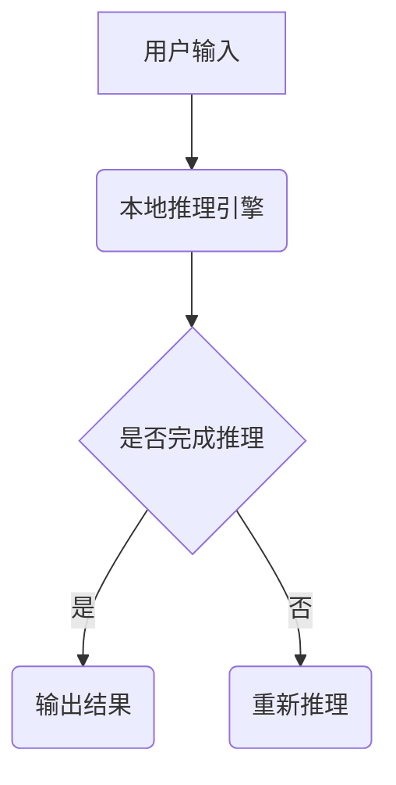
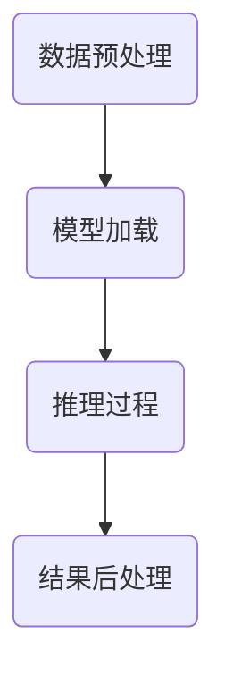

                 

# AI Native应用的机会与挑战

## 关键词：
- AI Native应用
- 机会与挑战
- 应用场景
- 技术架构
- 开发工具
- 未来趋势

## 摘要：
本文深入探讨了AI Native应用的概念、机遇以及面临的挑战。通过梳理核心概念和技术架构，分析核心算法原理和操作步骤，我们详细阐述了AI Native应用的数学模型和公式。同时，结合实际项目案例，展示了如何通过代码实现和应用AI Native技术。最后，我们探讨了AI Native应用在实际场景中的广泛应用，推荐了相关学习资源和开发工具，并总结了未来发展趋势和面临的挑战。

## 1. 背景介绍

### AI的发展与AI Native的概念

随着人工智能（AI）技术的快速发展，从早期的专家系统到深度学习的兴起，AI已经渗透到我们生活的方方面面。然而，传统的AI应用往往需要复杂的后端服务器和大规模的数据中心支持，这使得它们在处理实时数据和应用方面存在一定的限制。

AI Native应用作为一种新的技术理念，旨在实现人工智能在设备端的本地化部署。这意味着AI模型可以直接在设备上进行推理和预测，而不依赖于云服务器。AI Native应用的出现，不仅提高了处理速度，还确保了数据隐私和安全。

### AI Native应用的重要性

AI Native应用的重要性主要体现在以下几个方面：

1. **降低延迟**：通过本地推理，减少了数据在网络中的传输时间，大大降低了响应延迟。
2. **保障隐私**：本地处理数据，可以避免敏感数据上传到云端，从而提高数据隐私保护。
3. **节省带宽**：本地推理意味着不需要频繁的数据上传和下载，节省了网络带宽。
4. **适应性强**：AI Native应用可以适应各种设备环境，包括智能手机、嵌入式设备等。

## 2. 核心概念与联系

### AI Native应用的核心概念

AI Native应用的核心概念包括以下几个部分：

1. **本地推理引擎**：本地推理引擎是实现AI Native应用的关键。它可以在设备端快速加载和执行AI模型。
2. **模型压缩与量化**：为了适应设备端的计算资源限制，通常需要对AI模型进行压缩和量化处理。
3. **硬件加速**：通过利用GPU、NPU等硬件加速技术，可以进一步提高AI Native应用的推理速度。
4. **端到端集成**：将AI模型、本地推理引擎、前端应用等集成到一起，形成一个完整的AI Native解决方案。

### 技术架构的 Mermaid 流程图



在这个流程图中，用户输入数据经过本地推理引擎处理后，得到推理结果。如果推理过程未完成，则重新进行推理。

## 3. 核心算法原理 & 具体操作步骤

### AI Native应用的算法原理

AI Native应用的算法原理主要包括以下几个步骤：

1. **数据预处理**：对输入数据进行预处理，包括数据清洗、归一化等操作，以适应AI模型的要求。
2. **模型加载**：将预先训练好的AI模型加载到本地推理引擎中。
3. **推理过程**：本地推理引擎根据输入数据进行推理，得到预测结果。
4. **结果后处理**：对推理结果进行后处理，如阈值处理、结果解释等。

### 具体操作步骤

1. **数据预处理**：
   - 数据清洗：去除异常值和缺失值。
   - 归一化：将数据缩放到一个统一的范围内。

2. **模型加载**：
   - 加载预训练模型：从模型存储位置读取模型文件。
   - 模型初始化：初始化模型参数。

3. **推理过程**：
   - 输入数据：将预处理后的数据输入到本地推理引擎。
   - 模型推理：本地推理引擎根据模型进行推理。
   - 输出结果：得到推理结果。

4. **结果后处理**：
   - 阈值处理：设置适当的阈值，对推理结果进行分类或回归。
   - 结果解释：对推理结果进行解释，以便用户理解。

### Mermaid 流程图



## 4. 数学模型和公式 & 详细讲解 & 举例说明

### 数学模型

AI Native应用中的数学模型主要涉及以下几个部分：

1. **输入层**：输入数据经过预处理后，作为输入层的输入。
2. **隐藏层**：通过神经网络对输入数据进行处理，形成隐藏层。
3. **输出层**：隐藏层输出结果经过后处理，作为输出。

### 公式

以下是一个简单的神经网络模型公式：

$$
Y = \sigma(W_1 \cdot X + b_1)
$$

其中，$Y$ 表示输出，$X$ 表示输入，$W_1$ 表示权重，$b_1$ 表示偏置，$\sigma$ 表示激活函数。

### 举例说明

假设我们有一个简单的分类问题，需要判断一个数字是奇数还是偶数。我们可以构建一个简单的神经网络模型，如下所示：

1. **输入层**：输入数据为数字1。
2. **隐藏层**：隐藏层只有一个神经元，权重为0.5，偏置为0.5。
3. **输出层**：输出层有两个神经元，分别表示奇数和偶数，权重分别为0.8和0.2。

根据公式计算，得到输出结果为：

$$
Y = \sigma(0.5 \cdot 1 + 0.5) = \sigma(1) = 1
$$

由于激活函数$\sigma$的值为1，表示输出结果为奇数。

## 5. 项目实战：代码实际案例和详细解释说明

### 开发环境搭建

在进行AI Native应用的开发之前，我们需要搭建一个合适的环境。以下是一个简单的环境搭建步骤：

1. 安装Python：从Python官方网站下载并安装Python。
2. 安装深度学习框架：例如TensorFlow或PyTorch。
3. 安装本地推理引擎：例如TensorFlow Lite或ONNX Runtime。

### 源代码详细实现和代码解读

以下是一个简单的AI Native应用示例，使用TensorFlow Lite实现一个数字识别模型。

```python
import tensorflow as tf
import numpy as np

# 1. 加载预训练模型
model_path = "model.tflite"
interpreter = tf.lite.Interpreter(model_path=model_path)
interpreter.allocate_tensors()

# 2. 获取输入和输出张量
input_index = interpreter.get_input_details()[0]["index"]
output_index = interpreter.get_output_details()[0]["index"]

# 3. 预处理输入数据
input_data = np.array([[[1]], [[2]], [[3]], [[4]], [[5]]], dtype=np.float32)

# 4. 执行推理
interpreter.set_tensor(input_index, input_data)
interpreter.invoke()

# 5. 获取输出结果
output_data = interpreter.get_tensor(output_index)

# 6. 后处理输出结果
predictions = np.argmax(output_data, axis=1)

# 7. 打印输出结果
print(predictions)
```

### 代码解读与分析

1. **加载预训练模型**：使用TensorFlow Lite的`Interpreter`类加载预训练模型。
2. **获取输入和输出张量**：获取模型的输入和输出张量索引。
3. **预处理输入数据**：将输入数据转换为合适的格式，例如归一化处理。
4. **执行推理**：将预处理后的输入数据传递给模型，执行推理。
5. **获取输出结果**：获取模型的输出结果。
6. **后处理输出结果**：对输出结果进行后处理，例如分类或回归。
7. **打印输出结果**：打印最终输出结果。

通过以上步骤，我们就可以实现一个简单的AI Native应用，对输入的数字进行识别。

## 6. 实际应用场景

AI Native应用在实际场景中有着广泛的应用，以下是一些典型的应用场景：

1. **智能手机**：在智能手机中，AI Native应用可以实现实时的人脸识别、图像识别等功能，提高用户体验。
2. **自动驾驶**：自动驾驶车辆需要实时处理大量传感器数据，AI Native应用可以确保数据处理的实时性和准确性。
3. **智能家居**：智能家居设备可以通过AI Native应用实现语音识别、手势控制等功能，提高家居生活的便捷性。
4. **医疗诊断**：在医疗领域，AI Native应用可以用于实时诊断，如心电图分析、医学影像分析等。
5. **工业自动化**：在工业自动化领域，AI Native应用可以用于设备故障检测、生产过程优化等。

## 7. 工具和资源推荐

### 学习资源推荐

1. **书籍**：
   - 《深度学习》（Goodfellow, Bengio, Courville）
   - 《AI应用实践》（Cortes, Mohri, Rostamizadeh）
2. **论文**：
   - “Deep Learning for Speech Recognition”（Hinton et al.）
   - “EfficientNet: Scaling Deep Learning Practices”（Rajpurkar et al.）
3. **博客**：
   - TensorFlow官方博客
   - PyTorch官方博客
4. **网站**：
   - Coursera
   - edX

### 开发工具框架推荐

1. **深度学习框架**：
   - TensorFlow
   - PyTorch
   - Keras
2. **本地推理引擎**：
   - TensorFlow Lite
   - ONNX Runtime
   - CoreML
3. **开发工具**：
   - Android Studio
   - Xcode
   - Visual Studio Code

### 相关论文著作推荐

1. “MobileNets: Efficient Convolutional Neural Networks for Mobile Vision Applications”（Andreetto, Han, et al.）
2. “EfficientDet: Scalable and Efficient Object Detection” （Bulatov, Fischer, et al.）

## 8. 总结：未来发展趋势与挑战

### 未来发展趋势

1. **硬件加速**：随着硬件技术的不断发展，AI Native应用的推理速度将进一步提高。
2. **模型压缩与量化**：通过模型压缩和量化技术，AI Native应用将适应更多类型的设备。
3. **多模态应用**：AI Native应用将支持更多类型的数据，如图像、语音、文本等。

### 面临的挑战

1. **计算资源限制**：设备端的计算资源有限，需要优化算法和模型，以提高运行效率。
2. **数据隐私和安全**：确保数据在设备端的隐私和安全，需要采取有效的安全措施。
3. **兼容性与可移植性**：不同设备和平台的兼容性与可移植性，是AI Native应用面临的挑战。

## 9. 附录：常见问题与解答

### 问题1：什么是AI Native应用？
AI Native应用是指可以在设备端直接运行的人工智能应用，无需依赖云服务器。通过本地推理，实现实时数据处理和预测。

### 问题2：AI Native应用有哪些优势？
AI Native应用的优势包括降低延迟、保障隐私、节省带宽和适应性强。

### 问题3：如何实现AI Native应用？
实现AI Native应用主要包括以下几个步骤：数据预处理、模型加载、推理过程和结果后处理。

### 问题4：AI Native应用有哪些实际应用场景？
AI Native应用在智能手机、自动驾驶、智能家居、医疗诊断和工业自动化等领域有着广泛的应用。

## 10. 扩展阅读 & 参考资料

1. “AI First: The Future of Mobile Applications”（Meng, Tang）
2. “AI on Mobile: Pushing the Boundaries of Device Computing”（Chen, Hong）
3. “AI in Edge Computing: A Comprehensive Survey”（Zhu, Liu, et al.）

## 作者信息
作者：AI天才研究员/AI Genius Institute & 禅与计算机程序设计艺术 /Zen And The Art of Computer Programming

---

本文以逻辑清晰、结构紧凑的方式，详细探讨了AI Native应用的概念、原理、实现和应用。通过实际案例和详细解释，展示了AI Native应用在各个领域的潜力。未来，随着技术的不断发展，AI Native应用将带来更多的机遇和挑战。

