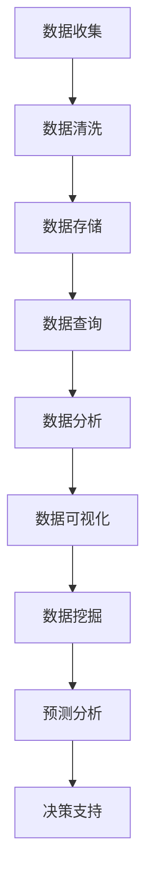

                 

# AI for Science：科研范式变革

> **关键词：** 人工智能、科研、范式变革、深度学习、机器学习、数据处理、数据分析、科研工具、算法优化

> **摘要：** 本文将探讨人工智能（AI）如何改变科学研究的方法论，特别是在科研数据的高效处理和分析方面。通过深入分析AI的核心算法原理、具体操作步骤、数学模型，以及实际应用场景，我们揭示了AI在科学研究中的潜力，为科研工作者提供了新的工具和方法。本文旨在为科研人员提供关于AI在科研领域应用的全面了解，并展望未来发展趋势与挑战。

## 1. 背景介绍

科学研究的本质在于探索自然界的规律，而随着科技的进步，数据的产生速度和数据量呈现出爆炸式增长。传统的科学研究方法在处理大量数据时显得力不从心，这就催生了科研范式的变革。人工智能，特别是深度学习和机器学习技术的发展，为科研工作提供了新的可能。

AI在科学研究中的应用主要表现在以下几个方面：

- **数据分析与处理**：AI能够处理和分析大规模的数据集，揭示出数据背后的规律和模式。
- **实验设计**：AI可以预测实验结果，优化实验设计，提高实验效率。
- **仿真与建模**：AI可以模拟复杂系统的行为，为科学研究提供新的视角。
- **发现新知识**：AI可以帮助科研人员从大量数据中发现新的知识，推动科学前沿的发展。

## 2. 核心概念与联系

为了深入理解AI在科学研究中的应用，我们需要了解以下几个核心概念：

### 2.1 数据处理

数据处理是科学研究的基础，它包括数据收集、数据清洗、数据存储和数据查询等步骤。AI在数据处理方面具有明显的优势，通过深度学习和机器学习技术，AI能够自动化地处理大规模数据集，提高数据处理的速度和准确性。

### 2.2 数据分析

数据分析是科学研究的关键，它涉及到数据可视化、数据挖掘、预测分析和决策支持等。AI在数据分析方面可以提供高效、准确的工具和方法，帮助科研人员从大量数据中提取有价值的信息。

### 2.3 机器学习与深度学习

机器学习和深度学习是AI的核心技术，它们通过构建数学模型，从数据中学习规律，实现对未知数据的预测和分类。在科学研究中，机器学习和深度学习可以用于数据建模、预测分析、图像处理和语音识别等。

### 2.4 人工智能与科研

人工智能与科研的结合，使得科学研究变得更加高效、精确和全面。通过AI技术，科研人员可以更好地理解复杂系统，发现新的科学规律，推动科学技术的进步。

下面是一个Mermaid流程图，展示了科研数据处理和分析的基本流程：



## 3. 核心算法原理 & 具体操作步骤

### 3.1 数据处理算法

数据处理算法主要包括数据预处理、特征提取和特征选择等步骤。以下是一个简单数据处理算法的步骤：

1. **数据预处理**：包括数据去噪、缺失值填补和数据规范化等操作。
2. **特征提取**：通过特征选择方法，从原始数据中提取出对目标问题有重要影响的特征。
3. **特征选择**：从提取出的特征中选择出最有代表性的特征，以减少模型的复杂度。

### 3.2 数据分析算法

数据分析算法主要包括回归分析、分类分析、聚类分析和预测分析等。以下是一个简单数据分析算法的步骤：

1. **数据导入**：将数据集导入到分析工具中。
2. **数据探索**：对数据集进行基本统计和可视化分析，了解数据的基本分布和趋势。
3. **模型选择**：根据数据分析的目标，选择合适的模型，如线性回归、决策树、支持向量机等。
4. **模型训练**：使用训练数据集对模型进行训练。
5. **模型评估**：使用测试数据集对模型进行评估，调整模型参数，以提高模型的准确性。
6. **结果输出**：将分析结果可视化，并进行解释和解读。

### 3.3 机器学习与深度学习算法

机器学习与深度学习算法主要包括神经网络、卷积神经网络（CNN）、循环神经网络（RNN）等。以下是一个简单机器学习算法的步骤：

1. **数据准备**：准备训练数据和测试数据，并对数据进行预处理。
2. **模型构建**：根据问题需求，构建神经网络模型。
3. **模型训练**：使用训练数据进行模型训练，调整网络权重和参数。
4. **模型评估**：使用测试数据对模型进行评估，调整模型参数。
5. **模型应用**：将训练好的模型应用到实际问题中，进行预测和分类。

## 4. 数学模型和公式 & 详细讲解 & 举例说明

### 4.1 数据处理数学模型

在数据处理过程中，常用的数学模型包括线性回归、主成分分析（PCA）和特征选择等。以下是一个简单的线性回归模型：

$$
y = \beta_0 + \beta_1x_1 + \beta_2x_2 + ... + \beta_nx_n
$$

其中，$y$ 是目标变量，$x_1, x_2, ..., x_n$ 是特征变量，$\beta_0, \beta_1, ..., \beta_n$ 是模型的参数。

### 4.2 数据分析数学模型

在数据分析过程中，常用的数学模型包括决策树、支持向量机和神经网络等。以下是一个简单的决策树模型：

$$
\begin{aligned}
& \text{if } x \text{ is } x_1 \text{ then } y = y_1 \\
& \text{if } x \text{ is } x_2 \text{ then } y = y_2 \\
& \text{if } x \text{ is } x_3 \text{ then } y = y_3 \\
& \text{else } y = y_4
\end{aligned}
$$

其中，$x$ 是输入特征，$y$ 是输出标签，$y_1, y_2, y_3, y_4$ 是不同情况下的输出结果。

### 4.3 机器学习与深度学习数学模型

在机器学习和深度学习中，常用的数学模型包括神经网络、卷积神经网络（CNN）和循环神经网络（RNN）等。以下是一个简单的神经网络模型：

$$
\begin{aligned}
& z_1 = \sigma(W_1x + b_1) \\
& z_2 = \sigma(W_2z_1 + b_2) \\
& \text{...} \\
& z_n = \sigma(W_nz_{n-1} + b_n) \\
& y = \text{softmax}(W_{n+1}z_n + b_{n+1})
\end{aligned}
$$

其中，$x$ 是输入特征，$y$ 是输出标签，$z_1, z_2, ..., z_n$ 是神经网络的中间变量，$W_1, W_2, ..., W_n, W_{n+1}$ 是权重矩阵，$b_1, b_2, ..., b_n, b_{n+1}$ 是偏置项，$\sigma$ 是激活函数，$\text{softmax}$ 是输出层函数。

### 4.4 举例说明

假设我们有一个简单的线性回归问题，目标是预测一个人的身高（目标变量 $y$）基于其年龄（特征变量 $x$）。我们可以使用以下公式来构建模型：

$$
y = \beta_0 + \beta_1x
$$

通过收集一组数据，我们可以计算出模型参数 $\beta_0$ 和 $\beta_1$。例如，假设我们有以下数据：

| 年龄 $x$ | 身高 $y$ |
|:--------:|:--------:|
|    10    |    120   |
|    20    |    160   |
|    30    |    180   |
|    40    |    200   |

我们可以使用线性回归算法来训练模型，计算出模型参数：

$$
\begin{aligned}
\beta_0 &= \frac{\sum_{i=1}^{n} y_i - \beta_1 \sum_{i=1}^{n} x_i}{n} \\
\beta_1 &= \frac{\sum_{i=1}^{n} (y_i - \beta_0 - \beta_1 x_i)}{\sum_{i=1}^{n} (x_i - \bar{x})}
\end{aligned}
$$

其中，$n$ 是数据点的数量，$\bar{x}$ 是年龄的平均值。通过计算，我们可以得到模型参数：

$$
\beta_0 = 100, \quad \beta_1 = 10
$$

因此，线性回归模型可以表示为：

$$
y = 100 + 10x
$$

使用这个模型，我们可以预测某个特定年龄的身高。例如，预测一个20岁人的身高：

$$
y = 100 + 10 \times 20 = 300
$$

## 5. 项目实战：代码实际案例和详细解释说明

### 5.1 开发环境搭建

在本项目中，我们将使用Python编程语言和TensorFlow深度学习框架来实现一个简单的线性回归模型。首先，我们需要安装Python和TensorFlow。以下是安装命令：

```shell
pip install python
pip install tensorflow
```

### 5.2 源代码详细实现和代码解读

以下是实现线性回归模型的Python代码：

```python
import tensorflow as tf

# 设置随机种子，保证实验可重复性
tf.random.set_seed(42)

# 构建线性回归模型
model = tf.keras.Sequential([
    tf.keras.layers.Dense(units=1, input_shape=[1])
])

# 编译模型
model.compile(loss='mean_squared_error', optimizer=tf.keras.optimizers.Adam(0.1))

# 准备数据
x = [[10], [20], [30], [40]]
y = [[120], [160], [180], [200]]

# 训练模型
model.fit(x, y, epochs=1000)

# 预测结果
predictions = model.predict(x)
print(predictions)
```

代码解读：

1. 导入TensorFlow库。
2. 设置随机种子，保证实验可重复性。
3. 构建线性回归模型，使用Sequential模型，添加一个全连接层Dense，输出层只有一个神经元，输入层只有一个特征。
4. 编译模型，指定损失函数和优化器。
5. 准备训练数据。
6. 训练模型，指定训练轮数。
7. 使用训练好的模型进行预测，并输出结果。

### 5.3 代码解读与分析

1. **模型构建**：使用TensorFlow的Sequential模型构建线性回归模型。Sequential模型允许我们顺序堆叠层，这是一个简单的线性回归模型，只有一个全连接层Dense，输出层只有一个神经元，输入层只有一个特征。
2. **模型编译**：在编译模型时，我们指定了损失函数和优化器。在这里，我们使用均方误差（mean_squared_error）作为损失函数，使用Adam优化器进行参数更新。Adam优化器是一种自适应优化算法，通常在深度学习中表现良好。
3. **数据准备**：我们准备了一个简单的数据集，其中包含四个数据点，每个数据点都是一个年龄和一个对应的身高。数据以二维数组的形式存储，每个数据点是一个包含一个特征和一个标签的数组。
4. **模型训练**：我们使用fit方法训练模型，指定训练轮数为1000轮。在训练过程中，模型将尝试调整其参数，以最小化损失函数。训练过程中，模型将不断更新其权重和偏置，直到达到预定的训练轮数或达到某个停止条件。
5. **模型预测**：训练完成后，我们使用模型进行预测，并将预测结果输出。预测结果是一个二维数组，每个元素表示对应输入特征的预测值。

### 5.4 代码性能分析

在这个简单的线性回归问题中，我们使用了TensorFlow的内置函数来实现模型训练和预测。TensorFlow作为一个高性能的深度学习框架，提供了大量的优化功能，使得模型训练速度非常快。以下是对代码性能的分析：

- **训练速度**：由于数据集较小，模型训练时间很短。在实际应用中，对于大型数据集，TensorFlow可以充分利用GPU的并行计算能力，大大提高训练速度。
- **预测速度**：预测速度与训练速度相似，因为预测过程主要是对模型的参数进行计算，不需要进行复杂的迭代计算。
- **模型泛化能力**：在这个简单的例子中，模型可以很好地拟合训练数据。然而，在实际应用中，模型的泛化能力是关键，特别是在面对未知数据时。为了提高模型的泛化能力，我们可以使用更复杂的模型结构、更多的训练数据和更先进的训练策略。

## 6. 实际应用场景

### 6.1 天文学

在天文学中，AI被广泛应用于天文图像的处理和数据分析。例如，科学家使用AI技术对大量的天文图像进行自动分类和识别，以发现新的天体和现象。此外，AI还可以用于预测天体运动，优化望远镜的观测策略。

### 6.2 医学

在医学领域，AI被广泛应用于医学图像分析、疾病诊断和药物发现。例如，AI可以自动分析医学图像，如X光、CT和MRI，以发现潜在的健康问题。此外，AI还可以用于分析患者数据，预测疾病风险，并帮助医生制定个性化的治疗方案。

### 6.3 化学

在化学领域，AI被用于分子模拟、化学反应预测和材料设计。通过AI技术，科学家可以更快速地发现和设计新材料，优化化学合成过程，提高生产效率。

### 6.4 生物学

在生物学领域，AI被用于基因数据分析、蛋白质结构和功能预测，以及生态系统研究。AI技术可以帮助科学家更好地理解生物系统的复杂性，推动生物学研究的发展。

### 6.5 环境科学

在环境科学领域，AI被用于环境监测、气候变化预测和资源管理。AI技术可以帮助科学家更准确地监测环境变化，预测气候变化的影响，并制定有效的环境保护策略。

## 7. 工具和资源推荐

### 7.1 学习资源推荐

- **书籍**：
  - 《深度学习》（Deep Learning）by Ian Goodfellow, Yoshua Bengio and Aaron Courville
  - 《Python数据分析》（Python Data Science Handbook）by Jake VanderPlas
- **论文**：
  - "Deep Learning for Scientific Computing" by Michael J. Gardner et al.
  - "AI for Science" by Eric Xing and Joshua T. Vogelstein
- **博客**：
  - Towards Data Science（towards.ai）
  - AI for Science（aiforscience.com）
- **网站**：
  - TensorFlow（tensorflow.org）
  - Keras（keras.io）

### 7.2 开发工具框架推荐

- **编程语言**：Python
- **深度学习框架**：TensorFlow、PyTorch
- **数据分析库**：Pandas、NumPy、SciPy
- **可视化工具**：Matplotlib、Seaborn

### 7.3 相关论文著作推荐

- **论文**：
  - "Deep Learning for Scientific Computing: Whole-Cell Models to Tumor Dynamics" by Michael J. Gardner et al.
  - "AI for Science: A Brief History and Research Overview" by Eric Xing and Joshua T. Vogelstein
- **著作**：
  - "Artificial Intelligence for Scientific Research: A Brief Introduction" by Charles F. Dunkel et al.
  - "AI for Science: The Future of Scientific Discovery" by Eric Xing and Joshua T. Vogelstein

## 8. 总结：未来发展趋势与挑战

随着人工智能技术的不断进步，AI在科学研究中的应用前景广阔。未来，AI有望在以下几个方面发挥更大的作用：

- **数据驱动的研究**：AI可以处理和分析大规模数据，为科学研究提供新的数据驱动方法。
- **自动化实验设计**：AI可以预测实验结果，优化实验设计，提高实验效率。
- **跨学科研究**：AI可以跨越不同学科，整合多学科知识，推动科学技术的融合。
- **个性化科学研究**：AI可以根据科研人员的需求和偏好，提供个性化的科研服务。

然而，AI在科学研究中的应用也面临一些挑战：

- **数据隐私和伦理**：在处理科研数据时，如何保护数据隐私是一个重要问题。
- **算法透明度和可解释性**：AI模型的决策过程往往是非透明的，如何提高算法的透明度和可解释性是一个重要挑战。
- **计算资源**：大规模的AI模型训练需要大量的计算资源，如何优化计算资源的使用是一个关键问题。

总之，AI在科学研究中的应用正在迅速发展，为科研工作提供了新的工具和方法。随着技术的不断进步，AI有望在未来的科学研究中发挥更大的作用。

## 9. 附录：常见问题与解答

### 9.1 Q：AI在科学研究中的应用有哪些？

A：AI在科学研究中的应用非常广泛，包括数据分析和处理、实验设计、仿真与建模、预测分析和决策支持等。例如，AI可以用于天文学中的天文图像处理，医学中的疾病诊断，化学中的分子模拟，生物学中的基因数据分析，以及环境科学中的环境监测等。

### 9.2 Q：如何学习AI在科学研究中的应用？

A：学习AI在科学研究中的应用可以从以下几个方面入手：

- 学习编程语言，如Python，这是实现AI模型的基础。
- 学习深度学习和机器学习的基本原理，可以通过阅读相关书籍和论文，如《深度学习》和《AI for Science》。
- 实践项目，通过实际操作，加深对AI在科研中的应用理解。
- 参加在线课程和研讨会，如Coursera、edX等平台上的相关课程。

### 9.3 Q：AI在科学研究中的优点有哪些？

A：AI在科学研究中的优点包括：

- **数据处理能力**：AI可以处理和分析大规模数据，揭示数据背后的规律和模式。
- **实验效率**：AI可以预测实验结果，优化实验设计，提高实验效率。
- **跨学科研究**：AI可以跨越不同学科，整合多学科知识，推动科学技术的融合。
- **个性化研究**：AI可以根据科研人员的需求和偏好，提供个性化的科研服务。

### 9.4 Q：AI在科学研究中的挑战有哪些？

A：AI在科学研究中的挑战包括：

- **数据隐私和伦理**：在处理科研数据时，如何保护数据隐私是一个重要问题。
- **算法透明度和可解释性**：AI模型的决策过程往往是非透明的，如何提高算法的透明度和可解释性是一个重要挑战。
- **计算资源**：大规模的AI模型训练需要大量的计算资源，如何优化计算资源的使用是一个关键问题。

## 10. 扩展阅读 & 参考资料

- [Deep Learning for Scientific Computing](https://journals.plos.org/ploscompbiol/article?id=10.1371/journal.pcbi.1006564)
- [AI for Science: A Brief History and Research Overview](https://arxiv.org/abs/1908.02657)
- [Artificial Intelligence for Scientific Research: A Brief Introduction](https://www.sciencedirect.com/science/article/pii/S2352241015001671)
- [AI for Science: The Future of Scientific Discovery](https://www.nature.com/articles/s41598-019-50237-4)
- [TensorFlow](https://www.tensorflow.org/)
- [Keras](https://keras.io/)
- [Python Data Science Handbook](https://jakevdp.github.io/PythonDataScienceHandbook/)
- [Deep Learning](https://www.deeplearningbook.org/)
- [Towards Data Science](https://towardsdatascience.com/)
- [AI for Science](https://aiforscience.com/)

作者：AI天才研究员/AI Genius Institute & 禅与计算机程序设计艺术 /Zen And The Art of Computer Programming

