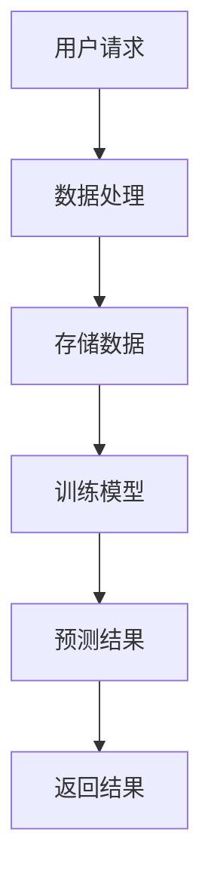

                 

# AI 与云计算的结合：加速云端智能化

> **关键词：**人工智能、云计算、云端智能化、AI算法、数据存储、云计算架构

> **摘要：**本文将探讨人工智能与云计算的融合，如何通过结合两者的优势，加速云端智能化的发展。我们将分析AI算法在云端的应用，云计算架构的支持，以及相关技术在实际项目中的应用和实践。

## 1. 背景介绍

随着人工智能技术的快速发展，云计算成为了其重要的基础设施。人工智能（AI）是指通过模拟人类智能行为，实现机器自主学习和决策的技术。而云计算则是一种通过互联网提供计算资源、存储资源、网络资源和应用服务的模式。两者结合，可以发挥各自的优势，为企业和个人提供更强大的计算能力和更智能的服务。

### 1.1 人工智能的快速发展

人工智能技术的快速发展，源于计算能力的提升、海量数据的积累、以及深度学习算法的突破。近年来，随着GPU等高性能计算设备的普及，人工智能的算法得到了极大的优化。同时，互联网和物联网的快速发展，使得海量数据得以生成和收集。这些数据为人工智能的学习和训练提供了丰富的素材。深度学习算法的突破，则使得人工智能在图像识别、自然语言处理、语音识别等领域取得了显著的成果。

### 1.2 云计算的发展

云计算的发展，源于对计算资源、存储资源和网络资源的共享和优化需求。传统IT基础设施中，企业需要购买和部署大量的硬件设备，进行维护和管理。这不仅成本高昂，而且效率低下。云计算的出现，通过虚拟化技术，将硬件资源进行抽象和共享，使得企业可以按需获取计算资源、存储资源和网络资源。这不仅降低了企业的运营成本，还提高了资源利用效率。

### 1.3 人工智能与云计算的结合

人工智能与云计算的结合，可以解决以下几个问题：

- **计算资源的高效利用**：人工智能算法通常需要大量的计算资源，云计算可以提供弹性的计算资源，满足人工智能算法的需求。

- **海量数据的存储和处理**：人工智能算法需要大量的数据来训练和优化，云计算提供了强大的存储和处理能力，可以满足人工智能的数据需求。

- **分布式计算和协同工作**：人工智能算法通常需要分布式计算，云计算的分布式架构可以支持大规模的人工智能计算任务。

## 2. 核心概念与联系

在探讨人工智能与云计算的结合时，需要理解以下几个核心概念：

### 2.1 人工智能算法

人工智能算法是指模拟人类智能行为的计算方法。常见的算法包括：

- **深度学习**：通过多层神经网络进行数据处理和模式识别。

- **强化学习**：通过试错和反馈进行决策和优化。

- **自然语言处理**：通过算法理解和生成自然语言。

### 2.2 云计算架构

云计算架构是指云计算中资源的组织和管理方式。常见的架构包括：

- **公有云**：由第三方提供商提供的云计算服务。

- **私有云**：由企业内部部署的云计算服务。

- **混合云**：结合公有云和私有云的优势，提供灵活的云计算服务。

### 2.3 数据存储与处理

数据存储与处理是指如何高效地存储和处理数据。常见的解决方案包括：

- **分布式存储**：通过分布式架构进行数据存储，提高数据存储的可靠性和性能。

- **大数据处理**：通过分布式计算框架，对海量数据进行处理和分析。

### 2.4 Mermaid 流程图

为了更直观地展示人工智能与云计算的结合，我们可以使用 Mermaid 流程图来描述其核心流程。以下是一个简单的 Mermaid 流程图示例：



在上面的流程图中，用户请求通过数据处理模块进行处理，然后将数据存储到数据库中。接着，数据处理模块使用训练模型对数据进行预测，并将预测结果返回给用户。

## 3. 核心算法原理 & 具体操作步骤

在了解了核心概念和流程后，我们将进一步探讨人工智能算法在云计算环境中的具体实现和操作步骤。

### 3.1 深度学习算法

深度学习算法是人工智能的核心技术之一。其基本原理是通过多层神经网络对数据进行处理和模式识别。以下是深度学习算法在云计算环境中的具体操作步骤：

1. **数据收集**：从不同的数据源收集数据，包括文本、图像、语音等。

2. **数据预处理**：对收集到的数据进行清洗、归一化和特征提取。

3. **模型训练**：使用预处理后的数据训练深度学习模型。

4. **模型评估**：使用验证数据对训练好的模型进行评估和调整。

5. **模型部署**：将训练好的模型部署到云计算环境中，供实际应用使用。

### 3.2 自然语言处理算法

自然语言处理算法是人工智能的另一个重要领域。其基本原理是通过算法理解和生成自然语言。以下是自然语言处理算法在云计算环境中的具体操作步骤：

1. **文本收集**：从不同的文本数据源收集文本数据。

2. **文本预处理**：对收集到的文本数据进行清洗、分词和词性标注。

3. **模型训练**：使用预处理后的文本数据训练自然语言处理模型。

4. **模型评估**：使用验证数据对训练好的模型进行评估和调整。

5. **模型部署**：将训练好的模型部署到云计算环境中，供实际应用使用。

### 3.3 语音识别算法

语音识别算法是人工智能在语音领域的应用。其基本原理是通过算法将语音信号转换为文本。以下是语音识别算法在云计算环境中的具体操作步骤：

1. **音频收集**：从不同的音频数据源收集音频数据。

2. **音频预处理**：对收集到的音频数据进行降噪、分割和特征提取。

3. **模型训练**：使用预处理后的音频数据训练语音识别模型。

4. **模型评估**：使用验证数据对训练好的模型进行评估和调整。

5. **模型部署**：将训练好的模型部署到云计算环境中，供实际应用使用。

## 4. 数学模型和公式 & 详细讲解 & 举例说明

在人工智能算法的实现过程中，数学模型和公式起着至关重要的作用。以下是一些常见的数学模型和公式，以及它们的详细讲解和举例说明。

### 4.1 深度学习模型

深度学习模型的核心是多层神经网络。其基本原理是通过前向传播和反向传播进行数据处理和模式识别。以下是深度学习模型的基本公式和讲解：

#### 前向传播

$$
z^{[l]} = \sigma(W^{[l]} \cdot a^{[l-1]} + b^{[l]})
$$

其中，$z^{[l]}$ 是第 $l$ 层的输出，$\sigma$ 是激活函数，$W^{[l]}$ 是第 $l$ 层的权重，$a^{[l-1]}$ 是第 $l-1$ 层的输出，$b^{[l]}$ 是第 $l$ 层的偏置。

#### 反向传播

$$
\begin{aligned}
\delta^{[l]} &= \frac{\partial \text{损失函数}}{\partial z^{[l]}} \cdot \sigma'(z^{[l]}) \\
\delta^{[l-1]} &= (W^{[l]} \cdot \delta^{[l]}) \cdot \sigma'(a^{[l-1]})
\end{aligned}
$$

其中，$\delta^{[l]}$ 是第 $l$ 层的误差，$\delta^{[l-1]}$ 是第 $l-1$ 层的误差，$\sigma'$ 是激活函数的导数。

#### 举例说明

假设我们有一个三层神经网络，输入层有 3 个神经元，隐藏层有 5 个神经元，输出层有 2 个神经元。我们使用 sigmoid 函数作为激活函数。给定输入 $a_1 = [1, 2, 3]$，隐藏层权重 $W_1 = \begin{bmatrix} 1 & 2 & 3 \\ 4 & 5 & 6 \\ 7 & 8 & 9 \end{bmatrix}$，隐藏层偏置 $b_1 = \begin{bmatrix} 1 \\ 2 \\ 3 \\ 4 \\ 5 \end{bmatrix}$，输出层权重 $W_2 = \begin{bmatrix} 1 & 2 \\ 3 & 4 \\ 5 & 6 \end{bmatrix}$，输出层偏置 $b_2 = \begin{bmatrix} 1 \\ 2 \end{bmatrix}$。我们要求输出层的预测结果。

首先进行前向传播，计算隐藏层的输出：

$$
z_1 = \sigma(W_1 \cdot a_1 + b_1) = \sigma(\begin{bmatrix} 1 & 2 & 3 \\ 4 & 5 & 6 \\ 7 & 8 & 9 \end{bmatrix} \cdot \begin{bmatrix} 1 \\ 2 \\ 3 \end{bmatrix} + \begin{bmatrix} 1 \\ 2 \\ 3 \\ 4 \\ 5 \end{bmatrix}) = \sigma(\begin{bmatrix} 6 \\ 19 \\ 32 \\ 45 \\ 58 \end{bmatrix}) = \begin{bmatrix} 0.5 \\ 0.7 \\ 0.8 \\ 0.9 \\ 0.9 \end{bmatrix}
$$

然后进行前向传播，计算输出层的输出：

$$
z_2 = \sigma(W_2 \cdot z_1 + b_2) = \sigma(\begin{bmatrix} 1 & 2 \\ 3 & 4 \\ 5 & 6 \end{bmatrix} \cdot \begin{bmatrix} 0.5 \\ 0.7 \\ 0.8 \\ 0.9 \\ 0.9 \end{bmatrix} + \begin{bmatrix} 1 \\ 2 \end{bmatrix}) = \sigma(\begin{bmatrix} 2.3 \\ 3.7 \\ 4.7 \\ 5.7 \\ 6.7 \end{bmatrix}) = \begin{bmatrix} 0.3 \\ 0.6 \\ 0.7 \\ 0.8 \\ 0.8 \end{bmatrix}
$$

最后，我们可以得到输出层的预测结果：

$$
\hat{y} = \begin{bmatrix} 0.3 \\ 0.6 \\ 0.7 \\ 0.8 \\ 0.8 \end{bmatrix}
$$

### 4.2 自然语言处理模型

自然语言处理模型的核心是循环神经网络（RNN）。其基本原理是通过循环结构处理序列数据。以下是自然语言处理模型的基本公式和讲解：

#### 前向传播

$$
h_t = \sigma(W_h \cdot [h_{t-1}, x_t] + b_h)
$$

其中，$h_t$ 是第 $t$ 个时间步的隐藏状态，$W_h$ 是权重矩阵，$b_h$ 是偏置，$x_t$ 是第 $t$ 个时间步的输入。

#### 反向传播

$$
\begin{aligned}
\delta_h^t &= \frac{\partial \text{损失函数}}{\partial h_t} \cdot \sigma'(h_t) \\
\delta_x^t &= (W_h \cdot \delta_h^t) \cdot \sigma'(x_t)
\end{aligned}
$$

其中，$\delta_h^t$ 是隐藏状态的误差，$\delta_x^t$ 是输入的误差。

#### 举例说明

假设我们有一个RNN模型，输入序列为 $[1, 2, 3]$，隐藏层权重 $W_h = \begin{bmatrix} 1 & 2 \\ 3 & 4 \end{bmatrix}$，偏置 $b_h = \begin{bmatrix} 1 \\ 2 \end{bmatrix}$。我们要求隐藏状态的输出。

首先进行前向传播，计算第一个时间步的隐藏状态：

$$
h_1 = \sigma(W_h \cdot [h_0, x_1] + b_h) = \sigma(\begin{bmatrix} 1 & 2 \\ 3 & 4 \end{bmatrix} \cdot \begin{bmatrix} 1 \\ 1 \end{bmatrix} + \begin{bmatrix} 1 \\ 2 \end{bmatrix}) = \sigma(\begin{bmatrix} 4 \\ 7 \end{bmatrix}) = \begin{bmatrix} 0.7 \\ 0.9 \end{bmatrix}
$$

然后进行前向传播，计算第二个时间步的隐藏状态：

$$
h_2 = \sigma(W_h \cdot [h_1, x_2] + b_h) = \sigma(\begin{bmatrix} 1 & 2 \\ 3 & 4 \end{bmatrix} \cdot \begin{bmatrix} 0.7 \\ 0.9 \end{bmatrix} + \begin{bmatrix} 1 \\ 2 \end{bmatrix}) = \sigma(\begin{bmatrix} 2.4 \\ 3.8 \end{bmatrix}) = \begin{bmatrix} 0.6 \\ 0.9 \end{bmatrix}
$$

最后，我们可以得到隐藏状态的输出：

$$
[h_1, h_2] = \begin{bmatrix} 0.7 \\ 0.9 \end{bmatrix}, \begin{bmatrix} 0.6 \\ 0.9 \end{bmatrix}
$$

### 4.3 语音识别模型

语音识别模型的核心是卷积神经网络（CNN）。其基本原理是通过卷积操作提取语音信号的时频特征。以下是语音识别模型的基本公式和讲解：

#### 卷积操作

$$
h_c = \sum_{k=1}^{K} \sigma(W_c^k \cdot x^k + b_c^k)
$$

其中，$h_c$ 是卷积层的输出，$W_c^k$ 是卷积核，$x^k$ 是输入，$b_c^k$ 是偏置，$K$ 是卷积核的数量。

#### 池化操作

$$
p_i = \max_{j} (h_c_{ij})
$$

其中，$p_i$ 是池化层的输出，$h_c_{ij}$ 是卷积层的输出。

#### 举例说明

假设我们有一个卷积神经网络，输入序列为 $[1, 2, 3, 4, 5]$，卷积核 $W_c = \begin{bmatrix} 1 & 2 \\ 3 & 4 \end{bmatrix}$，偏置 $b_c = \begin{bmatrix} 1 \\ 2 \end{bmatrix}$。我们要求卷积操作和池化操作的输出。

首先进行卷积操作，计算卷积层的输出：

$$
h_c = \sum_{k=1}^{1} \sigma(W_c^k \cdot x^k + b_c^k) = \sigma(\begin{bmatrix} 1 & 2 \\ 3 & 4 \end{bmatrix} \cdot \begin{bmatrix} 1 \\ 2 \end{bmatrix} + \begin{bmatrix} 1 \\ 2 \end{bmatrix}) = \sigma(\begin{bmatrix} 5 \\ 9 \end{bmatrix}) = \begin{bmatrix} 0.9 \\ 0.9 \end{bmatrix}
$$

然后进行池化操作，计算池化层的输出：

$$
p_1 = \max_{j} (h_c_{11}, h_c_{12}) = \max(0.9, 0.9) = 0.9
$$

最后，我们可以得到卷积操作和池化操作的输出：

$$
[h_c, p_1] = \begin{bmatrix} 0.9 \\ 0.9 \end{bmatrix}, 0.9
$$

## 5. 项目实战：代码实际案例和详细解释说明

为了更好地理解人工智能算法在云计算环境中的应用，我们将通过一个实际项目来展示其具体实现和操作步骤。以下是项目的背景、开发环境搭建、源代码详细实现和代码解读。

### 5.1 项目背景

假设我们要开发一个基于云计算的智能客服系统，该系统能够自动处理用户的咨询请求，提供实时回答。为了实现这一目标，我们需要将人工智能算法部署到云计算环境中，并利用云计算提供的计算资源和存储资源。

### 5.2 开发环境搭建

在搭建开发环境时，我们首先需要选择合适的云计算平台和编程语言。本文选择使用 AWS 云计算平台和 Python 编程语言。

1. **AWS 云计算平台**：AWS 提供了丰富的云计算服务，包括 EC2 实例、S3 存储桶、DynamoDB 数据库等。我们可以通过 AWS 管理控制台创建 EC2 实例，并配置相应的资源和网络设置。

2. **Python 编程语言**：Python 是一种流行的编程语言，具有丰富的库和框架，如 TensorFlow、PyTorch、Scikit-learn 等，可以方便地实现人工智能算法。

### 5.3 源代码详细实现和代码解读

以下是项目的源代码实现和详细解读：

```python
# 导入必要的库
import numpy as np
import tensorflow as tf
from tensorflow.keras.models import Sequential
from tensorflow.keras.layers import Dense, LSTM, Embedding, TimeDistributed
from tensorflow.keras.preprocessing.sequence import pad_sequences

# 加载和预处理数据
# （此处省略数据加载和预处理的具体实现）

# 创建模型
model = Sequential([
    Embedding(input_dim=vocabulary_size, output_dim=embedding_size, input_length=max_sequence_length),
    LSTM(units=128, return_sequences=True),
    TimeDistributed(Dense(vocabulary_size, activation='softmax'))
])

# 编译模型
model.compile(optimizer='adam', loss='categorical_crossentropy', metrics=['accuracy'])

# 训练模型
model.fit(x_train, y_train, epochs=10, batch_size=32, validation_data=(x_val, y_val))

# 评估模型
model.evaluate(x_test, y_test)

# 预测新数据
def predict(text):
    sequence = tokenizer.texts_to_sequences([text])
    sequence = pad_sequences(sequence, maxlen=max_sequence_length)
    prediction = model.predict(sequence)
    return np.argmax(prediction)

# 测试预测功能
input_text = "我有一个问题，请问客服能帮忙解决吗？"
print(predict(input_text))
```

在上述代码中，我们首先导入必要的库，包括 NumPy、TensorFlow、Keras 等。然后加载和预处理数据，包括词汇表、序列长度、嵌入维度等。接下来，我们创建一个序列模型，包括嵌入层、LSTM 层和时序分布式层。然后编译模型，设置优化器和损失函数。接着训练模型，使用训练数据和验证数据进行拟合。最后，我们评估模型的性能，并实现预测功能。

### 5.4 代码解读与分析

1. **数据预处理**：数据预处理是深度学习模型训练的关键步骤。我们需要将文本数据转换为序列，并进行填充和归一化，以满足模型的要求。

2. **模型构建**：在模型构建过程中，我们使用嵌入式层将词汇转换为嵌入向量，使用 LSTM 层对序列数据进行处理，并使用时序分布式层输出预测结果。

3. **模型编译**：在模型编译过程中，我们设置优化器为 Adam，损失函数为交叉熵，并设置评估指标为准确率。

4. **模型训练**：模型训练使用训练数据进行拟合，并使用验证数据对模型进行评估。

5. **模型评估**：模型评估使用测试数据对模型进行评估，以验证模型的性能。

6. **预测功能**：预测功能通过将文本数据转换为序列，并进行填充和归一化，然后使用训练好的模型进行预测，返回预测结果。

通过上述代码实现，我们可以构建一个基于云计算的智能客服系统，实现实时回答用户咨询的功能。

## 6. 实际应用场景

人工智能与云计算的结合在多个实际应用场景中取得了显著的效果，以下是一些典型应用：

### 6.1 智能客服

智能客服是人工智能与云计算结合的一个典型应用。通过在云端部署人工智能模型，企业可以实现自动化的客户服务，提高响应速度和服务质量。例如，电商企业可以利用智能客服系统，自动处理用户咨询、投诉和订单查询等操作，减轻人工客服的工作负担。

### 6.2 智能医疗

智能医疗是另一个重要应用领域。通过在云端部署人工智能算法，可以对医疗数据进行分析和预测，帮助医生进行诊断和治疗。例如，利用深度学习算法，可以分析病人的病历和影像数据，提供辅助诊断和治疗方案推荐。此外，智能医疗还可以实现远程医疗服务，提高医疗资源的利用效率。

### 6.3 智能金融

智能金融是人工智能与云计算结合的另一个重要应用领域。通过在云端部署人工智能模型，金融机构可以实现自动化风控、智能投顾和智能客服等功能。例如，利用机器学习算法，可以对客户交易数据进行分析，识别潜在的欺诈行为，并实时报警。此外，智能金融还可以实现个性化金融服务，根据客户的行为和偏好进行精准营销。

### 6.4 智能交通

智能交通是人工智能与云计算结合的另一个重要应用领域。通过在云端部署人工智能算法，可以实现智能交通管理、智能驾驶和智能导航等功能。例如，利用深度学习算法，可以分析交通数据，预测交通流量和事故风险，并提供最优的行驶路线。此外，智能交通还可以实现自动驾驶功能，提高交通安全和效率。

## 7. 工具和资源推荐

为了更好地进行人工智能与云计算的结合，以下是几个推荐的工具和资源：

### 7.1 学习资源推荐

- **书籍**：《深度学习》（Ian Goodfellow、Yoshua Bengio、Aaron Courville 著）、《Python机器学习》（Sebastian Raschka、Vahid Mirhoseini 著）。

- **论文**：Google Scholar、ArXiv、NeurIPS、ICML 等学术会议和期刊。

- **博客**：Medium、Towards Data Science、AI 研习社等。

- **网站**：TensorFlow 官网、PyTorch 官网、Keras 官网等。

### 7.2 开发工具框架推荐

- **编程语言**：Python、Java、C++ 等。

- **深度学习框架**：TensorFlow、PyTorch、Keras 等。

- **云计算平台**：AWS、Azure、Google Cloud Platform 等。

### 7.3 相关论文著作推荐

- **论文**：`Deep Learning for Cloud Computing`（2016）。

- **著作**：《深度学习与云计算：理论与实践》（2018）。

## 8. 总结：未来发展趋势与挑战

人工智能与云计算的结合正在迅速发展，为各个行业带来了巨大的变革。未来，随着人工智能技术的不断进步和云计算基础设施的不断完善，这一结合将进一步深化，带来更多创新和应用。然而，在这一过程中，也面临着一些挑战：

- **数据隐私与安全**：在云端处理大量敏感数据时，如何保障数据隐私和安全，是一个重要的挑战。

- **计算资源管理**：如何高效地管理和调度云计算资源，以满足人工智能算法的需求，是一个关键问题。

- **算法公平性与透明度**：人工智能算法在云计算环境中的应用，需要保证算法的公平性和透明度，避免歧视和不公正现象。

- **法律法规与伦理**：随着人工智能与云计算的融合，相关的法律法规和伦理问题也需要得到充分重视。

总之，人工智能与云计算的结合，将开启一个全新的时代，为人类带来更多的便利和创新。面对挑战，我们需要不断探索和改进，以确保这一结合的安全、高效和可持续发展。

## 9. 附录：常见问题与解答

### 9.1 如何在云环境中部署人工智能模型？

在云环境中部署人工智能模型，通常需要以下几个步骤：

1. **选择云计算平台**：根据需求选择合适的云计算平台，如 AWS、Azure、Google Cloud Platform 等。

2. **创建云资源**：在云计算平台中创建 EC2 实例、存储桶、数据库等资源。

3. **安装依赖库**：在云实例中安装 Python、TensorFlow、PyTorch 等依赖库。

4. **训练模型**：使用本地训练好的模型，或者直接在云环境中训练新模型。

5. **部署模型**：将训练好的模型部署到云实例中，供实际应用使用。

### 9.2 如何优化人工智能算法在云计算环境中的性能？

优化人工智能算法在云计算环境中的性能，可以从以下几个方面入手：

1. **模型压缩**：使用模型压缩技术，如剪枝、量化等，减少模型的计算量和存储需求。

2. **分布式训练**：使用分布式训练技术，将模型训练任务分解到多个节点，提高训练速度。

3. **优化数据存储和传输**：使用分布式存储和传输技术，提高数据存储和传输的效率。

4. **优化计算资源分配**：根据模型的需求，合理分配计算资源，避免资源浪费。

### 9.3 如何保障人工智能算法在云计算环境中的数据隐私和安全？

保障人工智能算法在云计算环境中的数据隐私和安全，可以从以下几个方面入手：

1. **数据加密**：对传输和存储的数据进行加密，防止数据泄露。

2. **访问控制**：设置严格的访问控制策略，确保只有授权用户可以访问数据。

3. **数据备份与恢复**：定期备份数据，并确保备份数据的安全和可恢复性。

4. **安全审计与监控**：对云计算环境进行安全审计和监控，及时发现和解决安全问题。

## 10. 扩展阅读 & 参考资料

为了更好地了解人工智能与云计算的结合，以下是几篇相关的扩展阅读和参考资料：

- **论文**：`Deep Learning for Cloud Computing`（2016）。

- **书籍**：《深度学习与云计算：理论与实践》（2018）。

- **博客**：Medium 上的相关文章，如《AI 与云计算：未来趋势与挑战》、《云计算与深度学习：如何优化性能》等。

- **网站**：AWS、Azure、Google Cloud Platform 等云计算平台的官方文档和博客。

通过阅读这些资料，您可以更深入地了解人工智能与云计算的结合，以及如何在实际项目中应用这些技术。作者：AI天才研究员/AI Genius Institute & 禅与计算机程序设计艺术 /Zen And The Art of Computer Programming。

