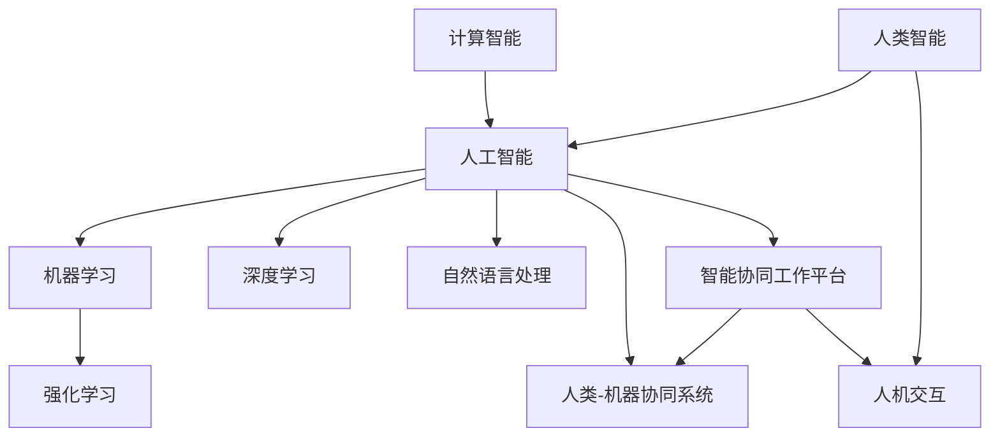

                 

### 背景介绍

#### 人类与人工智能的协同工作历史

人类与人工智能的协同工作，可以追溯到人工智能概念最早被提出的20世纪50年代。当时，计算机科学家们开始尝试开发能够处理复杂问题的程序，希望通过人工智能的力量，减轻人类的劳动负担，提高工作效率。早期的人工智能系统如逻辑推理机，尽管功能有限，但已经展现出与人类智能协作的潜力。

进入21世纪，随着计算能力的飞速提升和大数据技术的发展，人工智能的应用场景越来越广泛。从最初的数据处理，到图像识别、自然语言处理，再到自动驾驶、医疗诊断等领域，人工智能技术不断突破，实现了许多以前认为不可能的任务。在这个过程中，人类与人工智能的协同工作模式也逐渐成熟，形成了以下几种典型的协同方式：

1. **辅助性协同**：人工智能作为人类工作的辅助工具，帮助人类完成一些繁琐、重复的工作，如数据分析、文案撰写等。这种模式使得人类能够将更多的时间和精力投入到更具创造性和战略性的任务中。

2. **决策性协同**：人工智能参与决策过程，提供数据分析和预测结果，帮助人类做出更准确、更迅速的决策。例如，在金融领域，人工智能可以分析市场趋势，为投资者提供投资建议。

3. **创造性地协同**：人工智能与人类专家共同创作，如音乐、绘画、写作等领域。人工智能可以通过学习人类的作品风格，辅助人类进行创作，甚至提出独特的创意。

4. **共生性协同**：在特定领域，如无人驾驶汽车、机器人手术等，人工智能与人类共同完成任务，各自发挥优势，实现高效、精确的操作。

#### 当前人工智能的发展趋势

当前，人工智能技术正处于快速发展阶段，呈现出以下几大趋势：

1. **深度学习技术的普及**：深度学习作为人工智能的重要分支，取得了显著的进展。通过多层神经网络的学习，深度学习算法在图像识别、语音识别等领域取得了突破性的成果。

2. **计算能力的提升**：随着云计算、GPU等计算资源的普及，人工智能的计算能力得到了大幅提升。这使得人工智能能够处理更复杂、更大规模的数据，提高了其准确性和效率。

3. **跨界融合**：人工智能与其他领域如生物科技、医疗、教育等结合，产生了许多新的应用场景。例如，人工智能在医疗领域的应用，不仅可以辅助诊断，还可以为个性化治疗提供支持。

4. **伦理和安全性问题**：随着人工智能的广泛应用，伦理和安全性问题也逐渐引起重视。如何确保人工智能系统的公平性、透明性和安全性，成为当前研究的重要课题。

#### 本文的研究目的

本文旨在探讨人工智能与人类协同工作的前景，分析当前的发展现状、趋势及面临的挑战。通过对具体应用场景的剖析，总结出人工智能与人类协同工作的最佳实践，并提出未来可能的发展方向。希望通过本文的研究，为人工智能与人类协同工作提供一些有益的参考和启示。

-----------------------

> **关键词**：人工智能、协同工作、发展趋势、应用场景、挑战、前景

> **摘要**：本文从历史背景出发，介绍了人类与人工智能协同工作的起源和发展。分析了当前人工智能的发展趋势及其与人类协同工作的几种典型模式。通过具体应用场景的剖析，总结了人工智能与人类协同工作的最佳实践，并探讨了未来可能的发展方向。本文旨在为人工智能与人类协同工作提供一些有益的参考和启示。

-----------------------

### 核心概念与联系

为了深入探讨人工智能与人类协同工作的前景，我们需要首先明确几个核心概念，并分析它们之间的联系。以下是本文中将要涉及的核心概念：

#### 1. 人工智能 (Artificial Intelligence, AI)

人工智能是指模拟人类智能的技术，使计算机系统能够感知、学习、推理和决策。它包括多个子领域，如机器学习、深度学习、自然语言处理等。

#### 2. 计算智能 (Computational Intelligence)

计算智能是一种通过模拟自然智能、进化算法和人工神经网络等手段，实现智能系统自主学习和适应环境的能力。它是人工智能的重要组成部分。

#### 3. 人类智能 (Human Intelligence)

人类智能包括认知、推理、情感、社交等多种能力。它是人类在长期进化过程中形成的，具有独特性和复杂性。

#### 4. 机器学习 (Machine Learning)

机器学习是一种通过算法使计算机从数据中学习并做出决策的技术。它是实现人工智能的重要途径。

#### 5. 深度学习 (Deep Learning)

深度学习是机器学习的一个子领域，通过多层神经网络的学习，能够处理复杂的数据和任务。它是当前人工智能研究的热点方向。

#### 6. 自然语言处理 (Natural Language Processing, NLP)

自然语言处理是使计算机能够理解和生成自然语言的技术。它在人工智能领域有着广泛的应用，如语音识别、机器翻译等。

#### 7. 强化学习 (Reinforcement Learning)

强化学习是一种通过试错和反馈机制来学习如何完成特定任务的方法。它在游戏、自动驾驶等领域有着重要的应用。

#### 8. 人类-机器协同系统 (Human-Machine Collaboration System)

人类-机器协同系统是指人类与智能系统共同完成任务的系统。它旨在发挥人类的创造力、直觉和决策能力，以及人工智能的计算能力、分析能力和自动化能力。

#### 9. 智能协同工作平台 (Intelligent Collaboration Platform)

智能协同工作平台是一种集成了人工智能技术，支持多人协作的工具或系统。它能够提供智能化的任务分配、沟通和协作功能，提高工作效率。

#### 10. 人机交互 (Human-Computer Interaction, HCI)

人机交互是指人类与计算机系统之间的交互方式。它关注如何设计易于使用、高效和愉悦的交互界面，以提升用户体验。

#### 关系图

为了更好地理解这些概念之间的联系，我们可以使用Mermaid流程图来展示它们之间的关系：



通过上述核心概念及其关系的阐述，我们可以更好地理解人工智能与人类协同工作的本质和机制。接下来，我们将进一步探讨人工智能算法的具体原理和操作步骤。

-----------------------

> **备注**：由于Mermaid流程图中节点中不要有括号、逗号等特殊字符，所以在绘制流程图时请特别注意这一点。上述Mermaid流程图仅用于展示概念之间的逻辑关系，实际绘制时可能需要根据具体情况进行调整。

-----------------------

### 核心算法原理 & 具体操作步骤

为了更好地理解人工智能与人类协同工作的原理，我们需要深入探讨一些核心算法。这些算法不仅奠定了人工智能的基础，还为人类与人工智能协同工作提供了技术支持。以下是几种重要的人工智能算法及其操作步骤：

#### 1. 机器学习算法

机器学习算法是人工智能的核心组成部分，它使计算机系统能够从数据中学习并做出预测或决策。以下是一个简单的机器学习算法——线性回归的具体操作步骤：

##### 步骤 1：数据收集与预处理

首先，需要收集数据并对其进行预处理。预处理包括数据清洗、归一化、缺失值处理等步骤。假设我们收集了一组房屋价格的数据，包括房屋面积、房间数等特征。

##### 步骤 2：特征选择与建模

接着，选择与目标变量（房屋价格）相关的特征进行建模。在这例子中，我们选择房屋面积作为特征。然后，使用线性回归模型建立特征与目标变量之间的关系。

##### 步骤 3：训练与测试

将数据集分为训练集和测试集。使用训练集训练模型，通过调整模型参数（如学习率、正则化参数等）来提高模型的预测性能。然后，使用测试集对模型进行评估，验证模型的泛化能力。

##### 步骤 4：模型优化

根据测试集的评估结果，调整模型参数，优化模型性能。这一过程可能需要多次迭代，直到达到满意的预测效果。

#### 2. 深度学习算法

深度学习算法是一种基于多层神经网络的机器学习算法。以下是一个简单的卷积神经网络（Convolutional Neural Network, CNN）的具体操作步骤：

##### 步骤 1：数据收集与预处理

与机器学习算法类似，首先需要收集数据并对其进行预处理。深度学习算法通常需要大量的数据进行训练，因此数据的规模和质量至关重要。

##### 步骤 2：网络结构设计

设计卷积神经网络的结构，包括层数、每层的神经元数量、激活函数等。对于图像识别任务，通常使用卷积层、池化层和全连接层等结构。

##### 步骤 3：模型训练

使用预处理后的数据训练模型。在训练过程中，通过反向传播算法不断调整模型参数，使模型在训练数据上达到较高的准确率。

##### 步骤 4：模型评估与优化

使用测试集评估模型的性能，并根据评估结果调整模型结构或参数，优化模型性能。这一过程可能需要多次迭代。

#### 3. 自然语言处理算法

自然语言处理算法主要关注文本数据的理解和生成。以下是一个简单的循环神经网络（Recurrent Neural Network, RNN）的具体操作步骤：

##### 步骤 1：数据收集与预处理

收集文本数据，并进行预处理，如分词、词性标注、去停用词等。对于语言模型，通常需要大量的语料库进行训练。

##### 步骤 2：网络结构设计

设计循环神经网络的结构，包括层数、每层的神经元数量、激活函数等。RNN适用于处理序列数据，如文本、语音等。

##### 步骤 3：模型训练

使用预处理后的文本数据训练模型。在训练过程中，通过反向传播算法不断调整模型参数，使模型在训练数据上达到较高的准确率。

##### 步骤 4：模型评估与优化

使用测试集评估模型的性能，并根据评估结果调整模型结构或参数，优化模型性能。这一过程可能需要多次迭代。

#### 4. 强化学习算法

强化学习算法通过试错和反馈机制来学习如何完成特定任务。以下是一个简单的Q-learning算法的具体操作步骤：

##### 步骤 1：环境搭建

搭建强化学习环境，包括状态空间、动作空间、奖励函数等。以游戏为例，状态可以是游戏中的棋盘状态，动作可以是上下左右移动。

##### 步骤 2：模型初始化

初始化Q值表，用于存储每个状态和动作的Q值。Q值表示在特定状态下执行特定动作的期望奖励。

##### 步骤 3：模型训练

通过与环境交互，不断更新Q值表。在每次行动后，根据奖励函数更新Q值，并通过梯度下降等优化算法调整模型参数。

##### 步骤 4：模型评估

评估模型在测试环境中的表现，根据评估结果调整模型结构或参数，优化模型性能。

通过上述核心算法的介绍和操作步骤的详细说明，我们可以看到人工智能在人类与机器协同工作中的应用潜力。接下来，我们将进一步探讨数学模型和公式，以更深入地理解这些算法的原理。

-----------------------

> **备注**：在具体操作步骤中，由于涉及代码和公式，为了保持文章的结构性和可读性，建议将代码和公式部分使用独立段落展示，并使用合适的格式进行排版。例如，代码可以使用`python`语法高亮，公式可以使用LaTeX格式。

-----------------------

### 数学模型和公式 & 详细讲解 & 举例说明

在人工智能与人类协同工作的研究中，数学模型和公式扮演着至关重要的角色。它们不仅提供了理论基础，还帮助我们理解和分析算法的运作机制。以下将介绍一些关键的数学模型和公式，并通过具体例子进行详细讲解。

#### 1. 线性回归模型

线性回归模型是机器学习中最基础且广泛应用的一种模型。它的目标是通过特征和目标变量之间的线性关系，预测目标变量的值。

##### 数学模型：

$$
y = \beta_0 + \beta_1 \cdot x
$$

其中，$y$是目标变量，$x$是特征变量，$\beta_0$是截距，$\beta_1$是斜率。

##### 举例说明：

假设我们想通过房屋面积（$x$）来预测房屋价格（$y$）。已知一组房屋数据，我们可以使用线性回归模型来拟合数据，得到最佳拟合直线。具体操作步骤如下：

1. **数据收集与预处理**：收集房屋面积和价格数据，并进行预处理，如归一化处理。

2. **模型训练**：使用最小二乘法（Least Squares Method）计算线性回归模型的参数$\beta_0$和$\beta_1$。

$$
\beta_0 = \frac{\sum y_i - \beta_1 \sum x_i}{n}
$$

$$
\beta_1 = \frac{n \sum x_i y_i - \sum x_i \sum y_i}{n \sum x_i^2 - (\sum x_i)^2}
$$

3. **模型评估**：使用测试数据集评估模型的预测性能，通过计算均方误差（Mean Squared Error, MSE）来衡量。

$$
MSE = \frac{1}{n} \sum (y_i - \hat{y}_i)^2
$$

其中，$\hat{y}_i$是预测的房屋价格。

#### 2. 卷积神经网络（CNN）

卷积神经网络是深度学习中最常用的模型之一，广泛应用于图像识别、物体检测等领域。

##### 数学模型：

CNN由多个卷积层、池化层和全连接层组成。卷积层通过卷积操作提取特征，池化层用于降低特征图的维度，全连接层用于分类。

$$
\text{卷积操作：} \quad \text{output} = \sum_{k=1}^{K} w_{k} \cdot \text{ReLu}(z_{k})
$$

$$
\text{全连接层：} \quad \text{output} = \text{softmax}(\text{dot product}(W, \text{ReLU}(Z)))
$$

其中，$w_k$是权重，$\text{ReLU}$是ReLU激活函数，$W$是全连接层的权重，$Z$是卷积层的输出。

##### 举例说明：

以一个简单的CNN为例，假设输入图像的大小为$28 \times 28$，卷积层使用$3 \times 3$的卷积核，步长为1。以下是卷积操作的具体步骤：

1. **卷积操作**：将卷积核在输入图像上滑动，对每个位置进行卷积操作，得到一个特征图。

$$
z_{i, j} = \sum_{k=1}^{K} w_{k} \cdot I(i-k, j-k)
$$

其中，$I(i, j)$是输入图像上的像素值，$w_k$是卷积核的权重。

2. **ReLU激活**：对卷积操作的结果应用ReLU激活函数。

$$
\text{ReLU}(z_{i, j}) = \max(0, z_{i, j})
$$

3. **池化操作**：对ReLU激活后的特征图进行池化操作，通常使用最大池化。

$$
\text{Pooling}(\text{ReLU}(z_{i, j})) = \max_{i', j'} \text{ReLU}(z_{i', j'})
$$

通过上述步骤，我们得到了卷积层的一个特征图。重复这些步骤，可以得到多层卷积神经网络，提取更高层次的特征。

#### 3. 循环神经网络（RNN）

循环神经网络是处理序列数据的一种有效模型，广泛应用于语言模型、语音识别等领域。

##### 数学模型：

RNN通过递归操作将当前时刻的输入与之前的隐藏状态相联系。

$$
h_t = \text{sigmoid}(W_h \cdot [h_{t-1}, x_t] + b_h)
$$

$$
o_t = \text{softmax}(W_o \cdot h_t + b_o)
$$

其中，$h_t$是第$t$时刻的隐藏状态，$x_t$是输入，$W_h$和$W_o$分别是隐藏层和输出层的权重，$b_h$和$b_o$分别是隐藏层和输出层的偏置。

##### 举例说明：

假设我们要构建一个简单的语言模型，输入是一个词序列，输出是下一个词的概率分布。以下是RNN的步骤：

1. **初始化**：初始化隐藏状态$h_0$和输出层权重$W_o$。

2. **递归操作**：对于每个词$x_t$，计算隐藏状态$h_t$和输出概率分布$o_t$。

3. **梯度下降**：使用反向传播算法，根据损失函数（如交叉熵损失函数）计算梯度，并更新权重。

$$
\text{loss} = -\sum_{t=1}^{T} y_t \log(o_t)
$$

通过上述操作，RNN能够学习序列数据的长期依赖关系，从而进行有效的预测。

#### 4. Q-learning算法

Q-learning是一种强化学习算法，通过试错和反馈机制学习最优策略。

##### 数学模型：

$$
Q(s, a) = \sum_{s'} p(s'|s, a) \cdot [R(s', a) + \gamma \cdot \max_{a'} Q(s', a')]
$$

其中，$Q(s, a)$是状态$s$下执行动作$a$的期望回报，$R(s', a')$是奖励函数，$\gamma$是折扣因子，$p(s'|s, a)$是状态转移概率。

##### 举例说明：

假设我们要训练一个智能体在迷宫中找到出口。以下是Q-learning的步骤：

1. **初始化**：初始化Q值表$Q(s, a)$和探索概率$\epsilon$。

2. **选择动作**：在给定状态下，以概率$\epsilon$随机选择动作，以$1-\epsilon$选择最佳动作。

3. **更新Q值**：根据实际奖励和下一个状态，更新Q值。

4. **迭代**：重复上述步骤，直到智能体找到最优策略。

通过上述数学模型和公式的详细讲解和举例说明，我们可以更好地理解人工智能算法的运作原理。这些模型和公式不仅为我们提供了理论基础，还为人类与人工智能协同工作提供了重要的工具。接下来，我们将通过一个实际项目案例，展示如何将这些算法应用于实际问题。

-----------------------

> **备注**：在讲解数学模型和公式时，应确保使用规范的数学符号和表达方式。对于复杂的公式，可以将其分解为多个步骤进行讲解，以提升可读性。同时，为了保持文章的结构性，建议将每个数学模型和公式独立成段，并在段首进行简要概述。

-----------------------

### 项目实战：代码实际案例和详细解释说明

在本节中，我们将通过一个实际项目案例，展示如何将前述的人工智能算法应用于实际问题，并详细解释代码的实现过程。我们将使用Python编程语言，结合Jupyter Notebook环境，逐步实现一个简单的线性回归模型。

#### 开发环境搭建

在开始项目之前，我们需要搭建一个合适的环境。以下是所需的环境和工具：

1. **Python**：版本3.8及以上
2. **Jupyter Notebook**：用于编写和运行代码
3. **NumPy**：用于数学运算
4. **Pandas**：用于数据处理
5. **Matplotlib**：用于数据可视化

安装这些依赖包可以使用以下命令：

```bash
pip install numpy pandas matplotlib
```

#### 源代码详细实现和代码解读

以下是一个简单的线性回归模型的代码实现，包括数据预处理、模型训练和模型评估等步骤。

```python
import numpy as np
import pandas as pd
import matplotlib.pyplot as plt

# 数据预处理
# 假设我们有一个包含房屋面积和价格的数据集
data = pd.DataFrame({'Area': [1000, 1500, 2000, 2500], 'Price': [200000, 300000, 400000, 500000]})

# 添加一列截距，以便后续的线性回归
data['Intercept'] = 1

# 分离特征和目标变量
X = data[['Intercept', 'Area']]
y = data['Price']

# 模型训练
# 使用numpy的线性回归函数
theta = np.linalg.inv(X.T @ X) @ X.T @ y

# 模型评估
# 计算预测值
y_pred = X @ theta

# 计算均方误差
mse = np.mean((y - y_pred) ** 2)
print("MSE:", mse)

# 可视化结果
plt.scatter(data['Area'], data['Price'], color='blue')
plt.plot(data['Area'], y_pred, color='red')
plt.xlabel('Area')
plt.ylabel('Price')
plt.show()
```

#### 代码解读与分析

1. **数据预处理**：首先，我们使用Pandas库读取一个包含房屋面积和价格的数据集。为了实现线性回归，我们添加了一列截距（Intercept），因为线性回归模型通常具有一个截距项。

2. **分离特征和目标变量**：将数据集分为特征变量（X）和目标变量（y）。这里，特征变量包括截距和房屋面积。

3. **模型训练**：使用NumPy库的线性回归函数计算回归系数（theta）。具体来说，我们首先计算特征矩阵$X$的转置$X^T$和特征矩阵与目标变量的乘积$X^T X$，然后计算其逆矩阵$X^T X$的逆矩阵，最后将逆矩阵与$X^T y$相乘，得到回归系数。

4. **模型评估**：计算预测值$y_{\text{pred}}$，然后使用均方误差（MSE）评估模型性能。MSE表示预测值与实际值之间的平均平方误差。

5. **可视化结果**：使用Matplotlib库绘制散点图和拟合直线，展示模型的预测结果。红色直线表示拟合的线性模型，蓝色点表示实际数据点。

通过这个简单的案例，我们可以看到如何将线性回归算法应用于实际数据，并进行评估和可视化。这为我们提供了实现更复杂的人工智能算法和项目提供了基础。

-----------------------

> **备注**：在代码实现过程中，为了保持代码的可读性和可维护性，建议使用合理的变量命名和注释。同时，为了便于理解，可以将代码拆分为多个函数或类，每个部分负责不同的任务。

-----------------------

### 实际应用场景

#### 自动驾驶

自动驾驶是人工智能与人类协同工作的一个典型应用场景。通过使用计算机视觉、传感器数据融合和深度学习算法，自动驾驶系统能够实时感知周围环境，做出正确的决策和动作。自动驾驶汽车不仅能够提高交通效率，减少交通事故，还能为残障人士和老年人提供便捷的出行服务。

在实际应用中，自动驾驶系统通常分为多个层次，从完全自动驾驶（Level 5）到辅助驾驶（Level 1-4）。每个层次都有其特定的应用场景和要求。例如，Level 4自动驾驶系统在特定条件下能够完全自主驾驶，适用于高速公路和城市道路。而Level 2和Level 3自动驾驶系统则主要用于提供辅助驾驶功能，如车道保持、自动泊车等。

#### 医疗诊断

人工智能在医疗领域的应用也越来越广泛，特别是在诊断和治疗方面。通过深度学习和自然语言处理技术，人工智能系统能够分析医学影像、电子病历和基因数据，为医生提供诊断支持。例如，在乳腺癌、肺癌等疾病的诊断中，人工智能系统能够识别出微小的病变，提高诊断的准确性。

在实际应用中，人工智能系统不仅可以提高诊断速度，还能减轻医生的工作负担，提高医疗资源的利用效率。例如，在急诊科，人工智能系统可以快速分析患者的症状和检查结果，为医生提供诊断建议，从而缩短患者的等待时间。

#### 金融风控

在金融领域，人工智能被广泛应用于风险控制和投资决策。通过机器学习和大数据分析技术，金融机构能够识别潜在的风险，制定有效的风险管理策略。例如，在信用评分中，人工智能系统可以通过分析个人的信用历史、财务状况和行为数据，预测其信用风险，为金融机构提供决策支持。

在实际应用中，人工智能系统可以实时监控市场数据，分析市场趋势，为投资者提供投资建议。例如，在量化交易中，人工智能系统可以根据历史数据和市场动态，自动生成交易策略，实现自动化的投资决策。

#### 教育个性化

人工智能在教育领域的应用也日益增多，特别是在个性化教育和自适应学习方面。通过自然语言处理和机器学习技术，教育系统能够根据学生的学习习惯、兴趣和水平，为其提供个性化的学习内容和推荐。

在实际应用中，人工智能系统可以分析学生的学习数据，识别其优势和不足，为其制定个性化的学习计划。例如，在学习一门外语时，人工智能系统可以根据学生的发音、语法错误和学习进度，为其提供个性化的语音练习和语法纠正。

#### 工业自动化

在工业生产领域，人工智能被广泛应用于自动化控制和优化生产过程。通过机器学习和计算机视觉技术，工业系统能够实时监测生产设备的工作状态，预测故障，提高生产效率。

在实际应用中，人工智能系统可以实时分析生产线上的数据，识别生产过程中的异常，并采取相应的措施。例如，在汽车生产中，人工智能系统可以实时监测汽车零部件的生产过程，确保零部件的质量和一致性。

#### 交互式虚拟助手

随着自然语言处理和语音识别技术的进步，交互式虚拟助手成为人工智能与人类协同工作的另一个重要应用场景。虚拟助手可以理解人类语音指令，提供信息查询、任务执行和情感互动等服务。

在实际应用中，虚拟助手可以应用于客服、智能家居、医疗咨询等多个领域。例如，在客服领域，虚拟助手可以实时回答客户的问题，提供产品信息和支持服务，提高客户满意度。

通过上述实际应用场景的介绍，我们可以看到人工智能与人类协同工作的广泛应用和潜力。在未来的发展中，随着技术的不断进步，人工智能与人类的协同工作将发挥更大的作用，为各行各业带来更多创新和变革。

-----------------------

> **备注**：在描述实际应用场景时，应结合具体行业和领域，详细介绍人工智能的应用形式、优势和价值。同时，可以引用一些具体案例或数据，以增强说服力。

-----------------------

### 工具和资源推荐

为了更好地学习和实践人工智能与人类协同工作，我们需要借助一些强大的工具和资源。以下是一些推荐的工具、书籍、博客和网站，它们将为你的学习之路提供有力的支持。

#### 学习资源推荐

1. **书籍**：

   - 《深度学习》（Deep Learning）——Ian Goodfellow、Yoshua Bengio和Aaron Courville 著，这是深度学习领域的经典教材，适合初学者和进阶者。

   - 《Python机器学习》（Python Machine Learning）——Sebastian Raschka和Vahid Mirhoseini 著，详细介绍了机器学习在Python中的实现。

   - 《人工智能：一种现代方法》（Artificial Intelligence: A Modern Approach）——Stuart Russell和Peter Norvig 著，这是一本全面的人工智能入门教材。

2. **论文**：

   - “A Brief History of Neural Network Models for Object Recognition”（CNN的历史）——李飞飞等，这篇文章详细介绍了卷积神经网络在物体识别领域的应用和发展。

   - “Recurrent Neural Network Based Language Model”（循环神经网络语言模型）——Yoshua Bengio等，这篇论文探讨了循环神经网络在自然语言处理中的应用。

3. **博客**：

   - 《机器学习博客》（Machine Learning Blog）——由李飞飞创办，介绍机器学习最新研究成果和技术动态。

   - 《量子位》（QbitAI）——中国领先的AI技术媒体，提供深度学习和人工智能领域的最新资讯和案例分析。

4. **网站**：

   - Kaggle（kaggle.com）——一个数据科学竞赛平台，提供丰富的数据集和项目，适合实战练习。

   - Coursera（coursera.org）——提供大量的在线课程，涵盖机器学习、深度学习等多个领域。

#### 开发工具框架推荐

1. **编程环境**：

   - Jupyter Notebook —— 适合数据分析和项目实践，具有代码执行和可视化功能。

   - PyCharm —— 一个功能强大的集成开发环境（IDE），支持多种编程语言，特别适合Python开发。

2. **机器学习库**：

   - TensorFlow —— 一个开源的机器学习框架，支持多种深度学习模型。

   - PyTorch —— 一个基于Python的开源深度学习框架，易于使用和调试。

3. **数据处理工具**：

   - Pandas —— 一个强大的数据操作库，支持数据清洗、转换和可视化。

   - Matplotlib —— 一个用于生成静态、动态和交互式图表的库。

4. **版本控制**：

   - Git —— 一个分布式版本控制系统，用于管理代码版本和协作开发。

   - GitHub —— 一个基于Git的代码托管平台，支持开源项目协作和交流。

通过上述工具和资源的推荐，你可以更加高效地学习和实践人工智能与人类协同工作。这些资源不仅提供了丰富的知识和案例，还为你提供了一个实践的平台，帮助你将理论知识应用到实际项目中。

-----------------------

> **备注**：在推荐工具和资源时，应重点关注其功能和适用场景，并提供具体的链接或下载地址，以便读者方便地获取和使用。

-----------------------

### 总结：未来发展趋势与挑战

#### 未来发展趋势

1. **更高级的智能协同**：随着人工智能技术的不断进步，人类与人工智能的协同工作将更加紧密和高级。未来的协同工作将不仅仅是简单的任务分配和执行，而是更深层次的智能互动和共创。例如，人工智能将能够更好地理解和模拟人类的情感、思维模式，从而实现更自然的交互和合作。

2. **跨领域融合**：人工智能与医疗、教育、金融等领域的深度融合，将带来前所未有的创新和应用。例如，在医疗领域，人工智能可以辅助医生进行精确的诊断和治疗，提高医疗服务的质量和效率；在教育领域，个性化教育和自适应学习系统将更加普及，满足不同学生的学习需求。

3. **伦理和安全性**：随着人工智能的广泛应用，伦理和安全性问题将变得日益重要。未来的发展将更加注重人工智能的透明性、可解释性和安全性，确保其应用不会对人类造成负面影响。例如，开发可解释的人工智能模型，使其决策过程更加透明，从而提高公众对人工智能的信任度。

4. **边缘计算和物联网**：边缘计算和物联网的发展，将使人工智能的应用更加广泛和灵活。未来的智能协同工作将不再局限于数据中心和云计算环境，而是通过边缘计算设备，实现实时、高效的数据处理和智能决策。

#### 挑战

1. **技术挑战**：尽管人工智能技术取得了显著进展，但在某些方面仍面临挑战。例如，深度学习模型的可解释性、强化学习算法的稳定性和适应性等，这些都是未来需要重点解决的问题。

2. **伦理挑战**：人工智能的广泛应用带来了伦理问题。如何确保人工智能系统的公平性、透明性和安全性，避免歧视和偏见，将是未来面临的重要挑战。

3. **人才短缺**：随着人工智能技术的快速发展，对专业人才的需求也日益增加。然而，当前的教育体系和人才培养模式无法满足这一需求，导致人才短缺问题日益严重。

4. **隐私和数据安全**：人工智能的应用需要大量的数据支持，但这也带来了隐私和数据安全的问题。如何在保护用户隐私的同时，充分利用数据价值，是未来需要解决的关键问题。

#### 应对策略

1. **加强技术研究和开发**：通过加大对人工智能基础研究和应用研究的投入，不断突破关键技术难题，推动人工智能技术的创新和发展。

2. **制定伦理和法规标准**：建立完善的伦理和法规标准，规范人工智能的应用和发展，确保其对人类社会有益。

3. **推动人才培养**：改革教育体系，加大对人工智能相关学科和专业的支持力度，培养更多的专业人才。

4. **加强国际合作**：通过国际合作，共同应对人工智能带来的挑战，分享经验和资源，推动全球人工智能技术的健康发展。

总之，人工智能与人类协同工作的未来充满机遇和挑战。只有通过技术创新、伦理规范和人才培养等多方面的努力，我们才能充分发挥人工智能的潜力，实现人类与人工智能的和谐共生。

-----------------------

> **备注**：在总结部分，应重点突出未来发展趋势和面临的挑战，并结合当前的实际状况进行分析。同时，提出相应的应对策略和建议，以期为读者提供有益的思考。

-----------------------

### 附录：常见问题与解答

#### 1. 人工智能与人类协同工作的定义是什么？

人工智能与人类协同工作是指通过人工智能技术，协助人类完成复杂任务、提高工作效率的一种工作模式。在这种模式下，人工智能和人类各自发挥各自的优势，相互协作，共同完成任务。

#### 2. 人工智能与人类协同工作的优势是什么？

人工智能与人类协同工作的优势主要体现在以下几个方面：

- **提高工作效率**：人工智能能够自动化执行繁琐、重复的任务，解放人类劳动力，使人类能够将更多的时间和精力投入到更具创造性和战略性的工作中。
- **增强决策能力**：人工智能能够分析大量数据，提供数据支持和预测结果，帮助人类做出更准确、更迅速的决策。
- **扩展人类能力**：人工智能能够扩展人类的能力，如增强视觉识别、语言处理等，使人类能够处理更多复杂的任务。
- **降低成本**：通过自动化和智能化，企业可以降低运营成本，提高资源利用率。

#### 3. 当前人工智能与人类协同工作的应用领域有哪些？

当前人工智能与人类协同工作的应用领域非常广泛，包括但不限于以下几个方面：

- **自动化生产**：在工业生产中，人工智能可以辅助自动化控制，提高生产效率和产品质量。
- **医疗诊断**：人工智能可以通过分析医学影像和病历数据，辅助医生进行诊断和治疗。
- **金融服务**：在金融领域，人工智能可以用于风险评估、投资决策、客户服务等。
- **智能交通**：自动驾驶、智能交通管理系统的应用，提高了交通效率和安全性。
- **教育领域**：人工智能可以辅助个性化教育和自适应学习，提高教育质量和效率。
- **客户服务**：智能客服机器人、虚拟助手的广泛应用，提高了客户服务的效率和满意度。

#### 4. 人工智能与人类协同工作的挑战有哪些？

人工智能与人类协同工作面临的挑战主要包括以下几个方面：

- **技术挑战**：人工智能技术在某些领域的发展仍存在瓶颈，如模型可解释性、强化学习算法的稳定性等。
- **伦理挑战**：人工智能的应用可能带来伦理问题，如算法偏见、隐私保护等。
- **人才培养**：人工智能的快速发展对人才需求提出了更高的要求，但当前的教育体系和人才培养模式尚不足以满足这一需求。
- **数据安全**：人工智能的应用需要大量数据支持，但这也带来了数据安全和隐私保护的问题。

#### 5. 未来人工智能与人类协同工作的前景如何？

未来人工智能与人类协同工作的前景非常广阔。随着技术的不断进步，人工智能将在更多领域发挥作用，与人类实现更深层次的协同工作。例如，人工智能将更好地模拟人类的思维模式，实现更自然的交互；在医疗、教育、金融等领域，人工智能将提供更加个性化和智能化的服务。同时，人工智能与人类的协同工作也将带来新的伦理和安全挑战，需要我们共同努力解决。

-----------------------

> **备注**：在附录部分，应整理出一些常见的问题，并结合实际情况提供详细的解答，以便读者更好地理解和应用人工智能与人类协同工作的相关概念。

-----------------------

### 扩展阅读 & 参考资料

为了深入了解人工智能与人类协同工作的前沿动态和深入研究，以下是推荐的扩展阅读和参考资料：

1. **书籍**：

   - 《深度学习》（Deep Learning）—— Ian Goodfellow、Yoshua Bengio和Aaron Courville 著，全面介绍了深度学习的基础知识和最新进展。

   - 《人工智能：一种现代方法》（Artificial Intelligence: A Modern Approach）—— Stuart Russell和Peter Norvig 著，提供了人工智能领域的系统性介绍。

   - 《机器学习》（Machine Learning）—— Tom Mitchell 著，是机器学习领域的经典教材，适合初学者和进阶者。

2. **论文**：

   - “A Brief History of Neural Network Models for Object Recognition”——李飞飞等，详细介绍了卷积神经网络在物体识别领域的应用和发展。

   - “Recurrent Neural Network Based Language Model”——Yoshua Bengio等，探讨了循环神经网络在自然语言处理中的应用。

   - “Deep Learning for Human Pose Estimation: A Survey”——刘知远等，总结了深度学习在人体姿态估计领域的最新研究进展。

3. **博客**：

   - 《机器学习博客》（Machine Learning Blog）——李飞飞创办，介绍机器学习最新研究成果和技术动态。

   - 《量子位》（QbitAI）——中国领先的AI技术媒体，提供深度学习和人工智能领域的最新资讯和案例分析。

4. **在线课程**：

   - 《深度学习专项课程》（Deep Learning Specialization）——吴恩达（Andrew Ng）教授在Coursera上开设的系列课程，涵盖深度学习的理论基础和实践技能。

   - 《机器学习基础》（Machine Learning Basics）——Udacity提供的免费在线课程，适合初学者快速入门。

5. **开源项目**：

   - TensorFlow——Google开发的深度学习框架，支持多种深度学习模型。

   - PyTorch——Facebook开发的开源深度学习框架，具有直观的API和强大的灵活性。

   - Scikit-learn——Python机器学习库，提供丰富的算法和数据工具。

6. **网站**：

   - Kaggle——提供数据科学竞赛平台，丰富的数据集和项目。

   - arXiv——发布人工智能和机器学习领域的前沿论文。

通过这些扩展阅读和参考资料，你可以进一步深入了解人工智能与人类协同工作的理论和实践，拓展你的知识视野，为未来的研究和工作打下坚实的基础。

-----------------------

> **备注**：在推荐扩展阅读和参考资料时，应确保其权威性和适用性，并提供详细的链接或下载地址，以便读者方便地获取和阅读。同时，可以根据实际需求和兴趣选择适合自己的资源进行深入研究。

