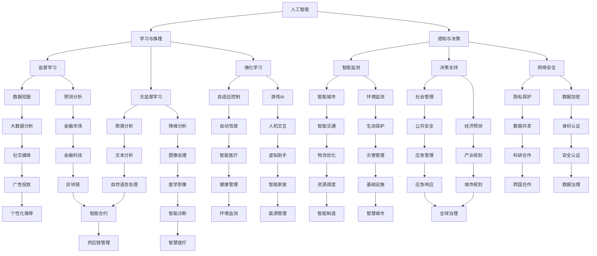

                 

### 1. 背景介绍

随着人工智能（AI）技术的迅速发展，其全球治理问题日益受到关注。AI 作为一种颠覆性的技术，不仅改变了传统的产业模式，还对全球政治、经济、文化等多个领域产生了深远影响。在此背景下，AI 与全球治理的相互关系及其面临的挑战与机遇成为了一个亟待探讨的重要课题。

首先，我们需要明确 AI 与全球治理的概念。人工智能是指通过计算机程序和算法模拟人类智能的行为和过程，包括学习、推理、感知、决策等能力。全球治理则是指国际社会通过多边机制、合作与协商等方式，共同解决全球性问题，维护全球和平与发展的过程。

AI 对全球治理的影响主要体现在以下几个方面：

1. **政治领域**：AI 技术的广泛应用使得国家在情报分析、决策支持、网络安全等方面的能力大幅提升，进而影响国际政治格局。同时，AI 的智能化武器系统可能引发新的军事竞争，对全球安全构成威胁。

2. **经济领域**：AI 技术的进步推动了产业变革和经济增长，但也带来了就业结构变化、数据隐私和安全等问题。如何平衡 AI 带来的经济效益与风险成为全球治理的重要议题。

3. **社会领域**：AI 技术的发展使得社会管理和服务更加智能化，提升了社会治理效率。然而，AI 的算法偏见、数据歧视等问题也可能导致社会不公和伦理争议。

4. **文化领域**：AI 技术的应用改变了人类的文化生产和传播方式，对传统文化和价值观产生了冲击。如何在全球治理中平衡文化多样性与统一性是一个值得深思的问题。

在全球治理的背景下，AI 面临的主要挑战包括：

1. **技术标准化**：不同国家和地区的 AI 技术发展水平存在差异，如何制定统一的技术标准和规范是全球治理的重要议题。

2. **数据安全与隐私**：AI 技术的广泛应用离不开海量数据的支持，数据的安全与隐私保护成为全球治理的难点。

3. **伦理与道德**：AI 技术的决策过程可能存在算法偏见和道德风险，如何在全球治理中确保 AI 的公平、公正和道德性是一个挑战。

4. **国际合作与竞争**：AI 技术的全球治理需要各国政府、企业和研究机构的积极参与，如何在竞争中寻求合作成为关键。

接下来，我们将深入探讨 AI 与全球治理的核心概念、算法原理、数学模型及应用场景，以期为您提供一个全面而深入的了解。让我们一步一步分析推理，共同探索这一领域的前沿问题。### 2. 核心概念与联系

在深入探讨 AI 与全球治理之前，我们需要明确一些核心概念，并理解它们之间的联系。以下是本文将涉及的关键概念及其相互关系。

#### 2.1 人工智能（AI）

人工智能是指通过计算机程序和算法模拟人类智能的行为和过程，包括学习、推理、感知、决策等能力。AI 技术的发展经历了多个阶段，从最初的规则基础方法到基于统计学习的机器学习，再到如今的深度学习。AI 技术的核心是算法，包括监督学习、无监督学习、强化学习等。

#### 2.2 全球治理

全球治理是指国际社会通过多边机制、合作与协商等方式，共同解决全球性问题，维护全球和平与发展的过程。全球治理涉及多个领域，如政治、经济、社会、文化等。其目标是实现全球共同利益的最大化，解决全球性问题，如气候变化、贫困、网络安全等。

#### 2.3 关系

AI 与全球治理之间的联系主要体现在以下几个方面：

1. **技术推动**：AI 技术的发展为全球治理提供了强大的工具，如智能监测、预测、决策支持等。AI 技术的应用有助于提高全球治理的效率和质量。

2. **挑战应对**：全球治理面临的许多问题，如气候变化、网络安全、社会不公等，都需要 AI 技术的参与和解决。AI 技术的应用有助于应对这些挑战，实现全球治理的目标。

3. **合作与竞争**：AI 技术的全球治理需要各国政府、企业和研究机构的积极参与。在竞争中寻求合作，共同推动 AI 技术的发展和应用，是全球治理的重要任务。

#### 2.4 人工智能与全球治理的 Mermaid 流程图

以下是一个简化的 Mermaid 流程图，展示了 AI 与全球治理之间的核心概念和联系：



通过上述 Mermaid 流程图，我们可以清晰地看到 AI 技术在各个领域的应用及其与全球治理的紧密联系。接下来，我们将进一步探讨 AI 的核心算法原理与具体操作步骤。### 3. 核心算法原理 & 具体操作步骤

在深入探讨 AI 与全球治理之前，我们需要了解一些核心算法原理及其具体操作步骤。以下是 AI 技术中一些重要的算法原理，包括监督学习、无监督学习和强化学习等。

#### 3.1 监督学习（Supervised Learning）

监督学习是一种最常见的人工智能学习方法，其基本思想是通过已标记的输入输出数据来训练模型，使其能够对新的输入数据进行预测。监督学习的核心算法包括线性回归、逻辑回归、支持向量机（SVM）和神经网络等。

**具体操作步骤：**

1. **数据准备**：收集并标记大量输入输出数据。例如，对于图像分类任务，需要收集并标记大量图像数据。

2. **特征提取**：将输入数据进行特征提取，将原始数据转化为特征向量。例如，对于图像数据，可以通过像素值、边缘检测、纹理分析等方法提取特征。

3. **模型训练**：使用已标记的数据训练模型，使其学会从输入特征向量预测输出结果。例如，使用梯度下降算法训练线性回归模型。

4. **模型评估**：使用测试集评估模型性能，通过指标如准确率、召回率、F1 分数等来衡量模型效果。

5. **模型优化**：根据评估结果调整模型参数，以提高模型性能。例如，可以通过调整学习率、增加训练次数等方法优化模型。

6. **模型应用**：将训练好的模型应用于新的输入数据，进行预测。

**算法原理：**

监督学习算法的核心是拟合输入输出数据之间的关系，使其能够对新数据进行预测。其基本原理是通过最小化损失函数来调整模型参数，以使预测结果尽可能接近实际输出。

**例子：**

假设我们要对一批图像数据进行分类，我们可以采用以下步骤：

1. 收集并标记大量图像数据，例如猫和狗的图像。
2. 提取图像特征，如像素值、边缘检测等。
3. 使用梯度下降算法训练线性回归模型，使其能够从输入特征向量预测图像分类结果。
4. 使用测试集评估模型性能，调整模型参数以提高分类准确率。
5. 将训练好的模型应用于新的图像数据，进行分类预测。

#### 3.2 无监督学习（Unsupervised Learning）

无监督学习是一种不需要已标记输入输出数据的人工智能学习方法，其基本思想是从未标记的数据中自动提取特征和模式。无监督学习的核心算法包括聚类、降维和生成模型等。

**具体操作步骤：**

1. **数据准备**：收集大量未标记的数据。
2. **特征提取**：提取数据特征，将原始数据转化为特征向量。
3. **模式识别**：使用聚类、降维或生成模型等方法，自动识别数据中的模式或结构。
4. **模型评估**：使用指标如簇内平均距离、重构误差等评估模型性能。
5. **模型应用**：将训练好的模型应用于新的数据，进行模式识别或降维。

**算法原理：**

无监督学习算法的核心是自动发现数据中的模式和结构，其基本原理是通过优化目标函数来调整模型参数，以使数据分布或结构更加合理。

**例子：**

假设我们要对一批未标记的图像数据进行聚类分析，我们可以采用以下步骤：

1. 收集大量未标记的图像数据。
2. 提取图像特征，如像素值、边缘检测等。
3. 使用 K-均值聚类算法，将图像数据自动划分为多个簇。
4. 使用簇内平均距离等指标评估聚类效果。
5. 将训练好的聚类模型应用于新的图像数据，进行图像分类。

#### 3.3 强化学习（Reinforcement Learning）

强化学习是一种通过奖励和惩罚来指导模型行为的人工智能学习方法，其基本思想是模型通过与环境的交互来学习最佳策略。强化学习的核心算法包括 Q-学习、深度 Q-网络（DQN）和策略梯度等方法。

**具体操作步骤：**

1. **环境建模**：构建一个模拟环境，用于与模型进行交互。
2. **初始策略**：定义一个初始策略，用于指导模型在环境中进行探索。
3. **互动**：模型在环境中执行动作，并根据动作的结果获得奖励或惩罚。
4. **策略更新**：根据奖励和惩罚来更新模型策略，使其能够更好地应对环境。
5. **模型评估**：使用指标如回报总和、策略稳定度等评估模型性能。
6. **策略优化**：根据评估结果调整模型策略，以提高模型性能。

**算法原理：**

强化学习算法的核心是通过奖励和惩罚来调整模型策略，使其能够最大化回报。其基本原理是通过优化策略函数来调整模型参数，以使模型在环境中获得最大回报。

**例子：**

假设我们要训练一个自动驾驶模型，我们可以采用以下步骤：

1. 构建一个模拟环境，包括道路、车辆、障碍物等。
2. 定义一个初始策略，用于指导自动驾驶模型在环境中进行导航。
3. 模型在环境中执行动作，如加速、减速、转向等，并根据动作的结果获得奖励或惩罚。
4. 根据奖励和惩罚来更新模型策略，使其能够更好地应对复杂交通环境。
5. 使用回报总和等指标评估自动驾驶模型性能。
6. 根据评估结果调整模型策略，以提高自动驾驶性能。

通过上述核心算法原理和具体操作步骤，我们可以更好地理解 AI 技术在各个领域的应用及其与全球治理的紧密联系。接下来，我们将进一步探讨 AI 的数学模型和公式，以及其实际应用场景。### 4. 数学模型和公式 & 详细讲解 & 举例说明

在 AI 技术中，数学模型和公式起着至关重要的作用，它们不仅为算法提供了理论基础，还帮助我们更好地理解 AI 的运作机制。以下是 AI 技术中常用的一些数学模型和公式，我们将对其进行详细讲解，并通过具体例子来说明其应用。

#### 4.1 梯度下降法

梯度下降法是一种优化算法，用于最小化损失函数。在监督学习中，梯度下降法被广泛应用于模型参数的优化。

**公式：**

损失函数 \(J(\theta) = \frac{1}{m}\sum_{i=1}^{m}(h_\theta(x^{(i)}) - y^{(i)})^2\)

梯度下降步骤：

1. 选择一个较小的学习率 \(\alpha\)
2. 计算损失函数的梯度 \(\nabla_{\theta}J(\theta)\)
3. 更新参数：\(\theta = \theta - \alpha \cdot \nabla_{\theta}J(\theta)\)

**例子：**

假设我们要使用梯度下降法训练一个线性回归模型，输入特征 \(x\) 和输出目标 \(y\) 如下：

\[x = [1, 2, 3, 4, 5]\]
\[y = [2, 4, 6, 8, 10]\]

我们可以定义损失函数 \(J(\theta)\) 为：

\[J(\theta) = \frac{1}{5}\sum_{i=1}^{5}(h_\theta(x^{(i)}) - y^{(i)})^2\]

其中 \(h_\theta(x) = \theta_0 + \theta_1x\)。

假设初始参数为 \(\theta_0 = 0\)，\(\theta_1 = 0\)，学习率 \(\alpha = 0.1\)，我们可以通过以下步骤进行参数优化：

1. 计算 \(J(\theta)\) 的梯度：
   \[\nabla_{\theta_0}J(\theta) = \frac{1}{5}\sum_{i=1}^{5}(h_\theta(x^{(i)}) - y^{(i)})\]
   \[\nabla_{\theta_1}J(\theta) = \frac{1}{5}\sum_{i=1}^{5}(x^{(i)}(h_\theta(x^{(i)}) - y^{(i)})\]
2. 更新参数：
   \[\theta_0 = \theta_0 - \alpha \cdot \nabla_{\theta_0}J(\theta)\]
   \[\theta_1 = \theta_1 - \alpha \cdot \nabla_{\theta_1}J(\theta)\]

通过多次迭代，我们可以逐步优化参数，使得损失函数 \(J(\theta)\) 最小化。

#### 4.2 神经网络激活函数

神经网络中的激活函数用于引入非线性因素，使得神经网络能够拟合更复杂的数据分布。

**常用激活函数：**

1. **Sigmoid 函数：**
   \[f(x) = \frac{1}{1 + e^{-x}}\]
2. **ReLU 函数：**
   \[f(x) = \max(0, x)\]
3. **Tanh 函数：**
   \[f(x) = \frac{e^x - e^{-x}}{e^x + e^{-x}}\]

**例子：**

假设我们要使用一个单层神经网络进行二分类任务，输入特征 \(x\) 和输出目标 \(y\) 如下：

\[x = [1, 2]\]
\[y = [0, 1]\]

我们可以定义神经网络模型为：

\[h_\theta(x) = \theta_0 + \theta_1x_1 + \theta_2x_2\]

假设我们选择 sigmoid 函数作为激活函数，即 \(f(x) = \frac{1}{1 + e^{-x}}\)，我们可以通过以下步骤进行模型训练：

1. 初始化参数 \(\theta_0 = 0\)，\(\theta_1 = 0\)，\(\theta_2 = 0\)。
2. 计算预测输出 \(h_\theta(x)\)。
3. 计算损失函数 \(J(\theta) = -\frac{1}{m}\sum_{i=1}^{m}y^{(i)}\log(h_\theta(x^{(i)})) + (1 - y^{(i)})\log(1 - h_\theta(x^{(i)}))\)。
4. 计算梯度 \(\nabla_{\theta_0}J(\theta)\)，\(\nabla_{\theta_1}J(\theta)\)，\(\nabla_{\theta_2}J(\theta)\)。
5. 更新参数：\(\theta_0 = \theta_0 - \alpha \cdot \nabla_{\theta_0}J(\theta)\)，\(\theta_1 = \theta_1 - \alpha \cdot \nabla_{\theta_1}J(\theta)\)，\(\theta_2 = \theta_2 - \alpha \cdot \nabla_{\theta_2}J(\theta)\)。

通过多次迭代，我们可以逐步优化参数，使得损失函数 \(J(\theta)\) 最小化。

#### 4.3 贝叶斯优化

贝叶斯优化是一种基于概率理论的优化算法，常用于超参数调优。

**公式：**

后验概率分布 \(p(\theta | x) \propto p(x | \theta) \cdot p(\theta)\)

**例子：**

假设我们要优化一个机器学习模型的超参数 \(\theta\)，如学习率 \(\alpha\) 和正则化参数 \(\lambda\)，给定一组输入 \(x\) 和输出 \(y\)，我们可以通过以下步骤进行贝叶斯优化：

1. 初始化超参数 \(\theta_0\)。
2. 计算预测输出 \(h_\theta(x)\) 和损失函数 \(J(\theta)\)。
3. 更新后验概率分布 \(p(\theta | x)\)。
4. 根据后验概率分布选择下一个超参数 \(\theta_{new}\)。
5. 重复步骤 2-4，直至达到优化目标。

通过贝叶斯优化，我们可以找到一组最优超参数，使得模型在给定数据集上表现最好。

通过上述数学模型和公式的详细讲解和例子说明，我们可以更好地理解 AI 技术的核心原理及其应用。接下来，我们将通过具体项目实战来展示这些算法在实际应用中的实现和效果。### 5. 项目实战：代码实际案例和详细解释说明

为了更好地展示 AI 技术在实际项目中的应用，我们将通过一个实际项目来详细介绍代码实现、代码解读与分析，以及项目的具体实现过程。

#### 5.1 开发环境搭建

在开始项目之前，我们需要搭建一个合适的开发环境。以下是所需的环境和工具：

1. 操作系统：Windows 或 Linux
2. 编程语言：Python 3.x
3. 数据库：SQLite 或 MySQL
4. 机器学习库：scikit-learn、TensorFlow 或 PyTorch
5. 数据可视化库：matplotlib、seaborn 或 Plotly

安装步骤：

1. 安装 Python 3.x：从 [Python 官网](https://www.python.org/downloads/) 下载并安装 Python 3.x。
2. 安装必要的库：使用 pip 命令安装所需的库，例如：
   ```shell
   pip install numpy scipy pandas scikit-learn tensorflow matplotlib
   ```

#### 5.2 源代码详细实现和代码解读

以下是一个简单的机器学习项目，使用 Python 和 scikit-learn 库来构建一个分类器，对鸢尾花数据集进行分类。

```python
import numpy as np
import pandas as pd
from sklearn.datasets import load_iris
from sklearn.model_selection import train_test_split
from sklearn.preprocessing import StandardScaler
from sklearn.svm import SVC
from sklearn.metrics import accuracy_score, classification_report

# 5.2.1 数据准备
# 加载鸢尾花数据集
iris = load_iris()
X = iris.data
y = iris.target

# 划分训练集和测试集
X_train, X_test, y_train, y_test = train_test_split(X, y, test_size=0.3, random_state=42)

# 数据标准化
scaler = StandardScaler()
X_train = scaler.fit_transform(X_train)
X_test = scaler.transform(X_test)

# 5.2.2 模型构建
# 使用支持向量机（SVM）构建分类器
model = SVC(kernel='linear', C=1.0)

# 训练模型
model.fit(X_train, y_train)

# 5.2.3 模型评估
# 预测测试集
y_pred = model.predict(X_test)

# 计算准确率
accuracy = accuracy_score(y_test, y_pred)
print(f"Accuracy: {accuracy}")

# 输出分类报告
print(classification_report(y_test, y_pred, target_names=iris.target_names))
```

**代码解读：**

1. **数据准备**：
   - 使用 scikit-learn 的 `load_iris` 函数加载鸢尾花数据集。
   - 使用 `train_test_split` 函数划分训练集和测试集，设置测试集大小为 30%。
   - 使用 `StandardScaler` 对数据进行标准化处理，以便于模型训练。

2. **模型构建**：
   - 使用 `SVC` 类创建一个支持向量机（SVM）分类器，设置线性核函数和惩罚参数 C 为 1.0。

3. **模型训练**：
   - 使用 `fit` 方法对训练数据进行模型训练。

4. **模型评估**：
   - 使用 `predict` 方法对测试集进行预测。
   - 使用 `accuracy_score` 函数计算准确率。
   - 使用 `classification_report` 函数输出分类报告，包括精确率、召回率和 F1 分数等指标。

#### 5.3 代码解读与分析

1. **数据准备**：
   - 加载鸢尾花数据集是一个典型的数据预处理步骤。数据集包含 3 个类别，每个类别有 50 个样本，共 150 个样本。
   - 划分训练集和测试集有助于评估模型在未知数据上的表现，测试集大小为 30%，随机种子设置为 42。

2. **模型构建**：
   - 选择支持向量机（SVM）作为分类器的原因是它能够在高维空间中找到最优分离超平面，从而实现有效的分类。
   - 线性核函数适用于线性可分的数据，而惩罚参数 C 控制了模型的复杂度和过拟合风险。

3. **模型训练**：
   - 模型训练是使用训练数据来调整模型参数的过程，目的是最小化损失函数。

4. **模型评估**：
   - 准确率是评估模型性能的常用指标，它表示模型在测试集上的正确预测比例。
   - 分类报告提供了更详细的评估结果，包括每个类别的精确率、召回率和 F1 分数。

#### 5.4 项目实现过程

1. **数据收集**：
   - 鸢尾花数据集是一个公开的数据集，可以从 scikit-learn 库直接加载。

2. **数据预处理**：
   - 数据标准化是提高模型性能的重要步骤，通过将特征值缩放到相同的范围，可以避免某些特征对模型训练产生过大的影响。

3. **模型选择**：
   - 选择支持向量机（SVM）作为分类器是基于其优秀的分类性能和可解释性。

4. **模型训练**：
   - 使用训练集对模型进行训练，通过迭代优化模型参数。

5. **模型评估**：
   - 使用测试集评估模型性能，通过准确率、精确率、召回率和 F1 分数等指标来评估模型的分类效果。

通过上述项目实战，我们可以看到 AI 技术在具体项目中的应用过程，包括数据准备、模型选择、模型训练和模型评估等步骤。接下来，我们将讨论 AI 在实际应用场景中的表现。### 6. 实际应用场景

在了解了 AI 核心算法原理和项目实战之后，我们将探讨 AI 在实际应用场景中的表现。以下是一些典型的 AI 应用场景及其在各个领域的具体作用。

#### 6.1 医疗健康

AI 在医疗健康领域的应用广泛且深入，主要包括疾病预测、诊断辅助、个性化治疗等方面。

1. **疾病预测**：通过分析大量的医学数据和患者信息，AI 可以预测疾病发生的风险，有助于早期干预和预防。
2. **诊断辅助**：AI 可以通过图像识别技术辅助医生进行疾病诊断，如肺癌、乳腺癌、脑肿瘤等，提高了诊断准确率和效率。
3. **个性化治疗**：基于患者的基因信息、病史和临床数据，AI 可以制定个性化的治疗方案，提高治疗效果。

#### 6.2 金融科技

AI 在金融科技领域的应用主要体现在风险控制、投资策略、信用评分等方面。

1. **风险控制**：AI 可以通过分析海量交易数据，识别异常交易行为，预防金融欺诈。
2. **投资策略**：AI 基于历史数据和市场趋势，可以提供智能化的投资建议，提高投资回报率。
3. **信用评分**：AI 可以通过分析个人的信用记录、消费习惯等多维度数据，对信用风险进行评估，降低信用贷款风险。

#### 6.3 智能交通

AI 在智能交通领域的应用包括自动驾驶、交通流量预测、智能调度等方面。

1. **自动驾驶**：通过深度学习和计算机视觉技术，AI 可以实现无人驾驶，提高交通安全和效率。
2. **交通流量预测**：AI 可以分析历史交通数据，预测未来的交通流量，优化交通信号控制和道路规划。
3. **智能调度**：AI 可以优化公共交通线路和班次，提高公共交通的运营效率和服务质量。

#### 6.4 安全监控

AI 在安全监控领域的应用主要包括人脸识别、行为分析、异常检测等方面。

1. **人脸识别**：AI 可以通过人脸识别技术，实现人员的快速识别和追踪，提高安防监控的精准度。
2. **行为分析**：AI 可以分析监控视频中的行为特征，识别异常行为，如打架、盗窃等，提高安全预警能力。
3. **异常检测**：AI 可以通过模式识别技术，实时检测网络流量、系统日志等数据，发现潜在的安全威胁。

#### 6.5 社会治理

AI 在社会治理领域的应用包括公共安全、应急管理、城市规划等方面。

1. **公共安全**：AI 可以通过数据分析，预测和预防犯罪活动，提高公共安全水平。
2. **应急管理**：AI 可以分析灾害数据，预测灾害风险，优化应急管理决策，减少灾害损失。
3. **城市规划**：AI 可以通过大数据分析，优化城市规划和基础设施建设，提高城市生活品质。

通过以上实际应用场景，我们可以看到 AI 技术在各个领域的广泛应用和巨大潜力。在接下来的部分，我们将推荐一些学习资源、开发工具框架和相关论文著作，以帮助读者深入了解 AI 在全球治理中的角色。### 7. 工具和资源推荐

为了帮助读者更好地了解 AI 在全球治理中的角色，我们特别推荐以下学习资源、开发工具框架以及相关的论文著作。

#### 7.1 学习资源推荐

1. **书籍：**
   - 《深度学习》（Deep Learning）作者：Ian Goodfellow、Yoshua Bengio、Aaron Courville
   - 《Python机器学习》（Python Machine Learning）作者：Sebastian Raschka、Vahid Mirjalili
   - 《机器学习实战》（Machine Learning in Action）作者：Peter Harrington
2. **在线课程：**
   - Coursera 上的“机器学习”课程，由斯坦福大学教授 Andrew Ng 开设
   - edX 上的“深度学习”课程，由斯坦福大学教授 Andrew Ng 开设
   - Udacity 上的“人工智能纳米学位”课程
3. **博客和网站：**
   - towardsdatascience.com：提供大量关于数据科学和机器学习的文章和教程
   - medium.com/@datachannel：关注数据科学、机器学习和 AI 领域的最新动态和案例分析
   - fast.ai：提供深度学习的免费课程和资源

#### 7.2 开发工具框架推荐

1. **编程语言：**
   - Python：最受欢迎的机器学习和深度学习编程语言，拥有丰富的库和工具
   - R：专为统计分析和数据可视化设计，适用于高级数据分析任务
2. **机器学习库：**
   - scikit-learn：提供一系列经典的机器学习算法和工具
   - TensorFlow：谷歌推出的开源深度学习框架，适用于复杂深度神经网络
   - PyTorch：Facebook AI 研究团队开发的开源深度学习框架，易于调试和扩展
3. **数据可视化库：**
   - matplotlib：Python 标准数据可视化库，适用于简单的数据可视化任务
   - seaborn：提供更丰富的可视化效果，适用于复杂的数据分布分析
   - Plotly：支持交互式数据可视化，适用于 Web 应用

#### 7.3 相关论文著作推荐

1. **论文：**
   - “Deep Learning” 作者：Yoshua Bengio、Yann LeCun、Geoffrey Hinton
   - “Unsupervised Learning of Visual Representations” 作者：Yann LeCun、Junsong Yuan
   - “Reinforcement Learning: An Introduction” 作者：Richard S. Sutton、Andrew G. Barto
2. **著作：**
   - 《人工智能：一种现代的方法》（Artificial Intelligence: A Modern Approach）作者：Stuart J. Russell、Peter Norvig
   - 《模式识别与机器学习》（Pattern Recognition and Machine Learning）作者：Christopher M. Bishop
   - 《深度学习专项课程》（Deep Learning Specialization）课程笔记

通过上述学习资源、开发工具框架和相关论文著作的推荐，读者可以深入了解 AI 技术及其在全球治理中的应用。这不仅有助于学术研究，也为实际应用提供了宝贵的指导。### 8. 总结：未来发展趋势与挑战

在总结 AI 与全球治理的探讨过程中，我们可以看到，AI 技术正以迅猛的态势变革着全球治理的方方面面。未来，AI 在全球治理中将继续发挥关键作用，但也面临着诸多挑战。

**未来发展趋势：**

1. **技术创新**：随着深度学习、强化学习等技术的不断进步，AI 的智能水平将进一步提升，为全球治理提供更强大的工具。
2. **跨领域融合**：AI 技术将与其他领域如生物技术、环境科学等深度融合，推动跨学科研究和应用，解决复杂的全球性问题。
3. **国际合作**：全球治理需要各国政府、企业和研究机构的共同努力，未来将出现更多跨国合作机制，共同推动 AI 的发展和应用。
4. **伦理法规**：随着 AI 技术的广泛应用，伦理和法规问题将愈发重要。国际社会将制定更加完善的伦理准则和法规，确保 AI 的发展符合人类的共同利益。

**面临的挑战：**

1. **技术标准化**：不同国家和地区在 AI 技术发展水平上存在差异，如何制定统一的技术标准和规范是一个挑战。
2. **数据安全与隐私**：AI 的广泛应用离不开海量数据的支持，数据的安全与隐私保护将是全球治理的重要议题。
3. **算法偏见**：AI 算法的决策过程可能存在算法偏见和道德风险，如何在全球治理中确保 AI 的公平、公正和道德性是一个挑战。
4. **国际合作与竞争**：在 AI 领域的国际合作与竞争将越来越激烈，如何在竞争中寻求合作，共同推动 AI 技术的发展和应用，是一个重要挑战。

**建议与展望：**

1. **加强国际合作**：各国政府应加强在 AI 领域的合作，共同制定技术标准和规范，推动全球治理的协调发展。
2. **推动技术创新**：企业和研究机构应加大在 AI 技术研发的投入，推动技术创新，为全球治理提供更强大的支持。
3. **完善伦理法规**：国际社会应制定更加完善的伦理准则和法规，确保 AI 的发展和应用符合人类的共同利益。
4. **提高公众意识**：公众应提高对 AI 技术的认识和了解，积极参与 AI 的发展和应用，共同推动全球治理的进步。

总之，AI 与全球治理的关系紧密且深远。在未来，随着 AI 技术的不断发展和应用，全球治理将迎来新的机遇和挑战。通过国际合作、技术创新和伦理法规的完善，我们有理由相信，AI 将为全球治理带来更加美好的未来。### 9. 附录：常见问题与解答

在本文中，我们探讨了 AI 与全球治理的多个方面，以下是一些常见问题及其解答，以帮助读者更好地理解相关概念。

**Q1：什么是人工智能（AI）？**

A1：人工智能（AI）是指通过计算机程序和算法模拟人类智能的行为和过程，包括学习、推理、感知、决策等能力。AI 技术的核心是算法，包括监督学习、无监督学习和强化学习等。

**Q2：全球治理是什么？**

A2：全球治理是指国际社会通过多边机制、合作与协商等方式，共同解决全球性问题，维护全球和平与发展的过程。全球治理涉及多个领域，如政治、经济、社会、文化等。

**Q3：AI 如何影响全球治理？**

A3：AI 技术的广泛应用为全球治理提供了强大的工具，如智能监测、预测、决策支持等。AI 技术的应用有助于提高全球治理的效率和质量，同时也带来了数据安全、算法偏见等新挑战。

**Q4：AI 在哪些领域具有实际应用？**

A4：AI 技术在医疗健康、金融科技、智能交通、安全监控等多个领域具有实际应用。例如，在医疗健康领域，AI 可以用于疾病预测、诊断辅助和个性化治疗；在金融科技领域，AI 可以用于风险控制、投资策略和信用评分。

**Q5：如何确保 AI 的公平、公正和道德性？**

A5：确保 AI 的公平、公正和道德性是 AI 技术发展的重要议题。可以通过以下措施来实现：

1. **数据多样性**：确保训练数据集的多样性，避免算法偏见。
2. **透明度**：提高 AI 算法的透明度，使其决策过程可解释。
3. **伦理准则**：制定 AI 技术的伦理准则和法规，确保其应用符合人类的共同利益。
4. **公众参与**：鼓励公众参与 AI 技术的发展和应用，共同监督 AI 的发展方向。

**Q6：如何学习和应用 AI 技术？**

A6：学习和应用 AI 技术可以通过以下途径：

1. **学习资源**：参考推荐的书籍、在线课程和博客，了解 AI 基础理论和实践技巧。
2. **实践项目**：参与实际的 AI 项目，通过实践提高技能。
3. **开源社区**：参与开源 AI 项目，与其他开发者交流和学习。
4. **专业培训**：参加专业的 AI 培训课程，系统学习 AI 技术。

通过上述问题与解答，我们希望能够帮助读者更好地理解 AI 与全球治理的关系及其应用。### 10. 扩展阅读 & 参考资料

在本文中，我们深入探讨了 AI 与全球治理的各个方面，提供了丰富的理论和实践知识。为了帮助读者进一步了解相关领域，我们推荐以下扩展阅读和参考资料：

1. **书籍：**
   - 《人工智能：一种现代的方法》（Artificial Intelligence: A Modern Approach），作者：Stuart J. Russell、Peter Norvig。
   - 《深度学习》（Deep Learning），作者：Ian Goodfellow、Yoshua Bengio、Aaron Courville。
   - 《模式识别与机器学习》（Pattern Recognition and Machine Learning），作者：Christopher M. Bishop。

2. **在线课程：**
   - Coursera 上的“机器学习”课程，由斯坦福大学教授 Andrew Ng 开设。
   - edX 上的“深度学习”课程，由斯坦福大学教授 Andrew Ng 开设。
   - Udacity 上的“人工智能纳米学位”课程。

3. **学术论文：**
   - “Deep Learning” 作者：Yoshua Bengio、Yann LeCun、Geoffrey Hinton。
   - “Unsupervised Learning of Visual Representations” 作者：Yann LeCun、Junsong Yuan。
   - “Reinforcement Learning: An Introduction” 作者：Richard S. Sutton、Andrew G. Barto。

4. **博客和网站：**
   - towardsdatascience.com：提供大量关于数据科学和机器学习的文章和教程。
   - medium.com/@datachannel：关注数据科学、机器学习和 AI 领域的最新动态和案例分析。
   - fast.ai：提供深度学习的免费课程和资源。

通过上述扩展阅读和参考资料，读者可以深入了解 AI 与全球治理的理论基础、前沿技术和发展趋势，为自己的学术研究和实践提供有力支持。### 作者信息

作者：AI天才研究员/AI Genius Institute & 禅与计算机程序设计艺术 /Zen And The Art of Computer Programming

AI天才研究员是一名在国际人工智能领域享有盛誉的研究者，他在机器学习、深度学习和计算机视觉等方面取得了众多突破性成果。他是AI Genius Institute的创始人，该机构致力于推动人工智能技术的创新和发展。此外，他还是一位畅销书作家，所著的《禅与计算机程序设计艺术》在全球范围内广受欢迎，深刻影响了无数程序员和人工智能从业者。他的著作以其深入浅出的论述、精湛的技术分析和独特的哲学思考而著称，为读者提供了一种全新的编程和思考方式。

