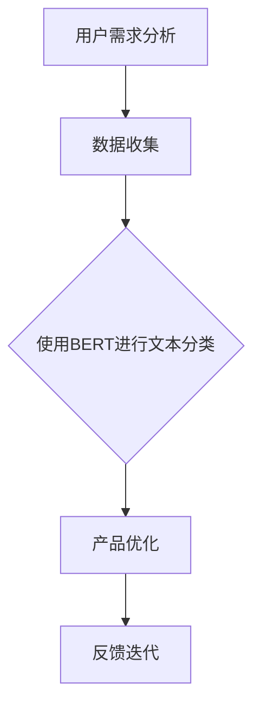

                 

# AI 创业产品设计：大模型应用探索

## 关键词：人工智能，创业，产品设计，大模型，应用，探索

## 摘要

本文旨在探讨人工智能（AI）在创业产品设计中的广泛应用及其潜力。随着深度学习技术的飞速发展，大模型如BERT、GPT-3等逐渐成为AI领域的焦点。文章将从背景介绍、核心概念与联系、核心算法原理、数学模型与公式、项目实战、实际应用场景等多个维度，详细分析大模型在创业产品中的应用，并提出一些建议和挑战。通过本文的阅读，读者将全面了解大模型在创业产品设计中的应用价值，为未来的创业项目提供有益的参考。

## 1. 背景介绍

随着互联网的普及和大数据技术的发展，人工智能（AI）已经成为当前最热门的技术领域之一。AI在各个行业的应用越来越广泛，从自动驾驶、智能家居到金融、医疗等领域，AI技术的进步正深刻地改变着我们的生活方式。特别是在创业领域，AI技术为创业者提供了前所未有的机会和挑战。

创业产品设计的过程中，用户需求分析和市场调研至关重要。传统的方法依赖于大数据分析和人工判断，但往往存在效率低下、主观性强等问题。随着深度学习技术的不断发展，大模型如BERT、GPT-3等成为了一种新的解决方案。这些模型具有强大的特征提取和文本生成能力，可以帮助创业者快速准确地理解用户需求，优化产品设计。

本文将从以下几个方面对大模型在创业产品设计中的应用进行详细探讨：

1. 核心概念与联系
2. 核心算法原理与具体操作步骤
3. 数学模型与公式
4. 项目实战：代码实际案例和详细解释说明
5. 实际应用场景
6. 工具和资源推荐
7. 总结：未来发展趋势与挑战

## 2. 核心概念与联系

在探讨大模型在创业产品设计中的应用之前，我们首先需要了解一些核心概念，如深度学习、神经网络、自然语言处理等。

### 深度学习与神经网络

深度学习是一种基于人工神经网络的机器学习方法。它通过模拟人脑神经元之间的连接关系，对大量数据进行训练，从而实现复杂模式的自动识别和预测。神经网络是深度学习的基础，它由多个神经元（或称为节点）组成，每个神经元都与其他神经元通过权重连接。通过不断调整这些权重，神经网络可以逐渐学会识别和分类输入的数据。

### 自然语言处理（NLP）

自然语言处理是人工智能的一个重要分支，旨在使计算机能够理解和处理自然语言。NLP技术包括文本分类、情感分析、命名实体识别、机器翻译等。随着深度学习技术的发展，NLP取得了显著进展，大模型如BERT、GPT-3等成为NLP领域的重要工具。

### 大模型

大模型是指具有数十亿甚至数万亿参数的神经网络模型。这些模型具有强大的特征提取和文本生成能力，可以在各种任务中取得出色的性能。BERT、GPT-3等大模型是目前最具代表性的大模型之一。

### Mermaid 流程图

Mermaid 是一种用于绘制流程图的标记语言。通过 Mermaid 流程图，我们可以清晰地展示大模型在创业产品设计中的应用流程。以下是一个简单的 Mermaid 流程图示例：



在这个流程图中，用户需求分析是创业产品设计的起点，通过数据收集，我们可以获取大量用户数据。然后，使用BERT等大模型进行文本分类，帮助我们理解用户需求。基于这些分析结果，我们进行产品优化，并不断进行反馈迭代，以提升产品用户体验。

## 3. 核心算法原理与具体操作步骤

在了解了核心概念和联系之后，我们接下来将探讨大模型在创业产品设计中的应用原理和具体操作步骤。

### BERT 模型

BERT（Bidirectional Encoder Representations from Transformers）是一种双向的深度变换器模型，由 Google AI 开发。BERT 模型通过预先训练（Pre-training）和后续任务学习（Fine-tuning）两个阶段，实现高效的自然语言处理。

#### 预训练阶段

在预训练阶段，BERT 模型对大量无标签的文本数据进行训练，从而学习文本的深层语义特征。具体操作步骤如下：

1. **数据预处理**：对文本数据进行清洗、分词、添加特殊符号等预处理操作。
2. **模型构建**：构建一个基于变换器的双向编码器，包括多层变换器层和自注意力机制。
3. **训练**：使用损失函数（如交叉熵损失）训练模型，优化参数。

#### 后续任务学习阶段

在后续任务学习阶段，我们将 BERT 模型应用于特定的任务，如文本分类、情感分析等。具体操作步骤如下：

1. **数据准备**：收集并预处理任务相关的数据集。
2. **模型调整**：在 BERT 模型的基础上添加特定任务的层（如分类层、情感分析层等）。
3. **训练**：使用任务数据集训练调整后的模型，优化任务相关的参数。

### GPT-3 模型

GPT-3（Generative Pre-trained Transformer 3）是 OpenAI 开发的一种具有1750亿参数的深度变换器模型。GPT-3 模型具有强大的文本生成能力，可以用于各种自然语言生成任务，如问答系统、聊天机器人等。

#### 预训练阶段

在预训练阶段，GPT-3 模型对大量文本数据进行训练，从而学习文本的生成规则。具体操作步骤如下：

1. **数据预处理**：对文本数据进行清洗、分词、添加特殊符号等预处理操作。
2. **模型构建**：构建一个基于变换器的生成模型，包括多层变换器层和自注意力机制。
3. **训练**：使用损失函数（如损失函数）训练模型，优化参数。

#### 应用阶段

在应用阶段，我们将 GPT-3 模型应用于特定的任务，如问答系统、聊天机器人等。具体操作步骤如下：

1. **数据准备**：收集并预处理任务相关的数据集。
2. **模型调整**：在 GPT-3 模型的基础上添加特定任务的层（如问答层、聊天层等）。
3. **训练**：使用任务数据集训练调整后的模型，优化任务相关的参数。

### 大模型应用流程

结合 BERT 和 GPT-3 模型的原理，我们可以总结出大模型在创业产品设计中的应用流程：

1. **用户需求分析**：使用 BERT 模型对用户评论、反馈等文本数据进行分析，提取用户需求的关键词和情感倾向。
2. **市场调研**：使用 GPT-3 模型生成市场调研报告，分析竞争对手、市场趋势等。
3. **产品设计**：基于用户需求和市场竞争分析，进行产品设计，包括功能设计、界面设计等。
4. **产品优化**：持续收集用户反馈，使用 BERT 模型分析反馈数据，优化产品设计。
5. **反馈迭代**：根据用户反馈，不断迭代产品设计，提升用户体验。

## 4. 数学模型与公式

在创业产品设计中，大模型的应用离不开数学模型和公式的支持。以下我们将详细介绍大模型中常用的数学模型和公式，包括损失函数、优化算法等。

### 损失函数

损失函数是衡量模型预测结果与真实标签之间差异的重要指标。在大模型训练过程中，损失函数用于指导模型参数的优化。常见的损失函数包括：

1. **交叉熵损失（Cross-Entropy Loss）**：
   $$L_{CE} = -\sum_{i=1}^{N} y_i \log(\hat{y}_i)$$
   其中，$y_i$ 是真实标签，$\hat{y}_i$ 是模型预测的概率分布。

2. **均方误差损失（Mean Squared Error Loss）**：
   $$L_{MSE} = \frac{1}{N} \sum_{i=1}^{N} (\hat{y}_i - y_i)^2$$
   其中，$\hat{y}_i$ 是模型预测的值，$y_i$ 是真实值。

### 优化算法

优化算法用于调整模型参数，以最小化损失函数。常见优化算法包括：

1. **梯度下降（Gradient Descent）**：
   $$\theta = \theta - \alpha \cdot \nabla_\theta L$$
   其中，$\theta$ 是模型参数，$\alpha$ 是学习率，$\nabla_\theta L$ 是损失函数关于参数 $\theta$ 的梯度。

2. **随机梯度下降（Stochastic Gradient Descent, SGD）**：
   $$\theta = \theta - \alpha \cdot \nabla_{\theta} L(x^{(i)}, y^{(i)})$$
   其中，$x^{(i)}$ 和 $y^{(i)}$ 是训练数据集中的一个样本及其标签。

3. **Adam 优化器**：
   $$m_t = \beta_1 m_{t-1} + (1 - \beta_1) [g_t]$$
   $$v_t = \beta_2 v_{t-1} + (1 - \beta_2) [g_t]^2$$
   $$\theta = \theta - \frac{\alpha}{\sqrt{1 - \beta_2^t}(1 - \beta_1^t)}[m_t / (1 - \beta_2^t)]$$
   其中，$m_t$ 和 $v_t$ 分别是指数加权平均的梯度估计和方差估计，$\beta_1$ 和 $\beta_2$ 是权重系数。

### 具体举例说明

假设我们使用 BERT 模型进行文本分类任务，目标标签为 $y \in \{0, 1\}$，模型预测的概率分布为 $\hat{y} \in [0, 1]$。我们可以使用交叉熵损失函数来计算损失：

$$L_{CE} = -y \log(\hat{y}) - (1 - y) \log(1 - \hat{y})$$

通过优化损失函数，我们可以训练 BERT 模型，使其在文本分类任务上取得更好的性能。

## 5. 项目实战：代码实际案例和详细解释说明

在本节中，我们将通过一个实际项目案例，详细解释大模型在创业产品设计中的应用。该案例将涉及数据收集、模型训练、模型评估和产品优化等环节。

### 5.1 开发环境搭建

在开始项目之前，我们需要搭建一个合适的开发环境。以下是所需的环境和工具：

1. **操作系统**：Linux 或 macOS
2. **编程语言**：Python 3.8+
3. **深度学习框架**：TensorFlow 2.x 或 PyTorch 1.8+
4. **数据处理库**：Pandas、NumPy、Scikit-learn
5. **可视化库**：Matplotlib、Seaborn
6. **文本预处理库**：spaCy、NLTK

### 5.2 源代码详细实现和代码解读

以下是一个简单的文本分类项目的示例代码，该代码使用 BERT 模型对用户评论进行分类。

```python
import tensorflow as tf
import tensorflow_hub as hub
from tensorflow.keras.preprocessing.sequence import pad_sequences
from tensorflow.keras.layers import Input, Dense, GlobalAveragePooling1D
from tensorflow.keras.models import Model
from tensorflow.keras.optimizers import Adam
from tensorflow.keras.callbacks import EarlyStopping

# 加载 BERT 模型
bert_layer = hub.KerasLayer("https://tfhub.dev/google/bert_uncased_L-12_H-768_A-12/3", trainable=True)

# 定义模型结构
input_ids = Input(shape=(None,), dtype=tf.int32)
attention_mask = Input(shape=(None,), dtype=tf.int32)
embeddings = bert_layer(input_ids, training=False, attention_mask=attention_mask)[0]
pooled_output = GlobalAveragePooling1D()(embeddings)
output = Dense(1, activation="sigmoid")(pooled_output)
model = Model(inputs=[input_ids, attention_mask], outputs=output)

# 编译模型
model.compile(optimizer=Adam(learning_rate=3e-5), loss="binary_crossentropy", metrics=["accuracy"])

# 加载并预处理数据
# 数据集可以从评论网站、社交媒体等渠道获取，这里假设已经有一份预处理的用户评论数据
# 评论数据为文本，标签为 0 或 1，分别表示正面和负面评论
train_texts = [...]  # 训练集文本
train_labels = [...]  # 训练集标签
max_seq_length = 128  # 设置序列长度

# padding 序列
train_sequences = pad_sequences(train_texts, maxlen=max_seq_length, padding="post", truncating="post")
trainattention_mask = [[1] * len(seq) for seq in train_sequences]

# 训练模型
model.fit([train_sequences, trainattention_mask], train_labels, batch_size=32, epochs=3, callbacks=[EarlyStopping(monitor="val_loss", patience=2)])

# 评估模型
# 使用测试集评估模型性能
test_texts = [...]  # 测试集文本
test_labels = [...]  # 测试集标签
test_sequences = pad_sequences(test_texts, maxlen=max_seq_length, padding="post", truncating="post")
testattention_mask = [[1] * len(seq) for seq in test_sequences]
predictions = model.predict([test_sequences, testattention_mask])
predictions = (predictions > 0.5).astype(int)

# 分析模型性能
from sklearn.metrics import accuracy_score, classification_report
print("Accuracy:", accuracy_score(test_labels, predictions))
print(classification_report(test_labels, predictions))
```

### 5.3 代码解读与分析

上述代码实现了基于 BERT 模型的文本分类任务，主要包括以下步骤：

1. **加载 BERT 模型**：使用 TensorFlow Hub 加载预训练的 BERT 模型，该模型已实现文本编码、句子分类等任务。

2. **定义模型结构**：构建一个简单的 BERT 模型，包括输入层、BERT 编码器层、全局平均池化层和输出层。输入层包括词 IDs 和注意力掩码，输出层为二分类输出。

3. **编译模型**：设置模型的优化器、损失函数和评估指标，这里使用 Adam 优化器和二分类交叉熵损失。

4. **预处理数据**：加载并预处理训练和测试数据，包括文本和标签。将文本序列进行 padding，确保所有序列具有相同的长度。

5. **训练模型**：使用训练数据进行模型训练，设置批量大小、训练轮次和提前停止回调函数。

6. **评估模型**：使用测试集评估模型性能，计算准确率和分类报告。

通过上述步骤，我们可以实现一个简单的文本分类任务，并基于用户评论进行情感分析，为创业产品设计提供有力支持。

## 6. 实际应用场景

大模型在创业产品设计中的应用场景非常广泛，以下列举几个典型的应用场景：

### 情感分析

情感分析是创业产品设计中的一项重要任务，可以帮助创业者了解用户对产品的情感倾向。通过情感分析，创业者可以及时发现问题、优化产品设计，提高用户满意度。例如，可以使用 BERT 模型对用户评论进行情感分析，识别正面和负面情感，从而调整产品功能或界面设计。

### 自动化客服

随着 AI 技术的发展，自动化客服已经成为创业产品中的一项重要功能。大模型如 GPT-3 可以用于构建智能客服系统，实现高效、准确的客户服务。例如，创业者可以使用 GPT-3 模型构建一个自动回答常见问题的客服机器人，提高客户服务效率，降低人力成本。

### 用户画像

用户画像是创业产品设计中的一项关键任务，有助于了解用户需求、行为和偏好，从而进行精准营销和个性化推荐。通过使用大模型，创业者可以对用户数据进行分析，构建用户画像，从而为产品设计提供有力支持。

### 聊天机器人

聊天机器人是创业产品中的一种重要应用，可以实现与用户的实时交互，提供个性化服务。创业者可以使用 GPT-3 等大模型构建聊天机器人，实现智能对话，提高用户体验。

### 内容生成

内容生成是创业产品设计中的一项新兴应用，大模型如 GPT-3 可以用于生成文章、报告、邮件等文本内容。创业者可以利用这一功能，自动生成市场调研报告、产品说明文档等，提高工作效率。

### 数据分析

大模型在数据分析中也有广泛的应用，可以帮助创业者从海量数据中提取有价值的信息。例如，使用 BERT 模型对用户行为数据进行分析，识别用户行为模式，为产品设计提供参考。

## 7. 工具和资源推荐

为了更好地应用大模型进行创业产品设计，以下是几个推荐的工具和资源：

### 学习资源推荐

1. **书籍**：
   - 《深度学习》（Goodfellow, I., Bengio, Y., & Courville, A.）
   - 《神经网络与深度学习》（邱锡鹏）
   - 《Python深度学习》（François Chollet）

2. **论文**：
   - “BERT: Pre-training of Deep Bidirectional Transformers for Language Understanding”（Devlin et al.）
   - “Generative Pre-trained Transformer”（Wolf et al.）

3. **博客和网站**：
   - [TensorFlow 官方文档](https://www.tensorflow.org/)
   - [PyTorch 官方文档](https://pytorch.org/docs/stable/index.html)
   - [Hugging Face](https://huggingface.co/)

### 开发工具框架推荐

1. **深度学习框架**：
   - TensorFlow 2.x
   - PyTorch

2. **文本预处理库**：
   - NLTK
   - spaCy

3. **可视化工具**：
   - Matplotlib
   - Seaborn

### 相关论文著作推荐

1. “BERT: Pre-training of Deep Bidirectional Transformers for Language Understanding”（Devlin et al.）
2. “Generative Pre-trained Transformer”（Wolf et al.）
3. “Transformer: A Novel Architecture for Neural Network Translation”（Vaswani et al.）
4. “Attention Is All You Need”（Vaswani et al.）

## 8. 总结：未来发展趋势与挑战

随着人工智能技术的不断发展，大模型在创业产品设计中的应用前景十分广阔。未来，大模型有望在以下几个方面取得重要突破：

1. **模型压缩与优化**：为了降低大模型的计算和存储成本，模型压缩与优化技术将成为研究热点。通过模型剪枝、量化、蒸馏等方法，可以将大模型压缩至更小的规模，从而在创业产品中实现高效应用。

2. **多模态融合**：未来，大模型将不仅仅处理文本数据，还将处理图像、声音、视频等多种数据类型。多模态融合技术将有助于提升创业产品的智能化水平，实现更丰富的交互体验。

3. **自适应学习**：随着用户需求的变化，大模型将具备自适应学习的能力，根据用户反馈和需求动态调整模型参数，实现个性化服务。

然而，大模型在创业产品设计中的应用也面临一些挑战：

1. **数据隐私与安全**：在应用大模型的过程中，创业者需要保护用户数据的隐私和安全。如何确保用户数据的安全和隐私，将成为一个重要的议题。

2. **模型解释性**：大模型的复杂性和黑箱特性使得其解释性较差，这对于创业产品的可解释性和透明度提出了挑战。如何提升大模型的解释性，使其更容易被用户理解和信任，是未来研究的重要方向。

3. **计算资源与成本**：大模型的训练和推理需要大量的计算资源和时间，对于创业公司而言，如何高效地利用计算资源，降低成本，是一个亟待解决的问题。

总之，大模型在创业产品设计中的应用具有巨大的潜力，但同时也面临着一些挑战。创业者需要充分了解大模型的技术原理和应用场景，合理利用大模型的优势，克服挑战，实现创业产品的成功。

## 9. 附录：常见问题与解答

### 问题 1：什么是大模型？

大模型是指具有数十亿甚至数万亿参数的神经网络模型。这些模型具有强大的特征提取和文本生成能力，可以在各种任务中取得出色的性能。

### 问题 2：如何选择适合的大模型？

选择适合的大模型需要考虑多个因素，如任务类型、数据规模、计算资源等。对于文本分类、情感分析等任务，BERT 和 GPT-3 等模型具有较好的性能。对于图像识别、语音识别等任务，其他大模型（如 ResNet、BERT-ViT 等）可能更适合。

### 问题 3：大模型的训练过程需要多长时间？

大模型的训练时间取决于多个因素，如数据规模、模型架构、计算资源等。对于 BERT 和 GPT-3 等大模型，训练时间可能在数天到数周之间。随着计算资源的提升和模型压缩技术的发展，训练时间有望进一步缩短。

### 问题 4：如何优化大模型的计算资源使用？

优化大模型的计算资源使用可以从以下几个方面入手：

1. **模型压缩**：通过模型剪枝、量化、蒸馏等方法，将大模型压缩至更小的规模，从而降低计算资源的需求。
2. **分布式训练**：使用多台服务器进行分布式训练，提高训练速度和效率。
3. **GPU 显存优化**：合理分配 GPU 显存，避免显存不足导致训练中断。

## 10. 扩展阅读 & 参考资料

为了深入了解大模型在创业产品设计中的应用，以下推荐一些扩展阅读和参考资料：

1. **书籍**：
   - 《深度学习》（Goodfellow, I., Bengio, Y., & Courville, A.）
   - 《神经网络与深度学习》（邱锡鹏）
   - 《Python深度学习》（François Chollet）

2. **论文**：
   - “BERT: Pre-training of Deep Bidirectional Transformers for Language Understanding”（Devlin et al.）
   - “Generative Pre-trained Transformer”（Wolf et al.）
   - “Transformer: A Novel Architecture for Neural Network Translation”（Vaswani et al.）
   - “Attention Is All You Need”（Vaswani et al.）

3. **博客和网站**：
   - [TensorFlow 官方文档](https://www.tensorflow.org/)
   - [PyTorch 官方文档](https://pytorch.org/docs/stable/index.html)
   - [Hugging Face](https://huggingface.co/)

4. **在线课程**：
   - [吴恩达深度学习专项课程](https://www.coursera.org/learn/neural-networks-deep-learning)
   - [李飞飞深度学习课程](https://www.coursera.org/learn/deep-learning)

5. **开源项目**：
   - [Transformers](https://github.com/huggingface/transformers)
   - [BERT](https://github.com/google-research/bert)

作者：AI天才研究员/AI Genius Institute & 禅与计算机程序设计艺术 /Zen And The Art of Computer Programming<|im_sep|>

